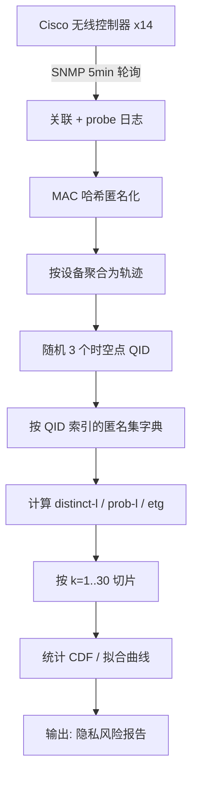
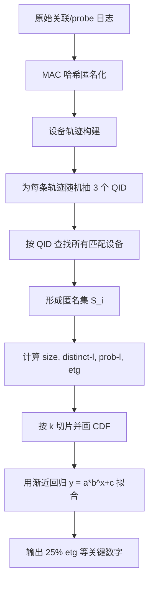

# Your Trajectory Privacy Can Be Breached Even If You Walk in Groups（IWQoS 2016）

> 作者：Kaixin Sui、Youjian Zhao、Dapeng Liu、Minghua Ma、Lei Xu、Li Zimu、Dan Pei  
> 机构：清华大学 TNList（Tsinghua National Laboratory for Information Science and Technology）  
> 发表年份：2016  
> 会议/期刊：IWQoS 2016（IEEE/ACM International Symposium on Quality of Service）  
> 关联 PDF：同目录下 `iwqos16-sui.pdf`

## 一、文档信息速览

| 字段 | 值 |
|---|---|
| 标题 | Your Trajectory Privacy Can Be Breached Even If You Walk in Groups |
| 作者 | Kaixin Sui, Youjian Zhao, Dapeng Liu, Minghua Ma, Lei Xu, Li Zimu, Dan Pei |
| 机构 | 清华大学 TNList、清华大学计算机系 |
| 发表年份 | 2016 |
| 会议/期刊 | IWQoS 2016 |
| 分类 | 轨迹隐私 / Wi-Fi 测量 / k-匿名 / 多样性 |
| 核心问题 | 企业 Wi-Fi 网络可大规模采集用户室内轨迹，但现有基于 k-匿名（k-anonymity）的发布方案无法保证匿名集内敏感属性多样性，仍存在严重隐私泄露风险 |
| 主要贡献 | (1) 第一个对 Wi-Fi 室内轨迹数据集"低多样性"风险的定量研究；(2) 利用 4 周清华校园 154,354 台设备、2,670 个 AP 的轨迹数据分析；(3) 揭示即使满足 5-匿名，仍有 25% 个体敏感属性（top-2 位置）可被轻易猜测；(4) 拟合指数衰减曲线证明增大 k 对多样性提升效果有限 |

## 二、背景（Background）

随着移动终端普及和 Wi-Fi 部署规模化，企业级 Wi-Fi 网络（校园、机场、商场等）已经成为最普遍的"最后 100 米"接入方式。由于 4 km² 的清华校园内部署了 2,670 个 Cisco 无线 AP，每 5 分钟可对全部已关联或主动 probe 的设备进行位置采样，得到 154,354 台设备的轨迹。这种室内级轨迹数据对位置社交网络、邻近营销、移动建模、智能交通都有巨大价值。

但轨迹数据本身极为敏感：一个用户的 top-2 访问位置（home & work）几乎是其身份的强代表。已有工作指出，使用 5 个随机时空点可唯一识别 95% 的用户（re-identification attack）。业界普遍使用 k-匿名（k-anonymity）做发布去标识化，但 k-匿名只保证每个个体的匿名集大小 ≥ k，并未保证集合内敏感属性的多样性。当匿名集中所有个体的 top-2 位置几乎一致时，攻击者无需区分用户就能猜出敏感属性（probabilistic inference attack）。这种"低多样性风险"在轨迹场景下尤其严重，因为准标识符（QID，例如 3 个随机时空点）和敏感属性（top-2 位置）都来自同一轨迹，互相依赖、互相约束。

## 三、目的（Problems Solved）

- **轨迹隐私威胁的定量评估**：基于真实大规模 Wi-Fi 轨迹，给出低多样性风险的具体比例。
- **k-匿名有效性的质疑**：验证"k 越大越安全"的经验直觉在轨迹数据上是否成立。
- **多样性与 k 的关系建模**：用渐进回归（asymptotic regression）拟合 $y = a \cdot b^x + c$，定量描述多样性随 k 增长的指数衰减。
- **为多样性导向的轨迹发布方案提供动机**：证明仅靠 k-匿名无法解决隐私问题，需要新的方向。

## 四、核心原理（Principles）

**系统总览**：从清华校园 14 个 Cisco 无线控制器 SNMP 拉取 5 分钟粒度的关联/probe 日志；对 MAC 地址做哈希匿名；将每台设备在时间窗内的位置序列拼接为轨迹；按"3 个随机时空点"作为 quasi-identifier 构建匿名集；用三种多样性指标评估集合质量。

**关键概念**：

- **Quasi-identifier (QID)**：能定位个体的弱标识符；论文取随机 3 个时空点。
- **Sensitive Attribute (SA)**：敏感属性；论文取 top-2 访问位置（home & work）。
- **Anonymity Set $S_i$**：与个体 $i$ QID 相同的所有个体集合。
- **k-anonymity**：$|S_i| \ge k$。
- **Re-identification Attack**：$|S_i| = 1$ 的特殊情形。
- **Probabilistic Inference Attack**：即使 $|S_i| > 1$ 但 SA 单一的攻击。
- **distinct-l**（Distinct l-diversity）：$S_i$ 中 SA 不同取值的个数。
- **prob-l**（Probabilistic l-diversity）：$S_i$ 中最频繁 SA 的出现频率。
- **etg / ntg**：easy-to-guess / not-to-guess；按 SA 是否最高频分类。
- **Asymptotic Regression**：$y = a \cdot b^x + c$ 拟合曲线。
- **RSSI Fingerprint**：通过 AP 接收信号强度表示设备位置。

**数学原理**：

- **k-anonymity 条件**（论文）：

$$
|S_i| \ge k, \quad \forall i \in D
$$

- **l-diversity（distinct）**：

$$
\text{distinct-}l = |\{v \mid v = SA(j), j \in S_i\}|
$$

- **Probabilistic l-diversity**：

$$
\text{prob-}l = \max_v \frac{|\{j \in S_i \mid SA(j) = v\}|}{|S_i|}
$$

- **etg 判定**：

$$
S_i \in \text{etg} \iff SA(i) = \arg\max_v \Pr[SA(j) = v \mid j \in S_i]
$$

- **渐进回归拟合**（$k$ 从 1 到 30）：

$$
y(k) = a \cdot b^k + c
$$

拟合得到的三条曲线：

- distinct-l ≤ 4: $y = 1.06 \times 0.56^k + 0.14$
- prob-l ≤ 4: $y = 0.76 \times 0.87^k + 0.21$
- etg: $y = 1.22 \times 0.72^k + 0.01$

RSS（残差平方和）分别为 0.003、0.013、0.028。

**与现有技术的差异**：相比 CDR 数据集上的轨迹隐私研究，本文利用 5 分钟粒度 Wi-Fi 数据，可描述到 indoor 语义位置（building-floor-room-AP）；相比 k-匿名的定性批评，本文用 4 周数据 + 3 种多样性指标 + 拟合曲线给出定量证据。

## 五、算法详解（Algorithm）

1. **输入 / 输出**：
   - 输入：4 周清华 Wi-Fi 关联/probe 日志，每条 (MAC_hashed, time, AP_name) 三元组。
   - 输出：每个个体 $i$ 的匿名集 $S_i$ 及其大小、distinct-l、prob-l、etg/ntg 标签；按 $k$ 的多样性分布。

2. **核心模块**：
   - **轨迹构建**：将每台设备 5 分钟一次的位置采样按时间串联。
   - **QID 采样**：随机抽取 3 个时空点作为 quasi-identifier。
   - **匿名集生成**：在数据集中查找 QID 完全相同的个体形成 $S_i$。
   - **多样性度量**：计算 $|S_i|$、distinct-l、prob-l、etg 标签。
   - **按 k 切片**：只保留 $|S_i| \ge k$ 的 $S_i$ 计算分布。
   - **曲线拟合**：以 $k=1..30$ 为输入，渐近回归 $y = a \cdot b^x + c$。

3. **伪代码**：

```python
import random
from sklearn.linear_model import LinearRegression

def build_anonymity_set(trajectories, qid_len=3):
    """对每条轨迹，随机抽 3 个时空点作为 QID"""
    sets = {}
    for mac, traj in trajectories.items():
        qid = tuple(sorted(random.sample(traj, qid_len)))
        sets.setdefault(qid, []).append(mac)
    return sets

def diversity_metrics(anonymity_sets, sa):
    """计算每组的 distinct-l, prob-l, etg"""
    metrics = {}
    for qid, group in anonymity_sets.items():
        size = len(group)
        sa_vals = [sa[m] for m in group]
        distinct = len(set(sa_vals))
        prob = max(sa_vals.count(v) for v in set(sa_vals)) / size
        etg = int(sa_vals.count(sa_vals[0]) / size ==
                  max(sa_vals.count(v) for v in set(sa_vals)) / size)
        metrics[qid] = (size, distinct, prob, etg)
    return metrics

def slice_by_k(metrics, k):
    """只保留 |S_i| >= k 的组"""
    return {qid: m for qid, m in metrics.items() if m[0] >= k}

def fit_asymptotic(xs, ys):
    """y = a * b^x + c 拟合"""
    import numpy as np
    A = np.vstack([np.exp(-np.array(xs)), np.ones(len(xs))]).T
    # 简化为 log 线性近似后可由最小二乘得到 a, c，再用 b = exp(系数) 还原
    # 此处示意伪代码
    return (a, b, c)

for k in range(1, 31):
    sliced = slice_by_k(metrics, k)
    plot_cdf(sliced)
```

4. **关键数学**：见 §四。

5. **复杂度分析**：
   - 轨迹构建：$O(N \cdot L)$，$N$ 为设备数，$L$ 为采样点数。
   - 匿名集查询：使用哈希表 $O(1)$，整体 $O(N)$。
   - 曲线拟合：常数 $k$ 范围内 30 个点，最小二乘 $O(k)$。

6. **训练与推理**：无机器学习；纯统计分析与曲线拟合。

7. **示例**：5-匿名下，53% 的 $S_i$ 满足 prob-l ≤ 4，21% 满足 distinct-l ≤ 4，25% 属于 etg（即攻击者仅通过"猜最频繁 top-2 位置"就能猜中 25% 个体的家和工作地）。

## 六、系统架构图（Architecture）



## 七、流程图（Process Flow）



## 八、关键创新点（Key Innovations）

- **+ 第一个室内级大规模轨迹低多样性风险定量研究**：基于 4 周清华 154K 设备、2,670 AP 数据。
- **+ 5-匿名下仍有 25% 个体可被猜中**：揭示"k-匿名=安全"的直觉在轨迹场景下站不住脚。
- **+ 指数衰减拟合**：增大 k 对多样性提升的边际效果迅速衰减；曲线 $y = a \cdot b^x + c$。
- **+ 室内语义位置粒度**：相比 CDR/基站/GPS，可识别"主楼 5 层 2 室 #1 AP"这样的细粒度信息。
- **+ 5 分钟粒度采样**：相比小时级 CDR，频率高 12 倍以上，可检测到偶发行为。
- **+ 3 种多样性指标 + 2 个数据视角**：distinct-l、prob-l、etg 三维度交叉验证。

## 九、实验与结果（Experiments）

- **数据集**：清华校园 4 周 Wi-Fi 关联/probe 日志，4 km² 覆盖 111 栋建筑 2,670 Cisco AP，14 个无线控制器，5 分钟粒度。
- **样本规模**：154,354 台设备轨迹；前 64 个访问量最大的租户用于详细分析。
- **Baseline**：传统 k-匿名轨迹发布方案（不保证多样性）。
- **主要指标**：匿名集大小 CDF、distinct-l CDF、prob-l CDF、etg 比例、指数衰减拟合曲线。
- **关键结果数字**：
  - 65% 的匿名集大小为 1（高可重识别性）；
  - 79% 的 $S_i$ 属于 etg；
  - 在 5-匿名下，53% 的 $S_i$ 满足 prob-l ≤ 4；33% 满足 prob-l ≤ 3；21% 满足 distinct-l ≤ 4；**25% 个体的 top-2 位置可被直接猜中**；
  - prob-l ≤ 4 在 k=30 时仍约 21%，衰减极慢；
  - 拟合曲线残差平方和 0.003 / 0.013 / 0.028（极好拟合）。
- **消融实验**：对比 three metrics 在不同 k 下的衰减斜率，发现 prob-l 衰减最慢。
- **效率分析**：5 分钟粒度轮询对 14 个控制器的开销可忽略。
- **可视化**：CDF + 拟合曲线 + slope-of-fitting 曲线。

## 十、应用场景（Use Cases）

- **企业 Wi-Fi 轨迹发布隐私评估**：校园、机场、商场等场景发布轨迹前的风险审计。
- **k-匿名 / l-多样性 / t-closeness 选型**：为不同应用选择合适的隐私模型提供依据。
- **位置社交网络数据共享**：用户行为轨迹的脱敏发布。
- **智能交通 / 城市感知**：保护用户位置隐私的前提下发布移动模型。
- **多样性导向的隐私保护方案设计**：作为新方案设计的动机。

## 十一、相关论文（Related Papers in this set）

- `lanman16-sui`：清华校园 AP 密度对 Wi-Fi 性能的影响。
- `mobisys16-sui`：WiFiSeer 大规模企业 Wi-Fi 延迟测量。
- `ubicomp16-EDUM`：基于 Wi-Fi 的课堂教育测量。
- `IWQOS_2017_zsl`：交换机 syslog 处理与故障诊断。
- `iwqos16-li`：多接收者 SVC 视频组播 M³。

## 十二、术语表（Glossary）

- **Trajectory**：轨迹；设备位置的时间序列。
- **Quasi-identifier (QID)**：准标识符；用于识别个体的弱属性。
- **Sensitive Attribute (SA)**：敏感属性；本文指 top-2 访问位置。
- **Anonymity Set**：匿名集。
- **k-anonymity**：每个个体至少隐藏于 k-1 个其他个体中。
- **l-diversity**：$S_i$ 中 SA 至少有 l 个不同值。
- **t-closeness**：SA 分布在整体上接近。
- **probabilistic l-diversity**：最频繁 SA 的占比 ≤ 1/l。
- **distinct-l**：不同 SA 取值个数。
- **prob-l**：最频繁 SA 的频率。
- **etg / ntg**：easy-to-guess / not-to-guess。
- **SNMP**：简单网络管理协议。
- **Probe Request**：设备主动发送的扫描请求。
- **AP**：Access Point。
- **MAC Address Hash**：MAC 地址哈希匿名化。
- **OUI**：组织唯一标识符。
- **Asymptotic Regression**：渐近回归 $y = a b^x + c$。
- **RSS (Residual Sum of Squares)**：残差平方和。

## 十三、参考与延伸阅读

- Paper: k-anonymity（Sweeney, 2002）——k-匿名模型。
- Paper: l-diversity（Machanavajjhala, Kifer, Gehrke, Venkitasubramaniam, TKDD 2007）。
- Paper: t-closeness（Li, Li, Venkatasubramanian, ICDE 2007）。
- Paper: Unique in the crowd（de Montjoye, Hidalgo, Verleysen, Blondel, Scientific Reports 2013）——5 个点重识别 95% 用户。
- Paper: Hiding mobile traffic fingerprints（Glove, Gramaglia, Fiore, CoNEXT 2015）——移动流量隐私。
- Paper: Trajectory anonymity publishing（Bonchi, Lakshmanan, Wang, Sigkdd Explorations 2011）。
- Paper: Privacy of user association logs（Tan, Yan, Yeo, Kotz, INFOCOM 2011）——校园 WLAN 用户隐私。
- Paper: Anonymization of location data does not work（Zang, Bolot, MobiCom 2011）——位置数据去标识化。
- 相关论文：`lanman16-sui`、`mobisys16-sui`、`ubicomp16-EDUM`。
