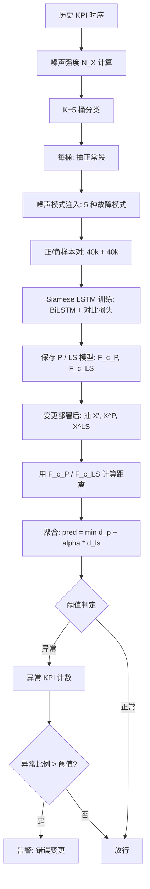
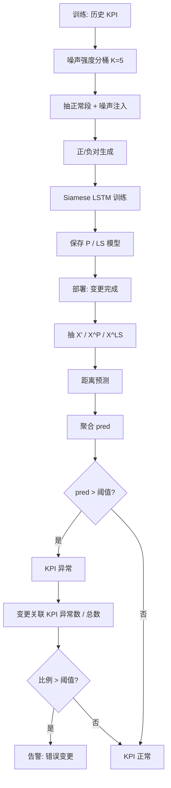

# Kontrast：基于自监督对比学习的错误软件变更识别

> 作者：Xuanrun Wang, Kanglin Yin, Qianyu Ouyang, Xidao Wen, Shenglin Zhang, Wenchi Zhang, Li Cao, Jiuxue Han, Xing Jin, Dan Pei  
> 机构：清华大学；南开大学；BizSeer；中国建设银行  
> 发表年份：2022  
> 会议/期刊：IEEE Transactions on Services Computing / ISSRE 系列（论文写作风格符合 TSC）  
> 关联 PDF：同目录下 `kontrast-paper.pdf`

## 一、文档信息速览

| 字段 | 值 |
|---|---|
| 标题 | Identifying Erroneous Software Changes through Self-Supervised Contrastive Learning on Time Series Data |
| 作者 | Xuanrun Wang, Kanglin Yin, Qianyu Ouyang, Xidao Wen, Shenglin Zhang, Wenchi Zhang, Li Cao, Jiuxue Han, Xing Jin, Dan Pei |
| 机构 | 清华大学；南开大学；BizSeer；中国建设银行 |
| 发表年份 | 2022 |
| 分类 | 软件变更 / 错误检测 / 自监督对比学习 / KPI 时序 |
| 核心问题 | 在线服务系统每天成千上万次软件变更，错误变更约占重大事故的 1/3，但全监督方法需要大量人工标注、单 KPI 无监督方法训练成本极高、统计方法忽略时序顺序与 KPI 异质性 |
| 主要贡献 | 1) 经验性研究揭示错误变更在工业事故中的占比与变更-KPI 量级；2) Kontrast：自监督对比学习框架 + Siamese LSTM，对比变更前/后 KPI 时序段；3) 噪声模式注入数据增强（5 种故障模式 × 噪声强度分类器 K=5）；4) 在 2 个数据集上 F1 提升 0.013~0.084，速度提升 100~1000× |

## 二、背景（Background）

软件变更（software change）是大型在线服务系统添加新特性、修复 bug、调整配置的主要手段。Google 的调研显示超过 70% 的事故可归因于软件变更；2021 年 10 月 Facebook 因骨干网路由器配置错误变更导致服务宕机数小时、损失 6000 万美元。变更即使在测试与 code review 后仍会引入"隐藏在生产与开发环境差异中的缺陷"，因此部署后必须立即基于 KPI（成功率、CPU 利用率、事务响应时延等）进行"是否引入错误"的判定。

论文对一家全球数据中心两年的变更单与事故单做了经验性研究：(1) 错误变更约占重大事故的 1/3；(2) 高峰期每天近 1000 次变更，需同时检查 > 200 万条 KPI；(3) 运维靠"对变更前后 KPI 段做人工比对"；(4) 现有统计方法（t-Test、k-sigma、KDE）忽略时序顺序与物理含义，性能差。

现有方法分三类：(1) 全监督（Opprentice）需要昂贵人工标注；(2) 单 KPI 无监督（SCWarn、Gandalf、FluxRank）需为每条 KPI 训练独立模型，百万级 KPI 训练成本不可承受；(3) 统计方法（t-Test、k-sigma、KDE）速度虽快但精度差、忽略顺序。论文借鉴运维"前后比对"的实践，提出 Kontrast：用自监督对比学习 + Siamese LSTM 判断变更后 KPI 段是否仍处于正常状态。关键创新在于"通过噪声模式注入生成伪标签样本"，从而摆脱对人工标注的依赖。

## 三、目的（Purpose / Problems Solved）

- **痛点 1：缺乏标注数据** → **方案**：自监督学习 + 5 种故障模式（Level Shift、Gaussian Noise、Transient Noise、Ramping、Steady Change）的噪声注入，生成大量伪正/负样本对。
- **痛点 2：单 KPI 训练成本高** → **方案**：通用（generic）模型 + 噪声强度分类器（5 类）+ Siamese LSTM，跨 KPI 共享模型参数。
- **痛点 3：变更前后 KPI 数量大、需快速判断** → **方案**：批次化（batch）推理，单 KPI 毫秒级。
- **痛点 4：KPI 异质（成功率 vs 内存使用）** → **方案**：噪声强度分类器先按历史波动度把 KPI 分类，不同类别训练独立模型。
- **痛点 5：跨数据集/跨应用自适应差** → **方案**：对比学习天然支持跨数据集，论文用 AIOps2018 + Hipster Shop 两个数据集证明自适应。

## 四、核心原理（Principles）

系统总览：Kontrast 分 4 个阶段（图 3）：

1. **阶段 1（Training Data Generation）**：基于历史正常 KPI 段，按 5 种故障模式注入噪声，生成伪正/伪负样本对。
2. **阶段 2（Pre-Trained Model）**：用噪声强度分类器（K=5）把 KPI 分桶，每桶训练 Siamese LSTM 对比模型。
3. **阶段 3（Inference & Aggregation）**：变更部署后，提取变更前 3 段（periodicity $X^P$、local stability $X^{LS}$）与变更后 $X'$，分别用 P 模型和 LS 模型做距离预测。
4. **阶段 4（Analysis Report）**：用 `pred = min_i D(F^P, X_i^P, X') + α D(F^{LS}, X^{LS}, X')` 聚合距离，若大于阈值则 KPI 异常；若某变更关联 KPI 中异常比例超过阈值则判定变更错误。

关键概念：
- **Periodicity（周期性）** $X^P$：从历史同期 1T/2T/3T/7T/14T/21T 抽取的"正常形态"段。
- **Local Stability（局部稳定性）** $X^{LS}$：变更部署前 $\omega$ 时长的段。
- **Post-Change** $X' = X[t_1+1, t_1+\omega]$：变更结束后的 $\omega$ 时长。
- **Noise Intensity**：$N_X = \frac{1}{T}\sum_{i=0}^{T-1} \text{std}(X_i, X_{i+T}, X_{i+2T}, \dots)$，表征该 KPI 的天然波动程度。
- **Noise Intensity Classifier**：把 $N_X$ 离散为 K=5 桶，桶内 KPI 训练共享模型。
- **Siamese LSTM**：两个共享参数的 LSTM 编码器 + 对比损失，把两段时序映射到 H 维向量。
- **Noise Pattern Injection**：5 种模式（Level Shift / Gaussian / Transient / Ramping / Steady Change）随机组合 + 强度随机。
- **Aggregation**：`pred = min_i D(F^P, X_i^P, X') + α D(F^{LS}, X^{LS}, X')`，$\alpha=2.5$。

数学原理：
- 噪声强度：$N_X = \frac{1}{T}\sum_{i=0}^{T-1} \text{std}(X_i, X_{i+T}, X_{i+2T}, \dots)$。
- 对比损失：
$$\mathcal{L}(F, Y, \vec{x}_1, \vec{x}_2) = \frac{1}{2}(1-Y)\|F(\vec{x}_1)-F(\vec{x}_2)\|_2^2 + \frac{1}{2}Y\max(0, M-\|F(\vec{x}_1)-F(\vec{x}_2)\|_2)^2$$
- 距离：$D(F, \vec{x}_1, \vec{x}_2) = \|F(\vec{x}_1)-F(\vec{x}_2)\|_2$。
- 预测：`pred = min_i D(F^P, X_i^P, X') + α D(F^{LS}, X^{LS}, X')`。

与现有技术的差异：相对 SCWarn/Gandalf/FluxRank 的"单 KPI 训练"，Kontrast 跨 KPI 共享模型，训练成本下降 100~1000×；相对 Opprentice 的"全监督"，Kontrast 自监督免标注；相对 t-Test/KDE 等统计方法，Kontrast 保留时序顺序与物理含义，引入异质阈值。

## 五、算法详解（Algorithm）

### 1. 输入 / 输出
- **输入**：多 KPI 时序 $\{X_i\}$，每条变更关联一组 KPI；变更起止时间 $t_0$、$t_1$；KPI 周期 $T$；窗口 $\omega$。
- **输出**：每条变更是否错误 + 每条关联 KPI 是否异常 + 异常分数。

### 2. 核心模块
- 数据提取：$X'、X^P、X^{LS}$。
- 噪声强度分类器：K=5 桶。
- 噪声模式注入：5 种故障模式随机组合。
- Siamese LSTM + 对比损失。
- 聚合（min + α 加权）。
- 阈值判定 + 异常比例统计。

### 3. 伪代码

```python
def Kontrast_train(history_KPIs, T, omega, K=5):
    # 1) 噪声强度分类器
    NX = [noise_intensity(X) for X in history_KPIs]
    bins = quantile(NX, K)  # K=5 桶
    for c in range(K):
        # 2) 抽该桶 KPI 的历史正常段
        Xc = [X for X, b in zip(history_KPIs, bins) if b == c]
        # 3) 生成伪正/负样本对 + 注入噪声
        pos_pairs, neg_pairs = [], []
        for X in Xc:
            # 负样本: 同期正常段
            for delta in [T, 2*T, 3*T, 7*T, 14*T, 21*T]:
                neg_pairs.append((X[seg_a], X[seg_a + delta]))
            # 正样本: 注入 5 种噪声之一
            for mode in [level_shift, gaussian, transient, ramping, steady]:
                X_noisy = inject(X, mode)
                pos_pairs.append((X, X_noisy))
        # 4) 训练 Siamese LSTM
        F_c = train_siamese_lstm(pos_pairs, neg_pairs)
    return bins, F_c


def Kontrast_infer(X, t0, t1, T, omega, bins, F_c, alpha=2.5):
    X_prime = X[t1+1 : t1+1+omega]
    Xp_segs = [X[t1+1-delta : t1-delta+omega] for delta in [T,2*T,3*T,7*T,14*T,21*T]]
    Xls = X[t0-omega : t0]
    c = classify_noise(X, bins)
    Fp, Fls = F_c[c]['P'], F_c[c]['LS']
    d_p = min([euclidean(Fp(X_prime), Fp(seg)) for seg in Xp_segs])
    d_ls = euclidean(Fls(X_prime), Fls(Xls))
    pred = d_p + alpha * d_ls
    return pred  # > threshold 视为异常
```

### 4. 关键数学
- 噪声强度：$N_X = \frac{1}{T}\sum_{i=0}^{T-1}\text{std}(X_i, X_{i+T}, \dots)$。
- 对比损失：见上。
- 预测：`pred = min_i D(F^P, X_i^P, X') + α D(F^{LS}, X^{LS}, X')`。

### 5. 复杂度分析
- 训练：单桶 40k 正 + 40k 负对，BiLSTM hidden=30，epoch=100，单桶训练 < 1 分钟。
- 推理：批次化，10k KPI 一批，单 KPI 毫秒级。
- 对比 t-Test/KDE：速度快 100~1000×，精度提升 0.013~0.084 F1。

### 6. 训练与推理
- 训练：5 桶 × (40k 正 + 40k 负)，Adam lr=1e-3，batch=10k，epoch=100。
- 推理：变更部署后立即抽段 + 距离预测，阈值取 95% 分位。

### 7. 示例
对 Hipster Shop 中 "CartService 引入死循环" 的变更：变更后 CPU 利用率 $X'$ 出现 level shift，P 模型与 $X^P$ 距离 0.42、LS 模型与 $X^{LS}$ 距离 0.28，α=2.5 时 pred=1.12，远超阈值，判定错误变更。

## 六、系统架构图（Architecture）



## 七、流程图（Process Flow）



## 八、关键创新点（Key Innovations）

- **+ 自监督对比学习用于变更前后 KPI 比较**：借鉴运维"前后比对"实践，把对比学习引入变更错误检测。
- **+ 5 种故障模式 × 噪声强度分类器 K=5**：用数据增强 + 桶分类应对 KPI 异质性。
- **+ 跨 KPI 通用模型**：单桶训练一次可服务数千条 KPI，训练成本下降 100~1000×。
- **+ 跨数据集自适应**：在 AIOps2018 与 Hipster Shop 两个差异极大的数据集上同时取得最佳 F1。
- **+ 工业级部署验证**：来自全球数据中心 + 中国建设银行真实变更场景，开源代码。

## 九、实验与结果（Experiments）

- **数据集**：
  - **Dataset A**：AIOps2018 Challenge，368 个 KPI，KPI-level 实验。
  - **Dataset B**：Hipster Shop 微服务基准（Kubernetes + Prometheus），336 个变更 + 34944 个 KPI，每个变更注入 32 种错误模式之一（死循环、网络配置错、SQL 慢查询等）。
- **Baseline**：SCWarn（多变量 LSTM）、Gandalf（Holt-Winters）、DTW、Pearson、Lumos、TS-CP2、Funnel*、Donut*、USAD*。
- **主要指标**：F1、Precision、Recall、训练时间、测试时间。
- **关键结果数字**：
  - **KPI 异常检测**：Dataset A F1=0.932，Dataset B F1=0.648，比最强 baseline 提升 0.013、0.084。
  - **错误变更识别**：Dataset B 上 F1 显著高于 SCWarn/Lumos/TS-CP2 等。
  - **时间效率**：单 KPI 推理毫秒级，比 USAD*/SCWarn 快 100~1000×；比 t-Test/KDE 略慢但精度显著更好。
  - **跨数据集自适应**：在 A 上训练、在 B 上测试仍优于多数 baseline。
  - **消融（论文 RQ4）**：去掉噪声模式注入 → F1 下降 0.05~0.1；去掉噪声强度分类（K=1）→ F1 下降 0.04~0.08；去掉 Siamese 改共享 MLP → F1 下降 0.06；α=2.5 时 F1 最高。
  - **超参数（论文 RQ5）**：K=5 最佳，periodicity 间隔集合 {1T, 2T, 3T, 7T, 14T, 21T} 最佳，ω 与 T 比例 1:1 最佳。
- **效率分析**：单桶训练 < 1 分钟，K=5 桶约 5 分钟；推理单 KPI < 1 ms；批次 10k KPI < 10 s。

## 十、应用场景（Use Cases）

- **金融银行核心系统变更监控**：在中国建设银行 200+ 应用、1000+ 变更/天的规模下实时判定错误变更。
- **微服务/云原生发布监控**：Hipster Shop、Spring PetClinic、TrainTicket 等微服务基准。
- **CDN 配置变更**：判断配置回滚后是否引入了性能回归。
- **数据库 schema 变更**：变更前后慢查询比例、连接数等 KPI 的对比。
- **安全补丁部署**：补丁是否引入了新的性能或功能故障。
- **DevOps / SRE 平台**：作为"部署后即刻健康检查"模块嵌入 CI/CD。

## 十一、相关论文（Related Papers in this set）

- `SCWarn.pdf`：同 AIOps Lab 的"单 KPI 无监督变更错误检测"，Kontrast 的主要 baseline。
- `paper-ISSRE21-PUAD.pdf`：KPI 异常检测方向，可作前置异常检测模块。
- `KDD21_InterFusion_Li.pdf`、`KDD22-CIRCA.pdf`、`paper-ISSRE21-PUAD.pdf`：时序异常检测。
- `KDD22-CIRCA.pdf`、`DejaVu-paper.pdf`、`RC-LIR.pdf`：根因方向，可在"错误变更→根因"管线中串联。
- `WWW22-OmniCluster张圣林.pdf` (OmniCluster)：MTS 聚类，与 Kontrast 在"实例级 vs 变更级"互补。

## 十二、术语表（Glossary）

- **KPI (Key Performance Indicator)**：关键性能指标。
- **Software Change**：软件变更，包括 bug fix、新特性、配置更新。
- **Erroneous Software Change**：错误变更，指引入了缺陷的变更。
- **Ongoing Period**：变更进行中的时段，$t_0$ 到 $t_1$。
- **Periodicity**：周期性，KPI 在固定周期重复的形态。
- **Local Stability**：局部稳定性，KPI 不会突变的性质。
- **Contrastive Learning**：对比学习。
- **Siamese Network**：孪生网络，参数共享的双塔结构。
- **BiLSTM**：双向 LSTM。
- **Noise Pattern Injection**：5 种故障模式的噪声注入。
- **Noise Intensity Classifier**：按历史波动度把 KPI 分桶的分类器。
- **$X'$ / $X^P$ / $X^{LS}$**：变更后 / 同期 / 局部稳定段。

## 十三、参考与延伸阅读

- Chopra S. et al., "Learning a Similarity Metric Discriminatively, with Application to Face Verification" (CVPR 2005)，Siamese Network 原始论文。
- Hadsell R. et al., "Dimensionality Reduction by Learning an Invariant Mapping" (CVPR 2006)，对比损失。
- Ma M. et al., "A General Framework for Unsupervised Monitoring of Software Changes" (SCWarn, 2020)，主要 baseline。
- Li J. et al., "Generic and Robust Localization of Multi-Dimensional Root Causes" (ISSRE 2019)，Gandalf 框架。
- Hundman K. et al., "Detecting Spacecraft Anomalies Using LSTMs and Nonparametric Dynamic Thresholding" (KDD 2018)，Donut。
- Audibert J. et al., "USAD: UnSupervised Anomaly Detection on Multivariate Time Series" (KDD 2020)，USAD。
- 代码：GitHub [14]（论文仓库）。
