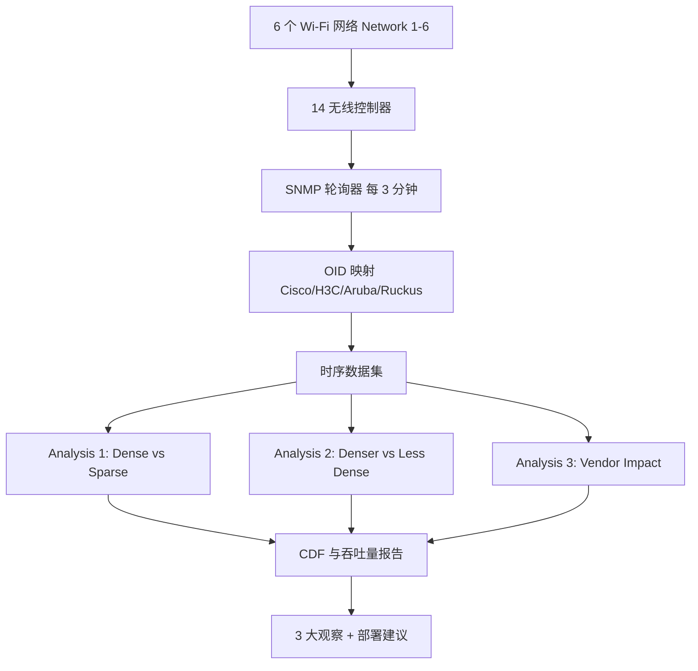
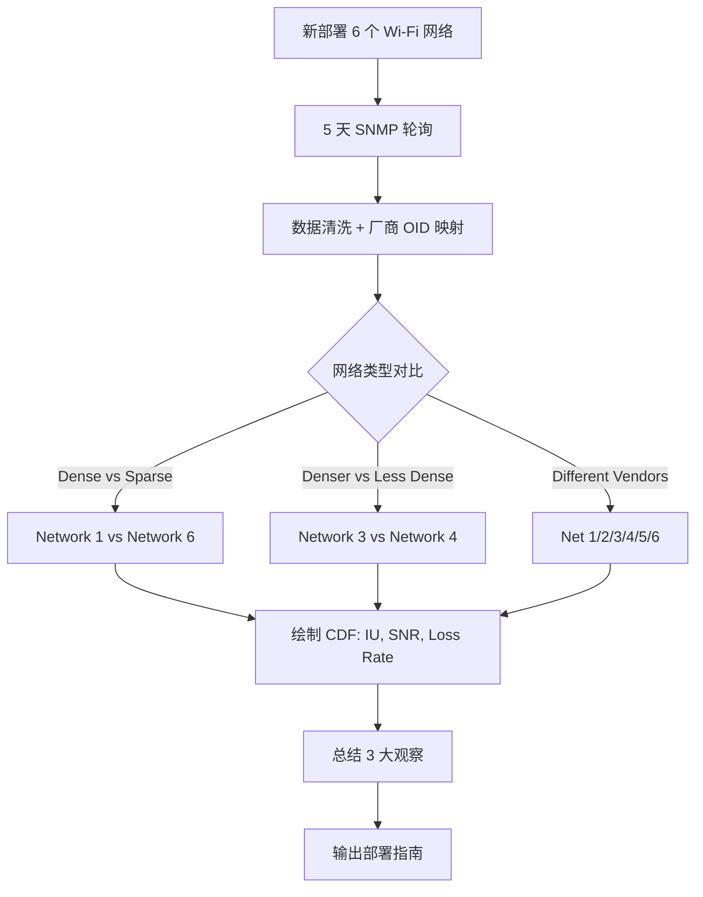

# Understanding the Impact of AP Density on WiFi Performance Through Real-World Deployment（LANMAN 2016）

> 作者：Kaixin Sui、Siqi Sun、Yousef Azzabi、Xiaoping Zhang、Youjian Zhao、Jilong Wang、Zimu Li、Dan Pei  
> 机构：清华大学 TNList（Tsinghua National Laboratory for Information Science and Technology）  
> 发表年份：2016  
> 会议/期刊：LANMAN 2016（IEEE International Symposium on Local and Metropolitan Area Networks）  
> 关联 PDF：同目录下 `lanman16-sui.pdf`

## 一、文档信息速览

| 字段 | 值 |
|---|---|
| 标题 | Understanding the Impact of AP Density on WiFi Performance Through Real-World Deployment |
| 作者 | Kaixin Sui, Siqi Sun, Yousef Azzabi, Xiaoping Zhang, Youjian Zhao, Jilong Wang, Zimu Li, Dan Pei |
| 机构 | 清华大学 TNList、清华大学计算机系 |
| 发表年份 | 2016 |
| 会议/期刊 | LANMAN 2016 |
| 分类 | Wi-Fi 测量 / 企业 AP 部署 / 性能优化 |
| 核心问题 | 企业 Wi-Fi 性能差的两大原因是 EAP 过载和 rogue AP 干扰；提高 EAP 密度 + 禁用以太网口能否系统地改善？什么样的密度最合适？ |
| 主要贡献 | (1) 已知最大规模的真实部署研究 6 个 Wi-Fi 网络、3 种密度、4 个厂商、800+ AP；(2) 发现 3 条核心观察：高密度通常改善 Wi-Fi；过度密集 + 高发射功率反而恶化；AP 厂商也有影响 |

## 二、背景（Background）

到 2018 年全球 Wi-Fi 设备数将达 200 亿；Cisco VNI 报告称 2013 年 Wi-Fi 设备产生的流量占互联网总流量的 55%，到 2018 年将达 61%。Wi-Fi 已成为各类公共场所（校园、企业、商场）不可或缺的"最后 100 米"基础设施。然而关于企业 Wi-Fi（Enterprise WLAN, EWLAN）性能差的抱怨在大学、机场、酒店普遍存在。

造成 EWLAN 性能差的两个主要因素：
1. **过载**：单个 EAP 仅能支持有限数量的客户端，校园等场景下用户/设备数远超设计容量。Tsinghua 校园 4 km²，53,000 学生，11,000 教职工，超过 2,000 个 EAP 服务 50,000+ 设备；
2. **Rogue AP (RAP) 干扰**：用户在网络管理员不知情的情况下私自接入的有线 AP。RAP 数量在清华约为 EAP 的 7 倍，与 EAP 争抢无线频谱。

直观上看"加密 EAP + 禁用 Ethernet"可缓解 RAP 干扰，但难点在于：(1) 部署密度需足够高以承载原 Ethernet+RAP+EAP 流量；(2) 密度越高成本越高；(3) 同信道的 EAP 太近会相互干扰，但 2.4 GHz 只有 3 个不重叠信道。

论文在清华校园真实部署 6 个 Wi-Fi 网络（Network 1-6）、3 种密度、4 个厂商（Cisco、H3C、Aruba、Ruckus），通过 SNMP 数据研究 EAP 密度对 Wi-Fi 性能的影响。

## 三、目的（Problems Solved）

- **EWLAN 过载**：增加 EAP 密度，提高单 EAP 服务用户数控制在合理范围。
- **RAP 干扰**：禁用建筑内 Ethernet，从根源消除用户私接 RAP 的可能。
- **过密部署的负面效果**：分析"高发射功率 + 高密度"组合带来的新干扰。
- **厂商差异**：评估 Cisco / H3C / Aruba / Ruckus 在相同部署下的性能差异。
- **EWLAN 规划指南**：为运营商提供可量化的部署建议。

## 四、核心原理（Principles）

**系统总览**：在 6 个不同 EAP 密度 / 厂商 / 部署时间的清华 Wi-Fi 网络上，每 3 分钟从无线控制器 SNMP 拉取 16 类 MIB 对象（信道利用率、用户数、RSSI、SNR、Loss Rate、Throughput 等），连续采集 5 天；分析不同密度 / 厂商组合下 Wi-Fi 性能。

**关键概念**：

- **EAP (Enterprise AP)**：企业级 Wi-Fi 接入点。
- **RAP (Rogue AP)**：用户私接的有线 AP。
- **Channel Utilization (CU)**：信道利用率，包括 Wi-Fi + 非 Wi-Fi 流量。
- **Interference Utilization (IU)**：其他 802.11 网络在当前信道的干扰占比。
- **MAC Loss Rate**：MAC 层丢包率。
- **RSSI / SNR**：接收信号强度 / 信噪比。
- **CoTS AP**：商用现成 AP。
- **Loss Rate**（论文公式）：

$$
\text{LossRate} = \frac{\text{FailCount} + \text{RetryCount}}{\text{FailCount} + \text{RetryCount} + \text{SuccessCount}}
$$

- **3 密度级别**：Network 1-3 每房 1 AP，Network 4-5 每两房 1 AP，Network 6 10+ 房 1 AP。
- **24 客户端阈值**：超过 24 客户端 / EAP 会产生局部争用问题。

**与现有技术的差异**：与 Stanford、Dartmouth、清华 2015 INFOCOM 等单一校园测量不同，本研究首次系统比较 6 个网络 × 3 密度 × 4 厂商；不仅关注 AP 密度，还把厂商差异纳入分析。

## 五、算法详解（Algorithm）

1. **输入 / 输出**：
   - 输入：6 个网络 5 天的 SNMP 轮询数据。
   - 输出：每种部署方案的 Wi-Fi 性能分布（CU、IU、Loss Rate、SNR、Throughput、#users）。

2. **核心模块**：
   - **SNMP 轮询**：每 3 分钟拉取 16 类 MIB；为不同厂商（思科、H3C、Aruba、Ruckus）做 OID 映射（Table I）。
   - **Loss Rate 计算**：基于 FailCount、RetryCount、SuccessCount 的丢包率公式。
   - **对比分析**：相同厂商不同密度（Network 1 vs Network 6）；不同密度同厂商（Network 3 vs Network 4）；不同厂商同密度（Network 1/2/3）。
   - **CDF 绘制**：对 SNR、Interference Ratio、Loss Rate、Throughput 画 CDF。

3. **伪代码**：

```python
import time
from collections import defaultdict

def poll_snmp(controllers, mib_map, interval=180):
    """每 3 分钟从 14 个 Cisco/H3C/Aruba/Ruckus 控制器拉 SNMP"""
    data = []
    while True:
        for ctrl in controllers:
            snap = ctrl.snmp_get(mib_map[ctrl.vendor])  # Table I OID 映射
            data.append((time.time(), ctrl.id, snap))
        time.sleep(interval)

def loss_rate(fail, retry, succ):
    """公式 (1)"""
    return (fail + retry) / (fail + retry + succ + 1e-9)

def compare_dense_vs_sparse(net_dense, net_sparse):
    fig, axes = plt.subplots(1, 3, figsize=(15, 4))
    for ax, metric in zip(axes, ['interference', 'snr', 'loss_rate']):
        ax.plot_cdf(net_dense[metric], label='Dense (Net 1)')
        ax.plot_cdf(net_sparse[metric], label='Sparse (Net 6)')
        ax.legend()
    plt.show()
```

4. **关键数学**：Loss Rate 公式 (1)。

5. **复杂度分析**：
   - SNMP 轮询：$O(N_{AP} \cdot M)$，$M$ 为 16 类 MIB；3 分钟一次可承受。
   - CDF 计算：$O(N \log N)$。
   - 厂商间对比：$O(N_{networks} \cdot M)$。

6. **训练与推理**：无机器学习；纯统计分析 + CDF 分布。

7. **示例**：Network 1 (Cisco, dense, 156 APs) vs Network 6 (Cisco, sparse, 165 APs)：Network 1 在 70%+ 情况下 SNR 更高，Loss Rate 显著低于 Network 6；过密的 Aruba Network 3 (1 AP / room) 比 Network 4 (1 AP / 2 rooms) 干扰更高、Loss Rate 更高、吞吐更低。

## 六、系统架构图（Architecture）



## 七、流程图（Process Flow）



## 八、关键创新点（Key Innovations）

- **+ 已知最大规模真实部署研究**：800+ AP、3 密度、4 厂商、5 天数据。
- **+ 实证 3 大观察**：(1) 密度高一般更好；(2) 过密 + 不可调的高发射功率反而恶化；(3) 厂商也有影响。
- **+ Dense vs Sparse 完整对比**：相同 Cisco 厂商，156 vs 165 AP，验证密度 + 禁用 Ethernet 的有效性。
- **+ 厂商 OID 映射表**：Table I 提供 16 类 MIB 对象在 4 个厂商的 OID 对应（部分对象在某些厂商不可用 N/A）。
- **+ 实践建议**：当 Aruba 不可调低发射功率（最小 level 7）时，密度应降到"1 AP / 2 房"以缓解干扰。

## 九、实验与结果（Experiments）

- **数据集**：清华校园 5 天 SNMP 轮询数据，聚焦 2.4 GHz 高峰时段；6 个网络：
  - Network 1: Cisco 156 APs，1 AP / 房，2 学生 / 房，无 RAP。
  - Network 2: H3C 133 APs，1 AP / 房，2 学生 / 房，无 RAP。
  - Network 3: Aruba 124 APs，1 AP / 房，2 学生 / 房，无 RAP。
  - Network 4: Aruba 108 APs，1 AP / 2 房，3 学生 / 房，无 RAP。
  - Network 5: Ruckus 170 APs，1 AP / 2 房，3 学生 / 房，无 RAP。
  - Network 6: Cisco 165 APs，1 AP / 10+ 房（走廊），有 RAP。
- **Baseline**：6 个网络内部互比。
- **主要指标**：Channel Utilization、Interference Ratio、Loss Rate、SNR、Throughput、#users。
- **关键结果数字**：
  - 高峰时段：约 15% AP 服务 > 24 客户端；极端 60 客户端 / AP；
  - 中位 CU 全部 > 50%（远超推荐值）；
  - Network 1 (dense, no RAP) 70%+ 时间 SNR 高于 Network 6；Loss Rate 显著低于 Network 6；
  - Network 3 (denser Aruba) SNR 高于 Network 4 (less dense Aruba)，但 Interference Ratio 也更高，Loss Rate 更高、Throughput 更低；
  - Cisco 在干扰比测量上显著低于 Aruba（可能因双方 MIB 测量方式不同）。
- **消融实验**：分别在不同维度（密度、厂商）做控制变量分析。
- **效率分析**：所有对比均基于 SNMP 现有数据，部署成本低。
- **可视化**：CDF 对比（CU、IU、SNR、Loss Rate、Throughput），5 个子图。

## 十、应用场景（Use Cases）

- **EWLAN 规划与设计**：大学、企业、商场部署 EAP 的密度选择。
- **Rogue AP 治理**：通过禁用 Ethernet + 高密度 EAP 系统性消除 RAP。
- **多厂商 EWLAN 选型**：Cisco / H3C / Aruba / Ruckus 实测性能比较。
- **新建建筑网络规划**：1 AP / 房 vs 1 AP / 2 房 vs 1 AP / 10 房的选择依据。
- **运维优化**：当发现过密 + 不可调高发射功率时，建议减少密度。

## 十一、相关论文（Related Papers in this set）

- `iwqos16-li`：M³ 多层 SVC 视频组播（同一作者群）。
- `iwqos16-sui`：清华 Wi-Fi 轨迹隐私（同一作者群）。
- `mobisys16-sui`：WiFiSeer 大规模企业 Wi-Fi 延迟（同一作者群）。
- `IWQOS_2017_zsl`：交换机 syslog 处理与故障诊断（同一作者群）。
- `ubicomp16-EDUM`：基于 Wi-Fi 的课堂教育测量（同一作者群）。

## 十二、术语表（Glossary）

- **EAP (Enterprise AP)**：企业级 Wi-Fi 接入点。
- **RAP (Rogue AP)**：用户私接的有线 AP。
- **EWLAN**：Enterprise WLAN。
- **SNMP**：简单网络管理协议。
- **MIB**：管理信息库。
- **Channel Utilization (CU)**：信道利用率。
- **Interference Utilization (IU)**：干扰占比。
- **RSSI / SNR**：接收信号强度 / 信噪比。
- **Loss Rate**：MAC 层丢包率。
- **Throughput**：吞吐量。
- **Retry / Fail / Success Count**：重传 / 失败 / 成功计数。
- **Cisco / H3C / Aruba / Ruckus**：4 个 Wi-Fi 设备厂商。
- **Power Level 7**：Aruba AP 最低可配置发射功率等级。
- **OUI**：组织唯一标识符。

## 十三、参考与延伸阅读

- Paper: How bad are the rogues' impact on enterprise 802.11 network performance（Sui, Zhao, Pei, Zimu, INFOCOM 2015）——Rogue AP 影响的早期研究。
- Paper: Analysis of a campus-wide wireless network（Kotz, Essien, MOBICOM 2005）。
- Paper: Analysis of a local-area wireless network（Tang, Baker, MOBICOM 2000）。
- Paper: Voice over the dins（Ji 等, ICNP 2013）——信道利用与冲突容忍。
- Paper: Load-aware spectrum distribution（Moscibroda 等, ICNP 2008）。
- Paper: Traffic-aware channel assignment（Rozner 等, ICNP 2007）。
- Paper: JMB: scaling wireless capacity（Rahul, Kumar, Katabi, SIGCOMM 2012）。
- Paper: CACAO（Yue, Wong, Chan, TPDS 2011）。
- Paper: Cisco VNI Forecast 2013-2018。
- 相关论文：`iwqos16-li`、`iwqos16-sui`、`mobisys16-sui`、`ubicomp16-EDUM`。
