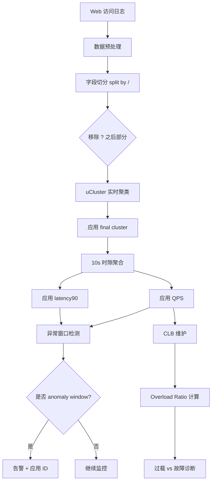
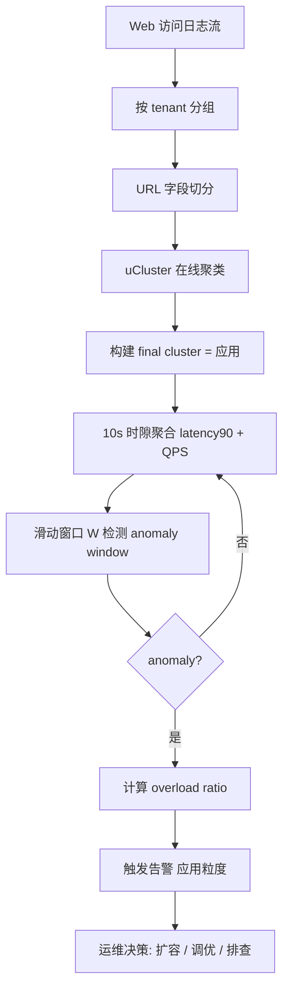

# Application-Aware Latency Monitoring for Cloud Tenants via CloudWatch+（CNSM 2014）

> 作者：Dapeng Liu、Dan Pei、Youjian Zhao  
> 机构：清华大学 TNList、清华大学计算机系  
> 发表年份：2014  
> 会议/期刊：CNSM 2014（10th International Conference on Network and Service Management）  
> 关联 PDF：同目录下 `liu_cnsm14_cloudwatchplus.pdf`

## 一、文档信息速览

| 字段 | 值 |
|---|---|
| 标题 | Application-Aware Latency Monitoring for Cloud Tenants via CloudWatch+ |
| 作者 | Dapeng Liu, Dan Pei, Youjian Zhao |
| 机构 | 清华大学 TNList、清华大学计算机系 |
| 发表年份 | 2014 |
| 会议/期刊 | CNSM 2014 |
| 分类 | 云监控 / Web 性能 / URL 聚类 / 异常检测 |
| 核心问题 | Amazon CloudWatch 等云监控工具只能在 instance/tenant 粒度提供 max/avg/90th 延迟，无法精准监控单个 web 应用；某应用延迟飙升时可能完全被整体指标掩盖 |
| 主要贡献 | (1) 提出应用感知的延迟监控工具 CloudWatch+；(2) 设计 O(n) 复杂度的在线 URL 聚类算法 uCluster；(3) 真实云平台 200+ tenant 验证，CloudWatch+ 能在 1.5s 阈值下发现 472 个异常窗口 vs Amazon CloudWatch 仅 4 个；(4) 875 秒处理全 1 天 12.5G 数据 |

## 二、背景（Background）

云计算平台（Amazon AWS、Windows Azure 等）支撑了 Netflix 等众多关键互联网服务。Web 应用对延迟极度敏感：1 秒延迟增加可导致 11% 的页面浏览下降和 7% 的客户对话损失。Amazon CloudWatch、Windows Azure Metrics、RightScale、New Relic 等云监控工具因此被广泛部署。

然而这些商业监控工具都只能在 instance 或 tenant 级别聚合指标，仅提供 min/avg/max 三种统计：
- 平均和 90th 百分位通常无法捕捉单个应用的延迟飙升；
- 最大值过于抖动、误报太多、几乎不用；
- 监控每个 URL 原始记录则信息量爆炸（如一天数据采样 1/60 后仍有 70,000+ 异常 URL 需要人工分析）。

这种"粗粒度监控"对小流量但业务关键的应用尤其致命：某 VIP 应用只占租户 5% 流量，即使其 90th 延迟飙到 5 秒，被 95% 的"正常"流量平均后整体指标仍看不出异常。

## 三、目的（Problems Solved）

- **应用粒度延迟监控缺失**：从租户级到应用级粒度。
- **URL 多样性爆炸**：97.7% URL 一天仅访问一次；URL 重写让参数位置不可预测。
- **在线实时处理**：监控需要 online、realtime、light-weight。
- **应用过载 vs 故障区分**：判断延迟异常是否因容量不足（overload）所致。
- **零先验知识**：不知道租户跑哪些应用、URL 模式是什么。

## 四、核心原理（Principles）

**系统总览**：CloudWatch+ 由两大模块串联组成——(1) uCluster：基于 URL 模式自动把 70,000+ URL 聚类为 10-100 个 web 应用；(2) Anomaly Detector：按应用独立计算 90th 延迟 / QPS，判断延迟异常 + 推断是否过载。

**关键概念**：

- **Web Application**：从运维角度对一组 URL 的语义聚合。
- **URL Field**：URL 用 "/" 分隔的字段。
- **URL Pattern**：URL 的层级模板，例如 /news/* /user/blog。
- **Virtual Cluster $V$**：URL 聚类的中间结构；记录共享的公共字段 $F(V)$。
- **Final Cluster**：识别出的 web 应用。
- **N (parameter threshold)**：把"子节点数 > N"判定为参数。
- **L (max level)**：URL 树最大深度。
- **latency90**：90th 百分位延迟。
- **QPS**：每秒查询数。
- **CLB (Capacity Lower Bound)**：每个应用的容量下界；用历史"无异常 perfect window"中最大平均 QPS 维护。
- **Anomaly Slot / Window**：异常 10s 时段 / W 个 slot 组成的窗口。
- **Degraded Percentile $P_\alpha$**：对应用 $\alpha$ 的 90th 阈值被整体"稀释"后的新阈值。
- **URL Rewriting**：URL 重写技术，可把参数嵌入路径任意位置。

**数学原理**：

- **应用 $\alpha$ 的退化百分位**：

$$
P_\alpha = \begin{cases}
-\infty, & V_\alpha / V_t < 10\% \\
\frac{100\% - V_\alpha / V_t}{10\%}, & \text{otherwise}
\end{cases}
$$

即应用占租户总流量比例越低，ACW 整体指标能识别的最低百分位越高。
- **URL 距离函数**：

$$
D(u_1, u_2) = \begin{cases}
\infty, & F(u_1) \cap F(u_2) = \emptyset \\
1 / |F(u_1) \cap F(u_2)|, & \text{otherwise}
\end{cases}
$$

- **虚拟簇合并条件**：

$$
\text{LC}(V_1, V_2) = 1 / |F(V_1) \cap F(V_2)| \le 1/l
$$

- **有效吞吐 / 容量下界 CLB**：

$$
\text{CLB}_\alpha = \max_{w \in \text{perfect windows}} \text{avg QPS}(w, \alpha)
$$

- **过载率**：

$$
\text{Overload Ratio} = \frac{|\text{overloaded windows in anomaly period}|}{|\text{all windows in anomaly period}|}
$$

**与现有技术的差异**：与 k-means（NP-hard）、hierarchical clustering（$O(n^3)$）不同，uCluster 是 $O(N \cdot L \cdot n)$ 的在线算法；与基于预定义应用（如 css/js/php）的方案不同，CloudWatch+ 不需要先验知识。

## 五、算法详解（Algorithm）

1. **输入 / 输出**：
   - 输入：web 访问日志流，每条 (timestamp, URL, latency, ...) 四元组；参数 $N$、$L$。
   - 输出：每个 URL 所属 final cluster（应用）、每应用 90th 延迟 / QPS 时序、anomaly windows、overload windows。

2. **核心模块**：
   - **uCluster (Algorithm 1)**：在线 O(N·L·n) URL 聚类；按 L 深度构建虚拟簇，超过 N 子节点的虚拟簇转为 final cluster。
   - **Anomaly Detector**：按 10s 时隙聚合每应用 latency90 和 QPS；W 个 slot 窗口内 n 个 anomaly slot 触发告警。
   - **CLB 维护**：持续用 perfect window 的最大 QPS 估计应用容量。
   - **Overload Ratio**：计算异常窗口中 QPS 超过 CLB 的比例。

3. **伪代码**：

```python
def uCluster(u, L, N):
    """Algorithm 1"""
    current = root
    for d in range(1, min(L, len(u.fields)) + 1):
        merged = False
        if not current.is_final:
            for c in sorted(current.children, key=lambda x: -len(x.urls)):
                if len(c.fields & u.fields) >= d:
                    current = c
                    c.fields |= u.fields
                    merged = True
                    break
            if not merged:
                if len(current.fields) == N:
                    current.set_final()
                    break
                v = VirtualCluster(F(u))
                current.add_child(v)
                current = v
                if d == min(L, len(u.fields)):
                    current.set_final()
    return current

def detect_anomalies(clusters, threshold=1.5, W=10, n=5):
    """滑动窗口 + 异常窗口检测"""
    anomalies = []
    for app_id, app in clusters.items():
        slots = aggregate_qps_latency90(app.accesses, slot_sec=10)
        for i in range(len(slots) - W + 1):
            window = slots[i:i+W]
            n_anom = sum(1 for s in window if s.latency90 > threshold)
            if n_anom >= n:
                anomalies.append((app_id, i, window))
    return anomalies

def estimate_overload(window, app):
    return np.mean([s.qps for s in window]) / app.CLB
```

4. **关键数学**：见 §四。

5. **复杂度分析**：
   - uCluster：$O(n \cdot L \cdot N)$，$L$ 是树深度（一般 ≤ 5），$N$ 是参数阈值（一般 100），实际为 $O(n)$。
   - 异常检测：滑动窗口 $O(S)$，$S$ 为时隙数。
   - CLB 维护：每次 perfect window 时更新 $O(1)$。
   - 整体处理 12.5G/天 数据：**875 秒**。

6. **训练与推理**：
   - 训练：uCluster 在线（无需预训练）。
   - 推理：每条新 URL → 聚类 → 累加 10s 时隙 → 窗口异常检测。

7. **示例**：64 个租户中，ACW 在 1.5s 阈值下仅发现 4 个租户异常（11/15/17/28），且异常应用占租户总流量 24.2% - 99.7%；CloudWatch+ 在 n/W=3/10 时发现 472 个异常窗口，按应用分别报警。Tenant 2 的 /i/submit 应用最长一次异常持续 6100 秒，过载率 73.61%。

## 六、系统架构图（Architecture）



## 七、流程图（Process Flow）



## 八、关键创新点（Key Innovations）

- **+ 应用感知监控**：把延迟监控粒度从 tenant 级下沉到 URL 聚类后的 web 应用级。
- **+ uCluster 在线 O(n) 算法**：层次虚拟簇 + N 阈值参数，无须先验知识。
- **+ 退化百分位公式**：定量解释为何 ACW 看不见小流量应用。
- **+ CLB 容量下界**：把"延迟异常是否因过载"作为可计算的副产品。
- **+ 真实云 200+ tenant 验证**：12.5G 数据、33M 记录、64 重点租户、2100+ 应用。
- **+ 处理 1 天数据仅 875 秒**：CPU 100% 单核可承受。

## 九、实验与结果（Experiments）

- **数据集**：合作云 1 天 web 访问日志，覆盖 200+ tenant；峰值 42K QPS（22:00 附近）；采样率 1/60；总共 12.5G、33M 记录；前 64 重点 tenant 用于详细分析。
- **Baseline**：Amazon CloudWatch（ACW）1.5s 阈值；n/W=3/10、4/10、5/10 三种敏感度。
- **主要指标**：异常窗口数、anomaly 应用流量比例、overload ratio、运行时间、内存占用。
- **关键结果数字**：
  - ACW 在 1.5s 阈值下仅发现 4 个 tenant (11/15/17/28) 异常，异常应用占流量 65.8% / 24.2% / 99.7% / 96.6%；
  - CloudWatch+ (CW+) n/W=3/10 时发现 **472 个 anomaly 窗口**；n/W=5/10 时仍 123 个；
  - Tenant 1 的 /sign/add? 异常 100s 窗口，latency90=2.73s，过载率 100%；
  - Tenant 2 的 /i/submit 异常 6100s 窗口，latency90=3.21s，过载率 73.61%（确认是 DB 过载）；
  - 1 天数据处理时间 875 秒；最大聚类数 10000；2700 行 C++ 代码。
- **消融实验**：N=100、L=7 的不同设置下聚类粒度（top 10 租户聚类数随 L 变化）。
- **效率分析**：单日 12.5G 处理 875 秒，CPU 100% 单核可承受；存储可忽略。
- **可视化**：图 12 n/W 三档对比的 2100 应用异常点云、图 13 聚类数随时间变化。

## 十、应用场景（Use Cases）

- **云租户级 SLA 监控**：对每个 web 应用独立监控延迟，及时发现小流量关键应用的退化。
- **云服务过载 vs 故障诊断**：判断异常是容量不足还是软件 bug。
- **自动扩容触发**：基于 CLB / overload ratio 决定是否扩容。
- **多租户 SaaS 平台监控**：把单一实例的延迟归因到不同租户的不同应用。
- **企业 IT 监控**：在企业网关上做应用感知监控。

## 十一、相关论文（Related Papers in this set）

- `iwqos16-li`：M³ 多层 SVC 视频组播。
- `iwqos16-sui`：清华 Wi-Fi 轨迹隐私。
- `lanman16-sui`：AP 密度对 Wi-Fi 性能的影响。
- `mobisys16-sui`：WiFiSeer 大规模企业 Wi-Fi 延迟。
- `IWQOS_2017_zsl`：交换机 syslog 处理与故障诊断。
- `ubicomp16-EDUM`：基于 Wi-Fi 的课堂教育测量。

## 十二、术语表（Glossary）

- **Tenant**：云租户。
- **Web Application**：web 应用。
- **CloudWatch**：Amazon 云监控服务。
- **URL Clustering**：URL 聚类。
- **uCluster**：本论文的在线 URL 聚类算法。
- **Virtual Cluster**：虚拟簇（聚类中间结构）。
- **Final Cluster**：最终簇（应用）。
- **N (parameter threshold)**：参数阈值（默认 100）。
- **L (max level)**：最大 URL 层级（默认 5-7）。
- **latency90**：90th 百分位延迟。
- **QPS**：每秒查询数。
- **CLB**：Capacity Lower Bound，容量下界。
- **Perfect Window**：无 anomaly slot 的窗口。
- **Anomaly Slot**：单时隙延迟超阈值。
- **Anomaly Window**：W 个时隙中 ≥ n 个 anomaly 的窗口。
- **Overload Ratio**：过载率。
- **Degraded Percentile**：退化百分位。
- **URL Rewriting**：URL 重写。

## 十三、参考与延伸阅读

- Paper: Dealer（Hajjat 等, CoNEXT 2012）——应用感知的请求分割。
- Paper: Fine grain performance evaluation of e-commerce sites（Andreolini, Colajanni, Lancellotti, Mazzoni, SIGMETRICS 2004）。
- Paper: Service performance and analysis in cloud computing（Xiong, Perros, SERVICES 2009）。
- Paper: DDoS-Shield（Ranjan 等, TON 2009）——应用层 DDoS 防御。
- Paper: The performance of web applications（Simic, 2008）。
- Paper: Threshold compression for 3G scalable monitoring（Lee, Pei 等, INFOCOM 2012）。
- Paper: Argus（Yan 等, INFOCOM 2012）——ISP 端到端异常检测。
- Paper: A provider-side view of web search response time（Chen, Mahajan, Sridharan, Zhang, SIGCOMM 2013）。
- 工具：Amazon CloudWatch、Windows Azure Metrics、RightScale、New Relic。
- 相关论文：`iwqos16-li`、`iwqos16-sui`、`lanman16-sui`、`mobisys16-sui`。
