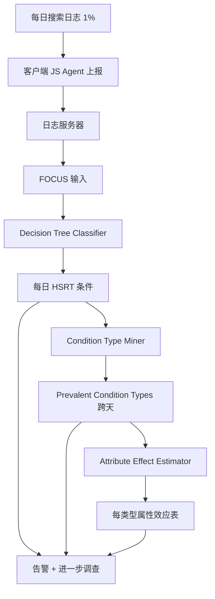
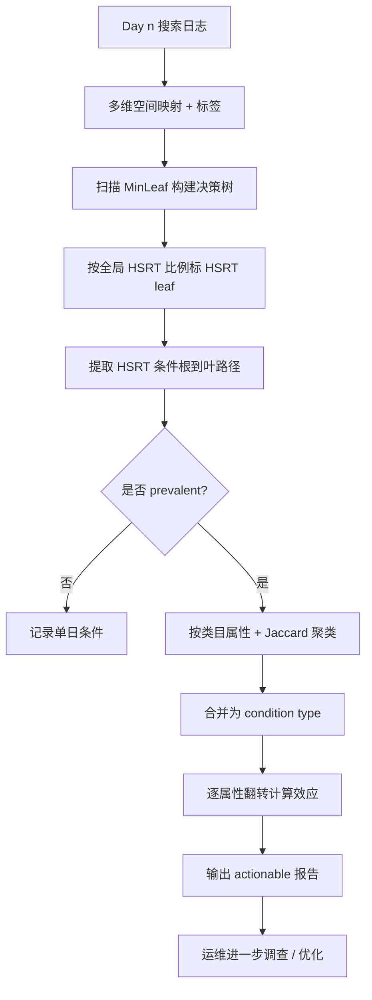

# FOCUS: Shedding Light on the High Search Response Time in the Wild（INFOCOM 2016）

> 作者：Dapeng Liu、Youjian Zhao、Kaixin Sui、Lei Zou、Dan Pei、Qingqian Tao、Xiyang Chen、Dai Tan  
> 机构：清华大学（计算机系/TNList）、百度  
> 发表年份：2016  
> 会议/期刊：INFOCOM 2016（IEEE International Conference on Computer Communications）  
> 关联 PDF：同目录下 `liu_infocom16_focus.pdf`

## 一、文档信息速览

| 字段 | 值 |
|---|---|
| 标题 | FOCUS: Shedding Light on the High Search Response Time in the Wild |
| 作者 | Dapeng Liu, Youjian Zhao, Kaixin Sui, Lei Zou, Dan Pei, Qingqian Tao, Xiyang Chen, Dai Tan |
| 机构 | 清华大学、百度 |
| 发表年份 | 2016 |
| 会议/期刊 | INFOCOM 2016 |
| 分类 | 搜索引擎 / SRT 调试 / 决策树 / 机器学习 / 性能分析 |
| 核心问题 | 搜索响应时间（SRT）过长影响用户与收入；如何在多维搜索日志中自动定位"高 SRT 集中"的条件而非生成大量重叠报告 |
| 主要贡献 | (1) 第一个面向多维搜索日志的 HSRT 条件识别框架；(2) 决策树分类器 + 条件类型聚类 + 属性效应估计；(3) 部署 2.5 个月、分析约 10 亿搜索日志；(4) 较 critical clustering 减少 90% 待查项，Recall / Precision 双高；(5) 引导 1 项实际优化：base64 编码图片使 80% 分位 SRT 减少 253ms、HSRT 比例减少 1/3 |

## 二、背景（Background）

Web 搜索是全球最普及的互联网服务之一，每天数百亿查询。每 0.1s 延迟让 Amazon 损失 1% 销售额；0.5s 额外延迟让 Bing 收入减少 1.2%。然而大量测量研究表明，Web 响应时间在现实中并不罕见地超出预期。

论文聚焦于某大型中文搜索引擎 S（主要服务中国大陆，每天处理数亿查询），通过在搜索结果页注入 JavaScript agent，随机采样 1% 的 PC 浏览器查询，记录 SRT、SRT 组件（$T_{server}$、$T_{net}$、$T_{browser}$、$T_{other}$）以及若干已知可能影响 SRT 的属性（浏览器引擎、ISP、地理位置、图片数、是否含广告、加载方式、背景 PV）。

定义：SRT > 1s 称为 HSRT（High SRT）。观测显示 30%+ 的 SRT 超过 1s，HSRT 比例每天稳定在 30% 左右（说明是持续问题而非偶发 DDoS）。

为帮助搜索运维人员调试 HSRT，论文提出 FOCUS，自动回答：(1) HSRT 集中于哪些属性组合？(2) 跨天持续的 HSRT 条件类型有哪些？(3) 在每种 prevalent 类型中，各属性如何影响 SRT？这些答案把"调试空间"缩到几个嫌疑属性 + 特定值。

## 三、目的（Problems Solved）

- **多维属性联合 HSRT 定位**：单维分析无法识别属性组合。
- **属性间相互依赖**：如 Trident LEGC 默认同步加载、WebKit 默认异步 + 多图片 + 广告的组合效应。
- **非重叠 HSRT 条件**：避免 {images > 30}、{ads = yes}、{images > 20, ads = yes} 等重叠结果。
- **属性效应量化**：把 SRT 退化归因到具体属性条件，并区分瓶颈组件。
- **可解释模型**：黑盒模型不适用于运维，需要可被人工理解的 HSRT 条件。
- **数据规模**：单日海量查询需可扩展算法。

## 四、核心原理（Principles）

**系统总览**：FOCUS 包含三个组件：
1. **Decision Tree Based Classifier**：按天把搜索日志映射为多维特征空间，用定制化决策树识别 HSRT 集中区域（HSRT conditions）。
2. **Condition Type Miner**：用 Jaccard 相似度的层次聚类，把每天的 HSRT 条件合并为跨天 condition type。
3. **Attribute Effect Estimator**：通过"翻转"每个属性条件为对立面，估计该属性在 condition type 内对 SRT / 各组件的贡献。

**关键概念**：

- **SRT (Search Response Time)**：从用户提交查询到结果页完全渲染的时间。
- **HSRT (High SRT)**：SRT > 1s。
- **$T_{server} / T_{net} / T_{browser} / T_{other}$**：SRT 的四个组件。
- **HSRT Condition**：覆盖 ≥ 1% 查询且 HSRT 比例 > 全局 HSRT 比例的属性条件组合。
- **HSRT branching attribute condition**：使子节点 HSRT 比例高于父节点的关键属性条件。
- **Prevalent Condition Type**：一个月中出现 ≥ 5 天的条件类型。
- **Distinct-l / Prob-l**：多样性指标。
- **Attribute Effect**：通过翻转一个条件观察 SRT / 组件变化。
- **Variance Type**：条件类型内部属性的边界。

**数学原理**：

- **HSRT 条件判定**：

$$
\frac{\# \text{HSRT queries in condition}}{\# \text{queries in condition}} > \frac{\# \text{HSRT queries in total}}{\# \text{queries in total}}
$$

- **决策树信息增益（选择最佳划分）**：

$$
\text{IG}(X, A) = H(X) - H(X \mid A)
$$

$$
H(X) = -\sum_i P[X = c_i] \log P[X = c_i]
$$

- **类内/类间 HSRT 比例**（用于 HSRT branching 识别）：子节点的 HSRT 比例需大于父节点。
- **条件类型相似度（Jaccard Index）**：

$$
\text{Jacc}(a, b) = \frac{|a \cap b|}{|a \cup b|}
$$

- **簇间相似度**（聚合链接）：

$$
\text{sim}(A, B) = \min_{a \in A, b \in B} \text{Jacc}(a, b)
$$

- **属性效应（翻转一个条件 $c_i$ 为 $\bar{c_i}$）**：

$$
\Delta \text{HSRT}\% = \frac{\text{HSRT}\%(C) - \text{HSRT}\%(C_i')}{\text{HSRT}\%(C)}
$$

**与现有技术的差异**：与 critical clustering（Jiang 等, CoNEXT 2013, 用于视频）相比，FOCUS 使用决策树分类器，避免重叠条件；与 logistic regression / SVM / NN 等黑盒模型相比，FOCUS 生成的 HSRT 条件可解释；与 naive Bayes 相比，决策树不假设属性独立。

## 五、算法详解（Algorithm）

1. **输入 / 输出**：
   - 输入：单日搜索日志（每条 (browser engine, ISP, location, #images, ads, loading mode, background PV, SRT)）；MinLeaf 范围 1%-10%；Jaccard 阈值 $\alpha=95\%/90\%$。
   - 输出：每日 HSRT 条件列表；跨天 prevalent condition type；每类型的属性效应表。

2. **核心模块**：
   - **特征映射**：每条查询映射为多维空间点，标签 = high SRT / low SRT。
   - **决策树构建**：分类属性 one-vs-others 二分；数值属性按 split point 二分；用 information gain 选择最佳；MinLeaf 决定何时停；叶节点 HSRT 比例 > 全局则标为 HSRT leaf。
   - **HSRT 条件提取**：每条根到 HSRT leaf 的路径 = 一个 HSRT 条件。
   - **条件类型聚类**：按 (i) 相同属性组合 + (ii) 相同类目属性值 + (iii) 数值属性区间 Jaccard 相似度合并。
   - **属性效应估计**：把 condition $C$ 中每个条件 $c_i$ 翻转为对立面 $\bar{c_i}$，得到 $C_i'$，对比 SRT 和组件。

3. **伪代码**：

```python
def decision_tree_classifier(data, min_leaf_range):
    """单日决策树"""
    best = None
    for min_leaf in min_leaf_range:
        tree = DecisionTree(min_leaf=min_leaf, criterion='entropy')
        tree.fit(data.features, data.labels)
        # 标 HSRT leaf：fraction > global_hsrt_frac
        global_h = data.labels.mean()
        hsrt_leaves = [n for n in tree.leaves() if n.fraction > global_h]
        # 从根到每个 HSRT leaf 提取 HSRT 条件
        conditions = extract_paths(tree.root, hsrt_leaves)
        covered = sum(c.coverage for c in conditions)
        n_conditions = len(conditions)
        # 选 min_leaf：coverage 最大，tie-break 选最少 condition
        if best is None or covered > best.covered or (
            covered == best.covered and n_conditions < best.n):
            best = (min_leaf, conditions, covered)
    return best

def condition_type_miner(daily_conditions, alpha_img=0.95, alpha_pv=0.90):
    """跨天聚类"""
    # 按 (i) 相同属性组合 (ii) 相同类目属性值分组
    groups = group_by_categorical(daily_conditions)
    types = []
    for g in groups:
        # 对每个数值属性层次聚类
        for attr in g.numeric_attrs:
            clusters = hierarchical_cluster(g.intervals[attr],
                                            lambda a, b: jaccard(a, b),
                                            stop=lambda A, B: sim(A, B) < alpha)
            g.intervals[attr] = clusters
        types.append(g)
    return types

def attribute_effect_estimator(C, logs):
    """对每个属性条件 c_i 翻转为对立面 c_i_bar"""
    effects = {}
    for i, c_i in enumerate(C.attrs):
        C_prime = flip(C, i)
        hsrt_C = hsrt_frac(logs, C)
        hsrt_Cp = hsrt_frac(logs, C_prime)
        effects[c_i] = {
            'hsrt_pct_change': (hsrt_C - hsrt_Cp) / hsrt_C,
            'srt_change': avg_srt(logs, C) - avg_srt(logs, C_prime),
            'tnet_change': ...,
            'tsrv_change': ...,
            'tbrowser_change': ...,
            'tother_change': ...,
        }
    return effects
```

4. **关键数学**：见 §四。

5. **复杂度分析**：
   - 决策树：$O(N \cdot d \cdot \log N)$，$N$ 为样本数，$d$ 为属性数。
   - 条件类型聚类：$O(C^2)$，$C$ 为条件数（一般数百）。
   - 属性效应：对每个属性翻转需对当天数据重算统计，$O(C \cdot N)$。

6. **训练与推理**：
   - 训练：每 10 折交叉验证 / 每 MinLeaf 扫描。
   - 推理：每日新数据 → 决策树 → HSRT 条件 → 与历史条件类型合并。

7. **示例**：FOCUS 在 Day 1 数据上每天最多生成 4 个 HSRT 条件，而 critical clustering 生成 24-55 个；FOCUS 中位 Recall 75%。Prevalent condition type 中"图片数 > 5-9 且非 WebKit"出现 21 天，覆盖 43% HSRT；翻转该条件使 HSRT 比例降低 61%、SRT 减少 39%。

## 六、系统架构图（Architecture）



## 七、流程图（Process Flow）



## 八、关键创新点（Key Innovations）

- **+ 第一个 HSRT 条件识别框架**：填补多维搜索日志调试工具的空白。
- **+ 决策树分类 + HSRT 标签定制**：在不平衡数据（~30% HSRT）下避免偏向 majority class。
- **+ HSRT branching attribute condition**：精确定位真正"贡献"HSRT 的属性条件。
- **+ Condition Type 跨天聚类**：用 Jaccard 合并相似条件，发现 prevalent 模式。
- **+ Attribute Effect Estimator**：通过翻转条件提供"如果优化 X，HSRT 可降 Y%"的估计。
- **+ 真实部署 + 实际优化**：发现 #images 是 top 改善方向 → base64 编码部署 → 80% SRT 降 253ms，HSRT 比例降 1/3。

## 九、实验与结果（Experiments）

- **数据集**：百度 S 搜索引擎 Day 1-31 第一月 + Day 44-74 第二月部署后，共约 10 亿搜索日志；每条记录 (browser engine, ISP, location, #images, ads, loading mode, background PV, SRT)。
- **Baseline**：critical clustering（Jiang 等, CoNEXT 2013）。
- **主要指标**：HSRT 条件数、Recall、Precision、属性效应（HSRT%/SRT/Tnet/Tserver/Tbrowser/Tother 变化）。
- **关键结果数字**：
  - 每日最多 4 个 HSRT 条件（vs critical clustering 24-55，**减少 90% 待查项**）；
  - FOCUS 中位 Recall ~75%，Precision 高于 baseline；
  - 一个月发现 36 个 condition types；5 个 prevalent（出现 ≥ 5 天）；
  - Prevalent type 1: {#images > 5-9 ∧ browser != WebKit}，21 天，覆盖 43% HSRT；
  - 翻转 #images > 5-9 → HSRT% 降 61%、SRT 降 39%、Tnet 降 26%、Tserver 增 33%（缓存命中率下降解释）、Tbrowser 降 43%、Tother 降 83%；
  - 部署 base64 编码图片：80% 分位 SRT 降 253ms，HSRT 比例从 ~30% 降到 ~20%（降 1/3）。
- **消融实验**：在 Day 44-74 重新运行 FOCUS，发现 optimization 之前的 prevalent types 大多消失，新出现 {loading mode = sync} 等。
- **效率分析**：FOCUS 输出 actionable 报告的时间约数小时/天。
- **可视化**：图 8 CDF 对比 baseline；图 9 condition types 跨天分布；表 III prevalent types；表 IV 属性效应排序。

## 十、应用场景（Use Cases）

- **搜索引擎 SRT 调试**：百度、Google、Bing 等大型搜索引擎的运维团队。
- **大型 Web 服务 QoE 优化**：电商、社交、视频网站的响应时间瓶颈定位。
- **A/B 优化效果评估**：优化前后重新运行 FOCUS，对比 HSRT 模式变化。
- **AIOps 平台决策支持**：可解释 HSRT 条件作为 root cause 分析起点。
- **广告投放策略**：避免高 SRT 页面（影响收入）的过度推送。

## 十一、相关论文（Related Papers in this set）

- `liu_ipccc15_focus`：FOCUS 的早期版本（IPCCC 2015）。
- `iwqos16-li`：M³ 多层 SVC 视频组播。
- `iwqos16-sui`：清华 Wi-Fi 轨迹隐私。
- `lanman16-sui`：AP 密度对 Wi-Fi 性能的影响。
- `mobisys16-sui`：WiFiSeer 大规模企业 Wi-Fi 延迟。
- `IWQOS_2017_zsl`：交换机 syslog 处理与故障诊断。

## 十二、术语表（Glossary）

- **SRT (Search Response Time)**：搜索响应时间。
- **HSRT (High SRT)**：> 1s 的 SRT。
- **$T_{server} / T_{net} / T_{browser} / T_{other}$**：SRT 四个组件。
- **HSRT Condition**：HSRT 集中区域。
- **HSRT branching attribute condition**：HSRT 增长关键条件。
- **Prevalent Condition Type**：跨天出现 ≥ 5 天的条件类型。
- **Critical Clustering**：层次聚类 baseline。
- **Information Gain (IG)**：信息增益。
- **MinLeaf**：决策树叶节点最小样本占比。
- **Jaccard Index**：区间相似度。
- **Variable Importance**：属性重要性。
- **Browser Engine**：WebKit / Gecko / Trident LEGC / Trident 4.0 / Trident 5.0+。
- **Background PV**：30 秒内的查询数。
- **Base64-encoded images**：将图片 base64 编码嵌入 HTML。

## 十三、参考与延伸阅读

- Paper: A provider-side view of web search response time（Chen, Mahajan, Sridharan, Zhang, SIGCOMM 2013）——SRT 研究先行者。
- Paper: Shedding light on the structure of internet video quality problems in the wild（Jiang, Sekar 等, CoNEXT 2013）——critical clustering 来源。
- Paper: Impact of response latency on user behavior in web search（Arapakis, Bai, Cambazoglu, SIGIR 2014）。
- Paper: Latency costs you sales。
- Paper: The user and business impact of server delays（Schurman, Brutlag, Velocity 2009）。
- Paper: Adtributor（Bhagwan 等, NSDI 2014）——收入调试。
- Paper: How speedy is SPDY（Wang 等, NSDI 2014）。
- Paper: Base64 images（Data URI scheme, Wikipedia）。
- Paper: Demystifying page load performance with WPROF（Wang 等, NSDI 2013）。
- 工具：DASH、PageSpeed、SPDY、Base64 编码。
- 相关论文：`liu_ipccc15_focus`、`iwqos16-li`、`mobisys16-sui`。
