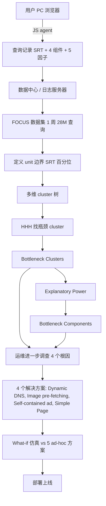
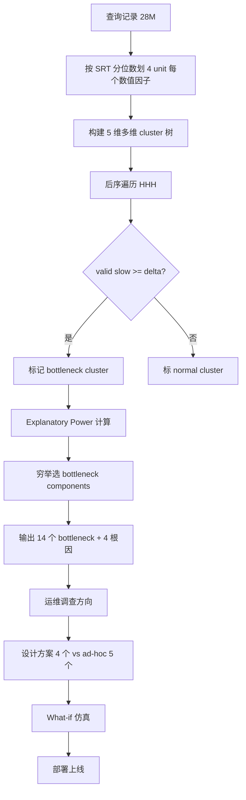

# Narrowing Down the Debugging Space of Slow Search Response Time（IPCCC 2015）

> 作者：Dapeng Liu、Youjian Zhao、Dan Pei、Chengbin Quan、Qingqian Tao、Pei Wang、Xiyang Chen、Dai Tan、Xiaowei Jing、Mei Feng  
> 机构：清华大学（计算机系/TNList）、百度、中石油  
> 发表年份：2015  
> 会议/期刊：IPCCC 2015（IEEE International Performance Computing and Communications Conference）  
> 关联 PDF：同目录下 `liu_ipccc15_focus.pdf`

## 一、文档信息速览

| 字段 | 值 |
|---|---|
| 标题 | Narrowing Down the Debugging Space of Slow Search Response Time |
| 作者 | Dapeng Liu, Youjian Zhao, Dan Pei, Chengbin Quan, Qingqian Tao, Pei Wang, Xiyang Chen, Dai Tan, Xiaowei Jing, Mei Feng |
| 机构 | 清华大学 TNList、清华大学计算机系、百度、中石油 |
| 发表年份 | 2015 |
| 会议/期刊 | IPCCC 2015 |
| 分类 | 搜索引擎 / SRT 调试 / HHH / 多维聚类 / 性能分析 |
| 核心问题 | 慢 SRT 难以定位根因；如何自动识别"瓶颈条件 + 瓶颈 SRT 组件"以缩小调试空间 |
| 主要贡献 | (1) FOCUS 系统首次提出，多维层次聚类 + Hierarchical Heavy Hitter（HHH）+ Explanatory Power 找到瓶颈；(2) 在某全球 top 搜索引擎部署 1 周，2800 万查询；(3) 找到 14 个 bottleneck 集群，4 个潜在根因；(4) What-if 仿真显示基于 FOCUS 的解决方案比 ad-hoc 方案有效 4 倍 |

## 二、背景（Background）

搜索引擎是互联网最普及的应用之一，每天数十亿查询。0.5s 延迟增加会导致 0.6% 搜索量减少和 1.2% 收入下降。论文研究对象为某全球 top 搜索引擎，要求 80% 分位 SRT < 1000ms。

一次搜索过程涉及 5 步：(1) 客户端 DNS 解析 → (2) 数据中心处理 → (3) 浏览器解析 DOM → (4) 加载嵌入图片 → (5) 页面完整渲染。SRT 是这 5 步的用户感知总和，其中 4 个时间点 $t_1, t_2, t_3, t_4$ 把 SRT 分为 4 个组件：$T_{net}$（DNS + 网络）、$T_{srv}$（服务器）、$T_{dom}$（DOM 加载）、$T_{embed}$（嵌入图片）。每个组件反映 SRT 的不同部分。

通过 web instrumentation 技术注入 JS agent，agent 采集 SRT + 4 组件以及多个可能影响 SRT 的属性：CP（计算能力）、NS（网络状态，用 $T_{net}$ 估计）、browser、#image、ad 等。FOCUS 通过多维层次聚类 + HHH 识别瓶颈集群（bottleneck clusters），再用 explanatory power 找瓶颈 SRT 组件。

## 三、目的（Problems Solved）

- **多维影响因子调试空间爆炸**：5 维因子 × 每个因子多个 unit = 大量可能 cluster。
- **重叠 / 不直观的 cluster**：k-means 等聚类结果难以解释。
- **瓶颈定位**：哪些 cluster 实际贡献大量慢查询？哪些 SRT 组件是瓶颈？
- **运维方向性**：把"诊断"缩到 4 个潜在根因。
- **方案有效性对比**：FOCUS 引导的方案 vs 临时方案。

## 四、核心原理（Principles）

**系统总览**：FOCUS 三阶段：
1. **定义 cluster 边界**：对每个影响因子分 4 个 unit (fewer/few/many/more, better/good/bad/worse)；cluster 由 unit + 通配符 `*` 组成。
2. **HHH 找瓶颈 cluster**：5 维多维层次结构，用 valid number $S_i^* = S_i - \max\{D_d^i \mid d \in D\}$ 判定瓶颈。
3. **Explanatory Power 找瓶颈组件**：把每个 SRT 组件的 EP 加权求和，用 Occam's razor 选最简集合。

**关键概念**：

- **SRT Requirement $R(p\%, t)$**：第 p 百分位 SRT ≤ t ms。
- **Slow / Fast Query**：SRT > t / SRT ≤ t。
- **Gap $\Delta = p\% - p_0\%$**：当前 SRT 分布与需求差距（多少慢查询需变快）。
- **Impact Factors**：5 个 (CP, NS, #image, browser, ad)。
- **Unit**：每个因子的离散单元。
- **Bottleneck Cluster**：含 ≥ $\Delta$ 慢查询的 cluster。
- **Bottleneck Component**：贡献最显著的 SRT 组件。
- **Explanatory Power (EP)**：组件对额外 SRT 的解释比例。
- **HHH (Hierarchical Heavy Hitter)**：多维层次中的高频子集。
- **$\Delta\tau_m, \Delta\tau_a, [\tau_s, \tau_e], \xi, \theta$**：SRT 监控时间参数。
- **Occam's Razor**：最简解释原则。

**数学原理**：

- **Gap**：

$$
\Delta = p\% - p_0\%
$$

- **EP 定义**（对组件 $T_i$）：

$$
EP(T_i) = \frac{\delta(T_i)}{\delta}
$$

其中 $\delta = $ slow 与 fast SRT 均值差，$\delta(T_i) = T_i^{slow} - T_i^{fast}$。
- **Bottleneck Component 选取**（Occam's Razor）：

$$
\arg\min_{BC} |BC| \quad \text{s.t.} \quad \sum_{T \in BC} EP(T) \ge H
$$

其中 $H$ = 80%。
- **SRT 估计**（按 fast queries 等比例放大）：

$$
T_{i}^{desired} = T_i^{fast} + \Delta \cdot \frac{T_i^{slow} - T_i^{fast}}{\delta} \cdot (1 - \frac{T_i^{fast}}{\text{SRT}^{fast}})
$$

更直观的线性假设：$T_i^{desired} = T_i^{fast} \cdot (1 + \Delta / \text{SRT}^{fast})$。
- **多维 HHH valid number**：

$$
S_i^* = S_i - \max_{d \in D} D_d^i
$$

其中 $D_d^i$ = 维度 $d$ 上 $i$ 子节点已分到的 slow 查询数。
- **Unit 边界 split point**（在 $t_0 - \varepsilon, t_0, t_0 + \varepsilon$ 取最近 #image 值作为 $s_1, s_2, s_3$）：

$$
s_j = \arg\min_{n} |t(n) - (t_0 + (j-2)\varepsilon)|
$$

**与现有技术的差异**：相比 k-means、DBSCAN 等无监督聚类，FOCUS 给出多维层次结构 + 直观的 unit 边界 + HHH 框架，避免了"指定 k 值"和"无清晰边界"的问题；相比 Adtributor（NSDI 2014）只在收入维度做归因，FOCUS 同时定位瓶颈组件。

## 五、算法详解（Algorithm）

1. **输入 / 输出**：
   - 输入：1 周 28M 查询记录（含 SRT + 4 组件 + 5 因子）；需求 $R(80\%, 1000ms)$；unit 阈值 $N=100$，树深度 $L=5$。
   - 输出：14 个 bottleneck cluster + 每 cluster 的瓶颈 SRT 组件 + 4 个潜在根因。

2. **核心模块**：
   - **Unit 划分**：对每个数值因子按 SRT 百分位附近的 4 个区间离散化。
   - **Cluster 定义**：每个 cluster 是 5 维 unit 的笛卡尔积（或通配符 `*`）。
   - **HHH 识别**：自底向上遍历，把每个 cluster 的 slow 查询归到它，祖先不再重复计。
   - **Explanatory Power**：用 fast query 估计 desired SRT 各组件，再算每个组件 EP。
   - **Bottleneck Component**：用穷举（4 组件）选最小满足 EP ≥ 80% 的集合。
   - **What-if Simulation**：对每个提议方案用 4 个解决方案与 5 个 ad-hoc 方案对比。

3. **伪代码**：

```python
def define_clusters(factors, t0, epsilon, N, L):
    """按 SRT 百分位 t0 划分 unit 边界"""
    units = {}
    for f in factors:
        if f.is_categorical:
            units[f.name] = f.values
        else:
            # 把 f 离散化为 20ms bin
            bins = discretize(f.values, bin_size=20)
            # 在 t0 - eps, t0, t0 + eps 找最近 split point
            splits = [argmin_bin(bins, t0 + (j-2)*epsilon) for j in range(1, 4)]
            units[f.name] = [(0, splits[0]), (splits[0], splits[1]),
                              (splits[1], splits[2]), (splits[2], max(f.values))]
    return units

def hhh_bottleneck(cluster_tree, delta, D):
    """后序遍历找瓶颈 cluster"""
    bottlenecks = []
    for C in post_order(cluster_tree):
        D_C = {}
        # 先递归处理子节点
        for d in D:
            D_C[d] = sum(S[C_child] for C_child in C.children_d[d]
                          if C_child.is_bottleneck)
        S_C_star = S[C] - max(D_C.values())
        if S_C_star >= delta:
            C.is_bottleneck = True
            D[C] = S[C]  # 归到此 cluster，祖先不再重复计
            bottlenecks.append(C)
        else:
            C.is_bottleneck = False
            D[C] = max(D_C.values())
    return bottlenecks

def bottleneck_components(C, fast, slow, H=0.8):
    """Explanatory Power 找瓶颈 SRT 组件"""
    delta = avg_srt(slow) - avg_srt(fast)
    EP = {Ti: (avg(slow.Ti) - avg(fast.Ti)) / delta
          for Ti in ['Tnet', 'Tsrv', 'Tdom', 'Tembed']}
    # 穷举 4 组件的所有子集，选最小满足 sum(EP) >= H 的
    best = None
    for r in range(1, 5):
        for BC in combinations(['Tnet', 'Tsrv', 'Tdom', 'Tembed'], r):
            if sum(EP[T] for T in BC) >= H:
                if best is None or len(BC) < len(best):
                    best = BC
    return best, EP
```

4. **关键数学**：见 §四。

5. **复杂度分析**：
   - Unit 划分：$O(|f|)$ 每个数值因子。
   - 多维 cluster 总数：4^5 = 1024 笛卡尔组合（含 `*` 通配）。
   - HHH 后序遍历：$O(|cluster|)$。
   - 瓶颈组件：穷举 $2^4 - 1 = 15$ 子集。
   - What-if 仿真：$O(queries \cdot solutions)$。

6. **训练与推理**：
   - 训练：unit 划分、HHH 遍历、EP 计算。
   - 推理：新一周数据直接复用同一框架。

7. **示例**：B1 = (NS=worse, ad=yes) 含 4.6% 慢查询，瓶颈组件 $T_{net}$ 与 $T_{embed}$ + $T_{dom}$。运维沿此方向找到 4 个根因（DNS 策略不优、图片阻塞、ad 阻塞 DOM、老浏览器 U1 兼容性差），提出动态 DNS、图片预取、自包含 ad、简化 U1 页面 4 个方案。What-if 仿真显示这些方案比临时方案有效 4 倍。

## 六、系统架构图（Architecture）



## 七、流程图（Process Flow）



## 八、关键创新点（Key Innovations）

- **+ 第一个 SRT bottleneck 定位系统**：填补该领域工具空白。
- **+ 多维层次聚类 + unit 边界**：清晰可解释的 cluster。
- **+ HHH 自底向上归因**：避免祖先节点重复计 slow 查询。
- **+ Explanatory Power + Occam's Razor**：最小集合解释 ≥ 80% 额外 SRT。
- **+ 工业部署 1 周**：28M 查询识别 4 个潜在根因。
- **+ What-if 仿真 4 倍有效**：FOCUS 方案比 ad-hoc 方案 requirement completion 高 4 倍。

## 九、实验与结果（Experiments）

- **数据集**：某全球 top 搜索引擎 1 周（约 2014 年 10 月）2800 万查询；每条含 SRT + 4 组件 + 5 因子。
- **需求**：$R(80\%, 1000ms)$；75.4% 当前为 fast；$\Delta = 4.6\%$。
- **Baseline**：5 个 ad-hoc 方案 (Reduce images, Disable DAT, Complete IP Dict, Improve CDN cache, Fast ad process)。
- **主要指标**：Bottleneck cluster 数、%Slow query、Explanatory Power 分布、Requirement completion %。
- **关键结果数字**：
  - 14 个 bottleneck clusters (B1-B14)，按 %Slow query 排序；
  - B1 = (NS=worse, ad=yes) 含 4.6% slow，%Slow=68.8%，瓶颈组件 $T_{net}$+$T_{embed}$+$T_{dom}$；
  - B5 = (CP=good, NS=worse) 5.9% slow，%Slow=59.1%，瓶颈 $T_{net}$+$T_{embed}$；
  - 4 个潜在根因：(1) DNS 路径选择不优（19% 时间 DNS 选最优路径，理想路径平均快 26%）；(2) 嵌入图片阻塞（U4 浏览器支持图片预取，可改善 $T_{embed}$ 20%）；(3) ad 阻塞 DOM（ad 增加 $T_{dom}$ 41%）；(4) U1 浏览器 $T_{dom}$ 比其他长 65%；
  - 4 个 FOCUS 方案单独 requirement completion 25-36%；ad-hoc 仅 1-12%；
  - 4 方案联合：requirement completion = 113%；
  - 任意 3 方案：80-92%；
  - FOCUS 方案比 ad-hoc 方案好 **4 倍**。
- **消融实验**：单方案 vs 联合方案；B1-B14 中 EP 80% 阈值对结果影响。
- **效率分析**：仿真基于历史数据，无需实际部署即可评估。
- **可视化**：图 9 EP 分布 CDF；图 10 单方案柱状图；图 11 联合方案柱状图；表 II 14 bottleneck 详情。

## 十、应用场景（Use Cases）

- **搜索引擎 SRT 调试**：百度、Google、Bing 等大型搜索引擎的运维团队。
- **大型 Web 服务性能优化**：电商、社交、视频网站。
- **CDN 配置优化**：基于瓶颈 cluster 调整 CDN 部署。
- **AIOps 决策支持**：自动识别瓶颈并量化改进潜力。
- **老旧客户端兼容**：识别 U1 等老浏览器并提供低开销页面。

## 十一、相关论文（Related Papers in this set）

- `liu_infocom16_focus`：FOCUS 的扩展版（INFOCOM 2016）。
- `iwqos16-li`：M³ 多层 SVC 视频组播。
- `iwqos16-sui`：清华 Wi-Fi 轨迹隐私。
- `lanman16-sui`：AP 密度对 Wi-Fi 性能的影响。
- `mobisys16-sui`：WiFiSeer 大规模企业 Wi-Fi 延迟。
- `IWQOS_2017_zsl`：交换机 syslog 处理与故障诊断。
- `ubicomp16-EDUM`：基于 Wi-Fi 的课堂教育测量。

## 十二、术语表（Glossary）

- **SRT (Search Response Time)**：搜索响应时间。
- **$T_{net} / T_{srv} / T_{dom} / T_{embed}$**：SRT 四个组件。
- **$R(p\%, t)$**：SRT 需求（p 百分位 ≤ t ms）。
- **Gap $\Delta$**：当前 SRT 与需求的差距。
- **Slow / Fast Query**：SRT > t / SRT ≤ t。
- **Impact Factor**：影响 SRT 的因素（CP, NS, #image, browser, ad）。
- **Unit**：因子离散单元。
- **Bottleneck Cluster**：含 ≥ $\Delta$ 慢查询的 cluster。
- **Bottleneck Component**：瓶颈 SRT 组件。
- **Explanatory Power (EP)**：组件对额外 SRT 的解释比例。
- **HHH (Hierarchical Heavy Hitter)**：多维层次高频子集。
- **$S_i^*$ / $D_d^i$**：valid number / 维度 d 重复计数。
- **Occam's Razor**：最简解释。
- **DNS**：Domain Name System。
- **DOM**：Document Object Model。
- **CDN**：Content Delivery Network。
- **DAT (Display As Typing)**：逐字显示搜索结果的效果。

## 十三、参考与延伸阅读

- Paper: A provider-side view of web search response time（Chen 等, SIGCOMM 2013）。
- Paper: Adtributor（Bhagwan 等, NSDI 2014）——收入调试。
- Paper: Automatically inferring patterns of resource consumption in network traffic（Estan, Savage, Varghese, SIGCOMM 2003）——HHH 来源。
- Paper: TCP fast open（Radhakrishnan 等, CoNext 2011）。
- Paper: Reducing web latency（Fiedler 等, SIGCOMM 2013）。
- Paper: Prefetching the means for document transfer（Cohen, Kaplan, INFOCOM 2000）。
- Paper: Accelerating last-mile web performance（Sundaresan 等, CCR 2012）。
- Paper: Demystifying page load performance with WPROF（Wang 等, NSDI 2013）。
- Paper: WebProphet（Li 等, NSDI 2010）。
- Paper: G-RCA（Yan 等, TON 2012）——通用根因分析。
- 相关论文：`liu_infocom16_focus`、`iwqos16-li`、`mobisys16-sui`。
