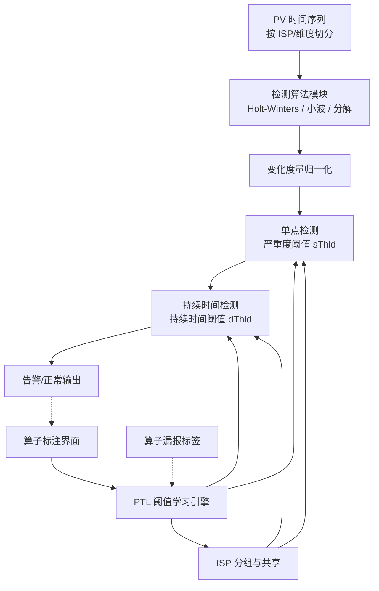
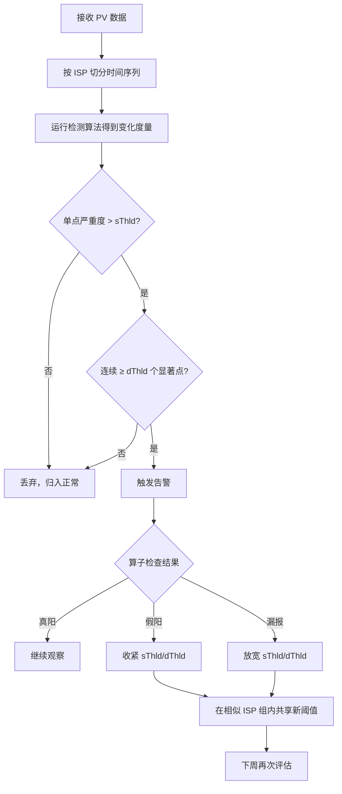

# Learning Thresholds for PV Change Detection from Operators' Labels（IEEE IPCCC 2015）

> 作者：Dapeng Liu, Youjian Zhao, Kaixin Sui, Shiwen Cheng, Dan Pei, Chengbin Quan, Jiao Luo, Xiaowei Jing, Mei Feng
> 机构：清华大学（Tsinghua University）、百度（Baidu）、中石油（PetroChina）、清华信息科学与技术国家实验室（TNList）
> 发表年份：2015
> 会议/期刊：IEEE International Performance Computing and Communications Conference（IPCCC）2015
> 关联 PDF：同目录下 `liu_ipccc15_ptl.pdf`

## 一、文档信息速览

| 字段 | 值 |
|---|---|
| 标题 | Learning Thresholds for PV Change Detection from Operators' Labels |
| 作者 | Dapeng Liu, Youjian Zhao, Kaixin Sui, Shiwen Cheng, Dan Pei, Chengbin Quan, Jiao Luo, Xiaowei Jing, Mei Feng |
| 机构 | Tsinghua University；Baidu；PetroChina；TNList |
| 发表年份 | 2015 |
| 会议/期刊 | IEEE IPCCC 2015 |
| 分类 | 异常检测 / 智能告警 / 时序突变检测 |
| 核心问题 | 给搜索引擎 PV 突变检测自适应地学习严重度阈值与持续时间阈值，而无需运维人员手工调参 |
| 主要贡献 | 1) PTL 框架可自动调阈值；2) 对算子噪声标注具有鲁棒性；3) ISP 间共享学习成果，显著降低标注量；4) 在 4 个月真实 PV 数据上将 103 个 ISP 的漏报率从 96% 降到 9% |

## 二、背景（Background）

搜索/广告业务高度依赖 Page Views（PV）这一核心指标。ComScore 报告显示，Google、Baidu、Yahoo、Yandex、Bing 等顶级搜索引擎每月承载数十亿次搜索请求，搜索结果页及其展示/点击广告构成主要收入来源。一旦 PV 发生显著下跌，意味着背后可能正在发生 DDoS 攻击、数据中心故障、运营商接入网故障、上线缺陷等事故；如果 PV 异常上涨，可能源自 DDoS、流量劫持、异常爬虫或刷量行为。无论是下跌还是上涨，搜索引擎运营商都希望尽量实时地发现这些"显著变化"，以便快速定位、止损。

论文作者在与某大型搜索引擎运维团队访谈后，总结出实际生产中 PV 突变检测面临 4 个挑战：

1. **PV 维度被切得很细**：为了精细监控与收入归因，PV 会按 ISP、设备、广告主、接入网络等维度细分成大量"PV 序列"，因此需要为每个维度单独维护阈值。
2. **不同 PV 重要程度不同**：大型 ISP 贡献了大部分 PV，其异常更值得关注；小型 ISP 的 PV 异常常被忽略。每个 PV 序列的检测标准都不一样，需要单独配置阈值。
3. **常用检测算法需要复杂参数**：例如 Holt-Winters、小波分解、历史均值等，阈值不能直接从算子的认知映射。
4. **算子的判定标准会随时间漂移**：今天是异常的流量，下周可能就被算子认为是正常的——阈值不能"一设了事"。

在 PTL 出现之前，业界做法一是直接套用论文里给出的"经验阈值"（例如基于高斯分布用 2 倍标准差），效果往往很差；二是人工反复试阈值。这种"手动调参"既低效又不可扩展。本论文提出 PTL（Practical Threshold Learning），把"调阈值"这件事转化为"让算子在检测结果上打少数标签"，让系统从这些标签里自动学出严重度阈值与持续时间阈值。

## 三、目的（Problems Solved）

- **痛点**：PV 突变检测算法的严重度阈值与持续时间阈值难以预先量化，又因维度多、漂移快而难以长期维护；人工调参成本高、不可扩展。**方案**：让算子标注检测结果（真/假告警，是否漏报），PTL 自动从这些标签反向学习阈值。
- **痛点**：算子无法保证标注严格准确、标注窗口会有伸缩；**方案**：PTL 对算子标签的不精确、不完整具有鲁棒性，容忍一定范围的窗口扩展。
- **痛点**：每个 ISP 都要单独学，标注量大；**方案**：PTL 通过 ISP 之间的相似度（PV 规模相近），在相似 ISP 之间共享学习结果，把"一次标注"扩散到多个 ISP，显著降低标注开销。
- **痛点**：阈值学习时容易陷入只优化单一指标；**方案**：PTL 同时考虑"严重度阈值"与"持续时间阈值"，并利用变化显著性随严重度/持续时间单调递增这一结构来减少搜索空间。

## 四、核心原理（Principles）

PTL 的核心思想是将阈值视为未知量，把"算子在检测结果上的少量标注"作为监督信号，自动学到严重度阈值与持续时间阈值。其关键洞察有 3 条：

- **观察 1：变化显著性随严重度与持续时间单调递增**。若窗口 m 比 n 更严重、持续更久，则 m 更应当被判为显著变化；若 n 应判为正常，则比 n 更小窗口的 m 也应判为正常。该单调性极大地压缩了搜索空间。
- **观察 2：算子标注存在误差但相对较小**。算子难以精确定位一个显著变化窗口的起止边界，但往往会把窗口拉宽一定比例。基于此，PTL 在利用"漏报标签"时采取保守策略。
- **观察 3：相似 PV 规模的 ISP 检测标准相同**。大规模 ISP 被严格监测，小规模 ISP 较宽松；算子对此有清晰直觉但难以量化。PTL 利用 ISP 的"PV 规模"将 ISP 分组，组内共享学习结果。

### 系统总览

PTL 框架外挂在已有的突变检测算法之上，接收两类输入：(a) 检测算法在每个时间槽输出的"单点变化度量"序列；(b) 算子的标签（真告警、假告警、漏报位置）。PTL 内部维护一组严重度阈值与持续时间阈值，按 ISP 分组进行阈值学习与共享。

### 关键概念

- **窗口（Window）**：连续的时间槽序列 `w = t0~t1`，长度 `lw = t1 - t0 + 1`。
- **变化严重度（Change Severity）**：对窗口内每个槽 `pi`，检测算法给出 `si`；窗口严重度 `sw = min{si | i ∈ w}`。
- **检测阈值**：严重度阈值 `sThld` 与持续时间阈值 `dThld`。当 `sw > sThld` 且窗口连续长度超过 `dThld`，触发告警。
- **变化显著性函数 F(w, T)**：用阈值 T 判定时，窗口 w 被识别为显著变化的可信度。论文给出以下单调性：

$$F(w, T) = 
\begin{cases}
1 & \text{if } s_w > s_{Thld} \wedge l_w > d_{Thld}\\
0 & \text{otherwise}
\end{cases}$$

### 数学原理

对 ISP 分组的关键公式——"归一化窗口大小（nSize）"。论文定义一个 ISP 的"等效归一化严重度窗口长度"为：

$$nSize = \frac{sThld - 1}{dThld - 1}$$

直观上，`nSize` 描述了"严重度每提升 1 个单位，持续时间要缩短多少单位，仍然能触发告警"。这一指标将"严重度阈值"与"持续时间阈值"压缩到一个可比较的标量，使算子能够判断"两个阈值集 T1、T2 谁更松/更紧"。在分组时，PTL 选取每个 ISP 的 nSize 并与同组其他 ISP 做均值比较，偏离均值超过 2 倍标准差（即 95% 置信区间）的 ISP 被视作不属于该组。

### 与现有技术的差异

相比传统做法（人工设阈值、固定默认值、基于优化算法在标签上搜索），PTL 的差异化在于：

- **不要求算子精确定量阈值**，只要在检测结果上打二元或三元标签；
- **容忍算子标注误差与漏标**，把窗口在边界上做一定扩展；
- **跨 ISP 共享学习结果**，利用"相似 ISP 检测标准相同"这一先验大幅降低标注量。

## 五、算法详解（Algorithm）

### 1. 输入/输出

- **输入**：PV 时间序列 `{p1, p2, ..., pt}`；检测算法产生的每槽变化度量 `{s1, ..., st}`；算子的二元/三元标签集 `{label_i}`；初始阈值集 `T0`。
- **输出**：每个 ISP 各自的严重度阈值 `sThld_i` 与持续时间阈值 `dThld_i`。

### 2. 核心模块

- **检测算法模块**（已有算法，如时间序列分解）：产生变化度量。
- **单点检测模块**：判断每个变化度量是否超过严重度阈值。
- **持续时间检测模块**：连续超过阈值的点构成窗口。
- **算子标签收集模块**：告警触发后由算子判定真/假阳/漏。
- **阈值学习模块**：从标签反推严重度阈值与持续时间阈值。
- **共享模块**：将学习结果在相似 ISP 之间扩散。

### 3. 伪代码

```python
# === 阈值学习主循环（PTL 单 ISP 版本） ===
def ptl_learn(isp_id, time_series, measures, labels, init_T, sim_group):
    T = init_T.copy()
    sThld, dThld = T['sThld'], T['dThld']
    
    # Step 1: 在每个时间槽上检测"单点变化是否显著"
    single_signals = [m > sThld for m in measures]
    
    # Step 2: 由连续显著点构成窗口
    windows = group_continuous(single_signals, min_len=dThld)
    
    # Step 3: 用算子标签（真阳/假阳/漏报）更新阈值
    for label in labels:
        if label.kind == 'FALSE_POSITIVE':
            # 收紧：让这个窗口不被检测到
            sThld, dThld = tighten(windows, label, sThld, dThld)
        elif label.kind == 'FALSE_NEGATIVE':
            # 放松：在算子标注的窗口（含扩展）上应被检出
            sThld, dThld = loosen(windows, label.window_extended, sThld, dThld)
    
    # Step 4: 在相似 ISP 组内共享学习结果
    for other in sim_group[isp_id]:
        other['sThld'] = sThld
        other['dThld'] = dThld
    
    return {'sThld': sThld, 'dThld': dThld}
```

### 4. 关键数学

- 变化显著性单调性（论文 Lemma 1 形式化）：
  $$\forall m, n: l_n \geq l_m \wedge s_n \geq s_m \implies F(n, T) \geq F(m, T)$$
- nSize 差异度量：两组阈值 T1、T2 在同一 ISP 上的"等效严重度窗口长度差"：
  $$\Delta = \frac{|(s_{Thld}^{(T_1)} - 1)(d_{Thld}^{(T_2)} - 1) - (s_{Thld}^{(T_2)} - 1)(d_{Thld}^{(T_1)} - 1)|}{\text{归一化项}}$$

### 5. 复杂度分析

论文未给出严格复杂度，但阈值学习本质上是一个约束求解问题，由于 F 的单调性，求解空间被大幅压缩。在每 ISP 维度上，学习开销与"窗口数 × 阈值搜索步长"成正比，相对人工调参可以忽略。

### 6. 训练与推理

- **训练信号**：算子标签（真阳、假阳、漏报、漏标窗口）。
- **训练目标**：在保留单调性的前提下，让阈值集在所有 ISP 上使检测结果与算子标签一致。
- **推理流程**：每个时间槽计算变化度量 → 单点检测 → 持续时间过滤 → 告警。
- **更新策略**：每周对所有 ISP 重做一轮学习。

### 7. 示例

论文 Figure 1 展示的真实 PV 例子：ISP A 在某日 11:00 左右出现 46 分钟的显著下降，整体 PV 看不出来这种细节，必须按 ISP 切分才能看见。PTL 在此场景下可以从算子对该 46 分钟窗口的"漏报"标签中，反向学习到（严重度阈值=2，持续时间阈值=7.84），并将该阈值应用到所有"中等规模"ISP。

## 六、系统架构图（Architecture）



## 七、流程图（Process Flow）



## 八、关键创新点（Key Innovations）

- **+ 从"调阈值"转为"打标签"**：PTL 让算子在已有的检测结果上做二元/三元标注，由系统反向学习严重度阈值与持续时间阈值。这一"反向监督"思路直接解决了算子难以量化阈值的痛点。
- **+ 对算子噪声鲁棒**：通过变化显著性单调性约束以及"漏报标签窗口扩展"机制，PTL 能容忍算子不完全准确、不完全完整的标注，把"标签噪声"的影响限制在可控范围。
- **+ 跨 ISP 共享学习结果**：利用"相似 PV 规模的 ISP 共享同一检测标准"这一观察，PTL 在相似 ISP 组内共享阈值更新，让单条标签对多个 ISP 同时生效，将标注量减少约 38%。
- **+ 与检测算法解耦**：PTL 不依赖具体检测算法（Holt-Winters、时间序列分解、小波分析等均可），可作为"检测器外挂的阈值学习模块"独立部署。
- **+ 真实大规模数据集验证**：4 个月、103 个 ISP、每天数千 PV 点；论文用真实工单与"配对验证"两种方式评估，给出严谨基准。

## 九、实验与结果（Experiments）

### 数据集与基线

- **数据集**：4 个月某全球顶级搜索引擎的真实 PV 数据，按 103 个 ISP 切分。
- **Baseline**：
  - **Fixed Thld**：直接套用论文默认阈值（2, 1.96 等）。
  - **Lazy OP（PTL with lazy operators）**：算子低频检查、低频标注。
  - **Careful OP（PTL with careful operators）**：算子高频检查、高频标注。
  - **Lazy OP with sharing / Careful OP with sharing**：上述两种加上"组内共享"。
- **评估方法**：真实工单（仅 24 条用于总体 PV）+ 配对验证（同一检测算法在不同阈值集下对比）。

### 关键结果数字

- 在 `T = {[10, 9.8]}`（初始阈值过于宽松）下，固定阈值漏报率 FNR 在最差一周高达 96%；PTL（Careful OP with sharing）把 FNR 在第 1 周从 90% 降到 41%，第 13 周降至 9%。
- FPR（假阳率）在所有方法下保持在 8% 左右，PTL 没有显著增加误报。
- 在 `T = {[2, 1.96]}`（过于严格）下，固定阈值触发 3744 条告警；PTL 减少到 84（Lazy OP）/54（Careful OP）条告警，且仍识别 79%~87% 的工单。
- **标注开销**：Careful OP 平均每周需要 47 个标签；加入组内共享后只需 29 个标签，减少 38%。

### 阈值收敛性

通过 `nSize 差异`指标衡量 PTL 学习的阈值与"真实"阈值的接近程度：共享版本比不共享版本收敛更快。

### 效率

PTL 的学习开销与 ISP 数量线性相关；每周学习一次，单 ISP 计算时间相对检测本身可忽略。

## 十、应用场景（Use Cases）

- **搜索引擎 PV 突变检测**：Bing/Google/Baidu 等的运营商监控大屏，实时监测 ISP 维度 PV 异常。
- **广告点击异常监控**：检测广告点击 PV 在某个 ISP 上的突然下跌或上升，识别点击欺诈。
- **CDN 流量监控**：跨 PoP、跨 ISP 维度的流量突变监测。
- **电商交易异常监控**：阿里、京东、eBay 等的订单 PV 在不同区域/接入维度上的异常告警。
- **云服务使用量监控**：AWS、阿里云、Azure 等的租户维度资源使用突变告警。

## 十一、相关论文（Related Papers in this set）

本批次未涉及与 PTL 强相关的同组论文。但本论文作者团队（清华 NetMan AIOks Lab）在以下方向有大量后续工作：

- BGP AS Path Looping（BAPL）测量研究 —— `BAPL_publish_version.pdf`。
- 无线局域网 RAP 影响测量 —— `rap-paper.pdf`。
- 数据中心 CQRD 流干扰缓解 —— `CQRD-ComputerNetworks15.pdf`。
- 跨点队列交换机缓存设计 —— `chen_npc14_CQ.pdf`。
- 云计算租户级应用感知时延监控 —— `liu_cnsm14_cloudwatchplus.pdf`。
- 多 AS 协作的入流量工程 —— `Multi-AS-cooperative-incoming-traffic-engineering-in-a-transit-edge-separate-internet-zhang2014.pdf`。

## 十二、术语表（Glossary）

| 术语 | 含义 |
|---|---|
| PV（Page View） | 用户搜索请求的成功响应数 |
| ISP PV | 来源 IP 属于某一 ISP 的 PV 集合 |
| 严重度阈值（sThld） | 单点变化度量需超过的阈值 |
| 持续时间阈值（dThld） | 连续显著点需达到的最短窗口长度 |
| 窗口（Window） | 连续时间槽序列 `w = t0~t1` |
| FPR / FNR | 假阳率 / 漏报率 |
| nSize | 归一化窗口大小，将 (sThld, dThld) 压缩成可比较的标量 |
| Label | 算子对告警/漏报的二元/三元标注 |
| Sharing | 在相似 ISP 组内共享阈值学习结果 |

## 十三、参考与延伸阅读

- **B. Krishnamurthy, S. Sen, Y. Zhang, S. Embrechts, "Towards Detecting Network Anomalies at CDNs", IEEE INFOCOM 2003**：Holt-Winters 用于 PV 异常检测的代表性工作，PTL 在其阈值层做学习。
- **J. Zheng, Y. Zhao, S. Sui, D. Pei, et al., "Wavelet-Based Network Traffic Anomalies", IEEE TON 2010**：小波检测方法的代表，PTL 可作为其外挂。
- **H. Yan, T. Zhou, Y. Zhao, L. Cui, Z. Jia, A. X Liu, "Time-series decomposition for PV anomaly detection", SIGMETRICS 2013**：本论文检测算法层所用的核心方法。
- **A. B. Sharma, et al., "How are Power Users Different", IMW 2012**：用户行为差异如何影响检测阈值的设计直觉。
- 论文中提到的算子访谈数据来自中国头部搜索引擎运营商（百度），论文在文末致谢中确认。