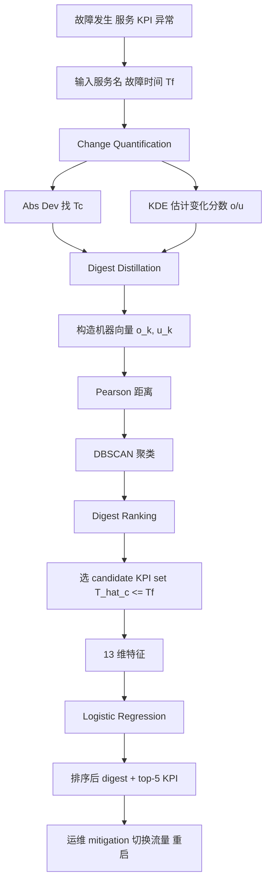
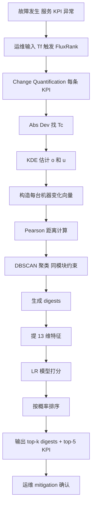

# FluxRank: A Widely-Deployable Framework to Automatically Localizing Root Cause Machines for Software Service Failure Mitigation（ISSRE 2019）

> 作者：Ping Liu, Yu Chen, Xiaohui Nie, Jing Zhu, Shenglin Zhang, Kaixin Sui, Ming Zhang, Dan Pei  
> 机构：清华大学；百度；南开大学；BizSeer；中国建设银行；BNRist  
> 发表年份：2019  
> 会议/期刊：ISSRE 2019（IEEE International Symposium on Software Reliability Engineering）  
> 关联 PDF：同目录下 `liuping-camera-ready.pdf`

## 一、文档信息速览

| 字段 | 值 |
|---|---|
| 标题 | FluxRank: A Widely-Deployable Framework to Automatically Localizing Root Cause Machines for Software Service Failure Mitigation |
| 作者 | Ping Liu, Yu Chen, Xiaohui Nie, Jing Zhu, Shenglin Zhang, Kaixin Sui, Ming Zhang, Dan Pei |
| 机构 | 清华大学；百度；南开大学；BizSeer；中国建设银行；BNRist |
| 发表年份 | 2019 |
| 会议/期刊 | ISSRE 2019 |
| 分类 | 故障定位 / 微服务 / 根因机器 |
| 核心问题 | 软件服务故障时，运维需在分钟级内找到根因机器（成百上千台），传统依赖图方法需要修改源码 / 部署 agent，难以大规模部署 |
| 主要贡献 | (1) 基于 KDE 的非参、轻量 Change Quantification；(2) DBSCAN 聚类生成 Digest；(3) 基于 Logistic Regression 的 Root Cause Digest (RCD) 排序；(4) 70 个真实案例 Top-1 命中率 55/70，Top-3 命中率 66/70，定位时间减少 80%+ |

## 二、背景（Background）

服务失败直接影响用户体验与营收。运维同时监控服务级 KPI（响应时间）与机器级 KPI（CPU 使用率）。故障发生后需要快速 mitigation：切换流量、回滚版本、重启机器等，把服务恢复至正常。在 Kubernetes / Mesos 等高可用架构下，"把根因机器从服务中剔除"已经足以完成 mitigation——不需要精确定位代码 bug。

传统 5 步人工流程：(1) 异常检测；(2) 人工扫描机器 KPI；(3) 人工排序可疑机器组合；(4) 人工触发 mitigation；(5) 开发者分析代码 / 日志。论文统计了 S 公司的 8 个故障案例（29 模块 / 11519 机器 / 9 个月），最大 mitigation 时间 175 分钟，平均 59 分钟。

现有根因定位工作大多依赖 dependency graph（Sherlock、MonitorRank、CauseInfer、FChain、BRCA），但获取这种图要么需要部署 agent、修改源码（侵入式），要么需要 trace、流量包（成本高），在 Agile / DevOps 频繁变更的服务中难以维护。所以根因定位仍以人工为主。

FluxRank 的核心思想：模仿人工 5 步流程的"前 3 步"，但让每一步自动化、可解释。具体包括：Change Quantification（量化每台机器每条 KPI 的变化）+ Digest Distillation（把变化相似的机器聚成 digest）+ Digest Ranking（用 LR 把 digest 排序，根因 RCD 排在前面）。

## 三、目的（Problems Solved）

- **海量 KPI 难量化**：用 KDE 非参估计 47 种不同类型机器 KPI 的分布变化，避免逐类型调参。
- **KPI 难跨类型比较**：把 KDE 输出转化为对数概率（溢出 / 下溢），用几何平均聚合。
- **根因机器难聚类**：用基于 Pearson Correlation 的向量距离 + DBSCAN 把变化模式相似的机器聚成一类。
- **聚类难排序**：用 4 个观察（Observation 1-4）构造 13 个特征 + Logistic Regression 学习"根因排序"。
- **不依赖 dependency graph**：只使用机器 KPI 与服务元数据，不改源码、不抓包。
- **实时性**：端到端 1 分钟内完成运行 + 5 分钟人工确认 = 6 分钟。

## 四、核心原理（Principles）

**系统总览**：FluxRank 三阶段——Change Quantification（Abs Dev 找变化起点 Tc + KDE 计算 change degree o/u）→ Digest Distillation（每台机器生成 KPI 变化向量，用 Pearson 距离 + DBSCAN 聚类成 digest）→ Digest Ranking（每个 digest 构造 13 维特征 + LR 模型预测是否 RCD，排序输出）。

**关键概念**：

- **Service KPI**：服务级 KPI（响应时间）。
- **Machine KPI**：机器级 KPI（CPU、内存、磁盘、网络）。
- **Change Start Time Tc**：KPI 在 look-back window 内变化最显著的绝对导数时刻。
- **Change Degree (o/u)**：基于 KDE 的"上溢 / 下溢"对数概率（几何平均）。
- **Look-back Window [Tf - w1, Tm]**：以故障起始时间 Tf 为基准向前回溯。
- **Digest**：变化模式相似的机器 + KPI 集合。
- **RCD (Root Cause Digest)**：满足"全部机器是 RCM" + "前 5 个 KPI 包含 RK"的 digest。
- **KDE (Kernel Density Estimation)**：非参密度估计。
- **Pearson Correlation Distance**：1 - r。
- **DBSCAN**：基于密度的聚类（minPts=2，eps 由 k-dist 决定）。
- **Logistic Regression / Learning-to-Rank**：点对学习方法。

**数学原理**：

- **Abs Dev 找变化起点 Tc**（论文 §II-A）：对每条 KPI 在窗口内取 |dx/dt| 最大值点为 Tc。论文 §II-A 图 4 给出 CUSUM 与 Abs Dev 对 91 条人工标注 KPI 的 CDF，Abs Dev 距离 0 更近（更准）。

- **KDE 密度估计**（论文 Equation）：

$$
\hat f(x) = \frac{1}{n} \sum_{i=1}^n K(x; x_i)
$$

K 选择依赖 KPI 物理含义：Beta / Poisson / Gaussian（论文 Table I，47 个机器 KPI 中 8 个 CPU + 15 个 Disk + 6 个 Memory + 13 个 Network + 5 个 OS kernel）。

- **变化分数（论文 §II-B Equation）**：对每个 x_j ∈ {x_j}：

$$
o = -\frac{1}{l} \sum_{j=1}^l \log P(X \geq x_j \mid \{x_i\})
$$
$$
u = -\frac{1}{l} \sum_{j=1}^l \log P(X \leq x_j \mid \{x_i\})
$$

- **机器向量**：每台机器 I 的变化向量为 (o_0, u_0, ..., o_k, u_k)。

- **Pearson 距离**（论文 §III-A）：两台机器之间的距离 = 1 - r，r 为向量间的 Pearson 相关系数。

- **Digest 排序特征**（论文 §IV）：每个 digest d 构造 13 维特征——max Tc、min Tc、sum Tc、mean Tc、max std、min std、sum std、mean std、max d、min d、sum d、mean d、ratio（机器数 / 模块机器总数）。

- **Logistic Regression 排序**：

$$
P(\text{RCD}=1 \mid x) = \sigma(w^\top x + b)
$$

**与现有技术的差异**：与 Sherlock / MonitorRank / CauseInfer / FChain / BRCA 等依赖 dependency graph 的方法不同，FluxRank 只用机器 KPI，无需侵入式部署；与 PAL（论文 baseline）相比，PAL 仅按 KPI 起始时间排序，FluxRank 引入聚类与多维特征。

## 五、算法详解（Algorithm）

1. **输入 / 输出**：
   - 输入：故障起始时间 Tf + 所有机器 KPI 历史数据。
   - 输出：排序后的 digest 列表 + 每个 digest 的 top-5 KPI。

2. **核心模块**：
   - **Change Quantification**：
     1. 对每条 KPI 在 [Tf - w1, Tm] 窗口内计算 Abs Dev，找到 Tc。
     2. 取 [Tc - w2, Tc) 数据 {x_i}（w2=1h）作 KDE 模型；取 [Tc, Tm] 数据 {x_j}。
     3. 算 o、u 作为变化分数。
   - **Digest Distillation**：
     1. 把每台机器 (o_k, u_k) 拼成向量。
     2. 用 Pearson 距离 + DBSCAN 聚类（minPts=2，相同模块的机器才能聚一起）。
     3. 每个聚类即一个 digest。
   - **Digest Ranking**：
     1. 选 candidate KPI set（T̂c_k ≤ Tf 的 KPI）。
     2. 提 13 维特征。
     3. 用 LR 模型预测 P(RCD=1)。
     4. 按 P 降序输出，top-5 KPI 也按 max_kd 降序输出。

3. **伪代码**：

```python
def change_quantification(KPI, Tf, Tm, w1=30, w2=60):
    window = KPI[Tf - w1 : Tm]
    Tc = argmax_abs_derivative(window)
    pre = KPI[Tc - w2 : Tc]
    post = KPI[Tc : Tm]
    K = choose_kernel(KPI.type)
    o = -np.mean([log_survival(K.estimate(x), pre) for x in post])
    u = -np.mean([log_tail(K.estimate(x), pre) for x in post])
    return Tc, o, u

def digest_distillation(machines, kernel_per_kpi):
    vectors = []
    for m in machines:
        v = []
        for kpi in m.kpis:
            Tc, o, u = change_quantification(kpi.data, m.Tf, m.Tm)
            v += [o, u]
        vectors.append(v)
    dist = lambda a, b: 1 - pearsonr(a, b)[0]
    clusters = DBSCAN(metric=dist, minPts=2, eps=eps_kdist(dist))
    digests = [Digest(machines_in_cluster, vectors_in_cluster)
               for machines_in_cluster in clusters
               if same_module(machines_in_cluster)]
    return digests

def digest_ranking(digests, LR_model):
    ranked = []
    for d in digests:
        features = extract_13_features(d)
        prob = LR_model.predict_proba(features)[1]
        ranked.append((d, prob))
    return sorted(ranked, key=lambda x: -x[1])
```

4. **关键数学**：见 §四。

5. **复杂度分析**：
   - Change Quantification：对每条 KPI O(N)。
   - Digest Distillation：DBSCAN 平均 O(N log N)。
   - Digest Ranking：LR 推理 O(d)，d=13。
   - 端到端运行时间 < 1 分钟（在 130G/256-core × 2 服务器上）。

6. **训练与推理**：
   - 训练：LR 模型用 5-fold 交叉验证在 70 个故障案例上训练；
   - 推理：故障发生 → 输入 Tf → 触发 FluxRank → 输出排序结果。

7. **示例**：电商订单服务（11,519 台机器）CPU 过载故障：27 台机器 CPU 异常 → FluxRank 把 27 台机器 + M1 模块聚成一个 digest → Top-5 KPI 全是 CPU 相关 → Top-1 RCD 命中根因机器。

## 六、系统架构图（Architecture）



## 七、流程图（Process Flow）



## 八、关键创新点（Key Innovations）

- **+ KDE + Abs Dev**：把"绝对导数找变化起点"和"KDE 算变化分数"组合，无需任何机器学习训练即可处理 47 种异构机器 KPI。
- **+ Pearson + DBSCAN**：用 Pearson Correlation 作为距离比 Euclidean 更鲁棒（论文 Table III：internal 0.193，cross 1.005，比值 5×）。
- **+ 同模块聚类约束**：避免跨模块机器聚到一起，提升可解释性。
- **+ Learning-to-Rank + 13 维特征**：把"是否是 RCD"转为二分类，特征覆盖变化时间、变化幅度、机器比例。
- **+ 真实生产部署**：1 个互联网服务 + 6 个银行服务 3 个月在线运行，Top-1 命中 55/59。

## 九、实验与结果（Experiments）

- **数据集**：5 个生产服务（p1 桌面应用 11,519 台 / p2 移动应用 2,147 台 / p3 监控系统 5,747 台 / p4 金融系统 3,872 台 / p5 监控 238 台）+ 47 种 Linux 机器 KPI + 70 个真实故障案例（论文 Table II）。
- **Baseline**：PAL（仅按 KPI 起始时间排序）。
- **指标**：Recall@1、Recall@2、Recall@3、定位时间。
- **关键数字**（论文 Table IV）：
  - FluxRank（5-fold）Recall@1=55/70=0.78，Recall@2=62/70=0.89，Recall@3=66/70=0.94；
  - FluxRank（2-fold）Recall@1=60/70=0.85，Recall@3=66/70=0.94；
  - PAL Recall@1=10/70=0.14，Recall@3=19/70=0.27；
  - Pearson 距离 cross/internal 比值 5×，其他方法 2-3×；
  - 运行时间约 1 分钟 + 5 分钟确认 = 6 分钟（论文 §VI-F）；
  - 相对 PAL 减少定位时间 80%+（图 10：33 个 case 手动 vs FluxRank）。
- **消融**：表 III 比较 4 种距离函数（Pearson vs Kendall's tau vs Spearman vs Euclidean），Pearson 最佳。
- **案例**：§VI-G 给出 3 个 case——(1) CPU 过载 Top-1 命中；(2) 资源不足 RCD 排第二；(3) 内存过载未进 Top-3，原因是 VM 未监控 KPI。
- **在线部署**：3 个月在线 7 个服务，Top-1 命中 55/59。

## 十、应用场景（Use Cases）

- **互联网搜索 / 电商故障 mitigation**：CPU 过载、内存泄漏等分钟级定位。
- **银行核心系统**：交易失败、响应时间飙升的快速根因定位。
- **金融支付链路**：DB 节点异常 → FluxRank 把数据库机器排到 Top-1。
- **SaaS 多租户服务**：跨租户根因机器定位。
- **DevOps 灰度发布**：新版本引入的回归 → FluxRank 快速定位。

## 十一、相关论文（Related Papers in this set）

- `liuping-camera-ready`（本文）
- `wch_ISSRE-1`（PatternMatcher：根因指标识别）
- `issre-stepwise`（StepWise：概念漂移适应）
- `马明华atc21_JumpStarter`（JumpStarter：多变量异常检测）
- `vldb20_slowsql`（iSQUAD：数据库慢查询）
- `TraceSieve_ISSRE23`（追踪异常检测）

## 十二、术语表（Glossary）

- **Service KPI**：服务级 KPI（响应时间）。
- **Machine KPI**：机器级 KPI（CPU / 内存 / 磁盘 / 网络）。
- **Tc**：KPI 变化起点。
- **KDE (Kernel Density Estimation)**：核密度估计。
- **Beta / Poisson / Gaussian Distribution**：三种用于不同 KPI 类型的核分布。
- **Pearson Correlation Distance**：1 - r，作为聚类距离。
- **DBSCAN**：基于密度的聚类算法。
- **Digest**：变化模式相似的机器 + KPI 集合。
- **RCD (Root Cause Digest)**：包含所有根因机器 + 相关 KPI 的 digest。
- **LR / Learning-to-Rank**：点对学习排序算法。
- **PAL**（论文 baseline）：Propagation-aware Anomaly Localization。
- **Kubernetes / Mesos**：高可用容器编排平台。

## 十三、参考与延伸阅读

- Paper: Sherlock（SIGCOMM 2007）——多级依赖推断。
- Paper: MonitorRank（SIGMETRICS 2013）——基于 trace 的依赖图 + 随机游走。
- Paper: CauseInfer（INFOCOM 2014）——PC-algorithm 因果图。
- Paper: FChain（ICDCS 2013）——黑盒在线故障定位。
- Paper: BRCA（IPCCC 2016）——基于历史告警挖掘因果图。
- Paper: PAL（SLAML 2011）——传播感知异常定位。
- Paper: DBSCAN（KDD 1996）。
- 工具：OpenTSDB、MongoDB、Kafka、Spark、Neo4j、ES-APM。
- 相关论文：`wch_ISSRE-1`、`issre-stepwise`、`马明华atc21_JumpStarter`、`vldb20_slowsql`、`TraceSieve_ISSRE23`。