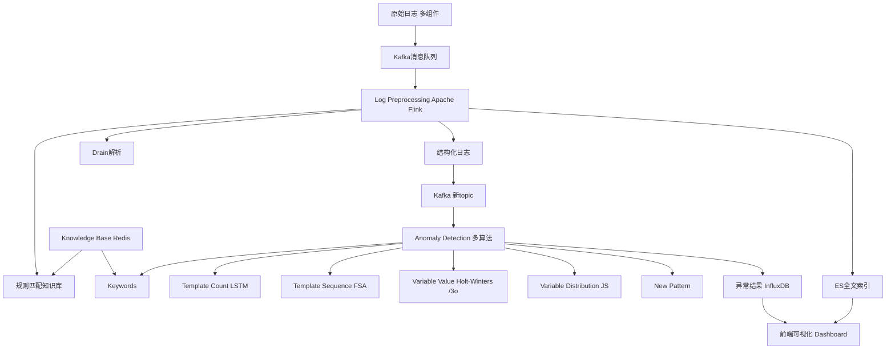
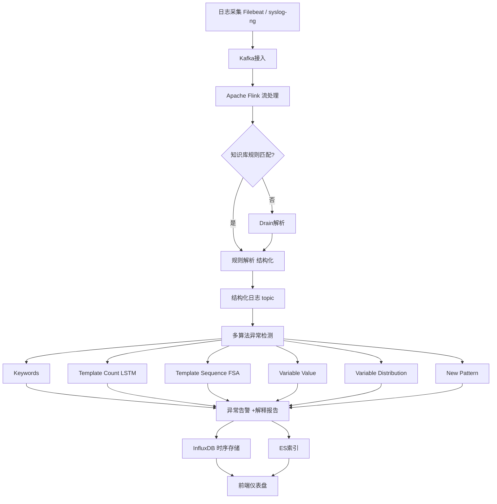

# An Empirical Investigation of Practical Log Anomaly Detection for Online Service Systems（ESEC/FSE2021）

> 作者：Nengwen Zhao, Honglin Wang, Zeyan Li, Xiao Peng, Gang Wang, Zhu Pan, Yong Wu, Zhen Feng, Xidao Wen, Wenchi Zhang, Kaixin Sui, Dan Pei
>机构：清华大学；BNRist；BizSeer；中国光大银行
> 发表年份：2021
>会议/期刊：ESEC/FSE2021（Athens, Greece）
>关联 PDF：同目录下 `logstudy.pdf`

## 一、文档信息速览

|字段 | 值 |
|---|---|
|标题 | An Empirical Investigation of Practical Log Anomaly Detection for Online Service Systems |
| 作者 | Nengwen Zhao, Honglin Wang, Zeyan Li, Xiao Peng, Gang Wang, Zhu Pan, Yong Wu, Zhen Feng, Xidao Wen, Wenchi Zhang, Kaixin Sui, Dan Pei |
|机构 |清华大学；BNRist；BizSeer；中国光大银行 |
| 发表年份 |2021 |
|会议/期刊 | ESEC/FSE2021 |
|分类 | 日志异常检测 /经验研究 /实践系统 |
|核心问题 |现有日志异常检测方法在工业实践中有三大不足：(1) 无法应对多种日志与复杂异常模式；(2)解释性差；(3)缺乏领域知识 |
| 主要贡献 | (1)第一次对真实日志异常检测做大规模实证研究；(2) 在10 个真实日志数据集上评估5 种无监督方法；(3) 提出 LogAD 系统：集成多异常检测方法 +知识库 + 可视化解释，平均 F1达0.83 |

## 二、背景（Background）

日志记录了系统的运行状态和用户行为，是服务可靠性工程的核心数据源。日志异常检测对及时识别事故和快速定位根因至关重要。传统的运维工程师通过人工设置关键词规则（如 "error"、"timeout"）发现异常，但在大型互联网服务系统中（每天产生约2TB 日志），人工规则存在三大根本缺陷：(1)工程师经验有限；(2) 设置规则需要领域知识；(3) 系统持续变更导致规则需不断更新。

为此学术界提出了大量自动日志异常检测方法，包括 PCA、LogCluster、Invariant Mining、DeepLog、LogAnomaly、LogRobust 等。然而把这些方法部署到真实工业系统时，作者发现存在三大挑战：

1. **无法处理多种日志与复杂异常模式**：每个组件（硬件、虚拟机、数据库、网络）都会产生不同类型的日志；日志包含丰富信息（时间戳、模板、变量），因此异常模式多样——关键词、模板计数、模板序列、变量值、变量分布、时间间隔。当前方法主要在 HDFS、OpenStack、BGL 等公开数据集上评估，无法处理多种异常模式。
2. **解释性差**：现有方法多为黑盒，仅输出 "是否异常"，无法告诉运维工程师"为何异常"、"正常模式应该是什么样"。
3. **缺乏领域知识**：完全自动的方法无法决定"哪些日志文件需要监控"、"哪些异常检测方法适合该文件"、"哪些变量值得关注"，这些都需要经验专家决定。

论文开展第一次大规模实证研究：分析某大型企业两年内数万条事件和数百万条日志相关告警，并面向业务、数据库、网络团队访谈资深工程师，得到三个关键发现：(1) 日志异常检测对事件发现与诊断有价值；(2)工程师当前仍主要用关键词规则（因为深度模型黑盒难调参）；(3) 日志类型与异常模式确实多样。

## 三、目的（Problems Solved）

- **RQ1 / RQ2 / RQ3**：实证回答日志在事件管理中的角色、当前实践效果、常用日志与异常模式。
- **RQ4**：评估五种典型无监督方法（PCA、LogCluster、IM、DeepLog、LogAnomaly）在十个真实数据集上的 F1。
- **RQ5**：评估这些方法的训练与检测时间效率。
- **LogAD 系统**：针对实证发现的三大挑战，提出集成多异常检测方法 +知识库 + 可视化报告的工程级系统。
- **三个真实案例**：预测 OOM、检测非法访问、检测服务器宕机。

## 四、核心原理（Principles）

**系统总览**：LogAD包含四大组件：(1) 数据准备；(2) 日志预处理（含知识库辅助规则匹配与 Drain解析）；(3) 日志异常检测（关键词、模板计数、模板序列、变量值、变量分布、新模式）；(4)告警与可视化。论文提出三种核心思想：多检测技术集成应对复杂场景；融合专家经验的知识库辅助日志预处理、算法选择与关键词配置；提供可解释的告警报告。

**关键概念**：

- **Keywords**：直接匹配日志中"致命"关键词（如 "OutOfMemory"、"IOException"）。
- **Template Count**：固定窗口内每种模板的计数序列。
- **Template Sequence**：固定窗口内的模板序列（任务执行顺序）。
- **Variable Value**：变量值的时间序列（如 GC 时间、堆空间）。
- **Variable Distribution**：分类变量的分布（如返回码、IP、URL）。
- **Time Interval**：相邻日志的时间间隔。
- **Knowledge Base**：融合专家经验的知识库，存储关键词、模板格式、变量选择规则等。
- **FSM / FSA**：有限状态自动机刻画正常任务执行流程。
- **Jensen-Shannon Divergence (JS)**：刻画分布距离的散度指标（0-1）。
- **Holt-Winters**：季节性时间序列预测算法。
- **3σ Rule**：平稳时间序列异常检测（均值 ±3σ）。

**数学原理**：

- **精确率 /召回率 / F1**：

$$
P = \frac{TP}{TP+FP}, \quad R = \frac{TP}{TP+FN}, \quad F1 = \frac{2 P R}{P+R}
$$

- **LSTM 多变量模板计数异常检测**：模型学习正常模式的多维时序分布，输入窗口 $(c_1, c_2, ..., c_M)$，输出重建概率。

- **JS散度（变量分布距离）**：

$$
D_{JS}(P\|Q) = \frac{1}{2} D_{KL}(P\|M) + \frac{1}{2} D_{KL}(Q\|M), \quad M = \frac{P+Q}{2}
$$

- **Holt-Winters 加法模型**（季节序列）：

$$
\hat{y}_{t+h} = \ell_t + h \cdot b_t + s_{t+h-m}
$$

其中 $\ell_t$ 为水平项、$b_t$ 为趋势项、$s_t$ 为季节项、$m$ 为季节周期。

- **3σ阈值**（平稳序列）：

$$
\hat{\sigma} = \sqrt{\frac{1}{N-1} \sum_{i=1}^{N} (y_i - \bar{y})^2}, \quad \text{异常 if } |y_t - \bar{y}| >3 \hat{\sigma}
$$

**与现有技术的差异**：现有方法多为单方法（PCA / LogCluster / IM / DeepLog / LogAnomaly），且为黑盒、无领域知识。LogAD集成多种检测技术、知识库和可视化解释，首次实现对工业真实多种日志的统一异常检测框架。

## 五、算法详解（Algorithm）

1. **输入 / 输出**：
 - 输入：原始日志流（来自应用、OS、DB、HW、Operation、Middleware 等不同组件）。
 - 输出：异常告警 +解释性报告（含模板计数时序、正常模板序列 FSA、变量值时序、变量分布）。

2. **核心模块**：
 - **Data Preparation**：采集 Filebeat/Logstash / syslog-ng 等原始日志。
 - **Log Preprocessing**：用 Drain解析 +知识库辅助（含 Oracle / DB2 / Nginx访问日志规则匹配、变量提取、关键变量筛选）。
 - **Log Anomaly Detection**：集成六类检测：
 -5.2.1 Keywords：直接匹配致命关键词。
 -5.2.2 Template Count：LSTM 多变量时序异常检测。
 -5.2.3 Template Sequence：FSA刻画正常任务执行流程。
 -5.2.4 Variable Value：自相关判定季节/平稳，Holt-Winters 或3σ。
 -5.2.5 Variable Distribution：JS散度判定分布异常。
 - New Pattern：未知模板告警。
 - **Alerting with Visualization**：实时仪表盘显示模板计数时序、FSA流程、变量时序、分布直方图。

3. **伪代码**：

```python
def log_preprocess(raw_log, knowledge_base):
 #知识库辅助：如果规则匹配则用规则解析（如 Nginx access log）
 if raw_log.type in knowledge_base.rules:
 fields = knowledge_base.rules[raw_log.type].match(raw_log)
 return build_structured(fields)
 # 否则用 Drain解析
 template, variables = drain.parse(raw_log)
 return {"timestamp": raw_log.ts, "template": template, "variables": variables}

def keyword_detect(structured, kb):
 for kw in kb.keywords:
 if kw in structured["template"]:
 return True, kw
 return False, None

def template_count_detect(struct_window, lstm_model):
 # 多变量 LSTM重建
 recon = lstm_model.predict(window)
 err = np.mean((recon - window) **2, axis=1)
 return err > lstm_model.threshold

def template_sequence_detect(template_seq, fsa):
 for tmpl in template_seq:
 if not fsa.accept(tmpl):
 return True, tmpl
 return False, None

def variable_value_detect(var_series):
 # 自相关判断季节/平稳
 acf = autocorrelation(var_series)
 if acf[season_lag] >0.5: #季节序列
 pred = holt_winters(var_series)
 return abs(var_series[-1] - pred) >3* sigma
 else:
 return abs(var_series[-1] - mean) >3* std

def variable_distribution_detect(dist_window, baseline_dist):
 js = js_divergence(dist_window, baseline_dist)
 return js > distribution_threshold

def logad_detect(raw_log_window, knowledge_base, models):
 alerts = []
 for log in raw_log_window:
 s = log_preprocess(log, knowledge_base)
 is_anom, reason = keyword_detect(s, knowledge_base)
 if is_anom:
 alerts.append({"type":"keyword", "log": s, "reason": reason})
 #窗口级检测
 if template_count_detect(window_count, models["lstm"]):
 alerts.append({"type":"template_count", "window": window})
 if template_sequence_detect(window_seq, models["fsa"]):
 alerts.append({"type":"template_sequence", "window": window})
 for var_name, var_series in window_vars.items():
 if variable_value_detect(var_series):
 alerts.append({"type":"variable_value", "var": var_name})
 if variable_distribution_detect(window_dist, baseline_dist):
 alerts.append({"type":"variable_distribution", "var": var_name})
 return alerts
```

4. **关键数学**：见 §四。

5. **复杂度分析**：
 - 日志预处理：Drain解析 $O(|L|)$，规则匹配 $O(|\text{regex}|)$。
 -关键词检测：$O(|L|)$。
 -模板计数 LSTM：$O(M \cdot W \cdot d)$，$M$ 为模板数、$W$ 为窗口长度、$d$ 为隐藏维度。
 - FSA序列检测：$O(|L|)$。
 -变量分布 JS：$O(K)$，$K$ 为分布桶数。

6. **训练与推理**：
 -训练：基于历史正常数据训练 LSTM模板计数模型、用历史 FSA序列训练 FSA、用历史变量序列训练 Holt-Winters /3σ 基线分布。
 -推理：滑动窗口（10 分钟窗口，5 分钟步长）级检测；单窗口秒级。

7. **示例**：JVM GC 日志。正常时 "FullGC"模板计数稳定5-10 次/分钟。异常时 "FullGC"计数快速上升到30 次/分钟，并伴随关键词 "OutOfMemory" 与 GC 时间变量飙升至800ms；同时堆空间变量从200MB跌至50MB。LogAD给出三种模式联合告警：模板计数异常 +关键词触发 +变量值异常。可视化面板同时展示模板计数时序、堆空间与 GC 时间变量时序，便于工程师定位 "FullGC 增加 → OOM"。

## 六、系统架构图（Architecture）



## 七、流程图（Process Flow）



## 八、关键创新点（Key Innovations）

- **+首次大规模实证研究**：分析数万条事故、数百万告警、访谈多团队工程师。
- **+第一次系统评估5 种主流无监督方法**：在10 个真实日志数据集上评估 F1。
- **+ 多算法集成**：关键词 +模板计数 +模板序列 +变量值 +变量分布 + 新模式，覆盖所有6 种异常模式。
- **+知识库融合**：把领域知识形式化为 Redis 中的规则与关键词。
- **+ 可视化解释**：把异常判定背后的模板计数、变量时序、FSA流程直观展示。
- **+三个真实案例**：OOM预测、非法访问检测、服务器宕机检测。
- **+工业部署**：在某大型公司部署，Apache Flink + Kafka + Redis + InfluxDB + ES 技术栈。

## 九、实验与结果（Experiments）

- **数据集**（论文 Table2）：
 - D1-D2 应用错误日志（26,918 /84,139 条，3/720、7/1446 正/负样本）。
 - D3 用户操作日志（9,080 条）。
 - D4 Nginx access 日志（2,856,793 条，32/3036）。
 - D5-D6 JVM GC CMS / Parallel 日志（217,613 /64,208 条）。
 - D7 DB2 数据库日志（16,133 条）。
 - D8-D10 Linux 系统日志（771,083 /3,227,843 /1,087,956 条）。
- **Baseline**：PCA、LogCluster、Invariant Mining、DeepLog、LogAnomaly。
- **指标**：Precision、Recall、F1-score、训练时间、检测时间。
- **关键结果数字**：
 -五大 Baseline 平均 F1：D1-D10 上分别0.48 /0.53 /0.52 /0.63 /0.66（标准差0.19-0.24），稳定性差。
 - **LogAD 平均 F1 =0.83**，显著优于所有 Baseline（论文 Fig.7）。
 - 时间效率：PCA训练0.89 分钟，LogCluster5.40 分钟，IM4.60 分钟，DeepLog34.67 分钟，LogAnomaly48.54 分钟；在线检测全部 <2 秒。
- **消融实验**：论文未给出完整的消融表，但通过 Table3 的逐数据集 F1揭示各方法仅能处理有限异常模式。
- **案例研究**：
 -案例1（OOM）：用 FullGC模板计数异常提前预测 OOM，比关键词方法早14:49告警。
 -案例2（非法访问）：Nginx访问日志，检测到 IP-1 + URL a访问量激增（4000 req/min）。
 -案例3（服务器宕机）：通过系统日志的 "systemd: Starting Session"模板计数显著下降检测。
- **效率分析**：在线检测 <2 秒；训练数十分钟到一小时，可日更。

## 十、应用场景（Use Cases）

- **JVM GC / OOM故障预测**：提前发现 FullGC计数异常。
- **数据库性能监控**：检测 DB2 / Oracle / MySQL慢查询、连接异常。
- **网络设备监控**：检测接口状态变化、邻居状态切换。
- **中间件消息队列**：检测 RabbitMQ / IBM MQ 卡死。
- **SaaS API 网关**：分析 Nginx access 日志返回码分布发现502暴增。
- **安全分析**：检测非法访问、扫描攻击。
- **服务器宕机检测**：通过系统日志模板计数下降判断。

##十一、相关论文（Related Papers in this set）

- `LogAnomaly`（IJCAI19）：论文中作为 Baseline 的 LogAnomaly，作者团队相关。
- `DeepLog`（CCS17）：DeepLog 作为 Baseline。
- `LogClass`（IWQoS18 / TNSM21）：同样关注日志异常分类与 PU learning。
- `LogParse-ICCCN20`：LogParse 是 LogAD解析步骤的前置。
- `paper-ISSRE20-LogTransfer`：跨系统日志异常检测。
- `LatentScope`/`FluxInfer` 等：AIOps异常检测系统。

##十二、术语表（Glossary）

- **Log Anomaly Detection**：日志异常检测。
- **Keywords**：致命关键词直接匹配。
- **Template Count**：固定窗口内每种模板的计数。
- **Template Sequence**：固定窗口内的模板序列。
- **Variable Value**：变量值的时间序列。
- **Variable Distribution**：分类变量（IP / URL / 返回码）的分布。
- **Time Interval**：相邻日志的时间间隔。
- **Knowledge Base**：领域知识库（Redis）。
- **Drain**：启发式日志解析器。
- **FSM / FSA**：有限状态自动机。
- **JS Divergence**：Jensen-Shannon散度，分布距离。
- **Holt-Winters**：季节性时间序列预测。
- **3σ Rule**：均值 ±3σ阈值。
- **Filebeat / Logstash / syslog-ng**：日志采集工具。
- **Apache Flink**：流处理框架。
- **Kafka**：消息队列。
- **Redis**：内存 KV 数据库。
- **InfluxDB**：时序数据库。
- **ElasticSearch (ES)**：全文索引。

##十三、参考与延伸阅读

- Paper: PCA（Xu et al., SOSP2009）——主成分分析日志异常检测。
- Paper: LogCluster（Lin et al., ICSE2016）——基于聚类的日志异常检测。
- Paper: Invariant Mining（Lou et al., USENIX ATC2010）——基于不变量的异常检测。
- Paper: DeepLog（Du et al., CCS2017）——LSTM 日志异常检测。
- Paper: LogAnomaly（Meng et al., IJCAI2019）——同时检测顺序与定量异常。
- Paper: LogRobust（Zhang et al., FSE2019）——稳定日志异常检测。
- Paper: LogParse（Meng et al., ICCCN2020）——自适应日志解析。
- Paper: SwissLog（Li et al., ISSRE2020）——统一深度学习日志异常检测。
-工具：Drain、Filebeat、Logstash、Kafka、Apache Flink、Redis、InfluxDB、ElasticSearch。
- 相关论文目录：`LogAnomaly`、`Device_Agnostic_Log_Anomaly_Classification`、`LogParse-ICCCN20`、`paper-ISSRE20-LogTransfer`。
