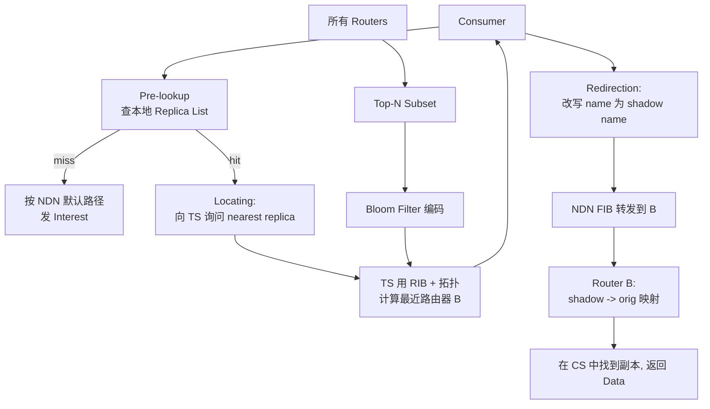
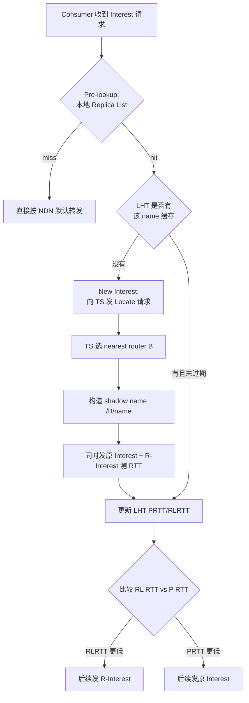

# Fetching Popular Data from the Nearest Replica in NDN（ICNP 2016）

> 作者：Jianxun Cao, Dan Pei, Xiaoping Zhang, Beichuan Zhang, Youjian Zhao  
> 机构：清华大学 TNList / 计算机系；亚利桑那大学计算机系  
> 发表年份：2016  
> 会议/期刊：ICNP 2016（International Conference on Network Protocols）  
> 关联 PDF：同目录下 `main.pdf`

## 一、文档信息速览

| 字段 | 值 |
|---|---|
| 标题 | Fetching Popular Data from the Nearest Replica in NDN |
| 作者 | Jianxun Cao, Dan Pei, Xiaoping Zhang, Beichuan Zhang, Youjian Zhao |
| 机构 | Tsinghua University (TNList); University of Arizona |
| 发表年份 | 2016 |
| 会议/期刊 | ICNP 2016 |
| 分类 | 网络 / ICN / NDN 路由优化 |
| 核心问题 | 在保留 NDN 可扩展性的同时，让用户能够从网络任意位置的最近缓存副本拉取内容，而不是受限于树状转发路径 |
| 主要贡献 | 1) 提出 FNR（Fetching the Nearest Replica）CDN-like 增强；2) 利用 Zipf 分布与 Bloom Filter 压缩副本通告开销；3) 引入 Tracker Server 解决可扩展重定向；4) 通过 ndnSIM 评估显著降低总流量与延迟 |

## 二、背景（Background）

命名数据网络（Named Data Networking, NDN）作为以内容为中心的未来网络架构之一，依赖网内缓存（in-network caching）来减少重复流量。NDN 采用 URL 风格的分层命名，便于前缀聚合，因此天然具有较好的可扩展性；典型 ICN 替代方案（如 DONA、NetInf/SAIL、MobilityFirst）使用扁平的 self-certifying 命名，需要通过 DHT 等机制做名字解析。学术估计，要支撑未来 ICN 的发展，名字解析系统需要能够管理 $10^{12}$ 个对象，这对扁平命名的可扩展性提出了严峻挑战。

然而，NDN 的"沿路存储 + 树状转发"模型在网络越来越"扁平化"（richly connected）的今天暴露出了效率问题：用户发出的 Interest 只能沿着 FIB 默认最佳路径转发，最近的数据副本（nearest replica）可能并不在默认路径上。沿默认路径可能拉得很远、跨多个 AS 域，导致域内/域间流量和延迟都明显高于"按就近副本获取"的理想状况。DONA、NetInf、MobilityFirst 等虽然支持"任意副本"查找，但需要依赖全网级 DHT，规模大了很难落地。

工业上 IP 网络常用 CDN 解决"取最近副本"问题：通过 DNS 风格的全局调度，把用户重定向到最近边缘节点。但 NDN 现网并不存在与 IP CDN 等价的调度层，使得 Interest 始终沿着默认 best-path 转发，造成"NDN 自带缓存但仍要走远路"的低效。

## 三、目的（Purpose / Problems Solved）

- **痛点 1 — 默认路径未必最近**：NDN Interest 沿 FIB 树状转发，最近副本不在路径上时浪费大量域内/域间带宽。
- **痛点 2 — 副本通告开销爆炸**：如果简单粗暴地让每台路由器把整个 Content Store（CS）通告出去，$10^{12}$ 对象的规模下通告流量与存储不可承受。
- **痛点 3 — 通告时延与失效**：副本状态动态变化，全网同步一份完整的副本表既延迟又容易过时。
- **痛点 4 — 安全**：恶意节点可以伪造副本通告，劫持用户流量。
- **解决方案**：FNR 借鉴 IP CDN 的"一次重定向"思路，引入轻量级集中组件 Tracker Server（TS），并利用 Zipf 流行度分布与 Bloom Filter 压缩副本通告，使消费者能在不修改 NDN 协议基本面的前提下，从"nearest replica" 拉取流行内容。

## 四、核心原理（Principles）

**系统总览**：FNR 把 NDN 域内（典型为 ISP）每台路由器的 CS 划分为 Top-N Subset（N 个最流行内容）与 Heavy-Tailed Subset（其余长尾），路由器仅向 TS 通告 Top-N 集合的 Bloom Filter。TS 维护一张全局 Replica List（多组 Bloom Filter），并下发给所有消费者。消费者拉取内容前先查本地 Replica List：若命中则向 TS 询问"谁离我最近"，得到一个目的路由器 ID 之后，把 Interest 的名字加前缀重写为 shadow name（如 `/B/google/x.mov`），再按 NDN FIB 转发到该路由器 B；B 收到 shadow name 后在 Content Store 映射表中查到原始名，返回数据。命中失败时则按原 NDN 默认行为拉取。FNR 不会修改 NDN 协议或 CS 数据结构，仅新增一个 TS、若干个控制消息格式与一次重定向。

**关键概念**：
- Top-N Subset 与 Heavy-Tailed Subset
- Tracker Server（TS）
- Replica List（多路由器 Bloom Filter 列表）
- Local Hashing Table（LHT，缓存最近一次定位决策）
- Shadow name / R-Interest
- LHT 决策：生产者 RTT vs 副本 RTT

**数学原理**：令 Zipf 分布的访问频率为 $f_i \sim 1/r_i^\alpha$（论文实验取 $\alpha=1.04$）。每条 Bloom Filter 长度 $m = 8n$（bit），$n=N=1000$ 个元素，使用 $k=6$ 个哈希函数，false positive $f\approx 0.02$。每台路由器向 TS 上传 Bloom Filter 的传输速率为 $m/T_i$（bit/s），其中 $T_i$ 是 Top-N 子集平均更新周期。TS 与每条边缘路由器相连的所有消费者只需"按一次"的更新代价同步 Replica List，存储和传输开销均可形式化为：

$$SOV_r = N_{cs} + 32N + m \text{ bit}$$
$$SOV_c \approx mR + 8000N_{lht} \text{ bit}$$
$$TOV_{tr} = \sum_i \frac{m}{T_i} \text{ bit/s}$$
$$TOV_{tc} \approx R_e \cdot TOV_{tr} = R_e \sum_i \frac{m}{T_i} \text{ bit/s}$$

**与现有技术差异**：
- 不同于多路径方案（直接拉多份副本、带宽浪费严重）；
- 不同于"全 CS 通告"（开销爆炸）；
- 不同于 MIRO/SIDR 等控制面多路径（FNR 不修改 BGP/控制协议，仅做数据面重定向）。

## 五、算法详解（Algorithm）

1. **输入/输出**
   - 输入：消费者发出的 Interest 包（含内容名 `name`）；各路由器 Content Store 中 Top-N 流行副本集合；TS 同步下发的 Replica List（Bloom Filter 列表）；网络拓扑与流量工程参数。
   - 输出：重写后的 R-Interest（带 shadow name） 或 原样 Interest；TS 返回的 nearest-replica 路由器 ID；LHT 缓存项；路由器返回的数据包。

2. **核心模块**
   - 路由器 CS 子集划分器（CS → Top-N + Heavy-Tail）
   - Bloom Filter 编码器（Top-N → $m$ bit Bloom Filter）
   - Tracker Server（聚合 RIB、维护拓扑、选择最近副本）
   - 消费者侧的 Replica List 与 Local Hashing Table
   - 路由器侧的 shadow name 映射表

3. **伪代码**

```python
# 路由器侧：CS 子集与同步
def router_loop(packets):
    for ev in events:
        if ev == NEW_CS_ENTRY:
            update_top_n(cs, n=N)  # 按流行度替换 Top-N
            bf = bloom_filter(top_n, m=8*N, k=6)
            send_to_ts(bf)  # 异步上传
        elif ev == INCOMING_INTEREST(name):
            if name in heavy_tail:
                forward_to_fib(name)  # 默认 NDN 行为
            else:  # Top-N 命中
                send_data(name)  # 路由器直接命中返回
        elif ev == INCOMING_R_INTEREST(shadow):
            orig = mapping_table[shadow]  # 指针映射
            send_data(orig)

# 消费者侧：Pre-lookup + Locating + Redirection
def consumer_send_interest(name):
    if replica_list.lookup(name) is False:    # Pre-lookup miss
        send_normal_interest(name)
        return

    lht_entry = lht.get(name)
    if lht_entry and not lht_entry.expired():  # Subsequent interest
        # 直接按 R-Interest / 原 Interest 决策
        if lht_entry.rlrtt < lht_entry.prtt:
            send_r_interest(lht_entry.shadow_name)
        else:
            send_normal_interest(name)
        return

    # New interest → Locating
    nearest = ts.locate(name)  # TS 根据内部网络拓扑计算
    shadow = "/" + nearest.router_id + name
    r_interest = make_interest(shadow)
    lht.put(name, shadow=shadow, prtt=inf, rlrtt=inf)
    send_both(name, r_interest)  # 同时发出以测 RTT
```

4. **关键数学**
   - 最近副本的"虚拟距离"度量（论文使用 cost × delay / bandwidth 作为路由 metric，参与最小化最大链路利用率 MLU）：

$$\min_{\forall k: t^k \in T^k} \max_{e \in E} \left( b_e + \sum_k \sum_i \sum_{j \neq i} t^k_{ij} \cdot I_e(i,j) \right)$$

   - Bloom Filter 误报率近似：$f \approx (1 - e^{-kn/m})^k$。在 $m=8n, k=6$ 时 $f \approx 0.02$。

5. **复杂度分析**
   - 路由器上传 BF：$O(m/T_i)$ bit/s（与 CS 大小近似无关）。
   - 消费者 Pre-lookup：$O(R \cdot \text{BF lookup}) \approx O(R \cdot k)$ 哈希计算。
   - TS Locating：拓扑最小 MLU 求解，$O(|E| \cdot \log |V|)$ 量级（与传统流量工程一致），可离线或周期性计算。

6. **训练与推理**
   - FNR 不需要机器学习训练，是规则化系统；"推理"为每次 Interest 的实时决策，"训练"为 CS 流行度更新 + TS 拓扑同步。

7. **示例**  
   论文 Fig.1 / D 节给出完整示例：消费者同时有 Interest `I1 = /google/message/0000`（TS 中未命中）和 `I2 = /google/x.mov/0003`（在路由器 B 的 Top-N 中有副本）。`I1` 直接走默认路径到达生产者；`I2` 走 lookup → TS 询问 → 路由器 B → shadow name `/B/google/x.mov/0003` → B 收到后映射回 `/google/x.mov/0003` → 返回数据。

## 六、系统架构图（Architecture）



## 七、流程图（Process Flow）



## 八、关键创新点（Key Innovations）

- **+ Zipf + Bloom Filter 组合**：把"哪些副本值得通告"与"如何压缩通告"两个问题合并，用 $m=8N$ 位的 Bloom Filter 描述 Top-N 流行集合，理论通告开销与对象总数解耦。
- **+ Tracker Server + Shadow Name 一次重定向**：借鉴 IP CDN 的 DNS 风格"一次重定向"，把最近副本定位放到集中但轻量的 TS，不修改 NDN 协议语义。
- **+ Local Hashing Table (LHT)**：把 PRTT/RLRTT/Decision 缓存在消费者侧，避免每次 Interest 都重定向到 TS；同时支持"测 RTT 后再决定路径"的 race-against-RTT 优化。
- **+ Local Mode 部署**：选择 local mode（每 ISP 一个 TS）而非 global mode，减小 Replica List 存储和最近副本定位时间，且"ISP 内最近"在大多数情况下已经足够好。

## 九、实验与结果（Experiments）

- **数据集 / 模拟环境**：基于清华校园网拓扑（THUNet，20 路由器 / 49 消费者 / 82 链路）的 ndnSIM 2.0 仿真；Zipf 分布请求数据集（>1,000,000 对象，$\alpha=1.04$）。
- **Baseline / 对比方案**：
  - **Producer**：按默认 NDN 路径从生产者拉取
  - **Random**：从随机副本拉取
  - **Nearest**（FNR 自身）
- **主要指标**：总流量、域内/域间流量、平均延迟、平均成本、Top-N 大小敏感性。
- **关键结果数字**：
  - 相比 Producer：总流量 -25.6%，域间流量 -52.0%，域内流量 -18.2%。
  - 平均延迟 -37%，平均成本 -51.4%。
  - 99 分位延迟：Nearest 280.5ms、Random 317.8ms、Producer 424.8ms。
  - Top-N 大小经验值：$N \approx 5\% \sim 10\% \cdot |CS|$ 性价比最佳，再增大收益递减。
- **消融实验**：分别在 Net-loss / Edge-loss 两种故障场景下测得 FNR 都显著优于 Random，说明"选最近"比"选个副本"更关键。
- **效率分析**：每台路由器增加存储 $N_{cs}+32N+m$ bit（约 KB 量级），传输开销 $m/T_i$ bit/s，仿真显示通告流量远低于总流量收益。

## 十、应用场景（Use Cases）

1. **大型 ISP 部署 NDN 试点**：在 ISP 内 1-2 个 TS 节点 + 路由器侧少量配置即可获得 CDN 级内容分发效率。
2. **视频点播 / 软件更新镜像**：在内容高度流行且长尾明显的场景，Top-N 选择能命中绝大多数流量。
3. **校园网 / 企业网**：作为本地 NDN 缓存调度的优化层，提升 NDN 试验网的用户体验。
4. **多 ISP 互连场景**：FNR 的 local mode 部署可以平滑地以 ISP 为单位逐步 rollout，避免"全网升级"。
5. **5G/边缘计算内容分发**：与 ETSI MEC 的 CDN 思路契合，可在边缘 NDN 节点上复用 FNR 模式。

## 十一、相关论文（Related Papers in this set）

- `NLB-ICCCN2015-paper.pdf`：同样基于 NDN 架构，把 NDN 推到 WiFi 末梢做直播广播。
- `mobisys16-sui.pdf`：清华 WiFi 延迟测量，与 NDN 一样涉及校园 WLAN。
- `liu_imc15_Opprentice.pdf`、`liu_ipccc15_focus.pdf`、`liu_infocom16_focus.pdf`：同组在 KPI 分析与搜索响应时间调试上的工作。
- `mingzhu_mifo.pdf`：从多路径转发角度谈"按非默认路径拉取"的思想，与 FNR 的"shadow name 重定向"有异曲同工之处。

## 十二、术语表（Glossary）

- **NDN**：Named Data Networking，命名数据网络。
- **ICN**：Information-Centric Networking，信息为中心网络。
- **FIB**：Forwarding Information Base，转发表。
- **CS**：Content Store，NDN 路由器的网内缓存。
- **PIT**：Pending Interest Table，NDN 路由器未决兴趣表。
- **Top-N Subset / Heavy-Tail Subset**：CS 中最流行的 N 个内容与长尾剩余内容。
- **Bloom Filter**：空间紧凑的集合成员判定结构，有可控误报。
- **Tracker Server (TS)**：FNR 引入的集中式副本定位与拓扑管理节点。
- **Shadow name / R-Interest**：把原 Interest 名字加前缀重写得到的、指向特定路由器的 Interest。
- **LHT**：Local Hashing Table，消费者侧的最近决策缓存。

## 十三、参考与延伸阅读

- V. Jacobson et al., "Networking Named Content", ACM CoNEXT 2009.
- L. Zhang et al., "Named Data Networking", ACM SIGCOMM CCR 2014.
- S. K. Fayazbakhsh et al., "Less Pain, Most of the Gain: Incrementally Deployable ICN", SIGCOMM CCR 2013.
- A. Broder, M. Mitzenmacher, "Network Applications of Bloom Filters: A Survey", Internet Mathematics 2004.
- A. Ghodsi et al., "Information-Centric Networking: Seeing the Forest for the Trees", HotNets 2011.
- ndnSIM 2.0 开源仿真器：https://ndnsim.net
