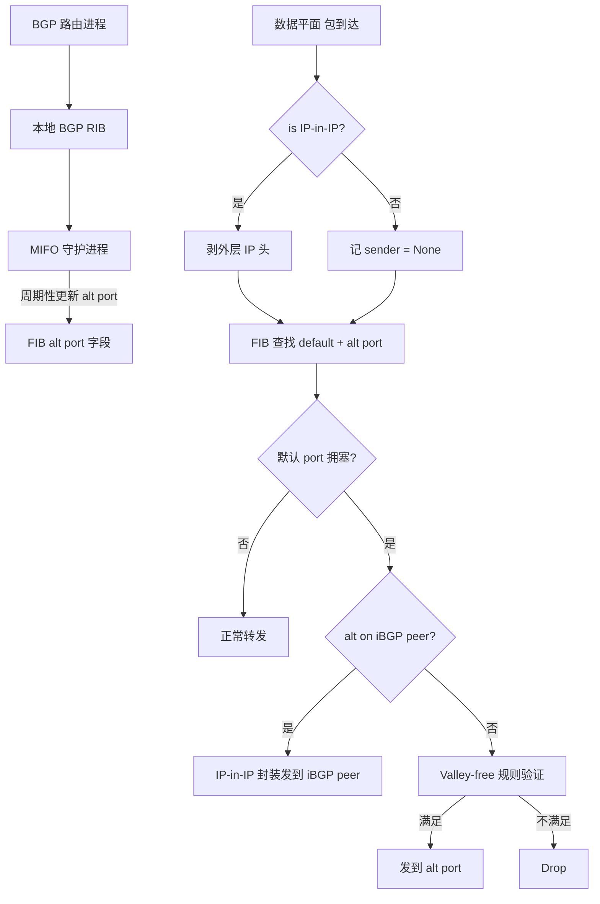
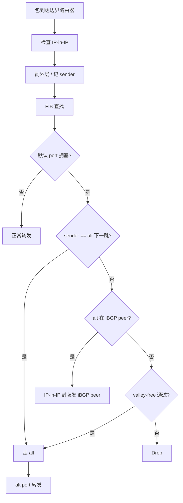

# MIFO: Multi-Path Interdomain Forwarding（ICPP 2015）

> 作者：Ming Zhu、Dan Li、Ying Liu、Dan Pei、K. K. Ramakrishnan、Lili Liu、Jianping Wu  
> 机构：清华大学 TNList、清华大学计算机系、加州大学 Riverside  
> 发表年份：2015  
> 会议/期刊：ICPP 2015（44th International Conference on Parallel Processing）  
> 关联 PDF：同目录下 `mingzhu_mifo.pdf`

## 一、文档信息速览

| 字段 | 值 |
|---|---|
| 标题 | MIFO: Multi-Path Interdomain Forwarding |
| 作者 | Ming Zhu, Dan Li, Ying Liu, Dan Pei, K. K. Ramakrishnan, Lili Liu, Jianping Wu |
| 机构 | 清华大学 TNList、清华大学计算机系、加州大学 Riverside |
| 发表年份 | 2015 |
| 会议/期刊 | ICPP 2015 |
| 分类 | 域间路由 / BGP / 多路径转发 / 数据平面 |
| 核心问题 | 传统 BGP 只选单条最优路径，无法应对拥塞；多路径方案要么需修改控制平面（MIRO, PDAR），要么易产生数据平面环路 |
| 主要贡献 | (1) 第一个在数据平面实现多路径域间转发的方案 MIFO；(2) "valley-free" 规则 + 1 bit tag 解决数据平面环路（数学证明）；(3) IP-in-IP 封装避免 iBGP peer 间 cycling；(4) 贪心路径选择 + 局部 link 监控；(5) Linux + XORP 原型实现，1.7 Gbps 总吞吐较 BGP 提升 81% |

## 二、背景（Background）

互联网域间流量快速增长：大型 IXP 日均流量达数十 PB；互联网层级结构趋于扁平，AS 对之间存在大量可用路径。然而 BGP 作为域间主导协议，依然是"流量不可知"的单路径路由。当默认路径拥塞时仍按单路径转发，性能急剧下降。两类原因：(1) 流量负载快速增长 vs BGP 静态单路径；(2) 控制平面慢收敛 vs 数据平面快拥塞。

MIFO（Multi-Path Interdomain FOrwarding）让 AS 边界路由器在数据平面自适应地把出口流量从拥塞默认路径切换到备用路径，无需触动 BGP 协议。核心思想：边界路由器直接从本地 BGP RIB 中获取多路径（不同邻居学习到的 AS 路径），用"valley-free"规则 + 1 bit 标签保证数据平面无环，用 IP-in-IP 封装解决 iBGP peer 间的 cycling，用贪心法选最优备用路径。

## 三、目的（Problems Solved）

- **BGP 流量不可知导致拥塞**：MIFO 在数据平面自适应切换。
- **多路径在控制平面开销大**：MIRO/PDAR 需新消息或属性；MIFO 用本地 BGP RIB 零开销。
- **数据平面环路**：单路径时 BGP 路径向量保证无环；多路径切换可能产生数据平面环路。
- **iBGP peer 间 cycling**：边界路由器在 iBGP mesh 内的循环转发。
- **选择最优备用路径**：MIFO 用本地 link 容量监控 + 贪心选择。
- **数据平面 vs 控制平面一致性**：保持 legacy 路由系统兼容。

## 四、核心原理（Principles）

**系统总览**：每个 MIFO 边界路由器维护 FIB（包含 dst + 默认 port + alt port）。当默认 port 拥塞时，路由器根据 alt port 直接转发到备用 AS 邻居；MIFO 守护进程在控制平面更新 alt port 数据。流量在数据平面被处理，无需查 BGP RIB。

**关键概念**：

- **BGP RIB**：BGP 路由信息库；含多条到同一 dst 的 AS 路径。
- **FIB**：转发信息库。
- **Default Path / Alternative Path**：默认路径 / 备用路径。
- **eBGP / iBGP peer**：外部 / 内部 BGP 邻居。
- **Valley-free**：经济无谷路由策略。
- **Tag-Check**：用 1 bit 编码上游邻居关系，1 bit 检查是否允许转发。
- **IP-in-IP Encapsulation**：IP-in-IP 封装用于 iBGP peer 通知。
- **Upstream Neighbor (UN) / Downstream Neighbor (DN)**：上游 / 下游邻居。
- **BGP RIB exploration**：从本地 RIB 提取多路径。
- **Greedy Path Selection**：选可用带宽最大的备用路径。
- **Link-based Monitoring**：监控本地直连 AS link 容量代替 end-to-end 路径探测。

**数学原理**：

- **业务关系代数定义**（相邻 AS $v_i, v_{i+1}$）：

$$
v_i < v_{i+1} \iff (v_i, v_{i+1}) = (\text{customer}, \text{provider})
$$

$$
v_i = v_{i+1} \iff (v_i, v_{i+1}) = (\text{peer}, \text{peer})
$$

$$
v_i > v_{i+1} \iff (v_i, v_{i+1}) = (\text{provider}, \text{customer})
$$

- **Transitivity（C2P / P2C）**：

$$
v_{i-1} > v_i, v_i > v_{i+1} \implies v_{i-1} > v_{i+1} \tag{1}
$$

$$
v_{i-1} < v_i, v_i < v_{i+1} \implies v_{i-1} < v_{i+1} \tag{2}
$$

- **Valley-free 规则**（path verification）：

$$
v_i \text{ allows transit } v_{i-1} \to v_{i+1} \iff v_{i-1} < v_i \lor v_i > v_{i+1} \tag{3}
$$

- **Tag-Check 1 bit 编码**：

$$
\text{tag} = 1 \iff v_{i-1} < v_i
$$

- **Theorem (无环证明)**：在多路径域间转发中，给数据平面加入 valley-free 规则后，每个包都能被无环转发或丢弃（用反证法，按 $v_1 > v_2$、$v_1 = v_2$、$v_1 < v_2$ 三种情形均推出矛盾）。

**与现有技术的差异**：与 MIRO（Xu & Rexford, SIGCOMM 2006）相比，MIFO 不需要 AS 间协商替代路径；与 PDAR（Wang & Gao, INFOCOM 2009）相比，MIFO 不需额外 BGP UPDATE；与 TeXCP 等 MPLS 流量工程相比，MIFO 工作在域间、分布式。

## 五、算法详解（Algorithm）

1. **输入 / 输出**：
   - 输入：到达数据平面的 IP 包；本地 BGP RIB；本地直连 AS link 容量。
   - 输出：转发的接口（默认 / 备用 / iBGP peer / drop）。

2. **核心模块**：
   - **BGP RIB exploration**：从本地 RIB 提取 alt port（不同 AS 邻居学到的同 dst 路径）。
   - **Valley-free Tag-Check**：入包时根据 eBGP 关系设 1 bit；出包时根据 Eq. (3) 验证。
   - **Cycle Avoidance via IP-in-IP**：iBGP peer 间用 IP-in-IP 通知，强制下一跳判断。
   - **Greedy Alt Path Selection**：实时监控直连 link 剩余带宽，贪心选最大可用带宽的备用 path。
   - **Flow-level Deterministic**：用 5-tuple hash 选 path，避免 packet reordering。

3. **伪代码**：

```python
def mifo_forward(pkt, fib):
    """Algorithm 1"""
    if is_ip_in_ip(pkt):
        sender = get_packet_sender(pkt)
        pkt = strip_outer_ip_header(pkt)
    out_port, alt_port = fib_lookup(pkt)
    if is_connect_to_eBGP(in_port):  # entering point
        up_neighbor = get_neighbor(in_port)
        if is_customer(up_neighbor):
            set_tag_bit(pkt, 1)
        else:
            set_tag_bit(pkt, 0)
    # 拥塞判断：默认 port 拥塞 或 sender 是 alt port 下一跳
    if is_congested(out_port) or (sender and sender == get_next_hop(alt_port)):
        if is_connect_to_iBGP(alt_port):
            pkt = ip_in_ip_encap(pkt, my_addr, alt_peer_addr)
            send(pkt, alt_port)
            return
        down_neighbor = get_neighbor(alt_port)
        if is_customer(down_neighbor) or get_tag_bit(pkt) == 1:
            send(pkt, alt_port)
        else:
            drop(pkt)  # 违反 valley-free
        return
    send(pkt, out_port)

def select_alt_path(fib, link_capacity):
    """Greedy"""
    for dst in fib:
        alts = fib[dst].alt_paths
        best = max(alts, key=lambda p: link_capacity[p.next_hop])
        fib[dst].alt_port = best.out_port
    return fib
```

4. **关键数学**：见 §四。

5. **复杂度分析**：
   - Tag-Check 验证：$O(1)$ / 包。
   - Alt path 选择：$O(|alts|)$，通常常数。
   - IP-in-IP 封装：$O(1)$ 头部操作。
   - 端到端路径探测：避免；改为本地 link 监控 $O(|links|)$。

6. **训练与推理**：
   - 训练：MIFO 守护进程周期性从 RIB 更新 alt port。
   - 推理：每包 $O(1)$ forwarding 决策。

7. **示例**：在某 6 AS 测试床（2 个 Tier-1 + 4 个 stub）上，30 个 TCP 流 100MB 从 S1→D1、S2→D2 并发；BGP 拥塞使两条流争用 AS 3-4 link 0.94 Gbps；MIFO 用 iBGP peer 路径 AS 3-6-5 达 1.7 Gbps 总吞吐（提升 81%），所有流 1.1s 完成 vs BGP 1.6s+。

## 六、系统架构图（Architecture）



## 七、流程图（Process Flow）



## 八、关键创新点（Key Innovations）

- **+ 第一个数据平面多路径域间转发**：在不动 BGP 的前提下实现。
- **+ Valley-free + 1 bit tag 解决数据平面环路**：形式化定义 + 严格反证法证明。
- **+ IP-in-IP 解决 iBGP peer cycling**：无需新协议。
- **+ Greedy alt path 选择 + link 监控**：避开 end-to-end 探测慢的痛点。
- **+ Linux 内核 + XORP 原型**：从仿真到实测的完整工程。
- **+ 真实测试床 81% 吞吐提升**：30 TCP 流并发实测。

## 九、实验与结果（Experiments）

- **仿真数据集**：CAIDA AS-level 拓扑（2014/11）：44,340 nodes、109,360 links、75,046 P/C、34,314 peering。1M 流量（uniform / power-law，$\alpha=0.8/1.0/1.2$），1Gbps links，10MB/flow，1KB 包，Poisson 100 flow/s。
- **测试床**：6 AS = 2 Tier-1 + 4 stub；15 desktop machines；1 Gbps Ethernet；30 TCP 流 (S1→D1, S2→D2) 100MB each。
- **Baseline**：BGP（单路径）、MIRO（多路径）。
- **主要指标**：路径多样性、flow 吞吐 CDF、aggregate throughput、path switch 次数。
- **关键结果数字**：
  - 50% MIFO 部署 vs 100% MIRO 部署：MIFO 仍提供更多 paths；
  - 100% MIFO 部署：90% AS pair 有 ≥ 100 alt paths；近 50% AS pair 有 ≥ 1000；
  - Uniform traffic：MIFO 50% 部署：50% flow 达 500 Mbps；MIRO 仅 35%；BGP 7%；
  - Power-law $\alpha=1.0$：40% flow 达 500 Mbps (MIFO) vs 17% (MIRO) vs 7% (BGP)；
  - 100% MIFO 部署：50% flow 走 alt paths；10% 部署时仍 9% flow 走 alt；
  - 67.7% flow 只切 1 次，97.5% ≤ 2 次（稳定性好）；
  - 测试床 aggregate throughput 1.7 Gbps (MIFO) vs 0.94 Gbps (BGP)，**提升 81%**；
  - MIFO 所有 flow 1.1s 完成；BGP 80% flow 1.6s+；总完成时间 30s (MIFO) vs 51s (BGP)。
- **消融实验**：50% vs 100% 部署对路径多样性和吞吐的影响；不同 $\alpha$ 偏度。
- **效率分析**：valley-free 验证 $O(1)$ / 包；MIFO 不引入端到端测量。
- **可视化**：图 5 / 6 throughput CDF；图 7 paths per pair；图 8 流量分流；图 9 路径切换分布；图 12 测试床结果。

## 十、应用场景（Use Cases）

- **ISP 域间拥塞缓解**：Tier-1 / Tier-2 ISP 出口路由器。
- **多宿主企业网**：多 ISP 接入的边界路由器。
- **CDN 边缘节点**：从拥塞 ISP 切换到备用 ISP。
- **数据中心域间互联**：DC-to-DC 流量调度。
- **IXP 互联**：对等互联场景下的多路径利用。

## 十一、相关论文（Related Papers in this set）

- `liu_cnsm14_cloudwatchplus`：云租户级应用感知延迟监控。
- `iwqos16-li`：M³ 多层 SVC 视频组播。
- `iwqos16-sui`：清华 Wi-Fi 轨迹隐私。
- `lanman16-sui`：AP 密度对 Wi-Fi 性能的影响。
- `IWQOS_2017_zsl`：交换机 syslog 处理与故障诊断。
- `ubicomp16-EDUM`：基于 Wi-Fi 的课堂教育测量。

## 十二、术语表（Glossary）

- **BGP**：Border Gateway Protocol，域间路由协议。
- **eBGP / iBGP**：外部 / 内部 BGP。
- **RIB / FIB**：Routing Information Base / Forwarding Information Base。
- **AS**：Autonomous System，自治系统。
- **IXP**：Internet eXchange Point。
- **MIFO**：Multi-Path Interdomain FOrwarding。
- **MIRO**：Multi-path Interdomain Routing（Xu & Rexford 2006）。
- **PDAR**：Path Diversity Aware interdomain Routing（Wang & Gao 2009）。
- **Valley-free**：经济无谷路由策略。
- **Customer / Provider / Peer**：三种 AS 关系。
- **Tag-Check**：MIFO 1 bit 验证机制。
- **IP-in-IP Encapsulation**：IP-in-IP 封装。
- **MPLS**：Multiprotocol Label Switching。
- **PCEP / TeXCP**：流量工程协议。
- **OUI**：组织唯一标识符。
- **RouteViews**：俄勒冈大学 BGP 路由数据。

## 十三、参考与延伸阅读

- Paper: MIRO（Xu, Rexford, SIGCOMM 2006）——多路径域间路由先行者。
- Paper: PDAR（Wang, Gao, INFOCOM 2009）——路径分集域间路由。
- Paper: Stable Internet routing without global coordination（Gao, Rexford, TON 2001）——valley-free 来源。
- Paper: Internet inter-domain traffic（Labovitz 等, SIGCOMM 2010）。
- Paper: Why is the Internet traffic bursty in short time scales（Jiang, Dovrolis, SIGMETRICS 2005）。
- Paper: Let the market drive deployment（Gill, Schapira, Goldberg, SIGCOMM 2011）——Internet 扁平化。
- Paper: Reliable interdomain routing through multiple complementary routing processes（Liao, Gao 等, CoNEXT 2008）。
- Paper: R-BGP（Kushman, Kandula, Katabi, Maggs, NSDI 2007）。
- Paper: MATE / Walking the tightrope（Kandula 等, INFOCOM 2001 / SIGCOMM 2005）——MPLS TE。
- Paper: Traffic engineering extensions to OSPFv3（RFC 5329）。
- 工具：XORP、Quagga、ns-3、Linux kernel。
- 相关论文：`liu_cnsm14_cloudwatchplus`、`iwqos16-li`、`iwqos16-sui`。
