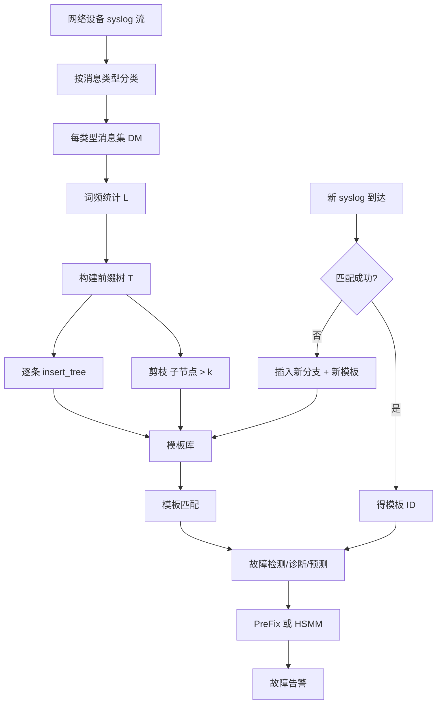
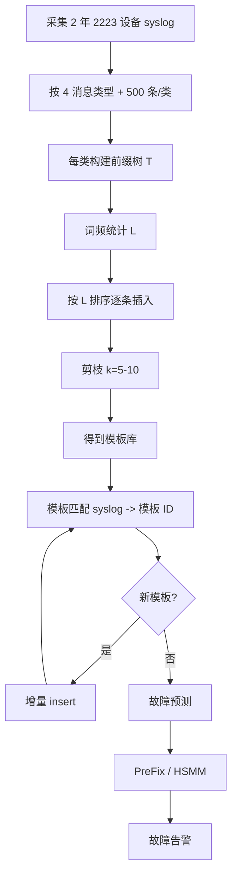

# Craftsman: Efficient and Robust Syslog Parsing for Network Devices in Datacenter Networks（IEEE Access 2020 / paper-IEEE-Access-Craftsman）

> 标题：Efficient and Robust Syslog Parsing for Network Devices in Datacenter Networks
> 作者：Shenglin Zhang、Ying Liu、Weibin Meng、Jiahao Bu、Sen Yang、Yongqian Sun、Dan Pei、Jun Xu、Yuzhi Zhang、Lei Song、Ming Zhang
> 机构：南开大学；清华大学；Facebook；Georgia Tech；百度；中国建设银行
> 发表年份：2020
> 会议/期刊：IEEE Access 2020（Vol. 8）
> 关联 PDF：同目录下 `paper-IEEE-Access-Craftsman.pdf`

## 一、文档信息速览

| 字段 | 值 |
|---|---|
| 标题 | Efficient and Robust Syslog Parsing for Network Devices in Datacenter Networks |
| 作者 | Shenglin Zhang、Ying Liu、Weibin Meng、Jiahao Bu、Sen Yang、Yongqian Sun、Dan Pei、Jun Xu、Yuzhi Zhang、Lei Song、Ming Zhang |
| 机构 | 南开大学软件学院；清华大学；Facebook；Georgia Tech；百度；中国建设银行 |
| 发表年份 | 2020 |
| 会议/期刊 | IEEE Access (Vol. 8, 2020) |
| 分类 | 日志解析 / 网络设备 / 数据中心 / 前缀树 |
| 核心问题 | 数据中心网络设备 syslog 解析的 STE/LogSimilarity 方法准确率低、模板匹配慢、不支持增量学习；每天产生数千万条 syslog |
| 主要贡献 | (1) 提出 Craftsman：基于前缀树 + 频繁模式提取模板；(2) Rand index 接近 1；(3) 模板匹配提速 6.88-10.25x，解析提速 730-6847x；(4) 故障预测 F1 提升 13.07%-188% |

## 二、背景（Background）

云服务提供商在数据中心部署大量网络设备，设备故障已不罕见。Microsoft 数据中心有上万网络设备 [1]，每年 400+ 故障 [2]。网络设备故障会显著降低数据中心性能，因此故障检测/诊断/预测 [3-7] 受关注。

网络设备 syslog 被认为是故障检测/诊断/预测的丰富信息源 [4, 5, 8-12]。但 syslog 是不结构化文本，使用前需解析 [13-15]。当前解析方法是从历史 syslog 学消息模板（template），再把新 syslog 匹配到模板。例如 syslog "OSPF Neighbor 10.231.44.249 (Vlan-interface18) from Exstart to Exchange" 中 IP 和接口号是参数，其余是模板。

syslog 解析对网络设备故障检测/诊断/预测至关重要，但现有方法（如 Statistical Template Extraction (STE) [9]、LogSimilarity [4]）模板学习准确率低、模板匹配慢。数据中心中上万网络设备每天产生数千万条 syslog；低效的匹配会消耗过多资源。

一些方法（如 SignatureTree [8]、STE [9]）不支持增量学习——新增模板需重解析全部历史 syslog。系统通常基于模板库训练故障检测/诊断/预测模型，需定期重训，因此模板库必须支持增量重训。网络运维频繁进行软/固件升级 [22]，会生成新子类型 syslog，需新模板；只重训新 syslog 即可增量。

针对这些挑战，论文提出 Craftsman：基于前缀树（prefix-tree）+ 频繁模式（frequent pattern）自动学习模板。模板定义为"syslog 中最长的频繁词组合"。

## 三、目的（Problems Solved）

- **模板学习准确率低**：基于频繁词组合，准确率 Rand index 接近 1。
- **模板匹配效率低**：前缀树 O(H·k) 匹配（H 树高、k 子树数），显著快于 STE/LogSimilarity。
- **不支持增量学习**：插入新 syslog 时只更新局部路径，无需重训。
- **Syslog 解析通用性差**：在 Blue Gene/L、HPC、HDFS、Zookeeper、Proxifier 等 5 个公开数据集上通用。
- **故障预测精度低**：用 PreFix [5] 或 HSMM [16] 时 F1 提升 13.07%-188%。

## 四、核心原理（Principles）

**系统总览**：Craftsman 包含 3 部分：
1. **模板学习（Prefix-Tree Construction）**：扫描消息集 DM，构建前缀树；按词频排序后逐条插入；按阈值 k 剪枝。
2. **增量模板学习**：新 syslog 不匹配则插入新分支。
3. **模板匹配**：用排序后的词序列在树上匹配；不匹配则生成新模板。

**关键概念**：

- **Syslog**：网络设备日志消息。
- **Template（消息模板）**：syslog 中最长的频繁词组合。
- **Subtype（子类型）**：消息类型下的具体事件种类。
- **Message Type**：消息类型，syslog 的语义类别。
- **Parameter Word / Template Word**：参数词/模板词。
- **Prefix-Tree（前缀树）**：以 syslog 词为节点、共享前缀的树。
- **FP-tree**：Frequent Pattern Tree，频繁模式树 [30]。
- **Support**：词组合在 DM 中的出现次数。
- **Threshold k**：节点最多子节点数（5 ≤ k ≤ 10）。
- **Rand Index**：聚类相似度评价指标。
- **PreFix [5]**：网络设备故障预测方法。
- **HSMM [16]**：Hidden Semi-Markov Model，故障预测。
- **SignatureTree [8]**：基于树的早期 syslog 解析方法。
- **STE [9]**：Statistical Template Extraction。
- **LogSimilarity [4]**：基于相似度的解析。
- **IPLoM [24]**：Iterative Partitioning Log Mining。
- **LKE [25]**：Log Key Extraction。
- **LogSig [26]**：日志签名。

**数学原理**：

- **Rand Index**（衡量模板学习与手工分类一致性）：

$$
\text{Rand index} = \frac{tp + tn}{tp + tn + fp + fn}
$$

其中 tp=同簇同模板、tn=异簇异模板、fp=异簇同模板、fn=同簇异模板。

- **模板匹配复杂度**（前缀树高 H ≤ 10、k < 10）：

$$
O(H \times k)
$$

- **STE 匹配复杂度**：

$$
O(H \times \log H \times U), \quad U \ge 300
$$

- **LogSimilarity 匹配复杂度**：

$$
O(H \times U)
$$

- **Craftsman 解析加速比**（相对 STE / LogSimilarity）：730x / 6847x（template learning + matching）。

- **空间复杂度**：完整前缀树节点数 ≤ 10,000,000 参数词 + 10,000 × 20 模板词；远小于服务器内存。

**与现有技术的差异**：
- 相对 SignatureTree：支持增量学习（每次只扫新 syslog）。
- 相对 STE：模板学习准确率高、匹配快 O(H·k) vs O(H·log H·U)。
- 相对 LogSimilarity：匹配快 O(H·k) vs O(H·U)；准确率更高。
- 相对 IPLoM/LKE/LogSig：通用性更好（5 个数据集平均 96.25% 准确率）；内存 32.4MB vs 90.6MB-23.5GB；解析时间 4.98s/天 vs 35min-5.38天/天。

## 五、算法详解（Algorithm）

1. **输入 / 输出**：
   - 输入：消息类型下所有不同 syslog 的集合 DM；阈值 k。
   - 输出：前缀树 T（每个根到叶路径 = 一个消息模板）。

2. **核心模块**：
   - **构建初始 L**：扫描 DM 一次，统计每词频率 L。
   - **建树**：按 L 顺序对每条消息排序；调用 insert_tree 插入。
   - **剪枝**：对每个子节点，若子节点数 > k，删除其所有子节点。
   - **增量学习**：新 syslog 不匹配现有路径时插入新分支。
   - **匹配**：从根开始按 L 排序逐词匹配；到叶即得模板 ID；不匹配即生成新模板。

3. **伪代码**：

```python
def build_prefix_tree(DM, k):
    L = sorted_words_by_frequency(DM)  # 词频降序
    T = root(label=message_type)
    for msg in DM:
        sorted_msg = sort_words(msg, key=L)
        insert_tree(sorted_msg, T)
    # 剪枝
    for C in T.children:
        if len(C.children) > k:
            C.children = []
    return T

def insert_tree([p | P], T):
    # 找子节点中 nword=p 的节点
    for child in T.children:
        if child.nword == p:
            if P:
                insert_tree(P, child)
            return
    # 没找到则创建新节点
    new_node = Node(nword=p)
    T.children.append(new_node)
    if P:
        insert_tree(P, new_node)

def match_syslog(T, msg):
    sorted_msg = sort_words(msg, key=L)
    cur = T
    for word in sorted_msg:
        found = False
        for child in cur.children:
            if child.nword == word:
                cur = child
                found = True
                break
        if not found:
            return None  # 需生成新模板
    return cur.template_id
```

4. **关键数学**：见 §四。

5. **复杂度分析**：
   - 模板学习：O(|DM| · H · k)。
   - 匹配单条 syslog：O(H · k)。
   - 增量学习：新 syslog 触发一次 insert_tree，O(H · k)。
   - 空间：O(节点数) ≤ 10,000,000。

6. **训练与推理**：
   - 训练（离线）：对每消息类型构建前缀树；剪枝得模板库。
   - 推理（在线）：匹配 syslog → 模板 ID；不匹配即生成新模板。
   - 增量：新消息到 → insert → 剪枝。

7. **示例**：13 条 OSPF/5/OSPF_NBR_CHG syslog → L 词频排序 → 构建前缀树 → 剪枝（k=5-10）→ 4 个模板（Init/Exstart/Exchange/Loading）。新消息 OSPF Neighbor ... from ExStart to Down 触发 insert_tree 增加 "ExStart" → "Down" 分支。

## 六、系统架构图（Architecture）



## 七、流程图（Process Flow）



## 八、关键创新点（Key Innovations）

- **+ 前缀树 + 频繁模式**：自然支持增量学习。
- **+ Rand index 接近 1**：模板学习准确率显著优于 STE/LogSimilarity。
- **+ 匹配 O(H·k) 复杂度**：比 STE/LogSimilarity 快 6.88-10.25x。
- **+ 解析总提速 730-6847x**：因 STE/SignatureTree 不支持增量需重训。
- **+ 故障预测 F1 提升 13.07%-188%**：用 PreFix/HSMM 验证。
- **+ 5 个公开数据集通用**：96.25% 平均准确率。

## 九、实验与结果（Experiments）

- **数据集**：
  - 网络设备：tier-1 云服务商 2,223 台设备 2 年数据，10+ 数据中心；4 个消息类型各 500 syslog。
  - 公开：Blue Gene/L、HPC、HDFS、Zookeeper、Proxifier 5 个。
- **Baseline**：STE、LogSimilarity、SignatureTree、IPLoM、LKE、LogSig。
- **主要指标**：Rand index、模板匹配时间、解析时间、内存、F1（故障预测）。
- **关键结果数字**：
  - 网络设备 Rand index 接近 1（vs STE/LogSimilarity 较低）。
  - 模板匹配加速 6.88x (LogSimilarity) / 10.25x (STE)。
  - 解析加速 730x (SignatureTree) / 6847x (STE)。
  - 故障预测 F1 提升：PreFix 13.07% (vs LogSimilarity) / 35.42% (vs STE)；HSMM 155% / 188%。
  - 公开 5 数据集：平均 96.25% 准确率；解析 4.98s/天（vs 35min-5.38天/天）；内存 32.4MB（vs 90.6MB-23.5GB）。
- **消融实验**：去掉增量学习、去掉剪枝。
- **效率分析**：O(H·k) 匹配；O(节点数) 空间。
- **可视化**：前缀树结构、Rand index 柱状图、解析时间对比图。

## 十、应用场景（Use Cases）

- **数据中心网络设备 syslog 解析**：路由器/交换机日志。
- **故障预测**：用 PreFix / HSMM 在模板序列上预测。
- **云服务商运维**：自动监控。
- **服务器日志解析**：HDFS / Zookeeper。
- **高性能计算日志**：Blue Gene/L / HPC。
- **应用日志**：Proxifier 等。

## 十一、相关论文（Related Papers in this set）

- `TraceSieve_ISSRE23`（追踪异常检测）
- `AlertRCA_CCGRID2024_CameraReady`（告警根因）
- `TSC23-DiagFusion`（多模态故障诊断）
- `CMDiagnostor`（指标根因）
- `Chain-of-Event_Interpretable-Root-Cause-Analysis-for-MicroservicesFSE24-Camera-Ready`（事件根因）

## 十二、术语表（Glossary）

- **Syslog / Template / Subtype**：消息/模板/子类型。
- **Message Type / Parameter Word / Template Word**。
- **Prefix-Tree / FP-tree [30]**。
- **Support / Threshold k**。
- **Rand Index**：聚类相似度。
- **PreFix [5] / HSMM [16]**：故障预测。
- **SignatureTree [8] / STE [9] / LogSimilarity [4]**。
- **IPLoM [24] / LKE [25] / LogSig [26]**。
- **tier-1 Cloud Service Provider**：tier-1 云服务商（合作方）。
- **BGP / IP**：网络相关术语。

## 十三、参考与延伸阅读

- Paper: FP-tree（Han et al., 2000）[30]。
- Paper: PreFix [5]、HSMM [16]。
- Paper: IPLoM [24]、LKE [25]、LogSig [26]。
- Paper: Rand index [32]。
- Paper: Microsoft 数据中心网络 [1, 2]。
- 工具：Nmap 扫描、IP 地址数据库。
- 相关论文：`TraceSieve_ISSRE23`、`AlertRCA_CCGRID2024_CameraReady`。
- 公开代码：见论文 [23]。
