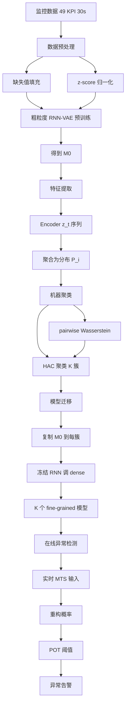
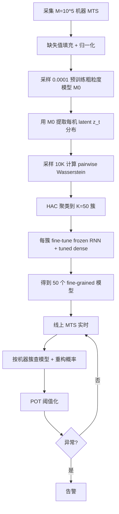

# CTF: Anomaly Detection in High-Dimensional Time Series with Coarse-to-Fine Model Transfer（IEEE INFOCOM 2021 / paper-INFOCOM21-cfp）

> 标题：CTF: Anomaly Detection in High-Dimensional Time Series with Coarse-to-Fine Model Transfer
> 作者：Ming Sun、Ya Su、Shenglin Zhang、Yuanpu Cao、Yuqing Liu、Dan Pei、Wenfei Wu、Yongsu Zhang、Xiaozhou Liu、Junliang Tang
> 机构：清华大学；南开大学；字节跳动
> 发表年份：2021
> 会议/期刊：IEEE INFOCOM 2021
> 关联 PDF：同目录下 `paper-INFOCOM21-cfp.pdf`

## 一、文档信息速览

| 字段 | 值 |
|---|---|
| 标题 | CTF: Anomaly Detection in High-Dimensional Time Series with Coarse-to-Fine Model Transfer |
| 作者 | Ming Sun、Ya Su、Shenglin Zhang、Yuanpu Cao、Yuqing Liu、Dan Pei、Wenfei Wu、Yongsu Zhang、Xiaozhou Liu、Junliang Tang |
| 机构 | 清华大学；南开大学；字节跳动 |
| 发表年份 | 2021 |
| 会议/期刊 | IEEE INFOCOM 2021 |
| 分类 | 异常检测 / 大规模机器 / 多变量时序 |
| 核心问题 | 数据中心 10^5 台机器 × 49 KPI × 1X thousand time points 的高维 MTS 异常检测，每机一模型成本约 2 个月；一模型又无法表达多样机器 |
| 主要贡献 | (1) 粗-精模型迁移框架 CTF；(2) 4 步离线训练：粗粒度预训练→特征提取→HAC 聚类→fine-tuning；(3) 在 10^5 机器上训练时间从 2 个月降到 4.40h，F1=0.830，性能仅损 0.012 |

## 二、背景（Background）

异常检测在 IT 基础设施管理中始终扮演重要角色，帮助运维识别异常机器、减少收入损失 [1-3]。近年趋势是引入深度学习（DL）算法（如 AIOps 场景中的 OmniAnomaly [1]、LSTM-VAE [5]、DAGMM [6]）替代规则算法。DL 算法具有自动化、鲁棒性、可操作性优势。

但 DL 算法在大型基础设施上面对"维度爆炸"挑战，维度增加来自三方面：
1. **机器域**：现代数据中心数百万台服务器。
2. **KPI 域**：每台机器监控 10X 个 KPI（CPU、内存、网络等），每 KPI 是单变量时序；每机器 = 多变量时序 (MTS)。
3. **时间域**：每台机器以 30 秒间隔监控，每天 2880 个时间点。

典型 DL 算法为每台机器训练一个异常检测模型 [1, 2, 5-11]，但用于百万机器时不可扩展（10X 分钟 × 1X 百万机器不可接受）；单一模型又难以表达多样机器。

一些方案提出先聚类机器再在每簇内做异常检测 [12]，但高维 KPI 与时间维度使聚类低效（百万机器的 MTS pairwise 距离无法在实用时间内完成）。

观察到一类无监督 DL 算法（特别是 RNN-VAE [1, 5]）会把原始 MTS 压缩为低维潜在表示（去噪 [1]），论文据此用低维表示做聚类以解维度爆炸问题。

## 三、目的（Problems Solved）

- **机器 × KPI × 时间三维爆炸**：用 RNN-VAE 潜在表示压缩到 C 维。
- **每机一模型太慢**：聚类到 K 簇，每簇一模型。
- **一模型太粗**：fine-tuning 让每簇模型更准确。
- **RNN-VAE 训练与聚类的循环依赖**：先用粗粒度预训练再聚类再 fine-tune。
- **时域高维**：用 latent representation 的分布代替时序做距离。
- **设计选择合理化**：聚类算法、距离度量、迁移方法的选择。

## 四、核心原理（Principles）

**系统总览**：CTF 4 步：
1. **预训练粗粒度模型 M₀**：用所有机器的样本训练一个共享 RNN-VAE。
2. **特征提取**：用 M₀ 把每机器 MTS 转为低维 latent representation 序列；再聚合为 z_t 分布 P_i。
3. **机器聚类**：计算 P_i 的 pairwise Wasserstein 距离；用 HAC 聚类成 K 簇。
4. **模型迁移**：把 M₀ 复制到每簇；用该簇数据 fine-tune（冻结 RNN 层、只调 dense 层）。

**关键概念**：

- **Machine Entity (xi,:,t)**：第 i 台机器的 MTS，L × T 矩阵。
- **KPI（Key Performance Indicator）**：关键绩效指标；论文 49 个（CPU/Memory/Sockets/UDP/TCP）。
- **MTS（Multivariate Time Series）**：多变量时序。
- **RNN-VAE**：循环神经网络 + 变分自编码器。
- **Encoder / Decoder**：RNN 编码 + RNN 解码。
- **Latent Representation zt**：t 时刻的低维隐表示，C 维。
- **Reconstruction Probability**：重构概率。
- **ELBO**：Evidence Lower Bound。
- **Wasserstein Distance**：两个分布间最小"搬运"代价。
- **HAC（Hierarchical Agglomerative Clustering）**：层次凝聚聚类。
- **MNGI / MNGI**：见 NDN 论文（无关）。
- **RNN Layer Frozen / Dense Layer Tuned**：RNN 冻结、Dense 调。
- **POT（Peaks-Over-Threshold）**：阈值选取。
- **T0**：时间窗长。
- **KL Divergence / JS Divergence**：其他可选距离，论文选 Wasserstein。
- **Hard Label / Soft Label**：蒸馏中的硬标签/软标签。
- **Coarse-grained Model M₀ / Fine-grained Model Mi**：粗/精粒度模型。
- **Labeling Tool**：标注工具。

**数学原理**：

- **归一化**：

$$
\hat{x}_{i,j,t} = \frac{x_{i,j,t} - \mu_{i,j}}{\sigma_{i,j}}
$$

- **ELBO 损失**：

$$
L(x_t) = E_{q_φ(z_t|x_t)} [\log p_θ(x_t|z_t)] - D_{KL}[q_φ(z_t|x_t) \| p_θ(z_t)]
$$

- **Wasserstein 距离**：

$$
W(P_1, P_2) = \inf_{\gamma \in \Gamma(P_1, P_2)} E_{(z_1, z_2) \sim \gamma} [\|z_1 - z_2\|]
$$

- **HAC 合并**：迭代合并距离最近的一对簇。

- **Fine-tune 目标**：最小化每簇的 ELBO 损失；只更新 dense 层参数。

- **异常分数**：用 POT 在每簇的重构概率上确定阈值；超出即报异常。

**与现有技术的差异**：(1) 与 per-machine 模型相比：CTF 用聚类 + fine-tuning，训练时间从 2 个月降到 4.40h；(2) 与单一模型相比：CTF 仍保留每簇模型，准确率更高；(3) 与 naive 聚类相比：CTF 用 latent 分布而非原始 MTS 距离计算，对 10^5 机器可扩展。

## 五、算法详解（Algorithm）

1. **输入 / 输出**：
   - 输入：M 台机器的 MTS $(x_{i,j,t})_{i,j,t}$，KPI 类别表，监控周期。
   - 输出：K 个 fine-grained 模型；每台机器的异常分数。

2. **核心模块**：
   - **数据预处理**：缺失值用前值填充；归一化。
   - **粗粒度模型预训练**：从所有机器采样，训练一个 RNN-VAE 作为 M₀。
   - **特征提取**：用 M₀ 的 encoder 把每机器 KPI 序列转为 z_t 序列；汇总为 z_t 分布 P_i。
   - **机器聚类**：计算 pairwise Wasserstein 距离；HAC 聚类成 K 簇。
   - **模型迁移**：把 M₀ 复制到每簇；fine-tune 时冻结 RNN 层、只调 dense 层。
   - **在线异常检测**：实时数据实例输入对应簇模型；用 POT 选阈值；超阈即告警。

3. **伪代码**：

```python
def preprocess_mts(mts):
    mts = fill_missing(mts, method='last')
    mu, sigma = mts.mean(), mts.std()
    mts = (mts - mu) / sigma
    return mts

def pretrain_coarse_model(all_mts, sample_ratio=0.0001):
    sample = all_mts.sample(sample_ratio)  # 按物理属性分层
    model = RNN_VAE(L=49, C=3)
    for epoch in range(N):
        loss = elbo(model, sample)
        loss.backward()
    return model

def extract_latent_distribution(mts_i, model):
    zt_seq = [model.encode(xi,:,t) for t in range(T)]
    Pi = fit_distribution(zt_seq)  # 经验分布
    return Pi

def cluster_machines(all_Pi, K=50, n_sample=10000):
    sample_idx = random.sample(range(M), n_sample)
    dist_matrix = pairwise_wasserstein([all_Pi[i] for i in sample_idx])
    clusters = HAC(dist_matrix, n_clusters=K)
    # 其余机器分配到平均距离最近的簇
    for i in range(M):
        if i not in sample_idx:
            dists = [mean_wasserstein(all_Pi[i], all_Pi[cluster_centers[c]]) for c in range(K)]
            clusters[i] = argmin(dists)
    return clusters

def fine_tune_cluster(cluster_data, coarse_model):
    new_model = copy.deepcopy(coarse_model)
    # 冻结 RNN 层
    for param in new_model.rnn.parameters():
        param.requires_grad = False
    for epoch in range(N):
        loss = elbo(new_model, cluster_data)
        loss.backward()  # 只更新 dense 层
    return new_model

def online_anomaly_detect(machine_id, mts_window, cluster_models, threshold):
    cluster = cluster_of[machine_id]
    model = cluster_models[cluster]
    z = model.encode(mts_window)
    x_hat = model.decode(z)
    recon_prob = reconstruction_probability(mts_window, x_hat)
    return recon_prob < threshold
```

4. **关键数学**：见 §四。

5. **复杂度分析**：
   - 粗粒度预训练：O(M_sample · T · (L + C)²) RNN-VAE 前向。
   - 特征提取：O(M · T · (L + C))。
   - Wasserstein 距离矩阵：O(M² · T_dist)（T_dist 是 z 维度计算复杂度）。
   - HAC 聚类：O(M² log M)（用采样减少）。
   - 细粒度 fine-tuning：O(K · T · (L + C)²)。
   - 在线检测：O((L + C)²) per data instance。

6. **训练与推理**：
   - 训练（离线）：4 步；4.40 小时完成 10^5 机器。
   - 推理（在线）：毫秒级；POT 阈值化。

7. **示例**：字节跳动 10^5 台机器，每机 49 KPI、30 秒间隔 13 天 = 37440 时间点 → CTF 预训练粗粒度模型 → 特征提取得 3 维 latent → HAC 聚类到 50 簇 → 50 个 fine-tune 模型；F1=0.830（vs per-machine 0.842）；Tm=315s/机、Tf=0.3s/机；100K 机器训练 4.40 小时 vs 约 2 个月。

## 六、系统架构图（Architecture）



## 七、流程图（Process Flow）



## 八、关键创新点（Key Innovations）

- **+ 粗-精模型迁移**：打破 RNN-VAE 训练与聚类的循环依赖。
- **+ 用潜在表示分布做聚类**：避免原始 MTS pairwise 距离计算。
- **+ Wasserstein 距离**：处理分布间距离，对非重叠分布仍稳定。
- **+ 冻结 RNN + 调 Dense**：RNN 提取通用特征、Dense 适应每簇。
- **+ 训练时间从 2 个月降到 4.40h**（6 台计算服务器）。
- **+ F1=0.830 性能仅损 0.012**（vs per-machine 0.842）。
- **+ 公开标注工具与数据集**。

## 九、实验与结果（Experiments）

- **数据集**：字节跳动生产环境；10^5 台机器 × 49 KPI × 13 天（37440 时间点）；KPI 分类 5 类（CPU 15 / Memory 10 / Sockets 6 / UDP 7 / TCP 11）。
- **Baseline**：per-machine 模型（基准 F1=0.842）、单模型（"one model"）、naive 聚类 + 训练。
- **主要指标**：训练时间、F1-Score、Precision、Recall。
- **关键结果数字**：
  - CTF 训练时间 4.40 小时（6 计算服务器）。
  - CTF F1=0.830（per-machine 0.842，性能损失 0.012）。
  - 50 个聚类；C=3 维 latent；T0=100。
  - Tm=315s/机（fine-tune）、Tf=0.3s/机（特征提取）。
- **消融实验**：分别去掉聚类、去掉 fine-tuning、去掉 Wasserstein、换 JS/KL 距离。
- **效率分析**：相比 per-machine 训练提速约 300 倍。
- **可视化**：聚类树状图、latent 分布的 t-SNE 投影、异常时间窗标注。

## 十、应用场景（Use Cases）

- **数据中心大规模机器异常检测**：服务器健康监控。
- **Kubernetes Pod 异常检测**：容器级 MTS。
- **云资源使用异常**：CPU/内存/网络联合监控。
- **IoT 设备群异常**：海量传感器数据。
- **金融交易异常**：交易行为时序。
- **电信基站 KPI 异常**：多指标联合监控。

## 十一、相关论文（Related Papers in this set）

- `TraceSieve_ISSRE23`（追踪异常检测）
- `KDD21_InterFusion_Li`（多源 KPI 异常）
- `OmniAnomaly_camera-ready`（多变量 KPI 异常 VAE）
- `AlertRCA_CCGRID2024_CameraReady`（告警根因）
- `TSC23-DiagFusion`（多模态故障诊断）
- `CMDiagnostor`（指标根因）
- `24_TOSEM_DeepHunt`（深度异常检测）

## 十二、术语表（Glossary）

- **Machine Entity**：机器实体。
- **KPI**：关键绩效指标。
- **MTS**：多变量时序。
- **RNN-VAE**：循环 VAE。
- **Encoder / Decoder**：编码器/解码器。
- **Latent Representation zt**：t 时刻隐表示。
- **Reconstruction Probability**：重构概率。
- **ELBO**：Evidence Lower Bound。
- **Wasserstein Distance**：Wasserstein 距离。
- **HAC**：层次凝聚聚类。
- **KL / JS Divergence**：KL / JS 散度。
- **Fine-tuning**：微调。
- **RNN Layer Frozen / Dense Layer Tuned**：RNN 冻结 / Dense 调。
- **POT**：Peaks-Over-Threshold。
- **Coarse-grained / Fine-grained Model**：粗/精粒度模型。
- **T0 / T / K / L / C**：时间窗 / 总时间 / 簇数 / KPI 数 / latent 维。
- **OmniAnomaly [1]**：RNN-VAE 异常检测算法。
- **DAGMM [6]**：Deep Autoencoding Gaussian Mixture Model。
- **LSTM-VAE [5]**：LSTM VAE 异常检测。
- **BERT [23] / VGG [24]**：类比预训练冻结。

## 十三、参考与延伸阅读

- Paper: OmniAnomaly [1]（Su et al. KDD 2019）。
- Paper: LSTM-VAE [5]、DAGMM [6]。
- Paper: Wasserstein Distance [17]。
- Paper: HAC [20]、DBSCAN [12]、K-medoids [21]。
- Paper: BERT [23]、VGG [24]（类比预训练冻结）。
- 工具：PyTorch、TensorFlow。
- 公开仓库：`https://github.com/NetManAIOps/CTF_data`、`https://github.com/NetManAIOps/label-tool`。
- 相关论文：`TraceSieve_ISSRE23`、`KDD21_InterFusion_Li`、`OmniAnomaly_camera-ready`。
