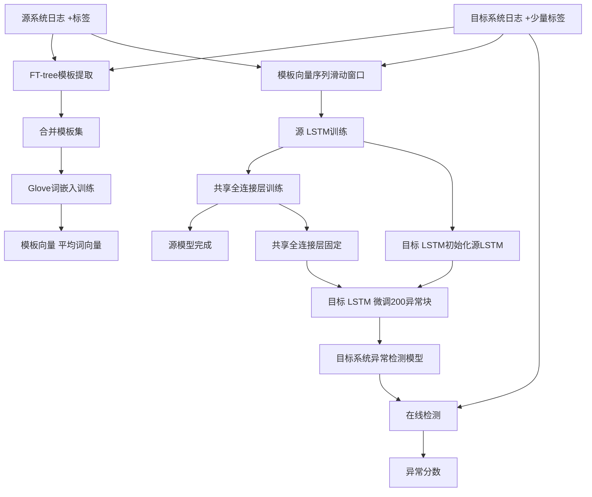
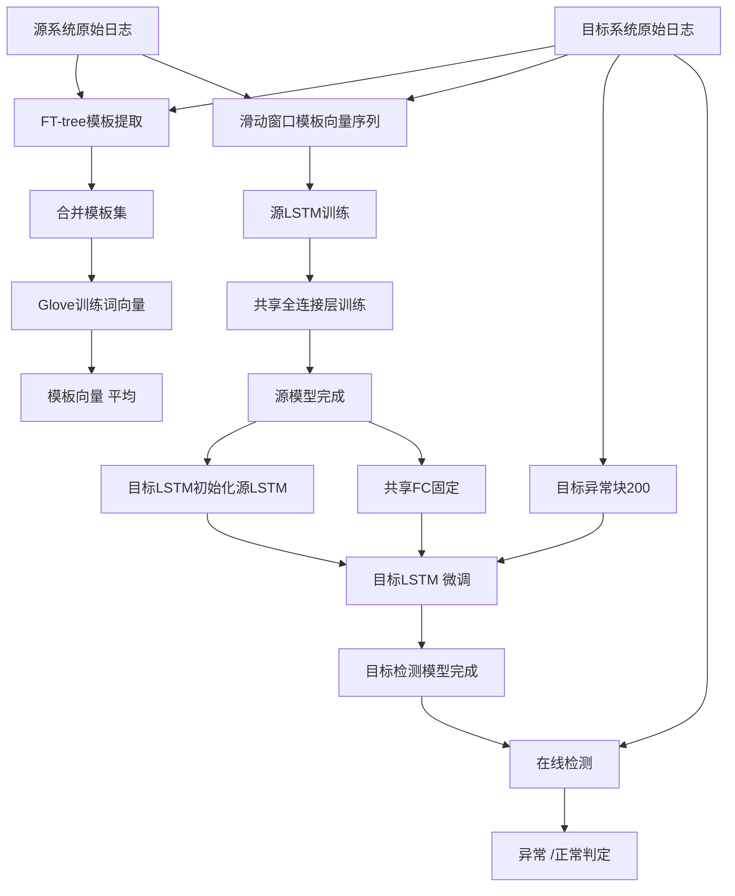

# LogTransfer: Cross-System Log Anomaly Detection for Software Systems with Transfer Learning（ISSRE2020）

> 作者：Rui Chen, Shenglin Zhang, Dongwen Li, Yuzhe Zhang, Fangrui Guo, Weibin Meng, Dan Pei, Yuzhi Zhang, Xu Chen, Yuqing Liu
>机构：南开大学；清华大学
> 发表年份：2020
>会议/期刊：ISSRE2020（IEEE International Symposium on Software Reliability Engineering）
>关联 PDF：同目录下 `paper-ISSRE20-LogTransfer.pdf`

## 一、文档信息速览

|字段 | 值 |
|---|---|
|标题 | LogTransfer: Cross-System Log Anomaly Detection for Software Systems with Transfer Learning |
| 作者 | Rui Chen, Shenglin Zhang, Dongwen Li, Yuzhe Zhang, Fangrui Guo, Weibin Meng, Dan Pei, Yuzhi Zhang, Xu Chen, Yuqing Liu |
|机构 | 南开大学；清华大学 |
| 发表年份 |2020 |
|会议/期刊 | ISSRE2020 |
|分类 |跨系统日志异常检测 /迁移学习 / Glove + LSTM |
|核心问题 |同一公司不同类型软件系统日志语法差异大；目标系统标注不足；现有方法准确率低 |
| 主要贡献 | (1)首次把迁移学习用于日志异常检测；(2) 用 Glove提取跨系统日志语义；(3) 提出共享全连接层（而非 LSTM 层）的迁移策略；(4) 在工业交换机日志 +公开 HDFS / Hadoop 数据集上平均 F1=0.84 |

## 二、背景（Background）

现代软件服务规模与复杂度急剧增长，一个大型云服务商往往部署数十到数百种不同类型的软件系统（不同厂商的交换机 /路由器 /防火墙、不同 Linux发行版、不同 Hadoop 应用）。每种系统都生成自己特定格式的系统日志，因此日志在语法上差异很大，但在语义上往往相似——例如两个厂商的交换机都可能在日志中表达"接口从 up变 down"，只是字段顺序和变量不同。

现有的日志异常检测方法分为两类：

1. **无监督方法**（PCA、LogCluster、Invariant Mining、DeepLog、LogAnomaly）：不需要标签，但对高度多样化的日志准确率较低。
2. **监督方法**（SVM、Decision Tree、CNN-based、Linear Regression）：准确率高，但需要大量人工标注。对于大型云服务商，逐一标注每种系统的异常日志代价极高，**实际上不可行**。

论文提出 LogTransfer，核心思想是 **跨系统迁移学习**：用一个标注充分的"源系统"（source system）训练得到的异常检测模型，迁移到一个标注不足的"目标系统"（target system），从而在不需要为目标系统标注大量数据的前提下获得高精度检测。直觉是不同系统的异常日志模式往往语义相似——例如"interface flapping"在两个厂商交换机上的日志序列结构类似。

论文还要解决两个挑战：

- **跨系统日志相似度度量**：传统 word2Vec只考虑局部上下文，无法稳健度量跨系统日志相似度。
- **异常序列中的噪声**：异常日志序列中往往夹杂无关日志（如操作员登录 /登出），这些噪声会降低 LSTM 的迁移效果。

## 三、目的（Problems Solved）

- **跨系统标注不可行**：用源系统的标注训练，迁移到目标系统，目标系统只需少量异常块（200 个）即可微调。
- **跨系统日志相似度**：用 Glove提取词向量，结合全局共现和局部上下文。
- **噪声鲁棒**：不共享 LSTM（因 LSTM对序列噪声敏感），而共享全连接层（对异常分类更稳健）。
- **大规模工业部署**：在顶级云服务商2 年期交换机日志上 F1=0.8368，HDFS / Hadoop 上 F1=0.977。

## 四、核心原理（Principles）

**系统总览**：LogTransfer分为两阶段——(1) 表示构造：用 FT-tree提取模板 → Glove训练词向量 →模板向量（词向量平均）→模板向量序列。(2)迁移学习：源系统先训练"源 LSTM +共享全连接层"，目标系统用源 LSTM初始化目标 LSTM，并复用共享全连接层，仅用目标系统少量标注数据微调全连接层。

**关键概念**：

- **Source System**：标注充分的软件系统（如交换机 Type A）。
- **Target System**：标注不足的软件系统（如交换机 Type B）。
- **Template Embedding**：用词向量平均表示模板。
- **Glove**：全局共现 +局部上下文的词嵌入方法。
- **Transfer Learning**：跨系统知识迁移。
- **Shared Fully Connected Layer**：源 /目标系统共享的全连接分类层。
- **Sequential Feature**：LSTM提取的序列模式。
- **Noise in Anomaly Sequence**：异常序列中的无关日志（如登录 /登出）。
- **Anomalous Chunk**：连续多行日志组成的时间窗口，标注为正常或异常。

**数学原理**：

- **Glove目标函数**（论文 Eq.1）：

$$
J = \sum_{i,j=1}^{V} f(X_{ij}) \left(w_i^{\top} \tilde{w}_j + b_i + \tilde{b}_j - \log X_{ij}\right)^2
$$

其中 $V$ 为模板集大小，$w_i, \tilde{w}_j$ 为词向量与上下文向量，$b_i, \tilde{b}_j$ 为偏置，$X_{ij}$ 为词 $j$ 在词 $i$上下文中的共现次数。

- **权重函数**（论文 Eq.2）：

$$
f(x) = \begin{cases} (x / x_{\max})^{\alpha} & \text{if } x < x_{\max} \\1 & \text{otherwise} \end{cases}
$$

论文取 $\alpha =3/4$。

- **模板向量**（论文 Eq.3，对模板 $t$ 求词向量平均）：

$$
t = \frac{1}{n} \sum_{k=1}^{n} w_k
$$

其中 $n$ 为模板词数，$w_k$ 为词 $k$ 的 Glove 向量。

- **LSTM单元核心**（简化）：

$$
\begin{aligned}
f_t &= \sigma(W_f [h_{t-1}, x_t] + b_f) \\
i_t &= \sigma(W_i [h_{t-1}, x_t] + b_i) \\
\tilde{c}_t &= \tanh(W_c [h_{t-1}, x_t] + b_c) \\
c_t &= f_t \odot c_{t-1} + i_t \odot \tilde{c}_t \\
o_t &= \sigma(W_o [h_{t-1}, x_t] + b_o) \\
h_t &= o_t \odot \tanh(c_t)
\end{aligned}
$$

- **共享全连接层分类**：

$$
\hat{y} = \sigma(W_{fc} h_T + b_{fc})
$$

- **Precision / Recall / F1**：

$$
P = \frac{TP}{TP+FP}, \quad R = \frac{TP}{TP+FN}, \quad F1 = \frac{2PR}{P+R}
$$

**与现有技术的差异**：与 TraceAnomaly / LogAnomaly（仅在单个系统内检测）不同，LogTransfer 是第一个把迁移学习用于跨系统日志异常检测的工作；与 word2Vec相比，Glove 同时考虑全局共现与局部上下文，能更稳健地度量跨系统日志相似度；与直接共享 LSTM 的朴素迁移相比，共享全连接层对序列噪声更稳健。

## 五、算法详解（Algorithm）

1. **输入 / 输出**：
 - 输入：源系统原始日志 +源系统异常标签；目标系统原始日志 +少量目标异常块（200 个）作为微调。
 - 输出：目标系统上每条日志块（chunk）的异常 /正常判定。

2. **核心模块**：
 - **模板提取**：用 FT-tree 从源 /目标系统日志提取模板。
 - **Glove词嵌入训练**：在源 +目标合并的模板集上训练 Glove，得到词向量。
 - **模板嵌入**：对每条日志匹配模板，用模板内词向量平均得到模板向量。
 - **模板向量序列**：用滑动窗口（$W=20$，$S=4$）构造日志块，每个块包含 $W$ 个模板向量。
 - **源模型训练**：源 LSTM（$\alpha=128, L=2$）+共享全连接层（$\beta=192$），用源系统标注训练。
 - **目标模型微调**：目标 LSTM 由源 LSTM初始化；共享全连接层固定不变；用目标系统200 个异常块微调目标 LSTM + 全连接层。
 - **在线检测**：新目标日志块 →模板向量序列 →目标 LSTM →共享全连接层 →异常分数。

3. **伪代码**：

```python
def ft_tree_extract(logs):
 """用 FT-tree提取模板"""
 templates = ft_tree.fit(logs)
 return templates

def glove_train(templates, dim=100, alpha=3/4, xmax=10):
 """在所有模板的词集上训练 Glove"""
 cooccur = build_cooccurrence_matrix(templates)
 W = glove_fit(cooccur, dim=dim, alpha=alpha, xmax=xmax)
 return W # {word: vector}

def template_vector(tmpl, W):
 """模板向量 =词向量平均"""
 words = tmpl.split()
 vecs = [W[w] for w in words if w in W]
 return np.mean(vecs, axis=0)

def build_chunks(logs, templates, W, W_size=20, S=4):
 """滑动窗口构造日志块（chunk）"""
 tmpl_vecs = [template_vector(match_template(l, templates), W) for l in logs]
 chunks = []
 for i in range(0, len(tmpl_vecs)-W_size+1, S):
 chunks.append(tmpl_vecs[i:i+W_size])
 return np.array(chunks)

def train_source_model(chunks_src, labels_src, alpha=128, L=2, beta=192):
 """训练源 LSTM +共享全连接层"""
 src_lstm = LSTM(input_dim=100, hidden_dim=alpha, num_layers=L)
 shared_fc = FullyConnected(alpha, beta)
 shared_fc.train()
 for ep in range(epochs):
 h = src_lstm.forward(chunks_src)
 y_hat = sigmoid(shared_fc.forward(h[:, -1, :]))
 loss = bce(y_hat, labels_src)
 loss.backward()
 return src_lstm, shared_fc

def transfer_to_target(src_lstm, shared_fc, chunks_tgt, labels_tgt_few):
 """目标 LSTM =源 LSTM初始化；微调目标 LSTM"""
 tgt_lstm = LSTM.from(src_lstm) #复制参数
 for ep in range(epochs):
 h = tgt_lstm.forward(chunks_tgt)
 y_hat = sigmoid(shared_fc.forward(h[:, -1, :]))
 loss = bce(y_hat, labels_tgt_few)
 loss.backward()
 return tgt_lstm, shared_fc

def detect(tgt_lstm, shared_fc, chunk):
 h = tgt_lstm.forward(chunk)
 score = sigmoid(shared_fc.forward(h[:, -1, :]))
 return score >0.5
```

4. **关键数学**：见 §四。

5. **复杂度分析**：
 - Glove训练：$O(|V|^2 \cdot d)$，$V$ 为词汇量，$d$ 为词向量维度。
 -模板向量：$O(n \cdot d)$，$n$ 为模板词数。
 - LSTM 前向：$O(|E| \cdot d)$，$|E|$ 为边数。
 -共享 FC 前向：$O(\alpha \cdot \beta)$。

6. **训练与推理**：
 -训练：(1) FT-tree模板提取；(2) Glove训练；(3)源 LSTM +共享 FC训练；(4) 用200 个目标异常块微调目标 LSTM。
 -推理：目标日志 →模板匹配 →模板向量序列 →目标 LSTM →共享 FC →异常分数。

7. **示例**：交换机 Type A 日志 `[SIF pica_sif]Interface te-1/1/11, changed state to down` 与 Type B 日志 `%%10IFNET/3/LINK_UPDOWN(l): GigabitEthernet1/0/10 link status is DOWN.`语法差异大。Glove 在合并的模板集上训练后，"Interface / down / state / link" 等词向量在不同系统的相似词周围聚集。LogTransfer 在 Type A 上训练源模型，再用 Type B 的200 个异常块微调，即可在 Type B 上获得 F1=0.84。

## 六、系统架构图（Architecture）



## 七、流程图（Process Flow）



## 八、关键创新点（Key Innovations）

- **+首次把迁移学习用于日志异常检测**：跨厂商 /跨系统复用异常检测知识。
- **+ Glove 而非 word2Vec**：利用全局共现 +局部上下文，跨系统词向量更稳健。
- **+共享全连接层而非 LSTM 层**：对序列噪声（操作员登录 /登出等无关日志）更稳健。
- **+目标系统只需200 个异常块微调**：显著降低标注成本。
- **+工业 +公开数据集双验证**：顶级云服务商的2 年期交换机日志 + HDFS + Hadoop。

## 九、实验与结果（Experiments）

- **数据集**（论文 Table I）：
 - Switch Type A：2,345,646 chunks，6,406异常 chunks，22交换机。
 - Switch Type B（target）：49,946 chunks，1,096异常 chunks，14交换机。
 - Switch Type C：525,427 chunks，4,939异常 chunks，21交换机。
 - Hadoop 应用：121,878 chunks，73,936异常 chunks。
 - HDFS：3,725,203 chunks，108,024异常 chunks。
- **Baseline**：
 -监督：Linear Regression、SVM、Decision Tree、CNN-based。
 - 无监督：PCA、Isolation Forest、Invariant Mining、LogCluster、DeepLog、LogAnomaly。
- **指标**：Precision、Recall、F1-score、AUC。
- **关键结果数字**：
 - **LogTransfer 在 Type A → Type B 上 F1 =0.8368，AUC =0.892**（论文 Table II/III）；Type C → Type B 类似。
 - **HDFS → Hadoop 应用 F1 =0.977**（论文 Fig.12）。
 -显著优于所有 Baseline：Linear Reg AUC0.663、SVM0.754、Decision Tree0.745、CNN0.682、DeepLog0.5、LogAnomaly0.676、PCA0.538。
 -共享 FC vs共享 LSTM：共享 FC 的 F1更高、Recall更高（论文 Fig.9）。
 - Glove vs word2Vec：Glove 的 F1=0.8606，AUC=0.9243；word2Vec F1=0.8368，AUC=0.8881（论文 Table III）。
 - 微调曲线（论文 Fig.11）：目标系统异常块从50增到200，F1显著提升；继续增加收益递减。
- **消融实验**：
 -去掉迁移学习：准确率显著下降（论文 Fig.9）。
 -共享 LSTM 层：因噪声鲁棒性差，F1下降。
 -换用 word2Vec：F1 从0.8606降到0.8368（论文 Table III）。
- **效率分析**：服务器 Intel Xeon E512 cores CPU，128 GB RAM；LSTM训练小时级；在线检测毫秒级。

## 十、应用场景（Use Cases）

- **多厂商交换机 /路由器 /防火墙日志异常检测**：在一个厂商型号上训练，迁移到其他厂商型号。
- **多 Linux发行版日志异常检测**：Red Hat / CentOS / Ubuntu / Windows 之间迁移。
- **多 Hadoop 应用日志异常检测**：HDFS / WordCount / PageRank 之间迁移。
- **大型云服务商统一异常检测平台**：以源系统模型为基础，逐步扩展到所有目标系统。
- **新服务上线冷启动**：新系统仅有少量标注时，可借助迁移学习快速建立异常检测能力。

##十一、相关论文（Related Papers in this set）

- `LogAnomaly`（IJCAI19）：单系统日志异常检测，LogTransfer 可视为其跨系统扩展。
- `DeepLog`（CCS17）：LSTM 日志异常检测。
- `LogParse-ICCCN20`：模板提取方法 FT-tree 也被 LogTransfer 使用。
- `Device_Agnostic_Log_Anomaly_Classification`（IWQoS18）：与 LogTransfer 同作者团队，关注日志分类。
- `孟伟斌LogClass_Anomalous_Log_Identification_and_Classification_With_Partial_Labels`（TNSM21）：LogClass期刊版。
- `TraceSieve_ISSRE23`：追踪异常检测，作者团队相关。

##十二、术语表（Glossary）

- **Source System**：源系统，标注充分的软件系统。
- **Target System**：目标系统，标注不足的软件系统。
- **Transfer Learning**：迁移学习，把源系统学到的知识迁移到目标系统。
- **Template Embedding**：模板嵌入，模板的向量表示。
- **Glove**：全局向量词嵌入方法。
- **word2Vec**：局部上下文词嵌入方法（用于对比）。
- **FT-tree**：频繁项挖掘模板提取方法。
- **Shared Fully Connected Layer**：源 /目标系统共享的全连接层。
- **LSTM**：长短期记忆网络，提取序列特征。
- **Chunk**：日志块，连续多行日志组成的时间窗口。
- **Noise in Anomaly Sequence**：异常序列中的无关日志（如操作员登录 /登出）。
- **Anomaly Label**：异常标注。
- **AUC**：ROC曲线下面积。
- **Precision / Recall / F1**：评估指标。

##十三、参考与延伸阅读

- Paper: Glove（Pennington et al., EMNLP2014）——全局共现词嵌入。
- Paper: word2Vec（Mikolov et al.,2013）——局部上下文词嵌入。
- Paper: LSTM（Hochreiter & Schmidhuber,1997）——长短期记忆网络。
- Paper: FT-tree（Zhang et al., IWQoS2017）——频繁项挖掘日志解析。
- Paper: DeepLog（Du et al., CCS2017）——LSTM 日志异常检测。
- Paper: LogAnomaly（Meng et al., IJCAI2019）——日志异常检测。
- Paper: Transfer Learning（Pan & Yang, IEEE TKDE2010）——迁移学习综述。
-工具：FT-tree、Glove、PyTorch LSTM、Scikit-learn。
- 相关论文目录：`LogAnomaly`、`Device_Agnostic_Log_Anomaly_Classification`、`LogParse-ICCCN20`、`TraceSieve_ISSRE23`。
