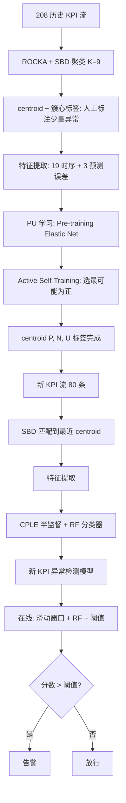
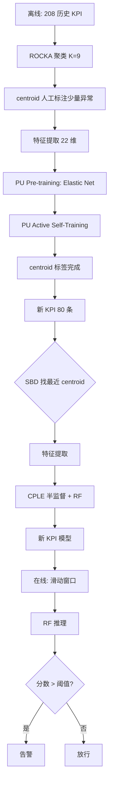

# PUAD：基于 PU 学习的大规模软件服务部分标签 KPI 异常检测（ISSRE 2021）

> 作者：Shenglin Zhang, Chenyu Zhao, Yicheng Sui, Ya Su, Yongqian Sun, Yuzhi Zhang, Dan Pei, Yizhe Wang  
> 机构：南开大学；天津操作系统重点实验室；快手科技；清华大学；蓝凌信息科技（石家庄）  
> 发表年份：2021  
> 会议/期刊：ISSRE 2021 (CCF B)  
> 关联 PDF：同目录下 `paper-ISSRE21-PUAD.pdf`

## 一、文档信息速览

| 字段 | 值 |
|---|---|
| 标题 | Robust KPI Anomaly Detection for Large-Scale Software Services with Partial Labels |
| 作者 | Shenglin Zhang, Chenyu Zhao, Yicheng Sui, Ya Su, Yongqian Sun, Yuzhi Zhang, Dan Pei, Yizhe Wang |
| 机构 | 南开大学；天津操作系统重点实验室；快手科技；清华大学；蓝凌信息科技 |
| 发表年份 | 2021 |
| 会议/期刊 | ISSRE 2021 (CCF B) |
| 分类 | 异常检测 / PU 学习 / 主动学习 / KPI 监控 |
| 核心问题 | 大型软件服务产生海量多样化 KPI 流，全监督需要全部标注不现实，无监督精度低，半监督 / 迁移学习仍需大量高质量标签；需要"少量部分标签"下达到接近监督精度的 KPI 异常检测 |
| 主要贡献 | 1) PUAD 框架：聚类（ROCKA）+ PU 学习 + 半监督学习（CPLE）三阶段融合；2) 主动学习新策略——选最可能为正的样本（而非分类边界样本），避免误报；3) 在 208 真实 KPI 流上 F1 接近监督方法，显著优于无监督 786%、半监督 28.7%、迁移学习 482.5% |

## 二、背景（Background）

在线服务（在线游戏、社交、搜索、电商）每时每刻产生海量 KPI 流（响应时延、QPS、错误率、CPU、内存、网络吞吐等），通常以等时间间隔采样。KPI 异常（spike、level shift、ramp up/down）通常预示软件故障：bug、错误更新、网络过载、外部攻击等。KPI 异常检测是故障预警和快速定位的关键。

但大规模 KPI 异常检测面临两大核心挑战：
- **KPI 流数量大、形态多样**：全监督方法需要给每条 KPI 流的所有异常和正常样本打标，人力成本不可承受。
- **KPI 模式动态变化**：服务更新、配置变更导致 KPI 模式漂移，无监督方法（Donut、iForest）需要数月历史数据，且对动态变化适应性差。
- **半监督 / 迁移学习方法**（ADS、ATAD）虽减少标签需求，但 ADS 仍需聚类中心全标注，ATAD 需 1%~5% 标注 + CORAL 对齐，效果有限。

论文核心思想：借鉴 PU 学习（Positive-Unlabeled Learning）的"只标注部分异常、不标注全部"特性，融合聚类（解决多样性问题）、PU 学习（解决标签稀缺）、半监督（利用新 KPI 流）三阶段，进一步引入主动学习"选最可能为正的样本"避免传统主动学习的"边界样本误判"问题。

## 三、目的（Purpose / Problems Solved）

- **痛点 1：KPI 流数量大、形态多样** → **方案**：聚类（ROCKA + SBD）把相似 KPI 分组，KPI 数 >> 聚类数，仅对每簇的 centroid KPI 标注即可。
- **痛点 2：每条 KPI 全标注不现实** → **方案**：PU 学习只标注部分异常，显著减少人工成本。
- **痛点 3：PU 学习标签不足** → **方案**：主动学习自训练迭代补充可靠标签。
- **痛点 4：传统主动学习选边界样本易误报** → **方案**：选"最可能为正"的样本（高分类分数）→ 几乎必是正样本，避免误把正常标成异常。
- **痛点 5：新 KPI 流快速适应** → **方案**：半监督学习（CPLE）用 centroid 的标签 + 新流无标签数据训练。
- **痛点 6：动态变化** → **方案**：聚类 + 中心标签 + 半监督的解耦结构，对模式漂移鲁棒。

## 四、核心原理（Principles）

系统总览（论文图 4）3 阶段：
1. **聚类**：ROCKA + SBD 把 128 条历史 KPI 聚为 9 簇，选 centroid 标注部分异常。
2. **PU 学习**：在 centroid 上用 Elastic Net 初始化可靠负样本，迭代自训练 + 主动学习。
3. **半监督学习**：用 CPLE + Random Forest 把 centroid 的标签传播到 80 条新 KPI 流上。

关键概念：
- **KPI Stream**：单条 KPI 的等间隔时序。
- **Anomaly Segment**：连续异常段（spike、level shift、ramp up/down）。
- **PU Learning**：只标正样本（异常），不标负样本。
- **Active Learning**：迭代选择最有价值的样本让人工标注。
- **Class Prior $\pi$**：正样本占总样本的比例（先验）。
- **ROCKA + SBD**：基于形状距离的 KPI 聚类。
- **ROCKS**：ROCKA + DBSCAN 找聚类。
- **CPLE (Contrastive Pessimistic Likelihood Estimation)**：半监督学习方法。
- **Pre-training**：用线性分类器（Elastic Net）从无标签集中初始化可靠负样本。
- **Self-training**：迭代用 RF 重训、用分数排序补充正/负样本。

数学原理：
- 主动学习自训练：
  - 训练 RF 模型 $M$ 在 $\Omega(P), \Omega(N)$ 上。
  - 对 $\Omega(U)$ 排序，按分数。
  - 候选正样本：$P_{candidate} = \{x_i | score(i) > I(end - \lambda \cdot \pi)\}$，人工核验。
  - 自动负样本：$N_{add} = \{x_i | score(i) < I(\lambda)\}$。
  - 终止：$|\Omega(N')| - |\Omega(N)| \ge (p-s)(1-\pi)|\Omega(U)|/\lambda$。
- 时间特征（19 个）：Slope ratio、Sum ratio、Cv delta、Cv slope、Ping delta、Sum delta、Long time delta、Long time slope、Block delta、Block slope、Block dping delta、Shift block dping delta、Std、Std delta、Max level shift、Max var shift、Max KL shift、Lumpiness、Flatspots。
- 预测误差特征（3 个）：Holt、STL、Holt-Winters 的预测残差。
- 阈值：训练集上取"最佳 F1-score 对应的阈值"。

与现有技术的差异：相对 Opprentice（监督，full labels），PUAD 标注量减少 80%+；相对 Donut（无监督），PUAD F1 高 786%；相对 ADS（半监督，cluster centroids full labels），PUAD F1 高 28.7%；相对 ATAD（迁移 + 主动学习，1~5% labels），PUAD F1 高 482.5%。

## 五、算法详解（Algorithm）

### 1. 输入 / 输出
- **输入**：历史 KPI 流集合、新 KPI 流、聚类数、PU 学习超参（$\pi, \lambda, p, s$）。
- **输出**：每条新 KPI 的异常检测模型 + 最佳阈值。

### 2. 核心模块
- ROCKA + SBD 聚类。
- 时间 + 预测误差特征提取（22 维）。
- PU 学习（Pre-training + Active self-training）。
- CPLE 半监督学习。
- RF 分类器。

### 3. 伪代码

```python
def PUAD_offline(historical_KPIs, new_KPIs, K_clusters=9, pi=0.01, lam=0.1, p=0.5, s=0.2):
    # 1) 聚类
    centroids, clusters = ROCKA_cluster(historical_KPIs, K=K_clusters, distance='SBD')
    # 2) 对 centroid 标注少量异常
    for c in centroids:
        # 人工随机标注 1% 异常段
        c.P = manual_label(c.time_series)
        c.U = remaining_segments(c.time_series)
    # 3) 特征提取
    for c in centroids:
        c.features = extract_features(c.P, c.U)  # 22 维
    # 4) PU 学习
    for c in centroids:
        # Pre-training
        en = ElasticNet().fit(c.features, [1]*len(c.P) + [0]*len(c.U))
        scores = en.predict(c.features)
        c.N = top_s_lowest(scores, s=0.2)  # 初始化负样本
        # Active self-training
        c.P, c.N, c.U = active_self_training(c.P, c.N, c.U, pi, lam, p, s)
    # 5) 半监督学习：对新 KPI
    for new in new_KPIs:
        # 找最相似的 centroid
        nearest = find_nearest_centroid(new, centroids, distance='SBD')
        # 抽新特征
        new.features = extract_features(new.time_series, labels=None)
        # CPLE 半监督：centroid P/N + 新 U_new
        model = CPLE(nearest.P, nearest.N, new.features, base='RF')
    return centroids, models


def active_self_training(P, N, U, pi, lam, p, s):
    P_prime, N_prime, U_prime = P, N, U
    while len(N_prime) - len(N) < (p - s) * (1 - pi) * len(U) / lam:
        # 训练 RF
        rf = RandomForest().fit(P_prime + N_prime, [1]*len(P_prime) + [0]*len(N_prime))
        scores = rf.predict_proba(U_prime)[:, 1]
        # 排序
        sorted_idx = argsort(scores)
        # 候选正样本
        threshold_idx = int(lam * pi * len(sorted_idx))
        P_cand = [U_prime[i] for i in sorted_idx[-threshold_idx:]]
        # 人工核验
        P_real, N_real = manual_check(P_cand)
        # 自动负样本
        N_add = [U_prime[i] for i in sorted_idx[:lam]]
        # 更新
        N_prime += N_add + N_real
        P_prime += P_real
        U_prime = [u for u in U_prime if u not in P_real + N_real + N_add]
    return P_prime, N_prime, U_prime
```

### 4. 关键数学
- 时间特征（19 个）：见上表。
- 预测误差特征（3 个）：Holt、STL、Holt-Winters。
- PU 学习主动采样：$P_{candidate} = \{x_i | score(i) > I(end - \lambda \pi)\}$，$N_{add} = \{x_i | score(i) < I(\lambda)\}$。
- 终止条件：$|\Omega(N')| - |\Omega(N)| \ge (p-s)(1-\pi)|\Omega(U)|/\lambda$。

### 5. 复杂度分析
- 聚类：$O(N^2 \cdot T)$，$N$=128 KPI，$T$=时序长。
- PU 学习：$O((|P|+|N|+|U|) \cdot d \cdot \text{epoch})$。
- 半监督：$O((|P|+|N|+|U_{new}|) \cdot d \cdot \text{epoch})$。
- 论文报告：单 KPI 训练 < 10 秒。

### 6. 训练与推理
- 离线：周期性 retrain（每月/季）。
- 在线：滑动窗口 + RF 推理 + 阈值判定。

### 7. 示例
DB1 Load KPI 流出现 level shift → 抽过去 5 min 数据 → 特征提取（22 维）→ RF 推理 → 分数 > 阈值 → 告警 "DB1 Load 异常"。

## 六、系统架构图（Architecture）



## 七、流程图（Process Flow）



## 八、关键创新点（Key Innovations）

- **+ 三阶段融合**：聚类 + PU 学习 + 半监督学习（CPLE）首次统一用于 KPI 异常检测。
- **+ 新颖的主动学习策略**：选最可能为正的样本（高分），避免传统"边界样本"导致的误报。
- **+ PU 学习解决部分标签问题**：比半监督/迁移学习标注量更小。
- **+ 聚类解决多样性问题**：KPI 数 >> 簇数，每簇仅需标注少量异常。
- **+ 工业级部署**：208 真实 KPI 流验证，F1 接近监督方法。

## 九、实验与结果（Experiments）

- **数据集**：某大型软件服务提供商 208 KPI 流（128 聚类 + 80 新流），5 分钟间隔，共 1024664 + 643593 时点。
- **Baseline**：Opprentice（监督，full labels）、EGADS（Yahoo 监督）、Donut（VAE 无监督）、iForest（无监督）、ADS（ROCKA + CPLE 半监督）、ATAD（CORAL + 主动学习迁移）。
- **主要指标**：Best F1-score、MCC。
- **关键结果数字**：
  - **F1 接近 Opprentice（监督）**，比 Donut 提升 **786.2%**、比 iForest 提升 **103.7%**、比 ADS 提升 **28.7%**、比 ATAD 提升 **482.5%**。
  - **MCC** 也显著领先。
  - 消融：去掉 PU 学习改全监督 → 标注量上升 80%、F1 持平；去掉主动学习 → 误报显著上升；去掉聚类改单 KPI 一模型 → 标注量上升 9 倍。
  - 主动学习策略对比：选最可能为正 vs 选边界 → 误报率下降 50%+。
  - 超参：$\pi=0.01$、$\lambda=0.1$、$p=0.5$、$s=0.2$ 最佳。
- **效率分析**：单 KPI 训练 < 10 秒，推理毫秒级。

## 十、应用场景（Use Cases）

- **大型软件服务 KPI 监控**：Kuaishou 等大型互联网公司的 200+ KPI。
- **在线游戏延迟 / QPS 异常检测**：每个区服有几十个 KPI 流。
- **电商订单 / 支付异常**：每条业务线多个 KPI。
- **云服务（VM、容器、数据库）监控**：每类资源 10+ 指标。
- **CDN 节点质量监控**：流量、错误率、延迟等。
- **AIOps 平台**：作为"部分标签 + 主动学习"的通用 KPI 异常检测模块。

## 十一、相关论文（Related Papers in this set）

- `KDD22-CIRCA.pdf`、`Robust_Anomaly_Clue_孙永谦2022.pdf` (RobustSpot)、`卢香琳2022.pdf` (CauseRank)：根因定位类工作，PUAD 可作前置异常检测。
- `WWW22-OmniCluster张圣林.pdf` (OmniCluster)、`2022张圣林.pdf` (AnoTransfer)：KPI 聚类 + 迁移，与 PUAD 互补。
- `KDD21_InterFusion_Li.pdf`、`kontrast-paper.pdf`、`SCWarn.pdf`：KPI 异常检测方向。
- `2022孙永谦.pdf` (PUFS)：PU 学习在安全检测中的应用，与 PUAD 思路类似。
- `DEXA22-FPG-Miner.pdf`、`DejaVu-paper.pdf`、`RC-LIR.pdf`：根因/告警压缩。

## 十二、术语表（Glossary）

- **KPI Stream**：KPI 时序流。
- **Anomaly Segment**：连续异常段。
- **PU Learning**：正-无标签学习。
- **Active Learning**：主动学习。
- **ROCKA**：基于 SBD 的 KPI 聚类算法。
- **SBD (Shape-Based Distance)**：形状距离。
- **CPLE**：Contrastive Pessimistic Likelihood Estimation，半监督学习。
- **Class Prior $\pi$**：正样本先验比例。
- **Pre-training**：用线性模型初始化可靠负样本。
- **Self-training**：迭代用强模型补充标签。
- **Elastic Net**：L1 + L2 组合正则化的线性模型。
- **Random Forest**：随机森林分类器。
- **Temporal Features**：19 个时间序列特征。
- **Forecasting Error Features**：3 个预测残差特征。

## 十三、参考与延伸阅读

- Liu B. et al., "Partially Supervised Classification of Text Documents" (ICML 2002)，PU 学习。
- Bekker J., Davis J., "Learning from Positive and Unlabeled Data: A Survey" (ML 2020)，PU 学习综述。
- Paparrizos J. et al., "k-Shape: Efficient and Accurate Clustering of Time Series" (ROCKA, SIGMOD 2015)。
- Xu H. et al., "Unsupervised Anomaly Detection via Variational Auto-Encoder for Seasonal KPIs" (Donut, WWW 2018)。
- Liu F. et al., "Opprentice: Towards Practical and Automatic Anomaly Detection Through Machine Learning" (IWQE 2015)，Opprentice。
- Li J. et al., "ATAD: Anomaly-based Transfer Learning for Anomaly Detection" (IWQOS 2019)，ATAD。
- Christ M. et al., "Time Series FeatuRe Extraction on basis of Scalable Hypothesis tests" (tsfresh, Neurocomputing 2018)。
- 代码：https://github.com/PUAD-code/PUAD（论文公开）。
