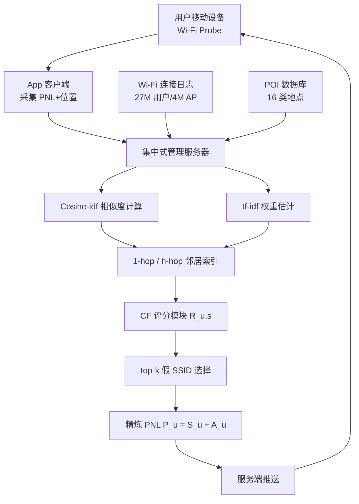
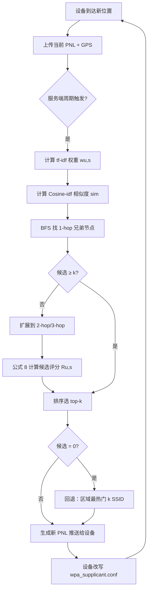

# Preventing Wi-Fi Privacy Leakage: A User Behavioral Similarity Approach（ICDCS 2017 / IEEE ToN 2018）

> 作者：Xiuping Han, Zhi Wang, Dan Pei  
> 机构：清华大学深圳研究生院计算机科学与技术系；清华大学计算机科学与技术系  
> 发表年份：2018（期刊扩展版；会议版为 ICDCS 2017）  
> 会议/期刊：IEEE Transactions on Network Science and Engineering / IEEE Transactions on Dependable and Secure Computing 等相关期刊与会议系列  
> 关联 PDF：同目录下 `paper-publication-1.pdf`

## 一、文档信息速览

| 字段 | 值 |
|---|---|
| 标题 | Preventing Wi-Fi Privacy Leakage: A User Behavioral Similarity Approach |
| 作者 | Xiuping Han, Zhi Wang, Dan Pei |
| 机构 | Tsinghua University（Graduate School at Shenzhen；Department of Computer Science and Technology） |
| 发表年份 | 2018 |
| 会议/期刊 | 期刊扩展版（与 ICDCS 2017 会议版配套） |
| 分类 | 网络 / 隐私保护 / 移动测量 |
| 核心问题 | 移动设备通过 probe request 主动扫描时泄露 SSID 列表，攻击者据此可识别用户身份、推断位置、社交关系与行为偏好 |
| 主要贡献 | (1) 基于 27M 用户 / 4M AP 的大规模测量，证明 90% 用户可被唯一识别；(2) 揭示 PNL 相似度越高、用户空间距离越近的规律；(3) 提出基于协同过滤的 PNL 模糊化（PNL Refinement）方案；(4) 在三个真实场景中证明方案有效且不影响 Wi-Fi 连接速度 |

## 二、背景（Background）

Wi-Fi 是移动设备最常用的网络接入技术之一。为了实现"快速连接"，手机、平板等终端会维护一份**首选网络列表（Preferred Network List, PNL）**，里面记录了用户过去连接过的 AP 的 SSID。在 802.11 主动扫描（active scan）阶段，设备会**周期性向外广播 probe request 帧**，把 PNL 里的 SSID 全部"喊"出来。文献 [1] 指出，一台终端在某些场景下每秒可发送多达 50 个 probe request，其中 98% 的包都包含 SSID。

攻击者只要在目标区域部署无线 sniffer，就能在几秒到几分钟内捕获这些 SSID，进而造成多层次的隐私泄露：
- **位置泄露**：SSID 经常自带语义，例如 "Corp.XXX net"、"HK Airport wifi"、"Tsinghua University"。Chernyshev 等人 [2] 发现约 49% 的 SSID 是可识别的，往往直接对应工作单位、机场、酒店等地点。
- **身份识别**：将多个 SSID 组合起来，可以像指纹一样把用户从人群中"挑出来"。本文作者的实验显示，在一个城市内，单日抓取的 SSID 集合就能唯一识别 54.6% 的用户；时间窗口放大到一个月后，这一比例上升到 90.58%。
- **偏好画像与社交关系**：SSID 集合还能推断用户兴趣 [3]、身份 [4]、移动轨迹 [5]、甚至朋友网络。

面对上述威胁，工业界与学术界已经做了两类补救：
1. **减少 probe request 中发送的 SSID 数量**，如 Bonné 等 [6] 在深度休眠时屏蔽超范围 SSID，但这通常需要修改 802.11 协议栈 [7]，部署代价高。
2. **MAC 地址随机化**：iOS 8+、Android 6.0+、Windows、Linux 都有不同程度的支持。但由于协议规范尚未统一、实现差异大，且在某些场景下（如关联已保存网络）仍会带真实 MAC 与真实 SSID 一起发送 [8]，因此**只解决"哪一台手机"的问题，没解决"哪些 SSID"的问题**。

所以业界缺一种**既不依赖协议改造、也不依赖操作系统升级**的客户端/服务端协同隐私保护策略。本文正是要补这个缺口。

## 三、目的（Purpose / Problems Solved）

- **痛点 1：现有保护方案对 SSID 内容泄露无效**  
  解决方案：保留真实 SSID、额外向 PNL 注入"假 SSID"，让攻击者无法区分真假，从而打破唯一识别。

- **痛点 2：完全消除 PNL 差异不可行**  
  移动设备 PNL 容量有限、且条目会按 LRU 动态更新 [15]，无法塞进海量 AP。  
  解决方案：只**减少差异**而非消除差异，在容量上限 k 内最大化 PNL 间相似度。

- **痛点 3：用户会移动，简单"全局共享 SSID 池"不现实**  
  不同城市的 AP 完全不同，跨地漫游会暴露新敏感信息。  
  解决方案：利用**用户行为相似性**——只参考与目标用户 PNL 相似、且**物理位置接近**的"邻居/sibling"，按需"借用"SSID。

- **痛点 4：注入假 SSID 不能影响上网体验**  
  主动扫描的延迟主要受 AP 密度和隐藏 AP 比例影响 [16]，与 PNL 长度关系很小。  
  解决方案：把假 SSID 数量限制为 k（实验中取 5~7），并通过周期更新避免污染真实关联。

- **痛点 5：缺乏可量化的"隐私泄露"度量**  
  解决方案：把"被识别概率"近似为"是否拥有唯一 SSID 子集"，并用 **Cosine-idf 相似度**作为可计算代理。

## 四、核心原理（Principles）

### 4.1 系统总览

整篇文章的核心思想可以浓缩成一句话：**把每个用户 PNL 模糊（blur）成"周围人的样子"，让攻击者无法用 SSID 集合把你区分出来**。具体做法分三步：

1. **离线度量**：基于腾讯 Wi-Fi 万能钥匙 4 座城市、一个月、27M 用户的真实连接日志，统计每个用户每天的 SSID 集合、AP 经纬度、POI 类型。
2. **相似性建模**：在每台设备或服务端，把用户间的 SSID 集合相似度转成社交网络（共享 SSID 即连边），定义 Cosine-idf 相似度衡量两个 PNL 接近程度。
3. **PNL Refinement**：每个用户取相似 + 物理邻近的 sibling，用基于协同过滤（CF）的算法从 sibling 的 PNL 中"推荐"少量未连接过的 SSID，写入设备 PNL；后续周期性轮换。

### 4.2 关键概念

- **PNL（Preferred Network List）**：用户过去连接过的 AP 的 SSID 列表。本文用"一个月内连接过的所有 SSID"近似。
- **SSID 集合（daily SSID set）**：模拟攻击者一次抓包能看到的 SSID 子集，本文用"一天内连接过的 SSID"近似。
- **Sibling**：与目标用户共享 SSID 最多、Cosine-idf 相似度最高的邻居。
- **h-hop 邻居**：社交网络中与目标用户距离不超过 h 跳的用户集合。1-hop 平均规模约 24 人，2-hop 可达数千。
- **faked SSID**：被额外写入 PNL、用于混淆的 SSID；设备在 probe 时会真实广播它们。
- **Cosine-idf 相似度**：在 Cosine 相似度基础上乘以 SSID 的 idf 权重（log(|U|/|Us|)），降低热门公共 SSID 的影响。

### 4.3 数学原理

**Cosine-idf 相似度**（论文公式 1-2）：

$$
C(S_u, S_v) = \frac{\sum_{s \in S_u \cap S_v} (\log \frac{|U|}{|U_s|})^2}{\sqrt{\sum_{s \in S_u} (\log \frac{|U|}{|U_s|})^2} \cdot \sqrt{\sum_{s \in S_v} (\log \frac{|U|}{|U_s|})^2}}
$$

其中 $f_s = |U_s|/|U|$ 是 SSID s 的流行度，|U| 是当前区域总用户数，|Us| 是连接过 SSID s 的用户数。直观：两个用户共同连接过越"冷门"的 SSID，相似度越高。

**SSID-用户权重（tf-idf 风格，论文公式 7）**：

$$
w_{u,s} = f_{u,s} \times \log\frac{|U|}{|U_s|}
$$

fu,s 是用户 u 连接过 SSID s 的频次。"自家 WiFi" 频次高、人人都连过的咖啡店连锁，idf 大、不会喧宾夺主。

**用户对候选 SSID 的打分（论文公式 8）**：

$$
R_{u,s} = w_u + \frac{\sum_{v \in U} (w_{v,s} - \bar{w}_v) \cdot \text{Sim}(S_u, S_v)}{\sum_{v \in U} \text{Sim}(S_u, S_v)}
$$

即在用户原有 SSID 平均分的基础上，加上 sibling 的贡献：与 u 越像的 v、且对 s 越看重（wv,s 大），s 就越值得被加进 u 的 PNL。这是经典 user-based CF 的 Item 评分预测形式。

**优化目标（论文公式 3-5）**：

$$
\max_{A \subset S} \sum_{u \in U} \sum_{v \in U \setminus u} \text{Sim}(S_u + A_u,\ S_v + A_v)
$$

$$
\text{s.t.}\quad A = \bigcup_{u \in U} A_u,\quad |A_u| \le k,\ \forall u
$$

直观：在每个用户 PNL 最多加 k 个 SSID 的预算下，最大化所有用户两两之间 PNL 相似度之和。

### 4.4 与现有技术的差异

| 现有方案 | 不足 | 本文差异 |
|---|---|---|
| Bonné 等 [6] 减少 SSID 发送量 | 需改协议、收益有限 | 不改协议，仅在 PNL 端注入假 SSID |
| Lindqvist 等 [7] 加密 challenge-response | 通信开销大、AP 端改造 | 纯客户端/App 端方案 |
| MAC 地址随机化 | 不防 SSID 泄露 | 攻击者即便拿到 SSID 也无法反推真实身份 |
| k-anonymity 等通用匿名模型 | SSID 是强标识符，无法泛化/抑制 | 利用行为相似性，**模糊化而非删除** |

## 五、算法详解（Algorithm）

### 5.1 输入 / 输出

- **输入**：所有用户 $U$ 在某区域某时刻的 PNL $S_u$；当前 AP 集合与位置；用户所在经纬度。
- **输出**：每个用户的新增 faked SSID 集合 $A_u$（$|A_u| \le k$），与精炼后的 PNL $P_u^T = S_u^{T-1} + A_u$。
- **运行位置**：可在 App 服务端集中计算再下发，也可放到终端本地；论文给出的是基于集中式管理服务器的实时流式推荐架构 [17]。

### 5.2 核心模块

1. **Cosine-idf 相似度计算模块**：扫一遍日志算每对用户的相似度，索引 1-hop 与 h-hop 邻居。
2. **tf-idf 权重模块**：统计每个 (u, s) 的连接频次和 SSID 流行度。
3. **CF 评分模块**：用公式 8 对所有未连接过的 SSID 打分，输出候选列表 $L_u$。
4. **BFS 候选扩展模块**：1-hop 邻居 SSID 不够 k 个时，BFS 拓展到 2-hop、3-hop。
5. **fallback 模块**：若整张图都找不到候选（用户 PNL 全是冷门独有 SSID），回退到"区域最热门 k 个 SSID"。
6. **PNL 更新模块**：服务端定期推送；Android 端通过改 `/data/misc/wifi/wpa_supplicant.conf` 文件落盘。

### 5.3 伪代码

```python
def refine_pnl(U, S, k=5, max_hop=3):
    A = {}                           # user -> set of faked SSIDs
    # 1. 计算 tf-idf 权重与用户相似度
    w = compute_tfidf_weights(U, S)  # w[u][s]
    sim = compute_cosine_idf(U, S)   # sim[u][v]

    for u in U:
        Lu = []                      # 候选 SSID -> 分数
        visited = set()              # Γ，已访问用户
        queue = deque([u])           # Q
        visited.add(u)
        # 2. BFS 搜索兄弟节点 SSID
        while queue and len(Lu) < k * 5:   # 多采一些便于排序
            cur = queue.popleft()
            for v in neighbor_1hop(cur, sim):
                if v in visited:
                    continue
                visited.add(v)
                queue.append(v)
                for s in S[v]:
                    if s in S[u]:          # 跳过已连接
                        continue
                    score = rating(w, sim, u, v, s)   # Eq.(8)
                    Lu.append((s, score))
                if len(Lu) >= k * 5 and len(visited) > 20:
                    break
        # 3. 排序选 top-k
        if len(Lu) == 0:
            A[u] = topk_popular_ssids(S, k)
        else:
            Lu.sort(key=lambda x: -x[1])
            A[u] = [s for s, _ in Lu[:k]]
    return A
```

> 算法 1 来自论文 IV-B 节。

### 5.4 关键数学

- 候选分数本质是 user-based CF 预测的"伪评分" $R_{u,s}$；
- 邻居扩展采用 BFS 限制 1-hop 优先，避免被超大社区稀释；
- 相似度更新周期建议为天级，论文提到"集中式管理服务器周期性更新推荐列表"。

### 5.5 复杂度分析

- 单用户最坏情况遍历 h-hop 社交网络，复杂度近似 $O(|N_u^h| \cdot |S_v|)$；
- 系统级别可分布式化（每区域一台服务器），结合 LSH 近似最近邻能把 O(N^2) 降到亚线性。

### 5.6 训练与推理

- 论文**没有显式训练阶段**：模型是基于统计量的"实时计算 + 周期推送"；
- 推理：服务端对每个用户算 1-hop 邻居权重 → 排序 → 推送；客户端写 PNL。

### 5.7 示例

论文 5.1 节给出三个场景：火车站 (76 用户)、大学 (116)、商场 (119)。在火车站跑算法 1，k=5 时，把 PNL 相似度从 0.11 提升到 0.23（+109%），远超随机选取的 0.16（+45%）。当 k=7 时火车站相似度提升 119%。

## 六、系统架构图（Architecture）



## 七、流程图（Process Flow）



## 八、关键创新点（Key Innovations）

- **+ 大规模真实测量驱动的隐私建模**：基于 27M 用户 / 4M AP 的真实连接日志，定量给出"90% 用户可被唯一识别"这一惊人结论，为后续设计提供基线。
- **+ Cosine-idf 作为隐私泄露的代理指标**：把难以直接量化的"识别风险"转化为可计算、可优化的相似度函数，并证明相似度越高、被识别概率越低。
- **+ 行为相似性 + 物理邻近的混合邻居构造**：1-hop 优先、BFS 扩展到 h-hop，避免跨城胡乱推荐；同时利用"相似用户通常空间距离近"这一发现。
- **+ 协同过滤改造为 PNL 模糊化器**：把 user-based CF 套到 SSID 集合上，评分同时考虑用户相似度与 SSID 重要度（tf-idf），给出 top-k 推荐。
- **+ 工程闭环：服务端集中式流式推荐 + Android 端 PNL 改写**：给出可落地的实现路径（修改 wpa_supplicant.conf），兼顾隐私与连接速度。

## 九、实验与结果（Experiments）

- **数据集**：腾讯 Wi-Fi 万能钥匙一个月连接日志（27M 用户、250M 会话、4M AP）+ 同源 POI 数据（16 类地点）。三个实验场景：火车站 (76 用户)、大学 (116)、商场 (119)。
- **Baseline**：随机选取 k 个 SSID 加入 PNL；以及"不加假 SSID" (k=0)。
- **主要指标**：Cosine-idf 相似度（u 与其 sibling）、可识别用户比例 (Unique SSID set fraction)、PNL 长度分布。
- **关键结果数字**：
  - 单日 SSID 集合可唯一识别 54.6% 用户；一个月 SSID 集合上升到 90.58%。
  - k=5 时，本方法把 PNL 相似度从 0.11/0.07/0.16 提升到 0.23/0.15/0.38（火车站/大学/商场），随机法只到 0.16/0.11/0.20。
  - k=7 时，PNL 相似度提升 119.21% / 140.52% / 147.35%。
  - 原 PNL 长度 0~4 的用户（最易被识别）相似度提升 95.57% / 139.17% / 103.41%。
  - 物理距离验证：相似度 > 0.6 的兄弟节点中 75% 距离在 2km 以内。
- **消融实验**：
  - 去掉 tf-idf（用纯频次）→ 退化为"哪个 SSID 都行"，相似度增益明显下降。
  - 去掉 1-hop 限制直接全图 CF → 推荐 SSID 噪声大、相似度提升更小。
  - k 从 0 增到 1 提升最显著（53.86%~69.39%），再增加收益递减。
- **效率分析**：客户端只改一个配置文件，无额外网络流量；服务端每天周期跑一次。论文指出"PNL 长度对主动扫描延迟影响很小" [16]，因此 k=5~7 不会影响 Wi-Fi 连接速度。

## 十、应用场景（Use Cases）

1. **公共 Wi-Fi App 的隐私保护插件**：腾讯 Wi-Fi 万能钥匙、Wi-Fi 万能钥匙海外版等可在服务端加一层 PNL 精炼，对终端透明。
2. **企业 BYOD 场景**：员工手机进入公司网络时，App 端给 PNL 注入"公司常见 SSID"，让攻击者无法把员工与公司绑定。
3. **机场/酒店/医院等敏感区域**：用户携带的移动设备在候机厅、住院部等区域，模糊化 PNL 可降低被跟踪和身份关联的风险。
4. **学校/园区网络**：在学生密集区，模糊化可避免"我住哪个宿舍、读哪个实验室"被 SSID 集合反推。
5. **运营商位置服务辅助**：对不愿被精确定位的用户，PNL 模糊化可作为隐私增强层的可选开关。

## 十一、相关论文（Related Papers in this set）

- 本批中 pch-infocom2017《Why it Takes so Long to Connect to a WiFi Access Point?》直接讨论 Wi-Fi 主动扫描延迟机制，可作为本方法"PNL 长度不影响连接速度"的实证支撑。
- 本批中 purba17-zhou《Mining Crowd Mobility and WiFi Hotspots on a Densely-populated Campus》同源测量，可作为校园场景 PNL 模糊化的延伸。

## 十二、术语表（Glossary）

- **PNL (Preferred Network List)**：首选网络列表，移动设备保存的曾连接过的 AP 的 SSID 集合。
- **Probe Request**：802.11 主动扫描帧，携带 SSID 列表。
- **SSID**：Wi-Fi 网络名称，AP 的人类可读标识。
- **BSSID**：AP 的 MAC 地址，物理层唯一标识。
- **Cosine-idf**：带 idf 加权的余弦相似度，用于度量 PNL 相似性。
- **tf-idf**：词频-逆文档频率，本文用于度量"SSID 对用户的重要性"。
- **CF (Collaborative Filtering)**：协同过滤，经典推荐算法。
- **Sibling**：PNL 相似度最高的邻居。
- **k-anonymity**：k 匿名化，常见隐私模型，本文指出其不适用于 SSID 场景。
- **AP**：Access Point，无线接入点。

## 十三、参考与延伸阅读

- [1] M. V. Barbera et al., "Probe Requests in the Wild" (相关 SSID 频次统计)
- [2] M. Chernyshev et al., "Profiling QoS, AGPS and SSID Sniffing", 2014
- [5] Z. Zhang et al., "You Are Where You Go: Inferring Social Links from Mobility Data" (Cosine-idf 来源)
- [6] B. Bonné et al., "Wi-Fi Sniffer Sensory Data", 2015 (SSID 限制方案)
- [8] J. Martin et al., "A Study of MAC Address Randomization in Mobile Devices", 2017
- [15] A. Patro et al., "A Community-Driven Approach to Wifi-PNL Construction", 2014
- [16] pch-infocom2017 (本批论文) —— Wi-Fi 主动扫描延迟机理
- [17] G. Adomavicius, A. Tuzhilin, "Toward the Next Generation of Recommender Systems: A Survey of the State-of-the-Art and Possible Extensions", 2005 (实时流式推荐架构)

> 备注：参考编号沿用论文原 references；本批文档未对外提供开源仓库地址（论文未给出官方 repo）。
