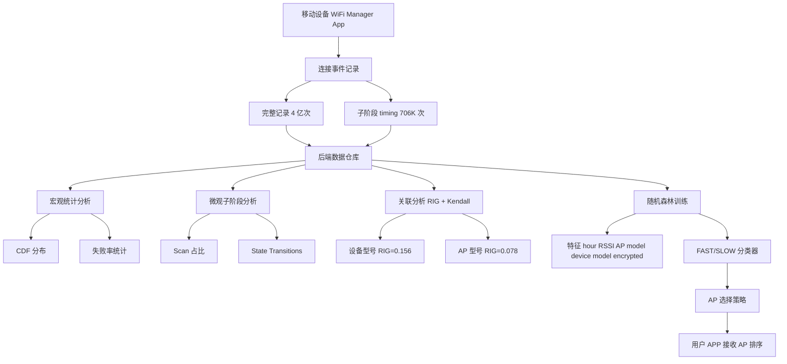

# Why It Takes So Long to Connect to a WiFi Access Point（INFOCOM 2017）

> 作者：Changhua Pei, Zhi Wang, Youjian Zhao, Zihan Wang, Yuan Meng, Dan Pei, Yuanquan Peng, Wenliang Tang, Xiaodong Qu  
> 机构：清华大学；清华大学深圳研究生院；腾讯；TNList  
> 发表年份：2017  
> 会议/期刊：INFOCOM 2017（IEEE International Conference on Computer Communications）  
> 关联 PDF：同目录下 `pch-infocom2017.pdf`

## 一、文档信息速览

| 字段 | 值 |
|---|---|
| 标题 | Why It Takes So Long to Connect to a WiFi Access Point |
| 作者 | Changhua Pei, Zhi Wang, Youjian Zhao, Zihan Wang, Yuan Meng, Dan Pei, Yuanquan Peng, Wenliang Tang, Xiaodong Qu |
| 机构 | 清华大学；清华大学深圳研究生院；腾讯；TNList |
| 发表年份 | 2017 |
| 会议/期刊 | INFOCOM 2017 |
| 分类 | WiFi 接入 / 测量研究 / 移动网络 |
| 核心问题 | WiFi 连接建立时间过长和失败率高，用户体验差；缺乏大规模真实测量数据 |
| 主要贡献 | (1) 500 万用户 / 700 万 AP / 4 亿次连接的大规模测量；(2) 把连接过程拆为 Scan / Association / Authentication / DHCP 四阶段，发现 Scan 是慢连接主因；(3) 基于随机森林的 AP 选择策略，把连接失败率从 33% 降至 3.6%，80% 分位时间降低 10 倍 |

## 二、背景（Background）

随着智能设备爆发，无线数据流量快速增长。WiFi 已成为承载大部分无线流量的核心网络，过去十年累计部署超 10 亿 AP。WiFi 性能与质量仍然不佳：吞吐、延迟之外，"是否能成功连上"和"连接建立耗时"是影响用户体验最关键的两个指标。

论文在 4 个代表性城市的 500 万移动用户 / 700 万 AP / 4 亿次 WiFi 连接会话上做大规模测量。这是已知首次大规模系统研究：(1) 连接建立耗时有多大；(2) 哪些因素影响连接；(3) 如何降低连接耗时。

研究发现：

1. **连接失败与慢连接普遍**：高达 45% 的用户连接失败；15%（5%）成功连接耗时超过 5 秒（10 秒）。
2. **与既有研究相反，Scan 是主因**：连接耗时 >15 秒时，47% 时间花在 Scan 阶段（既有研究认为 DHCP 是主因 [2]）。
3. **设备型号和 AP 型号信息价值高**：用 Relative Information Gain 衡量，移动设备型号 RIG=0.156，AP 型号 RIG=0.078，远高于 RSSI（0.020）。

论文基于这些观察，设计基于机器学习（随机森林）的 AP 选择策略，目标是连接发生前预测耗时并规避"问题 AP"。

## 三、目的（Problems Solved）

- **连接失败率高**：从单纯按信号强度选 AP 改为综合机器学习预测。
- **连接耗时难以优化**：识别慢连接的真正瓶颈（Scan 阶段）。
- **缺乏大规模真实数据**：贡献 4 亿次连接会话、706K 含子阶段明细的连接尝试的开放数据集。
- **AP 选择缺乏信息**：挖掘 AP 型号、移动设备型号等"隐藏信息"。
- **漫游场景差异**：验证家庭网络与 enterprise 网络漫游耗时几乎相同。

## 四、核心原理（Principles）

**系统总览**：基于腾讯 Android / iOS "WiFi Manager" App 收集日志。在后台持续上报每次连接尝试的成功 / 失败与耗时，在部分用户（12,472）上开启 sub-phase timing 探针。论文的核心分为三部分：

1. **连接过程四阶段分解**（Scan / Association / Authentication / DHCP）。
2. **关联分析**：用 RIG 和 Kendall 系数对特征排序。
3. **机器学习 + AP 选择**：用随机森林预测连接是 FAST（≤15s）还是 SLOW（>15s），在 candidate list 中剔除 SLOW。

**关键概念**：

- **WiFi Connection Set-up Time Cost**：用户点 SSID 到设备获取 IP 的时间。
- **Scan / Association / Authentication / DHCP**：连接四阶段。
- **CDF**：累积分布函数，用于分析耗时分布。
- **RIG (Relative Information Gain)**：相对信息增益，衡量特征与目标变量的相关性。
- **Kendall Coefficient**：Kendall 秩相关系数。
- **Active Scan / Passive Scan**：主动 / 被动扫描。
- **Beacon / Probe Request / Probe Response**：802.11 扫描相关帧。
- **AP Model / Mobile Device Model**：AP 与移动设备型号（取 BSSID / IMEI 前 8 字符）。
- **Public AP vs Private AP**：公共 / 私有 AP。
- **RSSI (Received Signal Strength Indicator)**：接收信号强度指示。
- **WPA2 / WEP / 802.11**：WiFi 安全与协议标准。
- **State Transitions**：连接状态机迁移（Scanning / Associating / Connected / Disconnected / Completed）。

**数学原理**：

- **CDF**：连接耗时 ≤ t 的概率 F(t) = P(X ≤ t)。

- **Relative Information Gain**：

$$
RIG(F) = \frac{H(C) - H(C \mid F)}{H(C)}
$$

H(C) 是类别熵，H(C|F) 是条件熵。论文 Table II 列出各特征的 RIG。

- **Kendall 秩相关系数**：

$$
\tau = \frac{(\text{concordant}) - (\text{discordant})}{\binom{n}{2}}
$$

- **随机森林**：多棵决策树的集成，每棵树在 bootstrap 样本 + 随机子特征上训练，输出投票。

- **几何平均**：论文中通过少数 AP 验证，论文衡量 AP 之间的"重合度"。

**与现有技术的差异**：与 Seneviratne et al.（[2]，13 台设备的小规模研究）相比，论文规模大 6 个数量级，并修正了"DHCP 是慢连接主因"的结论，揭示 Scan 才是主因。

## 五、算法详解（Algorithm）

1. **输入 / 输出**：
   - 输入：移动设备的 candidate AP list（含 AP BSSID、RSSI、加密方式、小时数等）。
   - 输出：从 candidate 中选一个 AP 给设备尝试连接；尽量选 FAST（耗时 ≤15s）。

2. **核心模块**：
   - **Sub-phase Timing**：在 12,472 用户上启用，记录每个阶段的耗时。
   - **State Transition Tracking**：记录每次连接过程中的状态机迁移，发现 Disconnected 是关键瓶颈。
   - **Feature Extraction**：从 IMEI / BSSID 前 8 字符提取设备 / AP 型号。
   - **Random Forest Training**：训练二分类 FAST/SLOW 模型。
   - **AP Selection Algorithm**：用训练好的模型过滤 candidate list → 选信号最强的 FAST AP。

3. **伪代码**：

```python
def record_connection_set_up(app, ssid):
    t_scan_start = now()
    # ... 状态机迁移 ...
    # Scanning -> Associating -> Authenticating -> DHCP -> Completed
    return {
        "scan_ms": t_assoc_start - t_scan_start,
        "assoc_ms": t_auth_start - t_assoc_start,
        "auth_ms":  t_dhcp_start  - t_auth_start,
        "dhcp_ms":  t_completed   - t_dhcp_start,
        "result":   "Success" | "DHCP Failure" | "Timeout" | ...
    }

def train_random_forest(logs):
    feats = ["hour", "RSSI", "AP_model", "device_model", "encrypted"]
    X = encode(feats, logs)
    y = (logs.time_cost > 15).astype(int)  # 1 = SLOW
    return RandomForestClassifier(n_estimators=100, max_depth=90).fit(X, y)

def select_AP(model, candidate_list):
    X = encode_features(candidate_list)
    probs = model.predict_proba(X)[:, 1]  # P(SLOW)
    fast_set = [ap for ap, p in zip(candidate_list, probs) if p < threshold]
    if not fast_set:
        return None
    return max(fast_set, key=lambda ap: ap.RSSI)
```

4. **关键数学**：见 §四。

5. **复杂度分析**：
   - 每条连接事件记录开销：毫秒级；
   - 随机森林推理：O(n_trees × log n_features)，毫秒级；
   - 4 亿次连接 + 706K 含 sub-phase 的连接 → 单机可处理。

6. **训练与推理**：
   - 训练：Random Forest，100 棵树，深度 90，weight=0.3，阈值 15 秒；
   - 推理：每用户 APP 在每次连接前请求服务端的 AP 排序。

7. **示例**：用户在咖啡厅看到 5 个 AP，按信号强度排序选 #1，连接耗时 25s；改用论文方法，模型预测 #1 是 SLOW，跳过 #1，连接到 #2，耗时 1.2s。

## 六、系统架构图（Architecture）



## 七、流程图（Process Flow）

```mermaid
flowchart TD
    S1[用户点击 SSID] --> S2[APP 收集 candidate AP 信息]
    S2 --> S3[服务端特征编码]
    S3 --> S4[随机森林推理]
    S4 --> S5{P(SLOW) > threshold?}
    S5 -- 是 --> S6[加入 SLOW 集]
    S5 -- 否 --> S7[加入 FAST 集]
    S6 --> S8[遍历下一个 AP]
    S8 --> S4
    S7 --> S9[FAST 集中选最强信号]
    S9 --> S10[返回给用户]
    S10 --> S11[用户连接]
    S11 --> S12[记录实际耗时 作为下次训练数据]
```

## 八、关键创新点（Key Innovations）

- **+ 大规模测量**：4 亿次连接 + 706K sub-phase 探针，是当时最大规模的 WiFi 连接耗时研究。
- **+ 修正既有结论**：揭示 Scan（47%）才是慢连接主因，而非 DHCP（既有研究认为）。
- **+ 状态机分析**：发现 Disconnected 状态重连是慢连接的根因之一。
- **+ AP / 设备型号作为强特征**：RIG 0.156 / 0.078，远高于 RSSI（0.020）。
- **+ 机器学习 AP 选择**：连接失败率 33% → 3.6%；80% 分位耗时降低 10×。

## 九、实验与结果（Experiments）

- **数据集**：4 个城市，500 万用户，700 万 AP，4 亿次连接；2016 年 5 月 3-9 日一周；子阶段数据从 12,472 设备采集 706K 次（论文 §III）。
- **Baseline**：Strongest Signal Strength（按信号强度选 AP）。
- **指标**：Precision(SLOW)、Recall(SLOW)、PoA (Proportion of Available APs)、CDF of connection time。
- **关键数字**（论文 Table IV + Table V）：
  - FAST Precision=0.91，Recall=0.49；
  - SLOW Precision=0.48，Recall=0.90（论文 Table IV）；
  - Baseline 连接失败率 33%，论文方法 3.6%；
  - 80% 分位耗时：Baseline >30 秒，论文方法 3 秒（降低 10×，论文 Figure 10）；
  - 不同 Recall 阈值下的 PoA：Recall(SLOW)=0.9 时 PoA=0.33（论文 Table V）。
- **关联分析**：Table II 给出各特征 RIG——device model 0.156、AP model 0.078、RSSI 0.020、关联设备数 0.006、hour 0.005。
- **状态机分析**：Figure 6 给出耗时 >15s 的连接状态转移分布，Scanning → Disconnected 重连次数最多。
- **可视化**：Figure 8 给出 MEIZU M1 Note vs M2 Note 的连接耗时 CDF 差异；Figure 9 给出 Public vs Private AP 在一天内的耗时对比。
- **数据增强**：通过加密 / 公开性 / RSSI / hour 等构造额外训练样本。

## 十、应用场景（Use Cases）

- **WiFi Manager 类 App**：在用户连接前预筛 AP。
- **公共 WiFi 选路**：商场、机场的快速连接推荐。
- **企业 WiFi 漫游**：评估 CAPWAP / HOKEY 的 EAP 开销（论文发现企业漫游与家庭网络耗时几乎相同）。
- **运营商 WiFi 优化**：根据设备型号 / AP 型号定制策略。
- **车载 / IoT WiFi**：弱信号场景下的连接稳定性提升。

## 十一、相关论文（Related Papers in this set）

- `pch-infocom2017`（本文）
- `purba17-zhou`、`wpa16-zhou`（Zhou 等：清华校园 WLAN + 移动数据测量）
- `issre-stepwise`、`liuping-camera-ready`、`wch_ISSRE-1`（同作者团队 ISSRE 系列根因定位）

## 十二、术语表（Glossary）

- **WiFi Connection Set-up Time Cost**：用户点 SSID 到设备获取 IP 的时间。
- **Scan / Association / Authentication / DHCP**：连接四阶段。
- **Active Scan / Passive Scan**：主动 / 被动扫描。
- **Beacon / Probe Request / Probe Response**：802.11 扫描相关帧。
- **RSSI**：接收信号强度指示。
- **AP Model / Mobile Device Model**：AP 与移动设备型号。
- **Public AP / Private AP**：公共 / 私有 AP。
- **RIG (Relative Information Gain)**：相对信息增益。
- **Kendall Coefficient**：Kendall 秩相关系数。
- **WPA2 / WEP**：WiFi 安全协议。
- **CAPWAP / HOKEY**：企业 WiFi 漫游协议。
- **PoA (Proportion of Available APs)**：候选 AP 中可用比例。
- **State Transitions (Scanning / Associating / Connected / Disconnected / Completed)**：连接状态机。

## 十三、参考与延伸阅读

- Paper: Seneviratne et al. (WiNTECH 2013)——首篇研究 WiFi 连接耗时的论文（13 台设备）。
- Paper: Cisco VNI Report 2016——全球 IP 流量预测。
- Paper: 802.11 标准。
- Paper: Handoffs 系列研究（Velayos, Mishra 等）。
- 工具：WiFi Manager App（腾讯）、WiFi Analyzer、Android WiFiManager API。
- 相关论文：`purba17-zhou`、`wpa16-zhou`、`issre-stepwise`、`liuping-camera-ready`、`wch_ISSRE-1`。