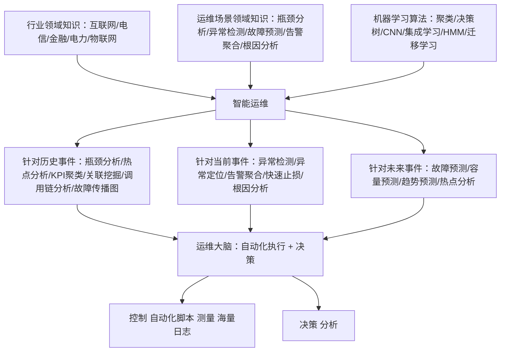
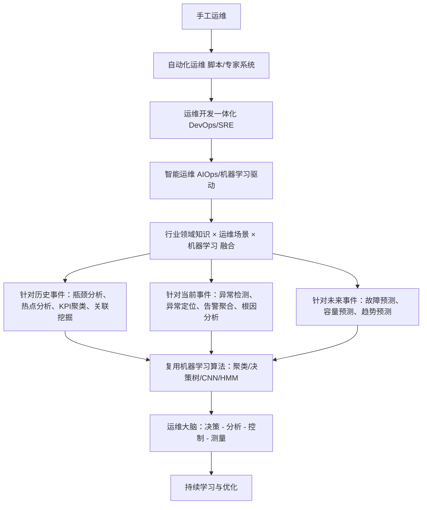

# 基于机器学习的智能运维（专栏文章，2017）

> 作者：裴丹、张圣林、裴昶华
> 机构：清华大学、南开大学、阿里巴巴公司
> 发表年份：2017
> 发表期刊：第 13 卷 第 12 期（2017 年 12 月）
> 主题：机器学习 × 智能运维（AIOps）综述与展望
> 关联 PDF：同目录下 `peidan.pdf`

## 一、文档信息速览

| 字段 | 值 |
|---|---|
| 标题 | 基于机器学习的智能运维 |
| 作者 | 裴丹（清华大学）、张圣林（南开大学）、裴昶华（阿里巴巴） |
| 机构 | 清华大学计算机系；南开大学软件学院；阿里巴巴公司猜你喜欢部门 |
| 发表年份 | 2017 |
| 期刊 | 第 13 卷 第 12 期，2017 年 12 月 |
| 主题分类 | 智能运维（AIOps）综述 / 机器学习在运维中的应用 |
| 核心问题 | 海量复杂系统产生的运维数据已无法用"基于人为制定规则"的专家系统应对；需要把机器学习、行业领域知识、运维场景领域知识三者结合 |
| 关键术语 | AIOps、DevOps、KPI、瓶颈分析、热点分析、KPI 异常检测、故障预测、告警聚类、关联关系挖掘、自动化运维 |
| 关键场景 | 互联网、电信、金融、电力网络、物联网、医疗网络、航空航天、军用设备及网络 |
| 关键人物 | 裴丹：CCF 专业会员，清华大学计算机系长聘副教授，特别研究员，青年千人 |

## 二、背景（Background）

当代社会生产生活的许多方面都依赖于大型复杂的软硬件系统，包括互联网、高性能计算、电信、金融、电力网络、物联网、医疗网络和设备、航空航天、军用设备及网络。这些系统的用户都期待有好的体验。这些复杂系统的部署、运行和维护都需要专业的运维人员，以应对各种突发事件，确保系统安全、可靠地运行。由于各类突发事件会产生海量数据，因此智能运维从本质上可以认为是一个大数据分析的具体场景。

智能运维涉及的范围由"行业领域知识 × 运维场景领域知识 × 机器学习"三部分交叉融合而成（论文图 1）。智能运维、人工智能、行业领域知识三者相结合，是其本质特征。

运维历史通常划分为四个阶段：

1. **手工运维（Manual Ops）**：早期的运维工作大部分由运维人员（系统管理员 / 网管）手工完成，工作包括监控产品运行状态和性能指标、产品上线、变更服务等。单个人员的工作量与人员数量随产品规模呈线性增长，且大部分工作是低效的重复；
2. **自动化运维（Automated Ops）**：通过自动化脚本来监控分布式系统、产生大量日志，并在人工监督下自动处理。基于行业领域知识和运维场景领域知识的"专家系统"；
3. **运维开发一体化（DevOps）**：DevOps 是 Development 和 Operations 的组合，用于促进开发、技术运营和 QA 部门之间的沟通、协调与整合。SRE（Site Reliability Engineering）即一种 DevOps 的特例；
4. **智能运维（AIOps, Artificial Intelligence for IT Operations）**：与自动化运维依赖人工生成规则不同，智能运维强调由机器学习算法自动地从海量运维数据中不断地学习、提炼并总结规则。Gartner Report 预测 AIOps 的全球部署率将从 2017 年的 10% 增加到 2020 年的 50%。

## 三、目的（Problems Solved）

论文把智能运维面临的瓶颈与机遇总结为：

- **基于人为指定规则的专家系统逐渐力不从心**：自动化运维的瓶颈在于人脑；必须由长期在某个行业从事运维的专家手动地总结重复出现的、有迹可循的现象形成规则，简单的人为规则方法不能解决大规模运维问题。
- **运维和开发目标冲突**：运维人员希望尽量少地产生异常和故障，产品开发人员要尽快上线新功能；大部分异常或故障都是由于配置变更或软件升级导致的，需要 DevOps 来融合二者目标。
- **KPI 数据规模大、属性多**：当某个关键指标有十几个属性、每个属性有几百亿条数据时，人工方式总结规律不可行，必须借助于机器学习算法。
- **故障 / 异常的预测、检测、定位与恢复需要自动化**：故障预测是主动异常管理的关键技术；预测未来某一时间区间的故障可以为运维人员预留应对时间。
- **跨行业复用关键技术**：不同行业的运维需求各有侧重，智能运维工程师可跨行业复用关键技术。

## 四、核心原理（Principles）

**系统范围（图 1）**：智能运维涉及"行业领域知识 + 运维场景领域知识 + 机器学习算法"三个维度的交叉：

- **行业领域知识**：互联网、电信、金融、电力网络等；
- **运维场景领域知识**：瓶颈分析、异常检测、故障预测等；
- **机器学习算法**：聚类、决策树、卷积神经网络等。

**关键场景与技术（论文图 3）**：

| 类别 | 关键技术 |
|---|---|
| 针对历史事件 | 瓶颈分析、热点分析、KPI 聚类、KPI 关联挖掘、KPI 异常事件关联关系挖掘、全链路模块调用链分析、故障传播关系图构建 |
| 针对当前事件 | 异常检测、异常定位、异常报警聚合、快速止损、故障根因分析 |
| 针对未来事件 | 故障预测、容量预测、趋势预测、热点分析 |

**关键概念**：

- **KPI（Key Performance Indicator）**：关键性能指标，论文图 4 列举的属性包括首屏事件、闪退率、销售额、利润、订单数、PV、转化率、用户数等。
- **手工运维 → 自动化运维 → DevOps → AIOps**：四阶段演进模型。
- **基于人为指定规则的专家系统**：早期自动化运维的形态。
- **基于机器学习的智能运维大脑**：智能运维与自动化运维的最大区别。

**FOCUS [1] 框架**：将 KPI 分为"达标"和"不达标"两类，从而把 KPI 瓶颈分析问题转化为在多维属性空间中的有监督二分类问题；该方法采用结果解释性较好的决策树算法。

**KPI 异常检测算法分类**（论文 §关键技术示例）：

- 基于窗口的异常检测算法（例如奇异谱变换 SST）
- 基于近似性的异常检测算法
- 基于预测的异常检测算法（Holt-Winters、时序分解、线性回归、支持向量回归）
- 基于隐式马尔科夫模型的异常检测算法
- 基于分段的异常检测算法
- 基于机器学习（集成学习）的异常检测算法 [2]

**故障预测方法**：

- **故障踪迹**：从以往故障的发生特征上推断即将发生的故障（频率或类型）；
- **征兆监测**：通过故障的"副作用"（异常内存利用率、CPU 使用率、磁盘 I/O 等）捕获；
- **错误记录**：错误事件日志（离散的分类数据）。

**SIGCOMM 视频流媒体系列案例**（论文列举的代表性工作）：

- **SIGCOMM'11 [3]**：利用不同数据分析及统计分析方法，灵活使用可视化、相关分析、信息熵增益等工具，将杂乱无章的数据转化为直观清晰的信息。
- **SIGCOMM'12 [4]**：为视频传输设计一个"大脑"，根据视频客户和网络状况的全局信息动态地优化视频传输。
- **SIGCOMM'13 [5]**：通过决策树模型建立视频流媒体用户参与度的预测模型，指导关键性能指标的优化策略。
- **NSDI'17 [6]**：将视频质量的实时优化问题转化为实时多臂老虎机问题（基础强化学习方法），并使用上限置信区间算法。

## 五、算法详解（Algorithm）

**故障预测定义（论文图 6）**：在当前时刻，根据一段时间内的测量数据，预测未来某一时间区间是否会发生故障。之所以预测未来某一时间区间的故障，是因为运维人员需要一段时间来应对即将发生的故障（例如切换流量、替换设备等）。

**智能运维所用到的机器学习算法**：

- 逻辑回归、关联关系挖掘
- 聚类、决策树、随机森林
- 支持向量机（SVM）
- 蒙特卡洛树搜索
- 隐式马尔科夫模型
- 多示例学习、迁移学习
- 卷积神经网络（CNN）

在处理运维工单和人机界面时，自然语言处理（NLP）和对话机器人也被广泛应用。

**运维工程师的角色转型**：

- 在基于机器学习的智能运维框架下，机器将成为运维人员的高效可靠的助手；
- 运维工程师逐渐转型为大数据工程师，负责搭建大数据基础架构，开发和集成数据采集程序和自动化执行脚本，并实现高效的机器学习算法；
- 智能运维工程师可在整个智能运维框架下跨行业地寻找关键技术，从而更好地满足本行业的智能运维需求。

**伪代码（基于 KPI 异常检测的流程化）**：

```python
# 智能运维 KPI 异常检测的统一抽象流程
def kpi_anomaly_detection(kpi_series, method="SST"):
    """
    kpi_series: 关键性能指标时间序列
    method: 异常检测算法，可选 SST / Holt-Winters / 集成学习 等
    """
    if method == "SST":
        # 奇异谱变换
        hankel = build_hankel_matrix(kpi_series, window=L)
        U, S, V = svd(hankel)
        return detect_change_point(U, S, V, kpi_series)
    elif method == "HoltWinters":
        level, trend, season = triple_exponential_smoothing(kpi_series)
        return detect_residual_anomaly(kpi_series, level, trend, season)
    elif method == "Ensemble":
        detectors = [sst_detector, holt_winters_detector, hmm_detector]
        scores = [d(kpi_series) for d in detectors]
        return ensemble_vote(scores)
    else:
        raise NotImplementedError(method)


def root_cause_analysis(kpi_graph, alert_events, incident_ticket):
    """
    故障根因分析：基于故障传播图 + 告警事件 + 故障工单
    """
    candidates = []
    for node in kpi_graph.nodes:
        score = random_walk_score(kpi_graph, alert_events, node)
        candidates.append((node, score))
    return sorted(candidates, key=lambda x: -x[1])[:5]
```

## 六、系统架构图（Architecture）



## 七、流程图（Process Flow）



## 八、关键创新点（Key Innovations）

- **+ 智能运维四阶段演进模型**：手工运维 → 自动化运维 → DevOps → AIOps，清晰刻画运维领域自动化与智能化的历史路径；
- **+ "行业领域 × 运维场景 × 机器学习"三维度交叉**：明确指出智能运维必须三方紧密合作，不能单靠算法；
- **+ 全栈关键技术分类**：把针对历史事件、当前事件、未来事件的关键技术系统化为 KPI 瓶颈分析、KPI 异常检测、故障预测、异常报警聚合、故障根因分析等；
- **+ 工业界与学术界合作的代表案例**：SIGCOMM 系列视频流媒体论文（SIGCOMM'11/'12/'13、NSDI'17）展示智能运维的演进之路；
- **+ Gartner 预测 2017→2020 AIOps 全球部署率从 10% 增长到 50%**：凸显产业方向；
- **+ 工程师角色重塑**：智能运维框架下，运维工程师转型为大数据工程师，强调跨行业复用关键技术。

## 九、实验与结果（Experiments）

该文是一篇综述/专栏文章，不包含具体数据集上的实验。但论文中给出了工业部署与典型案例的关键数字：

- **Gartner Report 预测 AIOps 全球部署率将从 2017 年的 10% 增加到 2020 年的 50%**；
- **故障案例**：基于卡内基梅隆大学 SIGCOMM'11 [3] 的视频质量对用户参与度的影响分析；
- **优化案例**：SIGCOMM'13 [5] 通过决策树模型改善视频流媒体用户体验质量；
- **实时调度案例**：NSDI'17 [6] 用 Pytheas 通过基于组的探索-利用实时多臂老虎机算法优化 QoE；
- **代表性工具/算法**：FOCUS（INFOCOM 2016 [1]）、Opprentice（IMC 2015 [2]）；
- **应用领域**：基于互联网的视频流媒体（QQ 视频、优酷、爱奇艺、Netflix 等）；
- **作者产出现状**：裴丹在智能运维领域发表了 90 余篇学术论文，20 多项美国专利授权。

## 十、应用场景（Use Cases）

- **互联网服务 KPI 瓶颈分析**：FOCUS 决策树定位高搜索响应时间瓶颈；
- **互联网服务 KPI 异常检测**：Opprentice 集成学习检测 KPI 异常；
- **故障预测**：从历史数据中预测未来某段时间是否会发生故障；
- **告警聚合 / 根因分析**：在大型分布式系统中聚类告警、定位根因；
- **互联网视频流媒体 QoE 优化**：CMU SIGCOMM'11-'13 系列工作；
- **跨行业 AIOps**：互联网、电信、金融、电力网络、物联网、医疗网络和设备、航空航天、军用设备及网络。

## 十一、相关论文（Related Papers in this set）

- `TraceSieve_ISSRE23`（追踪异常检测）
- `TraceAnomaly`/`刘平issre`（微服务追踪异常检测）
- `Chain-of-Event_Interpretable-Root-Cause-Analysis-for-MicroservicesFSE24-Camera-Ready`
- `AlertRCA_CCGRID2024_CameraReady`
- `TCS23-DiagFusion`
- `CMDiagnostor`（调用指标根因）
- `Opprentice`（机器学习驱动的异常检测 IMC 2015）
- `FOCUS`（KPI 瓶颈分析 INFOCOM 2016）

## 十二、术语表（Glossary）

- **运维（Operations）**：系统的部署、运行和维护；
- **AIOps（Artificial Intelligence for IT Operations）**：基于人工智能/机器学习的 IT 运维；
- **DevOps**：开发与运维一体化（Development + Operations）；
- **SRE（Site Reliability Engineering）**：站点可靠性工程，DevOps 的一种特例；
- **KPI（Key Performance Indicator）**：关键性能指标；
- **PV**：Page Views，页面访问量；
- **瓶颈分析（Bottleneck Analysis）**：发现制约服务性能的硬件或软件瓶颈；
- **热点分析（Hotspot Analysis）**：找到对某项指标显著大于类似属性空间内其他设施的集群、网络设备、服务器等；
- **KPI 聚类（KPI Clustering）**：对形状类似的曲线进行聚类；
- **KPI 异常检测（KPI Anomaly Detection）**：发现 KPI 异常（突增、突降、抖动）；
- **异常定位（Anomaly Localization）**：在多维属性空间中快速定位导致异常的属性组合；
- **故障预测（Failure Prediction）**：根据历史经验判断近期是否会发生故障；
- **故障根因分析（Root Cause Analysis）**：根据故障传播图快速找到 KPI 异常的根本触发原因；
- **告警聚合（Alert Aggregation）**：根据异常报警的空间和时间特征对其进行聚类；
- **FOCUS**：基于决策树的多维属性空间 KPI 瓶颈分析方法（INFOCOM 2016）；
- **Opprentice**：基于机器学习集成学习的 KPI 异常检测方法（IMC 2015）；
- **SST（Singular Spectrum Transform）**：奇异谱变换，常用于 KPI 异常检测；
- **Holt-Winters**：三参数指数平滑方法；
- **HMM（Hidden Markov Model）**：隐式马尔科夫模型。

## 十三、参考与延伸阅读

- Paper: FOCUS [1]——基于决策树的 KPI 瓶颈分析（INFOCOM 2016）。
- Paper: Opprentice [2]——基于机器学习的异常检测（IMC 2015）。
- Paper: CMU SIGCOMM'11 [3]——视频质量对用户参与度的影响分析。
- Paper: CMU SIGCOMM'12 [4]——视频传输控制大脑。
- Paper: CMU SIGCOMM'13 [5]——视频流媒体参与度预测模型。
- Paper: Pytheas（NSDI'17 [6]）——基于组的多臂老虎机 QoE 优化。
- Book / Reference: AIOps 行业报告（Gartner 2017）；
- 工具/平台：Jaeger、Zipkin、SkyWalking、OpenTracing、ES-APM。
- 相关论文：TraceSieve、TraceVAE、GTrace、Chain-of-Event、AlertRCA、CMDiagnostor。
