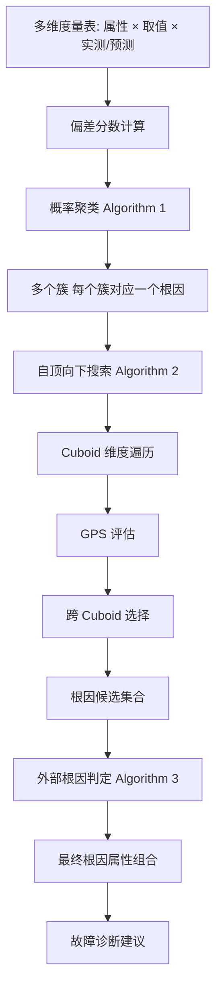
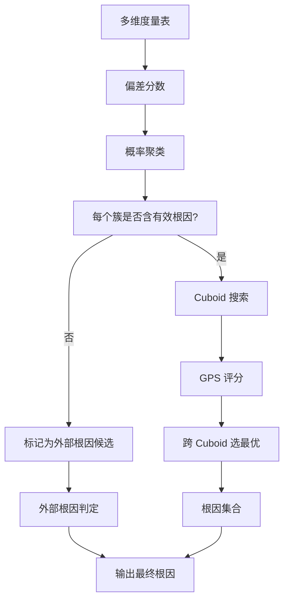

# PSqueeze: Generic and Robust Root Cause Localization for Multi-Dimensional Data in Online Service Systems（Journal of Systems & Software 2023）

> 作者：Zeyan Li、Junjie Chen、Yihao Chen、Chengyang Luo、Yiwei Zhao、Yongqian Sun、Kaixin Sui、Xiping Wang、Dapeng Liu、Xing Jin、Qi Wang、Dan Pei  
> 机构：清华大学；天津大学；南开大学；Bizseer；中国建设银行；BNRist  
> 发表年份：2023  
> 会议/期刊：The Journal of Systems & Software (Elsevier)  
> 关联 PDF：同目录下 `psqueeze-jss.pdf`

## 一、文档信息速览

| 字段 | 值 |
|---|---|
| 标题 | PSqueeze: Generic and robust root cause localization for multi-dimensional data in online service systems |
| 作者 | Zeyan Li、Junjie Chen、Yihao Chen、Chengyang Luo、Yiwei Zhao、Yongqian Sun、Kaixin Sui、Xiping Wang、Dapeng Liu、Xing Jin、Qi Wang、Dan Pei |
| 机构 | 清华大学；天津大学；南开大学；Bizseer；中国建设银行；BNRist |
| 发表年份 | 2023 |
| 会议/期刊 | The Journal of Systems & Software |
| 分类 | 多维数据根因定位 / 度量监控 |
| 核心问题 | 在线服务系统监控多维数据（多属性多取值的度量），故障时仅特定属性组合异常；如何快速定位"哪些属性组合是根因" |
| 主要贡献 | (1) 提出广义涟漪效应 GRE 作为多维数据根因的通用性质；(2) "自底向上概率聚类 + 自顶向下启发式搜索"框架 PSqueeze；(3) 首次提出"外部根因"判定方法；(4) 在 5400 个模拟故障 + 73 个真实注入故障上 F1 优于 SOTA 32.89%，定位时间约 10s |

## 二、背景（Background）

在线服务系统（如电商、网约车、IM）每天产生大量结构化日志（订单 ID、时间戳、金额、省份、ISP 等），监控平台通过"按属性分组 + 聚合度量"把日志转成多维度量表，例如把订单按"省份 × ISP"分组并求和得到总金额。当故障发生时，通常只有部分属性组合的度量值异常（如"北京 + 中国移动"组合的支付成功率下降），这些异常的属性组合是定位根因的关键线索，论文称之为"根因属性组合"（root-cause attribute combinations），把它们的集合称为"多维数据的根因"。

多维数据根因定位的核心挑战：
- **搜索空间爆炸**：属性数（几十）×属性取值数（数千）的笛卡尔积导致候选数达 $10^6$ 以上。
- **快速定位需求**：故障必须快速缓解以减少用户影响。
- **现有方法局限性**：MID、iDice、ImpAPTr 仅适用特定类型度量；Apriori、R-Adtributor 严重依赖参数调优；所有方法都没考虑"外部根因"（含未记录属性的根因）。
- **多维数据根因的通用性质缺失**：缺乏对不同度量类型、不同业务场景都成立的根因性质。

论文提出 PSqueeze（Probabilistic Squeeze）：基于"广义涟漪效应（GRE）"这一通用性质，把搜索空间"自底向上聚类 + 自顶向下搜索"两步走；首次实现"外部根因"判定；在 5400 模拟故障上 F1 提升 32.89%，定位时间约 10s/故障。

## 三、目的（Problems Solved）

- **多维数据根因定位搜索空间大**：基于 GRE 把候选根因按"是否同源"分簇，降低单簇搜索空间。
- **根因性质缺乏通用性**：提出 GRE，并证明它在不同度量类型（求和、计数、平均、比例等）和真实故障中均成立。
- **"自底向上"概率聚类**：基于偏差分数的聚类把属性组合分组到不同根因，容忍噪声。
- **"自顶向下"启发式搜索**：在每个簇内用 GPS（Generalized Potential Score）评估 + Cuboid 启发式搜索 + 跨 Cuboid 选择，挑出最优根因。
- **外部根因判定**：当根因含未记录属性时，传统方法失效；PSqueeze 首次提供判定方法。
- **效率**：10s 内完成一次故障根因定位。

## 四、核心原理（Principles）

**系统总览**：PSqueeze 输入是多维度量表（属性 × 取值 × 实测/预测值），输出是根因属性组合集合。流程：
1. 计算每个属性组合的"偏差分数（Deviation Score）"；
2. 基于偏差分数做概率聚类（Algorithm 1）把候选按根因分簇；
3. 在每个簇内做自顶向下启发式搜索（Algorithm 2）——Cuboid 搜索 + GPS 评分 + 跨 Cuboid 选择；
4. 用 GPS 判定外部根因（Algorithm 3）。

**关键概念**：

- **多维数据（Multi-dimensional Data）**：属性 × 取值 × 度量值。
- **属性组合（Attribute Combination）**：元组集合，每属性最多一个取值。
- **叶子属性组合（Leaf Attribute Combination）**：包含每个属性的取值。
- **Cuboid**：包含部分属性所有取值的属性组合集合。
- **广义涟漪效应（Generalized Ripple Effect, GRE）**：根因的偏差会在其所有后代属性组合上传播。
- **偏差分数（Deviation Score）**：实际值与预测值之间的归一化偏离。
- **GPS（Generalized Potential Score）**：候选根因的综合得分。
- **外部根因（External Root Cause）**：包含未记录属性的根因。
- **求和 / 计数 / 平均 / 比例度量**：不同度量类型。

**数学原理**：

- **偏差分数**：

$$
\text{score}(e) = \frac{v(e) - \hat{v}(e)}{\sigma(e)}
$$

其中 $v(e)$ 是实际值，$\hat{v}(e)$ 是预测值，$\sigma(e)$ 是预测误差的标准差。

- **广义涟漪效应（GRE）**：如果 $e$ 是根因属性组合，那么对任意 $e' \in LE(e)$，$e'$ 的偏差分数应显著大于 0。论文证明对求和、计数、线性组合等多种度量成立。

- **概率聚类**：用 EM 风格迭代

$$
\gamma_{k}^{(t)}(e) = \frac{\pi_k \mathcal{N}(\text{score}(e); \mu_k, \sigma_k^2)}{\sum_{k'} \pi_{k'} \mathcal{N}(\text{score}(e); \mu_{k'}, \sigma_{k'}^2)}
$$

更新参数 $\mu_k, \sigma_k, \pi_k$。

- **GPS（广义潜力得分）**：

$$
\text{GPS}(S) = \sum_{e \in LE(S)} (v(e) - \hat{v}(e)) \cdot \text{score}(e) - C \cdot |S \cap E_{\text{abnormal}}^c|
$$

惩罚包含"非异常叶子"的候选。

- **外部根因判定**：当所有已知根因 GPS 都很小但故障严重时，认为存在外部根因；用历史故障的 GPS 下界作为判定阈值。

**与现有技术的差异**：与 Apriori / R-Adtributor（基于规则/统计）相比，PSqueeze 用 GRE + 概率聚类更鲁棒；与 MID / iDice / ImpAPTr（特定度量类型）相比，PSqueeze 通用性更强；与 Squeeze（前作）相比，新增概率聚类 + 外部根因判定。

## 五、算法详解（Algorithm）

1. **输入 / 输出**：
   - 输入：多维度量表（属性 × 取值 × 实测/预测值 + 预测误差）。
   - 输出：根因属性组合集合（含外部根因标记）。

2. **核心模块**：
   - **偏差分数计算**：标准化。
   - **概率聚类**：EM 风格分簇。
   - **Cuboid 搜索**：从低维 Cuboid 到高维 Cuboid 逐层搜索。
   - **GPS 评分**：综合表达力 + 紧凑性。
   - **跨 Cuboid 选择**：在多个候选中按 GPS 排序。
   - **外部根因判定**：阈值比较。

3. **伪代码**（整合自 Algorithm 1-3）：

```python
def probabilistic_cluster(scores, K):
    # EM-like clustering
    pis = init_pis(K)
    mus = init_mus(K)
    sigmas = init_sigmas(K)
    for it in range(max_iter):
        # E-step
        gammas = e_step(scores, pis, mus, sigmas)
        # M-step
        pis, mus, sigmas = m_step(scores, gammas)
    return gammas  # cluster assignments

def top_down_search(cluster, attribute_values):
    # Algorithm 2: top-down localization in each cluster
    best = None
    for cuboid in cuboids_of_all_dims(attribute_values):
        for candidate in candidates_in_cuboid(cuboid, cluster):
            gps = generalized_potential_score(candidate)
            if best is None or gps > best.gps:
                best = (candidate, gps)
    return best

def gps(candidate, leaves):
    expr = sum((v_real(e) - v_pred(e)) * score(e) for e in leaves)
    penalty = C * len(candidate & non_abnormal_leaves)
    return expr - penalty

def determine_external(gps_list, history_gps_lower_bound):
    if all(g < history_gps_lower_bound for g in gps_list):
        return "external"
    return None
```

4. **关键数学**：见 §四。

5. **复杂度分析**：
   - 偏差分数：$O(|E|)$；
   - 概率聚类：$O(|E| K \cdot T)$，$T$ 为迭代次数；
   - 自顶向下搜索：启发式剪枝后 $O(|E| \log |E|)$；
   - 总计：单次故障定位约 10s。

6. **训练与推理**：N/A（无监督/无深度学习）；基于规则的启发式。

7. **示例**：电商订单按"省份 × ISP"分组聚合，总金额从 550.8 降到 518；偏差分数计算显示"北京"组合异常；概率聚类把所有异常属性组合归到同一簇；自顶向下搜索在 cuboid 1（"省份"）找到候选 (Province=Beijing)；GPS 评估为 8 分；判定无外部根因；返回 {(Province=Beijing)}。

## 六、系统架构图（Architecture）



## 七、流程图（Process Flow）



## 八、关键创新点（Key Innovations）

- **+ 广义涟漪效应（GRE）**：在多种度量类型下成立的根因通用性质。
- **+ 自底向上 + 自顶向下两步走**：概率聚类降维 + 启发式搜索剪枝，兼顾通用性与效率。
- **+ 外部根因判定**：首次解决"含未记录属性的根因"问题。
- **+ 真实大规模验证**：5400 模拟故障 + 73 注入故障；F1 提升 32.89%；定位时间 10s 级。
- **+ 工业案例丰富**：在中国建设银行等真实系统中成功应用。

## 九、实验与结果（Experiments）

- **数据集**：自建 5400 模拟故障 + 73 注入故障（基于开源 benchmark）；中国建设银行实际订单数据。
- **Baseline**：MID、iDice、ImpAPTr、Apriori、R-Adtributor、Squeeze 等。
- **主要指标**：F1-score、Precision、Recall、外部根因 F1、定位时间。
- **关键结果数字**：
  - F1 优于 SOTA 32.89%；
  - 外部根因 F1 0.90；
  - 定位时间约 10s/故障；
  - 在多种度量类型（求和、计数、平均、比例、Top-K）上均领先。
- **消融实验**：分别去掉概率聚类、GRE 性质、GPS 评分、外部根因判定，验证每部分贡献。
- **效率分析**：启发式剪枝后复杂度可控，工业级 10s 级响应。
- **真实案例**：在中国建设银行等系统中定位到多种业务故障。

## 十、应用场景（Use Cases）

- **电商订单根因定位**：按省份/ISP/支付渠道定位异常。
- **金融支付业务监控**：定位交易失败率异常的渠道或地域。
- **电信运营商网络监控**：按地区/基站定位业务异常。
- **广告投放监控**：按广告位/渠道/地域定位 ROI 异常。
- **SaaS 业务监控**：按租户/区域/功能定位异常。

## 十一、相关论文（Related Papers in this set）

- `Chain-of-Event_Interpretable-Root-Cause-Analysis-for-MicroservicesFSE24-Camera-Ready`（事件级根因）
- `CMDiagnostor`（调用指标根因）
- `AlertRCA_CCGRID2024_CameraReady`（告警级根因）
- `TSC23-DiagFusion`（多模态故障诊断）
- `Empirical_Analysis`（多变量时序异常检测）
- `A-survey-on-intelligent-management-of-alerts-and-incidents-in-IT-services`（综述）

## 十二、术语表（Glossary）

- **Multi-dimensional Data（多维数据）**：属性 × 取值 × 度量值。
- **Attribute Combination（属性组合）**：每属性最多一个取值的元组集。
- **Leaf Attribute Combination（叶子属性组合）**：包含每个属性的属性组合。
- **Cuboid**：包含部分属性所有取值的属性组合集合。
- **GRE（Generalized Ripple Effect）**：广义涟漪效应。
- **Deviation Score**：偏差分数。
- **GPS（Generalized Potential Score）**：广义潜力得分。
- **External Root Cause**：外部根因。
- **Probabilistic Clustering**：概率聚类。
- **Cuboid Search**：Cuboid 搜索。
- **Top-Down / Bottom-Up**：自顶向下 / 自底向上。

## 十三、参考与延伸阅读

- Paper: Squeeze（会议前作）——PSqueeze 的基础版本。
- Paper: MID、iDice、ImpAPTr、Apriori、R-Adtributor ——多维数据根因相关方法。
- Paper: R-CAUSE（HPCC 2020）等。
- 代码仓库：`https://github.com/NetManAIOps/PSqueeze`
- 相关论文：`Chain-of-Event_Interpretable-Root-Cause-Analysis-for-MicroservicesFSE24-Camera-Ready`、`CMDiagnostor`、`AlertRCA_CCGRID2024_CameraReady`、`TSC23-DiagFusion`。
