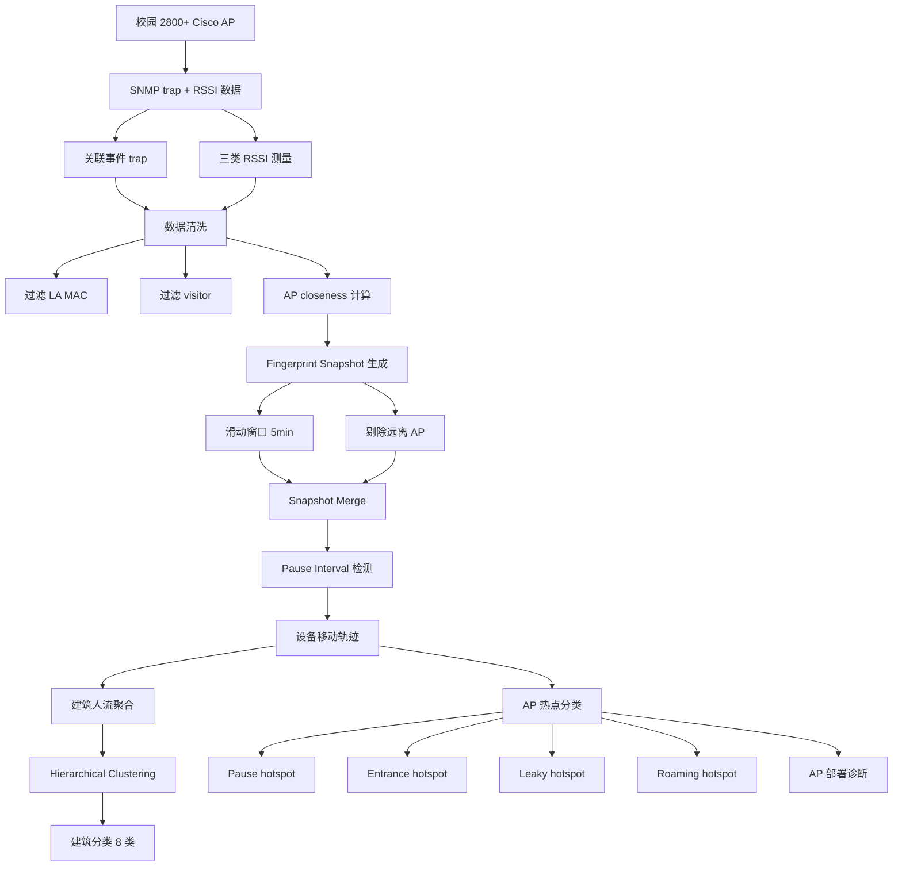
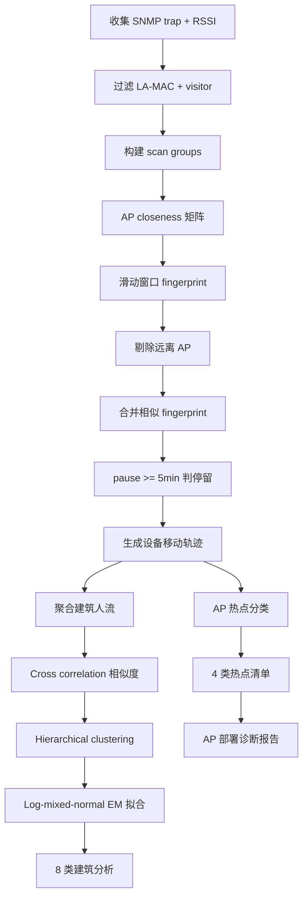

# Mining Crowd Mobility and WiFi Hotspots on a Densely-populated Campus（UbiComp/ISWC 2017 Adjunct）

> 作者：Mengyu Zhou, Kaixin Sui, Dan Pei, Thomas Moscibroda  
> 机构：清华大学；微软亚洲研究院  
> 发表年份：2017  
> 会议/期刊：UbiComp/ISWC 2017 Adjunct（ACM International Joint Conference on Pervasive and Ubiquitous Computing）  
> 关联 PDF：同目录下 `purba17-zhou.pdf`

## 一、文档信息速览

| 字段 | 值 |
|---|---|
| 标题 | Mining Crowd Mobility and WiFi Hotspots on a Densely-populated Campus |
| 作者 | Mengyu Zhou, Kaixin Sui, Dan Pei, Thomas Moscibroda |
| 机构 | 清华大学；微软亚洲研究院 |
| 发表年份 | 2017 |
| 会议/期刊 | UbiComp/ISWC 2017 Adjunct |
| 分类 | 校园测量 / 人群移动 / WiFi 热点诊断 |
| 核心问题 | 在校园等密集人群区域，传统测量管理耗时且偏主观；如何用校园 WLAN 数据大规模理解人群移动 |
| 主要贡献 | (1) 清华校园 2800+ AP / 116 栋楼 / 60000+ 设备的大规模移动分析；(2) 提出 Log-mixed-normal 模型刻画室内停顿时长；(3) 把建筑物分为 8 类；(4) 定义 4 种 WiFi 热点（pause / entrance / leaky / roaming），并诊断 AP 部署问题 |

## 二、背景（Background）

密集城区的管理与规划面临挑战：数据收集耗时、分析过时、依赖主观判断。校园尤其如此——学生的活动很少被大规模测量和分析，更不用说用于指导规划与改进。

过去十年，WiFi 基础设施与智能手机普及为研究人群物理活动提供机会。学生 / 老师日常在校内使用 WiFi 与移动设备，留下前所未有的大量数据，可用于校园研究。

论文系统化分析清华校园 WLAN 数据，规模：~4.4 km² 校园，45000 学生 + 12000 教职员工；2016 年 8 月统计 116 栋楼 2890 个 Cisco 企业 AP，峰值同时连接 ~20000 设备，每日独立设备 >60000。

论文聚焦四个问题：(1) 居民如何在校内移动并花时间？(2) 人群活动有何频繁 / 周期模式？(3) 空间上下文（建筑物）如何影响活动？(4) 公共设施使用是否合理，存在什么问题？

## 三、目的（Problems Solved）

- **缺乏大规模校园移动数据**：通过 WLAN 推断设备移动；
- **室内 vs 室外移动差异**：证明室内移动仍遵循重尾 Lévy walk 但呈现 Log-mixed-normal；
- **建筑物使用模式识别**：基于人流序列相似度聚类，得到 8 类建筑；
- **WiFi 热点诊断**：识别 pause、entrance、leaky、roaming 四类热点，发现 AP 部署问题；
- **室内定位成本高**：使用基于 AP "closeness" 的免标注 mobility detection 算法；
- **访客 vs 常住者区分**：用 MAC 地址出现天数（>5 天）做粗筛。

## 四、核心原理（Principles）

**系统总览**：通过 SNMP trap + RSSI 三类记录（probe / rogue / connected）收集所有设备的移动轨迹；用 AP closeness（同一 scan group 中同时出现的频率）作为"近"的度量；用 fingerprint snapshot 滑动窗口做室内定位（粒度到房间级）；基于人流序列做建筑聚类；基于移动模式识别 4 类 WiFi 热点。

**关键概念**：

- **Pause Time**：设备停留时间（stay interval）。
- **Pause Location**：停留位置（fingerprint）。
- **AP Closeness**：两 AP 在同一 scan group 同时出现的频率。
- **Fingerprint Snapshot**：滑动窗口内设备在多个 AP 上的 RSSI 集合。
- **SNMP Trap / Object Values**：AP 关联事件与 RSSI 数据源。
- **Levy Walk**：重尾的随机游走模型。
- **Log-mixed-normal**：两个对数正态混合（一个刻画"访客"，一个刻画"居民"）。
- **Hierarchical Clustering**：基于建筑间流序列相似度的层次聚类。
- **Cross Correlation**：时序相似度。
- **MAC Spoofing**：MAC 地址伪造（iOS / Windows 随机化）。
- **Visitor / Occupant**：访客 vs 常驻。
- **Hotspot Type**：pause / entrance / leaky / roaming 四类。

**数学原理**：

- **AP Closeness（论文 §3.1）**：

$$
C(\text{AP}_i, \text{AP}_j) = \frac{|\{sg \mid \text{AP}_i \in sg \land \text{AP}_j \in sg \land sg \in SG\}|}{|\{sg \mid \text{AP}_i \in sg \land sg \in SG\}|}
$$

- **Cross Correlation（论文 §4.1 注释）**：

$$
\rho_{XY}(\tau) = \frac{E[(X_t - \mu_X)(Y_{t+\tau} - \mu_Y)]}{\sigma_X \sigma_Y}
$$

- **Log-mixed-normal 模型（论文 §4.2）**：

$$
P \sim \exp(\lambda_v \mathcal{N}(\mu_v, \sigma_v) + \lambda_o \mathcal{N}(\mu_o, \sigma_o))
$$

用 EM 算法拟合 8 类建筑（论文 Table 3）：cafeteria 中 μ_v=3.042（短停留）+ λ_v=0.918（占比高）说明以访客短停留为主；dorm 中 μ_o=4.505（长停留）+ λ_o=0.198（占比低）说明以居民长停留为主。

- **暂停 vs 短暂移动**：停留 ≥5 分钟定义为 pause mode；其他为 transient mode。

**与现有技术的差异**：相比传统 GPS 室外移动模型（Lévy walk 的飞行时长随室外区域缩小而缩短），论文证明室内场景不再符合该规律；相比 LiveLabs（NUS）仅使用关联事件，本论文使用 probe / rogue / connected 三类 RSSI，覆盖率提升 71%。

## 五、算法详解（Algorithm）

1. **输入 / 输出**：
   - 输入：SNMP trap + RSSI 测量；可选 App 端移动数据（pedometer 等）。
   - 输出：每设备在每时刻的（停留区间 + 指纹）；建筑聚类；4 类热点清单。

2. **核心模块**：
   - **Data Collection**：从 SNMP 收 trap + 三类 RSSI；过滤 LA-MAC 与 <5 天的 visitor。
   - **AP Closeness 计算**：用一段时间的 scan group 统计 AP 之间共同出现频率。
   - **Fingerprint Snapshot 生成**：用滑动窗口（5 分钟）剔除过期与"远离"AP。
   - **Snapshot Merge**：相邻"相似"fingerprint 合并成大 fingerprint。
   - **Pause vs Transient 分类**：停留 ≥5 分钟 = pause；否则 transient。
   - **Building Flow Series**：统计每栋楼每 10 分钟的到达 / 离开 / 总设备数。
   - **Hierarchical Clustering**：用 cross correlation 衡量建筑间相似度，层次聚类。
   - **Log-mixed-normal Fitting**：对每类建筑的暂停时间分布做 EM 拟合。
   - **Hotspot Classification**：根据设备停留 / 飞过的模式把 AP 分到 pause / entrance / leaky / roaming。

3. **伪代码**：

```python
def compute_ap_closeness(scan_groups):
    closeness = defaultdict(lambda: defaultdict(int))
    for sg in scan_groups:
        for ap_i in sg:
            for ap_j in sg:
                if ap_i != ap_j:
                    closeness[ap_i][ap_j] += 1
    for ap_i in closeness:
        total = closeness[ap_i][ap_i]
        for ap_j in closeness[ap_i]:
            if total > 0:
                closeness[ap_i][ap_j] /= total
    return closeness

def mobility_detection(device, scan_groups, closeness, window=5min):
    snapshots = []
    for sg in device.scan_groups:
        snap = [r for r in sg if r.rssi is not None and not far_away(r.ap, current_aps, closeness)]
        if snap:
            snapshots.append(snap)
    merged = merge_similar(snapshots, threshold=0.75)
    intervals = [(s.t_start, s.t_end) for s in merged if s.duration >= 5min]
    return intervals  # pause intervals

def cluster_buildings(buildings, max_lag=30min):
    sim_matrix = np.zeros((len(buildings), len(buildings)))
    for i, b1 in enumerate(buildings):
        for j, b2 in enumerate(buildings):
            xcorr = cross_correlation(b1.flow, b2.flow, max_lag)
            sim_matrix[i][j] = max(xcorr)
    dist = -sim_matrix
    Z = hierarchy.linkage(dist, method='complete')
    return hierarchy.fcluster(Z, t=...)
```

4. **关键数学**：见 §四。

5. **复杂度分析**：
   - AP closeness：O(|scan_groups| × |AP|²)；
   - Mobility detection：单设备 O(n_snapshots)；
   - Building clustering：O(|buildings|² × |flow_len|)；
   - 对 6 万设备规模可批处理。

6. **训练与推理**：
   - 训练：无监督；EM 算法拟合 Log-mixed-normal；
   - 推理：在线 AP 选择 / 异常检测复用 closeness 度量。

7. **示例**：FIT（系楼）周三到达/离开曲线（论文 Figure 2）——早上涌入、中午短暂离开、下午课程再进入；wifi 热点分析发现某些 AP 总是 entrance 模式，某些总是 pause 模式，某些白天没人用（cold-spot）。

## 六、系统架构图（Architecture）



## 七、流程图（Process Flow）



## 八、关键创新点（Key Innovations）

- **+ 大规模真实数据**：2800+ AP / 116 楼 / 60000+ 设备的清华校园。
- **+ 三类 RSSI 融合**：probe / rogue / connected，覆盖时间比单用连接事件提升 71%。
- **+ 免标注 mobility detection**：基于 AP closeness，无需 3D 坐标或 fingerprinting 训练。
- **+ Log-mixed-normal**：刻画室内停顿时长双峰（访客 vs 居民）。
- **+ 建筑聚类**：用 cross correlation 相似度 + hierarchical clustering 自动得到 8 类建筑。
- **+ 4 类热点诊断**：pause / entrance / leaky / roaming，自动发现 AP 部署问题。

## 九、实验与结果（Experiments）

- **数据集**：清华校园 WLAN 11 周（2015-11 至 2016-01）；209,723 个 MAC 地址（其中 486 个 LA-MAC）；107,290 个非访客设备（342 stationary + 11575 laptop + 95373 phone）。
- **示例建筑**（论文 Table 1）：A 食堂 9696 m² / 8 AP；B 体育馆 12600 m² / 19 AP；C 宿舍 35668 m² / 84 AP；D 教学楼 34045 m² / 115 AP；E 图书馆 20000 m² / 50 AP；F 系楼 36780 m² / 121 AP。
- **暂停统计**（论文 Table 2）：日均 2.64 次暂停，93% 室内时间在 pause，停留平均 196.35 分钟，室内平均 210.76 分钟，跨 3.11 个位置。
- **建筑分类**（论文 Table 3）：8 类——admin / cafeteria / classroom / department / dorm / gym / library / others。
- **Log-mixed-normal 参数**：cafeteria λ_v=0.918, μ_v=3.042；dorm λ_v=0.802, μ_v=3.590；classroom μ_o=3.829 对应课程长度 95-155 分钟。
- **热点**（论文 Table 4）：A 食堂 8 AP（4p/4e/7l/7r）；D 教学楼 115 AP（106p/3e/29l/26r）；F 系楼 121 AP（103p/2e/16l/24r）。
- **诊断**：A 食堂 AP 数量不足且功率过高；D 教学楼空旷结构导致 leaky AP；F 系楼 1 楼为 entrance，6 楼为 cold-spot。
- **验证**：对比 5 台设备的手工日志——WLAN 数据准确率 84.5%、冲突率 0.73%；移动数据 92.0% / 1.31%。

## 十、应用场景（Use Cases）

- **校园 AP 部署优化**：诊断 pause / entrance / leaky / roaming 热点，调整功率 / 数量 / 位置。
- **大型公共场所 WiFi 规划**：商场、机场、医院的 hotspot 分析。
- **教学楼课程安排**：根据学生移动模式优化课程时段。
- **节能 / 资源调度**：识别 cold-spot，关闭冗余 AP。
- **城市人群流动研究**：扩展到城市级 AP 数据。

## 十一、相关论文（Related Papers in this set）

- `purba17-zhou`（本文）
- `wpa16-zhou`（MobiCamp：基于同类数据的物理活动研究平台）
- `pch-infocom2017`（WiFi 连接耗时）
- `issre-stepwise`、`liuping-camera-ready`、`wch_ISSRE-1`、`马明华atc21_JumpStarter`、`vldb20_slowsql`、`TraceSieve_ISSRE23`（同作者团队其他论文）

## 十二、术语表（Glossary）

- **Pause Time / Pause Location**：设备停留时长与位置。
- **AP Closeness**：两 AP 在同一 scan group 同时出现的频率。
- **Fingerprint Snapshot**：滑动窗口内 AP RSSI 集合。
- **SNMP Trap / Object Values**：AP 关联事件与 RSSI 数据源。
- **Levy Walk**：重尾随机游走。
- **Log-mixed-normal**：两个对数正态混合。
- **Hierarchical Clustering**：层次聚类。
- **Cross Correlation**：时序相似度。
- **MAC Spoofing / LA-MAC**：MAC 地址伪造 / 本地管理 MAC。
- **Visitor / Occupant**：访客 / 常驻。
- **Hotspot Type**：pause / entrance / leaky / roaming 四类。

## 十三、参考与延伸阅读

- Paper: MobiCamp（[5]，WPA 2016）——同数据源的物理活动研究平台。
- Paper: Levy walk nature of human mobility（Rhee et al. 2011）。
- Paper: LiveLabs（NUS）——大规模 WLAN 测量。
- Paper: Physical Analytics Workshop 系列。
- Paper: StudentLife（Wang et al. 2014）——智能手机测量学生行为。
- Paper: Event Detection（Jayarajah et al. 2015）。
- 工具：Cisco 企业 WLAN、SNMP、lab.mu TUNet App。
- 相关论文：`wpa16-zhou`、`pch-infocom2017`、`issre-stepwise`、`liuping-camera-ready`、`wch_ISSRE-1`。