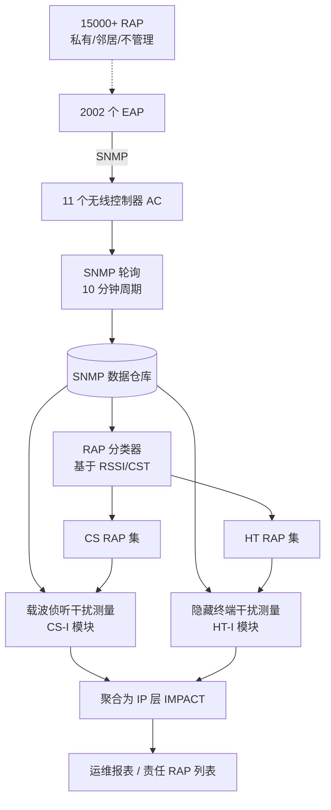
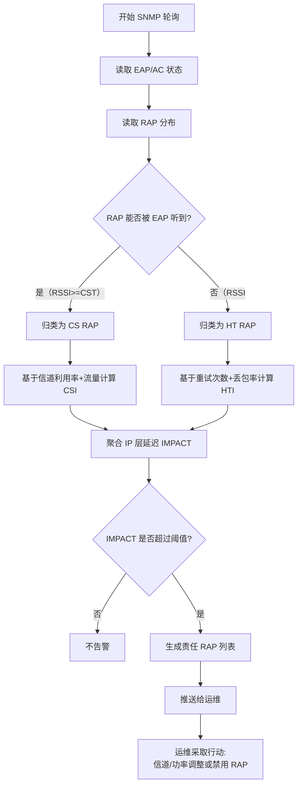

# How Bad Are The Rogues' Impact on Enterprise 802.11 Network Performance?（IEEE INFOCOM 2015）

> 作者：Kaixin Sui, Youjian Zhao, Dan Pei, Li Zimu
> 机构：清华大学（Tsinghua National Laboratory for Information Science and Technology, Tsinghua University）
> 发表年份：2015
> 会议/期刊：IEEE INFOCOM 2015（Hongkong, China, April 27-30, 2015）
> 关联 PDF：同目录下 `rap-paper.pdf`

## 一、文档信息速览

| 字段 | 值 |
|---|---|
| 标题 | How Bad Are The Rogues' Impact on Enterprise 802.11 Network Performance? |
| 作者 | Kaixin Sui, Youjian Zhao, Dan Pei, Li Zimu |
| 机构 | Tsinghua University（清华大学） |
| 发表年份 | 2015 |
| 会议/期刊 | IEEE INFOCOM 2015 |
| 分类 | 网络测量 / 企业无线局域网运维 / 干扰诊断 |
| 核心问题 | Rogue AP（RAP）对 Enterprise WLAN（EWLAN）性能的实际干扰程度有多大？如何用现成的 SNMP 数据低成本量化、并定位肇事 RAP？ |
| 主要贡献 | 1) 大规模测量（11 个 AC、2002 EAP、15000+ RAP）；2) 纯 SNMP 的干扰测量方法；3) 量化载波侦听干扰与隐藏终端干扰；4) 给出 RAP 的服务质量度量指标 |

## 二、背景（Background）

802.11（Wi-Fi）是移动互联网的关键基础设施。在大学、公司、机场、酒店、商场、公交等场景下大量部署，给用户免费或低成本的网络接入。多种 802.11 网络经常占用相同空间、竞争同一频谱——企业无线局域网（Enterprise Wireless LAN，简称 EWLAN）的接入点（AP）被精心选址、分配信道、调整发射功率，被称为 Enterprise AP（EAP）；但同时，附近大量"私有"或"邻居"802.11 AP（"Rogue AP"，RAP）几乎不管理信道、不考虑共存，给 EWLAN 的运维带来难题。

论文关注的核心场景是：在某中国大型高校校园网 T（覆盖约 4 平方公里，4.2 万学生 + 1.1 万教职工，79 栋建筑），其 EWLAN 部署了 11 个无线控制器（AC）、2002 个 EAP，服务于 5 万多台 802.11 设备。然而其周围有超过 15000 个 RAP，几乎是 EAP 数量的 7 倍。运维团队无法判断这些 RAP 是否真的在伤害用户体验，也无法在没有 sniffers、JIGSAW 等专用测量硬件的前提下隔离肇事 RAP。

传统测量方法（SHAMAN、JIGSAW 等）依赖专用硬件，难以大规模推广。论文的核心动机：用 EWLAN 已经广泛部署的 SNMP 数据，对 RAP 的两类干扰——载波侦听（Carrier Sense）干扰与隐藏终端（Hidden Terminal）干扰——进行可规模化、低成本、可定位的测量。

## 三、目的（Problems Solved）

- **痛点**：缺乏可扩展的 RAP 影响测量方法，现有方案依赖 sniffers 等专用硬件。**方案**：只利用 SNMP 数据，结合信道利用率、流量、重试次数等指标反推干扰。
- **痛点**：测量结果不仅要"看到"整体影响，还要能定位肇事 RAP。**方案**：把 RAP 按"载波侦听干扰"与"隐藏终端干扰"两类分别量化，分别给出责任 RAP 的定位方法。
- **痛点**：干扰源（隐藏终端）本质上应该"听不见"，需要找到它们。**方案**：利用 RTS/CTS 阈值、RSSI 阈值，把 RAP 区分成"载波侦听型（CS RAP）"与"隐藏终端型（HT RAP）"，再分别测量。
- **痛点**：如何区分"低 SNR 造成的丢包"与"隐藏终端造成的丢包"。**方案**：基于 RAP 与 EAP 的信号强度阈值（CST）来分类。

## 四、核心原理（Principles）

### 系统总览

论文针对一个真实的校园 EWLAN（含 2002 EAP，15000+ RAP），通过 5 天（2014-07-14 至 2014-07-18）的 SNMP 轮询数据，按 79 栋建筑、4 种建筑类型分类统计，对 RAP 的两类干扰（载波侦听干扰与隐藏终端干扰）做量化测量。

### 关键概念

- **EAP（Enterprise AP）**：被 EWLAN 集中管理的接入点。
- **RAP（Rogue AP）**：EAP 周围"野生"的、不可管理的接入点。
- **载波侦听干扰（Carrier Sense Interference）**：EAP 与 RAP 共用信道，EAP 因侦听到 RAP 的信号而推迟发送，导致 MAC 层接入延迟增加。
- **隐藏终端干扰（Hidden Terminal Interference）**：EAP 与 RAP 距离较远、或被阻挡，EAP 侦听不到 RAP 信号，但 RAP 信号强度足以在接收端碰撞，导致 MAC 层丢包率上升。
- **CS RAP**：能被 EAP 听到的 RAP（RSSI ≥ CST），造成载波侦听干扰。
- **HT RAP**：EAP 听不见但仍能碰撞的 RAP（RSSI < CST），造成隐藏终端干扰。
- **SNMP OID**：SNMP MIB 中可轮询的对象；论文用 OID 2、3、11、17 等分别对应客户端数、流量、信道利用率、重试次数等。

### 测量方法（核心数学原理）

**载波侦听干扰指标** `CSI`（Carrier Sense Interference）：

$$CSI = \frac{D_{cs} - D_{non-cs}}{D_{non-cs}}$$

其中 `D_cs` 是有载波侦听干扰时的接入延迟，`D_non-cs` 是无干扰基线延迟。

**隐藏终端干扰指标** `HTI`（Hidden Terminal Interference）：

$$HTI = L_{ht} - L_{non-ht}$$

其中 `L_ht` 是有隐藏终端干扰时的 MAC 丢包率，`L_non-ht` 是无干扰基线。

**IP 层 Wi-Fi 跳延迟指标** `IMPACT`：

$$IMPACT_{ip} = (1 + CSI) \cdot (1 + HTI) - 1 \approx CSI + HTI$$

论文用 `CSI` 与 `HTI` 分别量化两类干扰。

### 与现有技术的差异

- 相比 SHAMAN、JIGSAW 等基于 sniffers 的方案，本论文只用 SNMP，不需要额外硬件，可大规模推广。
- 相比只关心整体吞吐量的测量，论文单独量化载波侦听与隐藏终端干扰，并给出 RAP 的责任定位方法。
- 相比实验室仿真，本论文是基于真实部署的 5 天大规模测量。

## 五、算法详解（Algorithm）

### 1. 输入/输出

- **输入**：SNMP 轮询数据（每 10 分钟一次）——EAP 客户端数、EAP 流量、信道利用率、每 AC 每信道上的重试次数、AC 与 EAP 间的统计对象等。
- **输出**：每个 EAP 的载波侦听干扰度 `CSI`、隐藏终端干扰度 `HTI`、责任 RAP 列表。

### 2. 核心模块

- **数据采集层**：在 11 个 AC 上配置 SNMP 轮询，采集周期 10 分钟。
- **干扰分类器**：基于 RSSI 与载波侦听阈值（CST）将 RAP 分为 CS RAP 与 HT RAP。
- **载波侦听干扰测量模块**：基于信道利用率、流量、延迟差值反推 `CSI`。
- **隐藏终端干扰测量模块**：基于 MAC 层丢包率、重试次数反推 `HTI`。
- **责任 RAP 定位模块**：基于 RAP 的信道分布、信号强度与 EAP 的物理位置，给出肇事 RAP 列表。

### 3. 伪代码

```python
# === RAP 干扰测量伪代码（基于 SNMP） ===
def measure_rap_impact(eap, ac, snmp_window):
    # Step 1: 读出每个信道的利用率与重试次数
    channel_util = snmp_query(ac, 'channel_utilization', snmp_window)
    retry_count  = snmp_query(ac, 'retry_count', snmp_window)
    traffic      = snmp_query(ac, 'traffic_volume', snmp_window)
    
    # Step 2: 计算载波侦听干扰度
    baseline_delay = estimate_baseline_delay(traffic)
    cs_delay       = estimate_delay_within_cs(channel_util)
    CSI = (cs_delay - baseline_delay) / baseline_delay
    
    # Step 3: 分类 RAP：CS RAP vs HT RAP
    raps = discover_raps(eap)  # 基于 RSSI 与 CST 阈值
    cs_raps = [r for r in raps if r.rssi >= CST]
    ht_raps = [r for r in raps if r.rssi < CST]
    
    # Step 4: 计算隐藏终端干扰度
    baseline_loss = estimate_baseline_loss()
    ht_loss       = estimate_loss_within_ht(ht_raps, retry_count)
    HTI = ht_loss - baseline_loss
    
    # Step 5: 责任 RAP 定位
    offending_cs = locate_offending(eap, cs_raps, traffic)
    offending_ht = locate_offending(eap, ht_raps, retry_count)
    
    return {
        'CSI': CSI,
        'HTI': HTI,
        'IP_impact': (1 + CSI)*(1 + HTI) - 1,
        'offending_cs': offending_cs,
        'offending_ht': offending_ht
    }
```

### 4. 关键数学

- 载波侦听延迟估计：使用 M/M/1 队列模型近似 MAC 延迟。
- 隐藏终端丢包率：把每 RAP 的 RSSI 转换成冲突概率，对所有 HT RAP 累加得到总丢包率。
- IP 层延迟传播公式：`(1 + CSI)*(1 + HTI) - 1 ≈ CSI + HTI`，在小干扰下成立。

### 5. 复杂度分析

- 采集复杂度：`O(N_eap × N_ch × N_poll)`，N_poll 在 5 天里是 ~720 次（10 分钟间隔）。
- 计算复杂度：`O(N_rap × N_eap)`，RAP 数量 15000+，EAP 数量 2002。

### 6. 训练与推理

论文不做模型训练；所有指标都是基于 SNMP 数据的统计与基于队列模型的分析。

### 7. 示例

论文 Section V 的实验显示，在一栋高层公寓楼的 EAP 中，CS RAP 只造成 MAC 层 5% 的延迟增加；而 HT RAP 可造成高达 30% 的 MAC 层丢包率。最终 IP 层延迟增加可达 50%。在 79 栋建筑中，约 20% 的 EAP 在高峰时段有超过 50% 的延迟增加。

## 六、系统架构图（Architecture）



## 七、流程图（Process Flow）



## 八、关键创新点（Key Innovations）

- **+ 大规模真实测量**：覆盖 79 栋建筑、2002 EAP、15000+ RAP 的 5 天连续测量，论文宣称是当时文献中最大规模的 Wi-Fi 干扰测量之一。
- **+ 仅用 SNMP 的可扩展方法**：不需要 sniffers / JIGSAW / SHAMAN 等专用硬件，所有指标都可从 AC 现有 MIB 轮询获得。
- **+ 区分载波侦听与隐藏终端**：第一次把两类干扰分别量化，揭示它们的影响级别相差数倍。
- **+ RAP 服务质量量化指标**：给出可"行动"的 RAP 影响度，运维可据此定位肇事 RAP。
- **+ 揭示"工程化 EAP"的优势**：EAP 的自动信道/功率调整可基本压制载波侦听干扰，但隐藏终端仍无法解决，论文呼吁改进协议/软件。

## 九、实验与结果（Experiments）

### 数据集

- **真实 EWLAN**：中国某高校 T 校园网。
- **规模**：11 AC、2002 EAP、15000+ RAP、79000+ 客户端、79 栋建筑、5 种建筑类型。
- **时间**：2014-07-14 至 2014-07-18（5 天）。

### 主要指标与结果

- **载波侦听干扰**：平均 MAC 层接入延迟增加约 **5%**，因为 EAP 自动信道/功率优化有效。
- **隐藏终端干扰**：平均 MAC 层丢包率增加约 **30%**——比载波侦听干扰严重得多。
- **IP 层延迟**：在 Wi-Fi 跳延迟增加可达 **50%**。
- **建筑类型**：高层公寓（dormitory）受 RAP 影响最严重，其次是教学楼；办公区因 EAP 密度高，受影响较小。
- **时间模式**：早 8 点与晚 6 点的"rush hour"出现大量延迟尖峰，约 20% 的 EAP 出现 50% 以上的延迟增加。

### 消融/对比

- **CS RAP vs HT RAP**：分别测出两类 RAP 的影响，HT RAP 主导。
- **流量级别 vs 影响**：流量越大，HTI 影响越显著。
- **基线比较**：对比无 RAP 干扰时的延迟基线。

## 十、应用场景（Use Cases）

- **校园/企业 EWLAN 运维**：周期性巡检，自动找出 RAP 责任清单。
- **机场/酒店/商场 Wi-Fi 运营**：监控自有 AP 周围邻居干扰影响。
- **电信运营商 Wi-Fi 运营**：用 SNMP 远程监控大量 AP 节点。
- **无线网规/网优**：在新建筑规划时预测 RAP 干扰。
- **协议设计**：为下一代 IEEE 802.11 协议提供"隐藏终端感知"功能的设计依据。

## 十一、相关论文（Related Papers in this set）

本批次未涉及与 RAP 强相关的同组论文。但本论文作者团队的 NetMan Lab 在以下方向有大量工作：

- 数据中心网络：`CQRD-ComputerNetworks15.pdf`、`CQRD-LCN.pdf`。
- 路由器缓存：`chen_npc14_CQ.pdf`。
- 智能运维（异常检测）：`liu_ipccc15_ptl.pdf`、`liu_cnsm14_cloudwatchplus.pdf`。
- 域间路由：`Multi-AS-cooperative-incoming-traffic-engineering-in-a-transit-edge-separate-internet-zhang2014.pdf`、`BAPL_publish_version.pdf`。

## 十二、术语表（Glossary）

| 术语 | 含义 |
|---|---|
| EAP | Enterprise AP，EWLAN 管理的接入点 |
| RAP | Rogue AP，"野生"邻居接入点 |
| EWLAN | Enterprise Wireless LAN，企业无线局域网 |
| AC | Access Controller，接入控制器 |
| CS RAP | 载波侦听型 RAP（能被 EAP 听到） |
| HT RAP | 隐藏终端型 RAP（EAP 听不见） |
| CSI | Carrier Sense Interference 度量 |
| HTI | Hidden Terminal Interference 度量 |
| IMPACT | IP 层延迟增加 ≈ CSI + HTI |
| SNMP | 简单网络管理协议 |
| CST | 载波侦听阈值（区分 CS / HT 的信号强度阈值） |

## 十三、参考与延伸阅读

- **SHAMAN**：J. Y. L. Thavis, J. Y. J. Choi, J. Y. Song, "SHAMAN: A Self-healing System for Wireless LAN", 是论文引用的对比 baseline。
- **JIGSAW**：基于 sniffers 的细粒度测量，论文指出其无法大规模部署。
- **Y. C. Cheng, et al., "Jigsaw: An Efficient Approach for Wireless LAN Measurement"**：经典基于 sniffers 的 Wi-Fi 测量工作。
- **802.11 标准**：IEEE Std 802.11-2012，PHY/MAC 层 CSMA/CA 机制。
- **Cisco Aironet 系列配置手册**：EAP 自动信道/功率调整算法的实现细节。