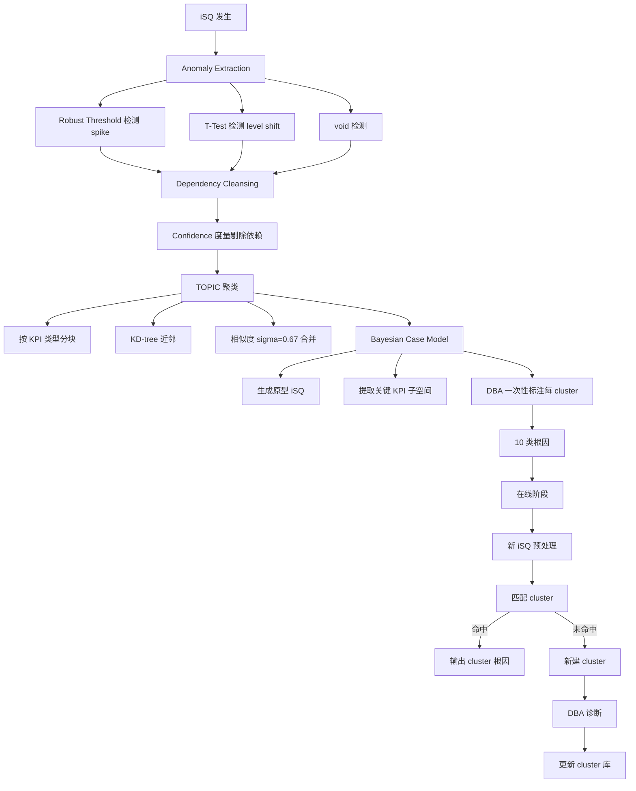
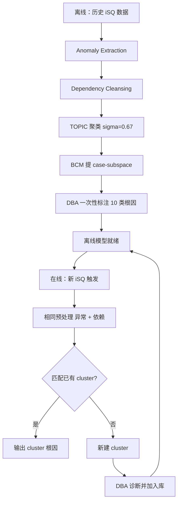

# Diagnosing Root Causes of Intermittent Slow Queries in Cloud Databases（VLDB 2020）

> 作者：Minghua Ma, Zheng Yin, Shenglin Zhang, Sheng Wang, Christopher Zheng, Xinhao Jiang, Hanwen Hu, Cheng Luo, Yilin Li, Nengjun Qiu, Feifei Li, Changcheng Chen, Dan Pei  
> 机构：清华大学；阿里巴巴集团；南开大学  
> 发表年份：2020  
> 会议/期刊：VLDB 2020（Proceedings of the VLDB Endowment, Vol. 13, No. 8, pp. 1176-1189）  
> 关联 PDF：同目录下 `vldb20_slowsql.pdf`

## 一、文档信息速览

| 字段 | 值 |
|---|---|
| 标题 | Diagnosing Root Causes of Intermittent Slow Queries in Cloud Databases |
| 作者 | Minghua Ma, Zheng Yin, Shenglin Zhang, Sheng Wang, Christopher Zheng, Xinhao Jiang, Hanwen Hu, Cheng Luo, Yilin Li, Nengjun Qiu, Feifei Li, Changcheng Chen, Dan Pei |
| 机构 | 清华大学；阿里巴巴集团；南开大学 |
| 发表年份 | 2020 |
| 会议/期刊 | VLDB 2020 |
| 分类 | 云数据库 / 慢查询诊断 / 根因分析 |
| 核心问题 | 阿里云数据库每天产生数万条"间歇性慢查询（iSQ）"，传统 case-by-case 诊断耗时耗力且易出错 |
| 主要贡献 | (1) iSQUAD 框架：Anomaly Extraction + Dependency Cleansing + TOPIC + Bayesian Case Model 四组件；(2) 平均 F1 80.4%，比 DBSherlock 高 49.2%；(3) 在线部署：几百 iSQ 诊断从约 1 周缩短到 80 分钟（约 30×） |

## 二、背景（Background）

云数据库（Amazon RDS、Azure SQL、Google Cloud SQL、阿里 OLTP Database）已成为企业日常运营的核心基础设施。任何服务中断 / 性能抖动都意味着巨大损失。数据库系统（MySQL、Oracle、SQL Server）会自动记录超过阈值的慢查询日志。

论文发现一类特殊的慢查询——"Intermittent Slow Queries (iSQs)"：iSQ 是查询时间 X_t > z 且 P(X_i > z) < ε 的 SQL（z=1s，ε=0.01，T=10⁴）。iSQ 占慢查询 1%，但具有突发性、突然性、高危害：每次 web 加载延迟 0.1s，Amazon 损失 1% 销售额；Google 搜索延迟 0.5s 损失 20% 流量。

iSQ 的根因诊断面临三大挑战：(1) 多 DB 实例共享物理机 → 资源争抢导致跨实例根因；(2) 云原生架构（实例迁移、扩缩容、存算分离）使根因更复杂；(3) 每天数万 iSQ → case-by-case 诊断（每条 7.5 分钟）完全不可行。

论文从阿里 OLTP 数据库 1 年的故障记录中归纳 4 个关键观察：

1. DBA 需要扫描数百 KPI 才能定位症状；传统 RCA 只看单类 KPI 无法区分 8 类根因。
2. 同样的异常 KPI 集合、不同异常模式 → 不同根因；只看"是否异常"会混淆。
3. KPI 异常高度相关，故障传播是单向 / 双向。
4. 相似症状 → 相同根因；同类 KPI 可互换，但异常类别不变。

基于此提出 iSQUAD 框架，把机器学习与 DBA 领域知识结合，给出最少人工干预的根因诊断。

## 三、目的（Problems Solved）

- **iSQ 根因难以诊断**：iSQUAD 4 组件流水线 + DBA 一次性标注；
- **异常类型被传统检测器忽略**：Anomaly Extraction 把 KPI 异常分为 4 种（spike up/down、level shift up/down、void）；
- **KPI 依赖导致信息冗余**：Dependency Cleansing 用 Confidence 度量消除伪相关；
- **标注成本过高**：TOPIC 把同类 iSQ 自动聚成一类，DBA 每类只需标一次；
- **聚类难解释**：Bayesian Case Model 给出每个 cluster 的原型 + 关键 KPI 子空间；
- **在线 / 离线一致**：离线训练 + 在线匹配 + 新 cluster 增量更新。

## 四、核心原理（Principles）

**系统总览**：iSQUAD 离线 + 在线两阶段。离线：从历史 iSQ 中提取 4 类异常模式 + 依赖清洗 → TOPIC 聚类 → BCM 提 case-subspace → DBA 一次性标注每个 cluster 的根因。在线：对新 iSQ 做相同预处理 → 匹配已有 cluster → 用 cluster 根因解释；不匹配则建新 cluster 并请 DBA 诊断。

**关键概念**：

- **iSQ (Intermittent Slow Query)**：间歇性慢查询（X_t > z 且 P(X_i > z) < ε）。
- **KPI (Key Performance Indicator)**：性能指标，分 8 类（CPU、I/O、Workload、TCP RT、Memory、Network 等）。
- **Anomaly Type**：spike up、spike down、level shift up、level shift down、void。
- **Confidence**：关联规则中的支持度度量（论文 §4.1.2 Equation 1）。
- **TOPIC (Type-Oriented Pattern Integration Clustering)**：聚类算法，按 KPI 类型 + 异常模式相似度。
- **Bayesian Case Model (BCM)**：基于案例的原型 + 特征子空间生成。
- **Case-Subspace**：cluster 的原型 iSQ + 关键 KPI。
- **Bayesian Case Model (BCM)**：Kim, Rudin, Shah（NeurIPS 2014）提出。
- **DBSherlock**：论文 baseline（SIGMOD 2016）。
- **Alibaba OLTP Database**：阿里云 DBPaaS 数据库。

**数学原理**：

- **Confidence 关联规则（论文 §4.1.2 Equation 1）**：

$$
\text{confidence}(A \to B) = \frac{|A \cap B|}{|A|}
$$

论文实验对比 Confidence vs Mutual Information vs Gain Ratio：Confidence Precision 90.91% / Recall 100% / F1 95.24%（论文 Table 5）。

- **相似度（论文 §4.1.3 Equation 2）**：

$$
S_{ij} = \sqrt{ \frac{1}{T} \sum_{t=1}^{T} \left| k_{i}^t, k_{j}^t \right|^2 }
$$

其中 |k_i^t, k_j^t| 是 KPI 类型 t 内的 Simple Matching Coefficient（论文 Equation 3）。

- **Simple Matching Coefficient（论文 Equation 3）**：

$$
|k_i^t, k_j^t| = \frac{\#\text{Matching Anomaly States in type } t}{\#\text{Anomaly States in type } t}
$$

- **TOPIC 算法（论文 Algorithm 1）**：基于 KD-tree 的近邻搜索 + 相似度阈值 σ 的合并；时间复杂度 O(n log n)。

- **Bayesian Case Model（BCM）**：通过 EM 算法学习 cluster 的"原型"和"特征子空间"。

**与现有技术的差异**：与 DBSherlock（依赖互信息 + 谓词解释）相比，iSQUAD 用 Confidence 度量 + 类型感知聚类 + 案例推理，准确率提升 49.2%；与 PerfXplain（MapReduce 解释）相比，iSQUAD 针对数据库领域设计。

## 五、算法详解（Algorithm）

1. **输入 / 输出**：
   - 输入：iSQ 时间戳 + 位置（实例 / 机器）+ 59 个 KPI 在 ±1h 内的采样数据。
   - 输出：每个 iSQ 的根因（10 类之一）。

2. **核心模块**：
   - **Anomaly Extraction**（§4.1.1）：spike 用 Robust Threshold（median + MAD + Cauchy）；level shift 用 T-Test；void 用 0 / 缺失判断。
   - **Dependency Cleansing**（§4.1.2）：对每对 KPI 计算 confidence > 阈值则视为依赖，剔除冗余异常。
   - **TOPIC 聚类**（§4.1.3）：按 KPI 类型分块 + KD-tree + 相似度阈值 σ=0.67 合并。
   - **Bayesian Case Model**（§4.1.4）：为每个 cluster 生成原型 + 关键 KPI 子空间。
   - **在线阶段**：对新 iSQ 做相同预处理 → 匹配 cluster → 输出根因。

3. **伪代码**：

```python
def anomaly_extraction(kpi_segment):
    if robust_threshold(kpi_segment) > 0:
        return 'spike_up' if dir_ > 0 else 'spike_down'
    if t_test(kpi_segment) > thresh:
        return 'level_shift_up' if dir_ > 0 else 'level_shift_down'
    if all_zero_or_missing(kpi_segment):
        return 'void'
    return 'normal'

def dependency_cleansing(anomalies, confidence_threshold=0.9):
    kept = []
    for i, a_i in enumerate(anomalies):
        if all(confidence(a_i, a_j) < confidence_threshold for j in kept):
            kept.append(a_i)
    return kept

def topic(iSQs, sigma=0.67):
    S = {idx: pattern(i) for idx, i in enumerate(iSQs)}
    if all_zero_pattern in S:
        all_zero_cluster = S.pop(all_zero_pattern)
    D = reverse_dict(S)  # pattern -> [iSQ indices]
    return PatternCluster(D)

def PatternCluster(D):
    KDTree(D.keys())
    changed = True
    while changed:
        changed = False
        for i in list(D.keys()):
            j = KDTree.query(i)
            if i in D and j in D and similarity(i, j) > sigma:
                k = max([i, j], key=lambda x: len(D[x]))
                D[k] = D.pop(i) + D.pop(j)
                changed = True
    return D

def online_diagnose(new_iSQ, clusters, sigma=0.67):
    p = preprocess(new_iSQ)
    best, best_sim = None, -1
    for c in clusters:
        s = similarity(p, c.pattern)
        if s > sigma and s > best_sim:
            best, best_sim = c, s
    if best is None:
        new_cluster = create_cluster(p)
        clusters.append(new_cluster)
        return "请 DBA 诊断", new_cluster
    return best.root_cause, best
```

4. **关键数学**：见 §四。

5. **复杂度分析**：
   - Anomaly Extraction：每 KPI O(N)；
   - Dependency Cleansing：O(|KPI|²)；
   - TOPIC：O(n log n)；
   - BCM：EM 收敛到局部最优，迭代次数与 cluster 复杂度相关；
   - DBSherlock 0.46s/cluster vs iSQUAD 0.38s/cluster（论文 Table 3）。

6. **训练与推理**：
   - 训练：319 条 iSQ 由 DBA 标注（offline 55%，online 45%）；
   - 推理：iSQ 时间戳触发 → 离线模型匹配 → 输出根因。

7. **示例**：阿里云数据库 11:50 mysql.qps level shift down + mysql.active-session spike → iSQUAD 离线匹配到"database internal problem" cluster，输出根因。

## 六、系统架构图（Architecture）



## 七、流程图（Process Flow）



## 八、关键创新点（Key Innovations）

- **+ 异常类型而非二元检测**：区分 spike up/down、level shift up/down、void。
- **+ Confidence 依赖清洗**：比 Mutual Information 更准（论文 Table 5：95.24% vs 57.14% F1）。
- **+ TOPIC 类型感知聚类**：考虑 KPI 类型 + 异常模式，按 8 类分别计算相似度。
- **+ Bayesian Case Model 可解释**：每个 cluster 生成原型 iSQ + 关键 KPI 子空间。
- **+ 真实生产部署**：阿里 OLTP 数据库实测，把几百条 iSQ 诊断从 1 周降到 80 分钟。

## 九、实验与结果（Experiments）

- **数据集**：阿里 OLTP Database 三天 iSQ 数据，每天数千条；最终选 319 条唯一 iSQ（论文 §5.1）。
- **KPI**：59 个，覆盖 8 类（CPU 8 / I/O 19 / Workload 13 / TCP RT 12 / Memory 3 / Physical CPU 6 / I/O 4 / Network 4，论文 Table 1）。
- **Baseline**：DBSherlock（SIGMOD 2016）。
- **指标**：Weighted Avg Precision、Recall、F1；Clustering Accuracy、NMI。
- **关键数字**（论文 Table 3 + Table 4）：
  - iSQUAD Weighted Avg Precision 84.1%、Recall 79.3%、F1 80.4%；
  - DBSherlock Precision 42.5%、Recall 29.7%、F1 31.2%；
  - F1 提升 49.2%，时间节省 17.4%（0.38s vs 0.46s）；
  - Robust Threshold F1 98.7%，运行 0.19s；T-Test F1 92.6%，运行 0.23s（论文 Table 4）；
  - Confidence F1 95.24%，Mutual Info F1 57.14%，Gain Ratio F1 77.78%（论文 Table 5）；
  - TOPIC Clustering ACC 高于 hierarchical / K-means / DBSCAN 30%+（论文 Figure 8a）；
  - BCM 用户调研：平均正确率从 48.4%（w/o BCM）提升到 67.2%（w/ BCM）（论文 Table 6）；
  - 离线聚类 174 iSQ → 10 clusters；在线测试 145 iSQ → 80 分钟完成诊断；
  - 10 类根因（论文 Table 2）：Instance CPU Intensive Workload 27.6% / Host I/O Bottleneck 17.2% / Instance I/O Intensive Workload 0.9% / Accompanying Slow SQL 8.6% / Instance CPU & I/O Intensive 8.1% / Host CPU Bottleneck 7.5% / Host Network Bottleneck 6.9% / External Operations 6.9% / Database Internal Problem 3.4% / Unknown 2.9%。

## 十、应用场景（Use Cases）

- **云数据库慢查询诊断**：阿里 OLTP Database、Amazon RDS、Azure SQL、Google Cloud SQL。
- **多租户数据库实例共享场景**：实例间资源争抢根因定位。
- **存储计算分离架构**：计算节点 ↔ 存储节点瓶颈诊断。
- **闪购 / 大促**：突发负载导致的 iSQ。
- **数据库升级 / 迁移**：上线后的回归诊断。

## 十一、相关论文（Related Papers in this set）

- `vldb20_slowsql`（本文）
- `马明华atc21_JumpStarter`（JumpStarter：KPI 多变量异常检测，同一作者）
- `issre-stepwise`（StepWise：KPI 概念漂移适应）
- `liuping-camera-ready`（FluxRank：根因机器定位）
- `wch_ISSRE-1`（PatternMatcher：根因指标识别）
- `TraceSieve_ISSRE23`（追踪异常检测）

## 十二、术语表（Glossary）

- **iSQ (Intermittent Slow Query)**：间歇性慢查询。
- **Alibaba OLTP Database**：阿里云 DBPaaS 数据库。
- **Robust Threshold**：基于 median + MAD + Cauchy 分布的鲁棒阈值。
- **T-Test**：均值差异显著性检验。
- **Confidence**：关联规则支持度。
- **TOPIC**：Type-Oriented Pattern Integration Clustering。
- **Bayesian Case Model (BCM)**：基于案例推理的原型 + 特征子空间生成。
- **Case-Subspace**：cluster 原型 iSQ + 关键 KPI 子集。
- **DBSherlock**：SIGMOD 2016 数据库性能诊断工具。
- **PerfXplain**：VLDB 2012 MapReduce 性能解释。
- **DBPaaS**：Database Platform as a Service。
- **CWind、Kubernetes、Mesos**：容器编排平台。

## 十三、参考与延伸阅读

- Paper: DBSherlock（SIGMOD 2016）——论文 baseline。
- Paper: Bayesian Case Model（NeurIPS 2014）——iSQUAD 中 BCM 来自此。
- Paper: TCP-RT（SIGMOD 2018）——阿里云数据库性能监控系统。
- Paper: SageDB、NoisePage ——学习型数据库。
- Paper: PerfXplain（VLDB 2012）。
- Paper: KD-tree（Bentley 1975）。
- 工具：MySQL、Oracle、SQL Server、CVXPY、Kafka、InfluxDB、Apache Flink。
- 相关论文：`马明华atc21_JumpStarter`、`issre-stepwise`、`liuping-camera-ready`、`wch_ISSRE-1`、`TraceSieve_ISSRE23`。