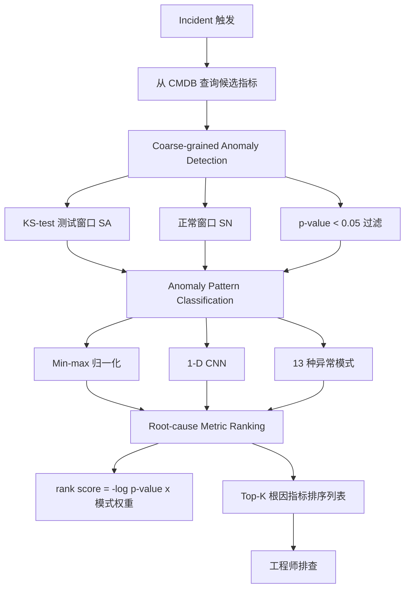
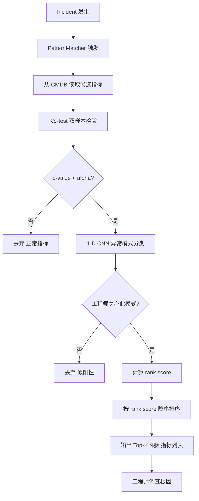

# Identifying Root-Cause Metrics for Incident Diagnosis in Online Service Systems（ISSRE 2021）

> 作者：Canhua Wu, Nengwen Zhao, Lixin Wang, Xiaoqin Yang, Shining Li, Ming Zhang, Xing Jin, Xidao Wen, Xiaohui Nie, Wenchi Zhang, Kaixin Sui, Dan Pei  
> 机构：清华大学；中国建设银行；BizSeer；BNRist  
> 发表年份：2021  
> 会议/期刊：ISSRE 2021（IEEE International Symposium on Software Reliability Engineering）  
> 关联 PDF：同目录下 `wch_ISSRE-1.pdf`

## 一、文档信息速览

| 字段 | 值 |
|---|---|
| 标题 | Identifying Root-Cause Metrics for Incident Diagnosis in Online Service Systems |
| 作者 | Canhua Wu, Nengwen Zhao, Lixin Wang, Xiaoqin Yang, Shining Li, Ming Zhang, Xing Jin, Xidao Wen, Xiaohui Nie, Wenchi Zhang, Kaixin Sui, Dan Pei |
| 机构 | 清华大学；中国建设银行；BizSeer；BNRist |
| 发表年份 | 2021 |
| 会议/期刊 | ISSRE 2021 |
| 分类 | 故障诊断 / 根因指标 / 异常模式 |
| 核心问题 | 在线服务系统故障时需检查数百至数千条指标定位根因；现有方法精度低或效率差 |
| 主要贡献 | (1) PatternMatcher：粗粒度异常检测 + 异常模式分类（1-D CNN）+ 根因排序；(2) 总结 13 种典型异常模式；(3) 4 个数据集 Avg@3 0.91；(4) 真实银行系统部署验证 |

## 二、背景（Background）

在线服务系统（搜索引擎、电商、社交网络）规模与复杂度不断增加，故障（incidents）不可避免。故障直接影响用户体验与营收——服务器宕机 1 小时平均损失 $301K-$400K。故障定位的关键环节是找出"根因指标"（root-cause metrics）供工程师进一步排查。

工程师需要扫描数百到数千条指标（应用、数据库、服务器、网络等）。手动逐一排查既耗时又易错。现有方法存在三大局限：

1. **基于统计异常检测**（如 FluxRank 用 KDE，ε-diagnosis 用 ε-statistic）：核函数与带宽难以选择，对短数据不鲁棒；
2. **忽略物理意义**：CPU 下降是好事，却被错误识别为根因；
3. **基于相关性**（CETS、MicroCause）：需要长期历史数据，对数千候选指标效率低。

论文对中国某大型商业银行的 14 个在线服务系统做大规模真实数据分析（含 50GB+ 指标数据、260K+ 指标）。得到三个关键发现：

1. 当前手动排查方式远不能令人满意；
2. 异常模式应被纳入根因分析（解释力更强）；
3. 实际中存在 13 种典型异常模式，不同模式严重程度不同。

论文提出 PatternMatcher，核心组件：(1) 粗粒度异常检测（KS-test）；(2) 异常模式分类（1-D CNN）；(3) 根因指标排序。

## 三、目的（Problems Solved）

- **海量指标难定位**：粗粒度 KS-test 过滤正常指标，搜索空间缩小；
- **物理意义被忽略**：1-D CNN 分类异常模式，可配置过滤工程师不关心的模式；
- **不同模式严重程度不同**：根因排序考虑 anomaly score × 模式权重；
- **训练样本不平衡**：用 reverse / shift / Gaussian noise 数据增强；
- **标注成本高**：用 KNN + DTW 做 active learning 半自动标注；
- **长 TTM**：从数千指标中秒级输出 Top-K 根因列表。

## 四、核心原理（Principles）

**系统总览**：PatternMatcher 三阶段——(1) Coarse-grained Anomaly Detection（KS-test 过滤正常指标）；(2) Anomaly Pattern Classification（1-D CNN 把异常段分类为 13 种模式）；(3) Root-cause Metric Ranking（按 anomaly score × 模式权重排序）。

**关键概念**：

- **Root-Cause Metric**：根因指标，故障期间异常且异常模式有物理意义的指标。
- **Incident**：故障（unplanned interruption）。
- **TTM (Time to Mitigate)**：故障缓解时间。
- **Anomaly Pattern**：异常模式，论文总结 13 种，分 Type-1（仍在异常状态）和 Type-2（恢复至正常）。
- **KS-test (Kolmogorov-Smirnov test)**：双样本检验，比较测试窗口与正常窗口的分布。
- **1-D CNN**：一维卷积神经网络，提取时间序列形状特征。
- **MLP (Multi-Layer Perceptron)**：多层感知机分类器。
- **KNN + DTW**：K 近邻 + 动态时间规整，用于 active learning 预分类。
- **Data Augmentation**：reverse / shift / Gaussian noise 增强样本。
- **AC@k / Avg@k**：top-k 准确率 / 平均 top-k 准确率。
- **Active Learning**：主动学习，减少人工标注。

**数学原理**：

- **KS-test（论文 §III-A）**：检验零假设 H0: SA = SN vs H1: SA ≠ SN，输出 p-value：

$$
H_0: S_A = S_N \quad vs \quad H_1: S_A \neq S_N
$$

阈值 α=0.05。论文设定 l1=10（测试窗口长度）、l2=30（正常窗口长度）。

- **异常分数（论文 §III-C Equation 2）**：

$$
\text{rank score} = (-\log \max(P, 0.0001)) \cdot p_w
$$

P 为 p-value，p_w 为模式权重。论文设置 Type-1 模式权重 0.8，Type-2 模式权重 0.2。

- **1-D CNN 网络结构（论文 §III-B）**：
  - 输入：异常段（min-max 归一化到 [0,1]）；
  - 三层 1-D 卷积（kernel=5，通道 64/128/256）+ 两层全连接（64/13）；
  - 输出：13 类的 LogSoftmax；
  - 损失：cross-entropy；优化器：Adam。

- **数据增强**：
  - Reverse：spike → dip，level shift up → level shift down；
  - Shift：水平平移；
  - Gaussian noise：N(0, 0.05)。

**与现有技术的差异**：与 FluxRank 相比，加入 1-D CNN 异常模式分类；与 ε-diagnosis 相比，把异常类型细化为 13 种物理意义类别；与 CETS 相比，不需要长期历史数据；与 MicroCause 相比，不依赖 PC algorithm 因果图。

## 五、算法详解（Algorithm）

1. **输入 / 输出**：
   - 输入：故障时间 t + 候选指标（基于系统拓扑从 CMDB 查询）。
   - 输出：根因指标排序列表。

2. **核心模块**：
   - **Coarse-grained Anomaly Detection**：KS-test 过滤 p-value < α=0.05 的正常指标。
   - **Anomaly Pattern Classification**：1-D CNN 把异常段分类为 13 种模式；过滤工程师不关心的模式。
   - **Root-cause Metric Ranking**：rank score = (-log max(P, 0.0001)) × p_w。

3. **伪代码**：

```python
def coarse_grained_detection(metric, t, l1=10, l2=30, alpha=0.05):
    SA = metric[t - l1 : t]
    SN = metric[t - l1 - l2 : t - l1]
    p = ks_2samp(SA, SN).pvalue
    return p < alpha

def pattern_classification(segment, model):
    x = minmax_normalize(segment)
    return model.predict(x)  # 13 classes

def pattern_matcher(metrics, t, cnn_model, l1=10, l2=30, alpha=0.05, p_w_table=None):
    candidates = []
    for m in metrics:
        p = ks_2samp(m[t-l1:t], m[t-l1-l2:t-l1]).pvalue
        if p < alpha:
            seg = m[t-30:t]  # w=30
            pattern = pattern_classification(seg, cnn_model)
            if is_concerned(pattern):
                score = (-math.log(max(p, 0.0001))) * p_w_table[pattern]
                candidates.append((m, score))
    return sorted(candidates, key=lambda x: -x[1])

def train_cnn(train_set, val_set, augment=True):
    if augment:
        train_set = augment_reverse(train_set)
        train_set = augment_shift(train_set)
        train_set = augment_noise(train_set)
    return OneDCNN().fit(train_set, val_set)

def active_labeling(samples, k=3):
    M = KNN_DTW(k=5)
    M.fit(label_first_100(samples))
    reliable = []
    for s in samples[100:]:
        votes = M.predict_top_k(s, k=k)
        if len(set(votes)) == 1:
            reliable.append((s, votes[0]))
        else:
            reliable.append((s, manual_label(s)))
    return reliable
```

4. **关键数学**：见 §四。

5. **复杂度分析**：
   - KS-test：O(N log N) 每条指标；
   - 1-D CNN：推理毫秒级；
   - 端到端：在 5213 条指标上 < 22 秒（论文 Table IV）；
   - 数据集 D：1060 指标 4.18 秒。

6. **训练与推理**：
   - 训练：1921 异常段，按 6:2:2 切分；100 条人工标注 + KNN 预标注 + 人工确认（active learning）；
   - 推理：故障 → 触发 PatternMatcher → 输出 top-k 排序列表。

7. **示例**：建行数据库故障，#active sessions 上升 → PatternMatcher 排序 log file parallel write、log file sync、db file parallel write 到 Top-5，过滤掉 CPU 下降等"好现象"，避免误诊。

## 六、系统架构图（Architecture）



## 七、流程图（Process Flow）



## 八、关键创新点（Key Innovations）

- **+ 13 种异常模式总结**：覆盖 Type-1（still abnormal）和 Type-2（recover to normal），每种都有物理意义。
- **+ 1-D CNN 自动分类异常模式**：无需手工特征工程。
- **+ KS-test 粗粒度过滤**：快速缩小搜索空间。
- **+ 模式权重排序**：考虑严重程度差异。
- **+ 数据增强 + Active Learning**：解决标注不平衡和成本问题。
- **+ 真实银行部署**：4 个数据集 113 个故障案例，Avg@3 0.91。

## 九、实验与结果（Experiments）

- **数据集**（论文 Table II）：
  - A：应用故障（低成功率、高响应时间、低事务量），5213 指标，16 案例；
  - B：应用故障（高响应时间、高失败数），3229 指标，19 案例；
  - C：数据库故障（高 #active sessions、高 CPU），265 指标，45 案例；
  - D：存储故障（高响应时间、磁盘失败），1060 指标，33 案例；
  - 总计：113 个故障案例。
- **Baseline**：FluxRank、ε-diagnosis、CETS、MicroCause。
- **指标**：AC@k、Avg@k（k=1, 3）；Precision / Recall / F1。
- **关键数字**（论文 Table III + Table V）：
  - PatternMatcher Avg@3：A=0.96、B=0.98、C=0.88、D=0.80、平均 0.91；
  - FluxRank Avg@3：0.70；ε-diagnosis：0.44；CETS：0.66；MicroCause：0.40；
  - W/o APC（无模式分类）：0.70；Raw ranking：0.85；
  - 1-D CNN F1-score 0.98（DA 后）；KNN(DTW) 0.91；RF 0.93；MLP 0.92；KNN(ED) 0.83（论文 Table V）；
  - 时间效率（论文 Table IV）：A 21.58s / B 13.12s / C 1.45s / D 4.18s；FluxRank 最快约 15.63s；
  - CETS 高达 124.85s（A 数据集），不可接受。
- **消融**：W/o APC Avg@3 从 0.91 → 0.70；Raw ranking 0.91 → 0.85。
- **可视化**：图 7 给出不同分类器下的 Avg@3 对比；图 1(a) 给出真实故障案例的检测耗时。

## 十、应用场景（Use Cases）

- **大型商业银行交易系统**：成功 / 失败率异常下的根因指标定位。
- **数据库故障诊断**：active sessions 上升 → 写相关指标定位。
- **存储系统 I/O 瓶颈**：响应时间飙升 → I/O 相关根因。
- **应用响应时间监控**：及时告警 + 自动根因列表。
- **云原生微服务**：服务故障的快速根因排查。

## 十一、相关论文（Related Papers in this set）

- `wch_ISSRE-1`（本文）
- `liuping-camera-ready`（FluxRank：根因机器定位，论文 baseline）
- `issre-stepwise`（StepWise：KPI 概念漂移适应）
- `马明华atc21_JumpStarter`（JumpStarter：多变量异常检测）
- `vldb20_slowsql`（iSQUAD：数据库慢查询根因诊断）
- `TraceSieve_ISSRE23`（追踪异常检测）

## 十二、术语表（Glossary）

- **Root-Cause Metric**：根因指标。
- **Incident**：故障。
- **TTM (Time to Mitigate)**：故障缓解时间。
- **KS-test (Kolmogorov-Smirnov test)**：双样本检验。
- **1-D CNN / MLP**：一维卷积神经网络 / 多层感知机。
- **DTW (Dynamic Time Warping)**：动态时间规整。
- **KNN**：K 近邻。
- **Data Augmentation**：数据增强（reverse/shift/noise）。
- **Active Learning**：主动学习。
- **CMDB**：Configuration Management Database。
- **Neo4j**：图数据库（论文 CMDB 底层）。
- **InfluxDB / Kafka / Flink**：监控数据基础设施。

## 十三、参考与延伸阅读

- Paper: FluxRank（ISSRE 2019）——论文 baseline。
- Paper: ε-diagnosis（WWW 2019）。
- Paper: CETS（KDD 2014）。
- Paper: MicroCause（IWQoS 2020）。
- Paper: Time-Series Anomaly Detection Service at Microsoft（KDD 2019）。
- Paper: Cross-dataset Time Series Anomaly Detection（USENIX ATC 2019）。
- Paper: DeepAnt、Donut、LSTM-VAE 等异常检测算法。
- 工具：Grafana、Kibana、InfluxDB、Kafka、Flink、Neo4j、tsfresh。
- 相关论文：`liuping-camera-ready`、`issre-stepwise`、`马明华atc21_JumpStarter`、`vldb20_slowsql`、`TraceSieve_ISSRE23`。