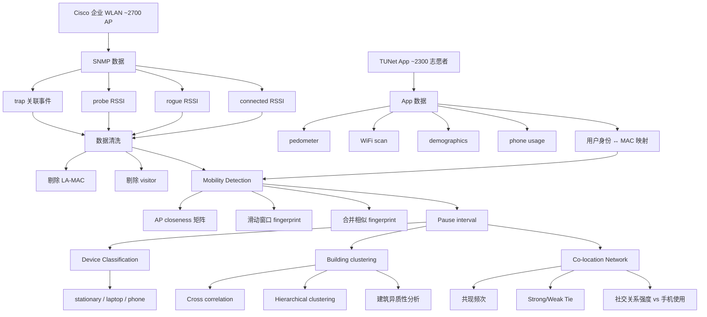
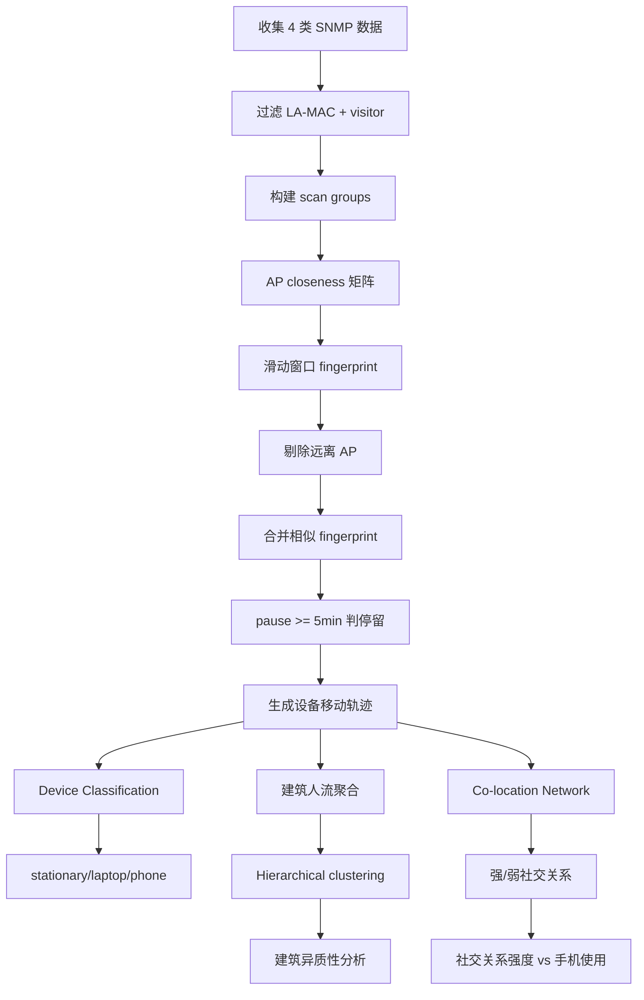

# MobiCamp: a Campus-wide Testbed for Studying Mobile Physical Activities（WPA 2016）

> 作者：Mengyu Zhou, Kaixin Sui, Minghua Ma, Youjian Zhao, Dan Pei, Thomas Moscibroda  
> 机构：清华大学交叉信息研究院；清华大学 TNList；微软亚洲研究院  
> 发表年份：2016  
> 会议/期刊：WPA 2016（Workshop on Physical Analytics, MobiSys 2016）  
> 关联 PDF：同目录下 `wpa16-zhou.pdf`

## 一、文档信息速览

| 字段 | 值 |
|---|---|
| 标题 | MobiCamp: a Campus-wide Testbed for Studying Mobile Physical Activities |
| 作者 | Mengyu Zhou, Kaixin Sui, Minghua Ma, Youjian Zhao, Dan Pei, Thomas Moscibroda |
| 机构 | 清华大学交叉信息研究院；清华大学 TNList；微软亚洲研究院 |
| 发表年份 | 2016 |
| 会议/期刊 | WPA 2016（Workshop on Physical Analytics, MobiSys 2016） |
| 分类 | 移动测量 / 校园 WLAN / 测试平台 |
| 核心问题 | 校园人群移动行为研究缺乏大规模、跨数据源的统一平台；现有工作要么只看 WiFi，要么只看小规模移动 App |
| 主要贡献 | (1) ~2700 AP + ~95000 手机 + ~2300 主动贡献用户的校园级测试平台；(2) 用 4 类 SNMP 数据 + 房间级定位提升移动覆盖率 71%；(3) 把移动轨迹与详细手机 App 数据关联，估计整校人群物理活动；(4) 两个应用：建筑间活动异质性 + 弱社交关系与手机使用相关性 |

## 二、背景（Background）

人们每天大量时间在物理世界中活动、与他人互动。这些活动数据对用户和企业都有巨大价值。校园 WiFi 覆盖率高，是研究人群活动的天然实验场。

既有研究 [15, 22, 14] 主要使用单源数据——要么只看 WiFi（缺乏用户属性与行为细节），要么只看小规模移动 App（缺乏位置广度）。论文认为：把大规模 WiFi 数据与大规模手机 App 数据结合，才能估计"整校人群"的物理活动。这是 MobiCamp 的核心差异化。

论文目标是在清华校园构建 MobiCamp：~2700 AP + ~95000 部智能手机 + ~2300 主动贡献者。论文通过两个应用展示 MobiCamp 的能力：(1) 异质建筑间活动分析；(2) 同位置社交关系强度与手机使用的关系。

论文解决两个核心挑战：

1. **移动轨迹覆盖率**：传统 WiFi 关联数据在设备未连 / 在 rogue AP / 漫游时丢失大量位置信号。论文利用 4 类 SNMP 数据（trap + 三种 RSSI）把"covered minutes"提升 71%。
2. **MAC 地址 ↔ 用户身份映射**：现代 Android/iOS 屏蔽 App 访问 MAC，论文开发 Web API 让 App 通过 SNMP 查询自己 MAC 地址，从而把硬件 ID 与校园账号关联。

## 三、目的（Problems Solved）

- **覆盖不完整**：用 4 类 SNMP 数据（probe / rogue / connected + trap）；
- **室内定位成本高**：基于 AP closeness 的免标注算法；
- **MAC 屏蔽**：Web API 让 App 查询自己 MAC；
- **设备类型分类**：自动识别 stationary / laptop / phone / visitor；
- **跨数据源关联**：把 SNMP 移动轨迹与 App 行为数据关联；
- **应用示例**：建筑异质性 + 弱社交关系与手机使用相关性。

## 四、核心原理（Principles）

**系统总览**：MobiCamp = WLAN 数据 + 手机 App 数据 + 测试平台。WLAN 数据来自 Cisco 企业 AP，11 周收集 209,723 个 MAC 地址；App 数据来自 TUNet（学生开发），~8600 Android + ~6500 iOS，~2300 主动贡献者。论文给出 mobility detection 算法、设备类型分类、应用案例。

**关键概念**：

- **Probe / Rogue / Connected RSSI**：AP 探测请求 / rogue AP / 已连接数据包的 RSSI。
- **SNMP Trap**：AP 关联事件消息。
- **AP Closeness**：两 AP 在同一 scan group 同时出现的频率。
- **Fingerprint**：设备在某位置的 AP + RSSI + 听到时间集合。
- **Mobility Detection**：滑动窗口 + AP closeness 合并相似 fingerprint。
- **Pause Interval**：停留区间。
- **Pause vs Transient**：≥5 分钟 = pause；其他 = transient。
- **Stationary / Laptop / Phone**：根据移动模式分类的设备类型。
- **UA-MAC / LA-MAC**：Universally / Locally Administrated MAC。
- **Visitor**：MAC 出现 < 5 天的设备。
- **Co-location Network**：基于停留重叠的社交网络。
- **Strong / Weak Tie**：基于共现频次的社交关系强度。

**数学原理**：

- **AP Closeness（论文 §3.1）**：

$$
C(\text{AP}_i, \text{AP}_j) = \frac{|\{sg \mid \text{AP}_i \in sg \land \text{AP}_j \in sg \land sg \in SG\}|}{|\{sg \mid \text{AP}_i \in sg \land sg \in SG\}|}
$$

当 C = 0 表示两 AP 几乎不出现在同一 scan group。

- **Fingerprint 相似度判定**：两个 RSSI fingerprint 相似当且仅当"75% 以上的 AP pair 是 close 的"且每对 AP 的 RSSI 波动有限。

- **Device Classification Rules（论文 §3.3）**：
  - Stationary：单位置稳定 ≥7h，超过 60% 的天数。
  - Laptop：有移动但几乎不处于 transient 模式，超过 60% 的天数。
  - Phone：其余。
  - Visitor：出现 < 5 天。

- **Cross Correlation（论文 §4.1）**：

$$
\rho_{XY}(\tau) = \frac{E[(X_t - \mu_X)(Y_{t+\tau} - \mu_Y)]}{\sigma_X \sigma_Y}
$$

- **Hierarchical Clustering**：用 -max(xcorr) 作为距离，complete linkage 聚类建筑。

**与现有技术的差异**：相比 LiveLabs（NUS）[14] 仅用关联事件，MobiCamp 用 trap + 三种 RSSI；相比 StudentLife [22] 等小规模 App 研究，MobiCamp 把大规模 WiFi 与大规模 App 结合。

## 五、算法详解（Algorithm）

1. **输入 / 输出**：
   - 输入：SNMP trap + 三种 RSSI；TUNet App 用户数据。
   - 输出：每设备移动轨迹；建筑聚类；社交关系网络。

2. **核心模块**：
   - **Data Collection on WLANs**：4 类数据并联收集；
   - **MAC Address Spoofing 处理**：剔除 LA-MAC + visitor；
   - **Data Collection on Mobile Apps**：TUNet 收集 pedometer / WiFi scan / connectivity / demographics；
   - **Mobility Detection**：基于 closeness 的免标注算法；
   - **Device Classification**：规则化分类 stationary / laptop / phone；
   - **MobiCamp Applications**：建筑异质性 + 弱关系与手机使用。

3. **伪代码**：

```python
def mobility_detection(device, scan_groups, closeness, window=5*60):
    snapshots = []
    for sg in device.scan_groups:
        snap = [r for r in sg if r.rssi is not None and not far_away(r.ap, current_aps, closeness)]
        if snap:
            snapshots.append(snap)
    merged = merge_similar(snapshots, threshold=0.75)
    intervals = [(s.t_start, s.t_end) for s in merged if s.duration >= 5*60]
    return intervals  # pause intervals

def classify_device(device, mobility):
    if single_location_at_least_7h(device, days_ratio=0.6):
        return 'stationary'
    if never_transient(device, days_ratio=0.6):
        return 'laptop'
    return 'phone'

def building_clustering(buildings, max_lag=30*60):
    sim_matrix = np.zeros((len(buildings), len(buildings)))
    for i, b1 in enumerate(buildings):
        for j, b2 in enumerate(buildings):
            xcorr = cross_correlation(b1.flow, b2.flow, max_lag)
            sim_matrix[i][j] = max(xcorr)
    dist = -sim_matrix
    Z = hierarchy.linkage(dist, method='complete')
    return hierarchy.fcluster(Z, t=...)
```

4. **关键数学**：见 §四。

5. **复杂度分析**：
   - AP closeness：O(|scan_groups| × |AP|²)；
   - Mobility detection：单设备 O(n_snapshots)；
   - Building clustering：O(|buildings|² × |flow_len|)。

6. **训练与推理**：
   - 训练：无监督；
   - 推理：在线实时处理新数据。

7. **示例**：清华校园某学生周五 18:00 在 6Jiao 教学楼 → 21:00 在 ZJ17 宿舍，MobiCamp 通过 probe + connected RSSI 还原整条轨迹。

## 六、系统架构图（Architecture）



## 七、流程图（Process Flow）



## 八、关键创新点（Key Innovations）

- **+ 4 类 SNMP 数据融合**：相比单用关联事件，覆盖时间提升 71%。
- **+ 免标注 mobility detection**：基于 AP closeness，无需 3D 坐标或 fingerprinting。
- **+ MAC ↔ 用户身份映射**：开发 Web API 解决 iOS / Android 屏蔽 MAC 问题。
- **+ 自动设备分类**：规则化区分 stationary / laptop / phone。
- **+ 跨数据源整合**：WLAN 轨迹 + App 行为数据 → 估计整校人群活动。
- **+ 两个真实应用**：建筑异质性 + 社交关系强度分析。

## 九、实验与结果（Experiments）

- **数据集**：清华校园 WLAN 11 周（2015-11 至 2016-01），209,723 个 MAC 地址；TUNet App ~8600 Android + ~6500 iOS；~2300 主动贡献者。
- **AP 规模**：2,786 Cisco 企业 AP，114 栋楼；峰值 ~20,000 同时连接设备；每日独立设备 >60,000。
- **覆盖提升**：相比只用 connectivity + connected RSSI，加入 probe + rogue 后 covered minutes 从 228,039,086 提升到 389,942,434（+71.0%）。Probe 单独贡献 69.3%，rogue 1.7%。
- **设备分类**（论文 Table 2）：209,723 MAC 中 486 是 LA-MAC；非访客 107,290 → 342 stationary + 11575 laptop + 95373 phone；TUNet 手机被误分类为 laptop 仅 1.09%。
- **Mobility detection 验证**：WLAN 数据准确率 84.5%、冲突率 0.73%；手机数据 92.0% / 1.31%（与 5 台设备 30 天手工日志对比）。
- **应用 1：建筑异质性**：ZJ14-18 宿舍 vs ZJ19-23 宿舍区分（PhD vs 留学生）；食堂、教室、宿舍自然聚类。
- **应用 2：弱关系与手机使用**：停留 ≤30s 的短会话中，弱关系用户手机使用更突发（bursty），强关系更均匀。

## 十、应用场景（Use Cases）

- **校园人群流动研究**：清华校园。
- **教室到课率 / 学生行为分析**：教学评估。
- **AP 部署优化**：基于移动模式调整 AP 位置与功率。
- **社交网络分析**：基于共现推断强弱关系。
- **教育测量**：出勤、参与度、专注度的客观评估。
- **后续工作**：论文 §4.3 提到基于移动模式优化 AP 关联（WifiSeer）。

## 十一、相关论文（Related Papers in this set）

- `wpa16-zhou`（本文）
- `purba17-zhou`（基于 MobiCamp 的 WiFi 热点诊断）
- `pch-infocom2017`（WiFi 连接耗时，同作者）
- `issre-stepwise`、`liuping-camera-ready`、`wch_ISSRE-1`、`马明华atc21_JumpStarter`、`vldb20_slowsql`、`TraceSieve_ISSRE23`（同作者团队其他论文）

## 十二、术语表（Glossary）

- **Probe / Rogue / Connected RSSI**：三类 RSSI 测量。
- **SNMP Trap**：AP 关联事件。
- **AP Closeness**：两 AP 在同一 scan group 同时出现频率。
- **Fingerprint**：AP + RSSI + 听到时间集合。
- **Pause Interval**：停留区间。
- **Stationary / Laptop / Phone**：设备类型分类。
- **UA-MAC / LA-MAC**：Universally / Locally Administrated MAC。
- **Co-location Network**：共现网络。
- **Strong / Weak Tie**：强 / 弱社交关系。
- **TUNet**：清华学生开发的校园 WLAN App。
- **lab.mu**：清华学生兴趣小组，开发 MobiCamp 相关 App。

## 十三、参考与延伸阅读

- Paper: LiveLabs（NUS）——大规模 WLAN 测量。
- Paper: StudentLife（Wang et al. 2014）——智能手机测量学生行为。
- Paper: Event Detection（Jayarajah et al. 2015）。
- Paper: Levy walk nature of human mobility（Rhee et al. 2011）。
- Paper: WifiSeer（[20]）。
- 工具：Cisco 企业 WLAN、SNMP、TUNet App。
- 相关论文：`purba17-zhou`、`pch-infocom2017`、`issre-stepwise`、`liuping-camera-ready`、`wch_ISSRE-1`、`马明华atc21_JumpStarter`、`vldb20_slowsql`、`TraceSieve_ISSRE23`。