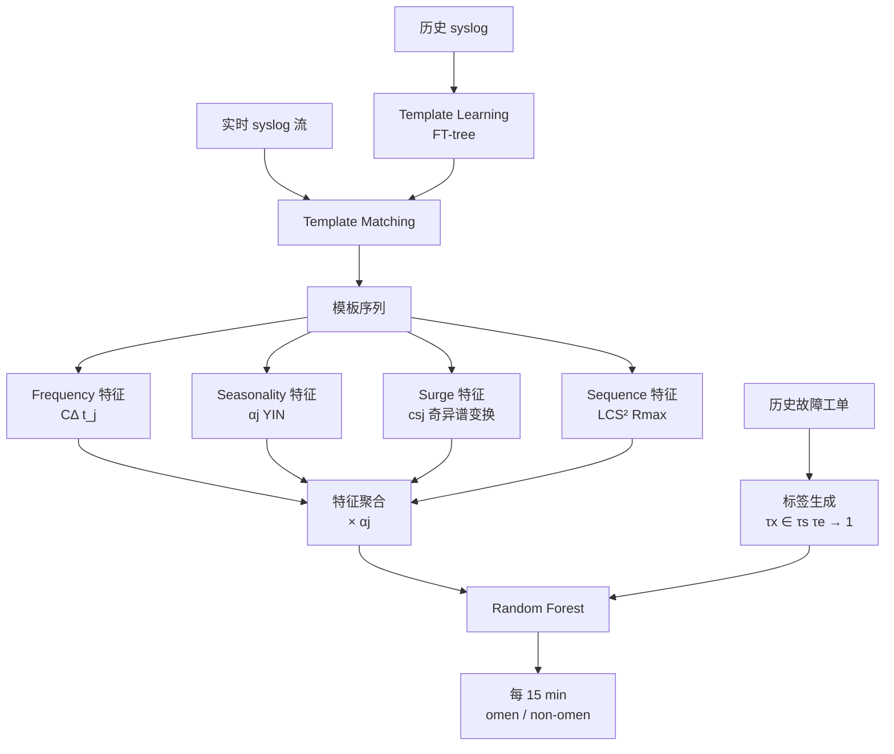
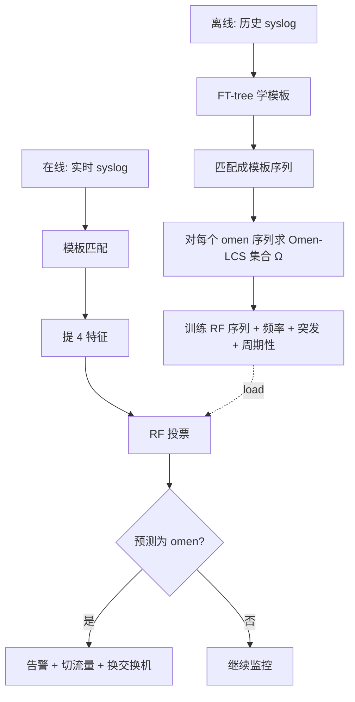

# PreFix: Switch Failure Prediction in Datacenter Networks（SIGMETRICS 2018）

> 作者：Shenglin Zhang, Ying Liu, Weibin Meng, Zhiling Luo, Jiahao Bu, Sen Yang, Peixian Liang, Dan Pei, Jun Xu, Yuzhi Zhang, Yu Chen, Hui Dong, Xianping Qu, Lei Song  
> 机构：清华大学、南开大学、浙江大学、佐治亚理工、圣母大学、百度  
> 发表年份：2018  
> 会议/期刊：Proc. ACM Meas. Anal. Comput. Syst. Vol. 2, No. 1, Article 2 (SIGMETRICS 2018), Irvine, California, USA, June 18-22, 2018  
> 关联 PDF：同目录下 `zhangsl-SIGMETERICS-2018.pdf`

## 一、文档信息速览

| 字段 | 值 |
|---|---|
| 标题 | PreFix: Switch Failure Prediction in Datacenter Networks |
| 作者 | Shenglin Zhang, Ying Liu, Weibin Meng, Zhiling Luo, Jiahao Bu, Sen Yang, Peixian Liang, Dan Pei, Jun Xu, Yuzhi Zhang, Yu Chen, Hui Dong, Xianping Qu, Lei Song |
| 机构 | 清华 / 南开 / 浙大 / Georgia Tech / 圣母 / 百度 |
| 发表年份 | 2018 |
| 会议/期刊 | SIGMETRICS 2018 / Proc. ACM Meas. Anal. Comput. Syst. |
| 分类 | 异常检测 / 故障预测 / 数据中心网络 / 日志分析 |
| 核心问题 | 数据中心交换机硬件故障发生后才被动响应，不能避免性能降级；需在故障发生前若干小时预测出来 |
| 主要贡献 | (1) 提出 PreFix 系统，业界首次面向数据中心交换机的 syslog 故障预测；(2) 提出 LCS²（两折最长公共子序列）作为可去噪的序列特征；(3) 设计四个互补特征：sequence / frequency / surge / seasonality；(4) 在 9397 台交换机 3 个机型 2 年数据上达到 61.81% recall、1.84×10⁻⁵ FPR |

## 二、背景（Background）

现代数据中心规模极大：Microsoft、百度等公司单集群动辄部署**上万台交换机** [22]，涵盖 ToR（Top-of-Rack）、汇聚、核心等不同角色。论文 [19] 的统计显示，**交换机故障占所有网络设备故障的 23%，但贡献了约 74% 的 downtime**。这意味着交换机的稳定性直接决定了数据中心的可用性。

传统容错思路分两类：
1. **协议/拓扑层面**：ECMP、F10 [9, 34, 35]、Rewiring [57] 等，让网络在故障后自动 failover。  
   局限：ToR 交换机通常**没有热备份**，故障后必须人工定位与替换。
2. **故障后诊断**：PacketHistory [23]、NSDI 2014 系列等通过包历史定位故障链路。  
   局限：等到故障发生才查，应用性能已经受损；更糟的是交换机"临死"前会**静默丢包**（silent packet drop），不报日志、不上报，事后极难定位。

**因此业界需要"在故障发生前数小时预测"的能力**。论文灵感来自系统日志挖掘在 ISP 设备 [25, 48, 49]、计算机 [15-17, 33, 47, 71]、虚拟机 [58]、在线广告服务 [51] 等领域的成功先例。

操作员积累了两类关键证据：(a) 交换机日常会产生**海量 syslog**（接口状态、配置同步、line card 插拔、PING 监控、登录操作等）；(b) 历史上真正引发过故障的事件都已被**人工标记**成工单。论文的假设是："**同一型号**的交换机，故障前若干小时的 syslog 序列具有**共同的模式 (omen)**"，只要能自动学到这些模式，就能反过来在线预测。

## 三、目的（Purpose / Problems Solved）

- **痛点 1：syslog 信号噪声极大**。  
  接口 up/down、PING 会话、操作员登录、DDoS 告警、line card 插拔混在一起，"故障前兆"被淹没。  
  解决：模板化 (FT-tree) + LCS² 去噪 + 频次/周期性过滤。

- **痛点 2：样本严重不平衡**。  
  论文数据集中 omen / non-omen 时间窗比例约为 **1 : 72500**。  
  解决：选 Random Forest 抗不平衡；用 frequency/seasonality 主动抑制噪声样本。

- **痛点 3：现有序列方法在 syslog 上失效**。  
  SKSVM [15, 18]（k-spectrum kernel）依赖 token 连续，噪声模板会摧毁特征；HSMM [48] 只看顺序不看频次和突发。  
  解决：提出 LCS²（two-fold LCS），既去噪又保留顺序信号。

- **痛点 4：单点特征不足以区分 omen / non-omen**。  
  解决：四特征融合（sequence + frequency + surge + seasonality），互补短板。

- **痛点 5：end-to-end 深度模型解释性差、样本不够**。  
  每个机型平均只有 585 个 omen 样本、240 维模板空间，DNN 难以收敛。  
  解决：坚持"领域知识驱动的特征工程 + 经典集成学习"。

## 四、核心原理（Principles）

### 4.1 系统总览

PreFix 把"故障预测"形式化为一个**时间窗二分类**问题：把时间轴切成 15 分钟一个时间窗 (bin)，给每个时间窗打上 omen / non-omen 标签，再用 syslog 模板序列的 4 个特征 + 随机森林做分类。整套系统分两段：

- **离线训练**：对历史故障工单，圈出故障前 24 小时窗口；窗口内每个时间窗都是正样本；窗口外是负样本。训练出 RF 模型。
- **在线推理**：每 15 分钟拉一次 syslog，模板化、提 4 特征、喂入 RF，决定该时间窗是否"故障将至"。

### 4.2 关键概念

- **τ_h**：故障实际发生时刻。
- **τ_s, τ_e**：预测窗口起止（论文设 τ_e - τ_s = 24h）。
- **Δτ_a**：操作员反应时间（30 min），即必须在 τ_h - 30 min 之前给出预测。
- **Δτ_m**：模型观察窗口长度（2 h），即用 [τ_x - 2h, τ_x] 的 syslog 序列判断 τ_x 是否 omen。
- **Omen template sequence**：落在预测窗口内的时间窗对应的模板序列。
- **Non-omen template sequence**：落在预测窗口外的时间窗对应的模板序列。
- **LCS² (two-fold LCS)**：先用一组"种子 omen"找出最长公共子序列集合 Ω，再对每条历史 omen 模板序列，把其与 Ω 的最长公共子序列的相似度作为新序列特征。
- **Surge**：用奇异谱变换 (Singular Spectrum Transform) 检测模板计数时间序列上的 level shift / spike。

### 4.3 数学原理

**序列特征 R^k_max**（论文公式 7-9，对应 LCS²）：

$$
\text{LCS}_i^\lambda = \arg\max_{LCS(\tau_i^\lambda, \tau_k)} \frac{|LCS(\tau_i^\lambda, \tau_k)|}{|\tau_i^\lambda|}, \quad
R_k^\lambda = \frac{|LCS(LC S_i^\lambda, \tau_k)|}{|LC S_i^\lambda|}, \quad
R_k^{\max} = \max_\lambda R_k^\lambda
$$

直观：先在训练集中找出 omen 模板序列之间的"公共子序列"（即 Ω），再把新序列与这些公共子序列的 LCS 长度比作为序列特征。**第一折**：从多 omen 序列中提取公共模板（去噪）；**第二折**：新序列与公共子序列再 LCS（去噪同时保留顺序信号）。

**频率特征 C^Δ_k(t_j)**：时间窗 τ_k 内模板 t_j 的归一化计数。

**周期性 α_j**：基于 YIN 算法 [12] 在模板 t_j 的逐 bin 计数上估计基频，越接近整数周期，α_j 越小，权重越低。

**Surge cs^j_k**：对模板 t_j 在 [τ_k - Δτ_m, τ_k] 内分 w 个子窗 (δ=2min)，得到时间序列 C_δ(t_j)，用奇异谱变换计算 change score cs^j_k。

**特征聚合**：

$$
C'_\Delta(t_j) = C_\Delta(t_j) \times \alpha_j, \quad cs'_j = cs_j \times \alpha_j
$$

$$
A = (R, C'_\Delta(1), \dots, C'_\Delta(N), cs'_1, \dots, cs'_N)^\top \in \mathbb{R}^{(2N+1) \times M}
$$

**分类器**：Random Forest，对 2N+1 维特征做 Gini 增益的多棵树投票。

### 4.4 与现有技术的差异

| 方法 | 序列特征 | 频次 | 突发 | 周期性 | 去噪 |
|---|---|---|---|---|---|
| SKSVM [15, 18] | k-spectrum | — | — | — | 弱 |
| HSMM [48] | 隐半马 | — | — | — | 弱 |
| **PreFix** | **LCS²** | 有 | 有 | 有 | **强** |

## 五、算法详解（Algorithm）

### 5.1 输入 / 输出

- **输入**：交换机实时 syslog 流（时间戳、类型、详情字段）；历史故障工单。
- **输出**：每个时间窗 τ_x 是 omen (1) / non-omen (0) 的二分类标签。
- **超参**（论文实验设置）：τ_e - τ_s = 24h, Δτ_m = 2h, Δτ_a = 30min, θ = 5, ξ = 15min, δ = 2min。

### 5.2 核心模块

1. **Template Learning**：FT-tree [44] 自动聚类 syslog 消息结构。
2. **Template Matching**：每条 syslog → 一个模板 ID，得到模板序列。
3. **Feature Extraction**：
   - Sequence (LCS²)
   - Frequency (counts)
   - Surge (singular spectrum transform)
   - Seasonality (YIN)
4. **Feature Aggregation**：用 α_j 加权。
5. **Training**：Random Forest (sklearn) 离线训练。
6. **Online Prediction**：每 ξ=15 min 输出一次分类结果。

### 5.3 伪代码

```python
# 离线训练
def train_prefix(historical_syslogs, failures, model_id):
    # 1) 模板学习
    templates = ft_tree(historical_syslogs)
    seqs = match_to_templates(historical_syslogs, templates)

    # 2) 标注 omen / non-omen 时间窗
    labels = []
    for t, f_h in failures:
        for tau in time_bins(f_h - 24h, f_h - 0.5h):   # [τ_s, τ_e]
            labels.append((tau, 1, seqs_in(tau - 2h, tau)))
        for tau in time_bins(f_h - 7*24h, f_h - 24h):  # 远离故障的负样本
            labels.append((tau, 0, seqs_in(tau - 2h, tau)))

    # 3) 提取 4 个特征
    alpha = seasonality_score(seqs)              # α_j
    R_max = lcs2_score(omen_seqs, target_seq)   # 序列特征
    C     = frequency(seqs)                     # 频率特征
    cs    = surge_change_score(seqs, delta=2)   # 突发特征

    # 4) 周期性加权
    A = np.vstack([R_max, C*alpha, cs*alpha]).T
    y = np.array([l for _, l, _ in labels])

    # 5) 训练 RF
    rf = RandomForestClassifier(n_estimators=100, class_weight='balanced')
    rf.fit(A, y)
    return rf, templates, alpha

# 在线推理
def predict_online(rf, templates, alpha, realtime_syslogs):
    seq = match_to_templates(realtime_syslogs, templates)
    R_max, C, cs = extract_features(seq, alpha)
    A = np.array([R_max, C*alpha, cs*alpha])
    return rf.predict(A)   # 1=omen, 0=non-omen
```

### 5.4 关键数学

- LCS² 的核心是两次 LCS：先 Omen-to-Omen 提取 Ω，再 Sequence-to-Ω 计算相似度。
- 周期性用 YIN [12] 基频估计，α_j 越小，模板越周期性，越不可能预示故障。
- 突发用奇异谱变换在 C_δ(t_j) 上做 change-point 检测。

### 5.5 复杂度分析

- LCS 单次 O(|A|·|B|)，Ω 集合大小受 omen 样本数限制，整体离线可批处理。
- 在线：每 15 min 一条序列，O(|seq|·|Ω|) 可控。
- RF 训练 100 棵树，论文未给具体秒数，但特征维度仅 2N+1 ≈ 600（每机型约 240 模板）。

### 5.6 训练与推理

- **目标**：二分类交叉熵（Gini 等价）。
- **训练样本**：每机型 ~585 个 omen + 数千万个 non-omen。
- **推理流程**：syslog → 模板 → 4 特征 → RF 投票。

### 5.7 示例

论文 Table 2 给出某交换机故障前 18 条 syslog：D1/D7/D13 是 Interface ae1 down；D3/D8/D14 是 vlan-interface down；D4/D9/D16 是 Interface up；D5/D10/D17 是 vlan-interface up——即"接口 flap 反复" 持续 8 分钟。PreFix 学到这种"短时间内 N1-N4 模板按 down-up-down-up 顺序反复出现"就是 omen。

## 六、系统架构图（Architecture）



## 七、流程图（Process Flow）



## 八、关键创新点（Key Innovations）

- **+ LCS² 序列特征**：先 Omen-to-Omen 提公共子序列去噪，再 Sequence-to-Ω 算相似度，比 SKSVM/HSMM 都更能容忍噪声模板。
- **+ 四特征互补设计**：sequence 抓顺序、frequency 抓正常频繁模板、surge 抓突发、seasonality 抓准周期——用 RF 节点纯度评估，4 个特征都贡献 ≥19% 重要性。
- **+ 用 seasonality 主动降权**：把周期性模板的频率和突发都乘以 α_j，让"操作员周期性登录"之类的常态事件不触发告警。
- **+ 适配数据中心场景**：选择 RF 而非 LR/SVM 抗 1:72500 样本不平衡；每个机型独立训练（不同厂商语法不同）。
- **+ 端到端可落地**：从 syslog 到告警，5 个模块化步骤，便于集成到现有运维平台。

## 九、实验与结果（Experiments）

- **数据集**：百度 20+ 数据中心 2 年，9397 台交换机 3 个机型 (M1=2223 台 / 228 故障，M2=3288 / 48，M3=3886 / 139)；模板约 240 个；Omen bin 1273/317/164，Non-omen bin 5.5M / 23M / 0.66M。
- **Baseline**：SKSVM [15, 18]、HSMM [48]。
- **主要指标**：Recall (TPR)、False Positive Ratio (FPR)、MTBFA (Mean Time Between False Alarms)。
- **关键结果数字**（论文 Table 8-9）：
  - **PreFix 平均 Recall 61.81%，FPR 1.84×10⁻⁵**；
  - **MTBFA 8494 天/台**；10,000 交换机/天仅 1.2 次误报；
  - 对比 SKSVM：FPR 1.01×10⁻²，MTBFA 15 天，10K/天 650.2 误报；
  - 对比 HSMM：FPR 1.16×10⁻³，MTBFA 134 天，10K/天 74.3 误报。
- **消融实验**（论文 4.3 节）：
  - 仅 sequence 特征：能抓住顺序但 FPR 较高；
  - 去掉 sequence：FPR 上升、Recall 下降；
  - 加上 surge：Recall 显著提升但 FPR 也上升；
  - **sequence + frequency + seasonality**：FPR 被压住，Recall 也保持。
- **特征重要性**（论文 Table 10）：M1 上 frequency+seasonality 贡献 51.14%、surge+seasonality 26.57%、sequence 22.29%；M3 上 sequence 反而最重 42.81%。
- **效率**：每天 24h 窗口 + 2h 滑动，单台 15 min 计算量极小；论文未给具体秒数。

## 十、应用场景（Use Cases）

1. **公有云/IDC 运营商**：在 ToR 交换机上部署 PreFix 镜像分析 syslog，提前 24h 预测硬件故障。
2. **金融/电信关键交易系统**：把预测结果接入 SDN 控制器，自动把流量从"临死"机柜切到其他机柜。
3. **多厂商混合网络**：每厂商/型号训练一个模型，平台侧统一调度。
4. **故障注入测试**：用 PreFix 的 4 特征 + RF 作为基准，验证新型号上线前是否有可识别的故障前兆。
5. **运维知识库构建**：把"故障前模板序列"作为案例归档，加速新员工培训。

## 十一、相关论文（Related Papers in this set）

- 本批 **issre-stepwise** 与本论文同属日志+故障预测路线，但更侧重"增量 / 步骤式"模型更新，可作补充。
- 本批 **IWQOS_2017_zsl**（Syslog Processing for Switch Failure Diagnosis and Prediction）也是 NetMan 实验室在交换机日志上的工作，方法更偏"故障后诊断"，PreFix 走"故障前预测"。

## 十二、术语表（Glossary）

- **Syslog**：网络设备的结构化/半结构化日志。
- **ToR (Top-of-Rack)**：机柜顶部交换机，直接连服务器。
- **Omen / Omen sequence**：故障前兆时间窗及其 syslog 序列。
- **LCS (Longest Common Subsequence)**：最长公共子序列。
- **LCS² (Two-fold LCS)**：本论文提出的两折 LCS。
- **Surge**：模板频次的突发变化。
- **Seasonality (α)**：周期性强度。
- **FT-tree**：一种自动 syslog 模板学习方法 [44]。
- **YIN**：基频估计算法 [12]。
- **Random Forest (RF)**：集成决策树分类器。
- **MTBFA**：平均误报间隔时间。
- **FPR / Recall**：误报率 / 召回率。

## 十三、参考与延伸阅读

- [15] R.W. Featherstun, E.W. Fulp, "Using Syslog Message Sequences for Predicting Disk Failures", LISA 2010
- [19] P. Gill, N. Jain, N. Nagappan, "Understanding Network Failures in Data Centers", SIGCOMM 2011
- [22] C. Guo et al., "Pingmesh", SIGCOMM 2015
- [44] S. Zhang et al., "Syslog Processing for Switch Failure Diagnosis and Prediction" (即本批 IWQOS_2017_zsl 的姐妹篇)
- [48] F. Salfner, "HSMM-based log prediction"
- [70] FT-tree / Online template extraction (论文作者前作)
- 数据集：https://www.dropbox.com/sh/t2yw2stfnzlecb3/AACCh5sdaMF5RObD708xDcJca
