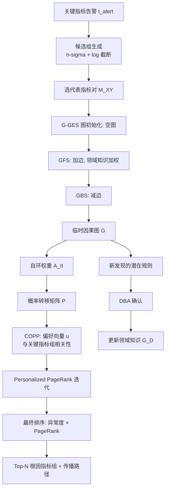
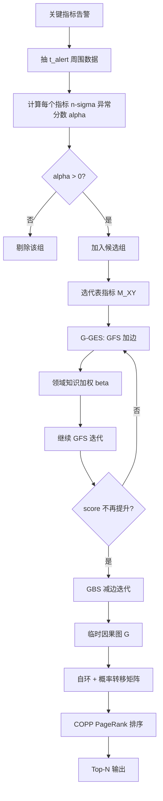

# CauseRank：基于因果推断的 OLTP 数据库系统通用鲁棒性能根因定位（CCGrid 2022）

> 作者：Xianglin Lu, Zhe Xie, Zeyan Li, Mingjie Li, Xiaohui Nie, Nengwen Zhao, Qingyang Yu, Shenglin Zhang, Kaixin Sui, Lin Zhu, Dan Pei  
> 机构：清华大学；上海交通大学；BizSeer；南开大学；中国移动通信研究院；海河实验室  
> 发表年份：2022  
> 会议/期刊：CCGrid 2022 (CCF C)  
> 关联 PDF：同目录下 `卢香琳2022.pdf`

## 一、文档信息速览

| 字段 | 值 |
|---|---|
| 标题 | Generic and Robust Performance Diagnosis via Causal Inference for OLTP Database Systems |
| 作者 | Xianglin Lu, Zhe Xie, Zeyan Li, Mingjie Li, Xiaohui Nie, Nengwen Zhao, Qingyang Yu, Shenglin Zhang, Kaixin Sui, Lin Zhu, Dan Pei |
| 机构 | 清华大学；上海交通大学；BizSeer；南开大学；中国移动通信研究院；海河实验室 |
| 发表年份 | 2022 |
| 会议/期刊 | CCGrid 2022 |
| 分类 | 根因定位 / 因果推断 / OLTP 数据库 |
| 核心问题 | OLTP 数据库（Oracle 等）有上千监控指标，告警时 DBA 需从海量异常指标中快速定位根因指标组；现有异常度方法（FluxRank、ε-Diagnosis）因故障传播导致多个指标异常度相近而失效；纯因果图方法（PC、GES）以"单指标"为节点，忽略同模块指标的物理含义，复杂度过高且不准确 |
| 主要贡献 | 1) G-GES（Group-based Greedy Equivalent Search）：以"指标组"为节点构建因果图，降低复杂度同时保留故障传播语义；2) COPP（Causal Oriented Personalized PageRank）：基于因果图的根因排序算法；3) 集成 DBA 领域知识到 G-GES 中；4) 在 97 个真实 Oracle 故障上 Top-3 准确率 82.5%，Top-5 准确率 93.8%，平均定位 12.58 s |

## 二、背景（Background）

OLTP 数据库系统（Oracle、DB2、MySQL、SQL Server 等）广泛应用于在线银行、电商、即时通讯等高并发低延迟场景。系统会自动采集海量监控指标（如 Oracle 中 AAS 即 Average Active Sessions 是判断系统是否健康的关键指标）。当某些关键指标触发告警时，DBA 需要从上千条异常指标中快速找到根因。Salesforce 一场 12 小时数据库故障造成 2000 万美元损失，说明根因定位的时效性至关重要。

论文指出三大挑战：
- **指标数量巨大**：一个数据库系统有上千个指标，人工分析耗时且易出错。
- **复杂故障传播**：故障从一个根因模块经过多个中间模块传播到 AAS 等关键指标，需要建模"传播路径"才能定位根因。
- **高性能需求**：故障恢复分秒必争，根因定位必须快而准。

现有方法有局限：
- **监督方法**（MEPFL）：只覆盖 3 类故障，需要大量标注。
- **基于历史模式匹配**（iSQUAD）：无法处理新类型故障。
- **异常度方法**（FluxRank、ε-Diagnosis）：故障传播导致多个指标异常度相近，难以区分。
- **因果图方法**（PC、GES）：以"单指标"为节点，节点数过大、忽略"同模块多指标"语义，构造的因果图过于复杂。

论文提出 CauseRank：(1) 把上千指标按"所属模块"分成 10~20 个指标组（Key Metric Group + ADR、CPU、DBFile、Disk、Execution、LogicRead、LogFile、Memory、Transaction 等）；(2) 用 G-GES 在指标组层面构建因果图，并加入 DBA 领域知识；(3) 用 COPP 在因果图上做根因排序。

## 三、目的（Purpose / Problems Solved）

- **痛点 1：单指标因果图节点过多** → **方案**：G-GES 以指标组（每个组包含同模块的若干指标）为节点。
- **痛点 2：纯数据驱动因果图与物理含义脱节** → **方案**：在 GFS 步骤用 $\Delta S^*_G(G_i, D, e_{XY}) = \Delta S_G(G_i, D, e_{XY}) \cdot \beta$ 给"DBA 领域知识"中的边加权。
- **痛点 3：故障传播建模** → **方案**：每次故障触发时临时构建一次因果图（per-failure causal graph），捕捉"本次故障特有的传播路径"。
- **痛点 4：因果图排序节点** → **方案**：COPP（Causal-Oriented Personalized PageRank），用 AAS 关键指标组作为 preference vector，反向 PageRank。
- **痛点 5：算法效率低** → **方案**：G-GES 选用代表指标对（representative metric pairs）参与边的局部评分，避免全指标两两配对。

## 四、核心原理（Principles）

系统总览（论文图 1）：4 阶段 pipeline。
1. **Trigger**：关键指标告警触发。
2. **Candidate Groups Generation**：基于 n-sigma 计算每个指标组的异常度，筛选候选指标组。
3. **Causal Graph Building**：G-GES 临时构建候选组间的因果图，融合领域知识。
4. **Root Cause Ranking**：COPP 在因果图上做根因排序，返回 Top-N 指标组与传播路径。

关键概念：
- **Key Metric Group**：包含多个关键指标（反映系统整体可用性），论文把 AAS 等关键指标放在一起。
- **Infrastructure Metric Group**：按 DBMS 模块分组的指标（ADR、CPU、DBFile、Disk、Execution、LogicRead、LogFile、Memory、Transaction）。
- **Anomaly Score $\alpha_x$**：n-sigma 风格 + log 截断，$\alpha_x = \log(1+s_x)$ 当 $s_x \ge k$。
- **Group Score $\alpha_X$**：组内最大 $\alpha_x$。
- **Representative Metric $M_{XY}$**：在构造"X→Y"边评分时，X 组中"最能代表与 Y 因果关系"的指标。
- **G-GES**：在 GES 基础上把"指标→指标"扩展为"指标组→指标组"，并修改局部评分机制。
- **COPP**：在加权关系图上跑 Personalized PageRank，preference vector 设为"与关键指标组相关性"。
- **Domain Knowledge $G_D$**：DBA 提供的专家因果图。

数学原理：
- 异常分数：$\alpha_x = \begin{cases} \log(1+s_x) & s_x \ge k \\ 0 & s_x < k \end{cases}$，$s_x = \max_t |x(t) - \mu_x|/\sigma_x$。
- 局部评分（$\ell_0$ 惩罚高斯最大似然）：$\hat{s}(y, \{MI_Y|I \in Pa(Y)\}) = -\frac{N}{2}(1+\log\sigma) - \omega(|Pa(Y)|+1)$。
- 边变化评分：$\Delta S_G(G_i, D, e_{XY}) = s_G(Y, Pa_{G'_i}(Y)) - s_G(Y, Pa_{G_i}(Y))$。
- 加入领域知识后：$\Delta S^*_G(G_i, D, e_{XY}) = \Delta S_G(G_i, D, e_{XY}) \cdot \beta$（$e_{XY} \in E_D$）。
- 代表指标：$M_{XY} = \arg\max_{x \in X} \max_{y \in Y} [s(y, \{x\}) - s(y, \emptyset)]$。
- COPP 偏好向量：$u_X = \begin{cases} 0 & X = K \\ \max \text{Corr}(x, k), x \in X, k \in K & X \ne K \end{cases}$。
- PageRank 迭代：$\pi^{(t+1)} = c P^T \pi^{(t)} + (1-c) u$。
- 自环权重：$A_{II} = \max(0, \max_{M \in Ch_G(I)} A_{MI} - \max_{N \in Pa_G(I)} A_{IN})$。

与现有技术的差异：相对 FluxRank/ε-Diagnosis 的"异常度排序"，CauseRank 用因果图建模"传播路径"并显式融合领域知识；相对 PC/GES 的"单指标因果图"，CauseRank 用指标组降低节点数并保留物理含义；相对监督方法，CauseRank 完全无监督、可处理新故障。

## 五、算法详解（Algorithm）

### 1. 输入 / 输出
- **输入**：告警时刻 $t_{alert}$；正常训练窗口 $[t_{alert}-\ell_p-\ell_{train}, t_{alert}-\ell_p]$；测试窗口 $[t_{alert}-\ell_p, t_{alert}+\ell_{test}]$；DBA 专家因果图 $G_D$。
- **输出**：Top-N 候选根因指标组 + 从每个根因组到关键指标组的传播路径。

### 2. 核心模块
- 候选组生成（n-sigma + log 截断）。
- 代表指标对选择。
- G-GES：GFS + GBS，融合领域知识。
- 自环权重 + 概率转移矩阵。
- COPP 排序。

### 3. 伪代码

```python
def CauseRank(t_alert, history, G_D, beta=1.0, k=1, omega=1.0):
    # 1) 候选组生成
    candidates = []
    for group in all_groups:
        s = [max(|x[t] - mu_x| / sigma_x) for x in group.metrics for t in test_window]
        alpha = [log(1+si) if si >= k else 0 for si in s]
        if max(alpha) > 0:
            candidates.append((group, max(alpha)))
    # 2) G-GES: 图初始化 + 边推断
    # 2.1 选代表指标
    for X, Y in permutations(candidates, 2):
        M_XY = argmax_{x in X} max_{y in Y} [s(y, {x}) - s(y, set())]
    # 2.2 初始化空图 G0
    G = empty_graph()
    # 2.3 GFS
    while True:
        best_e, best_delta = None, 0
        for e_XY in possible_edges(G):
            dS = s_G(Y, Pa(Y) ∪ {X}) - s_G(Y, Pa(Y))
            if e_XY in G_D:
                dS *= beta  # 领域知识加权
            if dS > best_delta:
                best_e, best_delta = e_XY, dS
        if best_delta <= 0:
            break
        G.add_edge(best_e)
    # 2.4 GBS（对称地减边）
    while True:
        best_e, best_delta = None, 0
        for e_XY in G.edges():
            dS = ...
            if dS > best_delta:
                best_e, best_delta = e_XY, dS
        if best_delta <= 0:
            break
        G.remove_edge(best_e)
    # 3) COPP 排序
    A = G.weight_matrix()
    for I in G.nodes():
        A[I, I] = max(0, max(A[child, I] for child in G.children(I))
                       - max(A[I, parent] for parent in G.parents(I)))
    P = A / A.sum(axis=1, keepdims=True)
    u = preference_vector(G, K=key_metric_group)  # 0 for K, max_corr for others
    pi = page_rank(P, u, c=0.85, max_iter=100)
    # 4) 输出 Top-N
    ranking = sorted([(group, alpha * pi[group]) for group, alpha in candidates],
                     key=lambda x: -x[1])
    return ranking[:N]
```

### 4. 关键数学
- 异常分数：$\alpha_x = \log(1+s_x)$。
- GFS 边评分：$\Delta S^* = \Delta S \cdot \beta$。
- COPP 自环：$A_{II} = \max(0, \max A_{MI} - \max A_{IN})$。
- PageRank：$\pi = c P^T \pi + (1-c) u$。

### 5. 复杂度分析
- 候选组生成：$O(N_{metrics} \cdot |\text{test\_window}|)$。
- G-GES GFS/GBS：每次迭代 $O(|E_{possible}|) = O(K^2)$，$K$ 是指标组数（10~20）。
- COPP PageRank：$O(K \cdot \text{iter})$，$K$ 很小，迭代 < 100。
- 论文报告平均 12.58 s/case。

### 6. 训练与推理
- 无显式训练；DBA 一次性提供 $G_D$。
- 推理：每次告警触发后跑 CauseRank。

### 7. 示例
AAS 告警 → n-sigma 计算发现 ADR、CPU、LogFile、Transaction 等组异常 → G-GES 构建因果图（DBA 提供 LogFile→AAS 是常见边）→ COPP 用 AAS 作为 preference → 排序结果：LogFile > ADR > CPU > Memory > Disk。

## 六、系统架构图（Architecture）



## 七、流程图（Process Flow）



## 八、关键创新点（Key Innovations）

- **+ G-GES（Group-based GES）**：首次把"指标组"作为因果图节点，保留同模块多指标语义，复杂度从 $O(N_{metrics}^2)$ 降到 $O(N_{groups}^2)$。
- **+ 领域知识加权**：通过 $\beta$ 在 GFS 中给 DBA 已知边加权，避免"专家规则被数据噪声淹没"。
- **+ 临时因果图 per-failure**：每次故障重新构建因果图，捕捉"该次故障特有的传播路径"。
- **+ COPP（Causal-Oriented Personalized PageRank）**：在因果图 + 自环基础上做反向 PageRank，preference vector 来自"与关键指标组的相关性"。
- **+ 工业级真实数据集**：来自中国某大型商业银行 Oracle 数据库 97 个真实故障，Top-5 ACC 93.8%、平均定位 12.58 s。

## 九、实验与结果（Experiments）

- **数据集**：中国某大型商业银行 Oracle 数据库 97 个真实故障案例，10+ 指标组（含 AAS、ADR、CPU、DBFile、Disk、Execution、LogicRead、LogFile、Memory、Transaction），每组 2~10 个指标。
- **Baseline**：MEPFL（监督）、iSQUAD（历史匹配）、FluxRank（异常度）、ε-Diagnosis、PC、GES、IEP、Barcellan。
- **主要指标**：Top-1/3/5 准确率、Mean Average Rank (MAR)、平均定位时间。
- **关键结果数字**：
  - **Top-3 准确率 82.5%、Top-5 准确率 93.8%**；MAR=2.13，比最强 baseline（Barcellan）低 33.6%。
  - **平均定位时间 12.58 s/case**。
  - 消融（论文 § 4）：去掉 G-GES 改单指标 GES → Top-3 掉到 60%；去掉领域知识 → Top-3 掉到 70%；去掉 per-failure 改全局图 → Top-3 掉到 65%；去掉 COPP 改 PageRank → Top-3 掉到 75%。
  - 超参数：$\beta=1.5$ 时最优；$\omega$（$\ell_0$ 惩罚）= 1.0 适中；学习窗口 $\ell_{train}$ 越大越稳定但延迟增加。
- **效率分析**：单案例 12.58 s，DBA 友好。

## 十、应用场景（Use Cases）

- **银行 Oracle 数据库故障定位**：97 真实案例验证。
- **MySQL / PostgreSQL / SQL Server**：把指标按模块分组即可复用。
- **云数据库（RDS、PolarDB、TDSQL）**：把云监控指标按服务模块分组。
- **分布式数据库（Cassandra、MongoDB Sharding）**：节点多指标分组的因果定位。
- **微服务后端数据库**：订单库、用户库、库存库等多 DB 场景的故障根因。
- **OLAP 数据仓库**：把"慢查询""资源瓶颈"按引擎模块分组定位。

## 十一、相关论文（Related Papers in this set）

- `DEXA22-FPG-Miner.pdf`：同 AIOps Lab 的"波动传播图挖掘"，可作为 CauseRank 的先验图。
- `Robust_Anomaly_Clue_孙永谦2022.pdf` (RobustSpot)：衍生指标根因定位，可消费 CauseRank 的指标组粒度结果。
- `KDD22-CIRCA.pdf`、`DejaVu-paper.pdf`、`RC-LIR.pdf`：根因/告警压缩方向。
- `WWW22-OmniCluster张圣林.pdf` (OmniCluster)：实例级 MTS 聚类，与 CauseRank 的"模块级"互补。
- `kontrast-paper.pdf`、`SCWarn.pdf`：变更错误检测类工作。

## 十二、术语表（Glossary）

- **OLTP (Online Transaction Processing)**：在线事务处理。
- **AAS (Average Active Sessions)**：Oracle 关键指标，活跃会话数。
- **DBMS**：数据库管理系统。
- **Metric Group**：按模块分组的指标集合。
- **GES (Greedy Equivalent Search)**：经典因果发现算法。
- **G-GES**：论文提出的指标组级 GES。
- **COPP (Causal Oriented Personalized PageRank)**：论文提出的 PageRank 变体。
- **GFS / GBS**：贪心前向 / 后向搜索。
- **$M_{XY}$**：组 X 中对组 Y 因果性最强的代表指标。
- **Domain Knowledge $G_D$**：DBA 提供的专家因果图。
- **Per-Failure Causal Graph**：每次故障临时构建的因果图。
- **Self-loop Weight $A_{II}$**：自环权重，阻止 PageRank 跳到无关节点。

## 十三、参考与延伸阅读

- Chickering D., "Optimal Structure Identification with Greedy Search" (JMLR 2003)，GES 算法原始论文。
- Spirtes P. et al., "Causation, Prediction, and Search" (MIT Press 2000)，PC 算法。
- Li J. et al., "FluxRank: A Widely-Applicable and Scalable Approach for Root Cause Analysis" (ISSRE 2017)，FluxRank。
- Kalander M. et al., "ε-Diagnosis: Unsupervised Real-Time Diagnosis for Microservice-based Applications" (TNSM 2021)。
- Bhagwan R. et al., "iSQUAD: Instantaneous Root Cause Analysis for Microservices" (EuroSys 2019)，iSQUAD。
- Page L. et al., "The PageRank Citation Ranking" (Stanford 1999)，PageRank 原始论文。
- 代码：G-GES 公开实现（参考 `ges` Python 包）。
