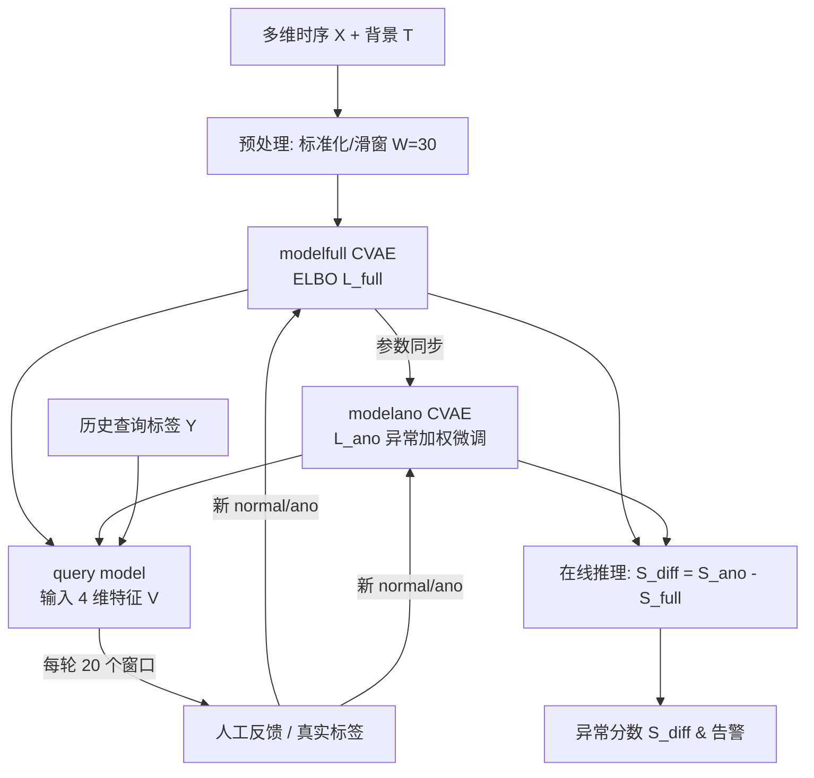
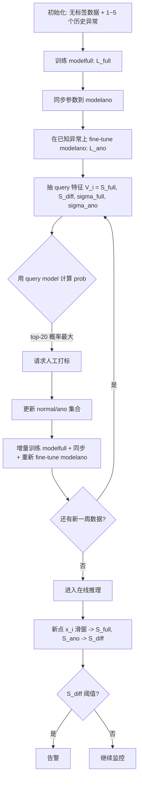

# ACVAE：基于主动学习与对比 VAE 的场景感知多维时序异常检测（JSAC 2022）

> 作者：Zhihan Li, Youjian Zhao, Yitong Geng, Zhanxiang Zhao, Hanzhang Wang, Wenxiao Chen, Huai Jiang, Amber Vaidya, Liangfei Su, Dan Pei  
> 机构：清华大学计算机科学与技术系；eBay Inc.  
> 发表年份：2022  
> 会议/期刊：IEEE Journal on Selected Areas in Communications (JSAC), Vol. 40, No. 9, 系列：Machine Learning for Communications and Networks (CCF A)  
> 关联 PDF：同目录下 `李之涵2022.pdf`

## 一、文档信息速览

| 字段 | 值 |
|---|---|
| 标题 | Situation-Aware Multivariate Time Series Anomaly Detection through Active Learning and Contrast VAE-based Models in Large Distributed Systems |
| 作者 | Zhihan Li, Youjian Zhao, Yitong Geng, Zhanxiang Zhao, Hanzhang Wang, Wenxiao Chen, Huai Jiang, Amber Vaidya, Liangfei Su, Dan Pei |
| 机构 | Department of Computer Science and Technology, Tsinghua University; eBay Inc., San Jose, CA, USA |
| 发表年份 | 2022 |
| 会议/期刊 | IEEE JSAC 2022 (CCF A) |
| 分类 | 多维时序异常检测（半监督 + 主动学习） |
| 核心问题 | 工业大规模分布式系统中无监督异常检测在"场景相关"与"标注昂贵"两大痛点下表现差；如何同时利用"背景信息"与少量"用户反馈"提升检测精度并降低人工成本 |
| 主要贡献 | (1) 首次提出端到端的 ACVAE，将背景与反馈信息共同融入多维时序异常检测；(2) 设计一对"对比 VAE 检测模型"（modelfull/modelano），用差分做异常指标；(3) 提出首个面向 VAE 的查询模型（query model），用主动学习挑选最有用的样本请求人工反馈；(4) 在 eBay 搜索后端的三类真实监控场景中以 3% 标签取得 0.68~0.96 的 range F1，超越最佳 baseline 0.18~0.50 |

## 二、背景（Background）

大规模互联网服务（如搜索引擎、电商、社交网络）后端通常由分布在多个数据中心的成千上万个微服务组成。以 eBay 搜索后端为例，系统每天需要响应来自 1.54 亿全球用户的超过 3 亿次搜索请求。任何明显的搜索延迟、应用错误都可能造成"分钟级"的经济损失与品牌伤害。因此，运维团队会针对每一类监控对象（机器、集群、机房、数据库、链路）持续采集多维时序（Multivariate Time Series, MTS）指标，包括 QPS、CPU、内存、延迟、错误数等。

传统无监督方法（USAD、InterFusion、UAE-GD、GDN、AutoEncoder 等）试图从历史数据中"学出正常模式"，再把偏离最大的样本判为异常。这类方法有两个致命短板：第一，工业系统的"正常"经常随场景而变——批处理、定时任务、代码部署、促销活动都会产生与历史分布显著不同的"数据异常"，但运维人员并不把它们当作事故；第二，工业场景里能拿到的用户反馈极少、噪声大且严重不平衡，无监督模型不可能去主动问"哪些样本你愿意帮我标注"。结果是，无监督方法经常把代码部署的 CPU 尖峰当成 FP、把上游存储故障时"CPU 没有尖峰"当作 FN，告警与人工排查的体验都很差。

ACVAE 的出发点，正是要解决"场景感知"和"主动询问"这两个工业生产里最迫切的问题。

## 三、目的（Purpose / Problems Solved）

- **痛点：场景相关的"正常模式"难以被无监督模型学到** → **方案**：把 timestamp、code deployment flag、promotion flag 等"背景信息"作为条件输入，让 VAE 的先验分布能感知系统状态。
- **痛点：仅学正常模式 → 异常指标不够锐利** → **方案**：用一对"对比" VAE（modelfull 学正常、modelano 在 modelfull 基础上对已知异常做 fine-tune），用二者的重建概率差做异常指标。
- **痛点：异常样本极稀少，反馈获取代价高** → **方案**：引入 query model（带 sigmoid 的小型 MLP），从无标签数据中挑出"对当前检测模型最有价值"（ground-truth 异常、FP、FN）的样本去问人工，3% 标签即可达到接近监督模型的 F1。
- **痛点：异常常常是连续区间，告警越早越好** → **方案**：采用基于 range 的 F1 与 AUPRC，并在推理时使用 30 点的滑动窗口。
- **痛点：在线服务要求毫秒级推断** → **方案**：模型主体是 CVAE，推理只用前向传播 + 蒙特卡洛采样 100 次，单点毫秒级。

## 四、核心原理（Principles）

ACVAE 整体是一对"对比条件 VAE" + 一个"标签查询模型"在主动学习闭环中协同训练。

1. **系统总览**：原始 MTS `x` 和背景信息 `t`（如 timestamp 的 one-hot、code deployment flag）一起送入 modelfull 学习正常模式的 ELBO；modelfull 学完后，把参数同步给 modelano；modelano 进一步在已知异常样本上做 fine-tune。两者对每个新点都输出重建概率 `S_full` 与 `S_ano`，差值 `S_diff = -(S_ano - S_full)` 即异常分数。同时 query model 用检测模型当前输出与历史查询标签，预测"哪些无标签样本最值得问"，每轮选 20 个窗口（query rate ≈ 3%）请求人工打标。

2. **关键概念**：
   - 联合分布 `P(X, T)`：MTS 指标 X 与背景 T。
   - 反馈分布 `Y`：`y_i ∈ {0,1}`，normal/anomaly。
   - Conditional VAE with learnable prior：`p_θ(z_i | z_{i-1}, t_i)`，`q_φ(z_i | z_{i-1}, x_i, t_i)`。
   - 对比检测模型：`modelfull`（normal + unlabeled）、`modelano`（异常微调）。
   - Query model：sigmoid MLP，输出样本被 query 的概率。

3. **数学原理**：

modelfull 的 ELBO：

$$
L^{\text{full}}(x, \theta, \phi) = \mathbb{E}_{q_\phi(z|x,t)} \log p_\theta(x|z,t) - D_{KL}\big(q_\phi(z|x,t)\,\|\,p_\theta(z|t)\big)
$$

其中 KL 项使用 state-space 结构展开为 $\sum_{i=1}^W D_{KL}\big(q_\phi(z_i|z_{i-1}, x_i, t_i)\,\|\,p_\theta(z_i|z_{i-1}, t_i)\big)$，并配合 SGVB + reparameterization 优化。

modelano 的 fine-tune 损失（只对窗口中已知异常点加权）：

$$
L^{\text{ano}}(x, \theta, \phi) = \mathbb{E}_{q_\phi(z|x,t)}\, y^* \log p_\theta(x|z,t) - D_{KL}\big(q_\phi(z|x,t)\,\|\,p_\theta(z|t)\big)
$$

其中 $y_i=1$ 表示该点已知为异常。

异常指标差分：

$$
S^{\text{full}} = \mathbb{E}_{q_\phi^{\text{full}}(z|x,t)} \log p_\theta^{\text{full}}(x|z,t)
$$
$$
S^{\text{ano}} = \mathbb{E}_{q_\phi^{\text{ano}}(z|x,t)} \log p_\theta^{\text{ano}}(x|z,t)
$$
$$
S^{\text{diff}} = -(S^{\text{ano}} - S^{\text{full}})
$$

query model 的损失（ground-truth 异常 + 当前 FP/FN，β=0.25）：

$$
L^{\text{query}} = \text{BCE}(y_g, \text{prob}) + \beta \cdot \text{BCE}(\text{fpfn}, \text{prob})
$$

正常数据增强：`x^{aug} = x^{norm} + \tilde x, \tilde x \sim \mathcal{N}(0, \Delta)`，Δ=0.01，用于强化 modelfull 减少 FP。

4. **与现有技术的差异**：
   - 相对无监督 VAE：增加了"对比模型 + 背景条件"的双重设计，使模型对"数据异常 vs 真实异常"有区分能力。
   - 相对 OoD 检测（如图像领域的 fine-tune OoD）：不依赖离线微调、不要求"纯 normal"训练集，适合在线持续学习。
   - 相对其他半监督方法（DevNet / DeepSAD / meta-AAD）：不挑分类边界附近的样本（避免把 normal 误标为 anomaly），而是用"对当前检测模型最不确定 + 已知最像异常"的双重准则。

## 五、算法详解（Algorithm）

1. **输入 / 输出**
   - 输入：原始 MTS $X \in \mathbb{R}^{M \times N}$，背景信息 $T$，初始异常样本 $x^{init}$、$t^{init}$、$y^{init}$。
   - 输出：每点的异常分数 $S^{diff}$，可设定阈值后输出 0/1 异常判定。

2. **核心模块**
   - 共享的 Conditional VAE（变分 + state-space prior）
   - modelfull（无监督 + 正常样本增强）
   - modelano（modelfull 的微调子集，只对异常点加权）
   - query model（4 维输入特征 + 2 层 tanh + sigmoid）

3. **伪代码**（基于 Algorithm 1 & 2 简化）：

```python
# ACVAE training
xU = X_unlabeled
x_norm = []
x_ano = x_init

# step 1: train modelfull
modelfull = train_cvae(xU, tU)        # optimize L^full

# step 2: init modelano
modelano = copy_params(modelfull)

# step 3: fine-tune modelano on known anomalies
for epoch in range(50):
    modelano = fine_tune(modelano, x_ano, t_ano, y_ano)   # optimize L^ano

# active loop, weekly
for week w:
    Vi = extract_query_features(modelfull, modelano, xU)  # 4-dim
    query_model = train_query_model(Vi[labeled], labels)  # BCE + beta*BCE
    prob = query_model(Vi[xU])                            # sigmoid
    ask = top_k(xU, prob, k=20)                           # 20 windows
    (x_norm_new, y_norm_new), (x_ano_new, y_ano_new) = ask_oracle(ask)
    xU -= ask; x_norm += x_norm_new; x_ano += x_ano_new
    modelfull = incremental_train(modelfull, xU, x_norm, tU, t_norm)
    modelano = copy_params(modelfull)
    modelano = fine_tune(modelano, x_ano, t_ano, y_ano)
```

```python
# ACVAE online inference
for each new point (xi, ti):
    window = (x[i-29:i], t[i-29:i])
    S_full = recon_prob(modelfull, window)
    S_ano  = recon_prob(modelano, window)
    S_diff = -(S_ano - S_full)
    append(S_diff)
# S_diff 越小越异常
```

4. **关键数学**（上文已给出 4 个核心公式）：ELBO、fine-tune loss、S_diff、L_query。

5. **复杂度分析**：
   - 每个 mini-batch 100 个 z 采样的 MC 估计，O(W·D) per step；
   - 训练时按周触发（一次一周数据），推理时单点仅前向传播 + 100 次 MC 采样，可在毫秒级完成；
   - 论文未给出严格复杂度表，主要说明训练频率低（每周一次），推理延迟符合在线监控要求。

6. **训练与推理**：
   - 优化器：Adam；modelfull 初始 lr=1e-3，modelano 微调 lr=1e-4；batch=128；窗口长度 W=30；隐变量维度 CLM=5、其他=4；L2=1e-4；早停；log-std clip 在 [-5, 2] 防止数值爆炸。
   - 主动学习：query rate ≈ 3%，每轮 20 个窗口；query model 用 1~5 个历史故障样本初始化；无可用标签时退化为 greedy + ε-greedy 探索。

7. **示例**（以 GLM 部署 flag 为例）：
   - 群组 G1 的 flag 出现 "code deployment"，其 CPU 时序有显著 spike 但属于"已知正常"；modelfull 对该 spike 给出较高 `S_full`（重建良好），modelano 因未在 G1 部署上做 fine-tune 也给出相近的 `S_ano`，`S_diff ≈ 0` → 不报警；
   - 同时 G2 出现类似 spike 但 flag 显示"未部署"，G2 的 modelano 因学到了 G1 类异常模式而给出更低 `S_ano`（重建失败），`S_diff` 显著为负 → 触发告警；
   - query model 基于"上一周 modelfull 的 S_full 高 + S_diff 接近 0 但人工确认是异常"的样本，调整查询分布，使下一轮优先问这些"难例"。

## 六、系统架构图（Architecture）



## 七、流程图（Process Flow）



## 八、关键创新点（Key Innovations）

- **+ Conditional VAE + learnable prior**：把 timestamp（one-hot 91 维）、部署 flag（real-valued）、促销 flag 等背景信息注入 state-space 先验 `p(z_i|z_{i-1}, t_i)`，让 VAE 能"看见"系统状态。
- **+ 对比检测模型（modelfull / modelano）**：借鉴图像 OoD 检测的"fine-tune 后分布变化"思想，第一次把"异常加权重建损失"引入 MTS 异常检测，差分指标 `S_diff` 比单一重建概率更鲁棒。
- **+ 第一个面向 VAE 的 query model**：以 `(S_full, S_diff, σ_full, σ_ano)` 四维特征为输入，目标是同时查 ground-truth 异常与当前 FP/FN；与传统的"挑分类边界附近样本"显著不同，避免 normal 被反复误标。
- **+ 端到端 active learning 闭环**：训练频率低（一周一次）、query rate 低（3%），最终在 eBay 真实数据上跑出 0.68~0.96 的 range F1，超过 eBay 内部由领域专家设计的 supervised ensemble（Ymir）和 TapNet（监督分类）。
- **+ 在生产环境的成功落地**：已在 eBay 搜索后端生产验证 10+ 月，case study 展示 ACVAE 如何显著减少 FP/FN（典型例子：批处理假阳、缺失尖峰假阴、跨机房相关性假阳）。

## 九、实验与结果（Experiments）

- **数据集**：
  - CLM（Cluster-Level Metrics，6 个月，1 分钟间隔）：含 Mediff 特征，背景信息是 91 维 timestamp one-hot。
  - GLM（Group-Level Metrics，3 个月）：含部署 flag 作为背景信息。
  - DCLM（Data Center Level Metrics，2 个数据集，3 个月）：无背景信息（关注跨机房相关性），主要用来验证纯多维相关性场景。
  - SKAB（公开水循环传感器数据集，1 个 train + 35 test 文件，论文中用于跨域验证）。
  - 训练/测试按时间前 50%/后 50% 切分，ground-truth 来自生产 issue ticket 与运维、业务确认。

- **Baseline**：
  - 无监督：AutoEncoder、Isolation Forest、LSTM-NDT、USAD、InterFusion、UAE-GD、GDN、Ymir（无监督版）。
  - 半监督：meta-AAD、Devnet、DeepSAD（其中 Devnet/DeepSAD 随机选标签以模拟场景；论文同时给出"加背景 + query model"加强版以公平对比）。
  - 监督：TapNet、Ymir（100% 标签）。

- **主要指标**：range-based Precision/Recall/F1（与 [47] 同样的评估方法，奖励"在异常段前 10 个点内被检测"）以及 range-based AUPRC。

- **关键结果数字**（论文 Table III / IV）：
  - 三个 eBay 数据集上，ACVAE 在 range F1 全部 top-1，最佳值 0.68~0.96（取决于数据集难度）。
  - 相比最佳无监督 baseline，平均提升 0.18~0.50（即 23%~289%）。
  - 相比最佳半监督 baseline，提升 3%~42%。
  - 仅 3% 标签时，ACVAE 即可"持平或略胜"（-1.45% ~ +6.69%）于使用 100% 标签的监督 Ymir / TapNet。
  - 公开 SKAB 数据集上同样全面超过所有 baseline。

- **消融实验**（论文 Section IV-F）：
  - 关掉对比模型只用 S_full：F1 明显下降。
  - 关掉 learnable prior / 条件输入：F1 下降，CLM/GLM 比 DCLM 退化更大（验证背景信息贡献）。
  - 关掉 query model（随机选标签）：F1 也下降。
  - query model 各输入特征的消融：`S_full + S_diff` 已是核心，加入 σ 后对不确定样本的捕捉更稳。

- **效率分析**：单点推理在线毫秒级；训练每周一次，增量微调；3% 标签降低大量人工成本。

## 十、应用场景（Use Cases）

- 互联网搜索/电商/广告/视频后端：每分钟上百万的 QPS、延迟、错误率指标，运维需要精准"知道什么时候真的出事"。
- 银行/支付/金融核心系统：对异常容忍度极低，误告警的代价同样巨大。
- 跨机房容灾：多机房同一指标 MTS，DCLM 类场景直接受益。
- 在线推理：每次新点到来只需 30 点窗口 + 100 次 MC 采样，可放进流式告警链路。
- 与告警/工单系统对接：把 `S_diff` 当作告警分数给 AIOps 平台，由人或上游策略系统做二次过滤。

## 十一、相关论文（Related Papers in this set）

- `WWW22-OmniCluster张圣林.pdf`：把 OmniCluster 集群结果喂给 ACVAE，可实现"先聚类再检测"，进一步降低大规模 Web 服务的训练开销。
- `Robust_Anomaly_Clue_孙永谦2022.pdf`：检测出异常后，使用 WARM 框架定位"根因线索"，可与 ACVAE 的告警串联成端到端流水线。
- `KDD22-CIRCA.pdf` / `RC-LIR.pdf` / `卢香琳2022.pdf` / `DejaVu-paper.pdf`：根因分析方向，可消费 ACVAE 给出的"某段时间异常"事件。
- `2022张圣林.pdf` (AnoTransfer)：面向 KPI UTS 的迁移学习方案；ACVAE 处理 MTS，二者可互补。
- `paper-ISSRE21-PUAD.pdf`：PU learning + 主动学习的 KPI 异常检测，与 ACVAE 共享"用少量标签训练"思想，但面向 UTS。

## 十二、术语表（Glossary）

- **MTS (Multivariate Time Series)**：多维时间序列，监控中由多个 KPI 同步采样形成。
- **VAE (Variational AutoEncoder)**：变分自编码器，生成式深度生成模型。
- **CVAE (Conditional VAE)**：条件变分自编码器，把背景信息 y/t 注入 encoder/decoder。
- **state-space prior**：以 `p(z_i|z_{i-1}, t_i)` 形式把时序结构化到潜在变量。
- **ELBO**：证据下界（Evidence Lower Bound），VAE 的优化目标。
- **OoD (Out-of-Distribution) detection**：分布外检测。
- **modelfull / modelano**：ACVAE 中分别学习正常与异常模式的两个 VAE 子模型。
- **S_diff**：异常分数差，负值越大越异常。
- **query model**：用 sigmoid MLP 估计"哪些无标签样本值得人工标注"的概率。
- **range F1 / AUPRC**：区间级评估指标，强调"在异常段早期被检测到"。

## 十三、参考与延伸阅读

- Kim S. et al., "Towards a Rigorous Evaluation of Time-Series Anomaly Detection" (range-based F1 的提出论文 [47])。
- Su Y. et al., "Robust Anomaly Detection for Multivariate Time Series through Stochastic Recurrent Neural Network" (OmniAnomaly, KDD 2019)。
- Audibert J. et al., "USAD: UnSupervised Anomaly Detection on Multivariate Time Series" (KDD 2020)。
- Li Z. et al., "Multivariate Time Series Anomaly Detection and Interpretation using Hierarchical Inter-Metric and Temporal Embedding" (InterFusion, KDD 2021)。
- Ruff L. et al., "A Unifying Review of Deep and Shallow Anomaly Detection"（OoD/异常检测综述，含 fine-tune 思路的源头）。
- 论文代码未直接开源，但与本实验室后续工作（如 InterFusion、OmniCluster）有协同实现，可参考 NetMan AIOps Lab 的公开代码库。
