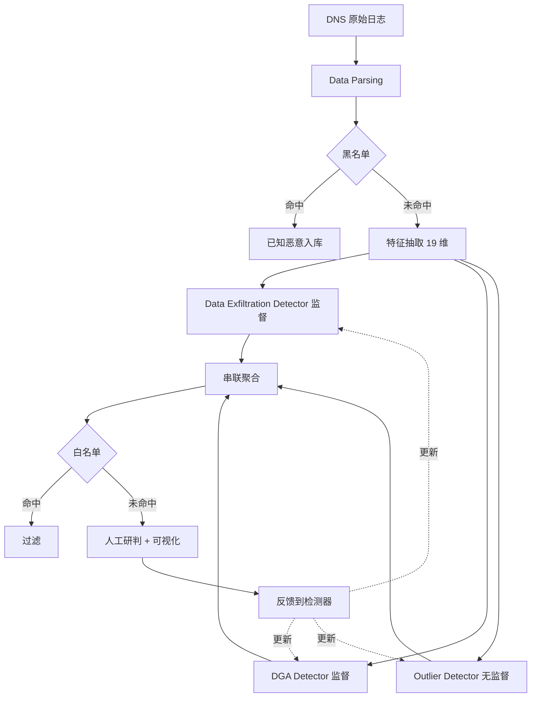
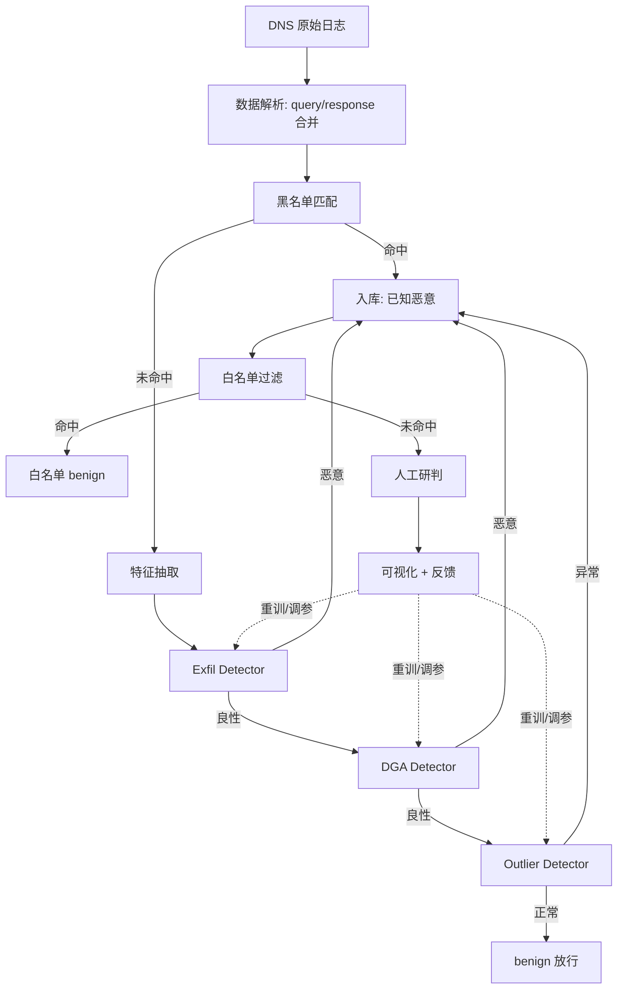

# D²C²：一种基于机器学习的企业级 DNS 隐蔽通信检测框架（SecureComm 2020）

> 作者：Ruming Tang, Cheng Huang, Yanti Zhou, Haoxian Wu, Xianglin Lu, Yongqian Sun, Qi Li, Jinjin Li, Weiyao Huang, Siyuan Sun, Dan Pei  
> 机构：清华大学、BNRist、BizSeer 科技、交通银行、南开大学  
> 发表年份：2020  
> 会议/期刊：SecureComm 2020 (EAI International Conference on Security and Privacy in Communication Networks)  
> 关联 PDF：同目录下 `汤汝鸣securecomm.pdf`

## 一、文档信息速览

| 字段 | 值 |
|---|---|
| 标题 | A Practical Machine Learning-Based Framework to Detect DNS Covert Communication in Enterprises (D²C²) |
| 作者 | Ruming Tang, Cheng Huang, Yanti Zhou, Haoxian Wu, Xianglin Lu, Yongqian Sun, Qi Li, Jinjin Li, Weiyao Huang, Siyuan Sun, Dan Pei |
| 机构 | 清华大学；BNRist；BizSeer；交通银行；南开大学 |
| 发表年份 | 2020 |
| 会议/期刊 | EAI SecureComm 2020 |
| 分类 | 安全 / DNS 隐蔽通信检测 / AIOps |
| 核心问题 | 在大型企业网络流量中检测 DNS 隐蔽信道（数据渗出、C&C、DGA 等） |
| 主要贡献 | 模块化多检测器串联架构；19 维手工特征；监督 + 无监督组合；在日均 1 亿条 DNS 流量上部署验证 |

## 二、背景（Background）

DNS 作为互联网基础设施承担着域名到 IP 的翻译任务，但也因此长期被攻击者滥用。在 DDoS、DNS 欺骗这类"对 DNS 基础设施本身的攻击"之外，还有一类更隐蔽的威胁——DNS 隐蔽通信：攻击者在 DNS 报文（如 NAME 字段、RDATA 字段）里"夹带"自定义载荷或生成算法产生的伪随机域名，从而让内网失陷主机与外部控制端通过 DNS 隧道完成数据渗出或 C&C 通信。论文中给出三组典型示意图：正常 A 查询、数据渗出 `<encoded_credit_cards_information>.evildomain.com`、IRCBot 类 C&C `rohgoruhgsorhugih.nl`。

企业网中所有跨网流量普遍被严格监控，而 DNS 流量却通常"放行"，这就给隐蔽通信留下后门。现实痛点在于：(1) 基于特征码/静态长度阈值的检测极易被绕过；(2) 现有研究多专注于单点（如 DGA 分类、数据渗出识别），无法一体化处理企业面对的多类型威胁；(3) 多数方案仅在合成数据上验证，缺少真实环境的工业部署证据。

论文将该问题分解成 4 类威胁：DNS 基础设施外部攻击（DDoS、Spoofing）、DNS 隐蔽通信（Data Exfiltration、C&C 通信），并进一步将 C&C 通信中最常见的 DGA 单独切分。论文目标明确：把整个 DNS 隐蔽通信检测做成一个可直接在企业落地的端到端框架。

## 三、目的（Purpose / Problems Solved）

- **痛点 1 → 方案 1**：单点检测器（只盯 DGA 或只盯渗出）会漏判未知威胁 → 串联 3 个检测器（Data Exfiltration / DGA / Outlier）实现"已知+未知"全覆盖。
- **痛点 2 → 方案 2**：监督模型随时间漂移、需要重训、容易过时 → 每个检测器都允许灵活替换（RF / SVM / MLP / iForest / X-Means），并支持在线人工反馈调参。
- **痛点 3 → 方案 3**：手工规则维护成本高且易绕过 → 用 19 维结构化+语言学+统计特征（包含 bigram）做机器学习。
- **痛点 4 → 方案 4**：缺乏企业级部署证据 → 在某大型商业银行 2.5 万+ 主机、日均 1 亿条 DNS 流量的真实环境跑通并报出生产指标。

## 四、核心原理（Principles）

D²C² 把整个检测流程切成 3 个阶段：Processing → Detection → Investigation。Detection 阶段是核心，由"黑名单 → 特征抽取 → 威胁检测 → 聚合"四个模块组成。威胁检测模块按串联方式运行：先走两个监督检测器（Data Exfiltration Detector 和 DGA Detector），对剩下的少量"未知可疑样本"再喂给无监督的 Outlier Detector（iForest / X-Means）。所有检测器共 19 维特征，结构特征包括域名长度、子域长度、label 数、最长 label 长度、是否含 IPv4、是否含 WWW 前缀等；语言学特征包括字母表大小、大写比例、数字比例、十六进制比例、元音比例、连续辅音比例、连续数字比例、Shannon 熵、Gibberish 得分（基于 HMM）等；统计特征包含由 Majestic Top Websites 词频构造的 bigram 二元组，通过 PCA 从 200 维压到 15 维。

整个系统被设计成 Human-in-the-Loop：白名单/黑名单由运营工程师维护，检测器输出经过白名单过滤后送人工研判，人工结果作为反馈回流到检测器做阈值/特征调整或重训。这种闭环让系统可以"边用边进化"，避免一次性训练后漂移失效。

检测器在选型上遵循"灵活模块化"原则：Data Exfiltration Detector 与 DGA Detector 都是有监督分类器（RF/SVM/MLP），可以快速召回已知的渗出和 DGA 域名；Outlier Detector 用无监督（iForest/X-Means）来兜底发现未知威胁。每个检测器都是黑箱替换的单元，整套流水线对外保持稳定，这正是论文标题里"A Practical Framework"想强调的工程价值。

数学层面，对二分类监督检测器，给定特征向量 x_i ∈ R^d，RF 决策函数可写成 H(x) = sign(1/T ∑_{t=1}^{T} h_t(x) - 0.5)，MLP 决策函数可写成 f(x) = softmax(W_L · σ(W_{L-1} · … σ(W_1 x + b_1) + b_{L-1}) + b_L)；对 iForest 而言，给定 n 个样本构建 t 棵 iTree，异常分数定义为 s(x, n) = 2^{E(h(x))/c(n)}，其中 E(h(x)) 是 x 在所有 iTree 上的平均路径长度，c(n) 是 n 个样本构造的 BST 的平均路径长度，用于归一化。

## 五、算法详解（Algorithm）

**输入**：DNS 原始日志流（包含 query / response / 时间戳 / client IP / 解析记录）。  
**输出**：每条 DNS 日志的"威胁标签"（exfiltration / DGA / outlier / benign）+ 告警队列。

1. **数据解析（Processing Stage）**：对响应报文只取 response（含 query 镜像），对无响应 query 标注 "no response"。
2. **黑名单过滤**：基于企业自维护列表 + DGArchive + 360 Netlab + 其他威胁情报，过滤已知恶意域名。
3. **特征抽取**：对每条日志计算 19 维特征；bigram 经 PCA 降维 200→15。
4. **威胁检测（Detection Stage）**：
   - Data Exfiltration Detector：监督二分类。
   - DGA Detector：监督二分类。
   - Outlier Detector：iForest 或 X-Means。
   - 串联：前一步判恶意的直接进结果库，判 benign 的送到下一检测器。
5. **白名单过滤**：剔除某些安全厂商主动用 DNS 隧道"探测威胁"产生的良性流量。
6. **人工研判 + 可视化**：生成报告并把人工结果回灌做反馈。

**关键数学**：监督损失 L = -∑ y_i log p(y_i|x_i)；iForest 异常分数 s(x,n) = 2^{E(h(x))/c(n)}。  
**复杂度**：随机森林推理 O(T·log|V|)；iForest 推理 O(n·ψ·t) 其中 ψ 为树深度；X-Means 训练 O(k·n·d) 迭代到收敛。  
**训练与推理**：监督检测器每天/每周用历史标注重训；Outlier 持续滚动更新。

## 六、系统架构图（Architecture）

## 七、流程图（Process Flow）

## 八、关键创新点（Key Innovations）

- **+ 模块化多检测器串联**：监督+无监督组合兜底，"已知+未知"双覆盖。
- **+ 灵活替换的检测器接口**：每个检测器都是可插拔模块，便于在线替换或重训。
- **+ 19 维领域特征集**：结构 + 语言学 + 统计 + bigram（PCA 压缩）的工业级特征工程。
- **+ Human-in-the-Loop 闭环**：人工研判回流做反馈/调参/重训，应对抗数据漂移。
- **+ 真实企业级部署验证**：日均 1 亿条 DNS 流量、5B/月、25k 主机，连续运行报出真实告警。

## 九、实验与结果（Experiments）

**数据集**：
- 标注历史集：76.4 万条带标签的 DNS 日志。
- 真实部署数据：1 个月超过 50 亿条 DNS 日志（25k+ 主机，日均 1 亿条），其中 A 类型占 75.98%、AAAA 占 14.98%、PTR 占 8.30%。

**Baseline / 备选算法**：
- Data Exfiltration Detector：RF / SVM / MLP
- DGA Detector：RF / SVM / MLP
- Outlier Detector：iForest / X-Means

**主要指标**：Precision / Recall / F1 / Accuracy / 处理速度（logs/s）/ 日均 TP/FP。

**关键结果数字（表 4 标注数据）**：
- D-Exfil：RF/MLP/SVM F1 分别 1.0000 / 0.9993 / 0.9997。
- D-DGA：RF F1 0.9682；MLP 0.9471；SVM 0.8793。
- D-Outlier：iForest F1 0.8829；X-Means 0.5965。

**部署结果（表 6 真实流量）**：RF + iForest 组合日均检出 4143.8 TP / 12 FP，平均精度 0.9971；其中 D-Exfil（RF）日均 155.6 TP/3.9 FP；D-DGA（RF）日均 3958.9 TP/5.6 FP；D-Outlier（iForest）日均 29.3 TP/2.5 FP。

**处理速度（表 5）**：RF 49,344.9 logs/s、MLP 9,210.2 logs/s、SVM 24,150.2 logs/s、iForest 9,149.0 logs/s、X-Means 4,090.6 logs/s。

**消融 / 反馈**：人工反馈在生产里持续触发检测器参数更新；论文未给出正式消融表，但通过替换算法证实了模块化设计对召回/精度的提升。

## 十、应用场景（Use Cases）

- 大型企业 / 银行 / 政府机构的 DNS 出口流量监控。
- 数据防泄漏（DLP）：发现"通过 DNS 隧道外传敏感数据"。
- 内部失陷主机定位：揪出 C&C 通信的内部 IP。
- 与威胁情报平台联动：实时更新黑名单/白名单。
- 多分支机构统一 SOC 平台。
- 安全运营自动化：把 RF/MLP/iForest 包装为可热插拔的微服务。

## 十一、相关论文（Related Papers in this set）

- 本批 `08674537` 论文虽属隐私保护方向，但同属 NetMan 团队，可与本论文的"流量安全"主题形成对照。
- 论文中的 RF / iForest / X-Means 选型可与同期 `chenwenxiao_infocom2019`（基于 VAE 异常检测）的"异常检测"思路对比。

## 十二、术语表（Glossary）

- **DNS 隐蔽通信（Covert Communication）**：通过 DNS 报文携带"非 DNS 用途"信息的隐蔽信道。
- **数据渗出（Data Exfiltration）**：把内网敏感信息编码进 DNS 子域名/响应字段外传。
- **C&C（Command and Control）**：失陷主机与外部控制端的双向指令通道。
- **DGA（Domain Generation Algorithm）**：周期性产生大量伪随机域名的算法，用于规避黑名单。
- **iForest（Isolation Forest）**：基于"异常样本更易被孤立树分离"的无监督异常检测方法。
- **X-Means**：K-means 的改进，能自动选择聚类数 k。
- **NXDomain**：查询不存在域名的响应，常用于 DGA 检测。
- **Gibberish Score**：基于 HMM 的字符串"可读性"打分。

## 十三、参考与延伸阅读

- Antonakakis et al., "Detecting Malware Domains at the Upper DNS Hierarchy", USENIX Security 2012.
- Schüppen et al., "FANCI: Feature-based Automated NXDomain Classification and Intelligence", USENIX Security 2018.
- Ahmed et al., "An Automated Approach to DNS Covert Channel Detection Using Isolation Forest", 2017.
- Tong et al., "D³N: Detection of DGA-based botnet using CNN", 2018.
- Liu, Ting, "Isolation Forest", ICDM 2008.
- 数据集与威胁情报：DGArchive、360 Netlab Opendata、Majestic Top Websites。
