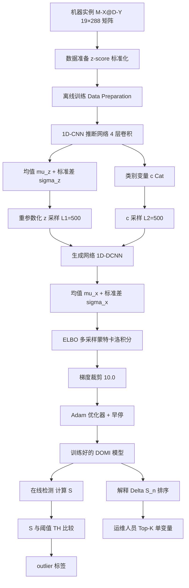
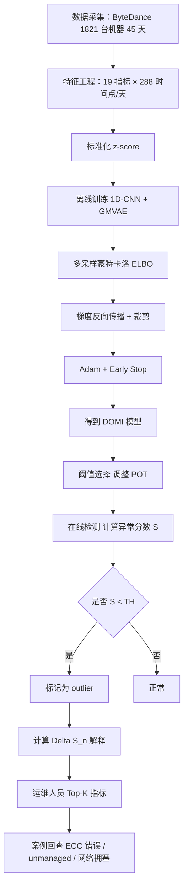

# DOMI: Detecting Outlier Machine Instances Through Gaussian Mixture Variational Autoencoder With One Dimensional CNN（IEEE TC 2021/2022）

> 作者：Ya Su, Youjian Zhao, Ming Sun, Shenglin Zhang (Member, IEEE), Xidao Wen, Yongsu Zhang, Xian Liu, Xiaozhou Liu, Junliang Tang, Wenfei Wu (Member, IEEE), Dan Pei (Senior Member, IEEE)
> 机构：清华大学；北京国家信息科学与技术研究中心（BNRist）；南开大学；字节跳动 ByteDance
> 发表年份：2021（在线发布 2021-03-09），IEEE TC Vol. 71, No. 4（2022-04）
> 会议/期刊：IEEE Transactions on Computers
> 关联 PDF：同目录下 `苏亚2021.pdf`

## 一、文档信息速览

| 字段 | 值 |
|---|---|
| 标题 | Detecting Outlier Machine Instances Through Gaussian Mixture Variational Autoencoder With One Dimensional CNN（DOMI） |
| 作者 | Ya Su, Youjian Zhao, Ming Sun, Shenglin Zhang, Xidao Wen, Yongsu Zhang, Xian Liu, Xiaozhou Liu, Junliang Tang, Wenfei Wu, Dan Pei |
| 机构 | 清华大学 CS；BNRist；南开大学；字节跳动 |
| 发表年份 | 2021（在线） / 2022（卷期） |
| 会议/期刊 | IEEE Transactions on Computers, Vol. 71, No. 4, April 2022 |
| 分类 | 无监督多元时间序列异常检测 / 机器实例异常识别 / 1D-CNN + GMVAE |
| 核心问题 | 大型数据中心中 5%–18% 的机器每年会出现软硬件故障；如何在无标签、多形状、高维度多元时间序列上无监督地检测机器实例的长期异常 |
| 19 个监控指标 | 7 CPU 相关 + 1 内存 + 2 VM + 5 TCP + 4 网络（每 5 分钟采样，一天 288 个点） |
| 数据集 | ByteDance 1821 台机器，45 天，81945 个机器实例（每个 19×288） |
| 主要贡献 | (1) 形式化定义"机器实例异常检测"问题；(2) 1D-CNN × GMVAE 端到端模型；(3) 多样本蒙特卡洛积分近似；(4) 基于单变量重建概率变化的解释方法 |
| 关键结果 | F1-Score 0.94、AUC 0.99；解释准确率最高 0.93；部署 ByteDance 19 个数据中心 90000+ 台机器 |
| GitHub | https://github.com/TsingHuasuya/DOMI_code 与 /DOMI_dataset |

## 二、背景（Background）

现代大型数据中心通常部署数十万到数百万台机器（物理服务器、虚拟机、Docker 等）以支撑多样化的互联网服务 [1]，[2]。每年约 5%–18% 的这些机器会因软件 bug 和/或硬件故障而出现异常 [3]。机器的意外故障可能导致数据丢失和资源拥塞 [3]，严重降低服务质量（QoS）并减少收入 [4]。

因此，运维工程师会仔细监控各种机器指标，如 CPU idle、内存利用率、TCP 重传率等，以获取每台机器状态的全局视图 [5]。每个指标形成一个单变量时间序列，因此每台机器可以表示为具有多元时间序列的实体 [6]，[7]。

多年来已有很多异常检测工作：单变量时间序列异常检测 [8]–[12]、多元时间序列异常检测 [5]，[6]，[13]–[17]。然而这些方法检测的是"时间戳"上的点异常。在云系统中由于自恢复和负载均衡机制，单个时间点的机器异常未必导致机器/服务故障 [7]。

更重要的是，检测"长期偏离正常行为的机器实例"（outlier machine instances），即形态偏离多数的机器实例，可以帮助运维工程师找到更可能导致机器/服务故障的异常机器。

例如在 ByteDance 4 个数据中心里，每个数据中心都有一组服务多种业务、形态多样的机器实例；正常机器实例（占多数）形成的"正常模式"是稳定的；偏离这些模式的机器实例应当被检出。

## 三、目的（Problems Solved）

机器实例异常检测面临四大主要挑战：

1. **多元时间序列的多个类别和多种形态**：数据中心通常支持多种服务类型，因此有多种指标类别。设计一种通用算法应用于多种形态的多元时间序列既理想又有挑战 [20]；
2. **多元时间序列的高维度**：M-X@D-Y 是一个 $T \times N$ 矩阵，维度可达 1,000–100,000。维数灾难会极大降低方法性能 [21]，[22]；
3. **异常机器实例需要可解释性**：可解释性有助于分析异常实例并促进故障排查 [5]；
4. **标签缺失**：典型的带标签的异常机器实例稀缺，因为运维工程师对大量实例打标签既费力又耗时 [5]。

DOMI 旨在解决上述挑战。

## 四、核心原理（Principles）

**系统总览**：DOMI 是一个端到端的基于重建的模型。它在离线训练阶段捕获机器实例的正常模式，在线检测阶段使用重建概率作为异常分数。

**关键概念**：

- **机器实例（M-X@D-Y）**：一台机器在一天内的 1-day-long 多元时间序列 $x = \{x^1, x^2, \ldots, x^N\}$，其中 $x^n = \{x^n_{Y-T}, x^n_{Y-T+1}, \ldots, x^n_{Y-1+T-1}\}$ 是第 $n$ 个指标的单变量时间序列；$x^n_t \in R$ 是第 $n$ 个指标在 $t$ 时刻的测量值。
- **M = (X, D, Y) 三元组**：每条 trace 是 1 天×N 指标的多变量时间序列，记作 (machine, day, all metrics)。
- **19 个指标、5 类**：7 CPU + 1 内存 + 2 VM（pgfault / pgmajfault）+ 5 TCP（attempt fails、retransmission rate、listen drops、insegs、outsegs）+ 4 网络（RX/TX bytes、RX/TX packets）。
- **采样间隔**：5 分钟；T = 288。
- **异常比例**：训练集 0.19、测试集 0.22。
- **outlier 阈值**：调整后的 POT 方法（Extreme Value Theory 第二定理）。
- **解释**：基于单变量重建概率变化 $\Delta S_n$ 排序贡献。
- **DOMI（Detecting Outlier Machine Instances）**：1D-CNN + GMVAE 端到端无监督模型。
- **GMVAE（Gaussian Mixture VAE）**：用高斯混合分布作为 $z$ 的先验。
- **1D-CNN**：1 维卷积核，仅在时间维度移动。
- **ELBO（Evidence Lower Bound）**：DOMI 通过最大化 ELBO 训练。
- **VIMCO（Variational Inference for Monte Carlo Objectives）**：用于离散隐变量 $c$。
- **多采样蒙特卡洛积分**：代替单采样估计，提升训练稳定性。
- **$L_1$（z 采样量）和 $L_2$（c 采样量）**：本实验中均为 500。
- **FOCUS、Opprentice 等**：相关 KPI 异常检测工作。

**网络架构（图 4）**：

DOMI 包含推断网络 $q_\phi(z, c|x)$ 和生成网络 $p_\theta(x, z, c)$。

推断网络公式（论文 Eq. 2）：

$$
e_1 = \text{Elu}(w_{e_1} \circledast x + b_{e_1}) \quad (2a)
$$

$$
e_k = \text{Elu}(w_{e_k} \circledast e_{k-1} + b_{e_k}) \quad (2b)
$$

$$
\mu_z = w_{\mu_z} e_k + b_{\mu_z} \quad (2c)
$$

$$
\sigma_z = \text{Elu}(w_{\sigma_z} e_k + b_{\sigma_z}) + \varepsilon_{\sigma_z} \quad (2d)
$$

$$
c = \text{Cat}(w_{c} e_k + b_{c}) \quad (2e)
$$

生成网络公式（论文 Eq. 3）：

$$
z \sim N(\mu_z(c), \sigma^2_z(c)), \quad c \sim \text{Cat}(p) \quad (3a)
$$

$$
d_1 = \text{Elu}(w_{d_1} \otimes z + b_{d_1}) \quad (3b)
$$

$$
d_k = \text{Elu}(w_{d_k} \otimes d_{k-1} + b_{d_k}) \quad (3c)
$$

$$
\mu_x = w_{mx} d_k + b_{mx} \quad (3d)
$$

$$
\sigma_x = \text{Elu}(w_{\sigma_x} d_k + b_{\sigma_x}) + \varepsilon_{\sigma_x} \quad (3e)
$$

**ELBO**（论文 Eq. 4）：

$$
L(x) = E_{q_\phi(z, c|x)} \log \frac{p_u(c)}{q_f(c|x)} + E_{q_\phi(z, c|x)} \log \frac{p_u(z|c)}{q_\phi(z|x)} + E_{q_\phi(z, c|x)} \log p_\theta(x|z)
$$

**多采样蒙特卡洛积分近似 ELBO**（论文 Eq. 5）：

$$
L(x) \approx \frac{1}{L_1 L_2} \sum_{l_1=1}^{L_1} \sum_{l_2=1}^{L_2} \log \frac{p_u(c^{(l_2)})}{q_f(c^{(l_2)}|x)} + \log \frac{p_u(z^{(l_1)}|c^{(l_2)})}{q_\phi(z^{(l_1)}|x)} + \log(p_\theta(x|z^{(l_1)}))
$$

**异常分数**：

$$
S = E_{q_\phi(z,c|x)} \log p_\theta(x|z)
$$

分数越低，越可能是异常。

**$\Delta S_n$ 解释**：

$$
\Delta S_n = S_n - \bar{S}_n
$$

把每个 $x^n$ 的 $\Delta S_n$ 按升序排列即得贡献列表 $\Delta S$，排名越靠前贡献越大。

**与现有技术的差异**：与 Donut [8] 简单高斯先验的 VAE 相比，DOMI 用 GMVAE 多模态先验；与 OmniAnomaly [5] 用 RNN 相比，DOMI 用 1D-CNN 提取形状特征；与 DAGMM [21]、MSCRED [7] 相比，DOMI 是端到端模型、形状特征提取更适合时间序列。

## 五、算法详解（Algorithm）

**输入 / 输出**：

- 输入：机器实例多元时间序列 $x \in R^{T \times N}$，超参数；
- 输出：异常分数 $S$、异常标签（$S$ 与阈值 $TH$ 比较）、单变量解释列表 $\Delta S$。

**核心模块**：

1. **数据准备**：用 z-score 标准化机器实例。
2. **离线训练**：
   - **1D-CNN 推断网络**：用 4 层 1D-CNN 提取形状特征，密集层输出 $\mu_z, \sigma_z$ 和 $c$；
   - **GMVAE 训练**：最大化 ELBO；
   - **多采样蒙特卡洛积分**：用 $L_1 = L_2 = 500$ 采样；
   - **梯度裁剪**：限制 10.0；
   - **早停**：避免过拟合。
3. **阈值选择**：用调整后的 POT 自动选择 $TH$。
4. **在线检测**：计算 $S$，$S < TH$ 视为异常。
5. **可解释性**：计算 $\Delta S_n = S_n - \bar{S}_n$ 并排序。

**伪代码**：

```python
def domi_train(train_set, dim_z=10, num_components=4, L1=500, L2=500, epochs=10, batch=32):
    """离线训练 DOMI 模型"""
    model = DOMI(dim_z=dim_z, num_components=num_components)
    for epoch in range(epochs):
        for x in train_loader(train_set, batch_size=batch):
            z_samples = [model.encode(x) for _ in range(L1)]
            c_samples = [model.sample_c(x) for _ in range(L2)]
            loss = monte_carlo_elbo(x, z_samples, c_samples, model)  # 多采样近似
            loss.backward()
            clip_grad_norm_(model.parameters(), max_norm=10.0)
            optimizer.step()
        early_stop_check(val_loss)
    return model


def domi_detect(model, x, threshold_TH):
    """在线检测"""
    z = model.encode(x)
    c = model.sample_c(x)
    recon_log_prob = model.recon_log_prob(x, z, c)
    S = recon_log_prob.mean()  # 异常分数
    is_outlier = int(S < threshold_TH)
    return is_outlier, S


def domi_interpret(model, x, train_set):
    """基于单变量重建概率变化的解释"""
    expected_scores = compute_expected_univariate_scores(model, train_set)
    delta_S = []
    for n in range(x.shape[1]):
        x_n_masked = mask_univariate(x, n)
        S_n = model.recon_log_prob(x_n_masked, model.encode(x_n_masked), model.sample_c(x_n_masked))
        delta_S.append(S_n - expected_scores[n])
    return sorted(range(len(delta_S)), key=lambda i: delta_S[i])
```

**关键数学**：见 §四。

**复杂度分析**：

- 时间复杂度 $O(mn)$，$m$ 是训练 epoch 数，$n$ 是实例数；
- 训练：CPU 服务器每 step 0.0892s，GPU 0.0370s；每 epoch 约 1500 steps；
- 完整训练 10 epochs < 半小时；
- 推理：CPU 2.7ms/实例，GPU 1.1ms/实例（10,000 机器实例可在 30 秒内处理完）；
- 数据预处理约 3.1ms/实例。

**训练与推理超参数**：

- 1D-CNN/1D-DCNN 4 层；kernel size {12×1, 12×1, 6×1, 6×1}；stride {4×1, 4×1, 3×1, 3×1}；
- L2 正则 $10^{-4}$；
- z 维度 = 10，c 分量数 = 4；
- $\varepsilon = 10^{-10}$；
- $L_1 = L_2 = 500$；
- 调整 POT low quantile = 0.2，q = $10^{-4}$；
- Adam 优化器，初始学习率 $10^{-3}$，每 5 epoch ×0.5；
- 90% 训练集 / 10% 验证集；10 epochs，early stop；
- batch size = 32。

**示例**：电商订单追踪机器 M-1@D-1 与正常机器形态类似但有 1 天的异常形态（软件 bug/硬件故障），M-2@D-3 形态规则但与正常机器不一致（运行了未预期任务），M-4@D-1 形态不规则（unmanaged）；DOMI 都能检出。Case A：13-March-2020 M-A 异常分数 -90.82（其他机器 150-200），$\Delta S$ 排名 CPU wio、CPU sintr、CPU idle、Memory util、CPU ctxt（与底层 ECC 内存错误吻合）；Case B：12-March-2020 M-B 异常分数 -585.21（unmanaged）；Case C：18-June-2020 M-C 异常分数 -81.32（TCP/网络异常，与交换机网络拥塞吻合）。

## 六、系统架构图（Architecture）



## 七、流程图（Process Flow）



## 八、关键创新点（Key Innovations）

- **+ 1D-CNN 提取多元时间序列的形状特征**：相对 2D-CNN 复杂度更低，更适合无强相关性的多指标时间序列；
- **+ GMVAE 高斯混合先验**：比简单高斯先验（Donut）能更好地建模多模态分布；
- **+ 多样本蒙特卡洛积分近似 ELBO**：比单采样估计更可靠、更稳定；
- **+ 端到端模型**：把降维和模式学习联合训练，避免两阶段模型（GMM/PCA）信息损失；
- **+ 基于单变量重建概率变化的解释**：比原始分数更鲁棒，可推广到其他 VAE 模型（Donut、OmniAnomaly）；
- **+ 真实工业部署**：在 ByteDance 19 个数据中心 90,000+ 台机器上部署，日均检测 450 个异常机器实例，精度 0.91。

## 九、实验与结果（Experiments）

- **数据集**：ByteDance 1821 台机器 × 45 天 = 81945 个 19×288 机器实例；训练 30 天 + 测试 15 天；
- **训练/测试异常率**：0.19 / 0.22；
- **Baseline**：Donut、OmniAnomaly、DAGMM、MSCRED、GMM、GMM+PCA、MDDTW+DBSCAN、DCN、IForest、IForest+PCA、OCSVM、OCSVM+PCA；
- **评估指标**：Precision、Recall、F1best、AUC；
- **关键结果（Table 2）**：
  - DOMI：P=0.9378、R=0.9418、F1best=0.9398、AUC=0.9921；
  - 最佳 baseline：MDDTW+DBSCAN F1best=0.8542、IForest+PCA 等；
  - DOMI 比最佳 baseline 高 0.08 F1、0.03 AUC；
  - DOMI TP=5726、FP=380、FN=354、TN=20855；
- **消融实验（Table 3）**：
  - 去掉 GM：F1=0.9192，AUC=0.9829；
  - 去掉多采样：F1=0.9184，AUC=0.9826；
  - 去掉 1D（用 2D）：F1=0.8954，AUC=0.9786；
  - 去掉 CNN（用全连接）：F1=0.8809，AUC=0.9753；
  - 1D-CNN → 注意力 RNN：F1=0.8858，AUC=0.9760；
- **解释准确率（Table 4）**：HitRate@100% 0.8953、HitRate@120% 0.9302；优于 Donut 与 OmniAnomaly；
- **效率（Table 5）**：训练每 step CPU 0.0892s / GPU 0.0370s；训练每 epoch CPU 137.2s / GPU 57.8s；测试每实例 CPU 2.7ms / GPU 1.1ms；
- **超参数敏感度（图 7）**：z 维度 3+ 稳定，c 分量 3+ 稳定，epochs 7+ 稳定；
- **z 空间可视化（图 9）**：DOMI 的 z 分布比"无 GM"更复杂，能建模多模态；
- **部署**：在 19 个数据中心 90,000+ 台机器上部署 4 个多月，日均检测 450 个异常机器实例，精度 0.91；
- **三个真实案例**：Case A（M-A 13-Mar-2020 异常分数 -90.82、ECC 内存错误）、Case B（M-B 12-Mar-2020 异常分数 -585.21、unmanaged）、Case C（M-C 18-Jun-2020 异常分数 -81.32、交换机网络拥塞）。

## 十、应用场景（Use Cases）

- **数据中心机器实例异常检测**：识别硬件故障、unmanaged 机器、配置错误；
- **电商订单机器异常检测**：Case A 真实案例；
- **内存错误早期发现**：通过 $\Delta S$ 定位 ECC 内存错误；
- **网络拥塞检测**：通过 TCP/网络指标 $\Delta S$ 定位网络问题；
- **未监管机器发现**：检测被遗忘的、无人管理的机器；
- **机器人多传感器故障检测**：论文提到未来可推广；
- **健康监测**：未来可应用于生物医学信号监控。

## 十一、相关论文（Related Papers in this set）

- `TraceSieve_ISSRE23`（追踪异常检测）
- `刘平issre`（微服务追踪异常检测 TraceAnomaly）
- `Chain-of-Event_Interpretable-Root-Cause-Analysis-for-MicroservicesFSE24-Camera-Ready`
- `AlertRCA_CCGRID2024_CameraReady`
- `TSC23-DiagFusion`
- `CMDiagnostor`
- `OmniAnomaly`（KDD 2019）
- `Donut`（WWW 2018）
- `MSCRED`（AAAI 2019）
- `DAGMM`（ICLR 2018）

## 十二、术语表（Glossary）

- **Machine Instance（M-X@D-Y）**：一台机器在一天内的 1-day 多元时间序列；
- **Multivariate Time Series（MTS）**：多元时间序列；
- **DOMI**：Detecting Outlier Machine Instances；
- **GMVAE**：Gaussian Mixture Variational Autoencoder；
- **1D-CNN**：1-Dimensional Convolutional Neural Network；
- **1D-DCNN**：1-Dimensional Deconvolutional Neural Network；
- **ELBO**：Evidence Lower Bound；
- **VIMCO**：Variational Inference for Monte Carlo Objectives；
- **POT**：Peaks-Over-Threshold（极值理论第二定理）；
- **AUC**：Area Under the ROC Curve；
- **F1best**：最佳 F1-Score（最佳阈值下）；
- **TP / FP / TN / FN**：True/False Positive/Negative；
- **Reconstruction Probability**：重建概率 $p_\theta(x|z)$；
- **ΔS**：单变量重建概率变化；
- **ECN**：Explicit Congestion Notification；
- **YGC / FGC**：Young/Full Garbage Collection（JVM）；
- **DSN**：Data Sequence Number（MPTCP）；
- **BERT / TraceVAE / GTrace / Chain-of-Event**：相关工作。

## 十三、参考与延伸阅读

- Paper: OmniAnomaly（Su et al., KDD 2019 [5]）——多元时序异常检测 VAE；
- Paper: Donut（Xu et al., WWW 2018 [8]）——单变量季节性 KPI 异常检测 VAE；
- Paper: MSCRED（Zhang et al., AAAI 2019 [7]）——基于签名矩阵的多元异常检测；
- Paper: DAGMM（Zong et al., ICLR 2018 [21]）——深度自编码高斯混合异常检测；
- Paper: 1D-CNN（Kiranyaz et al., 2019 [25]/[26]）；
- Paper: DCN（Yang et al., ICML 2017 [43]）；
- Paper: GMM（GMM + PCA, ICLR 2018 [21]）；
- Paper: BIVA（Maaløe et al., 2019）；
- 工具：Apache Kafka 流处理、TensorFlow 1.14.0；
- GitHub：https://github.com/TsingHuasuya/DOMI_code 与 /DOMI_dataset。
