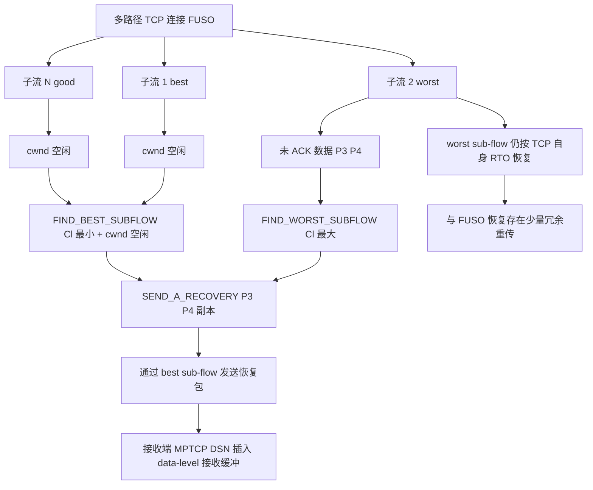
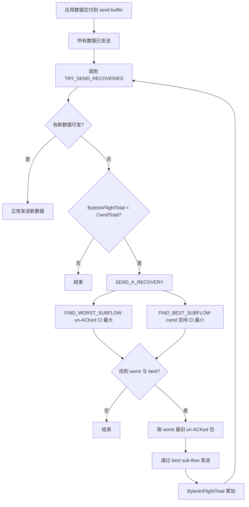

# FUSO: Fast Multi-Path Loss Recovery for Data Center Networks（IEEE/ACM TON 2018）

> 作者：Guo Chen, Yuanwei Lu, Yuan Meng, Bojie Li, Kun Tan, Dan Pei, Peng Cheng, Layong Luo, Yongqiang Xiong, Xiaoliang Wang, Youjian Zhao
> 机构：清华大学；湖南大学；微软亚洲研究院（MSRA）；微软 Azure Networking；华为中央软件院；南京大学
> 发表年份：2018（在线发布 2018-05-11，卷期 2018-06-14）
> 会议/期刊：IEEE/ACM Transactions on Networking, Vol. 26, No. 3, June 2018
> 关联 PDF：同目录下 `陈果2018.pdf`
> 初步版本：USENIX ATC 2016 [51] "Fast and Cautious: Leveraging Multi-Path Diversity for Transport Loss Recovery in Data Centers"

## 一、文档信息速览

| 字段 | 值 |
|---|---|
| 标题 | FUSO: Fast Multi-Path Loss Recovery for Data Center Networks |
| 作者 | Guo Chen, Yuanwei Lu, Yuan Meng, Bojie Li, Kun Tan, Dan Pei, Peng Cheng, Layong Luo, Yongqiang Xiong, Xiaoliang Wang, Youjian Zhao |
| 机构 | 清华大学；湖南大学；MSRA；Microsoft Azure；华为；南京大学 |
| 发表年份 | 2018（IEEE/ACM TON），初步版本 USENIX ATC 2016 |
| 期刊 | IEEE/ACM Transactions on Networking, Vol. 26, No. 3, June 2018 |
| 分类 | 数据中心网络 / 多路径传输 / 丢包恢复 / TCP / MPTCP |
| 核心问题 | DCN 中硬件故障导致丢包率从 0.01% 上升到 1% 时，>1% 的流会因 retransmission timeout (RTO) 影响 99th FCT；传统单路径 TCP 增强无法同时做到"快"与"谨慎" |
| 主要贡献 | (1) 首次量化分析丢包率与 TCP FCT 的关系；(2) 提出利用多路径多样性的 FUSO 多路径丢包恢复机制；(3) Linux 内核 ~900 行代码实现；(4) 实验证明 1Gbps 测试床 99th FCT 降低最多 82.3%、10Gbps 大规模仿真降低最多 87.9% |
| 数据集 | 微软 Azure 生产 DCN 5 天测量（2015-12-01 ~ 12-05）；实验室 1Gbps 测试床；ns-2 大规模仿真 |
| 实验指标 | 99th FCT、超时概率、路径丢失率分布、额外负载（extra load） |
| 路径多样性 | 64+ 并行路径（DCTCP 优化过的 DCN） |

## 二、背景（Background）

近年来大型数据中心在全球以前所未有的速率和规模建造。每个数据中心可能包含 10 万台服务器，由数千个网络设备（交换机、链路）相互连接组成的大型数据中心网络（DCN）。在 DCN 中运行的应用非常关注尾流完成时间（tail FCT，例如 99th percentile）：一次用户请求（如 Bing、Google、Facebook）通常涉及数百台机器的并行延迟敏感流，整体应用性能由最后完成的流决定 [1], [2]。

如果网络有损，应用的尾 FCT 将受到严重影响，因为这些延迟敏感流的 TCP 流可能在有损条件下遭受重传超时（RTO）[3], [4]。

然而，即使在精心设计的现代数据中心网络中，丢包也并不罕见（§II-A）。传统上，大多数丢包由拥塞引起（如 incast [5], [6]），但随着 ECN 部署和精细调优的 TCP 拥塞控制算法（如 DCTCP [1]、[7]）的部署，拥塞已被大幅缓解（从 1% 降至 0.01% [6]），但仍无法完全消除 [7], [8]。

拥塞之外，丢包也可能由故障引起（如硬件故障 [3]）。正常情况下硬件引起的丢包率很低（~0.001% [3]），但当硬件出现故障时丢包率可超过 1%。硬件故障的原因是复杂的，可能来自 ASIC 缺陷或设备老化。一旦发生硬件故障，通常需要数小时或数天才能检测和缓解 [3]。

论文通过分析和实验展示：即使是适度的丢包率上升（如 1%）也已经能让 >1% 的流命中 RTO，从而极大增加 FCT 的 99th percentile（论文 Fig. 2）。因此，需要一个更稳健的传输协议，能够在面对这种有损硬件的不利情况时仍能保证低尾 FCT。

## 三、目的（Problems Solved）

论文将数据中心网络传输丢包恢复所面临的核心挑战总结为：

**如何在不引起额外拥塞的情况下，在各种丢包条件下加速丢包恢复？**

- 单路径丢包恢复的局限性：恢复包必须通过与丢包相同的路径发送，但发送方通常无法准确知道丢包是拥塞还是故障引起的。
- 现有方案的困境：要么太激进（如 Proactive [4]）会违反精细调优的拥塞控制引起拥塞丢包，要么太保守（如 TLP [22]）仍会导致延迟敏感流的高 FCT。

论文倡导利用多路径并行路径（在大多数 DCN 拓扑中数量丰富 [6], [9]–[12]）来执行更快的丢包恢复而不引入更多拥塞，提出了 FUSO 机制。

## 四、核心原理（Principles）

**FUSO 核心思想**：在多路径传输中，当某个子流（sub-flow）疑似丢包时，立即通过另一条不丢包或丢包较少且有空闲拥塞窗口的子流发送恢复包。

- **Fast（快速）**：FUSO 不必等待有损子流的超时；
- **Cautious（谨慎）**：FUSO 不违反精细调优的 TCP 拥塞控制算法；只有当子流没有新数据可发且有空闲 cwnd 时才发送恢复包。

**与 MPTCP 的区别**：MPTCP 虽然为长流提供了出色的吞吐量性能，但可能损害小延迟敏感流的尾 FCT；因为 MPTCP 中每个子流通常必须自己恢复丢包，因此整体完成时间取决于"最差路径上最后完成的子流"。FUSO 与 MPTCP 的 opportunistic retransmission（机会性重传）[14] 类似但目标不同：MPTCP opportunistic retransmission 是为 WAN 设计，在新数据因接收窗口或发送缓冲区满而无法发送时触发；而 FUSO 在子流"没有新数据可发"时利用其空闲资源立即做主动恢复。

**关键概念**：

- **Sub-flow（子流）**：一个 TCP 流被分成多个并行子流；
- **Path Diversity（路径多样性）**：DCN 中多条物理路径上的不同拥塞/故障条件；
- **ECMP**：Equal-Cost Multi-Path；
- **DCTCP**：Data Center TCP（精细调优的 TCP 拥塞控制）；
- **ECN**：Explicit Congestion Notification；
- **RTO**：Retransmission Timeout（重传超时）；
- **DACKs**：Duplicate ACKs（重复确认）；
- **TLP（Tail Loss Probe）**：2RTT 后发 prober；
- **TCP-IR（TCP Instant Recovery）**：1/4 RTT 后发 coded packet；
- **Proactive**：零等待时间主动冗余；
- **MPTCP（Multipath TCP）**：多路径 TCP；
- **RepFlow**：应用层双流复制；
- **Loss rate（lossrate）**：总丢包率；
- **Recent loss rate（lossratelast）**：从最近一次重传起的丢包率；
- **C_l = α·lossrate + β·lossratelast**：路径质量度量；
- **Worst sub-flow**：当前 C_l 最大且有 un-ACKed 数据的子流；
- **Best sub-flow**：当前 C_l 最小且 cwnd 有空闲的子流；
- **BytesInFlightTotal**：总在飞字节数；
- **CwndTotal**：总拥塞窗口；
- **Recovery packet**：通过 best sub-flow 发送的恢复包；
- **Opportunistic Retransmission**：MPTCP 机会重传；
- **Reinjection**：MPTCP 死流重定向到 reinject queue；
- **DSN（Data Sequence Number）**：MPTCP 数据级序列号；
- **OoS Queue**：MPTCP 子流乱序队列。

**丢包率统计（论文 Fig. 1）**：在 22:00–23:00 这一小时窗口中：
- 平均丢包率约 4%；
- 约 63% 的有损链路丢包率介于 1%–10%；
- 约 22% 的链路丢包率 >60%（如 packet black-hole）；
- 仅约 22% 的有损链路在边缘（server↔ToR），约 78% 在网络（ToR↔Agg、Agg↔Spine、Spine↔Core）。

**超时时延分析（论文 Fig. 2）**：
- 对路径丢包率 $p$，最后 k 包丢失概率 $p_{tail} = 1 - (1-p)^k$；早期重传 (k=1) 时 $p_{tail} = p$；
- 重传丢失概率 $p_{retx} = 1 - (1 - p^2)^{x-k}$；
- 整体超时概率 $p_{RTO} \approx p_{tail} + p_{retx}$（忽略 whole window loss）；
- 微小流（10KB）：超时概率随 $p$ 线性增长；
- 较大流（≥100KB）：重传丢失主导，丢包率 >1% 后超时概率显著上升。

**FUSO 的数学分析（论文 Eq. 与 Fig. 4）**：
- 假设 $n_p$ 条并行路径，其中 1 条丢包率 $p$；
- $n_s$ 个 MPTCP 子流，MPTCP 的整体超时概率：$1 - [(1 - 1/n_p) + 1/n_p (1 - p^{s_{RTO}})^{n_s}]$；
- FUSO 整体超时概率：$(1/n_p)^{n_s} \cdot [1/n_s \cdot p^2_{s_{RTO}} + (p_{s_{retx}} + p^2)]$；
- 相对 TCP 减少 $10^4$–$10^3$ 倍的超时概率。

**与现有技术的差异**：

- 相对 TLP：TLP 2RTT 等待、太保守；
- 相对 TCP-IR：TCP-IR 1/4 RTT 等待、稍激进；
- 相对 Proactive：Proactive 零等待、过激进、可能加剧拥塞；
- 相对 MPTCP：MPTCP 多路径"各自恢复"，整体完成时间受限于最差路径；
- 相对 RepFlow：RepFlow 复制两个流但 ECMP 哈希冲突导致冗余浪费；
- FUSO：利用多路径多样性，"快速"+"谨慎"。

## 五、算法详解（Algorithm）

**输入 / 输出**：

- 输入：TCP/MPTCP 多路径连接，每条子流维护自己的 cwnd、bytes in flight 等；
- 输出：通过 best sub-flow 主动发送的 recovery packet 序列（每个 un-ACKed 包最多一次）。

**核心模块**：

1. **TRY_SEND_RECOVERIES()**：监控 BytesInFlightTotal、cwndTotal、应用新数据，决定是否发送 recovery packet；
2. **SEND_A_RECOVERY()**：
   - FIND_WORST_SUB-FLOW()：找 un-ACKed 数据最多且 C_l 最大的子流；
   - FIND_BEST_SUB-FLOW()：找 cwnd 空闲且 C_l 最小的子流；
   - 若都找到，则取 worst sub-flow 最旧的 un-ACKed 包作为 recovery packet 发送到 best sub-flow；
3. **路径选择度量**：$C_l = \alpha \cdot \text{lossrate} + \beta \cdot \text{lossratelast}}$；
4. **MPTCP 接收端**：FUSO recovery packet 通过 DSN 直接插入 data-level 接收缓冲区。

**伪代码（论文 Algorithm 1）**：

```python
def TRY_SEND_RECOVERIES():
    while BytesInFlightTotal < CwndTotal and no new data:
        ret = SEND_A_RECOVERY()
        if ret == NOT_SEND:
            break
    return


def SEND_A_RECOVERY():
    FIND_WORST_SUBFLOW()  # 在有 un-ACKed 数据的子流中选 Cl 最大
    FIND_BEST_SUBFLOW()   # 在 cwnd 空闲的子流中选 Cl 最小
    if not worst or not best:
        return NOT_SEND
    # 选 worst sub-flow 最旧的 un-ACKed 包（按 TCP seq 升序）
    recovery_packet = pick_oldest_unacked(worst)
    send_through(recovery_packet, best)  # 把 best sub-flow 的 cwnd-1
    BytesInFlightTotal += size(recovery_packet)
    return SENT
```

**关键路径选择细节**：

- worst sub-flow 在有 un-ACKed 数据且 C_l 最大的子流中选取；若无任何重传，C_l=0；若有 C_l=0，按最大 RTT 选；
- best sub-flow 在 cwnd 空闲且 C_l 最小的子流中选取；若无重传，C_l=0；若仍多个，按最小 RTT 选；
- 若所有子流从未传输过数据，则 C_l = ∞，优先级最低；若所有都是 ∞，随机选一个作为 best。

**关键数学**：见 §四。

**复杂度分析**：

- TRY_SEND_RECOVERIES 在每次数据发送完或 ACK 处理后被调用，每次最坏情况遍历所有子流对；
- 每个 un-ACKed 包最多被 FUSO 主动重传一次，避免冗余爆炸；
- 在小测试床 3 条路径 / 4 sub-flows 的情况下开销可忽略；
- 在 ns-2 仿真 64 服务器 / 20 交换机的 Fat-tree 中可扩展。

**训练 / 部署参数**：

- 路径选择参数 $\alpha = \beta = 0.5$；
- 实施在 Linux Kernel 3.18，约 900 行代码（基于 MPTCP v0.90）；
- 1Gbps 测试床：6 台 ToR 交换机、6 台主机（Intel E7300 Core2 Duo 2.66GHz、4GB RAM、1Gbps NIC、Ubuntu 14.04 + Linux 3.18.20）、ECMP + ECN（RED 阈值 32KB）、TCP minRTO 5ms、基础 RTT ~280μs；
- 10Gbps 仿真：3 层 4 pod Fat-tree，4 Spine 交换 + 4 pods（每 pod 2 Agg + 2 ToR），20 交换机、64 服务器（10Gbps 下连、40Gbps 上连），1MB 端口 buffer，ECN 阈值 300KB 接入 / 1200KB 上行，TCP minRTO 5ms，8 sub-flows；
- 32K flows / run，10 runs。

**示例**：对于 1Gbps 测试床的 web-search + data-mining 流量，FUSO 在 1% 路径丢包率下，1Gbps 测试床 99th FCT 从 ~22ms 降到 <2.4ms（降低 82.3%），timeout fraction 从 7%+ 降到 <0.096%（降低接近 100%）。

## 六、系统架构图（Architecture）



## 七、流程图（Process Flow）



## 八、关键创新点（Key Innovations）

- **+ 利用多路径多样性加速丢包恢复**：FUSO 通过 good sub-flows 主动为 bad sub-flow 恢复丢包，无需等待 RTO；
- **+ 严格遵循精细调优的拥塞控制**：恢复包占用 best sub-flow 的 cwnd，不增加额外拥塞；
- **+ 自适应路径选择度量 $C_l$**：综合考虑整体丢包率与最近丢包率，动态识别 worst/best sub-flow；
- **+ 谨慎 / 快速权衡**：FUSO 在 good path 空闲时"快速"恢复，在拥塞（无 cwnd 空闲）时"谨慎"不发送冗余（incast 实验中冗余随负载下降）；
- **+ Linux 内核 ~900 行实现**：可部署在生产 MPTCP 之上；
- **+ 真实生产 DCN 测量**：基于 Microsoft Azure 5 天实测数据，发现大多数有损链路丢包率 1%–10%；
- **+ 显著降低尾 FCT**：1Gbps 测试床 99th FCT 降最多 82.3%，10Gbps 仿真降最多 87.9%。

## 九、实验与结果（Experiments）

- **数据集**：
  - 微软 Azure 生产 DCN 5 天测量（2015-12-01 ~ 12-05），4 层交换机 ToR / Agg / Spine / Core；
  - 1Gbps 测试床（3 路径 × 4 sub-flows）；
  - 10Gbps ns-2 仿真（3 层 4 pod Fat-tree，64 服务器）。
- **Baseline**：TCP（含 SACK、Limited Transmit、Early Retransmit）、TLP、TCP-IR、Proactive、MPTCP、RepFlow。
- **主要指标**：99th FCT、平均 FCT、timeout fraction、extra load。
- **关键结果数字**：
  - 网络丢包（path P1 0.125%–4%）：FUSO 99th FCT <2.4ms、timeout fraction <0.096%；相比其它方案 FCT 降低最多 82.3%、timeout fraction 降低最多 100%；
  - 边缘丢包（所有 access 链路同时丢包）：丢包率 <1% 时 FUSO timeout fraction <0.8%（其它 >3.3%），99th FCT 降低最多 80.4%；丢包率 >2% 时 FUSO 99th FCT <12.7ms；
  - Failure + Congestion（2% path P1 丢包 + 0.1–0.9 负载）：FUSO 平均 FCT 比 MPTCP/TCP/TLP 低 28.2%–47.1%；99th FCT 低 17.2%–80.6%；比 RepFlow 平均低 10%–30.3%、尾低 20.1%–44.8%；
  - Incast（fanout 23–70）：FUSO 始终最优，fanout=30 时 RepFlow ~47ms、Proactive ~58ms、FUSO <25ms；fanout=70 时 FUSO 完成时间 <51.2ms；
  - 大规模 ns-2 仿真（web-search 负载）：FUSO 平均 FCT 低于其它 10.4%–60.3%，99th FCT 低 29.2%–87.4%；
  - 大规模 ns-2 仿真（data-mining 负载）：FUSO 平均 FCT 低 4.1%–39.4%，99th FCT 低 0%–87.9%；
  - 各种 sub-flow 数量：FUSO1 差；FUSO2/4/8 在小测试床 3 路径下 4 sub-flows 已足够；MPTCP sub-flow 越多越差（受最差路径限制）；
  - FUSO 的额外负载（extra load）：低负载 0.1 时 ~42%、高负载 0.9 时降到 ~40%，自适应；incast 时进一步降到极低。
- **超时概率理论分析（Fig. 4）**：3 路径 / 1 路径丢包 0.1%–10% 随机丢包下，FUSO 相比 TCP 减少 $10^4$–$10^3$ 倍超时概率。
- **可扩展性**：从测试床到大规模仿真，FUSO 表现稳定优于基线。

## 十、应用场景（Use Cases）

- **数据中心网络 TCP 丢包恢复**：低延迟 FCT 关键（电商、搜索、推荐）；
- **微服务 RPC 调用的尾 FCT 优化**：服务间调用多路径；
- **在线金融支付链路**：99th FCT 严格 SLA；
- **RDMA 替代方案**：RDMA 在故障丢包（即使是 0.1%）上表现很差，FUSO 思想可推广到 RDMA/PFC；
- **MapReduce 等 incast 场景**：FUSO 通过多路径恢复避免突发超时；
- **跨数据中心 WAN**：可借鉴多路径思想。

## 十一、相关论文（Related Papers in this set）

- `TraceSieve_ISSRE23`（追踪异常检测）；
- `刘平issre`（TraceAnomaly）；
- `Chain-of-Event_Interpretable-Root-Cause-Analysis-for-MicroservicesFSE24-Camera-Ready`；
- `AlertRCA_CCGRID2024_CameraReady`；
- `TCS23-DiagFusion`；
- `CMDiagnostor`（调用指标根因）；
- `zsl期刊`（FUNNEL）；
- `Proactive`（SIGCOMM 2013）；
- `TLP`（RFC 5827）；
- `TCP-IR`（RFC 5827）；
- `MPTCP`（RFC 6824）；
- `RepFlow`（INFOCOM 2014）。

## 十二、术语表（Glossary）

- **DCN**：Data Center Network；
- **DCTCP**：Data Center TCP；
- **ECN**：Explicit Congestion Notification；
- **RTO**：Retransmission Timeout；
- **DACK**：Duplicate ACK；
- **DACKs**：Duplicate ACKs；
- **SACK**：Selective Acknowledgment（RFC 2018 / RFC 6675）；
- **TLP**：Tail Loss Probe（RFC 5827）；
- **TCP-IR**：TCP Instant Recovery（FEC）；
- **MPTCP**：Multipath TCP（RFC 6824）；
- **ECMP**：Equal-Cost Multi-Path；
- **PFC**：Priority-based Flow Control；
- **RDMA**：Remote Direct Memory Access；
- **NetBouncer**：微软生产 DCN 端到端延迟/丢包测量系统；
- **DACKs**：Duplicate ACKs；
- **DCTCP**：Data Center TCP；
- **netem**：Linux 网络模拟器（用于注入丢包）；
- **Linux qdisc RED**：Random Early Detection；
- **minRTO**：最小重传超时（Linux 默认 5ms）；
- **early retransmit**：早期重传（k=1）；
- **FUSO**：Fast mUlti-path lOss recovery；
- **Path Diversity**：路径多样性；
- **Worst sub-flow**：当前 Cl 最大且有 un-ACKed 的子流；
- **Best sub-flow**：当前 Cl 最小且 cwnd 空闲的子流；
- **BytesInFlightTotal**：总在飞字节数；
- **CwndTotal**：总拥塞窗口；
- **DSN**：Data Sequence Number（MPTCP）；
- **OoS**：Out-of-Sequence；
- **Reinjection**：死流重定向机制；
- **DSS**：Data Sequence Signal（MPTCP option）；
- **Lost in flight**：在飞但已丢失的包。

## 十三、参考与延伸阅读

- Paper: FUSO USENIX ATC 2016 [51]（preliminary version）；
- Paper: DCTCP（Alizadeh et al., SIGCOMM 2010 [1]）；
- Paper: DCTCP+ECN 调优（Wu et al., CoNEXT 2012 [7]）；
- Paper: Pingmesh（Guo et al., SIGCOMM 2015 [3]）；
- Paper: TCP incast（Chen et al., WREN 2009 [5]）；
- Paper: Proactive（Flach et al., SIGCOMM 2013 [4]）；
- Paper: TLP（RFC 5827 [22]）；
- Paper: TCP-IR（RFC 5827 [23]）；
- Paper: MPTCP v0.90（Paasch et al. [29]）；
- Paper: MPTCP（RFC 6824 [15]）；
- Paper: RepFlow（Xu & Li, INFOCOM 2014 [31]）；
- Paper: ECMP（RFC 2992 [26]）；
- Paper: Netem（Linux Foundation）；
- Paper: catch the whole lot（Cheng et al., NSDI 2014 [24]）；
- Paper: Hedera（Al-Fares et al., NSDI 2010 [25]）；
- 工具：Jaeger、Zipkin、SkyWalking、OpenTracing、ES-APM（追踪工具，与 FUSO 互补）。
