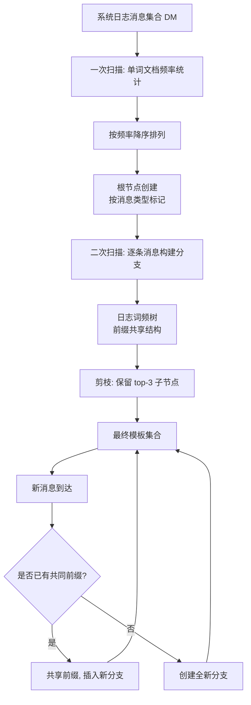
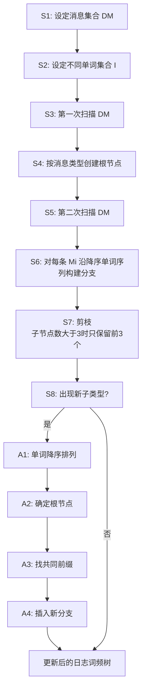

# 一种基于日志词频树的智能系统日志解析处理方法（CN110532550A）

> 申请人：北京必示科技有限公司  
> 申请日：2019-08-13  
> 公开/授权日：2019-12-03  
> IPC分类号：G06F 17/27 (2006.01); G06F 16/31 (2019.01)  
> 发明人：刘大鹏、张圣林、李浩达、朱晶、隋楷心  
> 关联文档：同目录下 `CN110532550A.pdf`

## 一、文档信息速览

| 字段 | 值 |
|---|---|
| 专利号 | CN110532550A |
| 类型 | 发明专利申请（A） |
| 申请号 | 201910742035.5 |
| 申请日 | 2019-08-13 |
| 公开号 | CN110532550A |
| 公开日 | 2019-12-03 |
| 申请人 | 北京必示科技有限公司 |
| 发明人 | 刘大鹏、张圣林、李浩达、朱晶、隋楷心 |
| IPC | G06F 17/27; G06F 16/31 |
| 法律状态 | 发明专利申请公开 |

## 二、背景（Background）

本发明属于 AIOps / 智能运维领域，具体聚焦在系统日志解析与模板提取这一基础环节。日志是 AIOps 最常见的数据源之一：在程序运行过程中，代码会持续打印出任务执行情况、状态变化、错误信息等内容；这些内容通常是非结构化或半结构化的文本，例如 `Interface ae3 changed state to down`、`SIF: user login from 10.0.0.1 success` 等。直接对这样的"非结构化文本"做特征工程或直接套用通用 NLP（自然语言处理）方法往往效果不佳，因为日志具有"短文本、半结构、强运维语义"的领域特性，必须结合运维领域知识，先将原始日志提炼为"模板（log template / event）"，再把每条原始消息映射到对应的模板上，才能进入后续异常检测、根因分析等高级任务。

一种通用的系统日志预处理流程是：(1) 从历史系统日志消息中提取模板集合；(2) 把新的消息按模板进行归一化。但在本发明之前已有的模板提取方法普遍存在两类缺陷：一是准确性低，在学习"正确"的模板集合时容易把变量和模板词混淆，导致提取出的模板噪声大；二是绝大多数方法不支持增量式学习——当系统升级、固件更新带来新模板时，需要把全部历史消息重新处理一遍以重建模板集合。在大型数据中心，每天产生的系统日志往往以"千万条"为单位，全量重处理既慢又贵，几乎不可能在线上跑通。

发明人在背景部分进一步指出了日志模板提取的三个核心挑战：

1. **非结构化**：交换机等设备输出的系统日志通常是自由文本，没有严格 schema；
2. **数据量大**：数据中心每天产生的日志数量级在千万到亿；
3. **类型多样**：随着设备厂商、设备型号的更换，日志格式会变化，模板集合也要随之更新。

## 三、目的（Purpose / Problems Solved）

针对上述痛点，本发明要解决的具体技术问题包括：

- **准确性**：在提取日志模板时，把"频繁出现的常量单词"和"动态变量"区分清楚，避免把 IP、端口、用户 ID 等变量错认成模板词。
- **可解释的模板定义**：把模板形式化地定义为"详细信息字段的子类型"或"频繁出现单词的最长组合"，让算法输出的模板有清晰含义。
- **增量式学习**：当出现新的子类型消息（例如固件升级引入新格式）时，能够在不重建整棵模板树的前提下，插入新模板。
- **计算资源友好**：通过把模板组织成一棵前缀共享的"日志词频树"，让插入和匹配只沿一条路径进行，避免 O(n) 的全集合重算。

## 四、核心原理（Principles）

### 4.1 系统总览

本发明把"日志模板提取"问题重写为：从一组系统日志消息集合 `DM = (M₁, M₂, …, Mₙ)` 中，识别出"频繁出现的单词的最长组合"。这里的"频繁出现"是相对整个消息集合的统计意义——如果一个单词在多个不同消息里都出现，那它就更可能是模板的一部分，而不是某条消息特有的变量。

为了高效存储和组织这些模板，本发明引入了一种**日志词频树（Log Word Frequency Tree）**结构：

- 树的**根节点**标记为系统日志消息的类型（例如 `SIF`）；
- 树的每一层代表"按频率降序排列后"的某个单词；
- 同一棵子树的不同分支共享共同前缀，从而实现模板的去重与压缩；
- 整棵树在构建完成后，还要经过一次**剪枝**：当某个根节点下挂的子节点数大于 3 时，第 3 个之后的子节点全部删除，最后一个子节点变成叶节点——这等价于只保留"频繁出现单词的最长组合"，把稀疏的细节剪掉。

当有新模板需要加入时，算法不需要重建整棵树，而是按相同规则找到共同前缀，插入新分支即可，因此具备**增量式学习**能力。

### 4.2 关键概念

- **消息集合 `DM`**：包含 n 条系统日志消息 `Mᵢ`，n ∈ (1, i)，每条 `Mᵢ` 都是一条独立的系统日志消息。
- **不同单词集合 `I = (a₁, a₂, …, aₘ)`**：消息集合里所有出现过的不同单词的集合。
- **单词频率**：单词 A 在消息集合中出现的频率，等于**包含单词 A 的消息数**，而非单词 A 出现的总次数。这一统计口径保证了"被多条不同消息共同包含"的词才能成为模板候选。
- **根节点**：用每条消息所属的消息类型做标记，例如实施例二里所有 `Mᵢ` 都属于 "SIF" 类型，所以根节点为 `SIF`。
- **子节点**：根据每个单词出现频率的**降序排列**顺序，从根节点延伸出的不同分支。
- **共同前缀**：两条消息按频率降序排列后的单词序列若前面 k 个单词相同，则前 k 个构成共同前缀，它们共享对应的树节点。
- **自底向上合并**：当多条消息共享同一前缀时，它们会挂到同一个父节点下，每条消息独有的"差异化"单词形成更下层的子节点。

### 4.3 与现有技术的差异

| 维度 | 已有方法 | 本发明 |
|---|---|---|
| 模板定义 | 多基于正则匹配或聚类 | 形式化为"频繁出现单词的最长组合" |
| 增量学习 | 不支持，全量重算 | 支持，按共同前缀局部插入 |
| 存储结构 | 列表 / 数据库 | 词频树（前缀树 + 频率降序） |
| 抗变量干扰 | 弱 | 通过"按消息数统计频率"天然抗变量 |
| 资源消耗 | 每次新增模板全量重建 | 仅 O(路径深度) 局部插入 |

## 五、算法详解（Algorithm）

### 5.1 输入 / 输出

- **输入**：系统日志消息集合 `DM = (M₁, M₂, …, Mₙ)`，n ≥ 1
- **输出**：一棵日志词频树，每条根节点–叶节点路径对应一个日志模板

### 5.2 关键步骤

整个流程可拆为 8 个步骤（S1–S8）：

1. **S1** 设定消息集合 `DM = (M₁, M₂, …, Mₙ)`
2. **S2** 设定不同单词集合 `I = (a₁, a₂, …, aₘ)`
3. **S3** 对 `DM` 进行**第一次扫描**，统计每个单词在多少条不同消息中出现过
4. **S4** 按消息类型创建根节点
5. **S5** 对 `DM` 进行**第二次扫描**，按降序频率顺序处理每条 `Mᵢ`
6. **S6** 对每条 `Mᵢ` 进行处理：根据降序单词序列，沿根节点往下走；若已存在的分支能匹配共同前缀，则共享节点；否则在共同前缀的最深处开新分支
7. **S7** 对生成的日志词频树进行**剪枝**：根节点下子节点数 > 3 时，从第 3 个之后的子节点全部删除，最后一个保留为叶节点
8. **S8** 当出现新的子类型消息时，**增量插入**新节点：A1 单词降序排列 → A2 找根节点 → A3 确定共同前缀 → A4 插入新分支

### 5.3 伪代码

```python
def build_log_word_freq_tree(messages: list[str]) -> dict:
    # S1-S2: 准备
    word_doc_freq = Counter()  # 单词在多少条不同消息里出现过
    for msg in messages:
        for word in unique_words(msg):
            word_doc_freq[word] += 1

    # 按频率降序排列
    sorted_words = sorted(word_doc_freq.keys(),
                          key=lambda w: -word_doc_freq[w])

    # S3-S4: 创建根节点（按消息类型）
    msg_type = detect_type(messages)  # 例如 "SIF"
    root = {"type": msg_type, "children": {}}

    # S5-S6: 第二次扫描，逐条处理
    for msg in messages:
        ordered = [w for w in sorted_words if w in msg]
        node = root
        for word in ordered:
            if word not in node["children"]:
                node["children"][word] = {"children": {}, "leaf": True}
            else:
                node["children"][word]["leaf"] = False
            node = node["children"][word]

    # S7: 剪枝
    def prune(node):
        if len(node["children"]) > 3:
            keys = sorted(node["children"].keys(),
                          key=lambda k: -word_doc_freq[k])
            keep = {keys[0], keys[1], keys[2]}
            node["children"] = {k: v for k, v in node["children"].items() if k in keep}
            # 最后一个子节点变成叶节点
            last_key = keys[2]
            for k, v in node["children"].items():
                v["leaf"] = (k == last_key)
        for c in node["children"].values():
            prune(c)
    prune(root)

    return root


def insert_new_template(root: dict, new_msg: str, word_doc_freq: Counter) -> None:
    # S8 / A1: 单词降序排列
    sorted_words = sorted(word_doc_freq.keys(),
                          key=lambda w: -word_doc_freq[w])
    ordered = [w for w in sorted_words if w in new_msg]

    # A2: 确定根节点（按消息类型）
    node = root
    # A3-A4: 找共同前缀，插入新分支
    for word in ordered:
        if word not in node["children"]:
            node["children"][word] = {"children": {}, "leaf": True}
        node = node["children"][word]
```

### 5.4 关键数学

本发明在数学上最核心的一点是**频率定义**：

$$
\text{freq}(w) = \left| \{ M_i \in DM \mid w \in M_i \} \right|
$$

即单词 `w` 出现的频率 = **包含 w 的不同消息数**。这一统计口径天然地把 IP 地址、端口号、用户 ID 等"几乎只出现在一条消息里"的变量排除在模板候选之外——它们的 freq 接近 1，会被排在队尾，而真正"几乎每条消息都有"的连接词/状态词会排在前面。

按频率降序后，每条消息得到一个有序单词列表 `L(Mᵢ) = (wᵢ₁, wᵢ₂, …)`。模板集合定义为 `L` 的**最长公共前缀 + 差异化后缀**的结构化结果。

### 5.5 复杂度分析

- 第一次扫描：O(n × avg_len)，n 是消息数，avg_len 是平均单词数
- 第二次扫描 + 树构建：O(n × avg_len)
- 插入新模板：O(路径深度) = O(m)，m 是不同单词总数，远小于 n
- 空间：O(n × avg_len) 用于存储整棵树

相比"全量重建"的 O(n²) 思路，本发明把插入复杂度从 O(n) 降到了 O(m)。

### 5.6 示例（来自说明书实施例二）

说明书实施例二给出了具体例子：消息集合 `DM = (M₁, M₂, …, M₈)`，所有消息都属于 "SIF" 类型。

- 第一次扫描：得到降序单词列表 L
- 第二次扫描：依次处理 M₁ ~ M₈
  - M₁ 处理后形成第一条分支
  - M₂ 与 M₁ 共享共同前缀，需要在节点 "to" 下创建新分支
  - M₃ 与 M₁ 共享子节点 "Interface"，在 "Interface" 下开新分支
  - M₄ 与 M₂ 共享 "Vlan-Interface"
  - M₅、M₆ 与 M₁/M₂ 共享 "down"
  - M₇、M₸ 与 M₃/M₄ 共享 "up"
- 剪枝后得到最终的日志词频树（图4）

当新消息 `Mnew = "Interface ae1 changed state to RETURN"` 到达时：
- 按 L 排序得到单词序列
- 找到与已有分支的共同前缀
- 在子节点 "Interface" 下插入 "RETURN"、"ae1" 作为新分支
- 完成增量式模板学习，不需要重建整棵树

## 六、系统架构图（Architecture）



## 七、流程图（Process Flow）



## 八、关键创新点（Key Innovations）

- **+ 词频树作为模板索引结构**：用一棵前缀树 + 频率降序的"日志词频树"把模板组织起来，既能去重（共同前缀只存一次），又能增量更新。
- **+ 文档频率（DF）替代词频（TF）作为统计口径**：以"包含该词的消息数"而非"该词的总出现次数"作为频率定义，从根本上排除 IP、端口号等变量的干扰。
- **+ 模板 = 频繁出现单词的最长组合**：把"模板"这一模糊概念精确化为可计算的组合问题，输出有清晰的物理含义。
- **+ 增量式模板学习**：新模板到来时只需按共同前缀在原树上插入新分支，避免全量重建，可应对固件/系统升级带来的新格式。
- **+ 简单有效的剪枝规则**：根节点下子节点数 > 3 时只保留前 3，把稀疏分支剪掉，保证模板集合的"紧致"。

## 九、权利要求摘要（Claims Summary）

- **独立权利要求 1（方法）**：定义了"系统日志处理 = 从系统日志中自动提取模板"，并把"提取模板"形式化为"识别出频繁出现单词的最长组合"。
- **权利要求 2（方法步骤）**：给出 S1–S8 八个步骤的完整流程：设定集合 → 一次扫描 → 根节点 → 二次扫描 → 逐条处理 → 剪枝 → 增量插入。
- **权利要求 3（消息/单词定义）**：把 `DM = (M₁, …, Mₙ)` 和 `I = (a₁, …, aₘ)` 形式化，明确"单词频率 = 包含该词的消息数"。
- **权利要求 4（两次扫描细节）**：规定第一次扫描得频率并降序，第二次扫描按降序顺序构建分支并共享共同前缀。
- **权利要求 5（剪枝规则）**：根节点子节点数 > 3 时，第三个之后全部删除，最后一个变叶节点。
- **权利要求 6（增量插入触发条件）**：固件/操作系统升级导致新子类型时，触发新模板插入。
- **权利要求 7–10（增量插入子步骤）**：A1 降序排列 → A2 确定根节点 → A3 确定共同前缀 → A4 插入新分支；并约束"插入时所有子节点都已经被删除"。

## 十、应用场景（Use Cases）

1. **金融支付系统日志解析**：每天产生 GB 级结构化/半结构化日志，从中提取出"交易成功"、"交易失败"、"超时"等模板，供后续异常交易检测。
2. **云原生微服务调用日志**：从 K8s 容器、Service Mesh 日志中提取标准化模板，统一接入 ELK / Loki 等日志平台。
3. **大规模交换机/路由器 syslog 处理**：数据中心里成百上千台设备的 syslog 流，模板提取后可以高压缩比存储。
4. **固件 OTA 升级场景**：设备固件升级后日志格式可能变化，本发明的增量插入能力可以无缝吸收新格式。
5. **告警去噪与归一化**：从原始日志提炼出模板后，把相同的告警消息归一，便于后续基于模板做告警风暴检测。

## 十一、相关专利（Related Patents in this set）

- CN110837953A — 一种自动化异常实体定位分析方法：模板提取是它的上游环节。
- CN111309565B — 告警处理方法：告警降噪与聚类之前会用到日志模板归一化。
- CN111338915B — 动态告警定级方法：BTM 主题模型提取告警文本特征时也需要模板归一化作为前置。
- CN111539493A — 告警预测方法：LDA 主题模型同样依赖模板归一化后的告警文本。

## 十二、术语表（Glossary）

- **DM（Document Message Set）**：系统日志消息集合，记为 `(M₁, M₂, …, Mₙ)`。
- **消息类型（Message Type）**：每条系统日志所属的类别，例如 "SIF"、"LINK"、"AUTH" 等。
- **模板（Template）**：从一组系统日志消息中识别出的"频繁出现单词的最长组合"，对应根节点到叶节点的一条路径。
- **文档频率（Document Frequency, DF）**：单词在多少条不同的消息中出现过，本发明以此作为"频率"的定义。
- **词频（Term Frequency, TF）**：与 DF 相对，指单词在所有消息中出现的总次数，本发明明确不采用。
- **日志词频树（Log Word Frequency Tree）**：本发明提出的索引结构，根节点按消息类型标记，子节点按频率降序排列。
- **共同前缀（Common Prefix）**：两条消息按降序单词序列对齐时，从头开始连续相同的部分。
- **增量式学习（Incremental Learning）**：模型能够在不重建的前提下吸收新数据的能力。

## 十三、参考与延伸阅读

- 该专利的算法思想与经典的 *PrefixSpan*、*FT-Tree*（Frequent Pattern Tree）有相似的"前缀共享"哲学，但应用对象是日志文本而非事务数据库。
- 在工业界，类似的模板提取思路也出现在 *Drain*、*Spell*、*LogCluster* 等开源日志解析器中，可作为对照实现。
- 关于"文档频率 vs 词频"的差异，可参考信息检索经典教材《Introduction to Information Retrieval》第 6 章。
