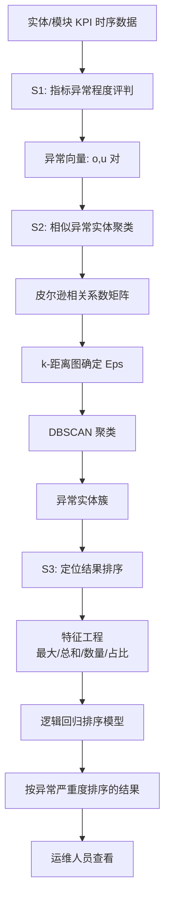
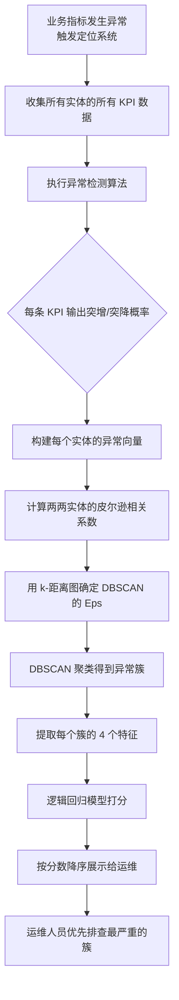

# 一种自动化异常实体定位分析方法（CN110837953A）

> 申请人：北京必示科技有限公司  
> 申请日：2019-10-24  
> 公开/授权日：2020-02-25  
> IPC分类号：G06Q 10/06 (2012.01); G06Q 10/00 (2012.01); G06K 9/62 (2006.01)  
> 发明人：刘大鹏、聂晓辉、朱晶、王耀  
> 关联文档：同目录下 `CN110837953A.pdf`

## 一、文档信息速览

| 字段 | 值 |
|---|---|
| 专利号 | CN110837953A |
| 类型 | 发明专利申请（A） |
| 申请号 | 201911019400.6 |
| 申请日 | 2019-10-24 |
| 公开号 | CN110837953A |
| 公开日 | 2020-02-25 |
| 申请人 | 北京必示科技有限公司 |
| 发明人 | 刘大鹏、聂晓辉、朱晶、王耀 |
| IPC | G06Q 10/06; G06Q 10/00; G06K 9/62 |
| 法律状态 | 发明专利申请公开 |

## 二、背景（Background）

在现代数据中心里，IT 基础架构环境非常复杂：每种业务都由一系列模块或中间件（Web 服务器、应用服务器、数据库、消息队列、缓存等）组成，这些模块部署在不同机房的不同物理机/虚拟机上，每台机器上又会采集大量不同的监控指标（CPU、内存、磁盘、网络、QPS、响应时间、成功率……）。当业务出现故障时，某个基础组件的异常就像蝴蝶扇动翅膀，可能引发多个核心交易系统的告警风暴。

业务告警一旦产生，运维人员通常会按以下流程处理：(1) 针对每个监控指标跑异常检测，得到异常指标集合；(2) 凭借个人经验对异常指标排序，判断轻重缓急；(3) 按排序结果逐一排查，找到根因后执行故障恢复方案。这一流程看似简单，但在指标数量动辄成千上万的真实生产环境中，**人工排查极其困难**，大量的时间被浪费在"分析指标 → 排序 → 挨个看"上，直接拉长了故障恢复时间，给业务造成不可估量的损失。

发明人在背景部分明确指出，把"人工故障定位"自动化面临三个核心挑战：

1. **异常检测的"程度"问题**：现有异常检测算法大多只能给出"指标是否异常"的二值判断，**不能给出"异常程度"**，而下游的排序非常需要连续的异常分数；
2. **实体聚类问题**：实际 IT 模块会部署在多台实体（物理机、虚拟机、中间件、路由器、交换机等）上，每种实体上有同样的监控指标，故障发生时大量指标同时异常，其中部分存在相似性，需要进一步聚类、归并；
3. **结果排序问题**：聚类之后，异常实体和指标被聚成多类、每类反映不同类型的故障；最终还是要运维人员逐一排查，相比原始数量已经少了很多，但仍需要合理的方法按异常严重度排序。

## 三、目的（Purpose / Problems Solved）

- **量化异常程度**：把"指标是否异常"扩展为"指标异常了多少"，用概率观测模型给出突增 / 突降的连续分数。
- **多指标综合定位**：把同实体的多个 KPI 综合成异常向量，让多指标共同决定一个实体的异常程度。
- **相似异常实体聚类**：把具有相似异常模式的实体聚合到同一簇中，让运维人员一次看一类，而不是一台一台地看。
- **按异常严重度自动排序**：用监督学习（逻辑回归）训练的排序模型，对聚类结果按严重度排序，让运维人员优先处理最严重的。
- **缩短 MTTR**：把上述能力串联成"指标异常程度 → 实体聚类 → 排序 → 推送"的全自动化流水线，缩短故障恢复时间。

## 四、核心原理（Principles）

### 4.1 系统总览

本发明把"异常实体定位"问题拆成三步流水线：

1. **S1 指标异常程度评判**：对所有实体的所有 KPI 同时跑异常检测，给出每条 KPI 的"突增概率"和"突降概率"作为异常程度；
2. **S2 相似异常实体聚类**：把同一实体上所有 KPI 的异常程度拼成一个向量，用相关系数 + DBSCAN 把相似实体聚到同一簇；
3. **S3 定位结果排序**：用监督学习的逻辑回归模型对聚类结果打分，按分数从高到低推送给运维人员。

整个方法在业务指标发生异常时自动触发；实体（entity）指的是物理机、虚拟机、中间件、路由器、交换机等软硬件设备。

### 4.2 关键概念

- **指标异常程度（Anomaly Degree）**：单个 KPI 在故障时刻的异常量化值，用突增概率 Pₒ 和突降概率 Pᵤ 表示。
- **观测窗口**：以故障时刻 t 为界，[t-w₁, t) 为故障前窗口，{xᵢ} 是该窗口的样本；[t, t+w₂) 为故障后窗口，{xⱼ} 是该窗口的样本。
- **实体异常向量**：单个实体上 n 个 KPI 的异常程度拼成的向量 `(o₀, u₀, o₁, u₁, …, oₙ, uₙ)`。
- **皮尔逊相关系数 r**：衡量两个实体异常向量的线性相关程度，r ∈ [-1, 1]。
- **距离函数 `Distance = 1 - r`**：把"相关性"转换为聚类可用的"距离"度量，r=1 → 距离 0（完全正相关），r=-1 → 距离 2（完全负相关）。
- **DBSCAN 聚类**：基于密度的空间聚类算法，Eps 半径 + MinPts 最小点数两个参数，可以发现任意形状的簇并天然抗噪。
- **排序特征**：包括最大异常值、异常值总和、异常 KPI 数目、实体数目占比四个维度。
- **逻辑回归排序模型 Y₁ = f(X₁)**：用人工标注的部分历史排序结果训练出 X₁ → Y₁ 的映射。

### 4.3 数学原理

#### 4.3.1 异常程度

把异常检测问题转换成给定观测的数据集合 {xᵢ} 和 {xⱼ} 的观测概率 P({xᵢ}|{xⱼ}) 的计算问题。最终针对每个指标，利用异常检测算法计算出其**突增的概率** Pₒ({xⱼ}|{xᵢ}) 和**突降的概率** Pᵤ({xⱼ}|{xᵢ})，用于描述当前指标的异常程度：

$$
o = P_o(\{x_j\} \mid \{x_i\}), \quad u = P_u(\{x_j\} \mid \{x_i\})
$$

由于实际不同指标的采样不同，{xⱼ} 的大小 m 也有所不同，导致异常程度没有可比性，因此**计算出异常程度的指数平均值**作为最终的异常程度。

#### 4.3.2 实体聚类

两个实体 X' 和 Y' 之间的总体相关系数 ρ 定义为：

$$
\rho(X', Y') = \frac{\text{Cov}(X', Y')}{\sigma_{X'} \sigma_{Y'}}
$$

样本相关系数 r 为：

$$
r = \frac{\sum_{i=1}^{N} (x_i - \bar{x})(y_i - \bar{y})}{\sqrt{\sum_{i=1}^{N} (x_i - \bar{x})^2 \sum_{i=1}^{N} (y_i - \bar{y})^2}}
$$

r=1 表示完全正相关，r=-1 表示完全负相关，r=0 表示无线性关系。本发明的距离函数：

$$
\text{Distance} = 1 - r
$$

聚类算法把具有足够密度的区域划分为簇，在具有噪声的空间数据库中发现任意形状的簇，将簇定义为**密度相连的点的最大集合**。

#### 4.3.3 DBSCAN 半径 Eps 计算

DBSCAN 需要两个参数：Eps（半径）和 MinPts（最小点数）。本发明通过 **k-距离图**自适应确定 Eps：先计算所有点的 k-距离集合 E，对 E 升序排序得到 E'，拟合排序后的 k-距离变化曲线，**将急剧发生变化的位置所对应的 k-距离的值**确定为半径 Eps。

### 4.4 与现有技术的差异

| 维度 | 已有方法 | 本发明 |
|---|---|---|
| 异常程度 | 二值判断 | 突增/突降概率（连续） |
| 实体聚类 | 基于规则的简单合并 | 皮尔逊相关 + DBSCAN |
| 排序 | 人工经验 | 监督学习逻辑回归 |
| 自适应 | 固定阈值 | Eps 通过 k-距离图自动确定 |

## 五、算法详解（Algorithm）

### 5.1 输入 / 输出

- **输入**：所有实体/模块在某段时间窗口内的所有 KPI 时序数据
- **输出**：按异常严重度从高到低排序的聚类结果列表

### 5.2 伪代码

```python
def locate_anomalous_entities(all_kpis: dict) -> list:
    """
    三大步骤：异常程度评判 -> 相似异常实体聚类 -> 定位结果排序
    """
    # === S1: 指标异常程度评判 ===
    anomaly_vectors = {}
    for entity, kpis in all_kpis.items():
        vec = []
        for kpi_name, series in kpis.items():
            x_i = series[t - w1 : t]    # 故障前
            x_j = series[t : t + w2]    # 故障后
            o = compute_surge_prob(x_j, x_i)  # 突增概率
            u = compute_drop_prob(x_j, x_i)   # 突降概率
            vec.extend([o, u])
        anomaly_vectors[entity] = vec  # (o0, u0, o1, u1, ..., on, un)

    # === S2: 相似异常实体聚类 ===
    # 距离函数: Distance = 1 - r, r 为皮尔逊相关系数
    n = len(anomaly_vectors)
    dist_matrix = [[0.0] * n for _ in range(n)]
    entities = list(anomaly_vectors.keys())
    for i in range(n):
        for j in range(n):
            if i != j:
                r = pearson(anomaly_vectors[entities[i]],
                            anomaly_vectors[entities[j]])
                dist_matrix[i][j] = 1.0 - r

    # 用 k-距离图确定 Eps
    eps = find_eps_by_knn_plot(dist_matrix, k=4)
    min_pts = 4  # 经验值

    # DBSCAN 聚类
    clusters = dbscan(dist_matrix, eps=eps, min_pts=min_pts)

    # === S3: 定位结果排序 ===
    # 特征工程: 每个簇的 4 个特征
    cluster_features = []
    for cluster in clusters:
        max_anom = max(max(entity_anom) for entity_anom in cluster)
        sum_anom = sum(sum(entity_anom) for entity_anom in cluster)
        kpi_nums = count_anomalous_kpis(cluster, threshold=τ)
        ratio = len(cluster) / total_entities_in_module
        cluster_features.append([max_anom, sum_anom, kpi_nums, ratio])

    # 监督学习: 逻辑回归排序模型 Y1 = f(X1)
    scores = logistic_regression.predict(cluster_features)

    # 排序输出
    ranked = sorted(zip(clusters, scores), key=lambda x: -x[1])
    return ranked
```

### 5.3 关键数学

- **异常程度**：用核密度估计（KDE）的思路，把故障前窗口的分布作为基准，估计故障后窗口样本在该分布下的概率，概率越低异常程度越高。突增用右尾概率，突降用左尾概率。
- **指数平均**：为了让不同采样间隔的指标可比，把窗口内所有点的异常程度做指数平均。
- **皮尔逊相关系数**：见 §4.3.2。

### 5.4 复杂度分析

- 异常程度计算：O(N_indicators × w₁ + N_indicators × w₂)
- 距离矩阵：O(N²_entities × N_kpis)
- DBSCAN：O(N²_entities)（暴力实现）或 O(N log N)（用 KD-Tree 索引）
- 逻辑回归推理：O(N_clusters)

### 5.5 示例

以 CPU 故障为例，假设"支付服务"和"登录服务"在 CPU 故障时同时出现响应时间飙升、成功率下降的异常：

- S1 阶段：两个服务各自的 KPI 异常向量都会体现"响应时间突增、成功率突降"
- S2 阶段：两个向量的皮尔逊相关性接近 1，距离接近 0，被 DBSCAN 聚到同一簇
- S3 阶段：把"支付服务、登录服务"这一簇的特征（最大异常值、异常值总和、异常 KPI 数、占比）输入排序模型，得到一个高分；运维人员看到"支付+登录"同簇出现，CPU 故障的可能性就被自然地呈现出来。

## 六、系统架构图（Architecture）



## 七、流程图（Process Flow）



## 八、关键创新点（Key Innovations）

- **+ 异常程度量化**：用突增/突降概率把"是否异常"的二值判断升级为连续分数，为下游排序提供可比量化基础。
- **+ 指数平均归一化**：针对不同 KPI 采样间隔不一致的问题，把窗口内异常程度做指数平均，确保跨指标可比。
- **+ 异常向量 + 皮尔逊距离**：把"实体"表示为多 KPI 异常向量，用 1-r 作为聚类距离，天然支持多指标联合聚类。
- **+ k-距离图自适应 Eps**：避免人工拍 DBSCAN 的 Eps 参数，提高实用性。
- **+ 监督学习排序**：把运维经验（人工标注的排序结果）训练成排序模型 Y₁ = f(X₁)，让排序结果更符合实际运维优先级。

## 九、权利要求摘要（Claims Summary）

- **独立权利要求 1（方法）**：定义"业务指标发生异常 → 触发定位系统 → 指标异常程度评判 + 相似异常实体聚类 + 定位结果排序"。
- **权利要求 2（S1 详解）**：收集所有实体/模块的指标数据并执行异常检测。
- **权利要求 3（S2 详解）**：把具有类似异常业务指标的实体通过聚类聚到一起。
- **权利要求 4（S3 详解）**：运行智能排序算法按异常程度排名并展示。
- **权利要求 5（异常程度数学定义）**：用观测概率模型给出突增/突降的连续异常程度，并取指数平均解决可比性问题。
- **权利要求 6（聚类算法）**：定义输入向量 `(o₀, u₀, …, oₙ, uₙ)`、距离函数 `Distance = 1 - r`、DBSCAN 算法及 Eps 自适应确定。
- **权利要求 7（排序特征）**：四个特征：最大异常值、异常值总和、异常 KPI 数目、实体数目占比，用逻辑回归训练排序模型。

## 十、应用场景（Use Cases）

1. **金融交易系统监控**：交易量、成功率、响应时间等多个 KPI 联合分析，自动定位异常的服务实例。
2. **云原生微服务运维**：成百上千个 Pod 出现告警时，自动聚类出"哪些 Pod 是同一根因"，让 SRE 不用逐一排查。
3. **大规模集群日志分析**：在 K8s / 物理机集群出现"一台机器影响 N 个服务"时，把受影响的服务聚成一类，提示根因在物理机。
4. **告警风暴处理**：与 CN111309565B 的告警风暴检测联动，在风暴期间精准推送"最严重的异常实体簇"。
5. **中间件故障定位**：数据库连接池、消息队列等中间件异常时，把依赖该中间件的所有应用聚成一簇。

## 十一、相关专利（Related Patents in this set）

- **CN110532550A** — 日志词频树：上游环节，本发明的实体和模块指代的就是日志中提到的那些软硬件对象。
- **CN111309565B** — 告警处理方法：当本发明聚类出异常簇之后，可以作为告警风暴的输入特征。
- **CN111338915B** — 动态告警定级方法：本发明的"异常程度"是定级模型的强特征。
- **CN111444247B / CN111506637A** — KPI 根因定位 / 多维异常检测：与本发明在"KPI 异常程度"这一环节有方法上的互补。

## 十二、术语表（Glossary）

- **KPI（Key Performance Indicator）**：关键性能指标，例如交易量、成功率、响应时间、CPU 使用率等。
- **实体（Entity）**：监控对象，本发明里指物理机、虚拟机、中间件、路由器、交换机等软硬件设备。
- **异常程度（Anomaly Degree）**：本发明用突增概率 o 和突降概率 u 来表示。
- **皮尔逊相关系数 r**：衡量两个变量线性相关程度的无量纲数。
- **DBSCAN**：基于密度的空间聚类算法，能发现任意形状的簇并天然抗噪。
- **Eps / MinPts**：DBSCAN 的两个核心参数，分别代表邻域半径和最小点数。
- **k-距离图**：把每个点的第 k 近邻距离升序排序画出的图，用于自适应确定 Eps。
- **逻辑回归（Logistic Regression）**：一种经典的二分类/概率回归模型，可用于排序学习。
- **MTTR（Mean Time To Repair）**：平均故障恢复时间，本发明的核心目标就是缩短 MTTR。

## 十三、参考与延伸阅读

- 异常检测 + 概率观测模型可参考 Xu et al., "Don't Panic: A Predictive Approach to Root Cause Analysis"。
- DBSCAN 算法可参考 Ester et al., "A Density-Based Algorithm for Discovering Clusters in Large Spatial Databases with Noise" (KDD 1996)。
- 监督学习排序可参考 Liu, "Learning to Rank for Information Retrieval"。
