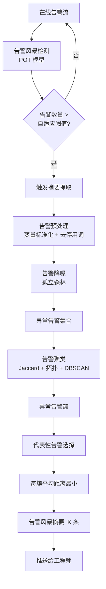
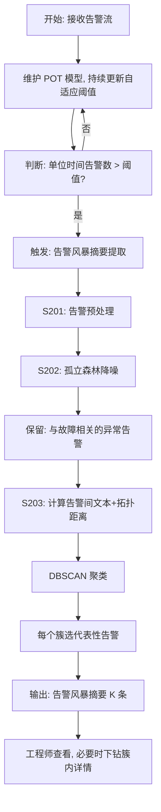

# 告警处理方法、装置、电子设备以及计算机可读存储介质（CN111309565B）

> 申请人：北京必示科技有限公司  
> 申请日：2020-05-14  
> 公开/授权日：2020-08-18（授权）  
> IPC分类号：G06F 11/30 (2006.01); G06F 11/32 (2006.01)  
> 发明人：赵能文、刘大鹏、隋楷心、张文池、聂晓辉  
> 关联文档：同目录下 `CN111309565B.pdf`

## 一、文档信息速览

| 字段 | 值 |
|---|---|
| 专利号 | CN111309565B |
| 类型 | 授权发明专利（B） |
| 申请号 | 202010405424.1 |
| 申请日 | 2020-05-14 |
| 公开号 | CN111309565A |
| 公开/授权日 | 2020-08-18 |
| 申请人 | 北京必示科技有限公司 |
| 发明人 | 赵能文、刘大鹏、隋楷心、张文池、聂晓辉 |
| IPC | G06F 11/30; G06F 11/32 |
| 法律状态 | 已授权 |

## 二、背景（Background）

搜索引擎、网上银行等大型在线服务系统已经成为日常生活不可或缺的部分，但这类系统规模庞大、结构复杂，在实际运行中不可避免地出现故障。故障一般由硬件问题、软件 bug 和突发外部因素造成，可能引起服务响应延迟甚至系统不可用，违背服务级别协议（SLA），导致用户体验差、带来巨大的经济损失。相关报告对美国 63 个数据中心的统计显示，平均 1 小时宕机带来的损失从 2010 年的 50.5 万美元增加到 2016 年的 74 万美元——**及时准确地发现故障并快速诊断修复至关重要**。

为了保证服务质量和用户体验，系统会从各个组件中收集各种监控数据（指标、日志、调用链等），并手工设置多种告警规则。一旦监控数据违反告警规则（CPU 利用率超过 80%、日志文件出现 "fail" 关键字等）就会生成告警。由于大型服务系统包含很多个组件、每个组件会生成很多种监控数据、组件之间还会相互影响，**故障发生时往往会导致短时间内迸发大量的告警，也就是告警风暴**。面对海量告警，工程师挨个检查来诊断故障耗时且易错。

发明人通过分析一个大型在线服务系统三年中发生的告警风暴历史数据，发现三个关键事实：

1. **告警风暴发生非常频繁**（平均大约一周一次），处理一个告警风暴平均需要几个工程师耗费大约 1 小时。
2. **目前主要通过设置固定阈值来识别告警风暴**（比如一分钟内告警数量超过 300），但固定阈值**不能应对动态的线上环境**（新系统上线、活动日等都会改变告警量级）。
3. **告警风暴中很多告警是系统常规告警**，和故障发生没有关系，其存在不利于工程师对真正故障进行排查。

## 三、目的（Purpose / Problems Solved）

- **自适应告警风暴检测**：把固定阈值换成能随时间漂移、随业务变化自适应更新的阈值（基于极值理论 POT 模型）。
- **告警降噪**：在告警风暴中过滤掉与故障无关的常规告警，避免误导排障方向。
- **差异化告警聚类**：把海量告警按文本相似度 + 业务/机器拓扑关联自动聚成多个簇，让运维人员一次看一类而不是一条一条看。
- **代表性告警选择**：从每个簇中选一条最具代表性的告警作为"告警摘要"，把"看几千条"压缩成"看几条"。

## 四、核心原理（Principles）

### 4.1 系统总览

整个方案分为两个阶段：

1. **告警风暴检测阶段**：对在线的实时告警流，采用**极值理论（Extremely Value Theory, EVT）**动态地检测告警风暴；
2. **告警风暴摘要提取阶段**：当判断发生了告警风暴后，依次做"基于学习的告警降噪 → 基于聚类的告警差异化 → 代表性告警选择"，最终输出 K 条代表性告警给工程师。

### 4.2 关键概念

- **告警风暴（Alert Storm）**：单位时间内告警数量超过自适应阈值的现象。
- **极值理论（EVT）**：用于检测数据概率分布偏离的常用统计方法，常被应用在极端事件检测（洪水、地震等）场景中，**不需要手动设置阈值，也不对数据分布做先验假设**。
- **超阈模型（Peak Over Threshold, POT）**：EVT 中拟合分布的常用模型，其参数通过极大似然估计得到。
- **告警降噪（Alert Denoising）**：用异常检测（孤立森林）过滤与故障无关的常规告警。
- **孤立森林（Isolation Forest）**：基于"异常点更容易被孤立"思想的异常检测算法。
- **告警聚类（Alert Clustering）**：把降噪后的告警按相似度聚成多个簇。
- **Jaccard 距离**：基于词袋的文本相似度，定义 `textual(a, b) = 1 - |bow(a) ∩ bow(b)| / |bow(a) ∪ bow(b)|`。
- **拓扑距离**：基于 CMDB 的业务拓扑和机器拓扑图，用两节点的最短路径长度衡量。
- **DBSCAN**：基于密度的聚类算法。
- **代表性告警（Representative Alert）**：簇内与所有其他告警平均相似距离最小的告警，作为告警摘要。

### 4.3 数学原理

#### 4.3.1 POT 模型的告警阈值

POT 模型用历史数据中每分钟的告警数量拟合，学习到告警数量的分布后确定一个合理的阈值作为初始阈值。在线上检测过程中，POT 模型会根据线上数据实时变化动态更新数据的分布，从而**自适应地更新阈值**：

$$
\text{EVT-threshold} = f(\text{Alert-distribution-history}, t)
$$

实时告警数量超过 EVT-threshold 时，认为发生了告警风暴。

#### 4.3.2 告警距离

最终距离 = 文本距离 + 加权 × 拓扑距离：

$$
\text{dist}(a, b) = \text{textual}(a, b) + \alpha \cdot \text{topo}(a, b)
$$

其中：

$$
\text{topo}(a, b) = \beta \cdot \text{path}_{\text{service}}(a, b) + (1 - \beta) \cdot \text{path}_{\text{server}}(a, b)
$$

α、β 是根据实际需求可调的加权因子。

#### 4.3.3 文本距离 (Jaccard 距离)

$$
\text{textual}(a, b) = 1 - \frac{|\text{bow}(a) \cap \text{bow}(b)|}{|\text{bow}(a) \cup \text{bow}(b)|}
$$

例：a="系统成功率为80%"、b="CPU使用率为73%"，bow(a)=["系统","成功率","为","80%"]，bow(b)=["CPU","使用率","为","73%"]，textual(a,b) = 1 - 1/7 ≈ 0.86。

#### 4.3.4 代表性告警选择

$$
a^* = \arg\min_{a \in C} \frac{1}{|C|} \sum_{b \in C, b \neq a} \text{dist}(a, b)
$$

即簇内与其他告警**平均相似距离最小**的告警。

### 4.4 与现有技术的差异

| 维度 | 已有方法 | 本发明 |
|---|---|---|
| 风暴检测 | 固定阈值 | 极值理论 + POT 模型自适应 |
| 告警过滤 | 无 / 简单规则 | 孤立森林学习降噪 |
| 告警聚类 | 仅文本 | 文本 + 拓扑双距离 |
| 代表性选择 | 随机 / 任意 | 平均相似距离最小 |

## 五、算法详解（Algorithm）

### 5.1 输入 / 输出

- **输入**：在线实时告警流（每条告警包含时间、内容、类型、来源系统、来源机器等属性）
- **输出**：当检测到告警风暴时，输出 K 条代表性告警（摘要）

### 5.2 伪代码

```python
def alert_handling(alert_stream):
    # === 阶段 1: 告警风暴检测 ===
    # 用历史数据拟合 POT 模型
    pot_model = fit_pot(historical_alert_counts_per_minute)
    adaptive_threshold = pot_model.get_threshold()  # EVT-threshold

    for minute_window in alert_stream:
        current_count = len(minute_window)
        if current_count > adaptive_threshold:
            # 告警风暴!
            # === 阶段 2: 告警风暴摘要提取 ===
            summaries = extract_storm_summary(minute_window)
            yield summaries
            # 顺便更新 POT 模型
            pot_model.update(current_count)


def extract_storm_summary(alerts):
    # === 步骤 1: 告警预处理 ===
    for a in alerts:
        a.text = normalize_vars(a.text)   # 变量字符串 -> 常量 (如 IP -> "ipaddr")
        a.text = remove_stopwords(a.text) # 去停用词

    # === 步骤 2: 告警降噪 (孤立森林) ===
    iforest = IsolationForest()
    iforest.fit(alerts_in_normal_period)   # 训练: 用无故障期间的告警
    scores = iforest.decision_function(alerts)  # 异常分数
    abnormal_alerts = [a for a, s in zip(alerts, scores) if s > τ]

    # === 步骤 3: 告警聚类 ===
    N = len(abnormal_alerts)
    dist_matrix = [[0.0] * N for _ in range(N)]
    cmdb = load_cmdb()
    for i in range(N):
        for j in range(N):
            if i != j:
                textual = jaccard(abnormal_alerts[i].bow,
                                  abnormal_alerts[j].bow)
                topo = (β * shortest_path(cmdb.service_graph,
                                          a_i.service, a_j.service)
                       + (1 - β) * shortest_path(cmdb.server_graph,
                                                 a_i.server, a_j.server))
                dist_matrix[i][j] = textual + α * topo
    # DBSCAN
    clusters = dbscan(dist_matrix, eps=eps, min_samples=min_pts)

    # === 步骤 4: 代表性告警选择 ===
    summaries = []
    for C in clusters:
        # 簇内平均距离最小的告警
        best = min(C, key=lambda a:
            sum(dist_matrix[a, b] for b in C if b != a) / (len(C) - 1))
        summaries.append(best)
    return summaries
```

### 5.3 关键数学

- **极值理论 POT 模型**：把数据分布尾部分布用 Generalized Pareto Distribution 拟合，参数 ξ、σ 通过极大似然估计得到；阈值是分布的某个高分位数。
- **孤立森林**：随机选特征、随机选切割点建 t 棵孤立树，异常点的平均路径长度显著短于正常点。
- **Jaccard 距离**：见 §4.3.3。
- **DBSCAN**：基于密度可达性聚类。

### 5.4 复杂度分析

- 风暴检测：O(1) per minute（仅比较计数与阈值）；POT 模型更新 O(history_size)。
- 降噪：O(N × t × log N)，t 是孤立树棵数。
- 聚类：O(N²)（距离矩阵）+ O(N log N) DBSCAN。
- 代表性选择：O(K × |C|²)，K 是簇数。

### 5.5 示例

说明书图 5 给出摘要提取的示意图：原始告警流（顶部）经过降噪、聚类后形成多个簇，每个簇选一条代表性告警（粗体），最终工程师只看到几条摘要就能了解告警风暴概貌。

## 六、系统架构图（Architecture）



## 七、流程图（Process Flow）



## 八、关键创新点（Key Innovations）

- **+ 极值理论 POT 自适应阈值**：把告警风暴检测转换成"在线突变点检测"，用 POT 模型让阈值随数据分布漂移自适应更新。
- **+ 孤立森林学习降噪**：用无故障期间的告警作为训练集，告警风暴期间作为测试集，异常分数高的告警被认为是与故障相关的。
- **+ 文本 + 拓扑双距离**：告警之间的相似度同时考虑文本词袋相似度（Jaccard）和业务/机器拓扑关联（CMDB 最短路径），聚类更准确。
- **+ DBSCAN 抗噪聚类**：DBSCAN 天然支持噪声点和任意形状的簇，适合告警这种"绝大多数正常 + 少数异常 + 局部聚集"的数据。
- **+ 簇中心告警作为摘要**：把"看几千条告警"压缩成"看 K 条代表性告警"，极大缩短 MTTR。

## 九、权利要求摘要（Claims Summary）

- **独立权利要求 1（方法）**：自适应阈值检测告警风暴 → 触发告警风暴摘要提取；摘要包括降噪 → 聚类（文本+拓扑） → 代表性选择。
- **权利要求 2（检测条件）**：单位时间告警数 > 告警阈值。
- **权利要求 3（阈值自适应）**：用极值理论方法自适应更新阈值。
- **权利要求 4（文本预处理）**：变量字符串标准化 + 去停用词。
- **权利要求 5（降噪）**：用基于学习的异常检测模型（如孤立森林）筛选异常告警。
- **权利要求 6（聚类）**：计算相似距离 + 聚类。
- **权利要求 7（代表性选择）**：簇内平均相似距离最小的告警作为摘要。
- **权利要求 8（装置）**：告警风暴检测模块 + 摘要提取模块（降噪、聚类、代表性选择）。
- **权利要求 9（电子设备）**：处理器 + 存储器 + 计算机程序。
- **权利要求 10（介质）**：计算机可读存储介质。

## 十、应用场景（Use Cases）

1. **金融支付系统告警风暴**：支付链路一旦故障，几分钟内涌出上千条告警，本发明把摘要压缩到 5-10 条，工程师秒级判断根因。
2. **云原生微服务运维**：K8s 上百个 Pod 同时告警，文本 + 拓扑双距离让"同一根因的告警"自然聚成一类。
3. **大规模集群故障**：物理机宕机影响上层 50 个服务时，CMDB 拓扑把受影响的服务聚成一类，一眼看到"根因在物理机"。
4. **电商大促保障**：双 11 / 618 等活动日，告警量级瞬时暴增，本发明的 POT 自适应阈值避免误报/漏报。
5. **银行核心系统**：银行日终批处理期间常规告警多，孤立森林降噪过滤掉这些"噪音"，让真正异常的告警凸显出来。

## 十一、相关专利（Related Patents in this set）

- **CN111338915B** — 动态告警定级方法：本发明是它的"前置"——先检测出风暴再做定级。
- **CN111539493A** — 告警预测方法：与本发明"事后"处理不同，告警预测是"事前"预警。
- **CN110837953A** — 自动化异常实体定位：本发明聚类出的"代表性告警"对应的实体，可以继续走实体定位。

## 十二、术语表（Glossary）

- **告警风暴（Alert Storm）**：短时间内大量告警集中爆发。
- **EVT（Extreme Value Theory）**：极值理论，统计分布尾部建模的数学工具。
- **POT（Peak Over Threshold）**：超阈模型，EVT 的一种实现。
- **CMDB（Configuration Management Database）**：配置管理数据库，存储业务/机器的拓扑关系。
- **孤立森林（Isolation Forest）**：基于随机切分孤立难度的异常检测算法。
- **DBSCAN**：基于密度的空间聚类算法。
- **Jaccard 距离**：基于集合交集/并集比的距离度量。
- **代表性告警（Representative Alert）**：本发明提出的"告警摘要"概念。
- **MTTR**：平均故障恢复时间。

## 十三、参考与延伸阅读

- 极值理论可参考 Coles, "An Introduction to Statistical Modeling of Extreme Values"。
- 孤立森林可参考 Liu, Ting, Zhou, "Isolation Forest" (ICDM 2008)。
- DBSCAN 可参考 Ester et al., "A Density-Based Algorithm for Discovering Clusters in Large Spatial Databases with Noise" (KDD 1996)。
- 文本聚类与文本相似度可参考《Mining Text Data》第二章。
