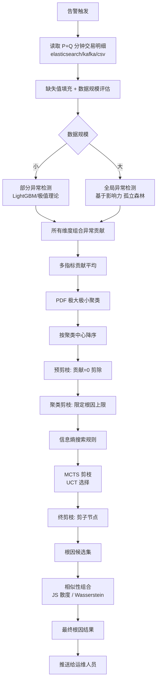
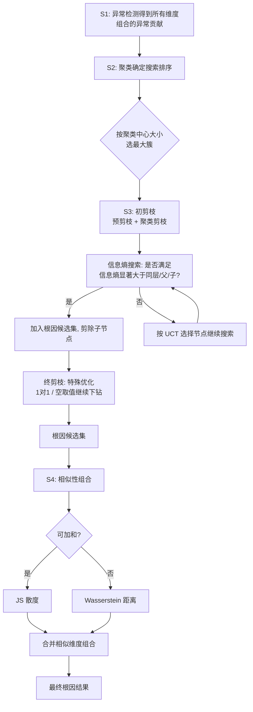

# 一种基于 KPI 指标的根因定位方法、装置及存储介质（CN111444247B）

> 申请人：北京必示科技有限公司  
> 申请日：2020-06-17  
> 公开/授权日：2023-10-17（授权）  
> IPC分类号：G06F 16/2458 (2019.01); G06F 16/28 (2019.01); G06F 18/23 (2023.01); G06Q 40/04 (2012.01)  
> 发明人：程博、成逸然、张文池、李则言、隋楷心、刘大鹏  
> 关联文档：同目录下 `CN111444247B.pdf`

## 一、文档信息速览

| 字段 | 值 |
|---|---|
| 专利号 | CN111444247B |
| 类型 | 授权发明专利（B） |
| 申请号 | 202010551260.3 |
| 申请日 | 2020-06-17 |
| 公开号 | CN111444247A |
| 公开/授权日 | 2023-10-17 |
| 申请人 | 北京必示科技有限公司 |
| 发明人 | 程博、成逸然、张文池、李则言、隋楷心、刘大鹏 |
| IPC | G06F 16/2458; G06F 16/28; G06F 18/23; G06Q 40/04 |
| 法律状态 | 已授权 |

## 二、背景（Background）

KPI 指标（交易量、交易成功率、网页访问量等）与多维属性（如源系统、交易类型、交易渠道等），是金融行业常见而重要的业务监测指标。当一个指标的总体值发生异常时，运维人员希望在一个巨大的多维搜索空间内快速准确地定位出根因的属性组合。**这对于传统的运维来说是一个极大的挑战**。

虽然目前也有一些通过机器学习来定位的算法和系统，但这些方法往往并不通用和可靠：

- 它们都受到不实际的根因假设的影响、进行了过于暴力的剪枝；
- 只处理基础类型的指标（交易量等），而不处理派生的测量值（成功率等）；
- 大部分都需要手动微调参数，或者速度太慢。

目前针对业务指标多维分析的算法（系统）主要有 Adtributor、IDice、Hotspot、Squeeze 等，大多方法主要为理论推导，离实际落地还有一定的距离：

- **HotSpot 和 Squeeze** 都假设预测值准确，再进行后续的搜索步骤，这在现实中是难以达到的，预测/异常检测的准确性会直接决定后续根因分析的结果。
- **Adtributor** 只假设根因是一维，而这样的假设不适合当前复杂的微服务系统。Adtributor 对结果仅依据奥卡姆剃刀原则保留最简洁的那一个。
- **IDice** 针对的是一段时间序列的根因定位，事先并不清楚异常的时间点，和本发明的场景不同，会带来额外的时间开销。同时 IDice 采用了极其暴力的剪枝策略去减小搜索空间，用 GLR (Generalized Likelihood Ratio) 进行异常检测（如直接去掉小于某个阈值的节点——支持度），这样的剪枝会影响上层节点的根因判断。本质上更像是在对时间序列进行多维洞察，而不是准确的根因定位。
- **Adtributor 和 Squeeze** 虽然可以对派生指标进行根因定位，但是并不能做到跨指标的根因排序。
- 在实际的应用场景中，维度变化、取值数量变化以及数据组成变化都会影响资源的使用，之前的算法都没有针对不同数量级的数据做针对性处理，**在数据量过大的时候容易导致内存溢出**等问题。

## 三、目的（Purpose / Problems Solved）

本发明把根因定位抽象为"**异常检测 + 搜索 + 聚类**"的策略（实施例中称为 **Volcano**），目标是：

- **与指标含义无关**：在交易量、成功率、响应时间等多个 KPI 同时异常时给出统一的异常得分；
- **支持 10 维以上**：典型分析的结果超过 3 维，是一套完全可实践、在生产上得到验证的方法；
- **派生指标支持**：充分考虑派生测量值（成功率等）的影响；
- **可伸缩的搜索**：在时间效率和空间效率上灵活切换，适配不同规模的数据集；
- **跨指标排序**：能给出可合并、可排序的最终根因列表。

## 四、核心原理（Principles）

### 4.1 系统总览

Volcano 流程分四步：

1. **S1 异常检测**：对所有维度组合计算"异常贡献"分数。该分数**可向上加和**，即上层节点的异常贡献 = 下层节点异常贡献之和。
2. **S2 聚类确定搜索排序**：把异常贡献的 PDF 图聚类，按聚类中心大小排序，**优先在最大聚类中心的簇中搜索**。
3. **S3 根因候选集搜索**：结合初剪枝（预剪枝 + 聚类剪枝）、信息熵搜索规则、后剪枝（MCTS 剪枝 + 终剪枝）找出根因候选集。
4. **S4 相似性组合**：在根因候选集中做分布相似性度量，将相似的维度组合合并得到最终结果。

### 4.2 关键概念

- **维度组合（Dimension Combination）**：KPI 指标在若干维度（源系统、交易类型、交易渠道等）上的笛卡尔积下的一个具体取值组合。
- **叶子节点 / 上层节点**：维度树的最细粒度组合叫叶子节点；上层的笛卡尔积组合叫上层节点。
- **异常贡献分数 Iₐ**：一个维度组合对指标 a 的异常贡献，可加和。
- **PDF 聚类**：把异常贡献分数的概率密度函数的极值聚成多个簇。
- **信息熵搜索规则**：当一个维度组合是候选根因时，其信息熵显著大于同层其他维度组合的信息熵，且大于直接相连的上一层节点和所有子节点；同时具有"解释性"和"惊奇性"。
- **MCTS（Monte Carlo Tree Search）**：蒙特卡洛树搜索，本发明借用其采样+反向传播思想做剪枝。
- **UCT（UCB for Tree）**：上限信心界树搜索，MCTS 中的节点选择策略。
- **JS 散度（Jensen-Shannon Divergence）**：衡量两个概率分布的相似度，用于可加和 KPI 的相似性组合。
- **Wasserstein 距离**：衡量两个分布的距离，用于不可加和 KPI 的相似性组合。

### 4.3 数学原理

#### 4.3.1 全局异常检测

对单指标 a 的所有维度组合 P+Q 分钟每一个点的特征值，组成训练集 `X = {x₁, x₂, …, xₙ}`。对每个特征值 q，随机产生切割点 p，生成 t 棵孤立树 T₁，T₁ 是"包含当前维度组合"的孤立树集合，T₂ 是"不包含当前维度组合"的孤立树集合。

对维度组合的子节点 xᵢ，计算：

$$
h_1(x_i) = \text{avg path length of } x_i \text{ in } T_1 \\
h_2(x_i) = \text{avg path length of } x_i \text{ in } T_2
$$

所有子节点在 T₁、T₂ 中的平均高度记为 c₁、c₂（加权平均得到）。定义任一维度组合在指标 a 下的异常贡献分数：

$$
I_a = \frac{1}{c_1} \sum_i h_1(x_i) - \frac{1}{c_2} \sum_i h_2(x_i)
$$

**可加和性**：上层节点的异常贡献 = 下层节点异常贡献之和。这是 Volcano 整套算法可"先聚合后搜索 / 边聚合边搜索"切换的核心数学基础。

当多个关联指标异常时，最终每个维度组合的异常贡献分数 = 多个指标贡献的**平均值**。

#### 4.3.2 聚类

对异常贡献的 PDF 图，先找到所有极大值和极小值，**每一个极大值相邻的两个极小值决定的范围被聚为一个簇**。算法优先在聚类中心最大的簇中搜索根因。

#### 4.3.3 信息熵搜索规则

- **解释性**：该维度组合能否解释当前整体 KPI 的变化情况；
- **惊奇性**：这个变化是否"出乎意料"。

当一个维度组合满足"信息熵显著大于同层其他维度组合、且大于上一层节点和所有子节点"时，**将不会将其所有子节点作为候选根因**。

#### 4.3.4 MCTS 剪枝

为每个节点定义两个参数：

- Nᵢ：节点 vᵢ 被模拟访问的次数；
- Qᵢ：节点 vᵢ 的模拟收益之和（用异常贡献分数表示）。

选择 UCT 值最大的节点作为下一步搜索路径：

$$
\text{UCT}(v_i, v) = \frac{Q_i}{N_i} + c \sqrt{\frac{\ln N}{N_i}}
$$

#### 4.3.5 相似性组合

- 可加和 KPI（交易量、失败量、响应时间等）使用 **JS 散度**度量分布相似性；
- 不可加和 KPI（成功率、响应率等）使用 **Wasserstein 距离**度量相似性。

$$
\text{JS}(P \Vert Q) = \frac{1}{2} \text{KL}(P \Vert M) + \frac{1}{2} \text{KL}(Q \Vert M), \quad M = \frac{P+Q}{2}
$$

将相似性的维度组合合并得到最终结果。

### 4.4 与现有技术的差异

| 维度 | 已有方法 (Adtributor/IDice/Hotspot/Squeeze) | 本发明 (Volcano) |
|---|---|---|
| 异常检测假设 | 预测值必须准确 / 根因一维 | 与指标含义无关，统一异常得分 |
| 剪枝策略 | 暴力剪枝，影响上层节点 | 预剪枝 + 聚类剪枝 + MCTS + 终剪枝 |
| 派生指标 | 不支持跨指标 | 充分考虑成功率等派生指标 |
| 跨指标排序 | 不支持 | 支持（多指标贡献平均） |
| 数据规模 | 内存溢出风险 | 自适应：先聚合后搜索 vs 边聚合边搜索 |
| 维度支持 | 较低 | 10 维以上 |

## 五、算法详解（Algorithm）

### 5.1 输入 / 输出

- **输入**：告警前后 P+Q 分钟的交易明细数据（elasticsearch / kafka / csv）
- **输出**：根因候选集（每个候选是"一组维度取值 + 异常贡献分数"）+ 合并后的最终结果列表

### 5.2 伪代码

```python
def volcano_rca(trade_data, dims, kpis, P=5, Q=5):
    # === S1: 异常检测 ===
    # 全局异常检测：所有维度组合
    if data_scale_small(dims):
        # 全局异常检测：基于影响力
        t1_isoforest = train_isoforest(trade_data)  # T1: 含当前维度组合
        t2_isoforest = train_isoforest(trade_data, exclude=current_combo)  # T2
        for combo in all_combos:
            for kpi in kpis:
                h1 = avg_path(t1_isoforest, combo.children, kpi)
                h2 = avg_path(t2_isoforest, combo.children, kpi)
                c1, c2 = global_avg_path(t1_isoforest, t2_isoforest)
                I_a = h1.sum() / c1 - h2.sum() / c2
                combo.contrib[kpi] = I_a
    else:
        # 部分异常检测: LightGBM / 极值理论
        pass
    # 多个指标贡献平均
    combo.contrib = mean([combo.contrib[k] for k in kpis])

    # === S2: 聚类确定搜索排序 ===
    pdf = kde(combo.contrib for combo in all_combos)
    clusters = cluster_by_extrema(pdf)  # 极大极小聚类
    clusters.sort(key=lambda c: -c.center)  # 聚类中心降序

    # === S3: 根因候选集搜索 ===
    # 预剪枝: 贡献为 0 的剪掉
    candidates = [c for c in all_combos if c.contrib > 0]

    # 聚类剪枝: 每个簇限定根因上限
    for cluster in clusters:
        cluster.candidates = cluster.candidates[:max_per_cluster]

    # 信息熵搜索 + MCTS
    root_causes = []
    for cluster in clusters:
        # 蒙特卡洛树搜索
        node = mcts_select(cluster.candidates, criterion="anomaly_contrib")
        # 信息熵规则
        if entropy(node) > entropy(siblings) and entropy(node) > entropy(parent) and entropy(node) > entropy(children):
            root_causes.append(node)
            # 终剪枝: 剪掉子节点
            prune_children(node)

    # === S4: 相似性组合 ===
    final = []
    for r in root_causes:
        similar = []
        for r2 in root_causes:
            if r is r2: continue
            if r.kpi_is_additive:
                d = js_divergence(r.dist, r2.dist)
            else:
                d = wasserstein(r.dist, r2.dist)
            if d < threshold:
                similar.append(r2)
        final.append(merge(r, similar))

    return final
```

### 5.3 关键数学

- **可加和性**：$$\text{contrib}(\text{parent}) = \sum \text{contrib}(\text{child})$$ 这是 Volcano 整套"先聚合后搜索 / 边聚合边搜索"切换的基础。
- **JS 散度**：见 §4.3.5。
- **Wasserstein 距离**：$$W(P, Q) = \inf_{\gamma \in \Pi(P, Q)} \mathbb{E}_{(x, y) \sim \gamma}[\Vert x - y \Vert]$$。
- **PDF 极值聚类**：找局部极大值和极小值，相邻极小值之间是同一个簇。

### 5.4 复杂度分析

- 异常检测（孤立森林）：O(t × log n) per node
- 聚类：O(N_combos)
- MCTS：O(iterations × depth)
- 相似性组合：O(N² × dim)

## 六、系统架构图（Architecture）



## 七、流程图（Process Flow）



## 八、关键创新点（Key Innovations）

- **+ 异常贡献可加和**：是 Volcano 整套"先聚合后搜索 / 边聚合边搜索"切换的数学基础，让算法可以根据数据规模在时间/空间之间找最佳平衡。
- **+ 基于影响力的全局异常检测**：不假设预测值准确、不假设根因一维、避免暴力剪枝；用 T₁/T₂ 两组孤立森林的高度差定义异常贡献。
- **+ PDF 极大极小聚类 + 聚类中心排序**：在搜索之前先聚类，按聚类中心从大到小排，从"最可能的根因群"开始搜。
- **+ 信息熵搜索规则**：形式化"信息熵显著大于同层/父/子"作为根因判据，结合解释性和惊奇性两个维度。
- **+ MCTS 剪枝**：把蒙特卡洛树搜索的采样+反向传播思想用到根因搜索的剪枝上，避免陷入局部最优。
- **+ 相似性组合（JS + Wasserstein）**：针对可加和与不可加和 KPI 分别用不同的相似度度量，结果更准确。

## 九、权利要求摘要（Claims Summary）

- **独立权利要求 1（装置）**：异常检测模块（部分 + 全局）+ 聚类排序模块 + 预剪枝模块 + 聚类剪枝模块 + 信息熵搜索规则定义模块 + 后剪枝模块 + 相似性组合模块。
- **方法步骤**：
  1. 异常检测得到所有维度组合的异常贡献；
  2. 聚类确定搜索的排序；
  3. 结合初剪枝、信息熵搜索规则和后剪枝找出根因候选集；
  4. 在根因候选集中进行相似性组合得到最终结果。
- **技术细节**：
  - 部分异常检测：LightGBM、极值理论
  - 全局异常检测：基于影响力的孤立森林
  - 预剪枝：贡献为 0 剪除
  - 聚类剪枝：根据簇数和根因上限剪除
  - 后剪枝：MCTS 剪枝（UCT）+ 终剪枝
  - 相似性组合：JS 散度（可加和）/ Wasserstein（不可加和）

## 十、应用场景（Use Cases）

1. **金融支付系统交易量异常**：当支付交易量突然下跌时，本发明定位"是哪个源系统 + 哪个交易类型 + 哪个渠道的组合"。
2. **金融支付成功率下降**：成功率这种派生指标（不可加和），用 Wasserstein 距离做相似性组合。
3. **大型电商大促保障**：大促期间多指标同时异常（GMV、订单数、转化率），本发明能给出统一的根因列表。
4. **银行核心系统**：日终批处理跑批慢，本发明定位"是哪个账户类型 + 哪个业务模块"出问题。
5. **多维数据规模自适应**：从几十 GB 到几百 GB 的交易明细数据都能跑。

## 十一、相关专利（Related Patents in this set）

- **CN111506637A** — KPI 多维异常检测：本发明（CN111444247B）的根因定位建立在 CN111506637A 的异常检测之上。
- **CN110532550A** — 日志词频树：日志层面的根因线索。
- **CN111597070B** — 故障定位方法：基于调用图传播，本发明基于多维搜索，两者互为补充。
- **CN110837953A** — 异常实体定位：在实体层面的根因定位。

## 十二、术语表（Glossary）

- **KPI（Key Performance Indicator）**：业务关键性能指标。
- **维度（Dimension）**：KPI 的属性，如源系统、交易类型、交易渠道。
- **维度组合（Dimension Combination）**：KPI 在多个维度上的具体取值组合。
- **可加和 KPI**：可以按维度直接相加的指标，如交易量、失败量。
- **不可加和 KPI**：不能按维度直接相加的派生指标，如成功率、响应率。
- **PDF 聚类**：对异常贡献概率密度函数的极值聚类。
- **MCTS（Monte Carlo Tree Search）**：蒙特卡洛树搜索。
- **UCT（UCB for Tree）**：上限信心界树搜索。
- **JS 散度（Jensen-Shannon Divergence）**：基于 KL 散度的对称化距离。
- **Wasserstein 距离**：也叫 Earth Mover's Distance。

## 十三、参考与延伸阅读

- 同族专利 CN111506637A 给出了异常检测的更多细节。
- 借鉴的多维根因分析方法：Adtributor (KDD 2014)、HotSpot (ICDE 2018)、Squeeze (VLDB 2019)、iDice (SIGMOD 2019)。
- 蒙特卡洛树搜索可参考 Browne et al., "A Survey of Monte Carlo Tree Search Methods"。
- Wasserstein 距离可参考 Peyré & Cuturi, "Computational Optimal Transport"。
