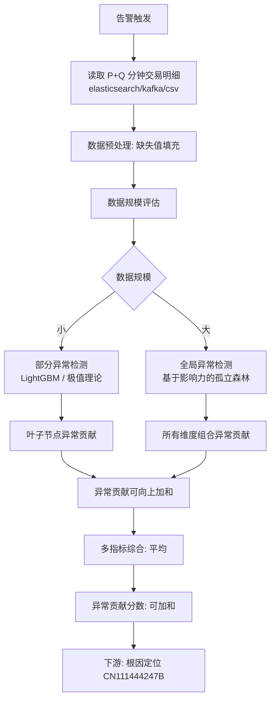
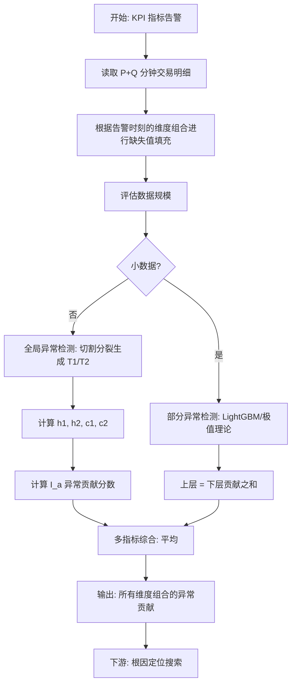

# 一种基于 KPI 指标的多维异常检测方法、装置及存储介质（CN111506637A）

> 申请人：北京必示科技有限公司  
> 申请日：2020-06-17  
> 公开/授权日：2020-08-07  
> IPC分类号：G06F 16/2458 (2019.01); G06F 16/28 (2019.01); G06Q 40/04 (2012.01)  
> 发明人：程博、成逸然、张文池、李则言、隋楷心、刘大鹏  
> 关联文档：同目录下 `CN111506637A.pdf`

## 一、文档信息速览

| 字段 | 值 |
|---|---|
| 专利号 | CN111506637A |
| 类型 | 发明专利申请（A） |
| 申请号 | 202010551259.0 |
| 申请日 | 2020-06-17 |
| 公开号 | CN111506637A |
| 公开日 | 2020-08-07 |
| 申请人 | 北京必示科技有限公司 |
| 发明人 | 程博、成逸然、张文池、李则言、隋楷心、刘大鹏 |
| IPC | G06F 16/2458; G06F 16/28; G06Q 40/04 |
| 法律状态 | 发明专利申请公开 |

## 二、背景（Background）

KPI 指标（交易量、交易成功率、网页访问量等）与多维属性（如源系统、交易类型、交易渠道等），是金融行业常见而重要的业务监测指标。当一个指标的总体值发生异常时，运维人员希望在一个巨大的多维搜索空间内快速准确地定位出根因的属性组合。**这对于传统的运维来说是一个极大的挑战**。

虽然目前也有一些通过机器学习来定位的算法和系统，但这些方法往往并不通用和可靠：

- 它们都受到不实际的根因假设的影响、进行了过于暴力的剪枝；
- 只处理基础类型的指标（交易量等），而不处理派生的测量值（成功率等）；
- 大部分都需要手动微调参数，或者速度太慢。

目前针对业务指标多维分析的算法（系统）主要有 Adtributor、IDice、Hotspot、Squeeze 等，大多方法主要为理论推导，离实际落地还有一定的距离：

- **HotSpot 和 Squeeze** 都假设预测值准确，再进行后续的搜索步骤，这在现实中是难以达到的，预测/异常检测的准确性会直接决定后续根因分析的结果。
- **Adtributor** 只假设根因是一维，而这样的假设不适合当前复杂的微服务系统。Adtributor 对结果仅依据奥卡姆剃刀原则保留最简洁的那一个。
- **IDice** 针对的是一段时间序列的根因定位，事先并不清楚异常的时间点，和本发明的场景不同。同时 IDice 采用了极其暴力的剪枝策略去减小搜索空间，用 GLR (Generalized Likelihood Ratio) 进行异常检测（如直接去掉小于某个阈值的节点——支持度），这样的剪枝会影响上层节点的根因判断。本质上更像是在对时间序列进行多维洞察，而不是准确的根因定位。
- **Adtributor 和 Squeeze** 虽然可以对派生指标进行根因定位，但是并不能做到跨指标的根因排序。
- 在实际的应用场景中，维度变化、取值数量变化以及数据组成变化都会影响资源的使用，之前的算法都没有针对不同数量级的数据做针对性处理，**在数据量过大的时候容易导致内存溢出**等问题。

## 三、目的（Purpose / Problems Solved）

本发明是一种"**多维度、适当剪枝的异常自动检测方法**"（Volcano 异常检测部分），目标是：

- **与指标含义无关**：在交易量、成功率、响应时间等多个 KPI 同时异常时给出统一的异常得分；
- **支持 10 维以上**：典型分析的结果超过 3 维，是一套可实践的方法；
- **派生指标支持**：充分考虑派生测量值（成功率等）的影响，结果更精确；
- **数据规模自适应**：根据数据规模选择"部分异常检测"（LightGBM / 极值理论）或"全局异常检测"（基于影响力的孤立森林）；
- **可向上加和**：异常贡献分数可向上加和，让下游根因定位算法（CN111444247B）可以做"先聚合后搜索"。

## 四、核心原理（Principles）

### 4.1 系统总览

本发明分两个层次的异常检测：

1. **部分异常检测**：仅对叶子节点（最细粒度的维度组合）进行异常检测，上层节点（父级维度组合）的异常贡献 = 下层节点异常贡献之和。方法：LightGBM / 极值理论。
2. **全局异常检测**：对所有维度组合都做异常检测，使用基于影响力的算法（孤立森林的变体）。方法：见 §4.3。

### 4.2 关键概念

- **维度组合**：KPI 指标在若干维度（源系统、交易类型、交易渠道等）上的笛卡尔积下的一个具体取值组合。
- **叶子节点 / 上层节点**：见 CN111444247B。
- **P+Q 分钟窗口**：P 表示警告前的一段时间，Q 表示警告后的一段时间。
- **缺失值填充**：根据告警发生时刻的维度组合对其他时间的 P+Q 分钟维度组合进行填充。
- **KPI 单指标特征类型**：用于描述一条 KPI 时序片段的统计特征，包括均值、标准差、极限值、当前维度出现频率、当前维度逆文本频率指数、一阶自相关系数、线性强度、曲率强度、光谱熵、残差变化标准差、交叉点个数、与前面点的差值、趋势性、周期性、杂乱性等。
- **孤立森林切割分裂**：本发明用"切割分裂"生成二叉树。
- **部分 vs 全局**：数据规模小、维度少时用部分异常检测加速；数据规模大、维度多时用全局异常检测。

### 4.3 数学原理

#### 4.3.1 KPI 单指标特征类型

对单指标数据历史情况提取出以下特征（表 1）：

| 类别 | 特征 |
|---|---|
| 基础统计 | 均值 (mean)、标准差 (std)、极限值 (max/min) |
| 频率类 | 当前维度出现频率 (tf)、当前维度逆文本频率指数 (idf) |
| 形状 | 一阶自相关系数、线性强度 (linearity)、曲率强度 (curvature) |
| 复杂度 | 光谱熵 (spectral entropy)、残差变化标准差、交叉点个数 |
| 局部 | 与前面点的差值 |
| 动态 | 趋势性、周期性、杂乱性 |

针对不同单指标的 KPI 公共特征，还会添加部分特征进来。

#### 4.3.2 全局异常检测：切割分裂生成孤立树

利用滑动窗口，提取某一指标当前全部明细数据，即所有维度组合时间序列（P+Q）上每一个点的特征值，记为 `X = {x₁, x₂, …, xₙ}`。对给定训练集 X：

```
S1021  提取训练集 X
S1022  在 X 中随机抽取 k 个样本点构成 X 的子集 X_k
S1023  每次随机从 X_k 中指定一个特征值 q，随机产生一个切割点 p
S1024  指定特征值 < p 的样本放入左子节点，>= p 的放入右子节点
S1025  在左、右子节点重复 S1024，直到所有叶子结点只有一个样本点或到达指定层数
S1026  停止分裂，生成 1 棵二叉树；指定的特征值 q 遍历每一个特征类型后生成 t₁ 棵二叉树，记为 T₁
```

得到 T₁。然后提取除当前维度组合 Y 之外的其他明细数据的特征集合 `X-Y`，重复上述训练步骤得到 T₂。

对需要进行异常检测的维度组合，将该维度组合的子节点的 xᵢ 特征向量分别带入 T₁ 和 T₂，计算该子节点在 T₁ 和 T₂ 中的平均高度 h₁ 和 h₂（树的度数 / 最短路径）。所有子节点在 T₁ 和 T₂ 中的平均高度记为 c₁ 和 c₂（加权平均得到）。

#### 4.3.3 异常贡献分数

定义任一维度组合对该单指标的异常贡献为：

$$
I_a = \frac{1}{c_1} \sum_i h_1(x_i) - \frac{1}{c_2} \sum_i h_2(x_i)
$$

直觉上：

- 包含 Y 的孤立树（T₁）认为 Y 是"正常模式"时，Y 中的点路径较短（被快速隔离）；
- 不包含 Y 的孤立树（T₂）认为 Y 是"异常模式"时，Y 中的点路径较短；
- T₁ 和 T₂ 高度差越大，Y 的异常贡献越大。

#### 4.3.4 多指标综合

当异常事故发生，往往多个关联指标异常时，最终得到每个维度组合的异常贡献分数为多个关联指标的影响的**平均值**：

$$
I = \frac{1}{m} \sum_{k=1}^{m} I_{a_k}
$$

#### 4.3.5 可加和性

上层节点的异常贡献 = 下层节点异常贡献之和。这是 Volcano 整套算法可"先聚合后搜索 / 边聚合边搜索"切换的核心数学基础。

### 4.4 与现有技术的差异

| 维度 | 已有方法 | 本发明 |
|---|---|---|
| 检测层次 | 单层 / 全量 | 部分检测 vs 全局检测自适应选择 |
| 指标含义 | 假设预测值准确 | 与指标含义无关，统一异常得分 |
| 派生指标 | 不支持跨指标 | 充分考虑成功率等派生指标 |
| 异常贡献可加和 | 多数不支持 | 强制可加和 |
| 数据规模 | 内存溢出风险 | 自适应 |
| 维度支持 | 较低 | 10 维以上 |

## 五、算法详解（Algorithm）

### 5.1 输入 / 输出

- **输入**：告警前后 P+Q 分钟的交易明细数据（elasticsearch / kafka / csv）
- **输出**：所有维度组合的异常贡献分数（可加和）

### 5.2 全局异常检测伪代码

```python
def global_anomaly_detection(trade_data, dims, kpis, P=5, Q=5):
    """全局异常检测"""
    # 数据预处理: 缺失值填充
    trade_data = fill_missing(trade_data, alert_time=now(), dims=dims)

    # 单指标特征类型定义
    feature_types = ['mean', 'std', 'max', 'min', 'tf', 'idf',
                     'autocorr', 'linearity', 'curvature',
                     'spectral_entropy', 'residual_std', 'crossing_points',
                     'prev_diff', 'trend', 'periodicity', 'randomness']

    anomalies = {}  # {dim_combo: {kpi: anomaly_score}}
    for kpi in kpis:
        # 提取该 KPI 所有维度组合的 P+Q 分钟特征值
        for combo in all_combos:
            series = trade_data[kpi][combo]  # 长度为 P+Q 分钟
            X = [extract_features(window, feature_types)
                 for window in sliding_window(series)]

            # T1: 含当前维度组合
            T1 = build_isoforest(X)  # t1 棵二叉树
            # T2: 不含当前维度组合
            X_minus_Y = [extract_features(window, feature_types)
                         for window in sliding_window(series_without_combo)]
            T2 = build_isoforest(X_minus_Y)  # t2 棵二叉树

            # 计算 h1, h2, c1, c2
            c1 = avg_path_length(T1)  # T1 所有叶子的平均高度
            c2 = avg_path_length(T2)  # T2 所有叶子的平均高度
            h1_sum = sum(path_length(T1, xi) for xi in X)  # 当前子节点在 T1 的高度之和
            h2_sum = sum(path_length(T2, xi) for xi in X)

            # 异常贡献分数
            I_a = h1_sum / c1 - h2_sum / c2
            anomalies[combo][kpi] = I_a

    # 多指标综合: 平均
    for combo in all_combos:
        anomalies[combo] = mean(list(anomalies[combo].values()))
    return anomalies


def partial_anomaly_detection(trade_data, dims, kpis, P=5, Q=5):
    """部分异常检测: 仅对叶子节点"""
    # 方法 1: LightGBM (训练数据足够多时)
    if enough_data:
        model = LightGBM()
        model.fit(train_data)
        for combo in leaf_combos:
            anomalies[combo] = model.predict(trade_data[combo])

    # 方法 2: 极值理论 (有的时间序列没有可见规律性时)
    elif irregular:
        threshold = compute_pot_threshold(history)
        for combo in leaf_combos:
            anomalies[combo] = 1 if exceeds_pot_threshold(series, threshold) else 0

    # 上层节点的异常贡献 = 下层节点异常贡献之和
    for upper_combo in non_leaf_combos:
        children = get_children(upper_combo)
        anomalies[upper_combo] = sum(anomalies[c] for c in children)
    return anomalies
```

### 5.3 关键数学

- **切割分裂 + 孤立森林高度差**：见 §4.3.2。
- **异常贡献可加和**：$$I(\text{parent}) = \sum I(\text{child})$$。
- **多指标平均**：见 §4.3.4。

### 5.4 复杂度分析

- 切割分裂：O(t × k × log n) per tree
- 孤立森林高度计算：O(n × t × log n)
- 异常贡献分数：O(N_combos × N_kpis)
- 部分检测（LightGBM）：O(N × d × T)

## 六、系统架构图（Architecture）



## 七、流程图（Process Flow）



## 八、关键创新点（Key Innovations）

- **+ 部分 vs 全局自适应**：根据数据规模选择检测策略，避免大数据集内存溢出。
- **+ 切割分裂 + 孤立森林高度差**：用 T₁（包含 Y）和 T₂（不包含 Y）的高度差定义"影响力"，是无监督的、不依赖预测值准确的。
- **+ KPI 单指标 16 类特征**：覆盖基础统计、频率、形状、复杂度、局部、动态六大类，让孤立森林在每个特征维度都能切分。
- **+ 异常贡献可加和**：是 Volcano 整套"先聚合后搜索 / 边聚合边搜索"切换的数学基础。
- **+ 多指标综合平均**：支持交易量 + 成功率 + 响应时间等多个 KPI 同时异常时给出统一的异常得分。
- **+ 缺失值填充**：让"维度组合在不同时间的样本量"对齐，避免采样不齐导致异常检测偏差。

## 九、权利要求摘要（Claims Summary）

- **独立权利要求 1（方法）**：获取告警前后 P+Q 分钟数据 → 缺失值填充 + 评估 → 部分或全局异常检测。
- **权利要求 2（全局异常检测）**：S101 特征定义 → S102 T₁ 训练 → S103 T₂ 训练 → S104 计算 c₁/c₂ → S105 计算 Iₐ → S106 多指标重复。
- **权利要求 3（特征类型）**：16 类 KPI 单指标特征。
- **权利要求 4（切割分裂）**：S1021-S1026 子步骤。
- **权利要求 5（异常贡献）**：$$I_a = h_1 \cdot /c_1 - h_2 \cdot /c_2$$。
- **权利要求 6（部分检测方法）**：LightGBM / 极值理论。
- **权利要求 7（数据源）**：elasticsearch / kafka / csv。
- **权利要求 8（装置）**：警告模块 + 数据读取 + 数据预处理 + 数据评估 + 异常检测模块（部分 + 全局）。
- **权利要求 9（介质）**：计算机可读存储介质。

## 十、应用场景（Use Cases）

1. **金融支付系统多维异常检测**：交易量、成功率、响应时间三个 KPI 同时异常时，给出每个维度组合的统一异常得分。
2. **大型电商大促保障**：大促期间 GMV、订单数、转化率多维异常检测。
3. **银行核心系统**：日终批处理期间账户、交易类型、渠道多维异常检测。
4. **派生指标监控**：成功率这种不可加和指标，本发明的多指标综合能力能涵盖。
5. **多维数据规模自适应**：从几十 GB 到几百 GB 的交易明细数据都能跑。

## 十一、相关专利（Related Patents in this set）

- **CN111444247B** — KPI 根因定位：本发明是它的"前置"，提供所有维度组合的异常贡献分数作为输入。
- **CN110532550A** — 日志词频树：日志层面的预处理。
- **CN111597070B** — 故障定位方法：基于调用图传播，与本发明互补。
- **CN110837953A** — 异常实体定位：在实体层面的定位。

## 十二、术语表（Glossary）

- **KPI（Key Performance Indicator）**：业务关键性能指标。
- **维度（Dimension）**：KPI 的属性，如源系统、交易类型、交易渠道。
- **维度组合（Dimension Combination）**：KPI 在多个维度上的具体取值组合。
- **可加和 KPI**：可以按维度直接相加的指标。
- **不可加和 KPI**：不能按维度直接相加的派生指标。
- **LightGBM（Light Gradient Boosting Machine）**：轻量级梯度提升机算法，速度快、内存低、精度好、分布式。
- **极值理论（POT 模型）**：见 CN111309565B 相关说明。
- **孤立森林（Isolation Forest）**：见 CN111309565B 相关说明。
- **切割分裂**：本发明借鉴孤立森林思路的随机切分方法。
- **异常贡献分数 Iₐ**：本发明定义的核心输出。

## 十三、参考与延伸阅读

- 同族授权专利 CN111444247B 给出了本发明的下游（根因定位）。
- LightGBM 算法可参考 Ke et al., "LightGBM: A Highly Efficient Gradient Boosting Decision Tree" (NeurIPS 2017)。
- 孤立森林可参考 Liu, Ting, Zhou, "Isolation Forest" (ICDM 2008)。
- 借鉴的多维异常检测方法：Adtributor (KDD 2014)、HotSpot (ICDE 2018)、Squeeze (VLDB 2019)。
