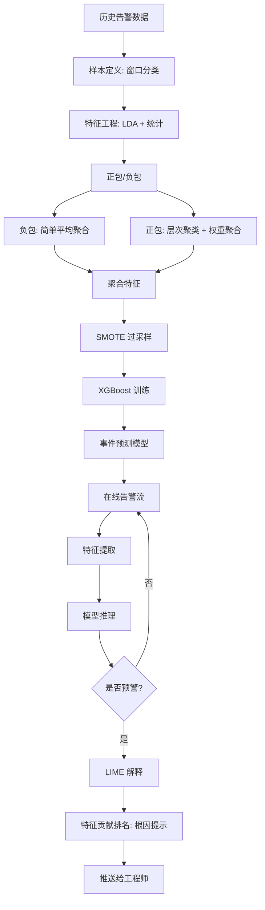
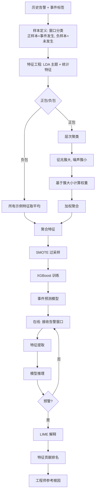

# 一种告警预测方法、装置、电子设备及存储介质（CN111539493A）

> 申请人：北京必示科技有限公司  
> 申请日：2020-07-08  
> 公开/授权日：2020-08-14  
> IPC分类号：G06K 9/62 (2006.01)  
> 发明人：赵能文、隋楷心、张文池、程博、聂晓辉、刘大鹏  
> 关联文档：同目录下 `CN111539493A.pdf`

## 一、文档信息速览

| 字段 | 值 |
|---|---|
| 专利号 | CN111539493A |
| 类型 | 发明专利申请（A） |
| 申请号 | 202010653081.0 |
| 申请日 | 2020-07-08 |
| 公开号 | CN111539493A |
| 公开日 | 2020-08-14 |
| 申请人 | 北京必示科技有限公司 |
| 发明人 | 赵能文、隋楷心、张文池、程博、聂晓辉、刘大鹏 |
| IPC | G06K 9/62 |
| 法律状态 | 发明专利申请公开 |

## 二、背景（Background）

在线服务系统（网上购物、网银、搜索引擎）已经成为日常生活不可或缺的一部分。尽管大量的工作已经专注于服务运维和服务质量保证上，但是由于服务的大规模和复杂性，事件（服务意外中断）总是不可避免的，会导致系统不可用和巨大的经济损失。比如亚马逊在 2018 年 Prime 活动日一小时的宕机时间会影响 100 万美元的收入。

为了减少事件带来的影响，有两种常用的方式：

1. **事前预测**：在事件发生之前提前预测，从而采取措施规避故障；
2. **事后止损**：事件发生之后及时采取止损和定位措施。

本发明主要聚焦在第一种——**事件预测可以直接避免故障的发生**。

### 2.1 学术界限制

学术界现有的事件/故障预测方法主要有以下几个限制：

- 大多数方法专门为某一种故障设计（比如磁盘故障、节点故障、交换机故障），**不具备泛化性**；
- 这些方法大多利用指标和日志数据来提取有预测作用的征兆特征，但是对大规模的系统来说，每天会产生数十 TB 的日志和几千条的指标数据，因此基于指标和日志数据的预测模型**承受着非常大的训练开销**；
- 目前有相关方法提出用轻量级的告警数据来做事件预测，但表现不太理想，因为**仅仅考虑了每类告警的数量作为特征**。

### 2.2 工业界限制

工业界也有用告警数据做事件预测的实践，主要包括以下两种：

**基于专家知识和运维经验的规则方法**：总结事件预测的规则，如果线上告警满足了某一规则，就认为要发生对应的事件。如"当前窗口内的告警至少出现 TCP 无应答关键字一次，且持续 3 分钟，涉及 3 个服务器，告警的严重性是二级，就认为可能会发生服务器宕机事件"。**但是在实际中表现得不好，经常会出现误报和漏报**。因为：
- 维护和制定这些规则需要足够的运维经验，且耗费时间；
- 不同工程师制定规则的偏好不一样，很难有统一的标准；
- 服务系统总是会经历不停的变更迭代，固定的规则不能适应动态的环境。

**基于频繁项集挖掘（如 FP-growth）的方法**：对于历史上的事件 I，把每次 I 发生之前一段时间内的告警数据取出来做频繁项集挖掘，如果告警 A 每次都出现在事件 I 之前，那么就可以用告警 A 来预测事件 I。但是基于工程师的反馈，**这类方法只能覆盖极小部分的事件**，由于告警数据的复杂性和告警内容中混在的参数，大多数事件都没有对应的频繁项告警，因此这类方法在实际中的实用性不高。

## 三、目的（Purpose / Problems Solved）

- **通用的告警预测方法**：不针对某一种特定故障，对所有事件都通用。
- **轻量化**：用告警数据（每天几条到几十条）而不是指标/日志（每天 TB 级别）做预测，训练开销小。
- **抗噪声**：用多示例学习（MIL）解决告警中的"噪声告警淹没征兆告警"问题。
- **类别平衡**：用 SMOTE 过采样解决事件样本极度不平衡（事件远少于正常时段）的问题。
- **可解释**：用 LIME 给每次预测结果提供特征贡献排名，让工程师知道"为什么预测要发生事件"以及"事件根因可能是什么"。

## 四、核心原理（Principles）

### 4.1 系统总览

把事件预测问题定义为**窗口分类问题**：

- 在当前时刻 t，回溯历史上的一段窗口（观测窗口）；
- 基于这个窗口内的告警数据，预测在未来一段时间（预测窗口）内是否会出现某个事件；
- 如果出现了，这个窗口是正样本；如果没有出现，这个窗口是负样本。

修复事件是留给工程师的修复时间，即一旦给出了预警，工程师需要一段时间来采取规避措施。

### 4.2 关键概念

- **观测窗口（Observation Window）**：在当前时刻 t 之前的一段历史窗口，从中提取告警特征。
- **预测窗口（Prediction Window）**：在观测窗口之后的一段未来时间窗，是预测目标。
- **正样本 / 负样本**：在观测窗口之后、预测窗口之内发生了事件 → 正样本；没发生 → 负样本。
- **多示例学习（Multiple Instance Learning, MIL）**：把一个大的窗口（包）拆分成几个小的窗口（示例），在每个小的窗口上提取特征，通过特征聚合得到大窗口的特征。
- **包（Bag）**：一个观测窗口整体。
- **示例（Instance）**：包内的一个小子窗口。
- **LDA（Latent Dirichlet Allocation）**：主题模型，本发明用于提取告警文本特征。
- **XGBoost（eXtreme Gradient Boosting）**：一种基于回归树的集成模型。
- **SMOTE（Synthetic Minority Over-sampling Technique）**：合成少数类过采样技术。
- **LIME（Local Interpretable Model-agnostic Explanations）**：本地可解释模型无关的解释。
- **征兆告警 vs 噪声告警**：征兆告警是与事件发生有关的告警；噪声告警是无关的常规告警。

### 4.3 数学原理

#### 4.3.1 多示例学习

多示例学习假设：负包里包含的示例的标签都是负的，而正包里的示例至少有一个是正的：

$$
Y = \max_i y_i, \quad y_i \in \{0, 1\}
$$

对于事件预测，这种假设符合常理，因为事件前的窗口总是包含一条征兆告警的；而普通的窗口一般都是没有征兆信息的。

#### 4.3.2 负包特征

对负包（窗口内没有征兆信息），直接对所有示例特征取平均得到负包特征：

$$
F_{\text{neg}} = \frac{1}{m} \sum_{i=1}^{m} f_i
$$

#### 4.3.3 正包特征

对正包，使用聚类方法（层次聚类）区分征兆示例和噪声示例。基于假设：**征兆示例在多个正包中出现，因此聚类后形成较大的簇；噪声示例随机分布，因此聚类后形成若干个小的簇**。

对示例 $X_i$，其标准化权重 $w_i$ 为：

$$
w_i = \frac{\text{cluster\_size}(X_i)}{\sum_{j=1}^{n} \text{cluster\_size}(X_j)}
$$

包聚合后的特征：

$$
F_{\text{pos}} = \sum_{i=1}^{n} w_i \cdot f_i
$$

#### 4.3.4 XGBoost 分类

XGBoost 是基于回归树的集成模型，核心思想：

1. 不断地添加树，不断地进行特征分裂来生长一棵树，每次添加一个树其实是学习一个新函数 $f(x)$ 去拟合上次预测的残差；
2. 当训练完成得到 k 棵树，预测一个样本的分数时，根据样本特征在每棵树中落到对应的叶子节点，每个叶子节点对应一个分数；
3. 最后将每棵树对应的分数加起来就是该样本的预测值。

#### 4.3.5 LIME 解释

LIME 数学表示：

$$
\xi(x) = \arg\min_{g \in G} L(f, g, \pi_x) + \Omega(g)
$$

对于一个测试数据 $x$ 的解释模型 $g$，通过最小化损失函数来比较近似模型 $g$ 和原模型 $f$ 的近似性。$\Omega(g)$ 代表解释模型 $g$ 的模型复杂度，$G$ 表示所有可能的解释模型（例如想用线性模型解释，则 $G$ 表示所有的线性模型），$\pi_x$ 定义了 $x$ 的邻域。

### 4.4 与现有技术的差异

| 维度 | 已有方法 | 本发明 |
|---|---|---|
| 数据源 | 指标/日志（重） | 告警（轻） |
| 抗噪声 | 仅靠告警数量 | 多示例学习聚类权重 |
| 样本平衡 | 未处理 | SMOTE 过采样 |
| 通用性 | 单一故障 | 通用事件预测 |
| 可解释性 | 黑盒 | LIME 特征贡献排名 |

## 五、算法详解（Algorithm）

### 5.1 输入 / 输出

- **输入**：历史告警数据（包括告警时间、告警内容、严重性等）+ 事件标签
- **输出**：未来一段时间内是否会发生事件的预测（预警信号 + 特征贡献排名）

### 5.2 伪代码

```python
def alert_prediction(alert_data, event_labels, k_topics=20):
    # === 阶段 0: 样本定义 ===
    bags = []
    for t in time_windows:
        bag = get_alerts_in_window(t)  # 观测窗口内的告警
        # 未来一段时间内事件是否发生?
        label = 1 if any_event_in(event_labels, t, t + predict_window) else 0
        bags.append((bag, label))

    positive_bags = [b for b in bags if b.label == 1]
    negative_bags = [b for b in bags if b.label == 0]

    # === 阶段 1: 特征工程 ===
    # 文本特征: LDA 主题
    lda = LDA(n_topics=k_topics)
    lda.fit(all_alert_text)
    # 统计特征: 告警数量、时间、间隔
    stat_feat = [count(alerts), timestamp(alerts), interval_stats(alerts)]
    # 拼接
    for bag in bags:
        bag.text_feat = lda.transform(bag.text)  # 长度 k_topics
        bag.stat_feat = stat_feat
        bag.vec = concat(bag.text_feat, bag.stat_feat)

    # === 阶段 2: 多示例学习聚合 ===
    # 负包: 简单平均
    for neg_bag in negative_bags:
        neg_bag.aggregated = mean([inst.vec for inst in neg_bag.instances])

    # 正包: 聚类 + 权重
    all_pos_instances = [inst for bag in positive_bags for inst in bag.instances]
    clusters = hierarchical_cluster(all_pos_instances)
    for inst in all_pos_instances:
        inst.weight = cluster_size(inst.cluster) / sum(cluster_size(c) for c in clusters)
    for pos_bag in positive_bags:
        pos_bag.aggregated = sum(inst.weight * inst.vec for inst in pos_bag.instances)

    # === 阶段 3: 类别平衡 + 训练 ===
    # SMOTE 过采样
    smote = SMOTE()
    X = [b.aggregated for b in bags]
    y = [b.label for b in bags]
    X_balanced, y_balanced = smote.fit_resample(X, y)

    # XGBoost 分类
    xgb = XGBoostClassifier()
    xgb.fit(X_balanced, y_balanced)

    # === 阶段 4: 在线预测 + LIME 解释 ===
    for new_alert_window in stream:
        features = extract_features(new_alert_window, lda, stat_feat)
        pred = xgb.predict(features)  # 预警信号
        if pred == 1:
            # 用 LIME 解释
            explanation = LIME(xgb).explain(features)
            print("事件预警! 特征贡献排名:", explanation.top_features)
            yield (new_alert_window, explanation)
```

### 5.3 关键数学

- **多示例学习聚合权重**：见 §4.3.3。
- **XGBoost 残差拟合**：第 $t$ 棵树拟合前 $t-1$ 棵树的残差。
- **LIME 局部近似**：用线性模型局部近似黑盒模型。

### 5.4 复杂度分析

- LDA 训练：O(N × k_topics × iter)
- 多示例聚类：O(N² log N)（层次聚类）
- XGBoost 训练：O(N × T × d × log N)
- 在线预测：O(d × T × log N)
- LIME 解释：O(N_samples × d)

## 六、系统架构图（Architecture）



## 七、流程图（Process Flow）



## 八、关键创新点（Key Innovations）

- **+ 多示例学习抗噪声**：把"告警淹没"问题形式化为多示例学习问题，通过聚类权重弱化噪声告警、增强征兆告警。
- **+ LDA 主题 + 统计特征融合**：既考虑告警文本的语义信息（主题），也考虑告警的统计信息（数量、时间、间隔），全面刻画。
- **+ SMOTE 过采样**：解决"事件远少于正常时段"的样本不平衡问题。
- **+ XGBoost 分类**：高效集成学习算法，自动 CPU 多线程并行，准确率高。
- **+ LIME 可解释**：每次预测都给出特征贡献排名，让工程师能理解"为什么预警"以及"根因可能是什么"。
- **+ 轻量化**：用告警而非指标/日志，训练开销小，适配大规模生产环境。

## 九、权利要求摘要（Claims Summary）

- **独立权利要求 1（方法）**：多示例学习特征聚合 → 构建事件预测模型 → LIME 解释。
- **权利要求 2（特征）**：文本特征（LDA）+ 统计特征（数量、时间、间隔）。
- **权利要求 3（特征向量）**：拼接文本和统计特征。
- **权利要求 4（多示例学习步骤）**：训练包/示例获取 → 正负包分类 → 负包平均 → 正包聚类 → 权重计算。
- **权利要求 5（正包特征计算）**：权重计算 → 单示例特征加权 → 加和得到正包特征。
- **权利要求 6（预测模型）**：SMOTE + XGBoost。
- **权利要求 7（可解释）**：LIME 给出特征贡献排名。
- **权利要求 8（装置）**：特征处理模块 + 告警预测模块 + 可解释分析模块。
- **权利要求 9（电子设备）**：处理器 + 存储器。
- **权利要求 10（介质）**：计算机可读存储介质。

## 十、应用场景（Use Cases）

1. **慢 SQL 引发的交易响应时间长**：在故障发生前，从数据库相关告警中挖掘征兆信息并成功预警（说明书中场景 1）。
2. **频繁 fullGC 引发交易失败**：基于内存使用率告警和 JVM GC 日志告警预测 Java 堆内存溢出（说明书中场景 2）。
3. **金融交易系统**：提前预测交易失败事件。
4. **电商大促**：提前预测容量瓶颈事件。
5. **银行核心系统**：提前预测跑批失败事件。

## 十一、相关专利（Related Patents in this set）

- **CN111309565B** — 告警处理方法：本发明与之形成"事前预测 + 事后处理"组合。
- **CN111338915B** — 动态告警定级方法：定级后的事件可以反馈到本发明作为新的训练样本。
- **CN110837953A** — 异常实体定位：本发明预测的"事件"可以驱动该方法做进一步定位。
- **CN110532550A** — 日志词频树：本发明的告警文本需要先做模板归一化。

## 十二、术语表（Glossary）

- **事件（Incident / Event）**：服务意外中断或严重异常。
- **观测窗口（Observation Window）**：预测目标之前的一段时间，从中提取特征。
- **预测窗口（Prediction Window）**：观测窗口之后要预测的时间范围。
- **多示例学习（Multiple Instance Learning, MIL）**：一种弱监督学习框架。
- **LDA（Latent Dirichlet Allocation）**：主题模型，用于从文本中提取主题特征。
- **XGBoost（eXtreme Gradient Boosting）**：基于回归树的集成学习算法。
- **SMOTE（Synthetic Minority Over-sampling Technique）**：合成少数类过采样。
- **LIME（Local Interpretable Model-agnostic Explanations）**：本地可解释模型。
- **征兆告警 / 噪声告警**：与事件相关/无关的告警。
- **F-score**：精确率与召回率的调和均值，本发明在 11 个业务系统上平均 F-score 达 0.82。

## 十三、参考与延伸阅读

- 多示例学习可参考 Dietterich et al., "Solving the Multiple Instance Problem with Axis-Parallel Rectangles" (NCA 1997)。
- LDA 主题模型可参考 Blei et al., "Latent Dirichlet Allocation" (JMLR 2003)。
- XGBoost 可参考 Chen & Guestrin, "XGBoost: A Scalable Tree Boosting System" (KDD 2016)。
- SMOTE 可参考 Chawla et al., "SMOTE: Synthetic Minority Over-sampling Technique" (JAIR 2002)。
- LIME 可参考 Ribeiro et al., "Why Should I Trust You? Explaining the Predictions of Any Classifier" (KDD 2016)。
