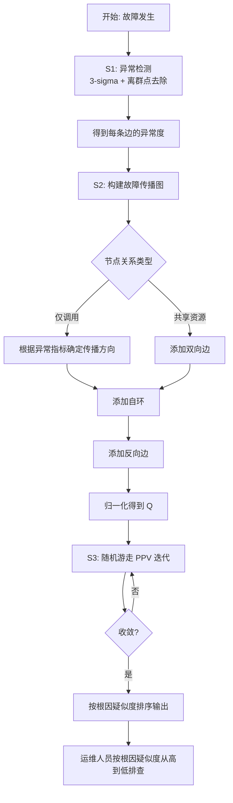

# 一种故障定位方法、装置、电子设备及存储介质（CN111597070B）

> 申请人：北京必示科技有限公司  
> 申请日：2020-07-27  
> 公开/授权日：2020-11-27（授权）  
> IPC分类号：G06F 11/07 (2006.01)  
> 发明人：李则言、张文池、程博、黄成、陈哲康、沈梦家、隋楷心、刘大鹏  
> 关联文档：同目录下 `CN111597070B.pdf`

## 一、文档信息速览

| 字段 | 值 |
|---|---|
| 专利号 | CN111597070B |
| 类型 | 授权发明专利（B） |
| 申请号 | 202010727337.8 |
| 申请日 | 2020-07-27 |
| 公开号 | CN111597070A |
| 公开/授权日 | 2020-11-27 |
| 申请人 | 北京必示科技有限公司 |
| 发明人 | 李则言、张文池、程博、黄成、陈哲康、沈梦家、隋楷心、刘大鹏 |
| IPC | G06F 11/07 |
| 法律状态 | 已授权 |

## 二、背景（Background）

因为在交付、扩容和自动化等方面的优势，**基于服务的系统架构**在大型服务的设计中被越来越多地采用。一个基于服务的系统通常可以具有几十个到几百个的服务，它们部署于成百上千的服务器上。虽然有很多技术应用于这类系统用来保证其质量，但是其中的错误依然是不可避免的。**系统的故障会带来极其巨大的经济损失**。

通常，在每个服务上会部署众多的指标收集器（CPU 使用率、服务响应率、成功率等）和异常检测器，它们被用来检测服务的异常。但是，人工分析系统的故障依然是非常有挑战的。因为在基于服务的系统上，为了完成一个用户的请求，需要许多服务通过相互调用的形式配合实现。因此当一个服务发生故障的时候，会有众多的服务因为依赖关系而也产生异常，发出告警。此时运维人员必须手动逐个查看这些异常的服务，排除掉其中仅仅只是受影响而没有故障的服务，**最终定位到根因服务**。对于大型系统而言，不同的服务可能由不同的运维人员甚至不同的部门管理，所以一次故障会涉及到众多的运维人员和部门参与，定位成本极高。

发明人发现实现自动化定位有以下几个难点：

1. 服务之间有复杂的依赖关系；
2. 基于服务的系统迭代频率高，经常会进行变更；
3. 这类系统上有着海量的指标，和故障有关的指标就会被淹没在海量的指标中。

现有方法需要通过许多过去积累的故障数据和对应的根因（即需要人工标注的标注数据），从中学习才能得到模型，进而定位。

## 三、目的（Purpose / Problems Solved）

- **基于服务调用图的无监督定位**：不需要历史故障数据训练的预训练模型，直接基于实时故障数据定位。
- **多指标综合**：用一条边上的多个指标综合异常度，避免被某个异常指标误导。
- **故障传播方向自适应**：根据指标类型（响应率 vs 总交易量）自动判断故障传播方向（从调用方到服务方 vs 从服务方到调用方）。
- **共享资源关系建模**：在服务之间除了调用关系外，还考虑共享资源（如物理机）的关系，添加双向边。
- **快速稳健**：基于 3-sigma 算法做异常检测，去除离群点，方法稳健快速。
- **随机游走定位**：在故障传播图上做随机游走，计算每个节点的根因疑似度，输出最可能的根因。

## 四、核心原理（Principles）

### 4.1 系统总览

整个方案分为三个步骤：

1. **异常检测**：对故障时段的服务之间的 KPI 进行异常检测，得到每条边的异常度；
2. **构建故障传播图**：根据异常检测结果构建节点（服务）之间的故障传播图；
3. **随机游走定位**：在故障传播图上做随机游走（带反向边和自环），计算每个节点的根因疑似度，输出疑似度最高的节点作为根因。

### 4.2 关键概念

- **服务（Service）**：一个独立的微服务或功能模块。
- **故障传播图 G = (V, E)**：V 是 N 个节点的集合（每个节点是一个服务），E 是边的集合（带异常度 Aᵢⱼ）。
- **3-sigma 算法**：基于高斯分布假设，用均值 ± k·标准差 判定异常。
- **离群点去除**：用历史数据中 5% 分位以下和 95% 分位以上的数据点，避免异常点污染均值/标准差。
- **故障传播方向**：根据异常指标自动确定——故障从源到目的时，传播图边方向是从目的到源。
- **资源共享关系**：服务之间除了调用关系外，共享物理机/资源池的关系。
- **自环（Self-loop）**：每个节点添加一条到自己的边，自环的转移概率由"该节点的后节点最大异常度 − 前节点最大异常度"决定。
- **反向边（Reverse Edge）**：每条边都增加一条反向边，避免随机游走陷入"陷阱"（错误分支）。
- **个性化 PageRank 向量 (PPV, π)**：随机游走迭代的最终稳定分布，给出每个节点的根因疑似度。

### 4.3 数学原理

#### 4.3.1 3-sigma 异常检测

对每一条边的每一个指标，计算异常度：

$$
A^{(m)}_{ij}(t) = \frac{|v_t - \mu_t|}{\sigma_t}
$$

其中：

- A^(m)ᵢⱼ(t) 代表 t 时刻任一边的任一指标的异常度；
- ij 指代任一边，i 和 j 指代任一边的两节点；
- vₜ 是 t 时刻任一指标的观测值；
- μₜ、σₜ 分别是 t 时刻任一指标对应的均值和标准差；
- 均值和标准差通过过去若干个周期同一相位的数据计算（例如当前时刻是周一 13:00，那么取过去 3 周每周周一的 13:00 附近的数据，或过去 7 天每天 13:00 附近的数据）；
- 异常度阈值默认为 3。

选择所有指标异常度的**最大值**作为一条边的异常度，通过异常度的阈值确定每一条边是否异常。

**离群点去除**：在计算 μₜ、σₜ 之前，事先去掉历史数据中**最小的 5% 和最大的 5%** 的数据点。

#### 4.3.2 故障传播图构建规则

- 若节点关系仅为**调用关系**，根据当前的异常指标自动确定故障传播方向，故障传播方向与故障传播图的游走方向**相反**：
  - 故障从目的节点传播到源节点（响应率异常、总交易量正常或变低）→ 传播图上的边的方向是从目的节点到源节点；
  - 故障从源节点传播到目的节点（总交易量异常升高、其他指标正常）→ 传播图上的边的方向是从源节点到目的节点。
- 若节点关系存在**资源共享关系**，故障从一个节点转移到非调用关系的另一个节点。

#### 4.3.3 邻接矩阵与反向边

改进的故障传播图的邻接矩阵：

- Aᵏᵢ 表示从节点 Sk 到节点 Si 的边的异常度；
- Aᵢⱼ 表示从节点 Si 到节点 Sj 的边的异常度；
- 当 i ≠ j 时，给每条边添加反向边，反向边公式中 ρ 表示反向边的权重，**故障传播图越可靠，ρ 相应设置得越小，一般取经验值 0.1**；
- 当 i = j 时，自环公式为：
  $$\text{self-loop} = \max_k A_{ki} - \max_k A_{il}$$
  - max_k Aₖᵢ 表示节点 i 的所有入边的异常度的最大值；
  - max_k Aᵢₗ 表示节点 i 的所有出边的异常度的最大值；
  - 这两个值的差就是自环的异常度，自环的最小值被限制为 0。

对该矩阵做归一化得到转移概率矩阵 Qᵢⱼ：

$$
Q_{ij} = \frac{A'_{ij}}{\sum_k A'_{ik}}
$$

#### 4.3.4 随机游走与 PPV

记 π ∈ (0, 1] (1×N) 是 PPV（personalized PageRank vector，个性化 PageRank 向量），u 为每个节点的异常度向量：

$$
u = \frac{1}{N} A \mathbf{1}
$$

其中 A 是异常度矩阵，**1** 是全 1 向量。物理含义是 A 的每一行求和。PPV 通过如下迭代得到：

$$
\pi_n = \alpha \pi_{n-1} Q_{ij} + (1 - \alpha) u
$$

α 为经验值，πₙ₋₁ 和 πₙ 分别代表 n 次迭代和 n-1 次迭代，取值范围控制随机游走和远距离随机游走的平衡。**故障传播图越可靠，α 可以设置得更大。一般取默认值 α = 0.85 即可**。只要 Qᵢⱼ 是合法的转移概率矩阵，上述迭代式就能收敛。实践中只需要迭代到前后两次迭代的结果变化小于给定的阈值即可。

每个节点是根因的疑似度为 πᵢ，最终算法输出 `reversed(argsort(π))`（即按 πᵢ 降序对所有节点排序），输出排序靠前的节点编号作为根因。

### 4.4 与现有技术的差异

| 维度 | 已有方法 | 本发明 |
|---|---|---|
| 训练数据 | 需要历史故障 + 根因标注 | 无监督，不需训练 |
| 异常检测 | 固定阈值 | 3-sigma + 离群点去除 |
| 故障方向 | 单一方向追溯 | 自适应方向 + 共享资源 |
| 剪枝 | 无 | 自环 + 反向边 |
| 算法 | 调用链追溯 | 随机游走 + PPV |
| 自适应性 | 需重新训练 | 实时基于最新数据 |

## 五、算法详解（Algorithm）

### 5.1 输入 / 输出

- **输入**：故障时段的服务之间的 KPI 数据 + 服务调用关系图 + 服务共享资源关系
- **输出**：按根因疑似度排序的服务节点列表

### 5.2 伪代码

```python
def fault_localization(kpi_data, call_graph, shared_resource_graph):
    """故障定位"""
    # === 步骤 1: 异常检测 ===
    # 去除离群点
    for edge in call_graph.edges:
        for metric in edge.metrics:
            history = get_history(metric, t)
            history_clean = remove_outliers(history, low=0.05, high=0.95)
            mu, sigma = mean(history_clean), std(history_clean)
            edge.abnormal_score[metric] = abs(metric.value - mu) / sigma
        # 取最大异常度作为边的异常度
        edge.anomaly = max(edge.abnormal_score.values())
        edge.is_anomalous = (edge.anomaly > threshold)  # 默认 3

    # === 步骤 2: 构建故障传播图 ===
    G = build_fault_propagation_graph(call_graph, shared_resource_graph)
    for edge in G.edges:
        # 根据异常指标自动确定传播方向
        if is_response_rate_anomaly(edge):
            # 故障从目的到源
            edge.reverse()
        elif is_volume_anomaly(edge):
            # 故障从源到目的
            pass
        # 共享资源关系: 添加双向边
        if edge in shared_resource_graph:
            G.add_reverse_edge(edge)
            edge.reverse_weight = correlation(edge)

    # === 步骤 3: 随机游走定位 ===
    # 添加自环
    for node in G.nodes:
        succ_max = max(G.successor_edges(node), key=lambda e: e.anomaly).anomaly
        pred_max = max(G.predecessor_edges(node), key=lambda e: e.anomaly).anomaly
        node.self_loop = max(0, succ_max - pred_max)
        G.add_self_loop(node, weight=node.self_loop)

    # 添加反向边（除自环外每条边都加反向边）
    for edge in G.edges:
        G.add_reverse_edge(edge, weight=rho)  # rho 经验值 0.1

    # 归一化得到转移概率矩阵 Q
    Q = normalize_adj(G.adj)

    # 个性化 PageRank 迭代
    u = row_sum(A) / N
    pi = u  # 初始化
    while not converged:
        pi_new = alpha * pi @ Q + (1 - alpha) * u
        if abs(pi_new - pi).max() < epsilon:
            break
        pi = pi_new

    # 输出根因疑似度排序
    root_cause_ranking = sorted(zip(G.nodes, pi), key=lambda x: -x[1])
    return root_cause_ranking
```

### 5.3 关键数学

- **3-sigma 异常度**：见 §4.3.1。
- **自环公式**：$$\text{self-loop}(i) = \max(0, \max_k A_{ki} - \max_k A_{il})$$
- **PPV 迭代**：$$\pi_n = \alpha \pi_{n-1} Q_{ij} + (1 - \alpha) u$$
- **故障方向规则**：
  - 响应率指标异常 + 总交易量正常或变低 → 故障从目的系统传播到源系统（物理机硬件故障导致无响应）
  - 总交易量异常升高 + 其他指标正常 → 故障从服务方传播到调用方（请求过大导致后续被调用服务无响应）

### 5.4 复杂度分析

- 异常检测：O(|E| × |M|)
- 构建传播图：O(|E|)
- 自环 + 反向边：O(|V| + |E|)
- PPV 迭代：O(iter × |V|²)，通常迭代几十次内收敛

## 六、系统架构图（Architecture）

```mermaid
graph TB
    A[故障时段服务间 KPI 数据] --> B[数据预处理: 去除离群点]
    B --> C[异常检测模块<br/>3-sigma 算法]
    C --> D[每条边的异常度]
    D --> E[构建故障传播图]
    E --> F[根据异常指标自适应确定传播方向]
    F --> G[共享资源: 添加双向边]
    G --> H[为每个节点添加自环<br/>转移概率由前后节点异常度差决定]
    H --> I[为每条边添加反向边<br/>rho=0.1]
    I --> J[归一化得到转移概率矩阵 Q]
    J --> K[PPV 迭代<br/>pi = alpha * pi * Q + (1-alpha) * u]
    K --> L[节点根因疑似度]
    L --> M[按疑似度降序输出根因]
```

## 七、流程图（Process Flow）



## 八、关键创新点（Key Innovations）

- **+ 无参数化的定位算法**：不需要预训练模型，直接基于最新数据定位，**对快速迭代的微服务系统特别有效**。
- **+ 3-sigma + 离群点去除**：稳健快速的异常检测，去除历史数据中的离群点。
- **+ 自适应故障传播方向**：根据响应率 vs 总交易量指标类型，自动判断故障传播方向，**比单一方向的调用链追溯更普适**。
- **+ 共享资源关系建模**：在调用图之外加上物理机/资源池共享关系，扩展了图结构。
- **+ 自环机制**：让"自己就是根因"成为随机游走的一种可能结果，避免算法错误地"强迫"游走到邻居。
- **+ 反向边机制**：避免随机游走陷入错误分支（陷阱），提升容错性。
- **+ 个性化 PageRank 迭代**：高效稳定的随机游走实现，每个节点得到一个根因疑似度。

## 九、权利要求摘要（Claims Summary）

- **独立权利要求 1（方法）**：异常检测（每条边所有指标的异常度最大值）→ 构建故障传播图 → 随机游走定位。
- **权利要求 2（异常度计算）**：用指标的观测值、均值和标准差计算。
- **权利要求 3（自环）**：每个节点的自环转移概率由该节点与异常度最大的后节点和前节点的异常度差值决定。
- **权利要求 4（反向游走）**：随机游走包括反向游走。
- **权利要求 5（根因疑似度）**：由转移概率矩阵和该节点的异常度向量决定。
- **权利要求 6（装置）**：异常检测模块 + 构建故障传播图模块 + 根因定位模块。
- **权利要求 7（电子设备）**：处理器 + 存储器。
- **权利要求 8（介质）**：计算机可读存储介质。

## 十、应用场景（Use Cases）

1. **金融交易系统微服务调用链**：支付链路中网关→风控→账户→数据库，物理机故障时本发明能定位到根因服务。
2. **云原生电商系统**：订单服务→库存服务→物流服务，链路中任何一环故障都能被定位。
3. **银行核心系统**：核心系统→前置系统→渠道系统，复杂调用关系的根因定位。
4. **互联网 API 网关**：上游 API → 后端服务 → 数据库，跨服务故障传播定位。
5. **快速迭代的微服务架构**：对版本迭代频繁、不易积累标注数据的系统特别有效。

## 十一、相关专利（Related Patents in this set）

- **CN110837953A** — 异常实体定位：在实体层面定位，本发明在服务调用图层面定位，互为补充。
- **CN111444247B** — KPI 根因定位：在多维搜索空间中定位根因维度组合，本发明在调用图上定位根因服务。
- **CN110532550A** — 日志词频树：日志层面的根因线索。
- **CN111309565B** — 告警处理方法：本发明是它的下游，告警降噪聚类后可以做根因定位。

## 十二、术语表（Glossary）

- **服务（Service）**：一个独立的微服务或功能模块。
- **故障传播图（Fault Propagation Graph）**：节点是服务、边是服务间调用关系的有向图。
- **3-sigma 算法**：基于高斯分布假设的异常检测方法。
- **离群点（Outlier）**：历史数据中的异常点，需要在计算均值/标准差前去除。
- **自环（Self-loop）**：节点到自身的边，表示"自己就是根因"的可能性。
- **反向边（Reverse Edge）**：每条边都加一条反向边，避免随机游走陷阱。
- **PPV（Personalized PageRank Vector）**：个性化 PageRank 向量，衡量节点作为根因的可能性。
- **个性化 PageRank**：带重启项的随机游走迭代。
- **故障传播方向**：故障在调用链中传播的方向（从源到目的 vs 从目的到源）。
- **共享资源关系**：服务之间除调用关系外共享物理机/资源池的关系。

## 十三、参考与延伸阅读

- 3-sigma 算法可参考任何统计过程控制（SPC）教材。
- PageRank 原始论文：Page et al., "The PageRank Citation Ranking" (1998)。
- Personalized PageRank：Haveliwala, "Topic-Sensitive PageRank" (WWW 2002)。
- 故障定位相关工作可参考 Beschastnikh et al., "Leveraging Existing Instrumentation to Automatically Infer Invariant-Constrained Models" (ESEC/FSE 2015)。
