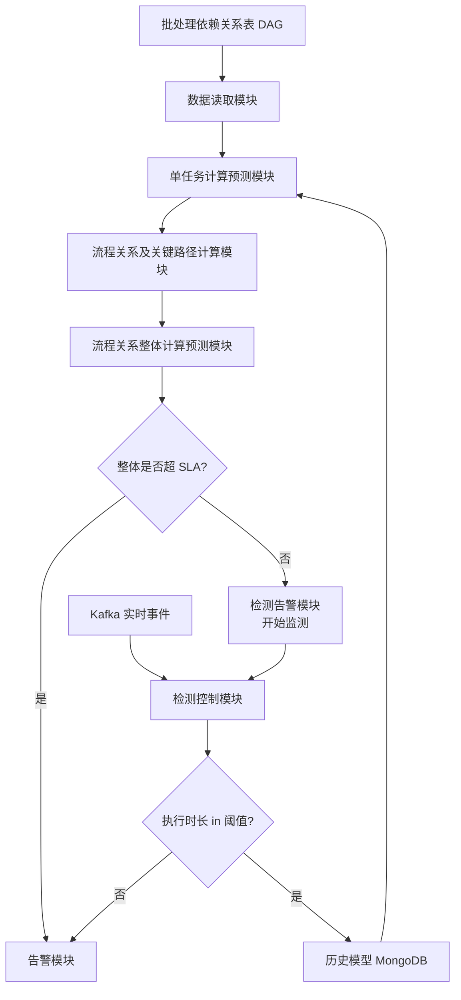
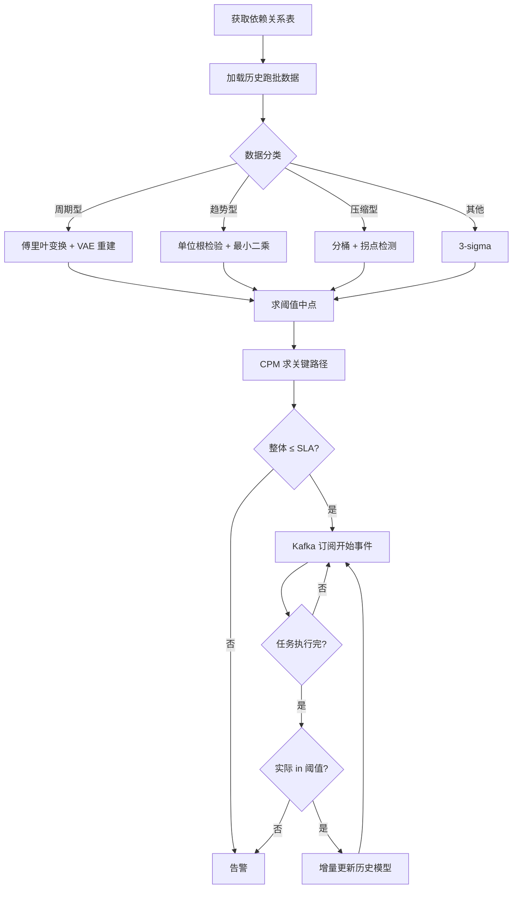

# 批处理任务时间监控方法、装置、电子设备及存储介质（CN111737095B）

> 申请人：北京必示科技有限公司
> 申请日：2020-08-05
> 公开/授权日：2025-01-14
> IPC分类号：G06F 11/30 (2006.01); G06F 11/32 (2006.01); G06F 11/34 (2006.01)
> 发明人：张文池、程博、成逸然、王西平、姚振翮、隋楷心、刘大鹏
> 关联文档：CN111737095B.pdf

## 一、文档信息速览

| 字段 | 值 |
|---|---|
| 专利号 | CN111737095B |
| 类型 | 授权发明专利（B） |
| 申请号 | 202010775307.4 |
| 申请日 | 2020-08-05 |
| 公开号 | CN111737095A |
| 公开/授权日 | 授权日 2025-01-14；申请公布日 2020-10-02 |
| 申请人 | 北京必示科技有限公司 |
| 发明人 | 张文池、程博、成逸然、王西平、姚振翮、隋楷心、刘大鹏 |
| IPC | G06F 11/30; G06F 11/32; G06F 11/34 |
| 法律状态 | 已授权 |
| 专利代理机构 | 北京华创智道知识产权代理事务所（普通合伙）11888 |
| 审查员 | 曹俊杰 |

## 二、背景（Background）

在银行、证券、保险、互联网金融等大型生产系统中，存在大量"批处理任务"（batch job）。这些任务按固定周期（每天、每小时、每周）触发一组 SQL 脚本或 ETL 流程，完成数据备份、业务对账、结息、清算、报表生成等关键工作。一个完整业务链路通常由数十甚至数百个子任务组成，任务之间存在强前序依赖关系——下游任务必须等待所有上游任务执行完毕才可启动。批处理一旦延误，会直接阻塞次日的业务开门、监管报送和客户服务窗口。

传统监控方式依赖运维人员"经验 + 固定阈值"：例如把单任务时长阈值设为历史均值的 2 倍。然而这种做法存在多个顽疾：

1. **数据形态各异**：周报表类任务是明显的"周周期"；数据备份类任务呈"趋势性"；节假日附近呈"压缩型"；偶发慢 SQL 又属于"其他类型"。一刀切的阈值方法无法适配所有形态。
2. **特殊日难处理**：每月第一天、季度末 20 日、春节等特殊日期，跑批行为显著偏离普通日，需要为每类特殊日维护一套独立阈值，工作量极大。
3. **缺乏自适应**：系统管理员甚至对核心系统"一天一设置阈值"；跑批太短往往意味着提前报错退出，但传统方法根本不监控"过短"。
4. **缺乏量化指标**：很多企业没有完整跑批历史统计，只能凭经验判断。

学术界的相关研究（AAAI-2020 云智能研讨会、EDBT-2011 等）多关注资源瓶颈和慢 SQL，对跑批时长的直接预测仍以基础时序算法为主，难以应对金融场景下复杂的数据形态。本发明正是在这一背景下，针对金融行业批处理任务提出的一种"先分类、再分算法、最后用 Spark Streaming 实时闭环"的完整时间监控方案。

## 三、目的（Purpose / Problems Solved）

- **痛点 1（数据形态难识别）**：现有技术不对数据做分类，所有任务都套用同一阈值，预测准确率低。**解决方案**：用傅里叶变换识别周期型、用单位根检验识别趋势型、用数据分桶+假设检验识别压缩型、其余归为其他类型，分类后再各自用专门算法估计阈值。
- **痛点 2（特殊日高误报）**：月末/季末/春节等特殊日任务量与平日差异大，普通阈值会频繁告警。**解决方案**：用 DTW（动态时间规整）做"特殊日相似性匹配"，动态判别当前日属于哪一类特殊日，并切换到对应的历史模式。
- **痛点 3（单任务超时无法关联整体）**：单任务超时是否影响整批时间窗口，需要人工经验。**解决方案**：基于依赖关系表计算"关键路径"，用关键路径上单任务预测时长之和推演整批时长。
- **痛点 4（模型不更新）**：传统方法配置一次就不能动，业务变化后误报率剧增。**解决方案**：通过 Kafka 实时回采每条任务的开始/结束时间，增量更新单任务模型。
- **痛点 5（超时/提前结束需人判断）**：任务提前结束或关键节点超时是否要调整预计完成时间，过去靠人盯。**解决方案**：以"关键节点是否完成"为判定条件，自动调整监测流程的预计结束时间。

## 四、核心原理（Principles）

### 4.1 系统总览

本发明以一个 Spark Streaming 流式任务为核心，串接"单任务预测 → 关键路径聚合 → 整体时长判断 → 实时监测 → 闭环更新"五个环节，实现批处理任务时长的"先预测、再监测、持续学习"。

### 4.2 关键概念

- **单任务预测时长**：单个 SQL 任务在阈值区间内的中间值。
- **关键路径**：依赖关系表中所有连通子图（即一个工作流）内从起点到终点耗时最长的路径。
- **整体预测时长**：关键路径上所有单任务预测时长之和。
- **时间阈值**：单任务的"合理执行时长区间"，不同数据类型用不同算法估计。
- **历史模型**：保存在 MongoDB 中、用于"训练—预测"的统计模型。
- **特殊日**：每月/每季/每年的某一天、春节、普通节日、特殊行为日等。

### 4.3 数据分类与阈值估计

数据先按下面顺序分流：周期型 → 趋势型 → 压缩型 → 其他。

- **周期型**：傅里叶变换，识别频域中是否有显著峰值：

$$
\hat{f}(\xi) = \int_{-\infty}^{+\infty} f(x) e^{-2\pi i x \xi}\,dx
$$

若在"周周期"或"月周期"对应频域出现明显尖峰，则为周期型。阈值用变分自编码器（VAE）重建历史数据，重建误差显著偏大的点即为异常边界。

- **趋势型**：单位根检验（ADF）做平稳性检验，若不平稳且具有单调上升/下降趋势，则为趋势型。阈值用最小二乘估计拟合趋势线，得到预测变量与响应变量的关系：

$$
\hat{\beta} = (X^{\mathrm{T}} X)^{-1} X^{\mathrm{T}} y
$$

- **压缩型**：对历史数据做分桶+假设检验，若分布存在明显断层/拐点，拐点位置即为时间阈值。
- **其他类型**：直接用 3-sigma 准则，时间阈值 = mean ± k·std。

### 4.4 单任务当日跑批时长预测

得到时间阈值后，结合前一天实际跑批时长和"一般变化量"（即 std 范围），通过高斯分布的最大似然估计预测当日时长：

$$
\hat{\mu} = \frac{1}{n}\sum_{i=1}^{n} X_i \quad ,\quad \hat{\sigma}^2 = \frac{1}{n}\sum_{i=1}^{n}(X_i-\hat{\mu})^2
$$

由此得到 $\mathcal{N}(\hat\mu,\hat\sigma^2)$，取阈值区间的中点作为单任务预测时长。

### 4.5 与现有技术的差异

| 维度 | 现有技术 | 本发明 |
|---|---|---|
| 数据形态 | 不分类，统一阈值 | 4 类分流，各自建模 |
| 特殊日 | 人工维护多套阈值 | DTW 自动识别 |
| 关键路径 | 人工评估 | 自动从依赖关系表算出 |
| 模型更新 | 配置一次不更新 | Kafka 实时回流，自动重训 |
| 误报/漏报 | 高 | 商业银行实测误报减少 33% 以上 |

## 五、算法详解（Algorithm）

### 5.1 输入 / 输出

- **输入**：批处理任务依赖关系表 D（节点 = 任务，边 = 依赖），每条任务的历史跑批时长序列 $\{X_i\}$，Kafka 实时事件流。
- **输出**：每个任务单任务预测时长、关键路径上整体预测时长、是否告警、监测流程的预计结束时间、增量更新后的历史模型。

### 5.2 伪代码

```python
def predict_batch(dag, history_db, kafka_stream):
    # Step 1: 加载依赖关系表
    dag = load_dag()

    # Step 2: 单任务预测时长
    pred = {}
    for task in dag.tasks:
        series = history_db.get(task.id)        # 历史跑批时长
        kind = classify(series)                 # 周期/趋势/压缩/其他
        threshold = estimate_threshold(series, kind)
        pred[task.id] = midpoint(threshold)     # 预测时长 = 阈值中点

    # Step 3: 关键路径
    paths = find_connected_subgraphs(dag)
    crit = {}
    for p in paths:
        crit[p] = longest_path(p, edge_weight=pred)   # CPM

    # Step 4: 整体预测时长
    overall = sum(pred[t] for t in crit)
    if overall > SLA_WINDOW:
        alarm(overall)                       # 整体告警
        return

    # Step 5: 实时监测（Spark Streaming）
    for event in kafka_stream:
        if event.type == "START":
            monitor_remaining(event.task, pred, crit)
        elif event.type == "END":
            actual = event.end - event.start
            if within(actual, threshold_of(event.task)):
                history_db.update(event.task, actual)   # 增量学习
            else:
                alarm(event.task, actual)

            # 关键节点超时 / 提前结束
            if is_critical(event.task, dag):
                adjust_expected_end_time(...)
```

### 5.3 关键数学

**傅里叶变换（周期识别）**

$$
\hat{f}(\xi) = \int_{-\infty}^{+\infty} f(x)\,e^{-2\pi i x \xi}\,dx
$$

**最小二乘（趋势型阈值）**

$$
\hat{\beta} = (X^{\mathrm{T}} X)^{-1} X^{\mathrm{T}} y
$$

**高斯 MLE（当日时长）**

$$
\hat{\mu}=\frac{1}{n}\sum X_i,\quad \hat{\sigma}^2=\frac{1}{n}\sum (X_i-\hat{\mu})^2
$$

**DTW（特殊日匹配）**

$$
D(i,j)=\mathrm{Dist}(i,j)+\min\bigl[D(i-1,j),\,D(i,j-1),\,D(i-1,j-1)\bigr]
$$

### 5.4 复杂度分析

- 单任务分类与阈值估计：$O(T)$，$T$ 为历史窗口长度。
- 关键路径：在 DAG 上做 CPM 拓扑 DP，$O(V+E)$。
- 整批预测：$O(|P|)$，$|P|$ 为关键路径节点数。
- Kafka 监测回路：每事件 $O(\log V)$ 查询 + $O(1)$ 更新。

### 5.5 示例

某银行结息跑批包括 4 个任务：A→B→C、D→E（两组并行）。历史 30 天跑批：

| 任务 | 类型 | 阈值中点（min） | 关键路径 |
|---|---|---|---|
| A | 周期型 | 5 | ✓ |
| B | 其他 | 8 | ✓ |
| C | 趋势型 | 12 | ✓ |
| D | 周期型 | 4 |  |
| E | 压缩型 | 6 |  |

关键路径为 A→B→C，整体预测 25 min，SLA 窗口 30 min → 不告警，进入监测。当 Kafka 收到 C 任务实际耗时 18 min（> 阈值 14 min）→ 单任务告警；且 C 是关键节点 → 自动调整整体预计结束时间 +6 min。

## 六、系统架构图（Architecture）



## 七、流程图（Process Flow）



## 八、关键创新点（Key Innovations）

- **+ 数据形态自动分类**：先用傅里叶/单位根/分桶把数据分到 4 类，再针对每类选最合适的算法估计阈值。比起"一刀切"平均阈值，准确率显著提升。
- **+ 关键路径自动聚合**：在依赖关系表上自动做 CPM（关键路径法），把单任务预测时长沿关键路径聚合得到整批时长，并能定位"卡点"任务。
- **+ 特殊日 DTW 自适应**：不需要为每个特殊日单独配置阈值，用 DTW 自动寻找历史最相似的特殊日模式。
- **+ Kafka + Spark Streaming 闭环学习**：每条任务的实际耗时都会回流到 MongoDB，单任务模型自动重训，越用越准。
- **+ 关键节点超时/提前结束的智能处理**：超时则调整预计结束时间；提前结束则判断同层节点是否完成，决定是否下调预计结束时间。

## 九、权利要求摘要（Claims Summary）

- **独立权利要求 1（方法）**：核心流程——加载 DAG → 单任务预测 → 关键路径 → 整体预测 → 超 SLA 告警/正常监测 → Kafka 闭环。
- **从属权利要求 2-5**：数据形态分类（周期/趋势/压缩/其他）的判定流程。
- **从属权利要求 6-7**：特殊日识别（5 类特殊日）+ DTW 算法。
- **从属权利要求 8-10**：超时 / 提前结束的判断与处理。
- **独立权利要求 11（装置）**：数据读取、单任务计算预测、流程关系及关键路径、流程关系整体计算、检测告警、检测控制六大模块。
- **权利要求 12-13**：电子设备（处理器+存储器）和计算机可读存储介质。

## 十、应用场景（Use Cases）

- **商业银行结息/对账批处理**：6 台机器专门跑批，CPU 利用率不超 40%；本方案用 6 核 12G 配置即可完成监控，告警平均提前 23 分钟。
- **证券清算日报**：每个交易日 18:00 触发，22:00 前必须完成；通过关键路径监控保障 SLA。
- **保险公司月结/季结跑批**：月底、季末数据量激增，DTW 自适应"月末特殊日"。
- **互联网金融资金归集**：每天 24:00 触发，需在 02:00 前完成。
- **监管报送类跑批**：合规要求严苛，告警必须可解释、误报率低，本方案给出明确的"超阈值"和"关键节点超时"两类告警。

## 十一、相关专利（Related Patents in this set）

- **CN111858231B** 单指标异常检测：另一种 AIOps 子方向，单指标异常检测。
- **CN112231193A** 时序数据容量预测：和本专利同属"预测+告警"流派，针对容量而非时长。
- **CN112905671A** 时间序列异常处理：基于 RRCF 的异常检测主动学习方法。
- **CN112559237B / CN112559238B** 排障方法：与本专利互补——本专利负责"事前预测"，它们负责"事后定位"。

## 十二、术语表（Glossary）

| 术语 | 解释 |
|---|---|
| 批处理任务 | 按周期定时执行的一组 SQL/ETL 任务，常用于金融对账、报表 |
| 跑批时长 | 一次批处理任务从开始到结束所消耗的时间 |
| 单任务预测时长 | 对单个任务在阈值区间中点所取的预测值 |
| 关键路径 CPM | 在 DAG 中从起点到终点耗时最长的路径 |
| 时间阈值 | 任务"合理执行时长"的上下界 |
| 周期型数据 | 呈明显周/月/年周期的历史时长数据 |
| 趋势型数据 | 单边上升/下降的历史时长数据 |
| 压缩型数据 | 存在分布拐点的历史时长数据 |
| 特殊日 | 节假日、月末、季末等导致跑批行为显著变化的日期 |
| DTW | Dynamic Time Warping，动态时间规整，序列相似度算法 |
| 变分自编码器 VAE | 一种深度生成模型，用于序列重建和异常点检测 |
| 3-sigma | 正态分布下"均值±3倍标准差"作为异常边界 |
| 高斯 MLE | 用最大似然估计从样本中估计高斯分布参数 |

## 十三、参考与延伸阅读

- 阿里 / 美团 / 字节跳动 AIOps 平台白皮书
- Spark Streaming 官方文档
- 《金融行业批处理系统稳定性白皮书》
- 银行数据中心运维管理最佳实践（行业报告）
