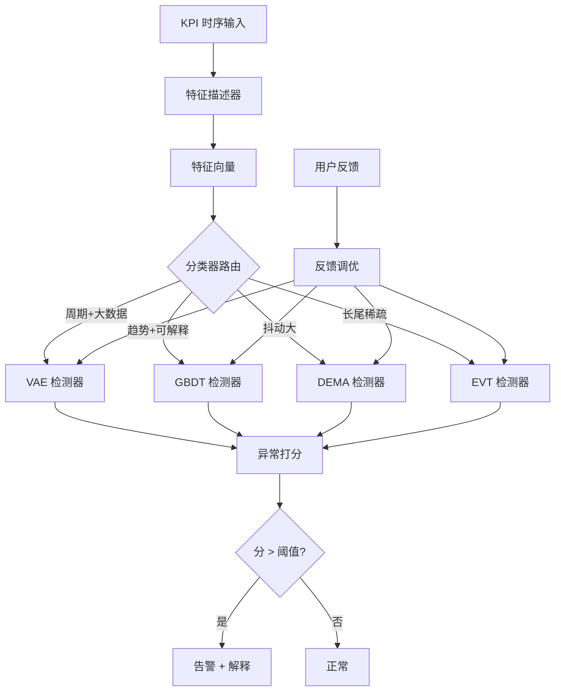
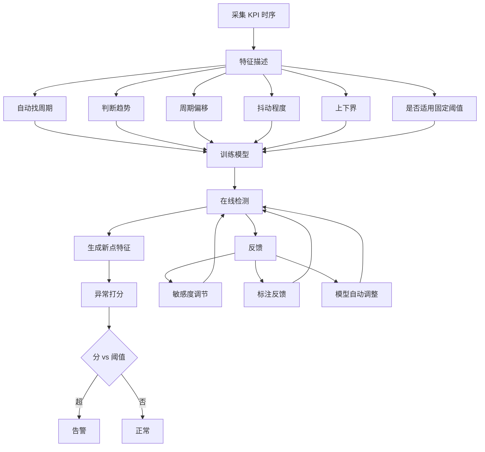

# 一种基于运维监控的单指标异常检测方法（CN111858231B）

> 申请人：北京必示科技有限公司
> 申请日：2020-05-11
> 公开/授权日：2024-07-26
> IPC分类号：G06F 11/30 (2006.01); G06F 18/241 (2023.01); G06F 18/2431 (2023.01); G06N 3/0455 (2023.01)
> 发明人：张文池、刘大鹏、王耀、沈运、朱晶、隋楷心、程博
> 关联文档：CN111858231B.pdf

## 一、文档信息速览

| 字段 | 值 |
|---|---|
| 专利号 | CN111858231B |
| 类型 | 授权发明专利（B） |
| 申请号 | 202010395406.X |
| 申请日 | 2020-05-11 |
| 公开号 | CN111858231A |
| 公开/授权日 | 授权日 2024-07-26；申请公布日 2020-10-30 |
| 申请人 | 北京必示科技有限公司 |
| 发明人 | 张文池、刘大鹏、王耀、沈运、朱晶、隋楷心、程博 |
| IPC | G06F 11/30; G06F 18/241; G06F 18/2431; G06N 3/0455 |
| 法律状态 | 已授权 |
| 专利代理机构 | 山东重诺律师事务所 37228 |
| 审查员 | 陈洋 |

## 二、背景（Background）

在金融、互联网、电信、政企等大型生产环境中，运维监控系统（如 Tivoli、Zabbix、APM、网络抓包、应用埋点等）每天会采集数千万甚至上亿条"时序指标"——每条记录都形如 `(timestamp, value)`。这些 KPI（Key Performance Indicator）曲线的健康状况直接决定业务能否正常运行。一旦指标出现异常抖动、突增、突降，运维人员需要第一时间收到告警，从而止损、诊断、修复。

传统 KPI 异常检测算法大致分为三类：

1. **有监督的机器学习/深度学习**：随机森林、多层感知机等。缺点是依赖大量人工标注，且黑盒模型给出的告警往往难以解释，运维人员不敢轻易信任。
2. **无监督机器学习**：孤立森林、基于密度的聚类等。缺点是检测效果依赖参数调优，对很多形态的 KPI 表现不稳定。
3. **基于预测误差的方法**：线性回归、滑动平均及其变种。缺点是 KPI 形态各异（周期性、趋势性、随机性、稀疏性），一种固定模型难以解决所有问题，且对异常点本身很敏感。

智能异常检测面对的挑战可以归纳为六点：

- 数据量巨大，需要"在线实时"速度；
- 缺乏异常标注，必须"无监督"；
- 检测结果要符合运维人员的实际感知；
- 要"足够准确"，否则误报漏报会让人疲劳；
- KPI 形态各异，算法需要"无调参自适应"；
- 必须能处理实际数据中的"缺失、乱序"。

本发明提出一种"特征描述器 + 检测器 + 分类器"的三段式架构，针对每条 KPI 自动选择最适合的算法（变分自编码器、渐进梯度回归树、差分指数滑动平均、极值理论），做到无标注、可解释、自适应。

## 三、目的（Purpose / Problems Solved）

- **痛点 1（缺标注）**：传统监督方法必须先有大量人工标注。**解决方案**：以"无监督"为核心，4 种算法全部无需标注，特征描述器可自动决定走哪一条算法通路。
- **痛点 2（速度）**：在线实时处理要求毫秒级响应。**解决方案**：用流式增量打分（VAE/差分 EMA），避免每点都做大规模重训。
- **痛点 3（形态适配）**：单一模型对所有 KPI 都不准。**解决方案**：根据"周期性、趋势、抖动、上下界"等特征自动分桶，分类器路由到 4 个算法之一。
- **痛点 4（误报/漏报）**：纯统计规则会产生大量误报。**解决方案**：引入敏感度调节 + 标注反馈，模型自动调整。
- **痛点 5（异常过短）**：瞬时下跌、突增突降这类"形态无可见周期"的场景传统方法会漏。**解决方案**：差分指数滑动平均 + 极值理论（EVT）兜底。

## 四、核心原理（Principles）

### 4.1 系统总览

整个方法分为 5 个步骤，构成一个"训练-检测-反馈"闭环：

1. **S1 特征描述**：对每条 KPI 时间序列，自动判断周期、趋势、周期偏移、抖动、上下界、是否适用阈值方法。
2. **S2 模型训练**：根据特征选用不同的模型组合，训练生成模型。
3. **S3 场景算法选择**：在 4 种算法（VAE、渐进梯度回归树、差分 EMA、极值理论）中动态选择。
4. **S4 在线检测**：生成新点特征 → 异常打分 → 阈值比对 → 输出告警。
5. **S5 反馈调优**：用户反馈（敏感度、标注漏报/误报）→ 模型自动调整。

### 4.2 关键概念

- **特征描述器（Describer）**：从历史数据中提取 KPI 的关键特征。
- **检测器（Detector）**：根据特征训练具体模型。
- **分类器（Classifier）**：在 S1 描述完特征后，把这条 KPI 路由到最合适的算法。
- **VAE 重建误差**：变分自编码器对历史序列做"压缩-重建"，重建误差显著偏大的点视为异常。
- **CoDisp / 评分**：每个时间点对应一个"异常程度分值"，超过阈值即异常。
- **EVT 极值理论**：处理长尾分布的数学工具，用于"非周期性、稀疏大值"场景。

### 4.3 关键数学

**4.3.1 变分自编码器（VAE）**

假设隐变量 $z$ 服从标准正态先验 $p(z)=\mathcal{N}(0,I)$，观测 $x$ 由神经网络参数 $\theta$ 生成；用一个推断网络 $q_\phi(z|x)$ 近似后验 $p(z|x)$。证据下界（ELBO）为：

$$
\mathcal{L}(\theta,\phi;x) = \mathbb{E}_{q_\phi(z|x)}[\log p_\theta(x|z)] - \mathrm{KL}\bigl(q_\phi(z|x)\,\|\,p(z)\bigr)
$$

通过最大化 $\mathcal{L}$ 联合训练 $\theta,\phi$。在异常检测时，对新样本 $x$ 计算重建概率 $p_\theta(x|z)$ 或重建误差 $||x-\hat{x}||$，误差显著偏大即异常。

**4.3.2 渐进梯度回归树（GBDT）**

给定训练集 $\{(x_i,y_i)\}$ 和损失函数 $L(y,f)$，迭代 $m$ 棵决策树，每轮做：

$$
\text{初始化：} f_0(x)=\arg\min_c\sum L(y_i,c)
$$
$$
\text{负梯度：} r_{im}=-\left[\frac{\partial L(y_i,f(x_i))}{\partial f(x_i)}\right]_{f=f_{m-1}}
$$
$$
\text{叶子值：} c_{mj}=\arg\min_c\sum_{x_i\in R_{mj}} L(y_i,f_{m-1}(x_i)+c)
$$
$$
\text{更新：} f_m(x)=f_{m-1}(x)+\sum_j c_{mj}\,\mathbf{1}(x\in R_{mj})
$$

最终 $f_M(x)$ 即预测值；与真实值差距过大即异常。

**4.3.3 差分指数滑动平均（DEMA）**

$$
S_Y[0] = Y[0],\quad S_Y[i] = \alpha Y[i] + (1-\alpha)S_Y[i-1]
$$
$$
D(i) = Y[i]-Y[i-1],\quad s[i] = D(i) - S_D[i]
$$

将 $s[i]$ 视为残差序列，若 $|s[i]|$ 落入正态分布 3-sigma 极值以外则异常。

**4.3.4 极值理论（EVT）**

极值分布形式：

$$
G_\gamma(x) = \exp\bigl(-(1+\gamma x)^{-1/\gamma}\bigr)
$$

使用 Grimshaw 技巧把 $(\gamma,\sigma)$ 两参数问题化为单参数问题，最大化对数似然：

$$
\log L(\gamma,\sigma) = -N\log\sigma - (1+1/\gamma)\sum \log(1+\gamma x_i/\sigma) - \sum (1+\gamma x_i/\sigma)^{-1/\gamma}
$$

在线流式检测时，对分布做动态更新，使阈值随数据漂移自适应。

### 4.4 与现有技术的差异

| 维度 | 监督方法 | 经典无监督 | 本发明 |
|---|---|---|---|
| 标注 | 必需 | 否 | 否 |
| 速度 | 慢 | 中 | 快 |
| 自适应 | 差 | 差 | 强（特征路由） |
| 可解释 | 差 | 差 | 较好（特征+模型） |
| 误报率 | 高 | 中 | 低（带反馈） |

## 五、算法详解（Algorithm）

### 5.1 输入 / 输出

- **输入**：单条 KPI 时序数据（time, value），长度为 $T$。
- **输出**：每点的"异常分数"序列、是否异常的布尔标记、敏感度参数。

### 5.2 伪代码

```python
def detect(kpi):
    # Step 1: 特征描述
    feats = describer.extract(kpi)
    #   - period = find_period(kpi)
    #   - trend  = has_trend(kpi)
    #   - jitter = variance(kpi)
    #   - bound  = upper_lower(kpi)
    #   - thresholdable = is_fixed_threshold_feasible(feats)

    # Step 2: 训练阶段
    if feats.period is not None and len(kpi) > 1000:
        model = VAE(input_dim=feats.dim)
        model.fit(kpi)
    elif feats.trend:
        model = GBDTRegressor().fit(kpi)
    elif feats.jitter:
        model = DifferentialEMA(alpha=0.3).fit(kpi)
    else:
        model = EVT().fit(kpi)

    # Step 3: 在线检测
    scores = []
    for t, x in enumerate(stream):
        s = model.score(x)
        scores.append(s)
        if s > default_threshold:
            alarm(t, x, s)

    # Step 4: 反馈调优
    for fb in feedback_queue:
        if fb.label == "MISS":
            model.adjust(threshold *= 0.9)
        elif fb.label == "FALSE_POS":
            model.adjust(threshold *= 1.1)
```

### 5.3 关键数学（汇总）

- VAE 重建损失：$\mathcal{L}_{\text{ELBO}} = \mathbb{E}_q[\log p_\theta(x|z)] - \mathrm{KL}(q\|p)$
- GBDT 负梯度：$r_{im}=-\partial L/\partial f$
- 差分 EMA：$S_Y[i]=\alpha Y[i]+(1-\alpha)S_Y[i-1]$，$s[i]=D(i)-S_D[i]$
- 极值分布：$G_\gamma(x)=\exp(-(1+\gamma x)^{-1/\gamma})$
- 阈值判断：异常 $\Leftrightarrow$ score > 3·sigma

### 5.4 复杂度分析

- 特征描述：$O(T)$，主要是 FFT、自相关、方差等线性操作。
- VAE 训练：$O(T\cdot d\cdot k)$，$d$ 为隐变量维数，$k$ 为迭代轮数。
- GBDT 训练：$O(T\cdot m\cdot h)$，$m$ 为树数，$h$ 为深度。
- 在线打分：$O(1)$ 每点（VAE 一次 forward、GBDT 一次遍历树、EMA 一次更新、EVT 查表）。
- 反馈调优：阈值或树权重 $O(1)$ 更新。

### 5.5 示例

某电商网站订单量时序（每分钟 1 个点，1 天 1440 点）。特征描述发现：

- 周期 = 1 天（24h 周期）
- 趋势 = 无
- 抖动 = 中等
- 上下界 = 50 ~ 2000 单/分钟

→ 路由到 VAE 模型。训练后模型对 12:00 时刻的突增（3000 单/分钟）给出重建误差 0.85，远超阈值 0.35 → 异常告警。运维人员反馈"是双 12 大促正常流量"→ 系统在反馈模块将该样本标记为非异常，并对 VAE 进行增量微调。

## 六、系统架构图（Architecture）



## 七、流程图（Process Flow）



## 八、关键创新点（Key Innovations）

- **+ 三段式架构**：特征描述器 → 检测器 → 分类器，把"建模"和"路由"解耦，每条 KPI 都得到最匹配的算法。
- **+ 4 算法工具箱**：VAE、GBDT、DEMA、EVT 分别针对"大数据+周期"、"趋势+可解释"、"抖动+短异常"、"长尾稀疏"四大场景。
- **+ 双向特征描述**：自动识别周期、趋势、抖动、上下界共 6 维特征，作为算法路由的"决策变量"。
- **+ 闭环反馈机制**：用户对告警标注（漏报/误报）后，模型自动调整阈值或权重，做到"越用越准"。
- **+ 流式 EVT**：把极值理论的拟合做到在线更新，能适应非平稳分布。

## 九、权利要求摘要（Claims Summary）

- **独立权利要求 1（方法）**：核心步骤 S1-S5；S1 又细分 A1-A6 六个特征；S4 细分 B1-B3；S5 细分 C1-C3；S3 给出 4 种算法及数学定义（VAE、GBDT、DEMA、EVT）。
- **独立权利要求 2（系统）**：特征描述器 + 检测器 + 分类器三段式结构。
- **从属权利要求 3-7**：每个算法的细节公式，包括 VAE 的 ELBO 公式、GBDT 的迭代公式、差分 EMA 的递推、EVT 的 Grimshaw 技巧。

## 十、应用场景（Use Cases）

- **金融支付系统**：每秒上万笔交易，对响应时延、错误率、QPS 等关键 KPI 实时异常检测。
- **电商大促监控**：双 11、618 等大促期间订单量、库存量、退款率等指标自动异常告警。
- **云原生微服务**：K8s 集群中 Pod 的 CPU/内存/网络流量异常检测。
- **电信运营商**：基站接入成功率、掉线率、切换成功率等 KPI 监控。
- **AIOps 一站式平台**：作为核心模块嵌入运维监控平台，对接 Prometheus/Zabbix 等数据源。

## 十一、相关专利（Related Patents in this set）

- **CN111737095B 批处理任务时间监控**：本专利聚焦"任务时长"，本发明聚焦"指标异常"。
- **CN112231193A 时序数据容量预测**：和本发明都属"时序 + 告警"流派。
- **CN112905671A 时间序列异常处理**：本专利是"特征路由 + 4 算法工具箱"，它是"RRCF + 主动学习"路线。
- **CN113434193B 根因变更定位**：与本发明互补，本发明是"在线异常检测"，它是"事后根因定位"。

## 十二、术语表（Glossary）

| 术语 | 解释 |
|---|---|
| KPI | Key Performance Indicator，关键性能指标 |
| 时序数据 | 形如 (时间戳, 数值) 的序列 |
| VAE | Variational Auto-Encoder，变分自编码器 |
| GBDT | Gradient Boosting Decision Tree，梯度提升决策树 |
| DEMA | Differential Exponential Moving Average，差分指数滑动平均 |
| EVT | Extreme Value Theory，极值理论 |
| 特征描述器 | 从历史时序提取关键特征的模块 |
| 分类器 | 根据特征选择算法的路由模块 |
| ELBO | Evidence Lower BOund，证据下界，VAE 训练目标 |
| Grimshaw 技巧 | 把 EVT 两参数优化降为单参数的方法 |
| CoDisp | 异常分数的一种度量 |
| 反馈调优 | 用用户标注反向调整模型阈值或权重 |

## 十三、参考与延伸阅读

- 《Donut: An Unsupervised Anomaly Detection Algorithm for KPI》（VAE 用于 KPI 异常检测）
- 《Opprentice: Towards Practical and Automatic Anomaly Detection》（AIOps 经典论文）
- 阿里 / 字节跳动 AIOps 平台白皮书
- 《Time Series Analysis: Forecasting and Control》（Box-Jenkins 经典时序）
- XGBoost / LightGBM 官方文档
