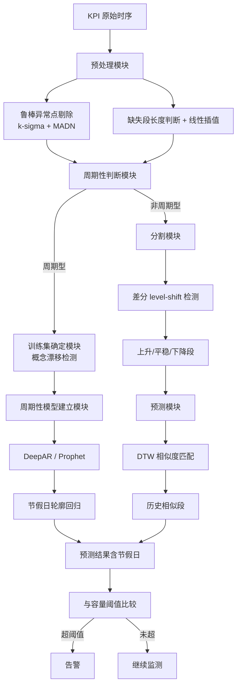
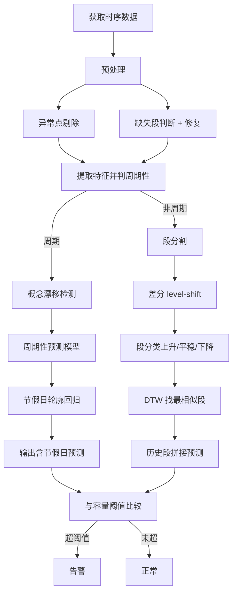

# 时序数据容量预测方法、装置、电子设备及存储介质（CN112231193A）

> 申请人：北京必示科技有限公司
> 申请日：2020-12-10
> 公开日：2021-04-30
> IPC分类号：G06F 11/34 (2006.01); G06K 9/62 (2006.01)
> 发明人：张文池、隋楷心、程博
> 关联文档：CN112231193A.pdf

## 一、文档信息速览

| 字段 | 值 |
|---|---|
| 专利号 | CN112231193A |
| 类型 | 发明专利申请（A） |
| 申请号 | 202011431810.4（PDF 扉页标号，以 PDF 为准） |
| 申请日 | 2020-12-10 |
| 公开号 | CN112231193A |
| 公开日 | 2021-04-30（注：扉页记载 2021-01-15） |
| 申请人 | 北京必示科技有限公司 |
| 发明人 | 张文池、隋楷心、程博 |
| IPC | G06F 11/34; G06K 9/62 |
| 法律状态 | 实质审查中 |
| 专利代理机构 | 北京华创智道知识产权代理事务所（普通合伙）11888 |
| 代理人 | 彭随丽 |

## 二、背景（Background）

在金融、互联网、电信等生产系统中，磁盘容量、文件系统使用率、内存使用率、CPU 使用率、交易笔数等"业务指标"都有一个"安全上界"。一旦逼近或超过上界，业务将面临中断、报错、降级等风险。传统做法是设置固定告警阈值，到达阈值或接近上界时再发出告警——但此时已经"迫在眉睫"，管理员没有时间从容扩容或清理。

更糟糕的是，传统时序预测算法在容量预测场景中遇到多个困难：

- **数据整体平稳 + 某处逐渐走高**：单一模型无法处理这种"先稳后涨"的形态；
- **训练数据存在异常值**：影响模型对正常段的学习；
- **节假日效应**：春节、618、双 11 等会导致指标突变，传统算法处理不够合理；
- **概念漂移**：业务上规模扩张后数据模式明显变化，老模型直接失效；
- **计算资源**：在高准确度要求下，传统机器学习训练时间长、消耗资源多。

本发明针对"未来 3-12 个月某指标是否会突破规划容量"这一问题，提出"先预处理 → 再判周期性 → 分两路建模"的方案：周期型走 DeepAR/Prophet，非周期型走"特征段匹配"。

## 三、目的（Purpose / Problems Solved）

- **痛点 1（异常值污染训练）**：原始时序中混有异常点。**解决方案**：用 k-sigma（归一化中位数绝对偏差 MADN）做鲁棒异常点剔除。
- **痛点 2（缺失段修复）**：采集断点会导致数据缺失。**解决方案**：缺失段 < 12h 用线性插值，> 12h 标记为不修复。
- **痛点 3（概念漂移）**：业务扩张后老模型失效。**解决方案**：用"平均异常程度 + 异常时间槽比例 + 时间戳补正"三维度打分，检测到概念漂移时只取漂移点之后的数据训练。
- **痛点 4（节假日效应）**：春节、618 等会让指标突变。**解决方案**：在历史节假日数据上做"轮廓回归"（值数据 + 残差数据），在预测时把节假日效应"叠加"到平常日预测上。
- **痛点 5（非周期数据预测）**：业务新上线时数据无周期。**解决方案**：用"差分 level-shift 检测"做段分割 + "DTW 相似度匹配"找历史最相似的段，用作未来预测模板。
- **痛点 6（资源消耗）**：传统 LSTM/Prophet 训练慢。**解决方案**：DeepAR 用循环神经网络 + 似然函数，Prophet 用时序分解，特征段匹配只需相似度检索；3 个月分钟级数据，16G 8 核机器上秒级完成。

## 四、核心原理（Principles）

### 4.1 系统总览

系统分两路：

- **周期型数据**：预处理 → 概念漂移检测 → DeepAR 或 Prophet 训练 → 输出含节假日效应的预测 → 与容量阈值比较 → 告警。
- **非周期型数据**：预处理 → 差分 level-shift 段分割 → 上升/平稳/下降特征段 → 在历史中找最相似的特征段 → 预测未来。

### 4.2 关键概念

- **MADN**：归一化中位数绝对偏差，鲁棒统计量，对异常值不敏感，代替标准差做异常点剔除。
- **概念漂移检测**：当近期数据持续偏离历史正常轮廓时，判定业务模式发生变化，训练集只取变化后的最新数据。
- **节假日轮廓回归**：把节前 N 天到节后 N 天的曲线分段保存为"高百分位 + 低百分位"的轮廓，未来预测时把节假日效应叠加。
- **DeepAR**：基于 RNN 的概率预测模型，输出预测值的概率分布。
- **Prophet**：基于时序分解（季节项 + 趋势项 + 节假日项 + 剩余项）的预测库。
- **STL 分解**：Seasonal and Trend decomposition using Loess，简化版时序分解。
- **特征段匹配**：把非周期序列切分为"上升/平稳/下降"段，每段记录类型、幅度、时间跨度，用 DTW 在历史中找最相似的 N 段拼成预测模板。

### 4.3 关键数学

**4.3.1 鲁棒异常点剔除（k-sigma with MADN）**

$$
\text{MADN} = 1.4826 \cdot \mathrm{median}_i\bigl(|X_i - \mathrm{median}(X)|\bigr)
$$
$$
\text{异常} \iff \bigl|X_i - \mathrm{median}(X)\bigr| > k \cdot \mathrm{MADN}
$$

**4.3.2 周期性判别（自相关系数 ACF）**

设 $\{X_t\}$ 为时序，ACF 在滞后 $k$ 处为：

$$
\rho(k) = \frac{\sum_{t=1}^{T-k}(X_t-\bar X)(X_{t+k}-\bar X)}{\sum_{t=1}^{T}(X_t-\bar X)^2}
$$

若 $\rho(T_{\text{周}})$ 高于参考阈值且 > 3× 半周期 ACF，则判定为周周期。

**4.3.3 概念漂移分数**

$$
\text{score} = w_1 \cdot \overline{\text{anomaly\_degree}} + w_2 \cdot \text{abnormal\_timeslot\_ratio} + w_3 \cdot \text{timestamp\_correction}
$$

若最大异常时间槽比例 > 50%，判定为发生概念漂移。

**4.3.4 DeepAR 似然函数**

DeepAR 把预测建模为基于 RNN 的似然估计：

$$
p_\theta(x_{i,t}\,|\,x_{i,<t},z_{i,t-1}) = \ell\bigl(x_{i,t};\,\theta(h_{i,t},z_{i,t-1})\bigr)
$$

其中 $h_{i,t}$ 为 RNN 隐状态，$z_{i,t-1}$ 为上一时刻协变量。训练目标：

$$
\max_\theta \sum_i \sum_t \log \ell\bigl(x_{i,t};\,\theta(h_{i,t})\bigr)
$$

**4.3.5 Prophet 分解**

$$
y(t) = g(t) + s(t) + h(t) + \epsilon_t
$$

- $g(t)$：趋势项，含变点检测和逻辑斯谛拟合；
- $s(t)$：季节项，傅里叶级数展开；
- $h(t)$：节假日项，回归变量；
- $\epsilon_t$：剩余项。

**4.3.6 DTW 段匹配**

$$
D(i,j)=\mathrm{Dist}(i,j)+\min\bigl[D(i-1,j),\,D(i,j-1),\,D(i-1,j-1)\bigr]
$$

## 五、算法详解（Algorithm）

### 5.1 输入 / 输出

- **输入**：KPI 时序数据 $\{X_t\}$，预测长度 $H$（如 30 天），容量阈值 $C_{\max}$。
- **输出**：未来 $H$ 个时间点的预测值及置信区间，是否突破 $C_{\max}$ 的布尔标记。

### 5.2 伪代码

```python
def predict_capacity(kpi, H, Cmax):
    # Step 1: 预处理
    kpi = remove_outliers_robust(kpi)              # k-sigma + MADN
    kpi = linear_interpolate_short_gaps(kpi, max_gap=12h)

    # Step 2: 周期性判别
    acf = compute_acf(kpi, period=7*24*60)         # 周周期
    is_periodic = acf > THRESH and acf > 3 * acf_half

    if is_periodic:
        # Step 3: 概念漂移检测
        train_set = detect_concept_drift(kpi)

        # Step 4: 周期性建模
        if has_enough_resource(kpi):
            model = DeepAR()                       # 循环神经网络
        else:
            model = Prophet()                      # 时序分解
        model.fit(train_set, holiday_events=load_holidays())

        # Step 5: 输出含节假日效应的预测
        forecast = model.predict(H=H)
        forecast_with_holiday = add_holiday_effect(forecast, future_holidays)
    else:
        # Step 6: 非周期段匹配
        segments = split_by_level_shift(kpi)        # level-shift 段分割
        segments = classify_segments(segments)      # 上升/平稳/下降
        similar = find_similar_segments(segments, history, topk=3)
        forecast = extrapolate(similar, H)

    # Step 7: 容量阈值比较
    if max(forecast) > Cmax:
        alarm("容量将超阈值", forecast_time=argmax(forecast))
    return forecast
```

### 5.3 关键数学（汇总）

- 鲁棒异常剔除：$\text{MADN} = 1.4826\cdot\text{median}(|X_i-\text{median}|)$
- 周期判别：$\rho(k)$ 滞后 $k$ 自相关系数
- 概念漂移：score = 异常程度 + 异常时间槽 + 时间戳补正
- DeepAR：$\max_\theta\sum\sum\log\ell(x_{i,t};\theta(h_{i,t}))$
- Prophet：$y(t)=g(t)+s(t)+h(t)+\epsilon_t$
- DTW：$D(i,j)=\mathrm{Dist}(i,j)+\min[D(i-1,j),D(i,j-1),D(i-1,j-1)]$

### 5.4 复杂度分析

- 异常点剔除：$O(T\log T)$（中位数需要排序）
- 周期判别：$O(T\log T)$（FFT 加速）
- 概念漂移检测：$O(N\cdot T)$，$N$ 为候选窗口数
- DeepAR 训练：$O(E\cdot T\cdot d)$，$E$ 训练轮数，$d$ 隐层维数
- Prophet 训练：$O(T)$（线性）
- DTW 段匹配：$O(T^2)$（可用 FastDTW 优化到 $O(T)$）

### 5.5 示例

某支付系统"未对账订单数"指标，过去 90 天 1 分钟 1 个点。

1. **预处理**：MADN 剔除 12 个异常点，2 处 30 分钟断点用线性插值修复。
2. **周期判别**：周周期 ACF = 0.78，半周期 ACF = 0.15，> 3× → 判定周期型。
3. **概念漂移检测**：第 60 天出现 score 突变，异常时间槽占比 65% > 50% → 训练集取第 60 天之后。
4. **DeepAR 训练**：12 核 CPU 4 分钟完成。预测未来 30 天。
5. **节假日效应**：未来 30 天含"元旦"，轮廓回归给出节日当天 +12% 偏移。
6. **阈值比较**：Cmax = 100 万单，第 23 天预测值 102 万 → 提前 7 天告警。

## 六、系统架构图（Architecture）



## 七、流程图（Process Flow）



## 八、关键创新点（Key Innovations）

- **+ 双路架构（周期/非周期）**：根据自相关系数自动判断走 DeepAR/Prophet 还是特征段匹配，做到"对症下药"。
- **+ 三维概念漂移打分**：用"平均异常程度 + 异常时间槽比例 + 时间戳补正"三维评分识别业务模式变化，精准定位漂移起点。
- **+ 节假日轮廓回归**：节前 N 天到节后 N 天的高/低百分位数轮廓，预测时把节假日效应显式叠加，避免传统算法把节日当异常。
- **+ 鲁棒统计剔除异常**：用 MADN 代替标准差，避免异常值对异常值剔除本身的污染。
- **+ 段匹配非周期预测**：把"非周期"序列切成"上升/平稳/下降"段，用 DTW 在历史中检索最相似的段作为未来预测模板，对"业务新上线无历史周期"的场景特别有效。

## 九、权利要求摘要（Claims Summary）

- **独立权利要求 1（方法）**：预处理（异常剔除 + 缺失修复）→ 周期性判断 → 周期/非周期两路。
- **从属权利要求 2-3**：鲁棒异常剔除；缺失段长度阈值（默认 12h）。
- **从属权利要求 4**：时序特征集合（周期性、粒度、变化类型、上下界、时间范围、节假日）。
- **从属权利要求 5**：周期性判别（ACF，参考阈值高于半周期 3 倍）。
- **从属权利要求 6**：概念漂移检测。
- **从属权利要求 7**：节假日轮廓回归。
- **从属权利要求 8**：DeepAR 训练预测。
- **从属权利要求 9**：Prophet 时序分解。
- **从属权利要求 10**：非周期段分割与匹配。
- **独立权利要求 11（装置）**：预处理、周期性判断、训练集确定、周期性模型、警告、分割、预测模块。
- **权利要求 12-13**：电子设备和计算机可读存储介质。

## 十、应用场景（Use Cases）

- **金融系统磁盘容量预测**：提前 30-90 天预警"快满了"，让管理员从容扩容。
- **电商系统订单表容量预测**：双 11、618 前后订单表空间激增。
- **银行核心系统对账文件容量**：每日对账文件大小预测。
- **互联网金融日志存储容量**：日志归档清理前的容量规划。
- **云原生容器集群存储容量**：PVC、PVC 容量规划。

## 十一、相关专利（Related Patents in this set）

- **CN111737095B 批处理任务时间监控**：本专利"容量预测"与该专利"时长预测"互补。
- **CN111858231B 单指标异常检测**：本专利预测未来值与阈值关系；它预测当前点是否异常。
- **CN112905671A 时间序列异常处理**：与本专利同属"时序预测"流派，但本专利做"未来值预测"而非"异常点检测"。
- **CN112559237B / CN112559238B 排障**：事后定位，而本专利是事前预测。
- **CN113434193B 根因变更定位**：与本专利正交，本专利是预测+告警。

## 十二、术语表（Glossary）

| 术语 | 解释 |
|---|---|
| 时序数据容量 | 形如"时间戳+数值"的指标序列中的"数值"维度 |
| MADN | Normalized Median Absolute Deviation，鲁棒统计量 |
| 概念漂移 | 数据模式随时间发生明显变化的现象 |
| 节假日效应 | 节假日对指标产生的偏差 |
| 周期性 | 时序呈可识别的周期重复特征 |
| DeepAR | 基于 RNN 的概率预测模型 |
| Prophet | Facebook 开源的时序分解预测库 |
| STL 分解 | Seasonal and Trend decomposition using Loess |
| DTW | Dynamic Time Warping，动态时间规整 |
| Level-Shift | 序列在某点的水平突变 |
| 自相关系数 ACF | 衡量序列不同滞后处的相关性 |

## 十三、参考与延伸阅读

- Salinas D, Flunkert V, Gasthaus J, et al. "DeepAR: Probabilistic forecasting with autoregressive recurrent networks." International Journal of Forecasting, 2020.
- Taylor S J, Letham B. "Forecasting at scale." The American Statistician, 2018. (Prophet)
- Cleveland R B, Cleveland W S, McRae J E, et al. "STL: A seasonal-trend decomposition procedure based on loess." Journal of Official Statistics, 1990.
- Keogh E, Ratanamahatana C A. "Exact indexing of dynamic time warping." Knowledge and Information Systems, 2005.
