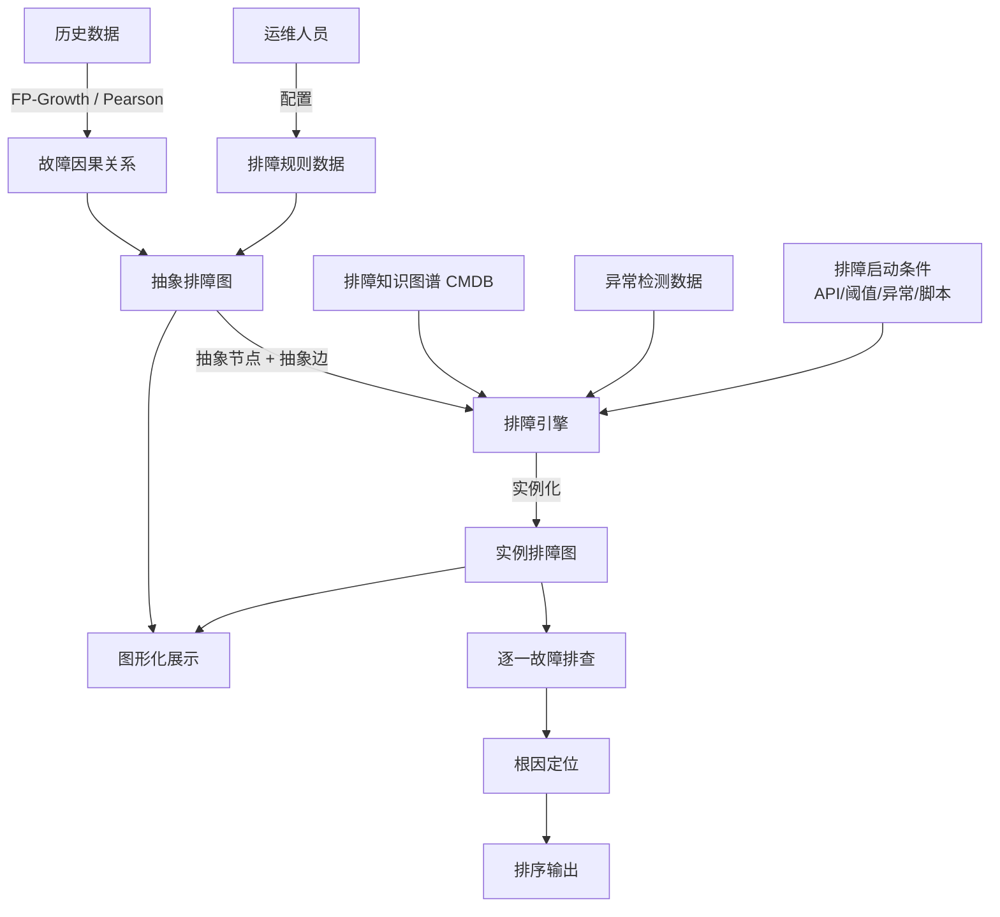
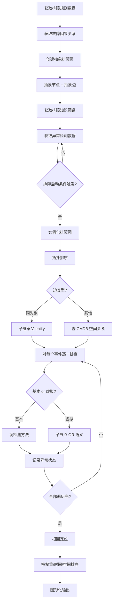

# 运维系统排障方法、装置、服务器和存储介质（CN112559237B）

> 申请人：北京必示科技有限公司
> 申请日：2021-02-19
> 公开/授权日：2023-07-07（注：PDF 扉页标"发明专利"，授权信息以国家知识产权局公告为准）
> IPC分类号：G06F 11/07 (2006.01)
> 发明人：汤汝鸣、隋楷心、刘大鹏
> 关联文档：CN112559237B.pdf

## 一、文档信息速览

| 字段 | 值 |
|---|---|
| 专利号 | CN112559237B |
| 类型 | 授权发明专利（B） |
| 申请号 | 202110188400.X |
| 申请日 | 2021-02-19 |
| 公开号 | CN112559237A |
| 公开/授权日 | 授权日 2023-07-07；申请公布日 2021-03-26 |
| 申请人 | 北京必示科技有限公司 |
| 发明人 | 汤汝鸣、隋楷心、刘大鹏 |
| IPC | G06F 11/07 |
| 法律状态 | 已授权 |
| 专利代理机构 | 北京华创智道知识产权代理事务所（普通合伙）11888 |
| 代理人 | 彭随丽 |
| 审查员 | 姚子琪 |

> 注：CSV 索引中本专利的标题"一种异常检测模型训练方法及装置"与 PDF 扉页实际标题"运维系统排障方法、装置、服务器和存储介质"不一致；本文以 PDF 实际公开文本为准。

## 二、背景（Background）

银行、证券、保险、互联网公司等大型企业的生产网络里运行着成百上千个业务系统，业务系统之间又通过 API、消息队列、数据库共享等错综复杂地耦合。一个业务出现故障时，故障往往会沿着调用链、共享资源、上下游依赖级联触发多个其他系统的异常——例如某支付系统的交易量下降，既可能是自身应用故障，也可能是数据库慢、第三方支付通道异常、网关注册中心宕机等等。

传统排障流程存在三大顽疾：

1. **故障涉及多个系统，排障范围广、难度高**：一个症状常常是若干个根因的复合结果，运维人员需要在多个系统之间来回排查。
2. **多方协作、信息收集慢、人工排障时间长**：不同业务系统、设备归属于不同的运维处室、班组，监控平台分散，跨部门沟通成本极高，效率低下。
3. **专家经验难以沉淀固化**：老员工靠"人脑记忆"知道怎么排障，新人无法快速复制，人员流动后宝贵的排障经验就丢失了。

传统"自动化排障"工具大多针对单一实体（如某台服务器）做单独配置，缺乏"通用排障引擎"的概念。本发明提出"必示排障引擎"——一个基于抽象排障图、知识图谱、CMDB 空间关系的"通用排障框架"，把专家经验抽象成可重用的排障图，对应到具体故障场景时再实例化。

## 三、目的（Purpose / Problems Solved）

- **痛点 1（重复配置）**：传统方法对每个运维实体单独配置排障规则。**解决方案**：把排障对象"类型化"，同类对象共用一份抽象排障图。
- **痛点 2（专家经验难沉淀）**：老员工的经验都在脑子里。**解决方案**：用"抽象排障图 + 抽象配置事件 + 抽象配置规则"的数据结构，把专家经验固化。
- **痛点 3（多领域联合排障）**：数据库、网络、应用各自有自己的排障流程。**解决方案**：把不同领域的排障图按抽象排障图规范编排到一起，形成跨域自动化排障。
- **痛点 4（手工逐个排查）**：故障发生后逐个节点问"是否异常"。**解决方案**：通过"实例化排障图 + 智能检测方法"自动遍历每个事件节点。
- **痛点 5（根因定位靠人）**：知道哪些事件异常后还要靠人推理根因。**解决方案**：引入"权重 + 空间关系 + 时间关系"对每个事件打分排序，自动输出根因。
- **痛点 6（CMDB 紧耦合）**：传统排障与 CMDB 强耦合。**解决方案**：检测实体抽象成类型 + 接口，定义"生效范围"，与 CMDB 解耦。

## 四、核心原理（Principles）

### 4.1 系统总览

排障引擎由"抽象排障图 + 排障知识图谱 + 实例化引擎"三部分组成：

- **抽象排障图**：由"抽象配置事件"（节点）和"抽象配置规则"（有向边）组成。节点表示一个待排障的虚拟对象（如"数据库异常"），边表示节点之间的因果关系（原因事件 → 结果事件）。
- **排障知识图谱（CMDB）**：存储实体的空间关系（哪台机器、属于哪个应用、关联哪个存储等），用于抽象排障图实例化时赋值具体实体。
- **实例化引擎**：当排障启动条件被触发时，根据抽象排障图 + 知识图谱，遍历每个抽象节点，给它赋一个具体的实体，生成"实例排障图"。

### 4.2 关键概念

- **抽象配置事件（节点）**：包括"基本事件"和"虚拟事件"。基本事件 = 真实事件，含"检测实体、检测数据、检测方法、可视化面板"四要素。虚拟事件 = 概念事件，链接多个基本事件，状态由子节点"或"运算得到。
- **抽象配置规则（边）**：包括"原因事件、结果事件、空间关系、时间关系、权重"五部分。
- **基本事件四要素**：
  - 检测实体：某台机器/某个 IP/某类标签
  - 检测数据：指标、日志、告警、接口
  - 检测方法：单指标/多指标/日志关键字/告警匹配
  - 可视化面板：折线图、柱状图、柄状图、日志
- **空间关系**：同对象、关联、上游业务、下游业务、TOP-K 实体、多维算法、调用链、链路包含。
- **排障启动条件**：API 触发 / 流式数据阈值触发 / 流式数据异常检测触发 / 其他脚本触发。
- **根因定位**：基于权重 + 异常时间 + 空间关系，对每个异常事件打分排序。

### 4.3 关键数据结构

**4.3.1 抽象配置事件**

$$
\text{Node} = \langle \text{id}, \text{type}, \text{detector}, \text{children\_ids} \rangle
$$

其中 `type ∈ {basic, virtual}`；`detector = (entity, data, method, panel)`。

**4.3.2 抽象配置规则**

$$
\text{Edge} = \langle \text{cause}, \text{effect}, \text{spatial\_rel}, \text{time\_window}, \text{weight} \rangle
$$

**4.3.3 虚拟事件的"或"语义**

$$
\text{status}(v) = \bigvee_{c \in \text{children}(v)} \text{status}(c)
$$

只要一个子基本事件异常，虚拟事件就异常。

### 4.4 实例化算法

```
def instantiate(abstract_graph, knowledge_graph, trigger):
    root = trigger.root
    instance = copy(abstract_graph)
    for node in topological_sort(instance, root):
        if node.has_parent:
            edge = edge_to_parent(node)
            if edge.spatial_rel == "同对象":
                node.entity = parent.entity
            else:
                # 调 CMDB / 空间关系数据
                node.entity = lookup_spatial(
                    parent.entity, edge.spatial_rel, node.entity_type
                )
    return instance
```

### 4.5 与现有技术的差异

| 维度 | 传统逐实体配置 | 通用排障引擎（本发明） |
|---|---|---|
| 配置方式 | 每个实体一份 | 同类实体共用 |
| 维护成本 | 实体变更 = 重配 | 类型级调整 |
| 经验沉淀 | 散落人脑 | 抽象排障图 |
| 跨域联合 | 难 | 通过抽象图规范编排 |
| CMDB 耦合 | 强 | 解耦（接口 + 生效范围） |
| 根因定位 | 人工 | 权重 + 异常时间 + 空间关系 |

## 五、算法详解（Algorithm）

### 5.1 输入 / 输出

- **输入**：排障规则数据（人工配置）、故障因果关系数据（机器学习挖掘或人工标注）、排障知识图谱（CMDB）、异常检测数据、排障启动条件。
- **输出**：实例排障图（带具体实体）、每个事件的异常状态、根因排序、图形化展示。

### 5.2 伪代码

```python
def troubleshoot(rule_data, causal_data, knowledge_graph,
                 anomaly_data, trigger_event):
    # Step 1: 构造抽象排障图
    abstract_graph = build_abstract_graph(rule_data, causal_data)
    # causal_data 也可由 FP-Growth / Pearson 等算法从历史挖掘

    # Step 2: 异常检测数据
    anomalies = get_anomalies(anomaly_data, trigger_event)

    # Step 3: 实例化
    instance_graph = instantiate(abstract_graph, knowledge_graph,
                                 trigger=trigger_event)
    # instance_graph 节点上带具体实体、检测方法

    # Step 4: 逐一排查
    root_causes = []
    for node in topological_sort(instance_graph):
        result = run_detector(node)         # 调具体检测方法
        node.status = result.status         # 正常 / 异常
        if node.type == "virtual":
            node.status = any(c.status for c in node.children)

        # 边带时间窗：若 effect.status 异常且 cause 在时间窗内异常
        if result.weighted_score > THRESHOLD:
            root_causes.append((node, score))

    # Step 5: 根因定位
    root_causes.sort(key=lambda x: -x[1])

    # Step 6: 图形化展示
    visualize(abstract_graph, instance_graph, root_causes)
    return root_causes
```

### 5.3 关键数学

- 虚拟事件状态：$\text{status}(v) = \bigvee_{c \in \text{children}(v)} \text{status}(c)$
- 边权重：$\text{weight} \in [0, 1]$，可由历史数据学习
- 因果关系挖掘：FP-Growth / Pearson 相关系数（说明书提及但不展开）

### 5.4 复杂度分析

- 抽象图构建：$O(V+E)$，$V$ 节点数，$E$ 边数
- 实例化（拓扑排序 + 空间关系查询）：$O(V+E) + O(V \cdot q)$，$q$ 单次空间关系查询代价
- 故障排查：$O(V \cdot d)$，$d$ 单节点检测方法代价
- 根因排序：$O(V \log V)$

### 5.5 示例

数据库实例 `DB1001` 发生 CPU 告警，触发排障：

1. **抽象排障图**：`DB CPU 异常` → `AAS-Total 异常` → `TOP3 等待事件`。
2. **实例化**：根节点 = "DB1001 CPU 异常"，子节点继承 entity = DB1001 → AAS-Total 节点 entity = DB1001；TOP3 等待事件节点需要动态生成（按 AAS-Total 排序 top 3 SQL_ID）。
3. **排查**：AAS-Total 异常 → TOP3 等待事件 = "log file sync"、"db file sequential read"、"latch: shared pool"。
4. **根因定位**：根据权重 `log file sync (0.85) > db file sequential read (0.6) > latch (0.4)` → 输出排序结果。
5. **图形化展示**：抽象图 + 实例图 + 异常染色 + 根因箭头。

## 六、系统架构图（Architecture）



## 七、流程图（Process Flow）



## 八、关键创新点（Key Innovations）

- **+ 抽象排障图（类型级配置）**：把"逐实体配置"升级为"按类型配置"，同类实体共用一份排障图，大幅降低维护成本。
- **+ 抽象配置事件双层（基本+虚拟）**：基本事件是真实可检测的指标/日志，虚拟事件把多个基本事件"或"语义聚合，便于表达"CPU 异常 = CPU USAGE 异常 ∨ CPU IDL 异常"。
- **+ 抽象配置规则五元组**：原因事件、结果事件、空间关系、时间关系、权重——把因果关系完整表达，并支持时间窗内的因果判定。
- **+ 实例化引擎（按边类型动态赋值）**：边的空间关系 = "同对象"则子继承父；否则调 CMDB 空间关系数据。一套抽象图可实例化到任意具体实体。
- **+ 与 CMDB/指标管理解耦**：检测实体抽象成"类型+生效范围"；检测数据抽象成"类型或接口+生效范围"，可适配不同 CMDB 体系。

## 九、权利要求摘要（Claims Summary）

- **独立权利要求 1（方法）**：获取排障规则 → 故障因果关系 → 创建抽象排障规则 → 获取排障知识图谱 → 触发后生成实例排障图 → 逐一排查。
- **从属权利要求 2-5**：触发条件（图谱 + 异常检测数据）；抽象节点 + 抽象边；空间关系（"同对象"继承 / 调空间关系）。
- **从属权利要求 6-7**：抽象配置事件（基本/虚拟），虚拟事件的"或"语义。
- **从属权利要求 8**：图形化显示。
- **从属权利要求 9**：抽象配置规则五元组（原因、结果、空间、时间、权重）。
- **从属权利要求 10**：基本事件为指定对象/类型对象。
- **从属权利要求 11**：虚拟事件基本事件"或"关系。
- **独立权利要求 12（装置）**：6 大模块——规则数据获取、因果关系获取、抽象规则创建、图谱获取、实例排障图创建、故障排查。
- **权利要求 13-14**：服务器和计算机可读存储介质。

## 十、应用场景（Use Cases）

- **银行核心系统数据库排障**：Oracle/MySQL 实例的 AAS、CPU、表空间、等待事件等自动排查。
- **云原生微服务故障定位**：从 API 网关异常出发，自动实例化到具体微服务、数据库、缓存。
- **网络链路排障**：CMDB 中物理拓扑 10.0.0.1 → Switch1 → Router1 → Switch2 → Router2 → 11.0.0.1:80，逐跳排查。
- **应用成功率/响应时间异常**：调用链自动展开，找到根源子服务。
- **存储排障**：SG（Storage Group）→ DB 读写异常触发，沿"存储-前端口-交换机-主机"逐个排查日志/指标。

## 十一、相关专利（Related Patents in this set）

- **CN112559238B 用于 Oracle 数据库的排障策略生成方法**：本专利的"Oracle 场景化"子集实现。
- **CN113434193B 根因变更定位**：本专利"根因定位"是事件维度，根因变更是"软件变更"维度，互为补充。
- **CN111737095B 批处理任务时间监控**：事前预测，与本专利事后排查互补。
- **CN111858231B 单指标异常检测**：是本专利"检测方法"环节的算法基础。
- **CN112231193A 时序容量预测**：事前预测容量，与本专利事后定位形成完整 AIOps 链路。
- **CN112905671A 时间序列异常处理**：是本专利"检测方法"模块所调用的具体算法实现。

## 十二、术语表（Glossary）

| 术语 | 解释 |
|---|---|
| 排障图 | 由节点（事件）和边（因果关系）构成的有向图 |
| 抽象排障图 | 类型级的排障图，节点不含具体实体 |
| 实例排障图 | 抽象图实例化后，节点带具体实体的排障图 |
| 基本事件 | 可被检测的真实事件，含实体+数据+方法+面板 |
| 虚拟事件 | 概念事件，状态由子节点"或"得到 |
| 排障知识图谱 | CMDB，存储实体间的空间关系 |
| 抽象配置规则 | 排障图的边，含五元组（原因/结果/空间/时间/权重） |
| 排障启动条件 | 触发排障引擎的外部信号 |
| FP-Growth | 频繁项集挖掘算法，用于发现事件共现关系 |
| Pearson 相关系数 | 衡量两个变量线性相关度 |
| TOP-K 等待事件 | 数据库 AAS 异常时按耗时排序的前 K 个等待事件 |
| 影响力分析 | 评估一个事件对其他事件的影响范围 |

## 十三、参考与延伸阅读

- Google SRE Book（《Google SRE 运维解密》）
- 《SRE：Google 运维解密》——故障定位章节
- CMDB 设计模式与实践
- ICAS / AIOps 平台白皮书
- 必示科技"智能运维大脑"产品白皮书
