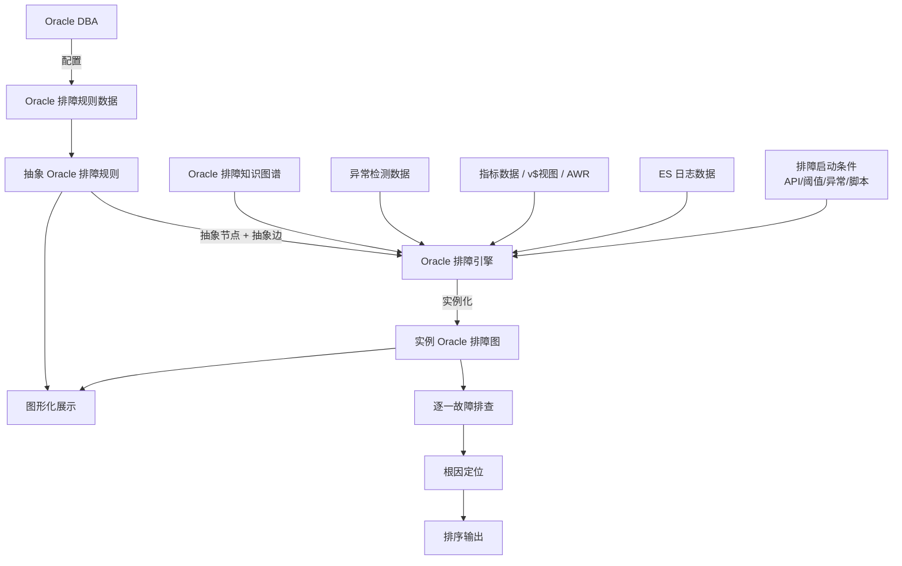
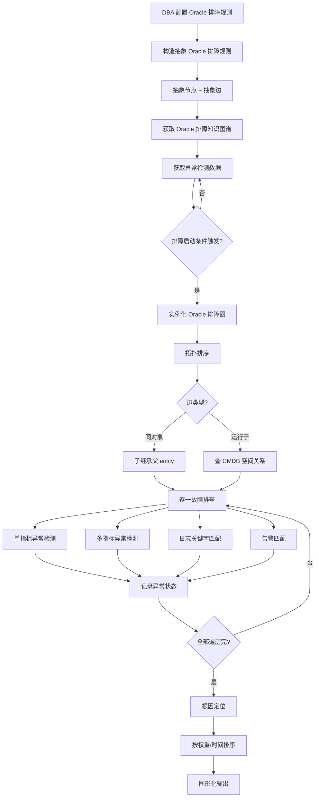

# 用于 Oracle 数据库的排障策略生成方法、装置、处理器和存储介质（CN112559238B）

> 申请人：北京必示科技有限公司
> 申请日：2021-02-19
> 公开/授权日：2023-08-25（授权信息以国家知识产权局公告为准）
> IPC分类号：G06F 11/07 (2006.01); G06N 5/02 (2006.01)
> 发明人：汤汝鸣、隋楷心、刘大鹏
> 关联文档：CN112559238B.pdf

## 一、文档信息速览

| 字段 | 值 |
|---|---|
| 专利号 | CN112559238B |
| 类型 | 授权发明专利（B） |
| 申请号 | 202110188401.4 |
| 申请日 | 2021-02-19 |
| 公开号 | CN112559238A |
| 公开/授权日 | 授权日 2023-08-25；申请公布日 2021-03-26 |
| 申请人 | 北京必示科技有限公司 |
| 发明人 | 汤汝鸣、隋楷心、刘大鹏 |
| IPC | G06F 11/07; G06N 5/02 |
| 法律状态 | 已授权 |
| 审查员 | 林婉娟 |

> 注：CSV 索引中本专利的标题"一种异常检测方法及装置"与 PDF 实际标题"用于 Oracle 数据库的排障策略生成方法装置、处理器和存储介质"不一致；本文以 PDF 实际公开文本为准。

## 二、背景（Background）

银行、证券、保险、互联网金融等大型公司广泛使用 Oracle 数据库作为核心交易、账务、风控、清算的存储引擎。Oracle 数据库相关排障知识具有高度专业性（DBA 需要熟悉等待事件、AWR、SQL 调优、参数调优等），同时数据库的监控指标数据繁杂、格式多样（v$ 视图、AWR 报告、ASH、日志、告警等），要在"Oracle 数据库"这一类典型排障场景中建立"通用排障规则"是实际工作中的重要挑战。

现有排障工具的问题：

1. **每个 Oracle 实例单独配置**：实例多（数百甚至上千）时配置成本巨大；
2. **专家经验难沉淀**：资深 DBA 的排障知识在脑子里，文档零散；
3. **跨实例一致性差**：不同 DBA 在不同实例上的排查路径不一致，结果不可复现；
4. **跨部门沟通成本高**：数据库、应用、网络团队各查各的，缺乏统一的"排障图"语言。

本发明是"必示排障引擎"在 Oracle 数据库场景下的具体实现，通过"抽象 Oracle 排障规则 + Oracle 排障知识图谱 + 实例化"三步，把 Oracle DBA 的排障经验沉淀为可重用的排障图，对应到具体 Oracle 实例时再实例化。

## 三、目的（Purpose / Problems Solved）

- **痛点 1（场景化）**：通用排障引擎需要"Oracle 场景化"。**解决方案**：在通用排障引擎基础上定义"Oracle 排障图"作为具体场景实现。
- **痛点 2（节点类型化）**：Oracle 排障节点（AAS-Total、CPU 利用率、表空间等）要按类型配置。**解决方案**：每个节点指定"实体类型（Oracle 实例、数据库主机等）"和"触发方式"，触发时由排障引擎按类型自动实例化。
- **痛点 3（空间关系自动获取）**：Oracle 实例和数据库主机的关系不能人工维护。**解决方案**：从 CMDB/知识图谱自动查询"运行于"关系。
- **痛点 4（多源数据整合）**：Oracle 排障需要 v$ 视图、AWR、ASH、日志、告警等多种数据。**解决方案**：Oracle 排障图接入指标、CMDB、ES 日志等多种数据源。
- **痛点 5（图形化）**：排障图需要可视化。**解决方案**：图形化显示抽象图 + 实例图。

## 四、核心原理（Principles）

### 4.1 系统总览

整个系统由"规则配置 + 实例化 + 排障"三段组成：

1. **规则配置**：DBA 通过配置页面完成 Oracle 排障图的规则配置，节点包含三行文本（事件描述、实体类型、止损策略），通过图形化界面显示。
2. **实例化**：当排障启动条件被触发（API / 流式阈值 / 异常检测 / 脚本），排障引擎根据抽象排障图 + CMDB 空间关系，生成实例化的 Oracle 排障图。
3. **排障执行**：对实例化排障图中的事件结点逐一排查，调用对应的智能检测算法（单指标/多指标/日志关键字/告警匹配等）。

### 4.2 关键概念

- **抽象 Oracle 排障规则**：DBA 配置的"类型级"排障图，节点不含具体 Oracle 实例 ID。
- **实例 Oracle 排障规则**：触发后生成的、含具体 Oracle 实例 ID 和数据库主机的排障图。
- **空间关系**：包括"同对象"和"非同对象"（如"运行于"）。同对象子节点继承父节点实体；非同对象从 CMDB 查具体实体。
- **触发方式**：API 触发 / 流式阈值触发 / 流式异常检测触发 / 脚本触发。
- **基本事件四要素**：检测实体、检测数据、检测方法、可视化面板。
- **多数据源接入**：指标数据/告警、CMDB、ES 日志等。

### 4.3 关键数据结构

- **抽象配置事件**：

$$
\text{Node} = \langle \text{id}, \text{name}, \text{trigger}, \text{entity\_type}, \text{detector} \rangle
$$

其中 `trigger` 表示是否可触发排障、触发方式；`entity_type` 是 Oracle 实例、数据库主机等；`detector = (entity, data, method, panel)`。

- **抽象配置规则**：

$$
\text{Edge} = \langle \text{cause}, \text{effect}, \text{spatial\_rel} \rangle
$$

spatial_rel ∈ {"同数据库实例", "运行于", ...}，通过两端结点的空间类型决定。

### 4.4 实例化算法

```
def instantiate_oracle(abstract_oracle_graph, knowledge_graph, trigger):
    root_entity = trigger.oracle_instance_id   # 触发根节点的实体
    instance = copy(abstract_oracle_graph)
    for node in topological_sort(instance):
        if node == root:
            node.entity = root_entity
        else:
            edge = edge_to_parent(node)
            if edge.spatial_rel == "同数据库实例":
                node.entity = parent.entity
            else:
                # 调 CMDB/空间关系数据
                node.entity = lookup_spatial(
                    parent.entity, edge.spatial_rel, node.entity_type
                )
    return instance
```

### 4.5 与现有技术的差异

| 维度 | 传统逐实例配置 | Oracle 排障图（本发明） |
|---|---|---|
| 配置方式 | 每个 Oracle 实例一份 | 同类 Oracle 实例共用 |
| 经验沉淀 | 散落人脑 | 抽象排障图 |
| 多实例一致性 | 差 | 强（共用同一图） |
| 跨团队沟通 | 难 | 通过排障图统一语言 |
| CMDB 耦合 | 强 | 解耦（接口 + 生效范围） |

## 五、算法详解（Algorithm）

### 5.1 输入 / 输出

- **输入**：Oracle 排障规则数据（人工配置）、Oracle 排障知识图谱、异常检测数据、排障启动条件。
- **输出**：实例 Oracle 排障图（带具体 Oracle 实例 ID、数据库主机）、每个事件的异常状态、根因定位结果、图形化展示。

### 5.2 伪代码

```python
def oracle_troubleshoot(rule_data, knowledge_graph,
                        anomaly_data, trigger_event):
    # Step 1: 构造抽象 Oracle 排障图
    abstract_oracle_graph = build_abstract_oracle_graph(rule_data)
    # 节点: AAS-Total, CPU利用率, 表空间使用率, 等待事件等
    # 边: AAS-Total -> 等待事件，CPU利用率 -> AAS-Total 等

    # Step 2: 接入多源数据
    metrics_data = connect_oracle_metrics()    # v$视图 / AWR
    log_data = connect_oracle_logs()          # ES日志
    cmdb_data = knowledge_graph                # CMDB空间关系

    # Step 3: 实例化
    instance_graph = instantiate_oracle(
        abstract_oracle_graph, knowledge_graph, trigger_event
    )

    # Step 4: 逐一排查
    root_causes = []
    for node in topological_sort(instance_graph):
        if node.detector.method == "single_metric":
            result = single_metric_anomaly(node.entity, node.detector.data)
        elif node.detector.method == "multi_metric":
            result = multi_metric_anomaly(node.entity, node.detector.data)
        elif node.detector.method == "log_keyword":
            result = log_keyword_match(node.entity, node.detector.data)
        elif node.detector.method == "alert_match":
            result = alert_match(node.entity, node.detector.data)
        node.status = result.status

    # Step 5: 根因定位
    root_causes = rank_by_weight_and_time(instance_graph)

    # Step 6: 图形化展示
    visualize(abstract_oracle_graph, instance_graph, root_causes)
    return root_causes
```

### 5.3 关键数学

- 拓扑排序：$O(V+E)$
- 空间关系查询：$O(q)$，$q$ 为单次 CMDB 查询代价
- 异常检测：$O(T)$，$T$ 为窗口长度
- 根因排序：$O(V \log V)$

### 5.4 复杂度分析

- 抽象图构建：$O(V+E)$
- 实例化：$O(V+E) + O(V \cdot q)$
- 故障排查：$O(V \cdot d)$，$d$ 单节点检测方法代价
- 根因排序：$O(V \log V)$

### 5.5 示例

DBA 配置抽象 Oracle 排障图如下（节点三行：事件描述、实体类型、止损策略）：

```
AAS-Total 异常 [Oracle实例] [增加 DB CPU]
   ↓ (同对象)
CPU 利用率 [数据库主机] [扩容主机]
   ↓ (运行于)
数据库主机 OS 异常 [数据库主机] [主机迁移]
   ↓ (同对象)
日志错误 [Oracle实例] [联系厂商]
```

触发：`DB1001` 实例 AAS-Total 异常。

1. **实例化**：根节点 entity = Oracle_ID_A → CPU 利用率继承 AAS-Total entity → CPU 利用率边类型 = "运行于"，查 CMDB 得到 Oracle_ID_A 运行于 HOST_A → 数据库主机 OS 异常继承 HOST_A → 日志错误继承 AAS-Total entity（同对象）。
2. **排查**：CPU 利用率检测 → 异常（90% > 80% 阈值）；日志错误检测 → 正常。
3. **根因定位**：CPU 利用率权重 0.9，时间最近 → 第一根因。
4. **图形化展示**：抽象图 + 实例图 + 异常染色 + 根因箭头。

## 六、系统架构图（Architecture）



## 七、流程图（Process Flow）



## 八、关键创新点（Key Innovations）

- **+ Oracle 场景化**：把通用排障引擎"场景化"到 Oracle 数据库，给 DBA 提供了开箱即用的排障图模板。
- **+ 节点三行规范**：每个节点用三行文本表达（事件描述 + 实体类型 + 止损策略），让 DBA 配置时既标准又易读。
- **+ 空间关系（运行于）**：抽象排障图中的"CPU 利用率"节点类型是数据库主机，边的空间关系是"运行于"，实例化时通过 CMDB 自动查找具体主机。
- **+ 多源数据接入**：v$ 视图、AWR、ASH、日志、告警、CMDB 一站式接入，避免 DBA 在多个工具间切换。
- **+ 抽象配置 + 灵活止损**：节点除了检测方法，还预设"止损策略"，异常时自动给出建议（如"扩容主机"）。

## 九、权利要求摘要（Claims Summary）

- **独立权利要求 1（方法）**：核心 5 步——获取 Oracle 排障规则数据 → 抽象 Oracle 排障规则 → Oracle 排障知识图谱 → 触发后生成实例 Oracle 排障图 → 逐一排查。
- **从属权利要求 2**：触发前获取异常检测数据，并参与生成实例图。
- **从属权利要求 3**：触发方式（4 种）。
- **从属权利要求 4**：根因定位。
- **从属权利要求 5-7**：抽象图树状结构；边类型确定子节点实体；空间关系。
- **从属权利要求 8**：图形化显示。
- **独立权利要求 9（装置）**：5 大模块——规则数据获取、规则创建、图谱获取、实例创建、排查模块。
- **权利要求 10-11**：服务器和计算机可读存储介质。

## 十、应用场景（Use Cases）

- **银行核心 Oracle 数据库排障**：AAS-Total、CPU 利用率、表空间、等待事件等自动排查。
- **保险核心 Oracle 数据库排障**：账务、风控 SQL 异常自动定位。
- **证券 Oracle 数据库排障**：交易日盘前盘后清理任务异常定位。
- **互联网金融 Oracle 数据库排障**：支付、清算、对账任务异常自动修复建议。
- **跨域联合排障**：Oracle 排障图作为通用排障引擎的一个具体子图，与应用、网络排障图联合编排。

## 十一、相关专利（Related Patents in this set）

- **CN112559237B 运维系统排障方法**：本专利是其在 Oracle 场景下的具体实现。
- **CN113434193B 根因变更定位**：本专利定位"事件根因"，根因变更定位"软件变更根因"，互为补充。
- **CN111737095B 批处理任务时间监控**：事前预测，与本专利事后排查互补。
- **CN111858231B 单指标异常检测**：是本专利"检测方法"模块的具体算法。
- **CN112231193A 时序容量预测**：事前预测容量，与本专利事后定位形成完整 AIOps 链路。
- **CN112905671A 时间序列异常处理**：是本专利"检测方法"模块所调用的具体算法实现。

## 十二、术语表（Glossary）

| 术语 | 解释 |
|---|---|
| Oracle 排障图 | 针对 Oracle 数据库的抽象排障图 |
| AAS-Total | Average Active Sessions，数据库平均活动会话数 |
| AWR | Automatic Workload Report，Oracle 自动负载报告 |
| ASH | Active Session History，活动会话历史 |
| v$ 视图 | Oracle 动态性能视图 |
| 等待事件 | Oracle 会话等待的资源/锁/IO 事件 |
| 排障知识图谱 | CMDB，存储 Oracle 实例、数据库主机等实体的空间关系 |
| 抽象配置事件 | 类型级排障节点 |
| 抽象配置规则 | 节点之间的因果边 |
| 排障启动条件 | 触发 Oracle 排障的外部信号 |
| 止损策略 | 节点上预定义的故障处置建议 |

## 十三、参考与延伸阅读

- Oracle Database Performance Tuning Guide
- 《Oracle 性能优化求生指南》
- 必示科技"金融行业 Oracle 排障白皮书"
- 阿里 / 字节跳动 AIOps 平台白皮书
- AWR/ASH 实战分析手册
