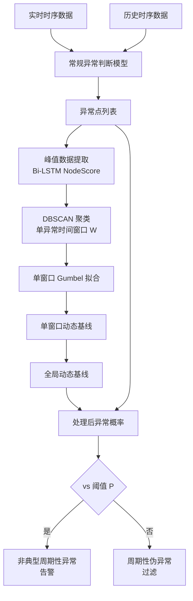
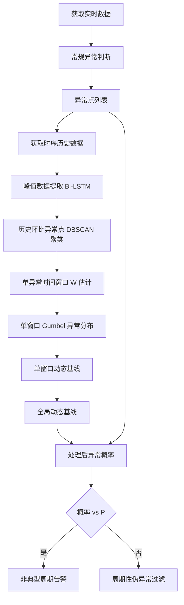

# 一种动态筛选非周期性异常方法（CN112862019A）

> 申请人：北京必示科技有限公司
> 申请日：2021-04-25
> 公开日：2021-08-31（PDF 扉页记载 2021-05-28）
> IPC分类号：G06K 9/62 (2006.01); G06N 3/04 (2006.01); G06N 3/08 (2006.01)
> 发明人：张文池、曹立、隋楷心、刘大鹏
> 关联文档：CN112862019A.pdf

## 一、文档信息速览

| 字段 | 值 |
|---|---|
| 专利号 | CN112862019A |
| 类型 | 发明专利申请（A） |
| 申请号 | 202110445385.2 |
| 申请日 | 2021-04-25 |
| 公开号 | CN112862019A |
| 公开日 | 2021-08-31（PDF 扉页记载 2021-05-28） |
| 申请人 | 北京必示科技有限公司 |
| 发明人 | 张文池、曹立、隋楷心、刘大鹏 |
| IPC | G06K 9/62; G06N 3/04; G06N 3/08 |
| 法律状态 | 实质审查中 |
| 专利代理机构 | 北京华创智道知识产权代理事务所（普通合伙）11888 |
| 代理人 | 彭随丽 |

> 注：CSV 索引中本专利的标题"一种告警根因分析方法、装置及存储介质"与 PDF 实际标题"一种动态筛选非周期性异常方法"不一致；本文以 PDF 实际公开文本为准。

## 二、背景（Background）

在实际生产任务中，运维指标经常被定时任务（如压测、版本升级、主备切换等）触发产生"尖峰"或"平台"形态的周期性特征。这些尖峰本身是任务的正常表现，但因其幅度大、形态特殊，常规异常检测算法会把它们误判为异常。

现有做法是在频繁告警的"时间窗口"设置"告警静默期"（alert silence）：

- 静默期设置过短 → 仍有大量误报；
- 静默期设置过长 → 可能忽略真实的生产故障。

更进一步的问题是，这些定时任务的开始时间和持续时间**不固定**（受前序任务影响、人工介入等），导致尖峰出现的位置和宽度在每个周期都有偏差，是一种"不稳定/非固定周期性"行为。如何在尖峰位置不稳定、宽度不固定的情况下，自动去除"周期性伪异常"、保留"非周期性真异常"，是本发明要解决的核心问题。

## 三、目的（Purpose / Problems Solved）

- **痛点 1（静默期长短两难）**：传统静默期方法要么误报多要么漏报。**解决方案**：用"动态基线"代替固定静默期，自适应每个时间点的"周期性程度"。
- **痛点 2（尖峰位置不固定）**：定时任务每次开始时间漂移。**解决方案**：基于 Bi-LSTM 预测值 + 历史相同位置均值的"异常分数"对每个点做归一化。
- **痛点 3（尖峰宽度不一致）**：每次尖峰持续时间不固定。**解决方案**：用 DBSCAN 聚类自动推测"单个异常时间窗口 W"，并按 Gumbel 分布拟合窗口内异常概率。
- **痛点 4（多窗口叠加形成全局基线）**：单一窗口不能覆盖全天。**解决方案**：把所有窗口的判定基线叠加形成全局基线。
- **痛点 5（阈值固定）**：固定阈值不能适应不同密度区域。**解决方案**：用可调阈值 P 平衡灵敏度和误报。

## 四、核心原理（Principles）

### 4.1 系统总览

整个方法由 4 个主要步骤组成：

1. **步骤 1**：获取实时数据；
2. **步骤 2**：常规异常判断模型输出异常点列表；
3. **步骤 3**：根据"异常判定动态基线"对每个异常点的异常概率重新处理；
4. **步骤 4**：与系统异常概率阈值 P 比较，识别"非典型周期性"异常。

其中步骤 3 又分为 6 个子步骤：获取时序历史数据 → 峰值数据提取 → 历史环比异常点聚类 → 单窗口 Gumbel 分布拟合 → 单窗口动态基线 → 全局动态基线。

### 4.2 关键概念

- **非典型周期性异常**：在不稳定周期性尖峰附近出现的、与历史周期性模式不符的真异常。
- **节点异常分数 NodeScore**：用 Bi-LSTM 预测值与真实值之差，除以历史相同位置均值得到的归一化异常分数。
- **DBSCAN 聚类**：基于密度聚类，搜索历史相同位置附近 n 分钟内的相似异常模式，输出"偏移程度"和"异常时间窗口大小 W"。
- **Gumbel 分布**：耿贝尔分布，常用于拟合极值和短时窗的衰减。
- **单窗口动态基线**：单个异常时间窗口内，根据 Gumbel 拟合的异常概率密度函数生成的判定基线。
- **全局动态基线**：把所有单窗口判定基线叠加起来形成的全局基线。
- **异常概率阈值 P**：可调节的阈值，平衡灵敏度和误报。

### 4.3 关键数学

**4.3.1 NodeScore 异常分数**

$$
\text{NodeScore} = \frac{|\text{Predict} - \text{value}|}{\text{history\_mean}}
$$

其中 Predict 是 Bi-LSTM 在该位置的预测值，value 是真实值，history_mean 是历史相同位置的数据均值。

**4.3.2 DBSCAN 聚类（基于 DTW 距离的受限偏移窗口）**

针对每个异常点，搜索历史不同周期相同位置附近 n 分钟内的异常点 + 其前 n 分钟的异常表现，用 DBSCAN（带 DTW 距离）判定当前异常点是否与历史异常模式一致。

**4.3.3 Gumbel 分布拟合**

对已经判定为周期性行为的异常点，把该位置异常概率设为 1，左右两侧按衰减公式递减：

$$
P_t = \max(P_{t-1}, P_{t+1}) \cdot k
$$

其中 $k$ 为预设衰减系数。窗口内所有点的异常概率用 Gumbel 分布拟合。

**4.3.4 全局动态基线**

全局基线 = $\sum$ 各窗口的基线。每个窗口用其概率密度函数给出"周期性行为"判定阈值。

**4.3.5 非典型周期性异常识别**

最终异常点的"处理后异常概率"与系统阈值 P 比较：

- 处理后概率 < P：周期性伪异常，过滤；
- 处理后概率 ≥ P：非典型周期性异常，告警。

### 4.4 与现有技术的差异

| 维度 | 静默期法 | 本发明 |
|---|---|---|
| 阈值 | 固定静默期 | 动态基线 |
| 位置漂移 | 不适应 | Bi-LSTM 归一化 |
| 窗口宽度 | 固定 | DBSCAN 估计 W |
| 全局 vs 局部 | 全局固定 | 窗口叠加 |
| 可解释 | 弱 | 强（每步可视化） |

## 五、算法详解（Algorithm）

### 5.1 输入 / 输出

- **输入**：实时时序数据 stream，Bi-LSTM 模型（已训练），历史时序数据 history，异常概率阈值 P。
- **输出**：过滤后的非典型周期性异常点列表。

### 5.2 伪代码

```python
def filter_non_typical_periodic(stream, lstm_model, history, P):
    # Step 1: 获取实时数据
    realtime = stream

    # Step 2: 常规异常判断模型 → 异常点列表
    candidates = []
    for t, x in enumerate(realtime):
        pred = lstm_model.predict(t)
        hist_mean = history.same_position(t)
        node_score = abs(pred - x) / hist_mean
        if node_score > TH:
            candidates.append((t, x, node_score))

    # Step 3: 异常判定动态基线
    # 3.1 峰值数据提取
    nodescores = extract_node_scores(history, lstm_model)

    # 3.2 历史环比异常点聚类
    windows = []      # 异常时间窗口集合
    for c in candidates:
        similar = find_similar_anomalies(c, history, k=10, n_min=5)
        W = cluster_and_estimate_window(similar)   # DBSCAN
        windows.append((c.t, W))

    # 3.3 单窗口 Gumbel 分布
    gumbel_distributions = []
    for t0, W in windows:
        # 中心点异常概率=1，左右按 k 衰减
        prob = np.zeros(W)
        prob[W // 2] = 1.0
        for i in range(1, W // 2 + 1):
            prob[W // 2 - i] = max(prob[W // 2 - i + 1], 1) * k
            prob[W // 2 + i] = max(prob[W // 2 + i - 1], 1) * k
        gumbel = fit_gumbel(prob)
        gumbel_distributions.append((t0, gumbel))

    # 3.4 单窗口动态基线
    window_baselines = [(t0, gumbel.pdf(t)) for t0, gumbel in gumbel_distributions]

    # 3.5 全局动态基线
    global_baseline = sum(baseline for _, baseline in window_baselines)

    # 3.6 处理后异常概率
    for t, x, score in candidates:
        baseline = global_baseline[t] if t < len(global_baseline) else 0
        processed_score = score - baseline

        # Step 4: 与 P 比较
        if processed_score >= P:
            alarm(t, x, processed_score)     # 非典型周期性异常
        # 否则视为周期性伪异常，过滤
```

### 5.3 关键数学（汇总）

- NodeScore：$\text{NodeScore}=|\text{Predict}-\text{value}|/\text{history\_mean}$
- 概率衰减：$P_t=\max(P_{t-1}, P_{t+1})\cdot k$
- 全局基线：$\text{global\_baseline}=\sum_i \text{window\_baseline}_i$
- 异常识别：$\text{异常}\iff \text{processed\_score}\ge P$

### 5.4 复杂度分析

- Bi-LSTM 预测：$O(T\cdot d\cdot L)$，$d$ 隐层维数，$L$ 序列长度
- DBSCAN 聚类：$O(N\log N)$，$N$ 候选异常点数
- Gumbel 拟合：$O(M)$，$M$ 窗口大小
- 全局基线叠加：$O(N\cdot M)$
- 在线判断：$O(1)$ 每点

### 5.5 示例

某支付系统交易量时序受每晚 23:00 定时"对账任务"影响，尖峰位置在 23:00-23:15，宽度漂移 ±5 分钟。历史 30 天有 4 次真正的异常事件（网络抖动、数据库慢等）。

1. **常规检测**：模型给出 30 个候选异常点（含 30 个每日尖峰 + 4 个真异常）。
2. **峰值数据提取**：Bi-LSTM 对每个点做预测，计算 NodeScore。
3. **历史聚类**：DBSCAN 找到 30 个尖峰聚类，估计每个尖峰窗口 W=15 ± 5 分钟。
4. **Gumbel 拟合**：每个窗口内异常概率按 Gumbel 拟合。
5. **全局基线**：30 个窗口的基线叠加 → 23:00-23:15 区间内 baseline 高，其余低。
6. **阈值判断 P=0.5**：
   - 4 个真异常的 processed_score 分别为 0.85, 0.78, 0.65, 0.72（baseline 较低）→ 全部 ≥ P → 告警；
   - 30 个周期性尖峰的 processed_score 0.05 ~ 0.30（减去高 baseline）→ 全部 < P → 过滤。

## 六、系统架构图（Architecture）



## 七、流程图（Process Flow）



## 八、关键创新点（Key Innovations）

- **+ Bi-LSTM 归一化异常分数**：用历史相同位置均值做分母，避免单点异常被放大为"全局异常"，是处理"不稳定周期"的关键。
- **+ DBSCAN 自适应窗口宽度**：用聚类算法自动估计"单个异常时间窗口 W"，解决了"窗口大小不固定"问题。
- **+ Gumbel 极值分布拟合**：对每个窗口的异常概率用 Gumbel 分布拟合，符合尖峰附近异常概率"中心高、边缘衰减"的特征。
- **+ 全局基线叠加**：把所有窗口的基线叠加形成全局基线，覆盖全天不同时段。
- **+ 可调阈值 P**：平衡灵敏度与误报率。

## 九、权利要求摘要（Claims Summary）

- **独立权利要求 1（方法）**：核心 4 步——获取实时数据 → 常规异常判断 → 异常判定动态基线处理 → 与阈值 P 比较。
- **从属权利要求 2**：步骤 3 包含 6 个子步骤（301-306）。
- **从属权利要求 3**：峰值数据提取用 Bi-LSTM + NodeScore 公式。
- **从属权利要求 4**：DBSCAN 聚类搜索历史相同位置异常点。
- **从属权利要求 5**：Gumbel 分布拟合 + 概率衰减公式 $P_t=\max(P_{t-1},P_{t+1})\cdot k$。
- **从属权利要求 6**：单窗口动态基线生成。
- **从属权利要求 7**：全局动态基线 = 各窗口基线叠加。

## 十、应用场景（Use Cases）

- **支付系统定时对账任务**：每晚 23:00 触发，尖峰位置漂移，方法有效去除周期性伪异常。
- **电商大促压测**：定时压测任务触发的流量尖峰。
- **数据库主备切换**：定时主备切换导致的连接数尖峰。
- **版本升级窗口**：定时版本升级触发的告警抖动。
- **CDN 缓存刷新**：定时刷新任务触发的网络流量尖峰。

## 十一、相关专利（Related Patents in this set）

- **CN111858231B 单指标异常检测**：本专利是它的"周期性伪异常过滤"补充，专门去除跑批/定时任务产生的尖峰误报。
- **CN112905671A 时间序列异常处理**：本专利聚焦"非周期性异常识别"，它聚焦"主动学习 + RRCF 异常检测"。
- **CN112231193A 时序容量预测**：本专利是"在线异常识别"，它做"未来值预测"。
- **CN111737095B 批处理任务时间监控**：本专利处理定时任务尖峰的"误报"，它做定时任务时长的"预测"。

## 十二、术语表（Glossary）

| 术语 | 解释 |
|---|---|
| 非典型周期性异常 | 在不稳定周期性尖峰附近出现的、与历史周期性模式不符的真异常 |
| 周期性伪异常 | 定时任务触发的尖峰，本身是正常但被误判为异常 |
| Bi-LSTM | 双向长短时记忆网络 |
| NodeScore | 节点的异常分数，归一化后用于聚类 |
| DBSCAN | 基于密度的聚类算法 |
| DTW | Dynamic Time Warping，动态时间规整 |
| Gumbel 分布 | 耿贝尔分布，常用于拟合极值 |
| 异常时间窗口 W | 单个尖峰的时间宽度 |
| 异常判定动态基线 | 自适应不同时间点的"周期性程度"基线 |
| 异常概率阈值 P | 平衡灵敏度与误报的可调参数 |
| 告警静默期 | 传统方法在固定时间窗内抑制告警的机制 |

## 十三、参考与延伸阅读

- Hochreiter S, Schmidhuber J. "Long Short-Term Memory." Neural Computation, 1997.
- Graves A, Schmidhuber J. "Framewise phoneme classification with bidirectional LSTM." 2005.
- Ester M, et al. "A density-based algorithm for discovering clusters in large spatial databases with noise." KDD, 1996.
- Gumbel E J. "Statistics of Extremes." Columbia University Press, 1958.
