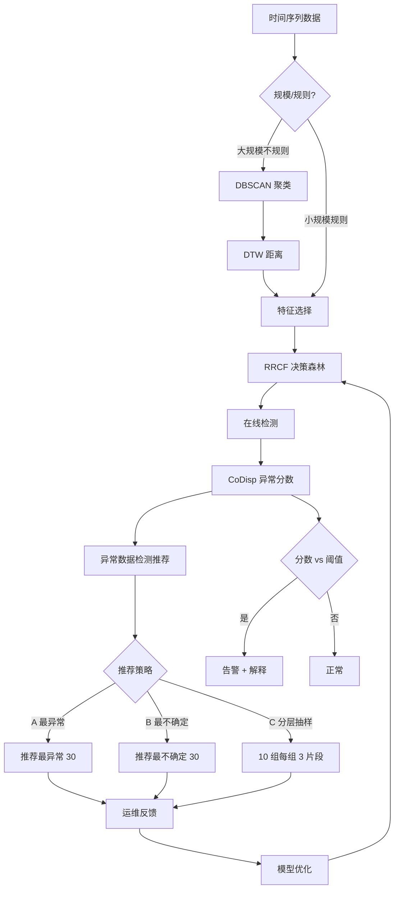
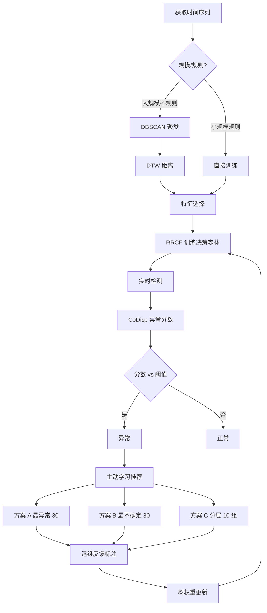

# 时间序列异常处理方法、装置、电子设备及存储介质（CN112905671A）

> 申请人：北京必示科技有限公司、国家计算机网络与信息安全管理中心
> 申请日：2021-03-24
> 公开日：2021-07-06
> IPC分类号：G06F 16/2458 (2019.01); G06K 9/62 (2006.01)
> 发明人：张文池、王泓琳、陈哲康、周波、王勇、刘大鹏
> 关联文档：CN112905671A.pdf

## 一、文档信息速览

| 字段 | 值 |
|---|---|
| 专利号 | CN112905671A |
| 类型 | 发明专利申请（A） |
| 申请号 | 202110313319.X |
| 申请日 | 2021-03-24 |
| 公开号 | CN112905671A |
| 公开日 | 2021-07-06（PDF 扉页记载 2021-06-04） |
| 申请人 | 北京必示科技有限公司；国家计算机网络与信息安全管理中心 |
| 发明人 | 张文池、王泓琳、陈哲康、周波、王勇、刘大鹏 |
| IPC | G06F 16/2458; G06K 9/62 |
| 法律状态 | 实质审查中 |
| 专利代理机构 | 北京华创智道知识产权代理事务所（普通合伙）11888 |
| 代理人 | 彭随丽 |

> 注：CSV 索引中本专利的标题"一种指标数据异常检测方法及装置"与 PDF 实际标题"时间序列异常处理方法、装置、电子设备及存储介质"不一致；本文以 PDF 实际公开文本为准。

## 二、背景（Background）

现代软件企业依赖大量应用服务（应用、物理机、虚拟机、容器），运维工程师需要监控基础设施的运行状况，包括内存、CPU、磁盘等指标。当外部攻击、磁盘老化、性能过载等故障发生时，这些监控指标会反映出异常。高效的时间序列异常检测能帮助运维团队及早发现故障。

但实际生产场景下，时间序列异常检测面临多重挑战：

1. **指标数量极多**：每个生产单元可能产生几十甚至上百个指标数据，若分别针对训练，模型数量和资源消耗会极其庞大。
2. **无监督**：人为提供标注不切实际，监督方法难以实践。
3. **业务相关性**：指标的趋势和特点可能与业务强相关，需要算法能高效收集专家反馈。
4. **算法偏向性**：现有算法（回归统计、传统无监督、无监督深度生成）各有优劣：
   - 回归统计：速度快、训练快、但容量低、需调参；
   - 传统无监督：无需调参，但容量一般、检测速度一般；
   - 无监督深度生成：容量高、无需调参，但训练慢、资源消耗大、且不易解释。
5. **解释性差**：黑盒模型给出的异常难以解释具体原因，运维人员不敢轻易信任。

本发明提出一种"基于 RRCF（Robust Random Cut Forest）+ 主动学习"的时间序列异常处理方法，结合"无监督聚类预处理"和"反馈驱动权重更新"，做到"白盒、可解释、自适应"。

## 三、目的（Purpose / Problems Solved）

- **痛点 1（模型数量爆炸）**：对每个指标单独训练。**解决方案**：先用 DBSCAN 对"形状近似、周期性相符"的指标聚类，相同聚类共用模型。
- **痛点 2（DTW 距离）**：传统欧氏距离不能识别形状相似但时间不对齐的指标。**解决方案**：用 DTW 计算指标距离。
- **痛点 3（特征选择盲目）**：算法对所有特征等权处理。**解决方案**：根据指标类型（百分比、交易序列、基础设施等）针对性提取特征。
- **痛点 4（RRCF 切分维度选择不优）**：标准 RRCF 只考虑维度极差。**解决方案**：把"维度内相邻值最大间隔"作为影响因子。
- **痛点 5（切分点不精准）**：标准 RRCF 等分后随机选切分点。**解决方案**：按间隔密度加权选择切分点。
- **痛点 6（异常分数不敏感）**：CoDisp 算到兄弟子树占比后直接投票。**解决方案**：考虑节点深度，越深的节点越正常。
- **痛点 7（无反馈机制）**：传统方法无法利用专家反馈。**解决方案**：主动学习 + 3 种推荐策略 + 树权重更新。
- **痛点 8（黑盒难解释）**：深度模型异常无法解释。**解决方案**：RRCF 是白盒模型，可解释异常原因。

## 四、核心原理（Principles）

### 4.1 系统总览

整个系统分四大模块：

- **数据处理模块**：获取时序数据，聚类（可选），构建模型。
- **异常数据检测推荐模块**：RRCF 检测异常，推荐部分异常。
- **异常数据判断反馈模块**：运维人员判断推荐异常是否合理，反馈。
- **模型优化模块**：根据反馈更新决策树权重。

### 4.2 关键概念

- **RRCF（Robust Random Cut Forest）**：一种无监督异常检测算法，通过构建多棵决策树投票判断异常。
- **DBSCAN**：基于密度的聚类算法，用于"形状近似、周期性相符"的指标聚类。
- **DTW**：动态时间规整，用于计算形状相似但时间不对齐的指标距离。
- **切分维度选择概率 $p_i$**：在 RRCF 构建决策树时，特征 $i$ 被选为切分维度的概率，考虑极差和最大间隔。
- **CoDisp 异常分数**：利用切分点计算异常点的"兄弟子树/父亲子树样本量比例"作为异常程度。
- **CoDispNode**：切分点对应的兄弟子树和父亲子树所包含异常数据数量的比例。
- **主动学习**：算法主动推荐异常片段给运维人员，获取反馈。
- **决策树权重 $t_{w_j}$**：根据反馈动态调整，权重越高的树在最终投票中影响力越大。

### 4.3 关键数学

**4.3.1 切分维度选择概率**

$$
p_i = \frac{l_i \cdot g_i}{\sum_j l_j \cdot \sum_j g_j}
$$

其中 $l_i$ 是特征 $i$ 的最大值-最小值差（极差），$g_i$ 是特征 $i$ 按大小排序后相邻值的最大间隔。

**4.3.2 切分点选择（密度加权）**

RRCF 将特征数据等分为 $N$ 个间隔 $[l_0, h_0], [l_1, h_1], \ldots, [l_{N-1}, h_{N-1}]$，每个间隔的密度 $d_i = \text{Count}(p, p \in [l_i, h_i])$，被选择的概率正比于 $d_i$。从被选中的间隔中随机挑选切分点 $X_i \sim \text{Uniform}[l_i, h_i]$。

**4.3.3 CoDisp 异常分数**

$$
\text{CoDisp}(x_i) = \frac{1}{|T|} \sum_{T \in \text{forest}} \text{CoDispNode}_T(x_i)
$$

其中 $\text{CoDispNode}_T$ 是切分点的兄弟子树和父亲子树所包含异常数据数量的比例，比例越高说明离群度越高。

**4.3.4 树权重更新**

模型获取 $n$ 个标注片段的异常数据后，与决策森林中 $m$ 棵树组成异常分数矩阵 $\text{CoDisp\_M}[x_i][\text{tree}_j]$。若反馈为真阳，则树 $j$ 的权重：

$$
t_{w_j} = t_{w_j} + \delta \cdot \text{CoDisp\_M}[x_i][\text{tree}_j]
$$

### 4.4 与现有技术的差异

| 维度 | 监督方法 | 传统无监督 | 无监督深度 | 本发明 |
|---|---|---|---|---|
| 容量 | 差 | 一般 | 优秀 | 优秀 |
| 无需调参 | 差 | 优秀 | 一般 | 优秀 |
| 无需标注 | 优秀 | 优秀 | 优秀 | 优秀 |
| 检测速度 | 优秀 | 一般 | 一般 | 优秀 |
| 训练资源 | 优秀 | 一般 | 差 | 优秀 |
| 训练时间 | 优秀 | 一般 | 差 | 优秀 |
| 可人工调节 | 差 | 一般 | 差 | 优秀 |
| 可解释 | 差 | 一般 | 差 | 优秀 |

## 五、算法详解（Algorithm）

### 5.1 输入 / 输出

- **输入**：时间序列数据 $X$（大规模不规则 → 先聚类；小规模规则 → 直接训练）。
- **输出**：异常分数序列、异常点列表、推荐异常片段、模型更新后权重。

### 5.2 伪代码

```python
def anomaly_handler(X, strategy="active_learning"):
    # Step 1: 数据处理
    if X.is_large_irregular:
        # DBSCAN 聚类
        clusters = DBSCAN(distance=DTW).fit_predict(X)
        for cluster in clusters:
            # 特征选择
            features = select_features(cluster, X.type)
            # RRCF 训练
            forest = train_rrcf(features)
    else:
        features = select_features(X)
        forest = train_rrcf(features)

    # Step 2: 在线异常检测
    scores = []
    for x in stream:
        codisp = compute_codisp(x, forest)
        scores.append(codisp)

    # Step 3: 主动学习（推荐 + 反馈）
    if strategy == "A":   # 最异常 30 片段
        recs = top_k_anomalous(scores, k=30)
    elif strategy == "B": # 最不确定 30 片段
        recs = top_k_uncertain(scores, k=30)
    elif strategy == "C": # 10 组，每组 3 片段
        recs = stratified_sample(scores, n_groups=10, k=3)

    feedbacks = get_label_from_human(recs)
    # Step 4: 模型优化
    for x, label in zip(recs, feedbacks):
        if label == "true_positive":
            for tree in forest:
                tree.weight += delta * codisp_matrix[x, tree]
    return scores, feedbacks, forest
```

### 5.3 关键数学（汇总）

- 切分维度概率：$p_i = (l_i \cdot g_i) / (\sum l_j \cdot \sum g_j)$
- 切分点密度加权：$d_i = \text{Count}(p \in [l_i, h_i])$，按密度加权选间隔
- CoDisp：$\text{CoDisp}(x_i) = \frac{1}{|T|}\sum \text{CoDispNode}_T(x_i)$
- 树权重更新：$t_{w_j} = t_{w_j} + \delta \cdot \text{CoDisp\_M}[x_i][\text{tree}_j]$

### 5.4 复杂度分析

- DBSCAN 聚类：$O(N\log N)$，$N$ 指标数
- DTW 距离：$O(T^2)$，可优化为 $O(T)$
- RRCF 训练：$O(T \cdot m \cdot d)$，$m$ 树数，$d$ 切分深度
- RRCF 推理：$O(m \cdot d)$ 每点
- 主动学习推荐：$O(K \log K)$，$K$ 候选片段数

### 5.5 示例

某银行核心系统监控 2000 个指标。直方图分布：1500 个为百分比类、300 个为交易类、200 个为基础设施类。

1. **聚类**：DBSCAN + DTW 把 1500 个百分比指标聚成 50 类，每类约 30 个指标。
2. **特征选择**：根据指标类型提取不同特征（百分比类提取 level + 波动；交易类提取 peak/trough + 时段）。
3. **RRCF 训练**：50 个模型，每个模型 100 棵决策树，训练 10 分钟。
4. **在线检测**：每 1 分钟扫 1 次，输出 CoDisp 分数。
5. **主动学习**：
   - 方案 A：选最异常 30 片段 → 运维确认"大促流量" → 12 个真阳；
   - 方案 B：选最不确定 30 片段 → 8 个真阳；
   - 方案 C：分 10 组，每组 3 片段 → 9 个真阳。
6. **权重更新**：根据真阳反馈更新 50 × 100 棵树的权重。
7. **下一轮检测**：高权重树在投票中占比增大，模型自我修正。

## 六、系统架构图（Architecture）



## 七、流程图（Process Flow）



## 八、关键创新点（Key Innovations）

- **+ DBSCAN + DTW 聚类预处理**：解决"大规模不规则指标"训练成本爆炸问题。
- **+ 特征数据选择阶段**：根据指标类型针对性提取特征，提高模型准确率。
- **+ 改进的 RRCF 切分维度选择**：把"维度内相邻值最大间隔"作为影响因子，比标准 RRCF 的纯极差更优。
- **+ 密度加权切分点**：按间隔密度加权选切分点，精准识别稀疏部分。
- **+ CoDisp 节点深度考虑**：越深的节点越正常，提高 CoDisp 的判别力。
- **+ 三种主动学习推荐策略**：A 最异常 / B 最不确定 / C 分层抽样，覆盖不同反馈目标。
- **+ 树权重动态更新**：根据真阳反馈更新树权重，模型自我修正。

## 九、权利要求摘要（Claims Summary）

- **独立权利要求 1（方法）**：核心 4 步——训练 → 检测 → 反馈 → 优化。
- **从属权利要求 2-4**：聚类处理（DBSCAN + DTW）。
- **从属权利要求 5-6**：特征数据选择、RRCF 训练。
- **从属权利要求 7**：切分维度选择概率公式。
- **从属权利要求 8**：切分点密度加权。
- **从属权利要求 9**：CoDisp 异常分数。
- **从属权利要求 10**：三种推荐策略。
- **从属权利要求 11**：树权重更新。
- **独立权利要求 12（装置）**：数据处理、异常检测推荐、异常判断反馈、模型优化模块。
- **权利要求 13-15**：电子设备和计算机可读存储介质。

## 十、应用场景（Use Cases）

- **银行核心系统监控**：1500+ 指标自动聚类监控，主动学习反馈优化。
- **电商大促指标监控**：10000+ 指标的统一异常处理。
- **云原生容器集群监控**：百万级 Pod 指标的异常检测。
- **运营商网络监控**：核心网、承载网、接入网海量 KPI 异常处理。
- **国家安全网络监控**：本专利有"国家计算机网络与信息安全管理中心"共申请，可用于国家级网络异常检测。

## 十一、相关专利（Related Patents in this set）

- **CN111858231B 单指标异常检测**：本专利聚焦"多指标聚类 + 主动学习"，它是"特征路由 + 4 算法工具箱"。
- **CN112862019A 动态筛选非周期性异常**：本专利是"通用异常检测"，它专门处理"周期性伪异常"。
- **CN112231193A 时序容量预测**：本专利是"在线异常检测"，它做"未来值预测"。
- **CN111737095B 批处理任务时间监控**：本专利是"指标异常检测"，它做"任务时长预测"。

## 十二、术语表（Glossary）

| 术语 | 解释 |
|---|---|
| RRCF | Robust Random Cut Forest，鲁棒随机砍伐森林 |
| DBSCAN | Density-Based Spatial Clustering of Applications with Noise |
| DTW | Dynamic Time Warping，动态时间规整 |
| CoDisp | 异常分数的一种度量 |
| CoDispNode | 切分点对应的兄弟/父亲子树比例 |
| 决策森林 | 多棵决策树组成的集合 |
| 主动学习 | 算法主动推荐样本给人工标注 |
| 切分维度 | 决策树中选择用于分裂的特征 |
| 切分点 | 在切分维度上选定的分裂阈值 |
| 树权重 | 决策树在最终投票中的影响力 |
| 异常分数矩阵 | CoDisp_M[x_i][tree_j]，标注反馈时使用 |
| 真阳 | True Positive，模型认为是异常且实际是异常 |

## 十三、参考与延伸阅读

- Guha S, Mishra N, Roy G, et al. "Robust Random Cut Forest Based Anomaly Detection on Streams." ICML, 2016.
- Ester M, et al. "A density-based algorithm for discovering clusters in large spatial databases with noise." KDD, 1996.
- Keogh E, Ratanamahatana C A. "Exact indexing of dynamic time warping." Knowledge and Information Systems, 2005.
- Settles B. "Active Learning Literature Survey." University of Wisconsin-Madison, 2010.
