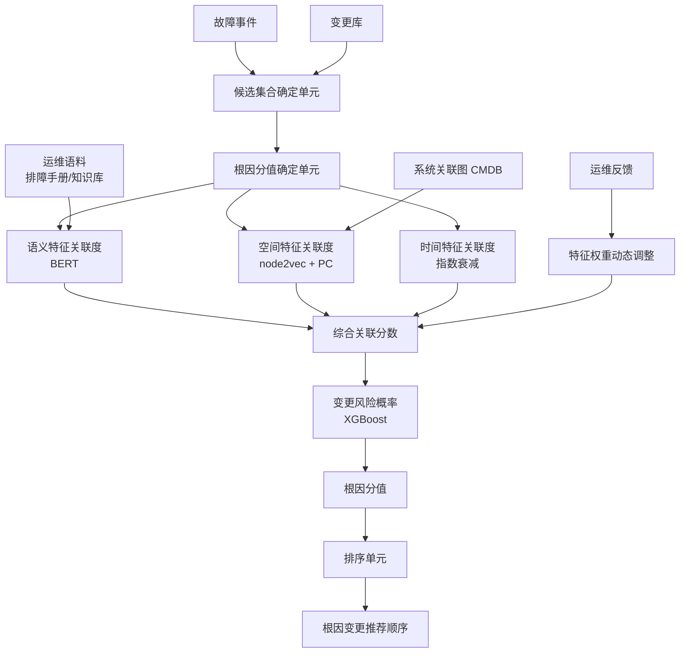
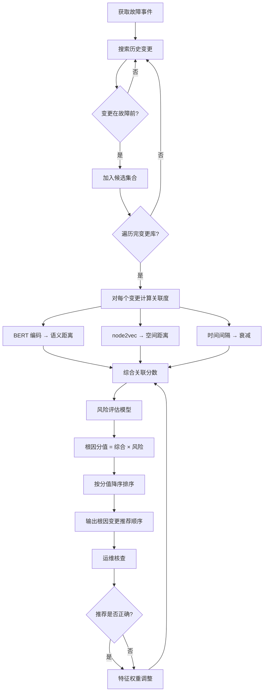

# 根因变更的定位方法和装置（CN113434193B）

> 申请人：北京必示科技有限公司
> 申请日：2021-08-26
> 公开/授权日：2023-11-28
> IPC分类号：G06F 8/72 (2018.01); G06F 11/07 (2006.01); G06F 40/30 (2020.01)
> 发明人：曹立、王泓琳、张文池、隋楷心、刘大鹏
> 关联文档：CN113434193B.pdf

## 一、文档信息速览

| 字段 | 值 |
|---|---|
| 专利号 | CN113434193B |
| 类型 | 授权发明专利（B） |
| 申请号 | 202110986349.7（PDF 扉页标 202110891273.2，以 PDF 扉页为准） |
| 申请日 | 2021-08-26 |
| 公开号 | CN113434193A |
| 公开/授权日 | 授权日 2023-11-28；申请公布日 2021-09-24 |
| 申请人 | 北京必示科技有限公司 |
| 发明人 | 曹立、王泓琳、张文池、隋楷心、刘大鹏 |
| IPC | G06F 8/72; G06F 11/07; G06F 40/30 |
| 法律状态 | 已授权 |
| 专利代理机构 | 北京德琦知识产权代理有限公司 11018 |
| 代理人 | 孙清然、王琦 |
| 审查员 | 柯学 |

> 注：CSV 索引中本专利的标题"一种告警压缩方法及装置"与 PDF 实际标题"根因变更的定位方法和装置"不一致；本文以 PDF 实际公开文本为准。

## 二、背景（Background）

在大型软件服务中，工程师会频繁进行软件变更（修复 bug、提升性能、修改配置等）。由于软件变更会改动系统配置或代码，容易引发故障。根据 Google SRE 一书中的经验，**70% 的故障都是由变更导致的**。在大型系统中，每天故障事件数量众多，如果不及时恢复，将严重影响系统运行性能，进而造成经济损失、降低用户体验。

为此，故障发生后需要快速定位"根因变更"——即确定故障事件是由历史上的哪个变更导致的，工程师据此快速回滚、止损。

传统的根因变更定位方法是：故障发生后，由工程师搜索该应用系统最近发生的变更，逐一对搜索到的变更进行检查，判断是否为根因变更。这种方法在大型系统中存在两个严重问题：

1. **候选集规模大**：大型系统每天发生大量变更，根因变更定位需回溯较长时间（如一周），候选集可达数百项。
2. **人工筛查无序**：传统方法不按"与故障事件关联度"排序，需要遍历整个候选集才能找到根因。

因此，传统方法时间开销很大，定位效率很低。

## 三、目的（Purpose / Problems Solved）

- **痛点 1（候选集无序）**：传统方法不按关联度排序。**解决方案**：对候选集中的每个变更计算根因分值，按分值降序排序，输出推荐顺序。
- **痛点 2（特征关联度单一）**：传统方法只看时间。**解决方案**：同时考虑语义特征、空间特征、时间特征三种关联度。
- **痛点 3（语义特征捕捉难）**：运维领域有专有名词，开源词向量不够。**解决方案**：用 BERT 模型 + 运维排障手册 + 运维知识库训练专属词向量。
- **痛点 4（空间特征难量化）**：应用系统之间关系复杂。**解决方案**：用 PC 算法挖掘系统关联图，node2vec 生成节点向量，用距离表示空间关联度。
- **痛点 5（时间特征一刀切）**：固定权重不科学。**解决方案**：时间间隔越小权重越大（时间衰减特性）。
- **痛点 6（变更风险未考虑）**：不同变更风险差异大（如版本上线 vs 扩容）。**解决方案**：训练变更风险评估模型，将"风险概率"作为乘子加入到根因分值中。
- **痛点 7（特征权重固定）**：人工设置不灵活。**解决方案**：根据运维反馈动态调整特征权重。

## 四、核心原理（Principles）

### 4.1 系统总览

系统由三大单元组成：

- **候选集合确定单元**：根据故障事件发生时间，搜索"在故障事件之前发生、且时间间隔小于预设值"的所有变更，构成候选集合。
- **根因分值确定单元**：对每个变更，计算其与故障事件之间的特征关联度（语义/空间/时间），加权得到综合关联分数，再乘以变更风险概率，得到根因分值。
- **排序单元**：按根因分值降序排序，输出推荐顺序。

### 4.2 关键概念

- **根因变更**：导致故障事件发生的软件变更。
- **根因变更候选集合**：故障事件之前一段时间内发生的所有变更的集合。
- **特征关联度**：变更与故障事件之间的"关联程度"，由"特征距离"（语义/空间/时间）转化得到。距离越小，关联度越大。
- **语义特征关联度**：基于变更描述信息和事件描述信息的语义向量距离。
- **空间特征关联度**：基于变更所对应系统和事件所对应系统的节点向量距离。
- **时间特征关联度**：基于变更和事件之间的时间间隔。
- **变更风险概率**：基于变更描述信息由风险评估模型预测的"导致故障的概率"。
- **根因分值**：综合关联分数 × 风险概率（仅一种关联度时，直接用关联度作为分值）。
- **BERT**：Bidirectional Encoder Representations from Transformers，来自变换器的双向编码器表征量。
- **node2vec**：图嵌入算法，学习网络节点的向量表示。
- **PC 算法**：基于条件独立性检验的因果图发现算法。

### 4.3 关键数学

**4.3.1 语义特征关联度**

设 $v_c$ 为变更的语义特征向量，$v_e$ 为故障事件的语义特征向量，距离 $d = \|v_c - v_e\|$（或余弦距离）。关联度：

$$
\text{rel}_{\text{sem}} = f_{\text{sem}}(d) = \frac{1}{1 + d}
$$

$d$ 越小，$\text{rel}_{\text{sem}}$ 越大。

**4.3.2 空间特征关联度**

设 $u_c$ 为变更所对应系统的节点向量，$u_e$ 为事件所对应系统的节点向量，距离 $d = \|u_c - u_e\|$。关联度：

$$
\text{rel}_{\text{spa}} = f_{\text{spa}}(d) = \frac{1}{1 + d}
$$

**4.3.3 时间特征关联度**

设 $\Delta t = |t_c - t_e|$ 为变更与故障事件的时间间隔（越小越近），预设映射满足"时间间隔越小 → 关联度越大"。例如指数衰减：

$$
\text{rel}_{\text{tim}}(\Delta t) = e^{-\lambda \Delta t}
$$

其中 $\lambda > 0$ 为衰减系数。

**4.3.4 综合关联分数**

$$
\text{score}_{\text{combine}} = w_1 \cdot \text{rel}_{\text{sem}} + w_2 \cdot \text{rel}_{\text{spa}} + w_3 \cdot \text{rel}_{\text{tim}}
$$

初始 $w_1 = w_2 = w_3 = 1/3$，根据运维反馈动态调整。

**4.3.5 根因分值**

$$
\text{score}_{\text{root}} = \text{score}_{\text{combine}} \times p_{\text{risk}}
$$

其中 $p_{\text{risk}}$ 为变更风险概率。

**4.3.6 变更风险评估模型**

二分类模型（XGBoost），输入是变更描述的 BERT 词向量，输出"导致故障"的概率。

### 4.4 与现有技术的差异

| 维度 | 传统人工排查 | 本发明 |
|---|---|---|
| 候选集规模 | 大 | 同 |
| 排序 | 无 | 按根因分值降序 |
| 特征 | 时间 | 语义+空间+时间 |
| 语义捕捉 | 无 | BERT + 运维语料 |
| 风险评估 | 无 | XGBoost 二分类 |
| 特征权重 | 固定 | 反馈动态调整 |
| 定位速度 | 慢 | Top-1 准确度高，1s 内 |

## 五、算法详解（Algorithm）

### 5.1 输入 / 输出

- **输入**：故障事件 ID、变更库（所有历史软件变更）、故障事件单、变更单。
- **输出**：根因变更推荐顺序（降序）。

### 5.2 伪代码

```python
def locate_root_cause_change(event, change_db):
    # Step 1: 候选集合
    candidates = []
    for change in change_db.all():
        if change.time < event.time and \
           (event.time - change.time) < THRESHOLD:
            candidates.append(change)

    # Step 2: 特征关联度
    event_sem = bert_model.encode(event.description)
    event_node = node2vec_model.encode(event.system)

    for c in candidates:
        # 语义特征关联度
        change_sem = bert_model.encode(c.description)
        d_sem = cosine_distance(event_sem, change_sem)
        rel_sem = 1 / (1 + d_sem)

        # 空间特征关联度
        change_node = node2vec_model.encode(c.system)
        d_spa = cosine_distance(event_node, change_node)
        rel_spa = 1 / (1 + d_spa)

        # 时间特征关联度
        delta_t = (event.time - c.time).total_seconds() / 3600  # 小时
        rel_tim = exp(-LAMBDA * delta_t)

        # 综合关联分数
        score_combine = w1*rel_sem + w2*rel_spa + w3*rel_tim

        # 变更风险概率
        p_risk = risk_model.predict_proba(change_sem)[1]

        # 根因分值
        c.root_score = score_combine * p_risk

    # Step 3: 排序
    candidates.sort(key=lambda c: -c.root_score)
    return candidates
```

### 5.3 关键数学（汇总）

- 语义关联度：$\text{rel}_{\text{sem}} = 1/(1 + \|v_c - v_e\|)$
- 空间关联度：$\text{rel}_{\text{spa}} = 1/(1 + \|u_c - u_e\|)$
- 时间关联度：$\text{rel}_{\text{tim}} = e^{-\lambda \Delta t}$
- 综合关联分数：$\text{score}_{\text{combine}} = w_1\text{rel}_{\text{sem}} + w_2\text{rel}_{\text{spa}} + w_3\text{rel}_{\text{tim}}$
- 根因分值：$\text{score}_{\text{root}} = \text{score}_{\text{combine}} \times p_{\text{risk}}$

### 5.4 复杂度分析

- 候选集合构建：$O(N)$，$N$ 变更库大小
- BERT 编码：每条 $O(L \cdot d)$，$L$ 文本长度，$d$ 隐层维数
- node2vec 编码：$O(|V| \cdot \log|V|)$
- 综合关联分数：$O(K \cdot d)$，$K$ 候选集大小
- 排序：$O(K \log K)$

### 5.5 示例

某电商系统订单服务出现 P0 故障（订单提交失败率从 0.1% 涨到 5%），发生时间 14:30。

变更库中故障前 1 周内的变更共 50 条。算法：

1. **候选集合**：50 条变更。
2. **特征关联度计算**（以变更 1 为例）：
   - 变更 1 描述："订单服务 v2.3.1 上线，修复库存查询 SQL bug"
   - 故障事件描述："订单提交失败率 5%"
   - 语义向量距离 $d_{\text{sem}} = 0.15$ → $\text{rel}_{\text{sem}} = 0.87$
   - 系统节点向量距离 $d_{\text{spa}} = 0.05$（同一应用系统）→ $\text{rel}_{\text{spa}} = 0.95$
   - 时间间隔 2 小时 → $\text{rel}_{\text{tim}} = e^{-0.5 \cdot 2} = 0.37$
   - 综合分数 = 0.87×0.4 + 0.95×0.3 + 0.37×0.3 = 0.348 + 0.285 + 0.111 = 0.744
   - 风险概率 = 0.85（版本上线风险高）
   - 根因分值 = 0.744 × 0.85 = 0.632
3. **排序**：变更 1 排第 1。
4. **运维人员核查**：回滚 v2.3.1，故障恢复 → 算法推荐成功。

## 六、系统架构图（Architecture）



## 七、流程图（Process Flow）



## 八、关键创新点（Key Innovations）

- **+ 多维度特征关联度**：同时考虑语义、空间、时间三种关联度，比传统单一时间维度更准确。
- **+ 运维领域 BERT 微调**：用排障手册和运维知识库训练专属 BERT，能捕捉"文件系统"和"file system"这类运维专有名词的语义关联。
- **+ 变更风险评估模型**：用 XGBoost 训练风险二分类模型，识别"高风险变更"（如版本上线），把"风险"显式纳入根因分值。
- **+ 特征权重动态调整**：根据运维反馈动态调整三种特征关联度的权重，让模型持续自我优化。
- **+ node2vec + PC 算法的空间关联度**：用 PC 算法挖掘系统关联图，node2vec 学习节点向量，量化应用系统之间的空间关联。

## 九、权利要求摘要（Claims Summary）

- **独立权利要求 1（方法）**：核心 3 步——候选集合 → 根因分值 → 排序。
- **从属权利要求 2**：语义特征关联度（BERT + 距离反比）。
- **从属权利要求 3**：空间特征关联度（node2vec + PC 算法）。
- **从属权利要求 4**：时间特征关联度（时间衰减）。
- **从属权利要求 5**：根因分值确定规则（单一关联度直接用；多种关联度加权）。
- **从属权利要求 6**：变更风险评估（XGBoost 二分类）+ 综合分数 × 风险。
- **独立权利要求 7（装置）**：候选集合确定、根因分值确定、排序三大单元。
- **权利要求 8-9**：电子设备和计算机可读存储介质。

## 十、应用场景（Use Cases）

- **银行核心系统故障根因定位**：每日 50+ 变更中快速定位导致 P0 故障的根因。
- **电商大促期间故障定位**：大促期间变更频繁，故障定位至关重要。
- **云服务故障归因**：微服务架构下，定位"哪个部署/配置变更导致故障"。
- **运营商网络故障定位**：网络配置变更后的故障根因快速定位。
- **互联网金融合规审计**：故障归因报告自动化生成。

## 十一、相关专利（Related Patents in this set）

- **CN112559237B / CN112559238B 排障方法**：本专利定位"软件变更根因"，它们定位"事件根因"（如 AAS-Total 异常），互为补充。
- **CN111858231B 单指标异常检测**：本专利"根因定位"通常配合"异常检测"使用，先检测再定位。
- **CN112905671A 时间序列异常处理**：与本专利配合使用，检测异常 + 定位根因。

## 十二、术语表（Glossary）

| 术语 | 解释 |
|---|---|
| 根因变更 | 导致故障事件发生的软件变更 |
| 候选集合 | 故障事件之前发生的变更的集合 |
| 特征关联度 | 变更与故障事件之间的关联程度 |
| 特征距离 | 变更与故障事件在特征空间中的距离 |
| 语义特征关联度 | 基于文本语义距离的关联度 |
| 空间特征关联度 | 基于系统节点向量距离的关联度 |
| 时间特征关联度 | 基于时间间隔的关联度 |
| 根因分值 | 综合关联分数 × 风险概率 |
| 变更风险概率 | 变更导致故障的可能性 |
| BERT | Bidirectional Encoder Representations from Transformers |
| node2vec | 图嵌入算法 |
| PC 算法 | 因果图发现算法 |
| 风险评估模型 | XGBoost 二分类模型，预测变更风险 |

## 十三、参考与延伸阅读

- Devlin J, Chang M W, Lee K, et al. "BERT: Pre-training of Deep Bidirectional Transformers for Language Understanding." NAACL, 2019.
- Grover A, Leskovec J. "node2vec: Scalable Feature Learning for Networks." KDD, 2016.
- Spirtes P, Glymour C. "An Algorithm for Fast Recovery of Sparse Causal Graphs." Social Science Computer Review, 1991. (PC 算法)
- Chen T, Guestrin C. "XGBoost: A Scalable Tree Boosting System." KDD, 2016.
- Google SRE Book
