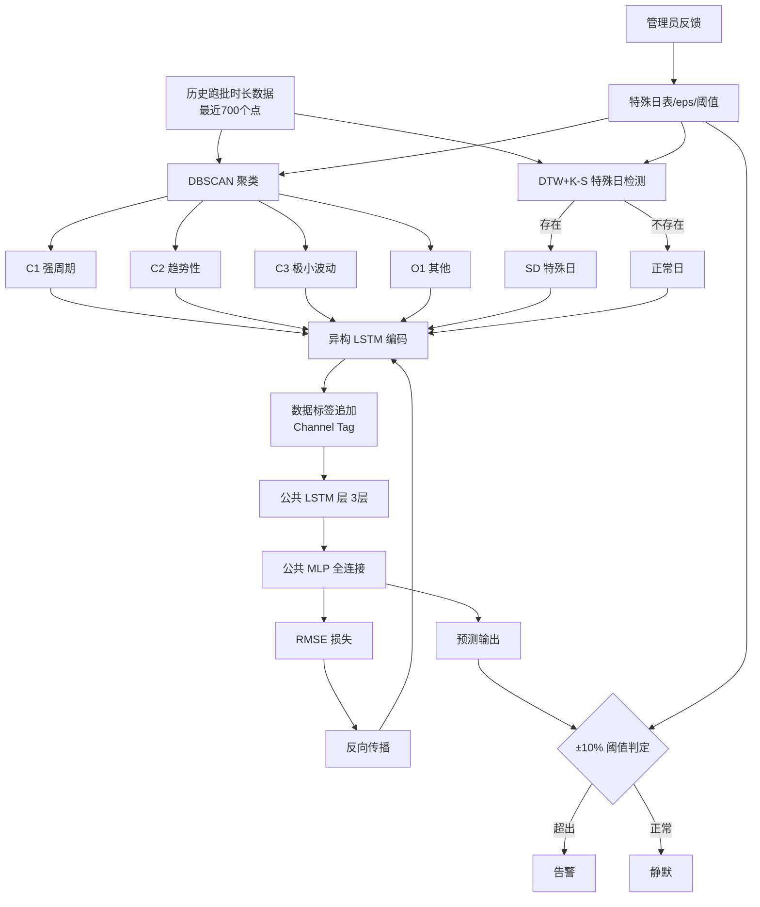
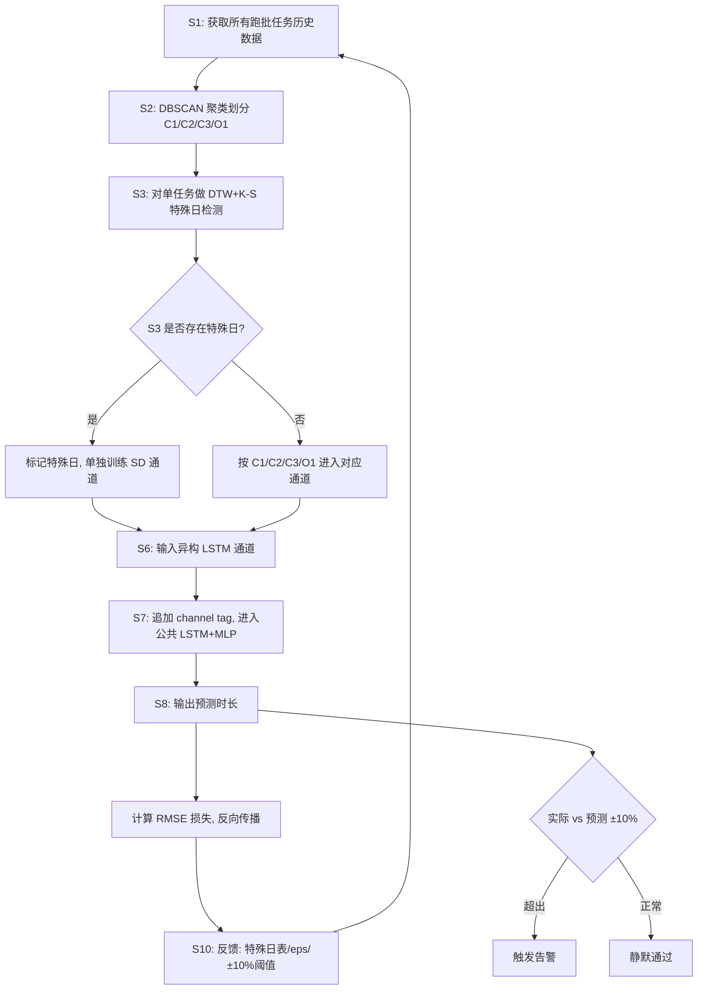

# 一种批处理任务中单任务时间的预测方法、系统及存储介质（CN113448808B）

> 申请人：北京必示科技有限公司  
> 申请日：2021-08-30  
> 公开/授权日：2021-11-12（申请公布日 2021-09-28，授权公告日 2021-11-12）  
> IPC分类号：G06F 11/30 (2006.01); G06K 9/62 (2006.01); G06N 3/04 (2006.01); G06N 3/08 (2006.01)  
> 发明人：张文池、曹立、隋楷心、刘大鹏  
> 关联文档：同目录下 CN113448808B.pdf

## 一、文档信息速览

| 字段 | 值 |
|---|---|
| 专利号 | CN113448808B |
| 类型 | 发明专利申请（A）/ 授权发明专利（B） |
| 申请号 | 202111000535.5 |
| 申请日 | 2021-08-30 |
| 公开号 | CN113448808A（公布日 2021-09-28） |
| 授权公告号 | CN113448808B（授权公告日 2021-11-12） |
| 申请人 | 北京必示科技有限公司 |
| 发明人 | 张文池、曹立、隋楷心、刘大鹏 |
| IPC | G06F 11/30; G06K 9/62; G06N 3/04; G06N 3/08 |
| 审查员 | 吴雪 |
| 法律状态 | 已授权（2021-11-12） |
| 权利要求页数 | 2 页（共 9 项权利要求，1 项方法独立权利要求 + 1 项系统独立权利要求 + 1 项介质独立权利要求 + 从属权利要求） |
| 说明书页数 | 9 页 |
| 附图页数 | 3 页（5 张图） |

## 二、背景（Background）

批处理任务（Batch Job）是金融、电信、ERP 等关键业务系统中最基础也是最重要的后台任务形态之一。典型的批处理任务包括：每日结息、日终对账、报表生成、跨行清结算、数据备份、历史统计等。批处理任务通常按照一定周期（小时级、日级、周级、月级）定时执行，并要求在"营业窗口"开始之前完成全部任务，一旦超时未完成，将直接影响第二天的正常营业（如银行结息未完成将影响全部客户的账户余额入账），对业务连续性造成严重冲击。

然而，批处理任务在企业生产环境中长期面临如下痛点：

1. **单任务时长难以预测**：每个批处理任务由若干"子任务/单任务"组成，单任务的执行时长直接决定后续任务能否如期启动；运行时长异常（过长或过短）往往是潜在故障的早期信号。
2. **任务形态复杂多样**：跑批任务在时序上呈现多种不同形态——强周期性（周末分析报表）、节假日相关性（与线上交易强相关，如 11.11、春节等促销或长假）、趋势性（数据备份任务随业务量增长）、高稳定性低波动、以及偶发超长耗时（异常情况）。单一模型难以适配所有形态。
3. **特殊日难以维护**：与一般业务监控时序不同，批处理任务存在大量"特殊日"，包括每月第一天、季度末 20 日、年末倒数第二天、每月第一个工作日、促销活动日（11.11/6.18）等。传统基于固定阈值的监控需要工程师手动维护特殊日表，运维成本极高。
4. **设备资源浪费严重**：为保障跑批业务的正常运行，企业通常会配置相当比例的冗余机器专门用于批处理，以防机器故障导致跑批任务失败。说明书给出了典型案例——"某国有银行有 6 台服务器专门处理跑批任务，一般 CPU 利用率不超过 40%"。设备资源浪费严重。
5. **现有算法适应性差**：业界对于跑批时间的预测普遍采用基础时序预测算法（ARIMA、指数平滑等），并由管理员依据经验设置固定阈值。特殊日维护和阈值均需额外人工设置，难以适应系统动态变化，且在指标类别划分上往往采用"人为划分"方式，无法准确体现数据特点，模型也无法动态调整。

**对比文件 CN111737095A**（必示自身专利）的不足：采用了不同的模型训练人为划分的不同类别数据，存在三方面问题：（一）人为划分的方式无法准确体现数据特点；（二）训练模型无法动态根据实际数据特点调整；（三）多个模型无法综合处理数据间的耦合。

## 三、目的（Purpose / Problems Solved）

- **痛点 1 → 解决方案**：批处理时序数据形态多样、单一模型泛化能力差。**方案**：用 DBSCAN 聚类自动将所有跑批任务划分到 C1（强周期）、C2（趋势性）、C3（极小波动）、O1（其他）四个通道，并配合异构输入层 + 公共 LSTM+MLP 的统一模型架构，实现"分而治之 + 协同训练"。
- **痛点 2 → 解决方案**：特殊日识别需要人工维护、效率低。**方案**：使用动态时间规整（DTW）+ K-S 检验对每个单任务历史数据做双轨自动识别，识别出特殊日后单独训练。
- **痛点 3 → 解决方案**：固定阈值监控易误报、漏报。**方案**：基于预测值动态生成 ±10% 阈值区间，超出区间才报警；并支持人工反馈调整。
- **痛点 4 → 解决方案**：多模型无法耦合训练、预测精度受限。**方案**：将聚类后的不同通道数据输入到同一神经网络模型的多个通道，共享后端 LSTM 与 MLP，使多种特征在公共层充分耦合。
- **痛点 5 → 解决方案**：指标类别划分错误导致预测失真。**方案**：在输入层保留公共神经网络模块作为"兜底"，即使类别划分有误，公共层仍能给出相对准确的预测。

## 四、核心原理（Principles）

### 4.1 系统总览

本发明的核心思想可概括为"**先聚类、再特殊日检测、最后异构-公共统一模型预测**"。具体而言：首先从批处理任务的历史执行时长数据中，使用 DBSCAN 无监督聚类算法把全部任务分成 4 个类别（C1/C2/C3/O1）；然后对每一个单任务，用 DTW 距离 + K-S 检验判断其是否存在"特殊日"（如每月 1 日、季度末、春节、双 11 等）；最后，把不同类别和特殊日的数据分别输入到同一个神经网络模型的多个"异构输入通道"，各通道独立用 LSTM 编码时序特征后，再汇聚到公共的 LSTM+MLP 模块中输出预测值。整体训练目标是最小化预测时长与真实时长的 RMSE。

### 4.2 关键概念定义

- **批处理任务（Batch Job）**：周期性执行的离线任务集合，如日终对账、报表生成。
- **单任务**：批处理任务中的子任务节点。
- **指标类别（C1/C2/C3/O1）**：根据跑批时长时序形态划分的四类。C1-周期性明显；C2-趋势性明显；C3-波动极小；O1-无明显特征、其他。
- **特殊日（Special Day）**：批处理任务中显著区别于普通工作日的日期集合，如每月 1 日、季度末 20 日、年末倒数第二天、春节、双 11、618 等。
- **DTW 距离（Dynamic Time Warping）**：动态时间规整距离，衡量两个时间序列在时间轴上可非线性对齐后的相似度。
- **K-S 检验（Kolmogorov-Smirnov Test）**：非参数假设检验，用于判断两个样本分布是否一致。
- **异构神经网络（Heterogeneous Neural Network）**：输入层不同通道具有不同的网络尺寸和结构，适配不同特征数据。
- **公共神经网络（Shared Neural Network）**：所有异构通道汇聚后共享的后端网络（3 层 LSTM + 1 层 MLP）。
- **数据标签（Channel Tag）**：在数据进入公共层前附加的标识数据来源通道的额外特征，提升公共层对通道类型的可追溯性。

### 4.3 数学原理

**1) DTW 距离（公式 1）**

$$
D(i, j) = d(i, j) + \min\bigl[D(i-1, j),\ D(i, j-1),\ D(i-1, j-1)\bigr]
$$

其中 $d(i, j) = |T_i - T_j|$，$T_i$ 为第 $i$ 次跑批任务的执行时长，$D(i,j)$ 为匹配矩阵元素。该递推式在三个候选路径（$i-1, j$）、$(i, j-1)$、$(i-1, j-1)$ 中取最小距离累加，从而允许时间序列在时间轴上做非线性"伸缩"对齐。

**2) K-S 检验**

对特殊日 DTW 距离分布 $F_s$ 与非特殊日 DTW 距离分布 $F_n$，构造统计量：

$$
D_{KS} = \sup_x |F_s(x) - F_n(x)|
$$

当 $D_{KS}$ 超过阈值（典型 0.03）时，认为两分布不一致，判定该任务存在特殊日。

**3) 图注意力融合特征**（参见权利要求 3 中的关联权重，本专利主要在 LSTM 中实现）

**4) 训练目标函数 RMSE（公式 2）**

$$
\mathcal{L}_{RMSE} = \sqrt{\frac{1}{N}\sum_{k=1}^{N}\bigl(f(x_k) - y_k\bigr)^2}
$$

其中 $x_k$ 为训练样本，$f(\cdot)$ 为预测函数，$y_k$ 为真实跑批时长，$N$ 为预测数据点个数。

### 4.4 与现有技术的差异

| 维度 | 现有技术 | 本发明 |
|---|---|---|
| 数据划分 | 人工划分或单一模型 | DBSCAN 自动聚类 + 异构通道 |
| 特殊日处理 | 工程师手动维护 | DTW + K-S 自动识别 + 单独训练 |
| 模型结构 | 单一模型或多独立模型 | 异构输入 + 公共 LSTM+MLP 统一模型 |
| 类别划分错误鲁棒性 | 多独立模型易受错误划分影响 | 公共层兜底，耦合降风险 |
| 异常检测 | 固定阈值 | 预测值 ±10% 动态阈值 |
| 反馈优化 | 不支持 | 支持特殊日、类别、阈值三维反馈 |

## 五、算法详解（Algorithm）

### 5.1 输入 / 输出

- **输入**：所有跑批任务的历史执行时长数据（每条取最近 700 个点，约 2 年数据）。
- **输出**：下一个批处理周期的单任务执行时长预测值；以及预测异常（超过 ±10%）的告警信息。

### 5.2 伪代码

```python
def batch_task_time_predict(history_data):
    """
    history_data: dict, {task_id: [(timestamp, duration), ...]}
    """
    # 1) 数据准备：每个任务取最近 700 个数据点
    history = {tid: data[-700:] for tid, data in history_data.items()}

    # 2) S2: DBSCAN 聚类，划分为 C1/C2/C3/O1
    features = compute_cluster_features(history)  # 周期性/趋势性/波动性等
    cluster_labels = DBSCAN(eps=eps_val, min_samples=ms).fit_predict(features)
    # cluster_labels ∈ {0(C1), 1(C2), 2(C3), -1(O1)}

    # 3) S3: 特殊日识别（对每个单任务）
    for tid, data in history.items():
        special_days = preset_special_dates()  # 月初/季末/春节/双11/618...
        has_special = False
        for sd in special_days:
            sd_data, normal_data = filter_by_date(data, sd)
            dtw_sd = pairwise_dtw(sd_data)         # 公式 1
            dtw_nm = pairwise_dtw(normal_data)
            ks_stat, p = ks_2samp(dtw_sd, dtw_nm)  # K-S 检验
            if ks_stat > KS_THRESHOLD:              # 0.03
                has_special = True
                break
        history[tid].special = has_special

    # 4) S4: 确定每个单任务的指标类别
    for tid in history:
        history[tid].category = cluster_labels[tid]

    # 5) S5: 异构-公共统一模型预测
    model = HeteroSharedLSTM(
        channel_specs={
            'C1':  {'in_dim': 14, 'lstm_hidden': 32},  # 强周期，1*14
            'C2':  {'in_dim': 30, 'lstm_hidden': 64},  # 趋势性，1*30
            'C3':  {'in_dim': 14, 'lstm_hidden': 16},  # 极小波动，1*14
            'O1':  {'in_dim': 30, 'lstm_hidden': 32},  # 其他，1*30
            'SD':  {'in_dim': 14, 'lstm_hidden': 32},  # 特殊日，1*14
        },
        shared_lstm_layers=3,
        mlp_hidden=4
    )

    # 每个 channel 各自训练特有 LSTM（异构），汇聚后过公共 LSTM+MLP
    for epoch in range(EPOCHS):
        for tid, data in history.items():
            ch = 'SD' if data.special else data.category
            x = data.duration_window                       # 1*14 或 1*30
            x = add_channel_tag(x, ch)                     # 数据标签
            pred = model.forward(ch, x)
            loss = rmse(pred, data.ground_truth_duration)
            loss.backward(); optim.step()

    # 6) S6: 反馈
    # (a) 特殊日增删 → 调整 K-S 阈值
    # (b) 类别修正 → 调整 eps
    # (c) 异常阈值调整 → 默认 ±10%

    # 7) 在线预测
    next_pred = model.predict(channel, latest_window)
    if abs(actual - next_pred) / next_pred > 0.10:
        emit_alert(tid, next_pred, actual)
```

### 5.3 关键数学

- **DTW 距离**（公式 1）：动态时间规整的递推实现。
- **K-S 检验统计量**：经验 CDF 差值的上确界。
- **RMSE 损失**（公式 2）：见 §4.3。

### 5.4 复杂度分析

- DBSCAN 聚类：对 $n$ 条历史数据复杂度 $O(n \log n)$。
- DTW 距离：$O(L^2)$，$L$ 为窗口长度。
- K-S 检验：$O(m \log m)$，$m$ 为距离样本数。
- 异构-公共 LSTM 训练：每 epoch 复杂度 $O(B \cdot (k_1 + k_2 + k_3) \cdot L)$，其中 $B$ 为 batch size，$k_i$ 为各通道 LSTM 隐藏单元数。整体模型参数量小于"多独立模型"方案。

### 5.5 示例

以"每月 1 日是特殊日"的判别为例：
1. 从该单任务历史中筛选每月 1 日的数据点（如 24 个月即 24 个点）。
2. 计算这 24 个点两两之间的 DTW 距离 → 得到特殊日 DTW 距离集合 $D_s$。
3. 对非特殊日数据点两两计算 DTW 距离 → 得到 $D_n$。
4. K-S 检验比较 $D_s$ 与 $D_n$ 分布：若 $D_{KS} > 0.03$，则判定该任务存在"每月 1 日"特殊日。
5. 对该任务的特殊日子集单独训练一个 LSTM 通道（SD 通道），正常日数据进入 C1/C2/C3/O1 之一。
6. 公共 LSTM+MLP 给出下次（可能是月初也可能是月中）的时长预测。

## 六、系统架构图（Architecture）



## 七、流程图（Process Flow）



## 八、关键创新点（Key Innovations）

- **+ 异构输入 + 公共后端统一模型**：用 DBSCAN 自动聚类把不同形态数据分到 C1/C2/C3/O1 四个异构通道独立训练 LSTM，但汇聚后共享公共 LSTM+MLP 层，兼顾"分而治之"与"协同耦合"，既提高精度又降低模型复杂度。
- **+ DTW + K-S 双轨自动特殊日识别**：无需人工维护特殊日表，使用 DTW 距离分布的 K-S 检验自动判定任务是否存在月初/季末/春节/双 11 等特殊日，对特殊日子集单独训练。
- **+ 数据标签（Channel Tag）通道可追溯**：在数据进入公共层前增加体现通道类型的数据标签，使公共层 LSTM/MLP 在训练时能感知数据来源通道类型，提升反馈调优效率。
- **+ 动态阈值替代固定阈值**：基于预测值生成 ±10% 动态阈值区间，异常检测鲁棒性强；并提供三维反馈通道（特殊日增删、类别修正、阈值调整）。
- **+ 类别划分错误的鲁棒性**：保留公共神经网络模块作为兜底，即使 DBSCAN 聚类将某任务划分到错误类别，公共层仍能给出相对准确预测，避免"完全错误的子模型"导致的灾难性后果。

## 九、权利要求摘要（Claims Summary）

- **独立权利要求 1（方法）**：一种批处理任务中单任务时间的预测方法，包括 S1 获历史数据 → S2 DBSCAN 聚类划分指标类别 → S3 DTW 检验判断特殊日 → S4 确定单任务类别和特殊日 → S5 异构-公共神经网络统一模型预测 → 目标函数为 RMSE。
- **独立权利要求 8（系统）**：对应方法的系统权利要求，模块包括数据获取模块、指标类别划分模块、特殊日判断模块、单任务数据类别确定模块、单任务时间预测模块、反馈模块。
- **独立权利要求 9（介质）**：存储有计算机程序的存储介质，被处理器执行时实现上述方法。
- **从属权利要求 2**：S2 具体使用 DBSCAN 实现聚类。
- **从属权利要求 3-4**：S3 包括 S3.1 预设特殊日 + S3.2 DTW 自动识别；S3.2 给出 DTW 距离公式。
- **从属权利要求 5**：公共预测神经网络模块包括 3 层公共 LSTM + 1 层公共 MLP。
- **从属权利要求 6**：目标函数为预测值与真实时长的 RMSE。
- **从属权利要求 7**：S6 反馈机制，至少包括特殊日反馈、预测指标类别反馈、异常检测判定范围反馈。

## 十、应用场景（Use Cases）

- **金融银行日终批处理监控**：每日 23:00-03:00 跑结息、对账、清算等关键任务，预测单任务时长并在任务开始时即给出完成时间预测，超期立即告警。
- **证券交易系统数据备份**：备份任务量随交易量增长呈趋势性，本方法能自动归到 C2 趋势性通道，预测精度更高。
- **电商大促前历史统计**：双 11、618 等特殊日，DTW+K-S 自动识别并单独训练，预测大促当日数据生成任务的合理耗时。
- **运营商月结与季度对账**：每月 1 日、季度末 20 日的特殊跑批任务自动识别，避免月末批量误报。
- **国资委/财政批量报表系统**：多个子任务跨多日串行执行，本方法支持单任务粒度时长预测与异常告警。
- **某国有银行跑批资源优化**：背景案例中"6 台服务器跑批但 CPU 利用率不超过 40%"，本方法可辅助压测与资源弹性调度。

## 十一、相关专利（Related Patents in this set）

- **CN113900844B** 一种基于服务码级别的故障根因定位方法（同样使用图注意力机制+LSTM+MLP 多指标异常检测，但目标是根因定位而非时长预测）。
- **CN113962273B** 一种基于多指标的时间序列异常检测方法（异构拓扑图 + 图注意力 + LSTM，与本方法在多指标关联建模思想上有共通性）。
- **CN113568991B** 一种基于动态风险的告警处理方法（在告警层面做拓扑层合并；本专利的特殊日识别可作为其上游单任务异常信号源）。
- **CN114721861B** 一种基于日志差异化比对的故障定位方法（基于日志的根因定位，与本方法在"故障诊断"业务目标上互补）。

## 十二、术语表（Glossary）

- **DBSCAN（Density-Based Spatial Clustering of Applications with Noise）**：基于密度的聚类算法，无需预设簇数，能识别噪声点（"其他类"）。
- **DTW（Dynamic Time Warping）**：动态时间规整，一种衡量两个时间序列相似度的方法，允许时间轴上非线性对齐。
- **K-S 检验（Kolmogorov-Smirnov Test）**：基于经验 CDF 最大差异的非参数双样本检验。
- **LSTM（Long Short-Term Memory）**：长短期记忆网络，适合编码时序长期依赖。
- **MLP（Multi-Layer Perceptron）**：多层感知机，全连接神经网络。
- **RMSE（Root Mean Square Error）**：均方根误差，常用于回归任务的损失函数。
- **CMDB（Configuration Management Database）**：配置管理数据库，记录 IT 资产与调用关系。
- **特殊日（Special Day）**：业务上区别于普通工作日的日期。
- **跑批**：批处理的口语化简称。
- **Channel Tag（数据标签）**：附加在数据上的标识其来源通道的特征向量。
- **异构-公共架构**：本发明的核心网络结构（异构输入 + 公共后端）。

## 十三、参考与延伸阅读

- H. Sakoe, S. Chiba, "Dynamic programming algorithm optimization for spoken word recognition", IEEE Trans. ASSP, 1978（DTW 经典论文）。
- M. Ester, H.-P. Kriegel, J. Sander, X. Xu, "A Density-Based Algorithm for Discovering Clusters in Large Spatial Databases with Noise", KDD 1996（DBSCAN 经典论文）。
- S. Hochreiter, J. Schmidhuber, "Long Short-Term Memory", Neural Computation 1997（LSTM 经典论文）。
- 业务跑批场景的批处理调度可参考 Apache Airflow、DolphinScheduler 等开源项目的 DAG 调度模型。
- 同批次必示专利 CN113900844B / CN113962273B 是必示"异质图 + 图注意力 + LSTM"系列在告警/根因/异常检测方向上的姊妹专利。
