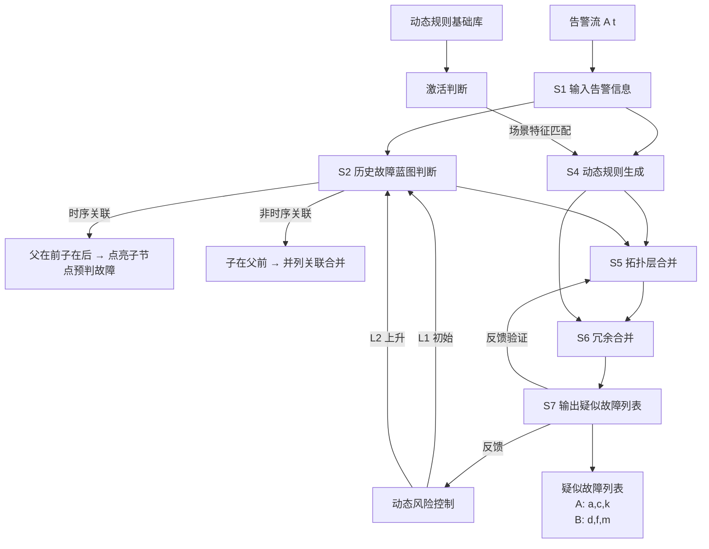
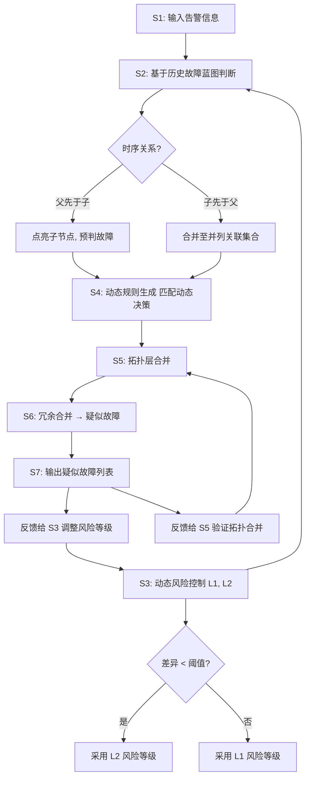

# 一种基于动态风险的告警处理方法及系统（CN113568991B）

> 申请人：北京必示科技有限公司  
> 申请日：2021-09-22  
> 公开/授权日：2022-02-08（申请公布日 2021-10-29，授权公告日 2022-02-08）  
> IPC分类号：G06F 16/23 (2019.01); G06F 16/28 (2019.01); G06F 16/2455 (2019.01); G06Q 10/06 (2012.01)  
> 发明人：曹立、殷康璘、隋楷心、刘大鹏  
> 关联文档：同目录下 CN113568991B.pdf

## 一、文档信息速览

| 字段 | 值 |
|---|---|
| 专利号 | CN113568991B |
| 类型 | 发明专利（B，已授权） |
| 申请号 | 202111102880.X |
| 申请日 | 2021-09-22 |
| 公开号 | CN113568991A（公布日 2021-10-29） |
| 授权公告号 | CN113568991B（授权公告日 2022-02-08） |
| 申请人 | 北京必示科技有限公司 |
| 发明人 | 曹立、殷康璘、隋楷心、刘大鹏 |
| IPC | G06F 16/23; G06F 16/28; G06F 16/2455; G06Q 10/06 |
| 审查员 | 欧晓丹 |
| 权利要求页数 | 1 页（共 5 项权利要求） |
| 说明书页数 | 6 页 |
| 附图页数 | 1 页（2 张图） |
| 法律状态 | 已授权（2022-02-08） |

## 二、背景（Background）

在大型数据中心、云计算与微服务架构中，告警是反映系统异常的最直接信号。然而，**告警数据量极大、冗余度高、关联复杂**，从海量告警中快速定位真实故障是 AIOps 领域公认的核心难题之一。

传统告警处理通常采取"两级合并"策略，但存在以下两大痛点：

1. **第一种方式——充分条件合并**：仅当子节点和父节点全部告警时才在父节点做同级合并。该方式**预判性差**——很多情况下父节点告警还未产生时，子节点告警已经堆积如山，等到父节点告警出现已经错过最佳处理窗口。
2. **第二种方式——激进风险合并**：直接跳过父节点，在虚拟父节点处做同级合并。该方式**误判率高**——风险阈值设得过于激进时，会把无关告警也合并在一起，反而降低了动态决策的准确性。

此外，传统方案普遍"基于特定规则"——每类场景需要工程师单独分析、讨论、设定规则，工作量大、可操作性差，且无法适应业务动态变化。

**对比文件**：US 5946373 A (1999) 与 US 2010332918 A1 (2010) 在专利说明书中被列为对比文件，均未同时解决"时序关联"与"动态风险合并"两个问题。

## 三、目的（Purpose / Problems Solved）

- **痛点 1 → 解决方案**：传统"父-子充分条件合并"预判性差。**方案**：基于历史故障蓝图，按时序区分"并列关联"与"子父关联"——若父模块告警先于子模块出现，则点亮子模块节点并预判为故障；若子模块先出现，则合并到不依赖时序的并列关联集合中。
- **痛点 2 → 解决方案**：激进合并容易误判。**方案**：引入 4 级风险等级（Risk Level 1-4），采用"上升尝试 + 反馈回退比例"机制自适应调整风险等级。
- **痛点 3 → 解决方案**：静态规则无法适应场景变化。**方案**：建立"动态规则基础库 + 激活判断"机制——基础库覆盖所有历史合理规则，激活判断根据当前场景特点激活子集规则，兼顾规则丰富性与场景针对性。
- **痛点 4 → 解决方案**：多模块独立处理无统一拓扑视图。**方案**：通过拓扑层合并（点亮 + 合并到同一网络拓扑）实现全网故障节点标注与可视化。
- **痛点 5 → 解决方案**：风险等级固定，无法随业务演化。**方案**：动态风险控制模块持续接收疑似故障列表反馈，自适应更新风险等级。

## 四、核心原理（Principles）

### 4.1 系统总览

本发明构建了一个"**历史故障蓝图 + 动态风险控制 + 动态规则匹配 + 拓扑层合并 + 冗余合并**"的五位一体告警处理系统。系统接收实时告警流或周期性告警批次输入，先在历史故障蓝图中查询告警所在节点及其时序关联关系，输出第一/第二判断结果（基于初始/上升风险等级），然后匹配动态规则生成库生成动态决策，再对异常节点做拓扑层合并与冗余合并，最终输出疑似故障列表。疑似故障列表反馈回风险控制模块和动态规则模块，形成闭环。

### 4.2 关键概念定义

- **历史故障蓝图（Historical Fault Blueprint）**：基于历史告警关联关系绘制的拓扑图，包括两种关系——**并列关联关系**（与时序无关，告警信息组合形成）与**子父关联关系**（带时序，先后出现的告警形成）。
- **并列关联关系**：同一时刻或同一窗口内共同出现的告警集合，例如同一服务的多种 KPI 异常告警。
- **子父关联关系**：带先后时序的告警组合，例如"父模块告警先出现 → 子模块告警后出现"。
- **动态风险等级（Risk Level 1-4）**：本发明定义的 4 级风险控制参数，详见 §4.4。
- **动态规则基础库（Dynamic Rule Base）**：覆盖所有过往历史发生的合理规则的全集。
- **动态规则生成库（Dynamic Rule Library）**：根据当前场景特点，从基础库中激活的子集规则。
- **拓扑层合并（Topology Merge）**：将异常节点点亮并合并到同一网络拓扑下，便于可视化与全网故障识别。
- **冗余合并（Redundancy Merge）**：基于动态决策和拓扑层合并结果，对重复的故障信号做去重。
- **疑似故障（Suspected Fault）**：经过多重合并后剩余的、最有可能是真实故障的告警集合。
- **点亮（Light Up）**：在蓝图中以特殊颜色或形状标注异常节点的视觉行为。

### 4.3 数学原理

虽然说明书未显式给出太多数学公式，但核心思想是"切分关联 + 风险上升尝试 + 反馈调节"。可以用如下数学符号化表达：

1. **风险等级差异阈值判定**：

   $$
   \Delta R = |J_1 - J_2|
   $$

   其中 $J_1$ 为基于初始风险等级的判断结果，$J_2$ 为基于上升后风险等级的判断结果，$\Delta R$ 为差异。若 $\Delta R < \tau_1$（第一阈值），则以第二风险等级 $L_2$ 作为最终故障风险等级。

2. **风险等级上升更新规则**（场景 3 适用）：

   $$
   L_{new} = \begin{cases}
   L_{old} & \text{if } \rho_{fallback} \geq \tau_2 \\
   L_{old} + 1 & \text{if } \rho_{fallback} < \tau_2
   \end{cases}
   $$

   其中 $\rho_{fallback}$ 为时间窗口内故障列表的回退比例，$\tau_2$ 为回退阈值。

3. **子父关联与并列关联的时序分离判别**（伪逻辑）：

   $$
   \text{若}\ t(\text{parent alert}) < t(\text{child alert}) \Rightarrow \text{点亮子节点, 预判为故障}
   $$

   $$
   \text{若}\ t(\text{parent alert}) \geq t(\text{child alert}) \Rightarrow \text{合并至并列关联}
   $$

### 4.4 风险等级表（表 2）

| Risk Level | 风险行为 | 描述 |
|---|---|---|
| 1 | No jump, only peer search | 只在当前子节点层做合并 |
| 2 | Up jump, up search | 当子节点在蓝图中全部点亮，则预判点亮父节点 |
| 3 | Risk Up Jump, "Up peer" search | 当子节点未全部点亮但达到一定比例，预判点亮父节点，同时做父节点同层点亮合并 |
| 4 | Risk Up Jump, "Up peer" jump | 当子节点未全部点亮但达到一定比例，预判点亮父节点，同时在已有子节点中搜索可预判点亮的同级父节点做父节点同层预判合并 |

### 4.5 与现有技术的差异

| 维度 | 现有技术 | 本发明 |
|---|---|---|
| 关联关系建模 | 不区分时序 | 切分并列关联 vs. 子父关联 |
| 风险控制 | 静态阈值 | 4 级动态风险 + 上升尝试反馈 |
| 规则库 | 单一静态规则 | 基础库 + 场景激活 |
| 拓扑呈现 | 列表 | 蓝图 + 点亮 + 拓扑合并 |
| 反馈学习 | 无 | 疑似故障列表反馈 + 自适应风险等级更新 |

## 五、算法详解（Algorithm）

### 5.1 输入 / 输出

- **输入**：实时或周期性告警信息 $A(t) = \{a_1, a_2, ..., a_n\}$，每条告警包含模块、节点、KPI、时戳。
- **输出**：疑似故障列表 $\{F_1, F_2, ..., F_k\}$，每个故障 $F_i$ 关联一组告警 $\{a, c, ..., k\}$。

### 5.2 伪代码

```python
def dynamic_risk_alert_handler(alert_input, blueprint, rule_base, current_risk_level):
    """
    alert_input: list of alerts at time t
    blueprint: Historical Fault Blueprint (graph with parallel + parent-child relations)
    rule_base: Dynamic Rule Base (full set of historical rules)
    current_risk_level: initial risk level (1..4)
    """
    # S1: 输入告警信息
    alerts = alert_input

    # S3: 动态风险控制（可选，反馈循环）
    L1 = current_risk_level
    L2 = min(L1 + 1, 4)  # 风险等级上升处理

    # S2: 基于历史故障蓝图判断
    J1 = blueprint_match(alerts, blueprint, risk_level=L1)
    J2 = blueprint_match(alerts, blueprint, risk_level=L2)

    # 风险等级差异判定
    delta_R = diff(J1, J2)
    if delta_R < THRESHOLD_DIFF:
        risk_level_final = L2
    else:
        risk_level_final = L1

    # 切分关联关系：时序 vs 非时序
    for a in alerts:
        # 找父模块
        parent = blueprint.find_parent(a.module)
        if parent and t(parent.last_alert) < t(a):
            # 时序关联：父在前，子在后 → 点亮子节点并预判
            blueprint.light_up(a.node)
            prediction = 'fault'
        elif parent and t(parent.last_alert) >= t(a):
            # 子在前，父未出现 → 合并到并列关联
            parallel_set[a.module].add(a)

    # S4: 动态规则生成
    scenario = detect_scenario(alerts, blueprint)
    active_rules = activate_rules(rule_base, scenario)  # 动态规则生成库
    dynamic_decision = match_dynamic_decision(alerts, active_rules)

    # S5: 拓扑层合并
    abnormal_nodes = [a.node for a in alerts if blueprint.is_abnormal(a)]
    merged_topology = topology_merge(abnormal_nodes, blueprint)

    # S6: 冗余合并
    suspected_faults = redundancy_merge(merged_topology, dynamic_decision)

    # S7: 输出疑似故障列表
    output = suspected_faults

    # 反馈：把疑似故障列表反馈给 S5 验证、再反馈给 S3 更新风险等级
    for f in output:
        for_window_fallback = compute_fallback_ratio(output, recent_window)
        if for_window_fallback < THRESHOLD_FALLBACK:
            new_risk_level = min(current_risk_level + 1, 4)
        else:
            new_risk_level = current_risk_level

    return output, new_risk_level
```

### 5.3 关键数学

- 风险等级差异阈值判定（见 §4.3 公式 1）。
- 上升更新规则（见 §4.3 公式 2）。
- 时序分离判别（见 §4.3 公式 3）。

### 5.4 复杂度分析

- 历史故障蓝图匹配：$O(V+E)$，$V$ 为节点数，$E$ 为边数。
- 风险等级上升尝试：常数 $O(1)$，仅两级。
- 动态规则激活：$O(R)$，$R$ 为基础库规则数；激活判断子集后 $O(R_a)$，$R_a$ 为激活规则数。
- 拓扑层合并：$O(V \log V + E)$（并查集/排序）。
- 冗余合并：$O(k \log k)$，$k$ 为疑似故障数。

### 5.5 示例

假设某应用系统有 4 个模块：A（父）、B/C（子）、D（独立）。告警序列：
1. t=10:00 — 子模块 B 告警
2. t=10:05 — 子模块 C 告警
3. t=10:10 — 父模块 A 告警

处理流程：
1. 风险等级初始 L1=1，向上取 L2=2。
2. 对每个告警做蓝图匹配：B、C 在父 A 告警之前出现 → 合并到"不依赖时序的并列关联集合"，准备做并列合并。
3. 父 A 告警出现后，根据风险等级 L1=1 → 只在子层做合并；L2=2 → 子节点全部点亮，预判点亮父节点 A。
4. 差异较小，采纳 L2=2 风险等级。
5. 动态规则库中匹配"子节点全亮 + 父节点告警"场景规则 → 输出"父 A 疑似故障"。
6. 拓扑层合并 + 冗余合并后 → 疑似故障列表：`{A: [a, b, c]}`，即"父模块 A 故障"。

## 六、系统架构图（Architecture）



## 七、流程图（Process Flow）



## 八、关键创新点（Key Innovations）

- **+ 关联关系的时序切分**：显式将"并列关联"与"子父关联"分开建模。父先子后 → 预判点亮；子先父后 → 合并到并列集合。这一切分大幅减少误报与漏报。
- **+ 4 级动态风险等级 + 上升尝试机制**：传统阈值固定，本发明用 L1→L2 的"上升尝试 + 回退比例"动态调节风险等级，跳出固有故障关联推理。
- **+ 动态规则基础库 + 场景激活**：基础库"全"，激活判断"准"，兼顾规则丰富性与场景针对性。
- **+ 拓扑层合并 + 可视化蓝图**：在网络拓扑上做"点亮 + 合并"，让运维直观看到全网故障分布。
- **+ 闭环反馈**：疑似故障列表反馈给 S3（风险等级）和 S5（拓扑验证），系统能持续自适应优化。

## 九、权利要求摘要（Claims Summary）

- **独立权利要求 1（方法）**：包括 S1 输入告警 → S2 历史故障蓝图判断 → S4 动态决策 → S5 拓扑层合并 → S6 冗余合并 → S7 输出疑似故障列表。S2 明确包含"并列关联 vs. 子父关联"时序切分。
- **独立权利要求 4（系统）**：包括存储器与处理器，处理器执行计算机程序以实现权利要求 1-3 任一所述方法。
- **独立权利要求 5（介质）**：计算机可读存储介质，存储程序。
- **从属权利要求 2**：历史故障蓝图并列关联关系的获得方法——根据历史故障发生时告警信息的组合获得并列关联集合；子父关联则根据带先后时序关系的告警信息组合获得。
- **从属权利要求 3**：动态规则生成库的建立方法——设置覆盖所有合理规则的动态规则基础库 + 激活判断基础库子集。

## 十、应用场景（Use Cases）

- **金融支付系统告警风暴**：交易高峰期每秒产生上千条告警，传统合并策略要么堆积要么过度合并，本方法可自适应风险等级，精准识别"支付链路"根因。
- **云原生微服务故障诊断**：服务 A→B→C 调用链中，根因可能在底层 C，但告警遍布全链，本方法按时序分离可快速定位。
- **运营商核心网告警合并**：网元层级多、告警冗余大，4 级风险 + 拓扑合并提升一线运维效率。
- **电商大促系统风险升档**：双 11 期间自动将风险等级上调（L1→L2/L3），提升父节点预判比例，加快故障响应。
- **银行核心系统多级告警**：父-子模块多层依赖，本方法在子先于父告警时立即合并至并列集合，避免父模块告警前告警堆积。
- **大型数据中心拓扑可视化**：上千节点网络异常节点在蓝图上点亮，运维一眼可辨根因区域。

## 十一、相关专利（Related Patents in this set）

- **CN113448808B** 一种批处理任务中单任务时间的预测方法（上游单任务异常检测可作为本发明告警输入源）。
- **CN113722616A** 一种多维度时间序列数据的自动洞见发现方法（多维 KPI 时序异常可作为本发明告警依据）。
- **CN113806495A** 一种离群机器检测方法和装置（机器离群事件可触发本发明告警流程）。
- **CN113900844B** 一种基于服务码级别的故障根因定位方法（根因定位的下游，可消费本发明输出的疑似故障列表）。
- **CN113962273B** 一种基于多指标的时间序列异常检测方法（异常检测输出可作为本发明告警输入）。
- **CN114721861B** 一种基于日志差异化比对的故障定位方法（基于日志的根因定位，与本发明在告警处理不同维度互补）。

## 十二、术语表（Glossary）

- **历史故障蓝图（Historical Fault Blueprint）**：基于历史告警关联关系绘制的拓扑图。
- **并列关联关系（Parallel Association）**：与时序无关的告警信息组合。
- **子父关联关系（Parent-Child Association）**：带先后时序的告警组合。
- **动态风险等级（Dynamic Risk Level）**：L1-L4 四级风险控制参数。
- **动态规则基础库（Dynamic Rule Base）**：覆盖所有历史合理规则的规则全集。
- **动态规则生成库（Dynamic Rule Library）**：场景激活后的子集规则。
- **拓扑层合并（Topology Merge）**：将异常节点合并到同一网络拓扑。
- **冗余合并（Redundancy Merge）**：对重复故障信号的去重。
- **疑似故障（Suspected Fault）**：经多重合并后剩余的真实故障候选。
- **点亮（Light Up）**：在蓝图中以视觉方式标注异常节点。
- **上升尝试（Risk Up Jump）**：风险等级 L1→L2 的试探性升级。
- **回退比例（Fallback Ratio）**：时间窗口内故障列表被回退的比例，用于风险等级反馈。

## 十三、参考与延伸阅读

- 同源专利 CN111737095A 必示"基于时序关联的告警处理"（前序研究）。
- PageRank 与 Personalized PageRank：图算法在异常传播中的经典应用。
- 工业级 AIOps 告警处理框架：PagerDuty、Opsgenie 的告警去重与升级机制。
- 同批次必示专利 CN114721861B、CN113900844B 是必示告警/根因系列的重要补充。
