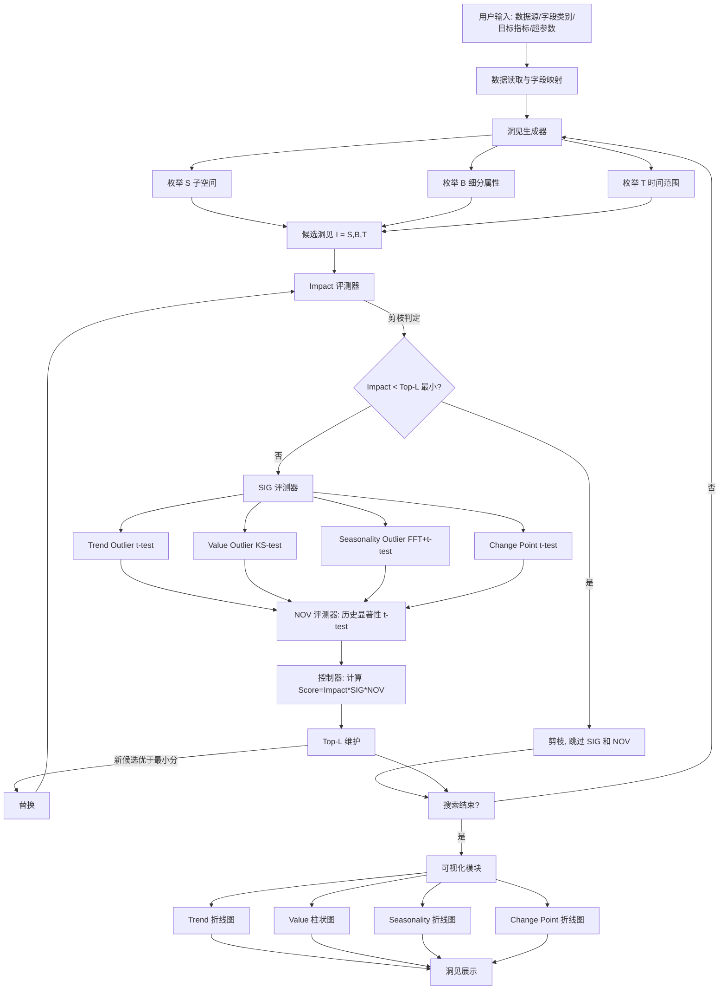
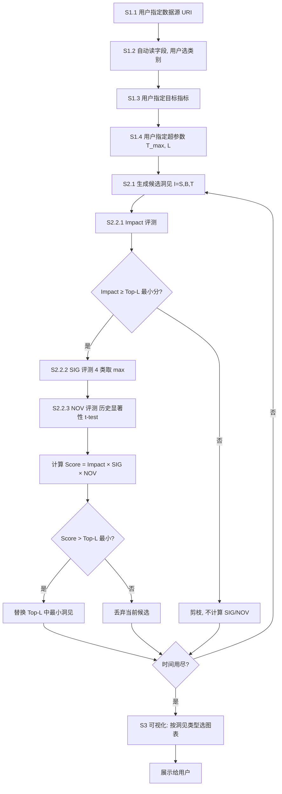

# 一种多维度时间序列数据的自动洞见发现方法（CN113722616A）

> 申请人：北京必示科技有限公司  
> 申请日：2021-09-24  
> 公开/授权日：2021-11-30（申请公布日 2021-11-30，发明专利申请公布）  
> IPC分类号：G06F 16/9537 (2019.01); G06F 16/9538 (2019.01); G06F 16/955 (2019.01); G06F 16/957 (2019.01)  
> 发明人：曹立、隋楷心、刘大鹏、蒋鹏杰  
> 关联文档：同目录下 CN113722616A.pdf

## 一、文档信息速览

| 字段 | 值 |
|---|---|
| 专利号 | CN113722616A |
| 类型 | 发明专利申请（A，公开未授权） |
| 申请号 | 202111118231.9 |
| 申请日 | 2021-09-24 |
| 公开号 | CN113722616A（公布日 2021-11-30） |
| 申请人 | 北京必示科技有限公司 |
| 发明人 | 曹立、隋楷心、刘大鹏、蒋鹏杰 |
| IPC | G06F 16/9537; G06F 16/9538; G06F 16/955; G06F 16/957 |
| 专利代理机构 | 北京中知法苑知识产权代理有限公司 11226 |
| 代理人 | 陈俊由 |
| 权利要求页数 | 3 页 |
| 说明书页数 | 8 页 |
| 附图页数 | 3 页 |
| 法律状态 | 实质审查中（申请公布后进入实审） |

## 二、背景（Background）

在企业 IT 系统中，每天会产生大量的"事件"（event），每个事件被记录为一条日志，描述了系统中发生的一个动作（如用户请求、支付回调、订单生成等）。每条日志包含若干字段，可分为三类：

- **时间戳（Timestamp）**：事件发生的时间，1 个字段。
- **属性（Dimension / Attribute）**：描述事件的离散特征，如品牌、车型、操作系统、地区、用户等级等，至少 1 个字段。
- **指标（Measure / Metric）**：描述事件在某个连续维度上的表现，如销售额、响应时间、错误率等，至少 1 个字段。

对于每一种"属性组合 + 指标"，可以汇聚得到一条**多维度时间序列（Multi-dimensional Time Series）**。例如，"(国家=中国, 省份=北京, 渠道=App, 指标=销售量)"构成一条以时间为横轴、销售量为纵轴的时序。

软件工程师与运维工程师在生产实践中**高度关注多维度时序数据中"不同寻常"的地方**——即"洞见（Insight）"——因为这些洞见往往反映了系统的真实故障或异常模式。例如：

- 某台服务器（10.1.238.3）上 iPad 端服务的错误率随时间持续上升 → 反映该服务存在故障。
- 某品牌某车型在某地区的销量异常下降 → 业务异常信号。

**传统人工分析的痛点**：

1. **维度组合数指数增长**：假设有 3 个属性，每个属性 5 个取值，则维度组合数 = $5^3 = 125$ 种，每种都要单独分析。
2. **依赖人工操作与判断**：当前工程师多在 Excel 中手动筛选特定维度组合，做聚合后再画图判断。
3. **耗费大量人力与时间成本**：每次搜索都需要重复的"选维度 → 聚合 → 可视化 → 判断"流程。
4. **评价标准混乱**：不同工程师对"洞见"的主观判断不一致，难以规模化复用。

**因此，本发明要解决的核心问题**：能否让系统**自动**从多维度时序数据中挖掘出"值得关注的"洞见，并以可视化方式呈现给用户，节省人力与时间。

## 三、目的（Purpose / Problems Solved）

- **痛点 1 → 解决方案**：洞见定义主观、不统一。**方案**：将洞见形式化为三元组 $I = (S, B, T)$，用数学语言抽象表达。
- **痛点 2 → 解决方案**：洞见评估标准混乱。**方案**：从三个维度量化洞见"值得关注的程度"——**影响范围（Impact）**、**显著性（Significance）**、**新颖性（Novelty）**，并加权和为"洞见分数"。
- **痛点 3 → 解决方案**：搜索效率低（维度组合指数增长）。**方案**：引入"剪枝"——在 Impact 评测后即与当前 Top-L 最小分比较，过滤掉不可能进入 Top-L 的候选。
- **痛点 4 → 解决方案**：洞见类型多样，难统一处理。**方案**：统一抽象为 4 类基本洞见——Trend Outlier / Value Outlier / Seasonality Outlier / Change Point，每类分别计算显著性。
- **痛点 5 → 解决方案**：可视化方式与洞见类型不匹配。**方案**：根据洞见类型自动选用对应的可视化图表（4 种）。

## 四、核心原理（Principles）

### 4.1 系统总览

本发明构建了一个"**用户输入 → 形式化 → 并行评测 → 控制器 → 可视化**"的洞见发现流水线。具体而言：

1. 用户指定数据源（CSV/Excel/DB URI）并自动识别字段类别（时间戳/属性/指标/忽略）。
2. 用户指定目标指标与超参数（最大搜索时间、最多展示洞见数 L）。
3. 系统通过"洞见生成器"不断生成候选洞见三元组 $(S, B, T)$。
4. 候选洞见被并行送到"影响范围评测器"、"显著性评测器"、"新颖性评测器"中分别打分。
5. 控制器持续记录 Top-L 分数最高的洞见。
6. 搜索结束后，将 Top-L 洞见按其类型对应的方式可视化呈现。

### 4.2 关键概念定义

- **多维度时间序列（Multi-dimensional Time Series）**：由一个或多个属性组合 + 一个指标构成的时间序列。
- **洞见（Insight）**：多维度时序中"不同寻常"且"值得工程师关注"的数据模式。
- **三元组 $I = (S, B, T)$**：洞见的形式化表达。
  - $S$（Subspace 数据子空间）：洞见影响的数据的属性范围，即一组 (属性, 取值) 的 AND 集合。
  - $B$（Breakdown 细分属性）：洞见在哪个属性上做了细分，分析该属性每个取值的指标情况。
  - $T$（Time Range 时间范围）：洞见影响的数据的时间范围，可以是单点也可以是区间。
  - $B$ 和 $T$ 可以为空。
- **影响范围（Impact）**：洞见影响的数据条目数占所有数据条目数的比例。
- **显著性（Significance）**：洞见展现的数据不符合工程师"固有认知"的程度。
- **新颖性（Novelty）**：洞见与历史上同位置洞见的差异程度（首次出现得高分）。
- **洞见分数（Insight Score）**：影响范围 × 显著性 × 新颖性的乘积。
- **零假设（Null Hypothesis）**：工程师的"固有认知"对应的假设，用于显著性计算。
- **4 类基本洞见类型**：
  - **Trend Outlier**：某属性取值的时间序列趋势与其他取值显著不同。
  - **Value Outlier**：某属性取值的指标值明显大于其他。
  - **Seasonality Outlier**：某属性取值的周期与其他显著不同。
  - **Change Point**：时间序列中存在突变点。

### 4.3 数学原理

**1) 三元组形式化**

$$
I = (S, B, T)
$$

**2) 影响范围（Impact）**

$$
\text{Impact}(I) = \frac{\text{COUNT}(I)}{\text{COUNT}(*)}
$$

其中 $\text{COUNT}(I)$ 为属性取值满足 $S$ 且时间范围在 $T$ 内的所有数据条目数，$\text{COUNT}(*)$ 为总数据条目数。

**3) 显著性（Significance，4 类基本洞见的统一定义）**

$$
\text{SIG}(I) = \max\bigl(\text{SIG}_{Trend},\ \text{SIG}_{Value},\ \text{SIG}_{Seasonality},\ \text{SIG}_{Change}\bigr)
$$

每种类型的显著性都基于假设检验 + t-test 的 p-value：

$$
\text{SIG}_{type}(I) = 1 - p_{value}
$$

- **Trend Outlier**：对每个属性取值的时间序列做线性回归得到斜率（趋势），用 t-test 检验当前序列斜率是否与其他序列斜率均值显著不同。显著性 = $1 - p$。
- **Value Outlier**：将所有属性取值的指标值排序，取最大值外其他做指数拟合得到预期分布，再检验最大值是否服从该分布。
- **Seasonality Outlier**：通过 DFT（离散傅里叶变换）得到每条序列的主周期作为周期，用 t-test 检验当前序列周期是否与其他序列周期均值显著不同。
- **Change Point**：计算每个时间点与上一时间点的变化量，依次用 t-test 检验该变化是否与其他时间点变化均值显著不同。

**4) 新颖性（Novelty）**

设当前分析时间窗为 $t$，历史时间窗为 $[t-w, t-1]$，则新颖性通过比较当前与历史的显著性：

$$
\text{NOV}(I) = 1 - t\_test\bigl(\text{SIG}_{t}(I),\ \text{SIG}_{t-w:t-1}(I)\bigr)
$$

**5) 洞见总分**

$$
\text{Score}(I) = \text{Impact}(I) \times \text{SIG}(I) \times \text{NOV}(I)
$$

### 4.4 与现有技术的差异

| 维度 | 现有技术（手动 Excel） | 本发明 |
|---|---|---|
| 洞见定义 | 主观、口语 | 形式化三元组 $(S, B, T)$ |
| 评估标准 | 凭经验 | 三维量化（Impact/SIG/NOV） |
| 搜索效率 | 手动遍历 | 自动化 + 剪枝 |
| 洞见类型 | 不分类 | 4 类（Trend/Value/Seasonality/Change） |
| 可视化 | 通用图表 | 按洞见类型定制 |
| 新颖性 | 不考虑 | 引入历史对比 |

## 五、算法详解（Algorithm）

### 5.1 输入 / 输出

- **输入**：用户指定的数据集（CSV/Excel/DB URI）、字段类别映射、目标指标、超参数（最大搜索时间 $T_{max}$，最大洞见数 $L$）。
- **输出**：Top-L 洞见三元组列表 + 对应的可视化图表。

### 5.2 伪代码

```python
def auto_insight_discovery(data_source, field_types, target_metric, T_max, L):
    """
    data_source: 路径/URI
    field_types: dict, {field_name: 'timestamp'|'attribute'|'measure'|'ignore'}
    target_metric: 字符串 或 Python lambda
    T_max: 最大搜索时间（秒）
    L: 最大展示洞见个数
    """
    start_time = time.time()
    top_L = MinHeap(L)  # 保持当前 Top-L 洞见
    cand_count = 0

    # 1) 洞见生成器：枚举所有 (S, B, T) 候选
    for S in enumerate_subspaces(data, field_types):
        for B in (None,) + enumerate_attributes(data, field_types, exclude=S):
            for T in (None,) + enumerate_time_ranges(data):
                if time.time() - start_time > T_max:
                    break

                I = (S, B, T)
                cand_count += 1

                # 2) 影响范围评测
                impact = COUNT(S, T) / COUNT(*)
                if top_L.full() and impact < top_L.min_score():
                    continue  # 剪枝：不可能进入 Top-L

                # 3) 显著性评测
                sig_trend = trend_outlier_test(S, B, T)
                sig_value = value_outlier_test(S, B, T)
                sig_season = seasonality_outlier_test(S, B, T)
                sig_change = change_point_test(S, B, T)
                sig = max(sig_trend, sig_value, sig_season, sig_change)

                # 4) 新颖性评测
                nov = novelty_test(I, t, t-w, t-1)

                # 5) 总分
                score = impact * sig * nov
                top_L.push((I, score, dominant_type=sig_argmax))

    # 6) 可视化
    for I, score, dom_type in top_L.items():
        if dom_type == 'trend':
            plot_trend_outlier(I)
        elif dom_type == 'value':
            plot_value_outlier(I)
        elif dom_type == 'seasonality':
            plot_seasonality_outlier(I)
        elif dom_type == 'change':
            plot_change_point(I)

    return top_L.items()

def trend_outlier_test(S, B, T):
    """B 维度上每个取值的斜率做 t-test vs. 其他序列"""
    slopes = []
    for v in unique_values(B):
        ts = time_series(data, S ∪ {B: v}, T)
        slope = linear_regression(ts).slope
        slopes.append(slope)
    p = t_test_against_mean(slopes)
    return 1 - p

def value_outlier_test(S, B, T):
    values = []
    for v in unique_values(B):
        v_agg = aggregate(data, S ∪ {B: v}, T, target_metric)
        values.append(v_agg)
    values_sorted = sorted(values)
    others = values_sorted[:-1]
    expected_dist = exp_fit(others)
    p = ks_test_against_dist(values_sorted[-1], expected_dist)
    return 1 - p

def seasonality_outlier_test(S, B, T):
    periods = []
    for v in unique_values(B):
        ts = time_series(data, S ∪ {B: v}, T)
        f = FFT(ts)
        period = 1.0 / argmax(abs(f))
        periods.append(period)
    p = t_test_against_mean(periods)
    return 1 - p

def change_point_test(S, B, T):
    ts = time_series(data, S, T)  # 无 B
    diffs = diff(ts)
    p = t_test_against_mean(diffs)
    return 1 - p

def novelty_test(I, t_current, t_start, t_end):
    sigs_history = [historical_score(I, ti) for ti in range(t_start, t_end)]
    sig_current = current_score(I, t_current)
    p = t_test(a=sigs_history, b=sig_current)
    return 1 - p
```

### 5.3 关键数学

- 三元组形式化（公式 1）。
- 影响范围（公式 2）。
- 显著性（公式 3、4）。
- 新颖性（公式 5）。
- 洞见总分（公式 6）。

### 5.4 复杂度分析

- 子空间枚举：$O(2^A)$ 指数级（A 为属性数），需剪枝。
- Impact 评测：$O(N)$，N 为数据条目数。
- SIG 评测（每类）：$O(K \cdot T)$，K 为 B 取值数，T 为时间窗长度。Trend/Seasonality 还需要 FFT $O(T \log T)$。
- NOV 评测：$O(w)$，w 为历史窗长度。
- 剪枝：若 Impact < Top-L 最小分，则跳过 SIG 和 NOV 计算，节省 $O(K \cdot T)$。

### 5.5 示例

数据：某汽车销售数据（Year, Brand, Category, Model, Sales）。目标指标 = Sales。

候选洞见 1：$I_1 = (\emptyset, \text{Model}, [2007, 2011])$ —— 探究每个 Model 在 2007-2011 的销售趋势。
- Trend Outlier 检测：BMW 3-Series 的销售从 142490 持续下降至 90960，斜率显著为负；BMW 7-Series 也下降但斜率不同。
- Score 较高，被选入 Top-L。
- 可视化：折线图，外 x 轴 = Model，内 x 轴 = Year，y 轴 = Sales。

候选洞见 2：$I_2 = (\{Brand=\times\times\times\}, \text{Category}, \text{null})$ —— 探究某品牌每个 Category 的总销量。
- Value Outlier 检测：Compact 销量（百万级）显著高于 Fullsize（万级）。
- Score 中等，被选入 Top-L。
- 可视化：柱状图，x 轴 = Category，y 轴 = Sales。

## 六、系统架构图（Architecture）



## 七、流程图（Process Flow）



## 八、关键创新点（Key Innovations）

- **+ 洞见的形式化表达**：三元组 $(S, B, T)$ 把"洞见"从主观印象抽象成可计算、可索引、可比较的数学对象。
- **+ 三维量化评估（Impact × SIG × NOV）**：从"影响范围"、"显著性"、"新颖性"三方面统一量化洞见分数，避免评价标准混乱。
- **+ 4 类基本洞见类型**：Trend Outlier、Value Outlier、Seasonality Outlier、Change Point 覆盖最常见的"不同寻常"模式，每类用对应的统计检验。
- **+ Impact 阶段剪枝**：利用 Impact ≤ 1 的事实，提前过滤不可能进入 Top-L 的候选，大幅提升搜索效率。
- **+ 类型感知的可视化**：根据洞见类型自动选图表（折线/柱状/频谱等），让用户一眼看到"哪里不同寻常"。

## 九、权利要求摘要（Claims Summary）

- **独立权利要求 1（方法）**：S1 用户指定数据集和超参数 → S2 形式化 + 评估方法搜索 Top-L 洞见 → S3 可视化展示。评估维度三方面：影响范围、显著性、新颖性。
- **独立权利要求 8（装置）**：接收模块 + 搜索模块 + 展示模块。
- **独立权利要求 9（设备）**：一个或多个处理器 + 存储装置。
- **独立权利要求 10（介质）**：计算机可读存储介质。
- **从属权利要求 2**：S1 详细步骤——指定 URI、自动读字段、字段分类、目标指标、超参数。
- **从属权利要求 3**：洞见形式化三元组 $(S, B, T)$ 定义。
- **从属权利要求 4**：S2 包括生成候选、评测、Top-L 记录。
- **从属权利要求 5**：S2.2 评测细节，Impact = COUNT(I) / COUNT(*)，SIG = max(各类型)，NOV = 1 - t-test p。
- **从属权利要求 6-7**：装置模块细节。

## 十、应用场景（Use Cases）

- **汽车销量分析**：Brand × Category × Model × Year × Sales，自动发现"某车型在某地区销量异常下降"等洞见。
- **电商大促异常监控**：SKU × 渠道 × 地区 × 时间 × GMV，自动发现"某渠道某地区销售额突变"洞见。
- **运维错误率分析**：服务器 IP × 服务 × 客户端 × 时间 × 错误率，自动发现"10.1.238.3 错误率持续上升"洞见。
- **A/B 测试效果评估**：实验组 × 时间 × 转化率，自动发现"实验组转化率在某个时间点突变"洞见。
- **金融交易异常发现**：账户 × 交易类型 × 时间 × 金额，自动发现"某类账户在某地区交易金额异常"洞见。
- **SaaS 用户行为洞察**：用户画像 × 功能 × 时间 × 使用时长，自动发现"某类用户某功能使用时长异常"洞见。
- **气象环境监控**：城市 × 指标（PM2.5、温度）× 时间，自动发现"某城市 PM2.5 突变"洞见。

## 十一、相关专利（Related Patents in this set）

- **CN113448808B** 一种批处理任务中单任务时间的预测方法（与本发明都涉及"时序数据自动分析"，但本发明专注于"洞见发现"而非"时长预测"）。
- **CN113568991B** 一种基于动态风险的告警处理方法（与本发明都关注"值得关注的异常"，但本发明基于多维数据，该发明基于告警拓扑）。
- **CN113806495A** 一种离群机器检测方法和装置（与本发明都涉及多维 KPI 的"离群/异常"检测，但本发明是"洞见分数"形式化，该发明是基于 DAG 的离群检测）。
- **CN113900844B** 一种基于服务码级别的故障根因定位方法（与本发明都基于多指标 + 图学习，但本发明是 Top-L 洞见，该发明是根因定位）。
- **CN113962273B** 一种基于多指标的时间序列异常检测方法（与本发明都涉及多维 KPI 时序，但本发明是"洞见"形式化，该发明是异常检测）。
- **CN114721861B** 一种基于日志差异化比对的故障定位方法（与本发明都关注"异常模式发现"，但本发明基于时序指标，该发明基于日志）。

## 十二、术语表（Glossary）

- **多维度时间序列（Multi-dimensional Time Series）**：由属性组合 + 指标构成的时序。
- **洞见（Insight）**：多维时序中"不同寻常"且"值得工程师关注"的数据模式。
- **三元组 $(S, B, T)$**：洞见的形式化表达——S 子空间、B 细分属性、T 时间范围。
- **Impact（影响范围）**：洞见影响的数据条目占比。
- **SIG（显著性）**：洞见不符合"固有认知"的程度。
- **NOV（新颖性）**：洞见相对历史的差异程度。
- **Trend Outlier**：趋势离群。
- **Value Outlier**：值离群。
- **Seasonality Outlier**：周期性离群。
- **Change Point**：突变点。
- **t-test**：学生 t 检验，用于判断样本均值是否显著不同。
- **DFT（Discrete Fourier Transform）**：离散傅里叶变换，用于提取周期。
- **LDA（Latent Dirichlet Allocation）**：主题模型，本批次另一专利 CN114721861B 用到此技术。
- **剪枝（Pruning）**：在搜索过程中提前过滤掉不可能进入 Top-L 的候选。

## 十三、参考与延伸阅读

- D. M. Blei, A. Y. Ng, M. I. Jordan, "Latent Dirichlet Allocation", JMLR 2003（LDA 主题模型经典论文）。
- 时间序列突变检测算法：PELT、BinSeg 等。
- 多维时序可视化参考：Apache Superset、Tableau、Power BI 中的"智能洞察"功能。
- 同批次必示专利 CN114721861B 也使用 LDA，是必示"自动发现异常模式"系列的重要补充。
- 工业级多维数据分析：Microsoft Power BI Insights、Looker、ThoughtSpot。
