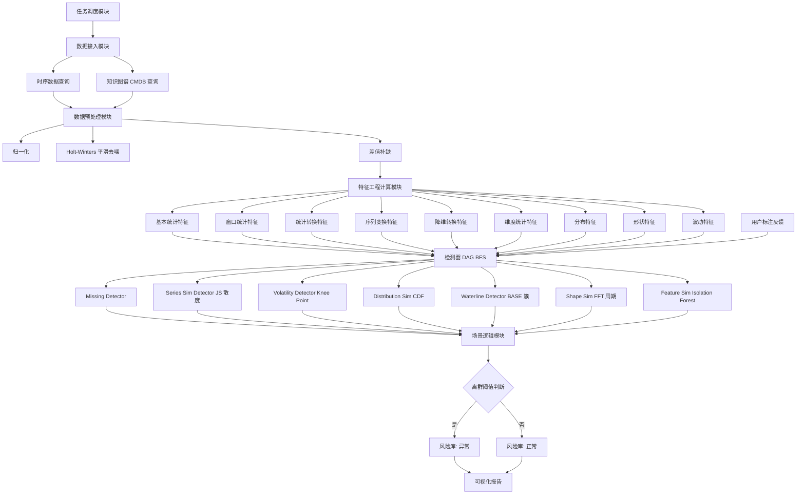
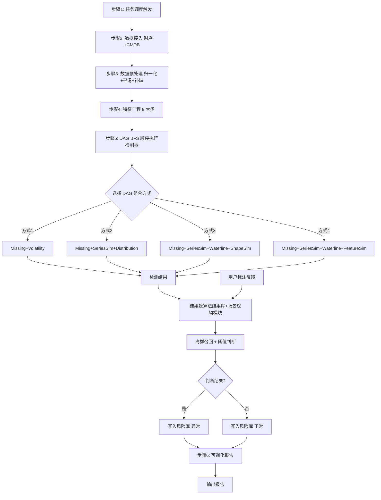

# 一种离群机器检测方法和装置（CN113806495A）

> 申请人：北京必示科技有限公司  
> 申请日：2021-10-19  
> 公开/授权日：2021-12-17（申请公布日 2021-12-17，发明专利申请公布）  
> IPC分类号：G06F 16/33 (2019.01); G06F 16/36 (2019.01); G06F 16/35 (2019.01); G06Q 10/06 (2012.01)  
> 发明人：程博、曹立、隋楷心、刘大鹏  
> 关联文档：同目录下 CN113806495A.pdf

## 一、文档信息速览

| 字段 | 值 |
|---|---|
| 专利号 | CN113806495A |
| 类型 | 发明专利申请（A，公开未授权） |
| 申请号 | 202111212495.0 |
| 申请日 | 2021-10-19 |
| 公开号 | CN113806495A（公布日 2021-12-17） |
| 申请人 | 北京必示科技有限公司 |
| 发明人 | 程博、曹立、隋楷心、刘大鹏 |
| IPC | G06F 16/33; G06F 16/36; G06F 16/35; G06Q 10/06 |
| 专利代理机构 | 北京华创智道知识产权代理事务所(普通合伙) 11818 |
| 代理人 | 彭随丽 |
| 权利要求页数 | 3 页 |
| 说明书页数 | 8 页 |
| 附图页数 | 6 页 |
| 法律状态 | 实质审查中 |

## 二、背景（Background）

在大型企业 IT 系统（金融、电信、云服务、电商）的运维实践中，"机器"（物理机/虚拟机/容器）数量动辄成百上千，每台机器上运行着不同的服务并产生大量 KPI（Key Performance Indicator）指标数据，如 CPU 利用率、内存占用、磁盘 I/O、网络流量、响应时间、错误率、QPS 等。

在这些机器群中，**总会有少数几台机器的指标表现"与众不同"**——例如：
- 一台 Web 服务器的 QPS 突然远低于集群均值；
- 一台数据库服务器的慢查询数量远高于其他节点；
- 一台消息队列的延迟水位线持续上升。

这些"与众不同"的机器被称为"**离群机器（Outlier Machine）**"。如果能及时识别出离群机器，运维就能定位到潜在故障，避免"小问题拖成大故障"。

**现有离群机器分析的两类思路及不足**：

1. **针对离群点进行分析**：n-sigma、箱形图、Isolation Forest、XGBoost 等。这些方法通用性强，但难以针对特定业务场景优化。
2. **基于指标相似性判断 + 聚类**：利用聚类判断离群。但**不同指标形态差别非常大**（有的平稳、有的剧烈波动、有的呈周期性、有的稀疏、有的有趋势），同时离群情况也多种多样（数据缺失、水位线异常、周期异常、波动异常、形状异常等），**单一算法往往不能取得准确结果**。

**因此，本发明要解决的核心问题**：能否构建一个"**解耦、灵活、可配置**"的离群机器检测框架，针对不同离群场景应用不同方法，并支持用户反馈优化？

## 三、目的（Purpose / Problems Solved）

- **痛点 1 → 解决方案**：单一算法难以适配多种离群场景。**方案**：将检测器拆分为 7 个独立模块（缺失值检测、序列相似性检测、波动检测、分布相似性检测、水位线检测、形状相似性检测、特征相似性检测），用户可自由组合。
- **痛点 2 → 解决方案**：检测流程不透明、难扩展。**方案**：使用 DAG（有向无环图）+ 广度优先遍历组织检测器，松耦合、可灵活配置。
- **痛点 3 → 解决方案**：黑盒深度学习算法难解释。**方案**：每个检测模块都基于经典统计/信号处理方法（JS 散度、FFT、Holt-Winters、Isolation Forest 等），可解释性强。
- **痛点 4 → 解决方案**：不同指标形态需要不同算法。**方案**：特征工程涵盖基本统计、窗口统计、统计转换、序列变换、降维转换、维度统计、分布、形状、波动九大类特征。
- **痛点 5 → 解决方案**：用户反馈无法被算法利用。**方案**：支持用户标注反馈至检测器，算法结果库接受标注后调整参数；多指标加权平均输出综合离群概率。

## 四、核心原理（Principles）

### 4.1 系统总览

本发明构建了一个"**任务调度 → 数据接入 → 数据预处理 → 特征工程 → 多检测器 DAG → 场景逻辑 → 风险库 → 可视化报告**"的离群机器检测流水线。系统接收"指定集群名称 + 分析时间范围"触发，依次从指标库和 CMDB 拉取数据，预处理后提取九大类特征，送入 DAG 组织的多个检测器（4 种默认组合方式之一），每个检测器召回异常机器，最终取并集作为离群机器结果并写入风险库。

### 4.2 关键概念定义

- **离群机器（Outlier Machine）**：在某个或多个 KPI 指标上表现显著不同于集群中其他机器的节点。
- **KPI 指标**：每台机器上采集的关键性能指标时序数据。
- **DAG 检测器组织**：将多个检测器按"有向无环图"组织，每个节点是一个检测器，边表示数据/结果流向。
- **广度优先遍历（BFS）**：DAG 的执行顺序。
- **检测器组合方式**：本发明给出 4 种默认组合——方式 1/2/3/4。
- **召回（Recall）**：检测器将异常机器从其候选集中拉出的操作，分"有放回"和"无放回"。
- **缺失离群（Missing Outlier）**：某机器的某些 KPI 数据缺失。
- **水位线离群（Waterline Outlier）**：某机器的某些 KPI 数值持续偏高或偏低。
- **周期性离群（Periodicity Outlier）**：某机器的某些 KPI 周期与其他机器不同。
- **波动离群（Volatility Outlier）**：某机器的某些 KPI 波动性异常。
- **形状离群（Shape Outlier）**：某机器的某些 KPI 时序形状与集群其他机器显著不同。
- **特征相似性（Feature Similarity）**：从多 KPI 提取综合特征后用 Isolation Forest 判断的离群。

### 4.3 数学原理

**1) JS 散度（序列相似性检测，公式 1）**

JS 散度是 KL 散度的对称化版本，用于衡量两条时序的相似度：

$$
\text{JS}(K_1 \parallel K_2) = \frac{1}{2}\text{KL}(K_1 \parallel M) + \frac{1}{2}\text{KL}(K_2 \parallel M)
$$

其中 $M = \frac{1}{2}(K_1 + K_2)$，KL 散度定义：

$$
\text{KL}(K_1 \parallel K_2) = \sum_{x} K_1(x) \log\frac{K_1(x)}{K_2(x)}
$$

**2) 周期计算（公式 2，FFT 频域法）**

$$
\text{Period} = \frac{1}{f^*}, \quad f^* = \arg\max_{f} |F(f)|
$$

其中 $F(f) = \text{FFT}[f(t)]$ 为时序的离散傅里叶变换。

**3) 相关系数（公式 3）**

$$
\rho = \frac{\text{Cov}(X, Y)}{\sqrt{\text{Var}_X \cdot \text{Var}_Y}}
$$

**4) 指数平滑三参数（Holt-Winters 趋势季节性，公式 4）**

$$
\begin{cases}
u_t = \alpha \cdot x_t + (1-\alpha)(u_{t-1} + v_{t-1}) \\
v_t = \beta \cdot (u_t - u_{t-1}) + (1-\beta) v_{t-1} \\
s_t = \gamma \cdot (x_t - u_t) + (1-\gamma) s_{t-L}
\end{cases}
$$

其中 $\alpha, \beta, \gamma \in [0, 1]$，分别控制近期数据影响、趋势影响、季节影响。

**5) 水位线检测（公式 5）**

$$
\text{Score} = \sum_{i=1}^{L} \left| \frac{K_i - \mu_{BASE}}{\sigma_{BASE}} \right|
$$

其中 $\mu_{BASE}$ 和 $\sigma_{BASE}$ 为基簇 BASE 的均值和标准差，$L$ 为序列长度。

**6) Isolation Forest 特征相似性**

对所有机器的 KPI 提取特征向量 $\mathbf{x}_i \in \mathbb{R}^d$，用 Isolation Forest 训练并输出异常分数。Isolation Forest 通过随机切分特征空间，平均路径长度越短的样本越可能是离群点。

### 4.4 4 种默认检测器组合方式

| 方式 | 检测器序列 |
|---|---|
| 方式 1 | 缺失值检测 → 波动检测 |
| 方式 2 | 缺失值检测 → 序列相似性检测 → 分布相似性检测 |
| 方式 3 | 缺失值检测 → 序列相似性检测 → 水位线检测 → 形状相似性检测 |
| 方式 4 | 缺失值检测 → 序列相似性检测 → 水位线检测 → 特征相似性检测 |

### 4.5 与现有技术的差异

| 维度 | 现有技术 | 本发明 |
|---|---|---|
| 算法组合 | 单一算法 | DAG 多检测器自由组合 |
| 算法类型 | 通用 ML | 7 类针对性统计/信号处理算法 |
| 可解释性 | 黑盒 | 经典方法 + 可视化佐证 |
| 用户反馈 | 不支持 | 标注反馈调整参数 |
| 特征工程 | 简单 | 9 大类综合特征 |
| 多指标融合 | 简单拼接 | 加权平均综合离群概率 |

## 五、算法详解（Algorithm）

### 5.1 输入 / 输出

- **输入**：集群名称、分析时间范围、巡检时间区间、配置（CMDB、检测器组合方式）。
- **输出**：离群机器列表（机器 ID + 离群分数 + 离群类型）、可视化报告。

### 5.2 伪代码

```python
def outlier_machine_detection(cluster_name, time_range, dag_mode='mode_3'):
    # 步骤 1: 任务调度
    task = schedule_detection(cluster_name, time_range)

    # 步骤 2: 数据接入
    metrics = query_metrics(task)
    cmdb = query_cmdb(cluster_name)
    raw = union(metrics, cmdb)

    # 步骤 3: 数据预处理
    normalized = minmax_normalize(raw)
    smoothed = holt_winters_denoise(normalized)
    filled = interpolate_missing(smoothed)

    # 步骤 4: 特征工程
    features = FeatureEngineer().compute(filled)
    # features = {
    #   'basic_stats': [mean, std, min, max, ...],
    #   'window_stats': [rolling_mean, rolling_std, ...],
    #   'stat_transform': [log, sqrt, ...],
    #   'series_transform': [fft, ...],
    #   'dim_reduction': [pca, ...],
    #   'dim_stats': [...],
    #   'distribution': [...],
    #   'shape': [...],
    #   'volatility': [...]
    # }

    # 步骤 5: 检测器 DAG（BFS 执行）
    detectors = build_dag(dag_mode)
    # mode_3 = [MissingDetector, SeriesSimDetector, WaterlineDetector, ShapeSimDetector]
    for det in bfs(detectors):
        result = det.run(features)
        result_db.save(det.name, result)
        scenario_logic.add(result, det.recall_mode)

    # 步骤 5 续: 场景逻辑
    recalled = scenario_logic.union_recall()
    for machine in recalled:
        if outlier_threshold_check(machine, dag_mode):
            risk_db.add(machine, status='abnormal')
        else:
            risk_db.add(machine, status='normal')

    # 步骤 6: 可视化报告
    report = visualize(risk_db, dag_results)
    return report


class MissingDetector:
    def run(self, features):
        result = {}
        for kpi in features:
            miss_ratio = count_missing(kpi) / len(kpi)
            if 0 < miss_ratio < THRESHOLD_MISS:
                result[kpi.machine] = outlier_score(miss_ratio)
        return result


class SeriesSimDetector:
    def run(self, features):
        # 1) 计算两两 KPI 的 JS 散度
        DM = js_divergence_matrix(features)
        # 2) SOM 聚类映射到 1D
        clusters = SOM(DM, n=1)
        return cluster_outliers(clusters)


class VolatilityDetector:
    def run(self, features):
        binary_series = []
        for kpi in features:
            # Knee Point 检测
            knee = knee_point_detection(kpi)
            binary_series.append(knee)
        return SeriesSimDetector().run(binary_series)


class WaterlineDetector:
    def run(self, features):
        # 选簇中元素最大项作为基簇 BASE
        BASE = max_cluster(features)
        U, L = upper_lower_band(BASE)
        score = sum(|K - mean(BASE)| / std(BASE) for K in features)
        return outlier_score(score)


class ShapeSimDetector:
    def run(self, features):
        # 周期性：FFT → 第一波峰位置 → 周期
        # 趋势性：协方差 / (VarX * VarY)^0.5 → 相关系数
        # 季节性：Holt-Winters 三参数指数平滑
        scores = []
        for kpi in features:
            period = 1.0 / argmax(abs(FFT(kpi)))
            trend_corr = corr(kpi, time_index)
            scores.append(anomaly_combined(period, trend_corr))
        return outlier_score(scores)


class FeatureSimDetector:
    def run(self, features):
        # Isolation Forest
        return IsolationForest().fit_predict(features)
```

### 5.3 关键数学

- JS 散度（公式 1）。
- 周期 FFT（公式 2）。
- 相关系数（公式 3）。
- Holt-Winters 三参数平滑（公式 4）。
- 水位线 score（公式 5）。
- Isolation Forest 路径长度。

### 5.4 复杂度分析

- 数据预处理：$O(N \cdot T)$，$N$ 机器数，$T$ 时间点数。
- 特征工程：$O(N \cdot T \cdot d)$，$d$ 特征维度。
- JS 散度计算：$O(N^2 \cdot T)$。
- SOM 聚类：$O(N^2 \cdot \text{iter})$。
- FFT：$O(T \log T)$ 每条 KPI。
- Isolation Forest：$O(t \cdot \psi \cdot d)$，$t$ 树数，$\psi$ 子采样大小。
- DAG 整体：取决于 DAG 拓扑，BFS 顺序遍历。

### 5.5 示例

以"Web 服务器集群离群检测"为例：
1. 集群包含 100 台机器，时间范围为最近 24 小时，KPI = QPS / 响应时间 / 错误率。
2. 数据接入：拉取所有机器 3 个 KPI 序列，连接 CMDB 拿到主机信息。
3. 预处理：min-max 归一化、Holt-Winters 平滑、缺失值填充。
4. 特征工程：9 大类特征 → 每个机器得到一个高维特征向量。
5. DAG 选择方式 3：Missing → SeriesSim → Waterline → ShapeSim。
6. 执行结果：机器 M23 缺失 30% 数据 → 缺失离群；机器 M47 与其他机器 JS 散度远高 → 序列离群；机器 M55 水位线 score 异常 → 水位线离群。
7. 多指标加权平均 → M23 / M47 / M55 三台机器离群概率高。
8. 写入风险库 → 触发告警 → 可视化报告。

## 六、系统架构图（Architecture）



## 七、流程图（Process Flow）



## 八、关键创新点（Key Innovations）

- **+ DAG + BFS 解耦可配置框架**：将离群检测任务建模为 DAG，用 BFS 顺序执行检测器节点，松耦合、按用户需求灵活组织和扩展，只需保证 DAG 拓扑。
- **+ 7 个针对性检测器**：缺失值、序列相似性（JS 散度）、波动（Knee Point + 二值序列）、分布相似性（CDF）、水位线（基簇 BASE）、形状（FFT + 趋势 + 季节）、特征相似性（Isolation Forest）。每类针对特定离群场景优化。
- **+ 9 大类综合特征工程**：覆盖基本统计、窗口统计、统计转换、序列变换、降维转换、维度统计、分布、形状、波动。
- **+ 可解释性 + 可视化佐证**：每个检测器有对应的可视化图（图 3 波动、图 4 分布、图 5 形状、图 6 报告），运维能直观看到离群原因。
- **+ 用户标注反馈机制**：用户可对检测结果标注"真离群/假离群"，算法结果库把标注反馈至检测器，自动调整参数；多指标加权平均输出综合离群概率。

## 九、权利要求摘要（Claims Summary）

- **独立权利要求 1（方法）**：包括 6 步骤——任务调度、数据接入、预处理、特征工程、检测器检测（含结果库 + 场景逻辑模块）、可视化报告输出。
- **独立权利要求 14（装置）**：检测装置包括存储器单元和处理器单元，处理器执行程序时实现上述方法。
- **从属权利要求 2**：特征计算结果包括 9 大类。
- **从属权利要求 3**：步骤 5 还包括用户标注反馈 + 离群召回 + 离群阈值判断。
- **从属权利要求 4**：检测器包括 7 类 + 4 种默认组合方式。
- **从属权利要求 5**：缺失值检测具体方式。
- **从属权利要求 6**：序列相似性检测使用 JS 散度。
- **从属权利要求 7**：波动检测使用 Knee Point + 序列相似性。
- **从属权利要求 8-11**：分布相似性、水位线、形状相似性、特征相似性检测的具体方式。
- **从属权利要求 12-13**：方法/装置的进一步实施例。

## 十、应用场景（Use Cases）

- **金融支付集群健康巡检**：每日对核心交易集群做离群机器扫描，提前发现 QPS 异常、错误率飙升的机器。
- **电信运营商核心网元监控**：基站/网元 KPI 时序离群检测，提前定位硬件/链路问题。
- **云服务 ECS 性能巡检**：百万级 ECS 实例的 CPU/内存/网络指标离群识别。
- **数据库集群主从同步异常**：检测主库写入延迟、备库复制延迟离群的节点。
- **消息队列水位线预警**：Kafka/RabbitMQ 各 partition 水位线离群节点发现。
- **Web 服务器响应时间异常**：Nginx 集群响应时间离群节点自动定位。
- **容器集群资源抢占检测**：Kubernetes Pod 资源使用离群识别。
- **大促前压力测试**：提前发现性能瓶颈机器，做容量规划。

## 十一、相关专利（Related Patents in this set）

- **CN113448808B** 一种批处理任务中单任务时间的预测方法（与本发明都涉及"集群机器预测"，但本发明是"离群检测"，该发明是"时长预测"）。
- **CN113568991B** 一种基于动态风险的告警处理方法（与本发明都涉及"异常处理"，但本发明是"机器离群"，该发明是"告警处理"）。
- **CN113722616A** 一种多维度时间序列数据的自动洞见发现方法（与本发明都涉及"多维 KPI 分析"，但本发明是"机器离群检测"，该发明是"洞见发现"）。
- **CN113900844B** 一种基于服务码级别的故障根因定位方法（与本发明都涉及"故障诊断"，但本发明是"机器层离群"，该发明是"调用根因"）。
- **CN113962273B** 一种基于多指标的时间序列异常检测方法（与本发明都涉及"多指标异常"，但本发明是"机器层 + 多种检测器"，该发明是"调用边异常"）。
- **CN114721861B** 一种基于日志差异化比对的故障定位方法（与本发明都涉及"故障定位"，但本发明是"指标层"，该发明是"日志层"）。

## 十二、术语表（Glossary）

- **离群机器（Outlier Machine）**：在某 KPI 上表现显著不同于集群其他机器的节点。
- **KPI（Key Performance Indicator）**：关键性能指标。
- **CMDB（Configuration Management Database）**：配置管理数据库。
- **DAG（Directed Acyclic Graph）**：有向无环图，本发明用于组织检测器。
- **BFS（Breadth-First Search）**：广度优先遍历。
- **JS 散度（Jensen-Shannon Divergence）**：KL 散度的对称化版本。
- **KL 散度（Kullback-Leibler Divergence）**：衡量两个概率分布的差异。
- **SOM（Self-Organizing Map）**：自组织映射神经网络，用于聚类。
- **CDF（Cumulative Distribution Function）**：累积分布函数。
- **FFT（Fast Fourier Transform）**：快速傅里叶变换，用于提取周期。
- **Holt-Winters**：三次指数平滑，含水平/趋势/季节三参数。
- **Knee Point**：曲线拐点检测算法。
- **Isolation Forest**：基于随机切分树路径长度的离群点检测算法。
- **Drain 算法**：日志模板提取算法。
- **PCA（Principal Component Analysis）**：主成分分析。
- **召回（Recall）**：将异常机器从候选集中拉出的操作。
- **基簇 BASE**：聚类结果中元素最多的簇，作为水位线计算的基准。

## 十三、参考与延伸阅读

- F. T. Liu, K. M. Ting, Z.-H. Zhou, "Isolation Forest", ICDM 2008（Isolation Forest 经典论文）。
- L. K. P. J. Enders, "Applied Econometric Time Series", Wiley（Holt-Winters 经典教材）。
- J. Lin, "Divergence Measures based on the Shannon Entropy", IEEE Trans. IT 1991（JS 散度）。
- T. Kohonen, "Self-Organizing Maps", Springer（SOM 经典教材）。
- 工业级 APM/NPM 工具：Datadog、Splunk、New Relic 中的离群检测模块。
- 同批次必示专利 CN113962273B 也使用图注意力机制处理多指标异常，是必示"多指标异常检测"系列的重要补充。
- 业务监控指标离群检测案例研究：Netflix Atlas、Uber Argus 等。
