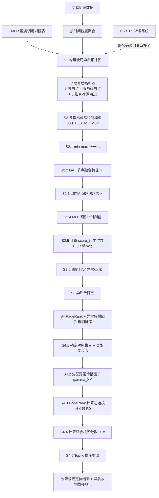
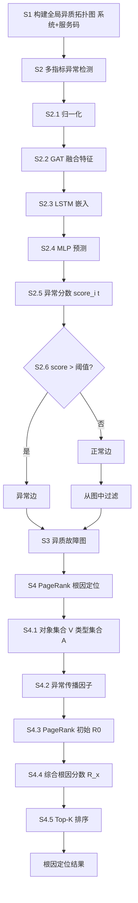

# 一种基于服务码级别的故障根因定位方法、系统及存储介质（CN113900844B）

> 申请人：北京必示科技有限公司  
> 申请日：2021-09-26  
> 公开/授权日：2024-07-09（申请公布日 2022-01-07，授权公告日 2024-07-09）  
> IPC分类号：G06F 11/07 (2006.01); G06N 20/00 (2019.01)  
> 发明人：沈梦家、曹立、隋楷心、刘大鹏、王继斌、张文池、吴楠、陈恒茂  
> 关联文档：同目录下 CN113900844B.pdf

## 一、文档信息速览

| 字段 | 值 |
|---|---|
| 专利号 | CN113900844B |
| 类型 | 发明专利（B，已授权） |
| 申请号 | 202111127982.7 |
| 申请日 | 2021-09-26 |
| 公开号 | CN113900844A（公布日 2022-01-07） |
| 授权公告号 | CN113900844B（授权公告日 2024-07-09） |
| 申请人 | 北京必示科技有限公司 |
| 发明人 | 沈梦家、曹立、隋楷心、刘大鹏、王继斌、张文池、吴楠、陈恒茂 |
| IPC | G06F 11/07; G06N 20/00 |
| 审查员 | 王健 |
| 权利要求页数 | 3 页（共 9 项权利要求） |
| 说明书页数 | 9 页 |
| 附图页数 | 3 页（6 张图） |
| 法律状态 | 已授权（2024-07-09） |

## 二、背景（Background）

随着云计算、服务计算等技术的快速发展，越来越多企业将应用程序和系统服务部署在分布式云环境或微服务架构中。分布式架构虽具备更好的扩展性和更低的成本，但同时引入了复杂的依赖关系——一次业务请求往往要经过"系统 A → ESB_F5 → 系统 B → 服务码 T1 → 服务码 T2 → 数据库"等多重调用。

为了保证系统高可用，应用程序提供商必须部署**链路监控系统**采集每个服务的 KPI（如网络响应时间、服务响应率、成功率）来处理复杂的分布式环境。然而，随着业务日益复杂、微服务规模日益增大，**故障发生时会产生大量告警**，运维人员仅依赖人工分析难以迅速排查关键告警和对应根因系统。

**现有技术的三大痛点**：

1. **粗粒度根因定位**：现有链路追踪监控系统多数仅采集**系统间**调用关系数据，基于系统层面的调用关系做根因定位，**未考虑系统调用的服务码关键信息**。结果是难以定位到细粒度的故障根源，且系统层级的数据聚合容易隐藏异常。
2. **单指标异常检测误报率高**：由于业务复杂性和周期性，固定阈值或 k-sigma 简单异常检测策略会存在较多误报/漏报。例如"响应率低于 90% 且时间超过 3 分钟"的规则在不同业务中效果不尽相同。且大部分异常检测算法仅针对**单一指标**进行检测触发告警，未考虑多 KPI 间复杂依赖关系，**异质拓扑结构中较细粒度的调用边的指标异常检测场景中误报率较高**。
3. **多级调用数据统一分析难**：学术和工业界多数采用同一级别的调用数据进行分析，但实际场景中涉及多种不同级别的调用数据（系统级 + 服务码级），情况更复杂。

**对比文件**：CN105160181 A (2015)、CN110888755 A (2020) 在说明书中被列为对比文件，均未同时实现"服务码级拓扑 + 多指标融合 + 异质图排序根因定位"。

## 三、目的（Purpose / Problems Solved）

- **痛点 1 → 解决方案**：系统级根因定位粒度太粗。**方案**：基于 CMDB 服务调用对照表，构建包括系统间调用关系和服务码间调用关系的**全局异质拓扑图**，并支持 ESB_F5 转发的服务码关系提取。
- **痛点 2 → 解决方案**：单指标异常检测误报率高。**方案**：构建基于**多维指标**的时间序列异常检测模型，通过**图注意力机制（GAT）** 融合多 KPI 关联特征，融合后用 LSTM+MLP 预测，再用中位数+四分位数标准化异常分数。
- **痛点 3 → 解决方案**：异质图中多对象类型根因难排序。**方案**：在异质故障图上采用基于**随机游走（PageRank）** 的对象级别排序算法，并引入**异常传播因子**区分不同对象类型间的传播权重差异。
- **痛点 4 → 解决方案**：无法直观看到故障范围。**方案**：从全局异质拓扑图过滤出仅显示异常调用边的**异质故障图**，运维一眼可辨故障范围。
- **痛点 5 → 解决方案**：根因定位结果不易理解。**方案**：将 Top-K 根因以可视化形式展示，辅助管理员高效定位。

## 四、核心原理（Principles）

### 4.1 系统总览

本发明构建了"**全局异质拓扑图构建 → 多指标 GAT+LSTM+MLP 异常检测 → 异质故障图生成 → 异质图 PageRank 根因排序**"四步流水线：

1. **S1 全局异质拓扑图构建**：基于 CMDB 服务调用对照表，把系统节点（应用层）和服务码节点（接口层）放入同一张图。
2. **S2 多指标异常检测**：对每条调用边的 n 个 KPI 指标（交易量/成功量/响应量/失败量/未响应量/成功率/响应率/响应时间），用 GAT 融合多指标关联特征 → LSTM 编码时序 → MLP 预测 → 异常分数 → 阈值判定。
3. **S3 异质故障图生成**：从全局图中过滤掉正常调用边，仅保留异常边。
4. **S4 异质图随机游走根因定位**：在异质故障图上跑 PageRank 得到每个对象的"枢纽值"作为初始根因分数；再结合不同对象类型间的异常传播因子，得到综合根因分数；取 Top-K 即可。

### 4.2 关键概念定义

- **全局异质拓扑图（Heterogeneous Topology Graph）**：包含多种节点类型（系统 S、服务码 T）的图，边表示调用关系。边上的时间序列指标由交易明细数据按时间粒度聚合。
- **调用边（Call Edge）**：从上游节点到下游节点的有向边，承载交易量/成功量/响应量/失败量/未响应量/成功率/响应率/响应时间等 KPI 指标。
- **服务码（Service Code）**：在金融、电信、电商系统中表示"具体服务/接口"粒度的标识符，比"系统"更细粒度。
- **图注意力机制（Graph Attention Network, GAT）**：通过注意力权重聚合邻居节点特征。
- **多指标融合特征（Fused Feature）**：通过 GAT 把多个 KPI 指标的特征加权聚合得到的特征。
- **异质故障图（Heterogeneous Fault Graph）**：从全局异质拓扑图中过滤掉正常调用边后剩下的子图。
- **对象类型映射函数（Object Type Mapping）**：把多种不同实例的同一类型对象映射到对象类型集合 A。
- **异常传播因子（Anomaly Propagation Factor, $\gamma_{XY}$）**：对象类型 X 与对象类型 Y 之间的异常传播权重。
- **枢纽值 / 初始根因分数 $R_a$**：通过 PageRank 迭代得到的每个对象的"被指向/指向权重"。
- **根因分数 $R_x$**：结合异常传播因子的综合根因分数。
- **ESB_F5**：企业服务总线系统（Enterprise Service Bus）的 F5 负载均衡转发组件。
- **衰减因子 $\varepsilon$**：根因分数计算中的衰减项。

### 4.3 数学原理

**1) GAT 节点融合特征 $h_i$（公式 1）**

$$
h_i = \sigma\Bigl(\sum_{j \in N(i)} \alpha_{ij} W \cdot v_j\Bigr)
$$

其中 $N(i)$ 为节点 $v_i$ 的邻居集合，$\sigma$ 为 sigmoid 激活函数，$v_j \in \mathbb{R}^w$ 为节点 $v_j$ 的 $w$ 维特征向量（$w$ 为时间窗口维度）。

**2) GAT 关联权重 $\alpha_{ij}$（公式 2）**

$$
\alpha_{ij} = \frac{\exp(e_{ij})}{\sum_{l \in N(i)} \exp(e_{il})}
$$

其中 $e_{ij} = \text{LeakyReLU}\bigl(\mathbf{a}^\top [W v_i \Vert W v_j]\bigr)$，$\Vert$ 为特征连接，$W$ 为可学习参数矩阵，$\mathbf{a}$ 为注意力向量。

**3) LSTM 编码 + MLP 预测**

融合特征 $h_i$（维度 $n \cdot w$）与原始序列特征（$n \cdot w$ 维）连接成 $n \cdot 2w$ 维，输入 LSTM 编码长期时序依赖，再输入 MLP 得 t 时刻预测值 $\hat{x}_i(t)$。

**4) MSE 损失函数**

$$
\mathcal{L}_{MSE} = \frac{1}{n} \sum_{i=1}^{n} \bigl(x_i(t) - \hat{x}_i(t)\bigr)^2
$$

**5) 异常分数 $score_i(t)$（公式 5/6/7）**

$$
dev_i(t) = |x_i(t) - \hat{x}_i(t)|
$$

$$
score_i(t) = \frac{dev_i(t) - \text{median}(dev)}{\text{IQR}(dev)}
$$

其中 median 为中位数、$\text{IQR} = Q_3 - Q_1$ 为四分位距。**注意：使用中位数+IQR 而非均值+标准差，能更好地抵抗异常值，鲁棒性更强。**

**6) 调用边异常判定**

若 $score_i(t) > \tau$（预设阈值），则调用边为异常。

**7) PageRank 初始根因分数 $R_a$**

$$
R_a = (1 - d) + d \sum_{v \to a} \frac{R_v}{L(v)}
$$

其中 $d$ 为阻尼因子，$L(v)$ 为节点 $v$ 的出链数。

**8) 综合根因分数 $R_x$（核心创新，公式 8）**

$$
R_x = R_x^0 \cdot \prod_{Y \in A, Y \neq X} \gamma_{XY}^{\,m_{xY}} \cdot (1 + \varepsilon)
$$

其中 $R_x^0$ 为 PageRank 初始根因分数，$m_{xY}$ 为邻接矩阵元素（对象 $x$ 与类型 $Y$ 的关系数），$\gamma_{XY}$ 为对象类型 $X$ 与 $Y$ 之间的异常传播因子，$\varepsilon$ 为衰减因子。

### 4.4 与现有技术的差异

| 维度 | 现有技术 | 本发明 |
|---|---|---|
| 拓扑粒度 | 仅系统间调用 | 系统 + 服务码异质图 |
| 异常检测 | 单指标固定阈值 | 多指标 GAT + LSTM 融合 |
| 根因算法 | 简单相关性 | PageRank + 异常传播因子 |
| 异常分数标准化 | 均值+标准差 | 中位数+四分位数（鲁棒） |
| 故障呈现 | 告警列表 | 异质故障图 + Top-K 排序 |

## 五、算法详解（Algorithm）

### 5.1 输入 / 输出

- **输入**：CMDB 服务调用对照表 + 交易明细数据 + 时间粒度。
- **输出**：Top-K 根因对象列表（系统/服务码）+ 异质故障图可视化 + 异常边检测结果。

### 5.2 伪代码

```python
def root_cause_localization(cmdb, transactions, time_granularity='1min', top_k=5):
    # S1: 构建全局异质拓扑图
    G = HeterogeneousGraph()
    for s in cmdb.systems:
        G.add_node(s, type='system')
    for t in cmdb.service_codes:
        G.add_node(t, type='service_code')
    for call in cmdb.call_relations:
        edge = transactions_to_timeseries(call, time_granularity)
        # 8 个 KPI: 交易量/成功量/响应量/失败量/未响应量/成功率/响应率/响应时间
        G.add_edge(call.upstream, call.downstream, kpis=edge)

    # S2: 多指标异常检测
    anomaly_model = GATLSTMMLP(in_dim=time_window, n_metrics=8)
    optimizer = Adam(lr=1e-3)
    for epoch in range(EPOCHS):
        for edge in G.edges:
            ts = edge.kpis  # (T, 8)
            ts_norm = minmax_scale(ts)  # S2.1
            # 视为 n=8 个节点
            H = anomaly_model.gat(ts_norm)  # S2.2 节点融合特征
            embed = anomaly_model.lstm(H, ts_norm)  # S2.3
            pred = anomaly_model.mlp(embed)  # S2.4
            loss = mse_loss(pred, ts_norm)  # MSE
            loss.backward(); optimizer.step()
    # 异常分数
    for edge in G.edges:
        pred = anomaly_model.predict(edge.kpis)
        dev = abs(edge.kpis - pred)
        score = (dev - median(dev)) / IQR(dev)  # S2.5
        edge.is_anomaly = (score > THRESHOLD)  # S2.6

    # S3: 异质故障图
    G_fault = G.subgraph(edges_where(is_anomaly=True))

    # S4: 异质图 PageRank 根因定位
    S4_1: V = G_fault.nodes; A = set(type(v) for v in V)  # 对象类型集合
    S4_2: gamma = { (X, Y): propagation_factor for X, Y in A }  # 异常传播因子（专家或模拟退火学习）
    S4_3: R0 = pagerank(G_fault, damping=0.85)  # 初始根因分数
    S4_4: R = {x: R0[x] * product(gamma[(type(x), Y)]^m_xy for Y in A if Y != type(x)) * (1 + eps) for x in V}
    S4_5: top_k = sorted(R.items(), key=lambda x: -x[1])[:top_k]

    return top_k, G_fault
```

### 5.3 关键数学

- GAT 节点融合（公式 1）。
- GAT 关联权重 softmax（公式 2）。
- 异常分数（中位数 + IQR 标准化，公式 5）。
- PageRank（公式 7）。
- 综合根因分数（公式 8，核心创新）。

### 5.4 复杂度分析

- 拓扑图构建：$O(V + E)$，$V$ 节点数，$E$ 边数。
- min-max 归一化：$O(E \cdot T \cdot n)$。
- GAT：$O(E \cdot n^2 \cdot d)$，$d$ 特征维度。
- LSTM 训练：$O(E \cdot T \cdot d^2)$。
- 异常分数计算：$O(E \cdot n \cdot T)$。
- PageRank：$O(\text{iter} \cdot E)$。
- 综合根因分数：$O(|A|^2 \cdot V)$。

### 5.5 示例

以金融支付系统的"某交易码支付失败率突增"为例：
1. 拓扑图：系统 S1（支付网关）、S2（账户）、S3（风控）、S4（清结算），服务码 T1（创建订单）、T2（账户校验）、T3（风控决策）、T4（清分）。
2. 交易明细聚合到 1 分钟粒度的 8 个 KPI 时序。
3. 异常检测：S1→T2 调用边 score 异常 → 异质故障图保留 S1、S2、T1、T2。
4. PageRank 初始：S1 枢纽值 0.32、S2 枢纽值 0.41、T1 枢纽值 0.18、T2 枢纽值 0.27。
5. 异常传播因子：$\gamma_{S,S} = 1.0$、$\gamma_{S,T} = 0.8$、$\gamma_{T,T} = 0.6$、$\gamma_{T,S} = 1.2$（系统向服务码传播更显著）。
6. 综合根因分数：S1 最高 → 根因为"系统 S1 异常"。
7. Top-1 = S1 支付网关，运维直接定位。

## 六、系统架构图（Architecture）



## 七、流程图（Process Flow）



## 八、关键创新点（Key Innovations）

- **+ 系统+服务码异质拓扑图**：用异质图同时表达系统级和服务码级调用关系，比单一系统级图粒度更细、比单一服务码图更全面。
- **+ GAT 融合多指标关联特征**：通过图注意力机制学习节点融合特征，捕获多 KPI 间的复杂依赖，比单指标检测误报率显著降低。
- **+ 中位数 + IQR 标准化异常分数**：相比传统均值+标准差，更能抵抗异常值干扰，鲁棒性强（实验证明表现最优）。
- **+ PageRank + 异常传播因子的异质图根因排序**：PageRank 给出初始枢纽值，异常传播因子显式建模不同对象类型间传播权重的差异性，最终根因分数公式既考虑节点结构又考虑类型间关系。
- **+ ESB_F5 转发场景适配**：通过 CMDB 服务调用对照表补全 ESB_F5 转发的服务码关系，兼容金融/电信常见架构。

## 九、权利要求摘要（Claims Summary）

- **独立权利要求 1（方法）**：S1 全局异质拓扑图 → S2 多指标异常检测 → S3 异质故障图 → S4 PageRank 根因定位。
- **独立权利要求 8（系统）**：对应系统模块——全局异质拓扑图生成模块、异常检测模块、异质故障图生成模块、故障根因定位模块。
- **独立权利要求 9（介质）**：存储介质。
- **从属权利要求 2**：调用边由交易明细 + 时间粒度聚合，KPI 至少包含交易量/成功量/响应量/失败量/未响应量/成功率/响应率/响应时间中的两种或多种组合。
- **从属权利要求 3**：GAT 节点融合特征 + 关联权重的具体公式。
- **从属权利要求 4**：S4 包括 S4.1-S4.5 五步——对象集合 + 类型集合 + 异常传播因子 + PageRank + 综合根因分数 + Top-K。
- **从属权利要求 5**：异常传播因子通过专家知识或模拟退火优化学习。
- **从属权利要求 6**：综合根因分数 $R_x$ 的具体公式。
- **从属权利要求 7**：Top-K 根因以可视化形式展示。

## 十、应用场景（Use Cases）

- **金融支付系统根因定位**：交易码粒度异常（如 T2 账户校验服务）→ 快速定位到根因系统（账户系统 S2）。
- **证券交易链路根因**：从下单→风控→撮合→清算全链路，准确定位到失败交易码对应的服务。
- **电信运营商 BSS 系统**：CRM、计费、账务系统级根因 + 服务码级根因。
- **电商大促系统根因**：商品详情→购物车→订单→支付→物流全链路故障定位。
- **银行核心系统日终批处理异常**：多服务码调用链异常时精准定位根因服务。
- **保险核心业务系统**：投保→核保→承保→理赔全链路异常根因。
- **微服务架构 K8s 应用**：容器化部署下的服务码级根因。

## 十一、相关专利（Related Patents in this set）

- **CN113448808B** 一种批处理任务中单任务时间的预测方法（与本发明都涉及"异常预测"，但本发明是"根因定位"，该发明是"时长预测"）。
- **CN113568991B** 一种基于动态风险的告警处理方法（与本发明都涉及"故障处理"，但本发明是"根因定位"，该发明是"告警合并"）。
- **CN113722616A** 一种多维度时间序列数据的自动洞见发现方法（与本发明都基于"多指标"，但本发明是根因，该发明是洞见）。
- **CN113806495A** 一种离群机器检测方法和装置（与本发明都涉及"异常检测"，但本发明是"调用边异常"，该发明是"机器离群"）。
- **CN113962273B** 一种基于多指标的时间序列异常检测方法（与本发明在多指标 + 图注意力 + LSTM 思路上一致；本发明在此基础上增加了 PageRank 根因排序）。
- **CN114721861B** 一种基于日志差异化比对的故障定位方法（与本发明都涉及"故障定位"，但本发明基于"调用边指标"，该发明基于"日志模板"）。

## 十二、术语表（Glossary）

- **异质拓扑图（Heterogeneous Topology Graph）**：节点/边类型不唯一的图。
- **GAT（Graph Attention Network）**：图注意力网络。
- **CMDB（Configuration Management Database）**：配置管理数据库。
- **ESB_F5**：企业服务总线 F5 转发。
- **服务码（Service Code）**：细粒度服务/接口标识符。
- **调用边（Call Edge）**：上游节点到下游节点的有向边。
- **KPI（Key Performance Indicator）**：关键性能指标。
- **LSTM（Long Short-Term Memory）**：长短期记忆网络。
- **MLP（Multi-Layer Perceptron）**：多层感知机。
- **MSE（Mean Square Error）**：均方误差。
- **IQR（Interquartile Range）**：四分位距 $Q_3 - Q_1$。
- **PageRank**：基于链接结构的节点排序算法。
- **枢纽值（Hub Value）**：PageRank 输出的节点重要性。
- **异常传播因子（Anomaly Propagation Factor）**：异质对象类型间的传播权重。
- **ESB（Enterprise Service Bus）**：企业服务总线。
- **Top-K**：分数最高的前 K 个对象。
- **异质故障图（Heterogeneous Fault Graph）**：过滤正常边后的子图。

## 十三、参考与延伸阅读

- P. Veličković, G. Cucurull, A. Casanova, et al., "Graph Attention Networks", ICLR 2018（GAT 经典论文）。
- L. Page, S. Brin, R. Motwani, T. Winograd, "The PageRank Citation Ranking", 1999（PageRank 经典论文）。
- S. Hochreiter, J. Schmidhuber, "Long Short-Term Memory", Neural Computation 1997（LSTM 经典论文）。
- 同批次必示专利 CN113962273B 是本发明的"姊妹专利"——使用相同的 GAT + LSTM 思路但只做异常检测不做根因定位。
- 微服务调用链监控工具：Jaeger、Zipkin、SkyWalking、Pinpoint。
- 异常传播因子学习：基于历史故障的贝叶斯网络、Graph Neural Network 传播模型。
- 工业级根因定位框架：Microsoft Compass、IBM NetCool、阿里鹰眼。
